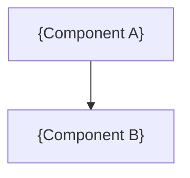

# {Project Name}: Architecture

<!--
Architecture template. Keep every level-2 heading below, in this order, even if a section is brief.
Replace {placeholders}. Delete these guidance comments once a section is written.
Architecture covers topology, boundaries, contracts, state and invariants. Component-level design,
library evaluation and sprint-level work belong in technical-backlog.md. Business intent belongs in vision.md.
-->

## 1. Context & Drivers

<!--
Summarise the architecturally significant drivers taken from vision.md and strategic-planning-backlog.md.
Reference, do not restate, the vision. Each driver should trace to a source section.
-->

| ID | Driver | Source |
| :--- | :--- | :--- |
| DR-1 | {Quality attribute, capability or phase goal that shapes the architecture} | {vision.md § / backlog item} |

## 2. Constraints

<!--
Fixed external constraints: Project Initiator context, platform, budget, regulatory or team limits.
Record Project Initiator-supplied constraints verbatim in a quote block and never remove them.
-->

### 2.1 Project Initiator Constraints

> {Verbatim Project Initiator context, or "None supplied."}

### 2.2 Derived Constraints

| ID | Constraint | Source |
| :--- | :--- | :--- |
| C-1 | {Constraint} | {Origin} |

## 3. Architectural Invariants

<!--
Non-negotiable rules the implementation must never violate. Use directive language ("must", "must not").
Keep hypotheses out of this section; they belong in Risks & Spikes.
-->

| ID | Invariant | Rationale | Verification |
| :--- | :--- | :--- | :--- |
| INV-1 | {The system must ...} | {Why} | {Test, check or observable that proves it holds} |

## 4. Component Topology

<!--
Components, their responsibilities and boundaries, and the deployment/process model.
Include at least one structural Mermaid diagram.
-->

| Component | Responsibility | Owns State | Depends On |
| :--- | :--- | :--- | :--- |
| {Component A} | {Single responsibility} | {Yes/No: what} | {Components} |

## 5. Data & State Model

<!--
Authoritative state, where it lives, its lifecycle, consistency guarantees and concurrency model.
Include a data-flow or state diagram where it clarifies ownership.
-->

### 5.1 State Ownership

| State | Owner | Storage | Consistency | Lifecycle |
| :--- | :--- | :--- | :--- | :--- |
| {Entity} | {Component} | {Store} | {Strong / eventual / …} | {Creation → retirement} |

### 5.2 Concurrency Model

{How work is scheduled, what runs in parallel, and how shared state is protected.}

## 6. Interfaces & Contracts

<!--
Boundary contracts between components and with external systems: protocol, direction, format,
versioning and failure semantics. Internal method signatures do not belong here.
-->

| Interface | Producer → Consumer | Protocol / Format | Failure Semantics | Versioning |
| :--- | :--- | :--- | :--- | :--- |
| {Name} | {A → B} | {e.g. in-process trait, gRPC, JSON over HTTP} | {Retry, idempotency, timeout} | {Policy} |

## 7. Technology Stack

| Concern | Selection | Rationale | Alternatives Considered |
| :--- | :--- | :--- | :--- |
| {Language / runtime / storage / messaging / observability} | {Choice} | {Why} | {See D-n} |

## 8. Operational Model

<!--
How the system is built, deployed, observed, recovered and upgraded (Day-2 realities).
-->

* **Build & Deploy:** {Approach}
* **Observability:** {Logs, metrics, traces, health signals}
* **Failure & Recovery:** {Expected failure modes and recovery path}
* **Upgrade & Migration:** {Schema / state / API evolution approach}

## 9. Decisions & Rejected Alternatives

<!--
Append-only decision log. Every rebutted Lead Developer finding must appear here as a Rejected entry
so later reviewers do not relitigate it. Supersede decisions instead of deleting them.
Status: Accepted | Rejected | Superseded by D-n.
-->

### D-1: {Decision title}

* **Status:** {Accepted | Rejected | Superseded by D-n}
* **Origin:** {Baseline | LD-n, iteration k}
* **Context:** {Problem or proposal considered}
* **Decision:** {What was decided}
* **Rationale:** {First-principles reasoning}
* **Reopen If:** {New evidence or condition that would justify revisiting}

## 10. Risks & Spikes

<!--
Strategic hypotheses and technical risks that need validation before or during implementation.
Every spike needs an explicit pass/fail threshold.
-->

| ID | Risk / Hypothesis | Impact | Spike | Pass Threshold | Fail Response |
| :--- | :--- | :--- | :--- | :--- | :--- |
| R-1 | {We hypothesise that ...} | {High/Med/Low} | {Proof of concept} | {Measurable criterion} | {Fallback or pivot} |

## 11. Open Questions

| ID | Question | Blocking | Owner / Next Step |
| :--- | :--- | :--- | :--- |
| Q-1 | {Unresolved architectural question} | {Yes/No: what it blocks} | {Spike, decision or upstream escalation} |
