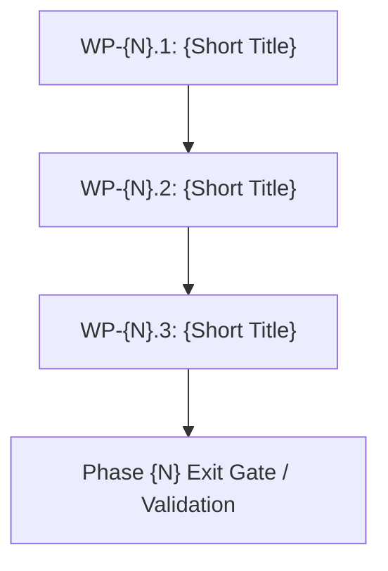

# Phase {N} Execution Plan: {Phase Name}

<!--
Phase Execution Plan Template. Keep every level-2 heading below, in this order.
Replace {placeholders}. Delete or trim guidance comments once a section is written.

This plan breaks down a named phase from strategic-planning-backlog.md into tightly scoped,
sequentially verifiable work packages. It references architecture.md, vision.md, and
technical-backlog.md rather than reproducing their content.
-->

## 1. Executive Summary & Deliverables Mapping

<!--
Extract the primary objective and core deliverables directly from strategic-planning-backlog.md.
Map each deliverable to the work package(s) responsible for implementing it.
-->

- **Primary Objective:** {Direct quote or concise summary of the phase objective from strategic-planning-backlog.md}
- **Target Gate / Milestone:** {Associated milestone, dogfooding gate, or validation target; state "None" if unassigned}

### Deliverable Traceability Matrix

| Core Deliverable (from Strategic Backlog) | Responsible Work Package(s) | Architecture / Technical References |
| :--- | :--- | :--- |
| {Deliverable 1: Summary} | {WP-N.1, WP-N.2} | {e.g. §4 Component Topology, TB-1, DR-2} |
| {Deliverable 2: Summary} | {WP-N.3} | {e.g. §5 Data Model, INV-1, C-3} |

---

## 2. Work Package Dependency Flow

<!--
Mermaid flowchart showing sequence, parallel streams, and handoffs between work packages,
leading to the final phase verification and exit gate.
-->



---

## 3. Work Package Specifications

<!--
Define 3 to 6 discrete, non-overlapping work packages.
Each package must define clear boundaries, target files/components, concrete implementation steps,
and deterministic proof criteria. Do not duplicate background theory—use references.
-->

### WP-{N}.1: {Work Package Title}

- **Goal & Scope:** {1-2 sentences stating exactly what is built and what is strictly out of scope.}
- **Governing Directives & References:** {Pointers to architectural drivers, invariants, constraints, or backlog tickets, e.g. DR-1, INV-2, TB-3, architecture.md §4.1}
- **Inputs & Preconditions:** {Preceding work package artifacts, schemas, environment configuration, or mocks required before work begins.}
- **Target Artifacts & Changes:**
  - Files / Modules: `{Path to files or directories to create/modify}`
  - Contracts / APIs / Interfaces: `{Signatures, routes, schema definitions, or interfaces}`
- **Implementation Tasks:**
  1. {Step 1: First concrete engineering action}
  2. {Step 2: Second concrete engineering action}
  3. {Step 3: Edge cases, configuration, or glue logic}
- **Verification & Proof Criteria:**
  - {Automated test commands, test suites, or verification scripts}
  - {Observable conditions, CLI executions, or assertions that definitively prove the work package delivered its requirements}

---

### WP-{N}.2: {Work Package Title}

- **Goal & Scope:** {1-2 sentences stating exactly what is built and what is strictly out of scope.}
- **Governing Directives & References:** {Pointers to architectural drivers, invariants, constraints, or backlog tickets.}
- **Inputs & Preconditions:** {Preceding work package artifacts, schemas, environment configuration, or mocks required before work begins.}
- **Target Artifacts & Changes:**
  - Files / Modules: `{Path to files or directories to create/modify}`
  - Contracts / APIs / Interfaces: `{Signatures, routes, schema definitions, or interfaces}`
- **Implementation Tasks:**
  1. {Step 1: First concrete engineering action}
  2. {Step 2: Second concrete engineering action}
  3. {Step 3: Edge cases, configuration, or glue logic}
- **Verification & Proof Criteria:**
  - {Automated test commands, test suites, or verification scripts}
  - {Observable conditions, CLI executions, or assertions that definitively prove the work package delivered its requirements}

---

## 4. Phase Verification & Exit Gate

<!--
Define the complete phase exit criteria. Include both individual package validations
and the integrated demonstration or benchmark proving the phase deliverable as a whole.
-->

### 4.1 Verification Checklist

- [ ] All work package tests and automated checks passing.
- [ ] Project linting, type-checking, and format checks pass cleanly with zero warnings/errors.
- [ ] Integration and contract tests between work packages execute successfully.

### 4.2 Gate / Milestone Demonstration

```bash
# Command(s) executing the end-to-end demonstration or validation harness for this phase
{command to run end-to-end demonstration}
```

- **Expected Output / Observable Criteria:** {Precise observable behavior, logs, or outputs that prove the primary objective has been achieved.}
