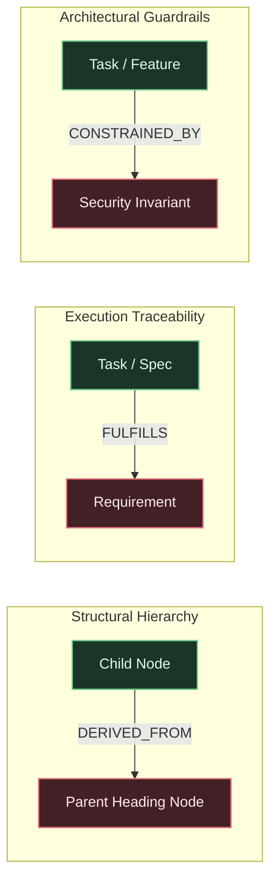
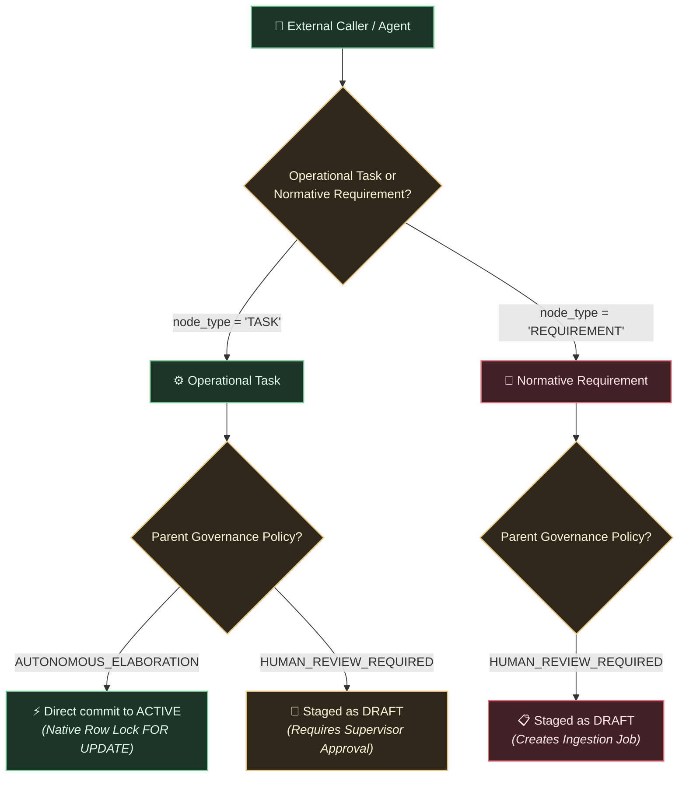

# Chapter 1: Mental Model & Core Architecture

To use the Knowledge Substrate effectively, you must understand how it differs from traditional documentation systems, wikis, and issue trackers.

---

## The Problem with Static Documentation

Modern software projects typically manage architectural guidelines, system invariants, and functional specifications through Markdown files in a repository (e.g. `docs/` or `RFCs/`). While convenient for humans to write, static documents suffer from severe structural weaknesses when consumed by autonomous coding agents and growing engineering teams:

1. **Silent Architectural Drift:** Codebases diverge from documentation over time. Because static text lacks runtime verification, developers and AI agents unknowingly violate core architectural constraints.
2. **Context Window Exhaustion:** Feeding entire 50-page markdown documents into an LLM context window causes attention degradation, hallucination, and prompt token bloat. Conversely, naïve vector RAG chunks text arbitrarily, severing causal hierarchies and context.
3. **Unchecked Multi-Agent Contention:** When multiple agents concurrently modify specifications or implement features, file-level Git diffs fail to catch topological conflicts, dependency inversions, and circular logic.
4. **Lack of Provenance and Auditability:** Once a requirement changes, identifying which downstream tasks or code implementations are stale requires manual, error-prone audits.

---

## The Solution: A Verified Causal Property Graph

The **Knowledge Substrate (TKS)** replaces static documentation with an active, queryable property graph stored directly in PostgreSQL with `pgvector`.

Instead of reading raw markdown files, agents and developers interact with a **Directed Acyclic Graph (DAG)** of architectural entities:

* **Nodes (`graph_nodes`):** Represent atomic requirements, architectural decisions, technical backlog items, and execution tasks.
* **Edges (`graph_edges`):** Standardized, typed relationships that always point **upward** toward governing requirements.
* **Audit Ledger (`audit_ledger`):** An immutable, append-only chronological record of every state transition and topological mutation.
* **Git Object Database (ODB):** A bare Git repository tracking the exact source markdown documents, ensuring zero duplication and 100% cryptographic provenance.

---

## Node Entities and Lifecycles

Every node in the substrate has a distinct type and lifecycle state:

### Node Types

| Node Type | Description | Example from TKS Governing Assets |
| :--- | :--- | :--- |
| `REQUIREMENT` | High-level architectural mandate or constraint. | `INV-1` (Ancestry Verification) from [`docs/vision/vision.md`](file:///workspaces/tks/docs/vision/vision.md) |
| `SPECIFICATION` | Technical design, protocol definition, or RFC detail. | `D-8` (Cycle Prevention via CTEs) from [`docs/vision/architecture.md`](file:///workspaces/tks/docs/vision/architecture.md) |
| `TASK` | Concrete unit of execution authored by human or agent. | Implement `downward_invalidation_sql` from [`docs/vision/technical-backlog.md`](file:///workspaces/tks/docs/vision/technical-backlog.md) (TB-6) |

### Lifecycle States

* `DRAFT`: Candidate entity proposed by an agent or mechanical parser. Staged for review or isolated inside an ephemeral branch workspace. Invisible to production queries unless explicitly requested.
* `ACTIVE`: Verified, authoritative requirement or active task. Traversed by production context envelopes and enforced by governance policies.
* `NEEDS_REVERIFICATION`: Degraded state triggered automatically when an upstream governing requirement is modified or rolled back. Tasks in this state must be reviewed and re-verified.
* `SUPERSEDED`: Historic requirement replaced by a newer version (e.g. when an updated document is ingested).
* `REVERTED`: Entity deactivated via administrative rollback (`revert_mutations`).

---

## Standardized Upward Edge Semantics

In TKS, all structural and governance edges strictly point **upward** toward the governing authority:

* **`DERIVED_FROM`:** Represents structural hierarchy. A sub-section or requirement points to its parent heading.
* **`FULFILLS`:** Represents task execution traceability. An execution task or technical specification points upward to the requirement it satisfies.
* **`CONSTRAINED_BY`:** Represents cross-cutting architectural constraints. A feature or task points upward to the invariant that governs it.

By strictly enforcing upward edge directions, TKS guarantees that recursive CTE traversals cannot enter infinite cycles and that topological distance accurately reflects governance hierarchy.

---

## The Core Invariants

The substrate operates under seven fundamental, non-negotiable architectural invariants:

1. **`INV-1` (Ancestry Verification):** No task or specification may transition to `ACTIVE` unless it has an unbroken upward path of active edges leading to an active root requirement. Unanchored orphan tasks are rejected.
2. **`INV-2` (Append-Only State Reconstruction):** State mutations write append-only records to `audit_ledger` with monotonically increasing `event_seq` and transaction correlation `batch_id`. Historic states can be deterministically replayed.
3. **`INV-3` (Zero In-Database Agent Execution):** The core database engine and gateway services never execute autonomous LLM cognitive loops internally. The substrate is strictly a deterministic state store and protocol gateway.
4. **`INV-4` (Cryptographic Source Anchoring):** Every requirement derived via document decomposition stores a Git commit hash, blob hash, and exact 0-based byte offsets (`byte_start`, `byte_end`) pointing to the original document in the Git ODB.
5. **`INV-5` (Explicit Per-Node Governance Authority):** Permissions to modify or elaborate a node are governed by explicit per-node metadata (`governance_policy`), taking precedence over global agent roles.
6. **`INV-6` (Self-Referential Bootstrapping & Multi-Agent Co-Evolution):** The substrate manages its own development through phased bootstrapping. It self-hosts its own vision, architecture, and backlog documents, and manages multi-agent feature development directly within branch workspaces.
7. **`INV-7` (Identity Attribution & Workspace Draft Isolation):** Every mutation is attributed to a verified caller identity recorded in the audit ledger. Candidate drafts elaborated in ephemeral branch workspaces are strictly confidential and isolated until atomically merged.

---

## Disambiguated Mutation Pathways

TKS clearly distinguishes between two fundamentally different types of changes:

1. **Autonomous Task Elaboration:** When an agent works under a parent node with `governance_policy = 'AUTONOMOUS_ELABORATION'`, it can create subtasks directly in `ACTIVE` state and advance their execution status (`OPEN` $\to$ `IN_PROGRESS` $\to$ `COMPLETED`) using native row locks (`FOR UPDATE`).
2. **Normative Requirement Proposals:** When an agent or human proposes altering a requirement or invariant (`governance_policy = 'HUMAN_REVIEW_REQUIRED'`), the mutation is staged in `DRAFT` state, linked to an ingestion job, and requires explicit supervisory review and approval before becoming active.
