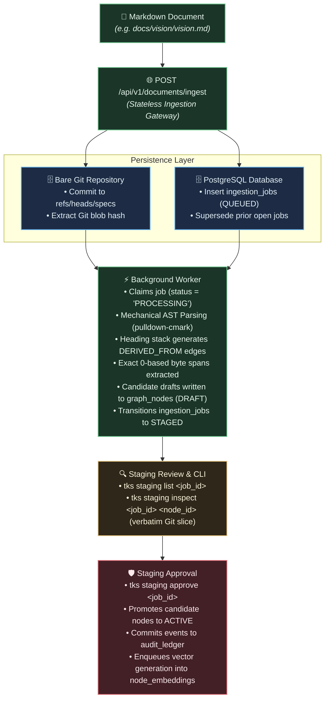

# Chapter 3: Ingesting Governing Documents

This chapter demonstrates how to ingest governing documents into the Knowledge Substrate using [`docs/vision/vision.md`](file:///workspaces/tks/docs/vision/vision.md) and [`docs/vision/architecture.md`](file:///workspaces/tks/docs/vision/architecture.md) as concrete examples.

---

## The Ingestion Pipeline

When a human or CI pipeline submits a Markdown document for ingestion, TKS executes a multi-stage pipeline designed for 100% mechanical determinism and cryptographic provenance:



---

## Step 1: Submitting a Document for Ingestion

Submit the document content to the ingestion endpoint:

```bash
# Ingest docs/vision/vision.md
curl -s -X POST "$TKS_SERVER_URL/api/v1/documents/ingest" \
  -H "Authorization: Bearer $TKS_AUTH_TOKEN" \
  -H "Content-Type: application/json" \
  -d "{
    \"doc_path\": \"specs/vision.md\",
    \"content\": $(jq -Rs . < docs/vision/vision.md)
  }"
```

Response:

```json
{
  "job_id": "8fb41f11-76a0-48e2-9b24-77a83d739811",
  "status": "QUEUED"
}
```

Behind the scenes:

1. **Git Commit:** The Git write actor commits the document to the bare Git repository at `refs/heads/specs:specs/vision.md`. This gives the document an immutable Git commit hash and blob hash.
2. **Job Record:** A row is inserted into `ingestion_jobs` with status `QUEUED`.
3. **Supersession Sweep:** If a prior open ingestion job existed for `specs/vision.md`, its partial drafts are cleaned up to prevent orphaned candidate rows.

---

## Step 2: Mechanical AST Parsing & Candidate Staging

The background decomposition worker continuously polls for `QUEUED` jobs. Once claimed:

1. **Streaming CommonMark Parser:** The worker processes the markdown text using `pulldown-cmark`. It mechanically parses headings (`H1` through `H4`), code blocks, bullet lists, and paragraphs.
2. **Heading Stack Hierarchy:** The parser tracks the heading stack to build parent-child upward hierarchy edges (`child -DERIVED_FROM-> parent_heading`).
3. **Deterministic Heading Anchors:** Each section receives a normalized anchor (e.g. `ast_anchor = "core-invariants"`).
4. **Exact Byte-Span Coordinates:** Exact 0-based byte offsets (`byte_start`, `byte_end`) are computed directly on the raw UTF-8 byte stream.
5. **Zero Token Cost:** Over 80% of the document decomposition is performed mechanically with zero LLM inference tokens.
6. **Draft Isolation:** Extracted atomic requirements are inserted into `graph_nodes` with `lifecycle_state = 'DRAFT'`, leaving production queries completely unaffected.

---

## Step 3: Staging Review via CLI

Administrators and developers review candidate drafts before they enter the active knowledge graph:

### List Candidate Drafts

```bash
cargo run --bin tks -- staging list 8fb41f11-76a0-48e2-9b24-77a83d739811
```

Output:

```text
Ingestion Job: 8fb41f11-76a0-48e2-9b24-77a83d739811
Document Path: specs/vision.md
Status:        STAGED
Candidate Nodes (7):
  - [REQUIREMENT] 0a11bc32-1200-47de-9851-bc0128490a1a: Invariant I-1 (Ancestry Verification)
  - [REQUIREMENT] 1b22cd43-2311-48ef-a962-cd1239501b2b: Invariant I-2 (Append-Only State Reconstruction)
  - [REQUIREMENT] 2c33de54-3422-49f0-ba73-de2340612c3c: Invariant I-3 (Zero In-Database Agent Execution)
  - [REQUIREMENT] 3d44ef65-4533-40a1-cb84-ef3451723d4d: Invariant I-4 (Cryptographic Source Anchoring)
  - [REQUIREMENT] 4e55fa76-5644-41b2-dc95-fa4562834e5e: Invariant I-5 (Explicit Per-Node Governance Authority)
  - [REQUIREMENT] 5f66ab87-6755-42c3-ed06-ab5673945f6f: Invariant I-6 (Self-Referential Bootstrapping)
  - [REQUIREMENT] 6a77bc98-7866-43d4-fe17-bc6784056a7a: Invariant I-7 (Agent Identity Attribution)
```

### Inspect Verbatim Source Span

To ensure accuracy, inspect a specific node. TKS reads the byte coordinates (`byte_start..byte_end`) and fetches the verbatim text slice directly from the Git ODB:

```bash
cargo run --bin tks -- staging inspect \
  8fb41f11-76a0-48e2-9b24-77a83d739811 \
  0a11bc32-1200-47de-9851-bc0128490a1a
```

Output:

```text
Node ID:        0a11bc32-1200-47de-9851-bc0128490a1a
Title:          Invariant I-1 (Ancestry Verification)
Type:           REQUIREMENT
Lifecycle:      DRAFT
Governance:     HUMAN_REVIEW_REQUIRED
Document Path:  specs/vision.md
Git Blob Hash:  f821e29c0a...
Byte Span:      [1420..1760] (340 bytes)

--- Verbatim Document Span ---
* **Invariant I-1 (Ancestry Verification):** The core database engine shall reject any
  transaction attempting to transition a task or specification to `ACTIVE` if the entity
  lacks an unbroken upward path of active governance edges leading to an active root
  requirement.
------------------------------
```

---

## Step 4: Staging Approval & Promotion

Once the candidate drafts are verified, approve the job:

```bash
cargo run --bin tks -- staging approve 8fb41f11-76a0-48e2-9b24-77a83d739811
```

Output:

```text
Successfully approved ingestion job 8fb41f11-76a0-48e2-9b24-77a83d739811:
  Promoted Nodes: 7
  Promoted Edges: 6
  Audit Batch ID: e41b77a0-0012-4211-9a71-c01178229a1b
  Vector Tasks:   7 enqueued
```

### What Happens During Approval?

1. **State Promotion:** All candidate draft nodes transition to `ACTIVE` in `graph_nodes`.
2. **Edge Activation:** Upward hierarchy edges (`DERIVED_FROM`) activate in `graph_edges`.
3. **Audit Ledger Commit:** Canonical audit records are appended to `audit_ledger` with monotonic sequence numbers (`event_seq`) and a shared `batch_id`.
4. **Vector Queueing:** Rows are upserted into `node_embeddings` with `status = 'PENDING'`. The background embedding worker immediately computes 384-dimensional dense vectors using FastEmbed/all-MiniLM-L6-v2 (<15ms per node) and updates `status = 'COMPLETED'`.
5. **Full-Text GIN Index:** PostgreSQL automatically updates the partial GIN index on `graph_nodes(search_tsv)` for sub-5ms full-text keyword retrieval.
