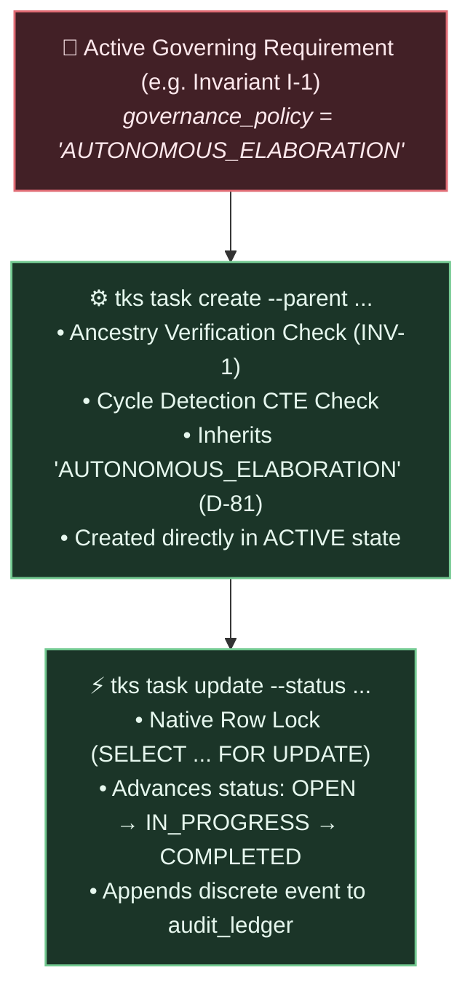

# Chapter 5: Task Elaboration & Autonomous Execution

This chapter walks through how autonomous agents break down high-level requirements into execution tasks, advance their statuses, and maintain complete audit traceability.

---

## The Autonomous Execution Loop

Once governing requirements are active in the substrate, external coding agents can autonomously elaborate subtasks under them without human supervisory gating:



---

## Step 1: Elaborating an Execution Task

Suppose an agent is assigned to implement the database constraint for Invariant I-1 (`0a11bc32-1200-47de-9851-bc0128490a1a`). The agent creates a task under this requirement:

### Create via CLI

```bash
cargo run --bin tks -- task create \
  --parent "0a11bc32-1200-47de-9851-bc0128490a1a" \
  --title "Implement Ancestry Verification CTE in src/storage/mutation.rs" \
  --content "Construct the recursive upward CTE ensuring unbroken paths to active requirements." \
  --assignee "gemini-developer"
```

### Create via MCP Tool

```json
{
  "name": "elaborate_task",
  "arguments": {
    "parent_id": "0a11bc32-1200-47de-9851-bc0128490a1a",
    "title": "Implement Ancestry Verification CTE in src/storage/mutation.rs",
    "description": "Construct the recursive upward CTE ensuring unbroken paths to active requirements."
  }
}
```

### Creation Response

```text
Task successfully created:
  ID:         4d99aa12-5501-44bb-9901-aa1122334455
  Title:      Implement Ancestry Verification CTE in src/storage/mutation.rs
  Type:       TASK
  Parent ID:  0a11bc32-1200-47de-9851-bc0128490a1a
  Status:     ACTIVE (TaskStatus: OPEN)
  Governance: AUTONOMOUS_ELABORATION
  Batch ID:   c891ff43-1122-44dd-9988-ee1122334455
```

### What Invariants Were Verified?

1. **`INV-1` Ancestry Check:** TKS checked that `parent_id` exists, is in `ACTIVE` state, and has an unbroken upward path to a requirement root.
2. **Cycle Prevention:** A recursive CTE ensured that attaching this task introduces no circular dependencies.
3. **Policy Inheritance (D-81):** Because the parent requirement has `governance_policy = 'AUTONOMOUS_ELABORATION'`, the newly created task automatically inherited this policy and transitioned directly to `ACTIVE` state, allowing the agent to begin work immediately without waiting for human review.

---

## Step 2: Listing & Filtering Tasks

Agents or engineering leads can inspect open tasks across requirements:

### List via CLI

```bash
# List all open tasks under Invariant I-1
cargo run --bin tks -- task list \
  --parent "0a11bc32-1200-47de-9851-bc0128490a1a" \
  --status "OPEN"
```

### List via REST API

```bash
curl -s -X GET "$TKS_SERVER_URL/api/v1/tasks?parent_id=0a11bc32-1200-47de-9851-bc0128490a1a&status=OPEN" \
  -H "Authorization: Bearer $TKS_AUTH_TOKEN"
```

Output:

```text
Tasks (1):
  - [OPEN] 4d99aa12-5501-44bb-9901-aa1122334455: Implement Ancestry Verification CTE in src/storage/mutation.rs
```

---

## Step 3: Advancing Task Execution Status

As the agent makes progress, it updates the task lifecycle:

### Starting Work (`IN_PROGRESS`)

```bash
cargo run --bin tks -- task update \
  4d99aa12-5501-44bb-9901-aa1122334455 \
  --status "IN_PROGRESS"
```

### Completing Work (`COMPLETED`)

```bash
cargo run --bin tks -- task update \
  4d99aa12-5501-44bb-9901-aa1122334455 \
  --status "COMPLETED"
```

### Concurrency and Locking Semantics

Updating a leaf task's execution status does **not** modify graph topology or add edges. Therefore:

* TKS acquires a native PostgreSQL row-level lock (`SELECT ... FOR UPDATE WHERE id = $1`) on the specific node in `graph_nodes`.
* It completely **bypasses** the global structural transaction advisory lock (`pg_advisory_xact_lock`).
* Hundreds of concurrent agents can update their respective leaf tasks simultaneously with zero lock contention or 32-bit hash collision bottlenecks.

---

## Step 4: Audit Ledger Verification

Every task creation and status transition automatically appends an immutable event to `audit_ledger`:

| `event_seq` | `entity_id` | `event_type` | `actor_id` | `delta` |
| :--- | :--- | :--- | :--- | :--- |
| `1042` | `4d99aa12...` | `NODE_CREATED` | `gemini-developer` | `{"node_type": "TASK", "parent_id": "0a11bc32..."}` |
| `1043` | `4d99aa12...` | `STATUS_CHANGED` | `gemini-developer` | `{"old_status": "OPEN", "new_status": "IN_PROGRESS"}` |
| `1044` | `4d99aa12...` | `STATUS_CHANGED` | `gemini-developer` | `{"old_status": "IN_PROGRESS", "new_status": "COMPLETED"}` |

The audit ledger provides total ordering via monotonic identity sequence `event_seq` and transaction correlation via `batch_id`, satisfying **Invariant I-2**.
