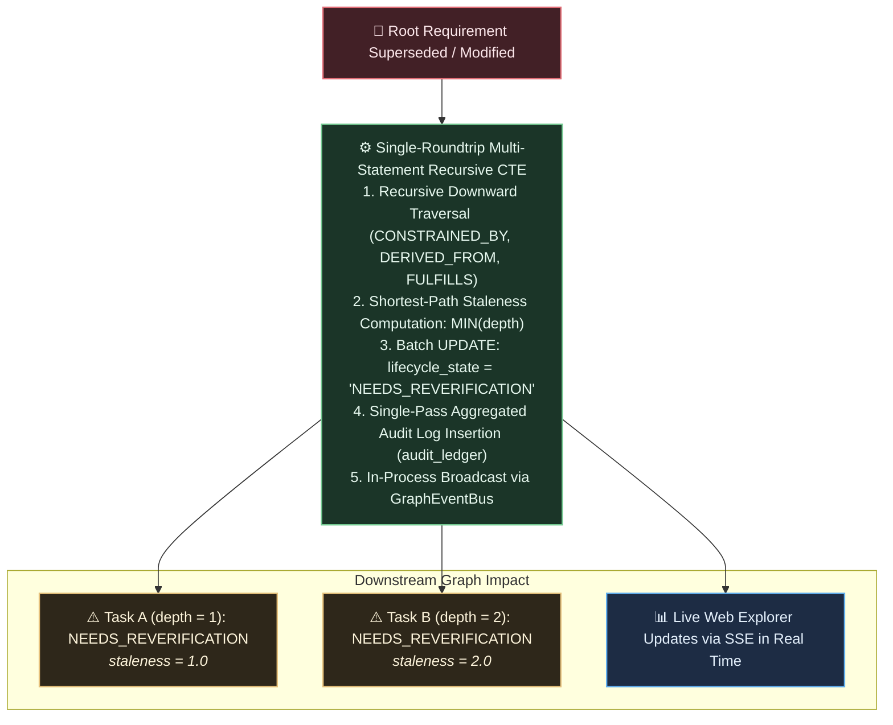

# Chapter 7: Document Evolution, Invalidation Storms & Reverification

This chapter demonstrates what happens when high-level specifications change, how TKS safely propagates staleness through invalidation cascades, and how to reverify or roll back affected tasks.

---

## The Reality of Evolving Requirements

In active software systems, requirements and architectural decisions are never static. Invariants are clarified, performance SLAs are tightened, and dependencies are refactored.

When a requirement changes in traditional documentation, engineers and coding agents rarely know which existing code or tasks are affected. In TKS, modifying a governing requirement triggers an automated **Invalidation Cascade**.

---

## Step 1: Re-Ingesting an Evolved Document

Suppose we update [`docs/vision/vision.md`](file:///workspaces/tks/docs/vision/vision.md) to modify Invariant I-6, adding multi-agent co-evolution milestones. We submit the revised document:

```bash
curl -s -X POST "$TKS_SERVER_URL/api/v1/documents/ingest" \
  -H "Authorization: Bearer $TKS_AUTH_TOKEN" \
  -H "Content-Type: application/json" \
  -d "{
    \"doc_path\": \"specs/vision.md\",
    \"content\": $(jq -Rs . < docs/vision/vision.md)
  }"
```

### In-Place Span Re-Anchoring

If the document modification merely shifted text lines without changing semantic meaning, TKS mechanically reconciles the AST:

* It compares AST heading anchors and canonical keys against existing active nodes.
* For unchanged requirements whose character positions shifted, it updates `byte_start` and `byte_end` in-place on `graph_nodes`.
* It appends a `SPAN_REANCHORED` event to `audit_ledger`, avoiding destructive deletes or re-creations.

---

## Step 2: The Invalidation Cascade Engine

When an active requirement is superseded or structurally altered during staging approval, TKS executes the **Invalidation Cascade Engine** (`src/storage/cascade.rs`):



### Key Performance Guarantees

* **Single Database Roundtrip (DEC-3.1):** Traversal, state transition, and audit recording execute within a single multi-statement CTE in PostgreSQL.
* **Shortest-Path Staleness (`MIN(depth)`, DEC-3.2):** Downstream nodes reachable via multiple paths receive their minimum topological distance from the invalidation source.
* **Single-Pass Audit Aggregation (DEC-3.13):** Projections are aggregated in a single scan, reducing invalidation sweep latency across 10,000 nodes from ~13.4ms to under **2ms**.

---

## Step 3: Inspecting Degraded Tasks

When an invalidation cascade fires, downstream tasks immediately reflect the degraded state:

```bash
cargo run --bin tks -- task list --status "NEEDS_REVERIFICATION"
```

Output:

```text
Tasks Requiring Reverification (2):
  - [NEEDS_REVERIFICATION] 4d99aa12...: Implement Ancestry Verification CTE
    Staleness Depth: 1
    Reason: Upstream requirement 0a11bc32... was updated in Batch e41b77a0...
```

Coding agents querying context envelopes for these tasks receive explicit diagnostics warning that upstream governance is stale.

---

## Step 4: Operational Reverification Recovery

To restore a degraded node to `ACTIVE` state, an agent or administrator reviews the updated parent specification and invokes `reverify`:

### Via CLI

```bash
cargo run --bin tks -- admin reverify 4d99aa12-5501-44bb-9901-aa1122334455 \
  --rationale "Verified implementation satisfies updated Invariant I-6 multi-agent requirements"
```

### Reparenting to a New Successor

If the upstream parent was superseded by a new requirement node (`7a88bb99...`), supply `--reparent-to`:

```bash
cargo run --bin tks -- admin reverify 4d99aa12-5501-44bb-9901-aa1122334455 \
  --reparent-to "7a88bb99-0012-4211-9a71-c01178229a1b" \
  --rationale "Reparented to Invariant I-6 v2 successor node"
```

Upon reverification:

1. TKS validates that the upstream parent is active and cyclic constraints are satisfied.
2. The node's `lifecycle_state` transitions back to `ACTIVE`.
3. A `REVERIFIED` event is appended to `audit_ledger`.
4. The node immediately returns to normal production query envelopes.

---

## Step 5: Safe Administrative Rollback (`tks admin revert`)

If an erroneous batch of mutations was committed, administrators can roll it back safely:

### Dry-Run Blast Radius Preview (DEC-2.6)

Always run with `--dry-run` first to preview the blast radius:

```bash
cargo run --bin tks -- admin revert \
  --batch-id "e41b77a0-0012-4211-9a71-c01178229a1b" \
  --dry-run
```

Output:

```text
Rollback Preview (Dry-Run):
  Target Batch:        e41b77a0-0012-4211-9a71-c01178229a1b
  Nodes to Deactivate: 3 (REVERTED)
  Edges to Sever:      4
  Cascaded Dependents: 5 (will transition to NEEDS_REVERIFICATION)
  Cross-Agent Impact:  WARNING: Affects tasks owned by 'gemini-agent-beta'
```

### Executing Rollback with Selective State Preservation (DEC-2.7)

If cross-agent tasks exist, TKS safely halts with `ERR_CONFIRMATION_REQUIRED` unless `--force` is passed:

```bash
cargo run --bin tks -- admin revert \
  --batch-id "e41b77a0-0012-4211-9a71-c01178229a1b" \
  --force
```

During rollback:

* **Selective State Preservation:** If an affected leaf task was marked `COMPLETED`, its completed execution status is preserved in history. Only its structural edges are severed. This prevents erasing historical engineering reality or triggering redundant re-execution storms.
* **Compensating Events:** Compensating inverse events are committed to `audit_ledger` with fresh `batch_id` and monotonic `event_seq`, preserving 100% audit integrity.
