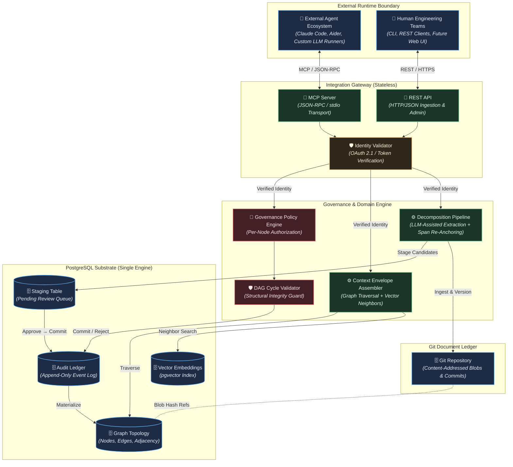

# TKS (The Knowledge Substrate): Architecture

## 1. Context & Drivers

The Knowledge Substrate (TKS) is a purpose-built requirement-intent provenance substrate
that anchors external AI agents and human engineering teams to a unified, version-governed
property graph. This architecture addresses three structural failure modes in agentic
software engineering: context window collapse (code-level context blindness to intent),
specification drift (decoupled documentation), and the monolithic diff dilemma (unscalable
human review of agent-generated output).

The architecture is shaped by the following drivers extracted from the governing vision
and strategic backlog:

| ID | Driver | Source |
| :--- | :--- | :--- |
| DR-1 | Unified graph-relational substrate combining property graph topology, vector embeddings, and relational audit in a single PostgreSQL engine | vision.md §2 Key Capabilities (1) |
| DR-2 | Document provenance and assisted decomposition: Git-backed content-addressed document store with LLM-assisted extraction and human review gates | vision.md §2 Key Capabilities (2) |
| DR-3 | Agent-agnostic integration via MCP and REST: stateless protocol gateway for context retrieval and governed mutation | vision.md §2 Key Capabilities (3) |
| DR-4 | Immutable audit ledger with complete historical reversibility and point-in-time reconstruction | vision.md §2 Key Capabilities (4) |
| DR-5 | Per-node governance: attribute-based authorization controlling autonomous elaboration vs. human gating | vision.md §2 Key Capabilities (5) |
| DR-6 | Self-referential bootstrapping: the substrate manages its own development lifecycle post-Phase 1 | vision.md §2 Key Capabilities (6) |
| DR-7 | Resource-constrained execution model: phased delivery achievable by solo developer or small team on commodity infrastructure | vision.md §3, backlog §1 |
| DR-8 | Sub-second micro-reflex graph traversal latency (<50 ms for k≤3 hops) at the operational hot path | vision.md §2 Operational Timescales, backlog §6 SLA-1 |
| DR-9 | Externalized cognitive compute: the substrate never invokes LLM inference internally; agents supply their own models | vision.md §3 |
| DR-10 | Phased hypothesis de-risking: lightweight spikes validate foundational premises (H-1, H-4) before infrastructure commitment | backlog §2 Phase 0, §5 Spike 0 |

## 2. Constraints

### 2.1 Project Initiator Constraints

> None supplied.

### 2.2 Derived Constraints

| ID | Constraint | Source |
| :--- | :--- | :--- |
| C-1 | Pure Rust package repository: all substrate service code is authored in Rust (edition 2024), built via Cargo stable toolchain | GEMINI.md (project guidelines) |
| C-2 | Single PostgreSQL engine: all topology data, vector embeddings (`pgvector`), relational metadata, and audit records reside in one PostgreSQL instance; no external graph or vector databases | vision.md §3 |
| C-3 | Stateless gateway boundary: MCP and REST interfaces maintain no persistent session memory; every operation is an authenticated, isolated transaction | vision.md §3 |
| C-4 | Document immutability: uploaded text specifications are stored in a Git-backed repository and content-addressed via cryptographic hashes; spans reference immutable blob identities | vision.md §3 |
| C-5 | Schema flexibility via progressive JSONB layering: core tables enforce foundational structural edges only; domain-specific attributes use typed JSONB fields | vision.md §3 |
| C-6 | Bootstrap boundary: Phase 0 and Phase 1 use conventional tooling; from Phase 1 completion onward all requirements, decisions, and tasks must be tracked within the substrate | vision.md §3 |
| C-7 | No in-database agent execution: the substrate never runs autonomous agent cognitive loops internally | vision.md §3, Invariant I-3 |
| C-8 | LLM interaction restricted to human-directed document ingestion and decomposition pipelines only | vision.md §3 |
| C-9 | Phase 0 and Phase 1 must be achievable on commodity infrastructure by a single developer or small team | vision.md §3, backlog §1 |
| C-10 | Dependency policy: prefer well-established Rust crates; avoid dependencies for functionality small enough to implement with the standard library | GEMINI.md |

## 3. Architectural Invariants

| ID | Invariant | Rationale | Verification |
| :--- | :--- | :--- | :--- |
| INV-1 | Every functional specification, implementation task, and code artifact reference must maintain a valid directed edge path terminating at an authorized requirement node. Orphan execution tasks must be rejected at the database constraint level. | Ensures end-to-end traceability from vision to code; prevents unanchored agent-generated artifacts from accumulating. | Database foreign key and trigger constraints reject inserts lacking a valid ancestor requirement edge. Integration test: attempt to insert orphan task node → expect rejection. |
| INV-2 | Destructive in-place updates (`UPDATE`, `DELETE`) on requirements, specifications, and topological edges must not occur. All state transitions must be recorded as discrete, reversible audit events enabling full point-in-time reconstruction. | Guarantees complete auditability and historical reversibility without data loss; supports clean rollback of agent mutation batches. | Audit ledger row count monotonically increases. Integration test: mutate a node, query historical snapshot at prior timestamp → expect original state. |
| INV-3 | The core database engine and gateway services must never execute autonomous agent cognitive loops internally. The substrate must function strictly as a deterministic state store and protocol gateway. | Preserves operational determinism; prevents uncontrolled LLM invocations within the trusted storage boundary; keeps cognitive compute externalized and auditable. | Code review gate: no LLM client invocations in gateway or storage crate modules. CI lint rule scanning for prohibited dependency imports. |
| INV-4 | Every requirement derived via the decomposition pipeline must store a persistent cryptographic reference (Git commit/blob hash) and source span coordinates (`char_start`, `char_end`) pointing to the original document artifact. | Enables independent verification of requirement provenance against immutable source text; anchors extracted semantics to deterministic byte ranges. | Integration test: for each extracted requirement node, resolve Git blob hash and verify that `source_text[char_start..char_end]` matches the stored requirement verbatim text. |
| INV-5 | Permissions to alter or elaborate a graph node must be governed by explicit per-node `governance_policy` metadata attributes (`AUTONOMOUS_ELABORATION`, `HUMAN_REVIEW_REQUIRED`, `LOCKED`). Node-level policies must take absolute precedence over global agent roles. | Provides granular, progressive delegation of autonomy; prevents agents from modifying safety-critical requirements without human authorization. | Integration test: agent attempts mutation on `LOCKED` node → expect rejection; agent mutates `AUTONOMOUS_ELABORATION` node → expect commit; agent mutates `HUMAN_REVIEW_REQUIRED` node → expect staging. |
| INV-6 | Once foundational ingestion and context retrieval are operational (post-Phase 1), all new feature requirements, architectural adjustments, and development tasks must be authored, reviewed, and tracked within the substrate itself. | Self-referential dogfooding exposes UX friction early; establishes a closed feedback loop validating the substrate's own utility. | Dogfooding gate audit: post-Phase 1 requirements and tasks exist as graph nodes with valid provenance; manual spot-check during milestone reviews. |
| INV-7 | Every mutation submitted through the Integration Gateway must be attributable to a verified external identity (human user or agent instance). Identity credentials must be recorded in the audit ledger alongside mutation events. No mutation may be committed without a verified identity reference. | Non-negotiable audit requirement; enables forensic tracing of any graph change to its originator; supports blast-radius containment for compromised agents. | Audit ledger schema enforces NOT NULL on `actor_id`, `actor_type`, `token_fingerprint`. Integration test: submit mutation without auth credentials → expect rejection. |

## 4. Component Topology

### Component Responsibilities & Boundaries

| Component | Responsibility | Owns State | Depends On |
| :--- | :--- | :--- | :--- |
| MCP Server | Exposes `get_context_envelope`, `propose_node_mutation`, `query_requirements`, `get_document_span`, and administrative tools over JSON-RPC / stdio transport | No (stateless) | Identity Validator, Envelope Assembler, Governance Engine |
| REST API | HTTP/JSON endpoints for document ingestion (`POST /api/v1/documents/ingest`), staging approval (`POST /api/v1/staging/approve`), and administrative rollback operations | No (stateless) | Identity Validator, Decomposition Pipeline, Staging Table |
| Identity Validator | Statelessly validates OAuth 2.1 / DPoP tokens; extracts verified caller claims (`actor_id`, `actor_type`, `agent_instance_id`); enforces INV-7 | No (stateless) | External identity provider (out of scope) |
| Governance Policy Engine | Evaluates per-node `governance_policy` attributes; routes mutations to immediate commit, staging queue, or rejection | No (reads node metadata) | Graph Topology, DAG Validator |
| DAG Cycle Validator | Enforces acyclicity on structural edges (`CONSTRAINED_BY`, `DERIVED_FROM`) via CTE-based cycle detection or database triggers | No (reads edge topology) | Graph Topology |
| Context Envelope Assembler | Executes directed k-hop graph traversals and vector neighbor searches; assembles bounded context envelopes for external agents | No (read-only queries) | Graph Topology, Vector Embeddings |
| Decomposition Pipeline | Orchestrates LLM-assisted requirement extraction from ingested documents; applies deterministic span re-anchoring; writes draft nodes to staging | No (orchestration logic) | Git Repository, Staging Table, external LLM API |
| Graph Topology (PostgreSQL) | Stores requirement, specification, and task nodes with typed edges (`DERIVED_FROM`, `CONSTRAINED_BY`, `FULFILLS`, `VERIFIED_BY`) | Yes: canonical graph state | — |
| Vector Embeddings (pgvector) | Stores dense vector representations of graph nodes for similarity-based neighbor lookup | Yes: embedding vectors | Graph Topology (node identity) |
| Audit Ledger (PostgreSQL) | Append-only event log recording every node/edge mutation with actor identity, timestamp, and reversible delta payload | Yes: immutable event stream | — |
| Staging Table (PostgreSQL) | Holds draft/pending-review nodes and mutations awaiting human approval | Yes: staging state | — |
| Git Document Ledger | Content-addressed Git repository storing raw Markdown/text specification documents; provides commit SHA and blob hash references | Yes: document artifacts | — |

### Deployment & Process Model

The baseline deployment model targets a single-host, multi-process configuration suitable
for the constrained resource model (solo developer / small team):

- **Single Rust binary** compiled from the `tks` crate, exposing both the MCP server
  (stdio transport for agent integration) and the REST API (HTTP listener) as concurrent
  async tasks within one process.
- **PostgreSQL instance** (with `pgvector` extension) runs as a separate process, accessed
  via TCP connection pool (e.g., `deadpool-postgres` or `bb8`).
- **Git document ledger** resides on the local filesystem, accessed via `libgit2` bindings
  (e.g., `git2` crate) from within the Rust process.
- No container orchestration required for Phase 0–1. A `docker-compose.yml` provisions
  PostgreSQL with `pgvector` for development and CI.

## 5. Data & State Model

### 5.1 State Ownership

| State | Owner | Storage | Consistency | Lifecycle |
| :--- | :--- | :--- | :--- | :--- |
| Requirement nodes | Graph Topology | PostgreSQL `requirement_nodes` table | Strong (ACID transactions) | Created via decomposition pipeline approval → ACTIVE → SUPERSEDED or ARCHIVED |
| Structural edges | Graph Topology | PostgreSQL `graph_edges` table | Strong (ACID, FK constraints, DAG cycle checks) | Created alongside node approval; never deleted (INV-2), only superseded |
| Source span references | Graph Topology | PostgreSQL `source_spans` table (doc_hash, char_start, char_end) | Strong (immutable after creation; pinned to Git blob hash) | Created during decomposition; re-anchored on document revision |
| Vector embeddings | Vector Index | PostgreSQL `node_embeddings` table (`pgvector`) | Eventually consistent (regenerated on node content change) | Created on node approval; updated if node text is revised |
| Governance policy | Graph Topology | JSONB attribute on `requirement_nodes` (`governance_policy` field) | Strong (per-node, checked at mutation time) | Set at node creation; updated by human administrator only |
| Audit events | Audit Ledger | PostgreSQL `audit_ledger` table | Strong (append-only, NOT NULL actor constraints) | Created on every mutation; never modified or deleted |
| Staged mutations | Staging Table | PostgreSQL `staging_queue` table | Strong (transactional) | Created by decomposition pipeline or governance routing → approved/rejected → archived |
| Document artifacts | Git Document Ledger | Local Git repository (blobs, commits) | Strong (content-addressed, cryptographic integrity) | Ingested via REST API → committed → immutable blob referenced by hash |
| Node lifecycle state | Graph Topology | JSONB attribute on `requirement_nodes` (`lifecycle_state` field) | Strong (ACTIVE, SUPERSEDED, ARCHIVED) | ACTIVE at creation; transitions managed by governance engine |

### 5.2 Concurrency Model

- **Async runtime:** The Rust binary uses `tokio` as the async runtime. The MCP server
  (stdio) and REST API (HTTP listener) run as independent async task sets on a shared
  multi-threaded `tokio` runtime.
- **Database connection pooling:** A connection pool (e.g., `deadpool-postgres`) provides
  bounded concurrency to PostgreSQL. Each inbound request acquires a connection from the
  pool, executes within a database transaction, and returns the connection on completion.
- **Transaction isolation:** All graph mutations execute within `SERIALIZABLE` or
  `REPEATABLE READ` isolation level transactions. The DAG cycle check and governance
  policy evaluation occur within the same transaction as the mutation commit, ensuring
  no TOCTOU (time-of-check-to-time-of-use) races on governance state.
- **Shared state protection:** The Rust process holds no mutable in-process graph state.
  PostgreSQL is the single source of truth. In-process caches (if introduced) are
  read-only and invalidated on transaction commit via notification channels (`LISTEN`/`NOTIFY`).
- **Git access serialization:** Git repository operations (commit, blob read) are
  serialized via an async mutex or dedicated single-writer task to prevent concurrent
  write conflicts on the local Git repository.

## 6. Interfaces & Contracts

| Interface | Producer → Consumer | Protocol / Format | Failure Semantics | Versioning |
| :--- | :--- | :--- | :--- | :--- |
| `get_context_envelope` | MCP Server → External Agent | MCP JSON-RPC over stdio | Returns structured error with code on invalid `node_id` or traversal failure; timeout enforced at gateway | Tool schema versioned; additive-only field evolution |
| `propose_node_mutation` | External Agent → MCP Server → Governance Engine | MCP JSON-RPC over stdio | Returns `COMMITTED`, `PENDING_REVIEW`, or error (`ERR_GRAPH_CYCLE_DETECTED`, `ERR_GOVERNANCE_REJECTED`, `ERR_AUTH_FAILED`); mutations are atomic (all-or-nothing) | Tool schema versioned; additive-only |
| `query_requirements` | MCP Server → External Agent | MCP JSON-RPC over stdio | Returns empty result set on no match; error on malformed query | Tool schema versioned |
| `get_document_span` | MCP Server → External Agent | MCP JSON-RPC over stdio | Error if blob hash not found or span out of range | Tool schema versioned |
| `revert_mutation_batch` | Admin (MCP or REST) → Audit Ledger | MCP JSON-RPC or REST JSON | Atomic rollback within single transaction; error if batch_id not found or already reverted | Tool schema versioned |
| `revert_agent_session` | Admin (REST) → Audit Ledger | REST HTTP/JSON | Atomic rollback of all mutations by a specific `agent_instance_id` since a given timestamp | URL path versioned (`/api/v1/...`) |
| Document Ingestion | Human/CLI → REST API → Decomposition Pipeline | REST HTTP/JSON (`POST /api/v1/documents/ingest`) | Synchronous Git commit; async LLM decomposition; error on invalid document format or Git write failure; idempotent on duplicate blob hash | URL path versioned |
| Staging Approval | Human → REST API → Audit Ledger | REST HTTP/JSON (`POST /api/v1/staging/approve`) | Atomic: staged nodes committed to live graph and audit ledger in single transaction; error on invalid staging IDs | URL path versioned |
| PostgreSQL wire protocol | Rust process → PostgreSQL | TCP / `libpq` wire protocol | Connection pool retry with backoff on transient connection failures; transaction retry on serialization conflicts | PostgreSQL version compatibility managed via migration tooling |
| Git operations | Rust process → Git repository | `libgit2` (via `git2` crate) in-process | Serialized writes; error propagated on filesystem or object-store corruption | Git object model (content-addressed, stable) |

### Failure Semantics Summary

- **Idempotency:** Document ingestion is idempotent on blob hash (re-ingesting identical
  content produces no duplicate). Mutation proposals are not idempotent (each submission
  creates a distinct audit event).
- **Retry policy:** Transient PostgreSQL connection failures are retried with exponential
  backoff at the connection pool level. Serialization conflicts trigger transaction-level
  retry (bounded retries before returning error to caller).
- **Timeout:** Gateway enforces a per-request timeout (configurable; default 30s) to
  prevent runaway graph traversals or LLM decomposition hangs from blocking the server.

## 7. Technology Stack

| Concern | Selection | Rationale | Alternatives Considered |
| :--- | :--- | :--- | :--- |
| Primary language | Rust (edition 2024, stable toolchain) | Project mandate (GEMINI.md); memory safety, performance, single-binary deployment; strong async ecosystem | N/A (constrained) |
| Async runtime | `tokio` | De facto standard Rust async runtime; mature, well-supported, multi-threaded work-stealing scheduler | `async-std` (smaller ecosystem) |
| HTTP framework | `axum` | Tower-based, composable, integrates natively with `tokio`; strong middleware ecosystem for auth, tracing, compression | `actix-web` (actor model unnecessary), `warp` (less composable) |
| PostgreSQL client | `tokio-postgres` + `deadpool-postgres` | Async native driver; connection pooling; direct SQL for control over query optimization | `sqlx` (compile-time query checking adds build complexity; see D-3), `diesel` (sync, ORM overhead) |
| Database migrations | `refinery` or `sqlx-cli` (offline mode) | Lightweight, file-based SQL migration runner compatible with Rust build pipeline | Custom migration scripts (fragile) |
| Vector embeddings | `pgvector` (PostgreSQL extension) | Single-engine constraint (C-2); proven HNSW/IVFFlat indexing for approximate nearest neighbor search within PostgreSQL | Dedicated vector DB (prohibited by C-2) |
| Graph query strategy | Recursive CTEs (`WITH RECURSIVE`) on adjacency tables | Zero external dependencies; runs on vanilla PostgreSQL; fully ACID-compliant; adequate for k≤4 hop traversals at Phase 1 scale | Apache AGE (see D-2), native SQL/PGQ (unavailable until PG 20+) |
| Git integration | `git2` crate (libgit2 bindings) | In-process Git operations without shelling out; content-addressing, blob/commit hash computation; mature Rust bindings | `gitoxide` (pure Rust, less mature), CLI `git` subprocess (fragile) |
| MCP server | Custom Rust implementation (JSON-RPC over stdio) | MCP specification is a JSON-RPC protocol; stdio transport is the standard for agent-IDE integration; no established Rust MCP SDK at baseline | `mcp-rs` (if community crate matures; see Q-3) |
| Serialization | `serde` + `serde_json` | Standard Rust serialization framework; zero-cost abstraction; universal ecosystem support | N/A (de facto standard) |
| Observability | `tracing` + `tracing-subscriber` | Structured logging with span-based context propagation; integrates with `tokio` instrumentation; supports JSON output for log aggregation | `log` + `env_logger` (less structured) |
| Configuration | `config` crate or environment variables | Twelve-factor app compliance; simple for single-binary deployment; layered config (file + env override) | `clap` for CLI args (complementary, not alternative) |
| Testing | `cargo test` (unit + integration), `cargo clippy`, `cargo fmt` | Standard Rust validation pipeline per GEMINI.md | External test frameworks (unnecessary complexity) |

## 8. Operational Model

- **Build & Deploy:**
  - Built from repository root via `cargo build --release`, producing a single static binary.
  - CI pipeline: `cargo fmt --check` → `cargo clippy --all-targets --all-features -- -D warnings` → `cargo test` → `cargo build --release`.
  - Development environment: `docker-compose up` provisions PostgreSQL with `pgvector`; Rust binary runs on host or in a lightweight container.
  - Phase 0–1 deployment: single host (developer workstation or small VM). No orchestration required.
  - Database schema applied via migration tool (`refinery` or `sqlx-cli`) on startup or as a separate migration command.

- **Observability:**
  - Structured JSON logs via `tracing` with span context (request ID, actor ID, operation type).
  - Key metrics emitted as structured log events: graph traversal latency, envelope assembly time, mutation commit duration, staging queue depth, connection pool utilization.
  - Health endpoint (`GET /health`) returning service status and PostgreSQL connectivity.
  - Phase 1 target: local log file inspection. Phase 3+: integration with external observability stack (Prometheus metrics exporter, Grafana dashboards) is aspirational.

- **Failure & Recovery:**
  - PostgreSQL crash: restart and automatic WAL recovery. Connection pool detects and re-establishes connections.
  - Git repository corruption: recoverable from Git's content-addressed object store; `git fsck` for integrity verification.
  - Application crash: stateless gateway design means restart is safe. No in-process state to recover. Incomplete transactions are rolled back by PostgreSQL.
  - Audit ledger integrity: append-only design ensures no data loss on partial failure. Incomplete audit events are rolled back with their enclosing transaction.
  - Agent mutation blast radius: `revert_agent_session` tool enables targeted rollback of all mutations from a specific agent instance.

- **Upgrade & Migration:**
  - Schema evolution via versioned SQL migration files applied in order. Backward-compatible migrations preferred; breaking changes require coordinated migration + code deployment.
  - API evolution: MCP tool schemas use additive-only field evolution (new optional fields). REST API uses URL path versioning (`/api/v1/`, `/api/v2/`).
  - JSONB attribute fields provide schema flexibility for domain-specific extensions without DDL migrations.
  - PostgreSQL major version upgrades: standard `pg_upgrade` or dump/restore. `pgvector` extension compatibility verified before upgrade.

## 9. Decisions & Rejected Alternatives

### D-1: Single PostgreSQL engine for all state (graph, vectors, audit)

- **Status:** Accepted
- **Origin:** Baseline
- **Context:** The system requires graph topology storage, vector similarity search, and an append-only audit ledger. Distributing these across multiple database engines (e.g., Neo4j for graph, Pinecone for vectors, PostgreSQL for relational) would introduce distributed transaction failures, synchronization drift, and operational complexity incompatible with the constrained resource model.
- **Decision:** All state resides in a single PostgreSQL instance using recursive CTEs for graph queries, `pgvector` for vector indexing, and relational tables for the audit ledger.
- **Rationale:** Eliminates distributed transaction failures; leverages proven enterprise PostgreSQL tooling for backup, replication, security; honors the single-engine boundary contract from vision.md §3.
- **Reopen If:** Hypothesis H-3 is falsified (>500 ms latency at ≤10⁵ nodes despite index optimization), or PostgreSQL native SQL/PGQ support matures in PG 20+.

### D-2: Recursive CTEs over Apache AGE for graph queries

- **Status:** Accepted
- **Origin:** Baseline
- **Context:** Graph traversal is required for context envelope assembly (k-hop ancestor and sibling queries). Apache AGE provides rich Cypher syntax but is an external C extension with version-specific PostgreSQL compatibility (PG 19 support pending) and added deployment complexity.
- **Decision:** Use standard `WITH RECURSIVE` CTEs on a relational adjacency table (`graph_edges`) for all graph traversal operations.
- **Rationale:** Zero external dependencies; runs on vanilla PostgreSQL; fully ACID-compliant; adequate performance for k≤4 hop traversals at projected Phase 1–2 scale (≤10⁵ nodes); honors the "start small" and constrained resource model directives.
- **Reopen If:** Query complexity for multi-hop path matching becomes unmanageable in relational SQL; Apache AGE achieves stable PG 19+ support and community adoption justifies the deployment overhead; or native SQL/PGQ lands in PostgreSQL 20+.

### D-3: `tokio-postgres` over `sqlx` for database client

- **Status:** Accepted
- **Origin:** Baseline
- **Context:** Both `tokio-postgres` and `sqlx` are mature async PostgreSQL drivers. `sqlx` provides compile-time query verification but requires a live database connection during `cargo build` (or offline mode with cached query metadata), adding CI complexity.
- **Decision:** Use `tokio-postgres` with `deadpool-postgres` for connection pooling. Queries are verified by integration tests rather than compile-time checking.
- **Rationale:** Simpler build pipeline; no database dependency during compilation; direct SQL control for optimizing recursive CTE and pgvector queries; connection pooling via `deadpool-postgres` is well-proven.
- **Reopen If:** Query correctness bugs become a recurring issue that compile-time checking would prevent; `sqlx` offline mode matures to require zero live-database build dependency.

### D-4: Append-only event ledger for state versioning (over bitemporality)

- **Status:** Accepted
- **Origin:** Baseline
- **Context:** Invariant INV-2 requires auditability, reversibility, and point-in-time reconstruction. Three approaches were evaluated: append-only event ledger with materialized current state, system-versioned temporal tables, and full bitemporal property graph.
- **Decision:** Adopt the append-only event ledger pattern. Mutations write an immutable event record to `audit_ledger`; live graph tables maintain the current snapshot, updated within the same transaction.
- **Rationale:** Conceptual simplicity; fast read performance on current graph; straightforward rollback via inverse events; honors "start small" directive; full bitemporality introduces severe query complexity disproportionate to Phase 1–2 needs.
- **Reopen If:** Requirements emerge for retrospective corrections with separate "asserted at" vs. "effective at" semantics; regulatory compliance mandates full bitemporal audit trails.

### D-5: Rust MCP server (custom implementation) over community SDK

- **Status:** Accepted
- **Origin:** Baseline
- **Context:** The MCP specification defines a JSON-RPC protocol over stdio transport. At baseline, no established, production-quality Rust MCP SDK exists.
- **Decision:** Implement a custom MCP server in Rust, handling JSON-RPC message parsing, tool dispatch, and stdio transport directly.
- **Rationale:** MCP's JSON-RPC protocol is straightforward to implement; avoids dependency on immature community crates; provides full control over tool schema evolution and error handling.
- **Reopen If:** A well-maintained, specification-compliant Rust MCP SDK reaches production maturity (see Q-3).

### D-6: `git2` (libgit2) for Git integration over `gitoxide`

- **Status:** Accepted
- **Origin:** Baseline
- **Context:** Git integration is required for content-addressed document storage. `git2` (Rust bindings to libgit2) is mature and widely used. `gitoxide` is a pure-Rust Git implementation under active development.
- **Decision:** Use `git2` for all Git operations (commit, blob hash, cat-file equivalent).
- **Rationale:** Mature, battle-tested C library with stable Rust bindings; supports all required operations; extensive documentation and community usage.
- **Reopen If:** `gitoxide` reaches API stability and feature parity for required operations; `libgit2` C dependency causes cross-compilation or packaging issues.

## 10. Risks & Spikes

| ID | Risk / Hypothesis | Impact | Spike | Pass Threshold | Fail Response |
| :--- | :--- | :--- | :--- | :--- | :--- |
| R-1 | H-1: Graph-bounded context envelopes may not significantly outperform competent multi-tool agentic retrieval (file read, grep, AST, semantic search) for preserving architectural invariants | High — foundational premise of TKS; failure invalidates the core value proposition | Spike 0 (Phase 0): In-memory graph with ~50–100 hand-curated requirement nodes; compare graph-bounded vs. agentic-baseline constraint violation rates across ≥20 synthetic coding tasks | ≥30% constraint violation reduction = strong greenlight; 15–29% = partial (refine envelope, narrow domain); ≤0% = H-1 falsified | ≤0%: Halt Phase 1 build; trigger strategic re-evaluation. 15–29%: Narrow target domain; refine envelope assembly before proceeding. |
| R-2 | H-4: Commodity LLMs may fail to extract atomic requirements with sufficient span precision from unstructured Markdown, even with deterministic re-anchoring | High — decomposition pipeline is the primary data ingestion path | Early Extraction Prompting Spike (Phase 0): Benchmark few-shot prompts against diverse Markdown structures; measure precision/recall on character spans against ground truth | ≥95% precision/recall on atomic requirement spans (CAL-H4); 80–94% with deterministic re-anchoring fallback acceptable | <60% precision/recall despite deterministic re-anchoring: decomposition pipeline premise is non-viable; explore structured-only input formats or manual extraction. |
| R-3 | H-3: Single PostgreSQL instance may not sustain <100 ms query latency at 10⁶ graph nodes for k-hop CTE traversals + pgvector searches | Medium — blocks enterprise scaling but not Phase 1–2 utility | Phase 2–3 benchmark: Load-test PostgreSQL with synthetic graph at 10⁵ and 10⁶ node scales; measure CTE traversal and vector search latencies under concurrent load | Sustained <100 ms at 10⁵ nodes (SLA-2); degradation acceptable at 10⁶ if index optimization and read-replica offloading resolve it | >500 ms at ≤10⁵ nodes despite optimization: single-engine constraint (C-2) must be revisited; evaluate Apache AGE or dedicated graph database. |
| R-4 | H-2: Graph-based supervisory review may not significantly reduce human oversight overhead compared to direct diff review | Medium — affects Phase 3+ supervisory portal value | Phase 3 user study: Compare review time for graph-based impact analysis vs. raw diff inspection across matched feature sets | ≥50% review time reduction (CAL-H2); 25–49% triggers UI workflow refinement | ≤0% reduction: supervisory portal premise is non-viable; pivot to diff-augmentation approach. |
| R-5 | PostgreSQL graph query strategy: recursive CTEs may become unwieldy for complex multi-hop path matching and constraint resolution | Medium — affects query maintainability and developer velocity | Spike 1 (Phase 0–1): Implement core envelope assembly queries using recursive CTEs; evaluate query complexity, maintainability, and latency vs. Apache AGE Cypher on the same schema | CTE queries remain maintainable and meet SLA-1 (<50 ms for k≤3 hops) | CTEs become unmanageable or fail SLA-1: re-evaluate Apache AGE or hybrid approach (D-2). |
| R-6 | Git-PostgreSQL coupling: span stability across document revisions may be brittle; diff-based re-anchoring may introduce drift | Medium — affects INV-4 provenance guarantee on document updates | Spike 3/4 (Phase 1): Implement span re-anchoring on a corpus of revised Markdown documents; measure re-anchoring accuracy | ≥95% of spans correctly re-anchored after document revision | <80% re-anchoring accuracy: pin requirements strictly to immutable blob hashes only; require re-decomposition on revision rather than span migration. |
| R-7 | MCP specification evolution: July 2026 spec standardizes OAuth 2.1 + PKCE; Agent Identity Working Group DPoP additions may introduce breaking protocol changes | Low — affects auth implementation timing, not architecture | Monitor MCP specification releases; implement auth layer behind an abstraction boundary | Auth implementation aligns with stable MCP spec without rework | Spec instability: defer full OAuth 2.1 implementation; use simpler API key / bearer token mechanism for Phase 1 with abstraction layer for future swap. |

## 11. Open Questions

| ID | Question | Blocking | Owner / Next Step |
| :--- | :--- | :--- | :--- |
| Q-1 | What specific PostgreSQL version should be targeted for Phase 1? PG 16/17/18 all support pgvector; PG 19 is current stable. Apache AGE compatibility is version-specific. | No (any PG 16+ suffices for CTE + pgvector baseline) | Resolve during Phase 0 scaffolding; default to latest stable PG with confirmed pgvector extension compatibility. |
| Q-2 | Should the Rust binary expose MCP over stdio only, or also support MCP over HTTP (SSE transport) for remote agent integration? | No (stdio sufficient for Phase 1 local agent integration) | Evaluate during Phase 1; HTTP transport is additive and can be introduced without architectural change. |
| Q-3 | Is there a maturing Rust MCP SDK (e.g., `mcp-rs`, `rmcp`) that could replace custom JSON-RPC implementation? | No (custom implementation is viable) | Monitor crate ecosystem during Phase 0–1; evaluate if a crate reaches 1.0 stability with MCP July 2026 spec compliance. |
| Q-4 | What embedding model should be used for `pgvector` node embeddings? `text-embedding-3-small` (OpenAI) vs. open-source alternatives (e.g., `nomic-embed-text`, `all-MiniLM-L6-v2`). | No (embedding model is pluggable behind a trait boundary) | Evaluate during Spike 0 / Phase 1; embedding generation is externalized (not in the substrate hot path). |
| Q-5 | How should the decomposition pipeline invoke external LLM APIs? Direct HTTP calls to provider APIs vs. abstraction layer (e.g., `llm` crate, provider-agnostic SDK). | No (implementation detail for Phase 1) | Spike 4 evaluation; prefer thin HTTP client with provider-specific adapters behind a trait. |
| Q-6 | What is the precise OAuth 2.1 / DPoP token validation mechanism for the Identity Validator? Self-hosted JWKS endpoint, external IdP integration, or simpler API key scheme for Phase 1? | Yes: blocks INV-7 implementation detail | Spike 6 investigation; Phase 1 may use simplified bearer token + API key with documented upgrade path to OAuth 2.1. |
| Q-7 | Should the `audit_ledger` use a separate PostgreSQL schema or tablespace for operational isolation from the live graph tables? | No (single schema sufficient for Phase 1) | Evaluate during Phase 2 if audit ledger growth impacts graph query performance. |
| Q-8 | What is the strategy for embedding regeneration when node content changes? Synchronous (within mutation transaction) vs. async (background job with eventual consistency)? | No (either approach is architecturally compatible) | Decide during Phase 1 implementation; async preferred to avoid mutation latency impact. |
