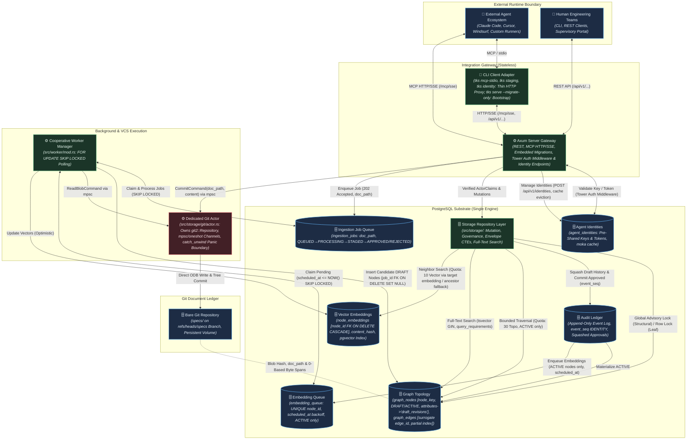

# TKS (The Knowledge Substrate): Architecture

## 1. Context & Drivers

The Knowledge Substrate (TKS) is a purpose-built requirement-intent provenance substrate
that anchors external AI agents and human engineering teams to a unified, version-governed
property graph. This architecture addresses three structural failure modes in agentic
software engineering: context window collapse (code-level context blindness to intent),
specification drift (decoupled documentation), and the monolithic diff dilemma (unscalable
human review of agent-generated output).

The architecture is shaped by the following drivers extracted from the governing vision,
strategic backlog, and Project Initiator directives:

| ID | Driver | Source |
| :--- | :--- | :--- |
| DR-1 | Unified graph-relational substrate combining property graph topology, vector embeddings, and relational audit in a single PostgreSQL engine | vision.md §2 Key Capabilities (1) |
| DR-2 | Document provenance and assisted decomposition: Git-backed content-addressed document store with mechanical AST parsing, LLM-assisted extraction, and human review gates | vision.md §2 Key Capabilities (2) |
| DR-3 | Agent-agnostic integration via MCP and REST: stateless protocol gateway for context retrieval and governed mutation | vision.md §2 Key Capabilities (3) |
| DR-4 | Immutable audit ledger with complete historical reversibility and point-in-time reconstruction for approved requirements | vision.md §2 Key Capabilities (4) |
| DR-5 | Per-node governance: attribute-based authorization controlling autonomous elaboration vs. human gating | vision.md §2 Key Capabilities (5) |
| DR-6 | Self-referential bootstrapping: the substrate manages its own development lifecycle via a phased transition: Phase 1 establishes read-only self-hosting for context querying, while Phase 2 enables autonomous self-evolution | vision.md §2 Key Capabilities (6), §3, §5 Invariant I-6; response.md LD-1 |
| DR-7 | Resource-constrained execution model: phased delivery achievable by solo developer or small team on commodity infrastructure | vision.md §3, backlog §1 |
| DR-8 | Sub-second micro-reflex graph traversal latency (<50 ms for k≤3 hops) at the operational hot path | vision.md §2 Operational Timescales, backlog §6 SLA-1 |
| DR-9 | Externalized cognitive compute: the substrate never invokes LLM inference internally; agents supply their own models | vision.md §3 |
| DR-10 | Phased hypothesis de-risking: lightweight spikes validate foundational premises (H-1, H-4) before infrastructure commitment | backlog §2 Phase 0, §5 Spike 0 |
| DR-11 | Token minimization & mechanical 80/20 parsing: minimize LLM reliance and token usage by using mechanical CommonMark AST decomposition for the initial 80%+ of structural parsing, restricting LLM invocations to compact classification tuples | Project Initiator Directive, iteration 2; response.md LD-1 |
| DR-12 | Two-tier state lifecycle with draft compaction: maintain strict distinction between Draft/Editable and Approved/Locked entities; compact intermediate draft history upon approval to eliminate audit ledger bloat | Project Initiator Directive, iteration 2; response.md LD-2 |
| DR-13 | Deterministic byte-offset alignment & non-destructive edge lifecycle: guarantee runtime safety on multi-byte UTF-8 texts and complete reversibility of graph topologies without physical edge deletion | iteration 3; response.md LD-1, LD-2 |
| DR-14 | Non-cascading data retention, conflict-free edge lifecycle & offline search: ensure canonical requirement survival on job queue pruning, surrogate keys for edge evolution, and sub-5ms offline search via PostgreSQL full-text indexing | iteration 4; response.md LD-1, LD-2, LD-6, LD-8 |
| DR-15 | Document path-anchored Git tree reachability, actor-isolated VCS execution, and strict total event ordering: maintain stable document paths (`doc_path`) for Git diff/log inspection and deterministic span re-anchoring, isolate blocking libgit2 C calls within a dedicated background Git actor, and enforce total event ordering in the audit ledger via monotonic 64-bit sequence keys | iteration 5; response.md LD-1, LD-2, LD-4 |
| DR-16 | Document revision reconciliation, canonical node addressing, and bootstrap migration autonomy: maintain stable human-readable keys (`node_key`) across revisions, reconcile revised CommonMark AST blocks with in-place span re-anchoring and active node supersession, and eliminate circular migration dependencies via auto-applying embedded migrations on boot | iteration 6; response.md LD-1, LD-2, LD-3, LD-5, LD-10 |

## 2. Constraints

### 2.1 Project Initiator Constraints

> ## Core Philosophy & Token Optimization
>
> Overall, we need to minimize token usage by sticking to a primary philosophy: **minimal LLM reliance and maximum reliance on mechanical processes.**
>
> * **Reducing Output Tokens:** Since output tokens are much more expensive than input tokens, saving on output is key. While we can't reduce ingestion costs significantly, we can lower the LLM's output burden by using mechanical extraction tools to handle the initial 80/20 (or better) of requirements parsing.  
> * **Document Decomposition:** We should explore what existing tools or mechanical options are available to decompose ingested documents and further cut down the LLM token load.
>
> ## State Management & Versioning
>
> We need a clear status distinction between **"Approved / Locked"** and **"Draft / Editable"**. Making every small draft immutable would create far too much churn and turn this into a complex version control system rather than a clean, auditable set of evolving requirements. For history and audit logging, we could maintain detailed event logs while a requirement is in draft. Once it gets approved, we collapse those intermediate draft events to avoid history bloat, while still preserving visibility into why the document mutated during drafting (just an idea, not a strict requirement).
>
> ## Scope Grounding & Architectural Level of Detail (Iteration 6)
>
> Lets not go too much into specification that is the purpose of the next phase. If we understand the technologies, workflows and boundaries and scopes then the implementation team is capable of elaborating the final detail and will flag up if they need too. This is not a direction to stop iterating it is grounding in how much detail an architecture document should have.

### 2.2 Derived Constraints

| ID | Constraint | Source |
| :--- | :--- | :--- |
| C-1 | Pure Rust package repository: all substrate service code is authored in Rust (edition 2024), built via Cargo stable toolchain | GEMINI.md (project guidelines) |
| C-2 | Single PostgreSQL engine: all topology data, vector embeddings (`pgvector`), relational metadata, and audit records reside in one PostgreSQL instance; no external graph or vector databases | vision.md §3 |
| C-3 | Stateless gateway boundary: MCP and REST interfaces maintain no persistent session memory; every operation is an authenticated, isolated transaction | vision.md §3 |
| C-4 | Document immutability: uploaded text specifications are stored in a Git-backed repository committed to a dedicated specifications branch (`refs/heads/specs`) with mandatory persistent document paths (`doc_path`); source spans reference immutable Git blob identities via 0-based byte offsets and `doc_path` | vision.md §3, response.md LD-2, LD-12, LD-1 (iter 5) |
| C-5 | Schema flexibility via progressive JSONB layering: core tables enforce foundational structural edges and typed invariants; domain-specific attributes use typed JSONB fields | vision.md §3 |
| C-6 | Bootstrap boundary: Phase 0 uses conventional tooling; Phase 1 establishes read-only self-hosting for context querying; Phase 2 onwards all feature requirements, architectural adjustments, and development tasks must be authored, reviewed, and tracked within the substrate | vision.md §3, §5 Invariant I-6; response.md LD-1 |
| C-7 | No in-database agent execution: the substrate never runs autonomous agent cognitive loops internally | vision.md §3, Invariant I-3 |
| C-8 | LLM interaction restricted to human-directed document ingestion and decomposition pipelines only | vision.md §3 |
| C-9 | Phase 0 and Phase 1 must be achievable on commodity infrastructure by a single developer or small team | vision.md §3, backlog §1 |
| C-10 | Dependency policy: prefer well-established Rust crates; avoid dependencies for functionality small enough to implement with the standard library | GEMINI.md |
| C-11 | Mechanical-first extraction: decomposition must execute CommonMark AST parsing and keyword scanning mechanically; LLMs must never echo verbatim source text and output only compact classification tuples | Project Initiator Directive, iteration 2; response.md LD-1 |
| C-12 | Centralized connection daemon & CLI HTTP client: runtime operational CLI commands (`tks mcp-stdio`, `tks staging`, `tks identity`) operate strictly as thin HTTP clients targeting the running `tks serve` daemon to avoid connection pool exhaustion; database migrations are embedded inside `tks serve` and auto-applied on startup before network binding, with a dedicated `--migrate-only` CLI flag for offline CI/CD environments | response.md LD-6, LD-11, LD-8 (iter 5), LD-13 (iter 5), LD-3, LD-10 |
| C-13 | Draft lifecycle isolation & staging consolidation: candidate requirements from decomposition and agent proposals reside directly in `graph_nodes` and `graph_edges` with `lifecycle_state = 'DRAFT'`. Production queries filter on `lifecycle_state = 'ACTIVE'`. Staging queue and standalone draft revisions table are eliminated. Ephemeral draft edits append to `graph_nodes.attributes->'draft_revisions'` and are atomically squashed into a single canonical audit event with `draft_evolution_summary` JSONB upon approval | Project Initiator Directive, iteration 2; response.md LD-3, LD-5, LD-11, LD-9 |
| C-14 | Offline and micro-reflex requirement search: `query_requirements` must execute via PostgreSQL native full-text search (`tsvector` / partial GIN index on active nodes) in <5ms without external network or LLM dependencies, reserving vector search strictly for asynchronous out-of-band context envelope enrichment | response.md LD-6, LD-7 |
| C-15 | Non-cascading requirement retention: Canonical requirement lifecycle must be decoupled from transient ingestion job retention via non-cascading foreign keys (`ON DELETE SET NULL`) | response.md LD-1 |
| C-16 | Actor-isolated Git execution: libgit2 C operations must execute within a dedicated background actor thread over bounded `mpsc` and `oneshot` channels with internal panic recovery (`std::panic::catch_unwind`); blocking C calls must never run directly on Tokio async worker threads | response.md LD-2 (iter 5), LD-8 |
| C-17 | Token-minimized embedding scheduling: `embedding_queue` entries are enqueued strictly upon node transition to `ACTIVE` or content update of an already active node; candidate draft nodes must never enqueue embedding jobs | Project Initiator Directive, response.md LD-3 (iter 5) |
| C-18 | Canonical node identity resolution: requirements, specifications, and tasks must support human-readable canonical keys (`node_key VARCHAR(64)`) with a partial unique index on active nodes; all MCP and REST interfaces must accept either UUID or string `node_key` polymorphically | response.md LD-5 |

## 3. Architectural Invariants

| ID | Invariant | Rationale | Verification |
| :--- | :--- | :--- | :--- |
| INV-1 | Every active functional specification, implementation task, and code artifact reference must maintain a valid directed edge path terminating at an authorized active requirement node. Entities in `DRAFT`, `NEEDS_REVERIFICATION`, `SUPERSEDED`, or `ARCHIVED` states are explicitly exempt from requiring active requirement ancestors (draft nodes require only a structural parent edge to an existing draft or active node). Orphan execution tasks must be rejected at the database constraint level. During atomic batch draft promotion (`POST /api/v1/staging/approve`), the transactional CTE ancestor verification evaluates child specification and task nodes against the union of currently `ACTIVE` requirement nodes and candidate requirement nodes included in the current promotion batch (`id = ANY($approved_node_ids)`), preventing false invariant failures on hierarchical specification trees. All governance edges (`CONSTRAINED_BY`, `FULFILLS`) must point directed upward toward governing requirements (`Spec -CONSTRAINED_BY-> Requirement`). | Ensures end-to-end traceability from vision to code while preventing draft tree authoring failures, batch approval transaction rollbacks, and invalidation cascade transaction aborts during administrative rollbacks. | Enforced during draft promotion/approval (`POST /api/v1/staging/approve` or transition to `ACTIVE`) via transactional CTE ancestor checks evaluating the union of active and batch-approved nodes, eliminating row-level trigger write amplification. Integration test: attempt to promote orphan task node without valid requirement path → expect transaction rollback; batch-promote multi-tier requirement, specification, and task tree → expect atomic success. Rollback cascade test: verify that reverting a parent node transitions children to `NEEDS_REVERIFICATION` without trigger abort. |
| INV-2 | Destructive in-place updates (`UPDATE`, `DELETE`) on active requirements, specifications, and topological edges must not occur. Structural edges in `graph_edges` maintain a strongly typed `lifecycle_state` (`DRAFT`, `ACTIVE`, `SUPERSEDED`, `REVERTED`), use dedicated surrogate primary keys (`edge_id UUID PRIMARY KEY DEFAULT gen_random_uuid()`) with a partial unique index on active edges (`idx_graph_edges_active_unique WHERE lifecycle_state = 'ACTIVE'`), and are never physically deleted. Promoting candidate draft edges requires dual-endpoint active validation (both endpoints must be active) and automatically supersedes conflicting existing active edges. All approved state transitions must be recorded as discrete, reversible audit events in `audit_ledger` with a monotonically increasing integer sequence primary key (`event_seq BIGINT GENERATED ALWAYS AS IDENTITY PRIMARY KEY`), guaranteeing strict total event ordering and point-in-time reconstruction without timestamp collision vulnerabilities. For entities in `DRAFT` state, intermediate edits append to ephemeral draft revision arrays inside `graph_nodes.attributes->'draft_revisions'` and are collapsed (squashed) into a single canonical `APPROVED` event upon approval. Operational mutations on active execution tasks (`TASK`) lock the row via `SELECT ... FOR UPDATE` and commit discrete reversible state events directly to `audit_ledger`. External agents cannot rewrite active normative requirements in place; modifications must be submitted as candidate `DRAFT` nodes. | Guarantees complete auditability and historical reversibility for approved requirements and topological relationships while preventing draft history churn from bloating the audit ledger and eliminating primary key collisions during edge lifecycle transitions. | Monotonically increasing `event_seq` sequence in audit ledger. Draft approvals insert exactly one canonical `APPROVED` record containing final verified state and a `draft_evolution_summary` JSONB. Integration test: mutate an active node or edge, query historical snapshot at prior `event_seq` → expect original state. Edge lifecycle test: supersede/revert an edge and re-link between identical nodes → expect success without unique constraint violation. Edge query test: verify recursive CTEs with partial index filter exclude superseded and reverted edges. Active task mutation test: update task status → expect row lock and immediate audit ledger event. |
| INV-3 | The core database engine and gateway services must never execute autonomous agent cognitive loops internally. The substrate must function strictly as a deterministic state store and protocol gateway. | Preserves operational determinism; prevents uncontrolled LLM invocations within the trusted storage boundary; keeps cognitive compute externalized and auditable. | Code review gate: no LLM client invocations in gateway or storage crate modules. CI lint rule scanning for prohibited dependency imports. |
| INV-4 | Every requirement derived via the decomposition pipeline must store a persistent cryptographic reference (Git commit/blob hash), document path/slug (`doc_path`), and 0-based source byte span coordinates (`byte_start`, `byte_end`) pointing to the original document artifact. | Enables independent verification of requirement provenance against immutable source text; anchors extracted semantics to deterministic byte ranges, enables Git tree reconstruction, and prevents runtime UTF-8 string-slicing panics in Rust. | Integration test: for each extracted requirement node, resolve Git blob hash and verify that `&source_bytes[byte_start..byte_end]` matches the stored requirement verbatim text at `doc_path` without character boundary slicing panics. |
| INV-5 | Permissions to alter or elaborate a graph node must be governed by explicit per-node `governance_policy` metadata attributes (`AUTONOMOUS_ELABORATION`, `HUMAN_REVIEW_REQUIRED`, `LOCKED`). Node-level policies must take absolute precedence over global agent roles. | Provides granular, progressive delegation of autonomy; prevents agents from modifying safety-critical requirements without human authorization. | Integration test: agent attempts mutation on `LOCKED` node → expect rejection; agent mutates `AUTONOMOUS_ELABORATION` node → expect draft commit; agent mutates `HUMAN_REVIEW_REQUIRED` node → expect staging/review flag. |
| INV-6 | The Knowledge Substrate must be used to manage its own development through a phased bootstrapping transition. Upon completing Phase 1 foundational ingestion and read-only context retrieval, the substrate must self-host its own documentation (`vision.md`, backlogs) for context querying by human developers and external agents to implement Phase 2 tasks. Upon completing Phase 2 mutation tooling, draft lifecycle handling, and governance, all subsequent feature requirements, architectural adjustments, and development tasks must be authored, reviewed, and tracked directly within the substrate itself. | Self-referential dogfooding exposes UX friction early and validates utility without blocking Phase 1 exit criteria on non-existent Phase 2 mutation tools. | Phase 1 dogfooding audit: project's own documentation (`vision.md`, backlogs) ingested and queryable via read-only MCP (`get_context_envelope`, `query_requirements`). Phase 2 dogfooding audit: post-Phase 2 tasks and requirements created and mutated directly via MCP tools. |
| INV-7 | Every mutation submitted through the Integration Gateway must be attributable to a verified external identity (human user or agent instance). Identity credentials must be recorded in the audit ledger alongside mutation events. No mutation may be committed without a verified identity reference. Identity revocation must immediately invalidate local cache entries across running services. | Non-negotiable audit requirement; enables forensic tracing of any graph change to its originator; supports blast-radius containment for compromised agents. | Two-tier authentication: For Phase 1–2, agents authenticate via pre-shared API keys or HMAC bearer tokens mapped to `agent_identities`; stdio passes credentials via process environment variables (`TKS_AGENT_ID`, `TKS_AUTH_TOKEN`) or tool payload `auth` fields; HTTP/SSE uses `Authorization: Bearer <token>`. Audit ledger schema enforces NOT NULL on `actor_id`, `actor_type`, and `token_fingerprint`. Integration test: submit mutation without auth credentials → expect rejection. Revocation test: call revocation endpoint → verify immediate rejection of cached bearer tokens. |

## 4. Component Topology



### Component Responsibilities & Boundaries

| Component | Responsibility | Owns State | Depends On |
| :--- | :--- | :--- | :--- |
| Axum Server Gateway | Single unified HTTP service hosting REST endpoints (`/api/v1/...`), identity administration (`/api/v1/identities`, `/api/v1/identities/{id}/revoke`), and MCP over HTTP/SSE (`/mcp/sse`, `/mcp/messages`) on a single port; executes embedded migrations (`refinery::embed_migrations!`) on startup before binding listeners; incorporates Tower authentication middleware and `FromRequestParts` extractor (`src/gateway/auth.rs`) validating inbound credentials against `agent_identities` with an in-process `moka` LRU cache; immediately invalidates cache entries upon revocation; handles request lifecycle, streaming, and granular approval/rejection endpoints | No (stateless) | Storage Repository Layer, Dedicated Git Actor, Ingestion Job Queue, Agent Identities table |
| CLI Client Adapter (`tks mcp-stdio`, `tks staging`, `tks identity`) | Unified lightweight CLI binary operating strictly as a thin HTTP/SSE client for runtime operations; forwards JSON-RPC frames over HTTP/SSE (`tks mcp-stdio`) and operational commands (`tks staging`, `tks identity`) via REST to the running Axum daemon; supports standalone `--migrate-only` execution on `tks serve` for offline CI/CD database migrations; maintains zero direct database connection pools during routine agent sessions; implements backoff startup checks and structured initialization error formatting | No (stateless thin HTTP client) | Axum Server Gateway |
| Dedicated Git Actor Task (`src/storage/git/actor.rs`) | Dedicated background actor thread exclusively owning the `git2::Repository` handle; receives work requests via bounded Tokio mpsc channel (`tokio::sync::mpsc::channel`); executes blocking libgit2 C calls sequentially off the Tokio async worker pool; encapsulates command execution inside `std::panic::catch_unwind` recovery boundary to preserve channel receiver across transient panics; commits raw specs to `refs/heads/specs` at persistent document paths (`doc_path`) and returns results via `tokio::sync::oneshot` channels, eliminating Tokio reactor starvation, thread safety issues, `.lock` collisions, and channel disconnection | Yes: bare Git repository handle | Bare Git Repository on persistent volume |
| Storage Repository Layer (`src/storage/`) | Consolidated storage domain module (`src/storage/mutation.rs`, `src/storage/governance.rs`, `src/storage/envelope.rs`) executing transactional mutations, DAG cycle validation, per-node governance checks, polymorphic UUID/`node_key` resolution, quota-partitioned bounded recursive CTE graph traversals (guaranteed 30 topological nodes + up to 10 vector neighbors, node limit 40, depth $\le 3$), and sub-5ms native full-text search (`tsvector` / partial GIN) for `query_requirements` under `READ COMMITTED` | No (stateless repository) | Graph Topology, Audit Ledger, Vector Embeddings |
| Cooperative Worker Manager (`src/worker/mod.rs`) | Unified cooperative background worker manager running inside `tks serve` orchestrating both document decomposition (`ingestion_jobs`) and asynchronous embedding generation (`embedding_queue`) via timer polling with `FOR UPDATE SKIP LOCKED` and exponential backoff sleep (eliminating bespoke `LISTEN/NOTIFY`), centralizing shutdown, telemetry, connection usage, and retry backoff | No (stateless worker) | Ingestion Job Queue, Embedding Queue, Dedicated Git Actor, Graph Topology, Vector Embeddings, external LLM/embedding APIs |
| Decomposition Pipeline (Subsystem) | Subsystem of Worker Manager consuming `ingestion_jobs`; executes Stage 1 CommonMark AST parsing (`pulldown-cmark`) for 80%+ structural chunking with exact 0-based byte offsets, `node_key` extraction, and `doc_path`, and Stage 2 targeted LLM semantic classification for compact classification tuples; stages candidate nodes directly in `graph_nodes` with `lifecycle_state = 'DRAFT'` and `job_id` FK with `ON DELETE SET NULL`; candidate draft nodes never enqueue embedding generation tasks; includes graceful degradation to mechanical extraction with default typing when external LLM credentials are not configured or external provider calls fail | No (stateless worker) | Ingestion Job Queue, Dedicated Git Actor, Graph Topology, external LLM API |
| Embedding Worker (Subsystem) | Subsystem of Worker Manager consuming `embedding_queue`; batch-fetches pending entries (`WHERE status = 'PENDING' AND scheduled_at <= NOW() FOR UPDATE SKIP LOCKED`), calls embedding provider APIs, updates `node_embeddings` out-of-band using optimistic concurrency control, and sets exponential backoff delay (`scheduled_at = NOW() + INTERVAL '1s' * 2^retry_count`) on rate-limit (429/503) errors | No (stateless worker) | Embedding Queue, Vector Embeddings, external embedding API |
| Graph Topology (PostgreSQL) | Stores `graph_nodes` (with explicit `node_key VARCHAR(64)` indexed partially on active nodes, `DRAFT` and `ACTIVE` states, generated `search_tsv tsvector` with partial GIN index, `attributes JSONB` storing ephemeral `attributes->'draft_revisions'`, and `job_id` FK with `ON DELETE SET NULL`) and `graph_edges` with surrogate primary key `edge_id` and strongly typed `lifecycle_state` (`DRAFT`, `ACTIVE`, `SUPERSEDED`, `REVERTED`); partial index `idx_graph_edges_active_unique` enforces active edge uniqueness; enforces structural invariants via transactional CTEs; standardizes upward orientation for `CONSTRAINED_BY` edges | Yes: canonical graph state | PostgreSQL engine |
| Vector Embeddings (pgvector) | Stores dense vector representations of graph nodes (`node_embeddings`) with foreign key `REFERENCES graph_nodes(id) ON DELETE CASCADE`, `content_hash`, and `updated_at` for similarity-based neighbor lookup; obsolete vectors deleted upon node supersession | Yes: embedding vectors | Graph Topology (node identity) |
| Audit Ledger (PostgreSQL) | Append-only event log recording every approved node/edge mutation with actor identity, timestamp, total event ordering sequence `event_seq`, reversible delta payload, and squashed draft evolution summaries | Yes: immutable event stream | PostgreSQL engine |
| Ingestion Job Queue (PostgreSQL) | Durable queue (`ingestion_jobs`) tracking asynchronous document decomposition tasks, persistent document path `doc_path`, and statuses (`QUEUED`, `PROCESSING`, `STAGED`, `APPROVED`, `REJECTED`, `FAILED`) | Yes: job state | PostgreSQL engine |
| Embedding Queue (PostgreSQL) | Persistent queue (`embedding_queue`) with `UNIQUE (node_id)`, `content_hash`, and retry scheduling column `scheduled_at` tracking asynchronous node embedding tasks for active nodes | Yes: queue state | PostgreSQL engine |
| Agent Identities (PostgreSQL) | Table (`agent_identities`) storing authorized agent instances, pre-shared token hashes/HMAC credentials, and active status | Yes: identity records | PostgreSQL engine |
| Bare Git Document Ledger | Content-addressed bare Git repository storing raw Markdown/text specification documents committed directly to dedicated specifications branch (`refs/heads/specs`) at persistent document paths (`doc_path`); operations serialized via dedicated background Git actor task | Yes: document artifacts | Dedicated persistent filesystem volume |

### Deployment & Process Model

The deployment model targets a robust single-host configuration suitable for the constrained resource model (solo developer / small team):

* **Single Rust binary** compiled from the `tks` crate:
  * Default server mode (`tks serve`): Runs the unified `Axum` HTTP service hosting REST endpoints, identity administration, and MCP over HTTP/SSE on the configured port (default `:8080`), integrating Tower authentication middleware and extractors, along with the dedicated background Git actor task (`src/storage/git/actor.rs`) and the cooperative `WorkerManager` running background loops for `ingestion_jobs` and `embedding_queue`. All database connection pooling (`deadpool-postgres`), advisory locking, and Git ODB handles are centralized strictly inside this single process. On startup, `tks serve` automatically executes pending embedded database migrations (via `refinery::embed_migrations!`) against PostgreSQL before binding network listeners and starting background workers, ensuring zero deployment synchronization issues.
  * Standalone bootstrap migration mode (`tks serve --migrate-only`): Executes pending embedded database migrations directly against `$DATABASE_URL` and terminates immediately with exit code 0. Used in CI/CD pipelines, Docker Compose init containers, and Kubernetes pre-install hooks without requiring a running server daemon.
  * Dedicated CLI client mode: CLI subcommands (`tks mcp-stdio`, `tks staging`, `tks identity`) operate strictly as thin HTTP clients targeting the local `tks serve` REST API (`http://localhost:8080/api/v1/...`). The CLI binary embeds only a lightweight HTTP client (`reqwest`), eliminating database client dependencies and multi-process connection pool exhaustion. `tks mcp-stdio` forwards standard input/output JSON-RPC to the running Axum daemon over HTTP/SSE, implementing backoff retries and structured JSON-RPC initialization error formatting if `tks serve` is not running (addressing TB-4).
  * Diagnostic logging: `tracing-subscriber` is explicitly configured to write all logs and diagnostic traces strictly to `stderr`. `stdout` is exclusively reserved for valid JSON-RPC framing when operating in stdio mode.
* **PostgreSQL instance** (with `pgvector` extension) runs as a separate process or container, accessed via connection pooling (`deadpool-postgres`).
* **Bare Git repository** (`git init --bare`) resides on a dedicated, persistent filesystem volume co-located with PostgreSQL storage, accessed via `git2` direct low-level ODB writes through the dedicated Git actor task. Raw document uploads commit directly onto `refs/heads/specs` under stable document paths (`doc_path`, e.g. `specs/vision.md`), ensuring 100% reachability via the Git commit-tree graph without loose reference files, `.lock` contention, or prune configuration overrides (addressing TB-1, D-42, D-43).
* A standard `docker-compose.yml` provisions PostgreSQL with `pgvector` and mounts persistent volumes for PostgreSQL data and the bare Git repository.

## 5. Data & State Model

### 5.1 State Ownership

| State | Owner | Storage | Consistency | Lifecycle |
| :--- | :--- | :--- | :--- | :--- |
| Graph nodes | Graph Topology | PostgreSQL `graph_nodes` table (`id`, `node_key VARCHAR(64)`, `node_type`, `title`, `content`, `search_tsv tsvector`, `lifecycle_state`, `governance_policy`, `job_id REFERENCES ingestion_jobs(job_id) ON DELETE SET NULL`, `attributes JSONB`) | Strong (ACID transactions) | Created via decomposition or agent proposal → `DRAFT` → approved → `ACTIVE` → `SUPERSEDED`, `ARCHIVED`, or `NEEDS_REVERIFICATION`; candidate drafts not approved in a batch are atomically purged; intermediate draft edits recorded in `attributes->'draft_revisions'` array; decoupled from job pruning |
| Structural edges | Graph Topology | PostgreSQL `graph_edges` table (`edge_id UUID PRIMARY KEY`, `from_node_id`, `to_node_id`, `edge_type`, `lifecycle_state`) | Strong (ACID, global advisory lock, partial unique index `WHERE lifecycle_state = 'ACTIVE'`) | Created alongside node; supports draft edges between draft nodes; dual-endpoint active validation on promotion; supersedes conflicting active edges; never physically deleted (INV-2), only transitioned to `SUPERSEDED` or `REVERTED` without PK collisions; `CONSTRAINED_BY` uniformly points upward |
| Source span references | Graph Topology | PostgreSQL `source_spans` table (`span_id UUID PRIMARY KEY`, `node_id UUID NOT NULL REFERENCES graph_nodes(id) ON DELETE CASCADE`, `doc_path VARCHAR(255) NOT NULL`, `doc_hash VARCHAR(64) NOT NULL`, `byte_start INT NOT NULL`, `byte_end INT NOT NULL`, `created_at TIMESTAMPTZ NOT NULL DEFAULT NOW()`) | Strong (immutable after creation; pinned to Git blob hash and `doc_path` via 0-based byte offsets) | Created mechanically during CommonMark AST parsing (`pulldown-cmark`); re-anchored on document revision via `doc_path` |
| Vector embeddings | Vector Index | PostgreSQL `node_embeddings` table (`node_id UUID PRIMARY KEY REFERENCES graph_nodes(id) ON DELETE CASCADE`, `embedding vector`, `content_hash VARCHAR(64) NOT NULL`, `updated_at TIMESTAMPTZ NOT NULL`) | Eventually consistent (asynchronously updated out-of-band via `embedding_queue`) | Created on node approval/content change; updated asynchronously by embedding worker with optimistic concurrency; deleted via foreign key CASCADE or explicitly purged on requirement supersession |
| Embedding queue | Embedding Pipeline | PostgreSQL `embedding_queue` table (`node_id UUID PRIMARY KEY REFERENCES graph_nodes(id) ON DELETE CASCADE`, `content_hash VARCHAR(64) NOT NULL`, `status`, `retry_count`, `scheduled_at TIMESTAMPTZ NOT NULL DEFAULT NOW()`, `updated_at`) | Strong (transactional deduplicated queue) | Enqueued strictly on node transition to `ACTIVE` or content update of active node (`PENDING`); candidate draft nodes never enqueue; claimed with `scheduled_at <= NOW()`; deleted on success or flagged `FAILED` |
| Governance policy | Storage Repository | Strongly typed column on `graph_nodes` (`VARCHAR` with `CHECK`: `AUTONOMOUS_ELABORATION`, `HUMAN_REVIEW_REQUIRED`, `LOCKED`) | Strong (per-node, indexed, checked at mutation time) | Set at node creation; updated by human administrator only |
| Node lifecycle state | Graph Topology | Strongly typed column on `graph_nodes` (`VARCHAR` with `CHECK`: `DRAFT`, `ACTIVE`, `SUPERSEDED`, `ARCHIVED`, `NEEDS_REVERIFICATION`) | Strong (indexed, evaluated during recursive CTE traversals) | Starts in `DRAFT` or `ACTIVE`; transitions managed by storage repository or dependency sweep |
| Audit events | Audit Ledger | PostgreSQL `audit_ledger` table (`event_seq BIGINT GENERATED ALWAYS AS IDENTITY PRIMARY KEY`, `event_id UUID`, `event_type`, `entity_id`, `entity_type`, `actor_id`, `actor_type`, `token_fingerprint`, `delta JSONB`, `snapshot JSONB`, `draft_evolution_summary JSONB`, `created_at`) | Strong (append-only, total ordering sequence, NOT NULL actor and token constraints) | Created on approved mutation; squashes draft history on approval; never modified or deleted |
| Ingestion jobs | Ingestion Pipeline | PostgreSQL `ingestion_jobs` table (`job_id UUID PRIMARY KEY`, `doc_path VARCHAR(255) NOT NULL`, `document_hash VARCHAR(64) NOT NULL`, `status`, `error_message`, `retry_count`, `created_at`, `updated_at`) | Strong (transactional state machine) | Created on `POST /api/v1/documents/ingest` (`QUEUED`) → `PROCESSING` → `STAGED` (candidates pending review) → `APPROVED` (promoted to `ACTIVE`) or `REJECTED` (candidates discarded), with `FAILED` on error |
| Agent identities | Axum Gateway (Auth) | PostgreSQL `agent_identities` table (`agent_id`, `token_hash`, `actor_type`, `is_active`, `created_at`) | Strong (ACID) | Provisioned by administrator CLI (`tks identity create`) via daemon REST API or dev seed → active → revoked; validated via Tower middleware / extractor with in-process `moka` LRU cache; cache entry invalidated immediately on revocation |
| Document artifacts | Git Document Ledger | Bare Git repository on persistent volume committed to `refs/heads/specs` branch at persistent `doc_path` | Strong (content-addressed, cryptographic integrity, standard commit-tree reachability, dedicated Git actor task) | Ingested via REST API → committed to bare Git ODB on `specs` branch at `doc_path` via Git actor → immutable blob referenced by commit/blob hash |

#### Entity Typing and Relational Constraints

The primary entity table is `graph_nodes`. It incorporates mandatory typed discriminator and lifecycle columns governed by PostgreSQL `CHECK` constraints, an optional human-readable canonical node key (`node_key`, e.g. `REQ-CORE-001`, `TASK-AUTH-042`) with partial unique indexing on active nodes, a generated `tsvector` column with partial GIN indexing for sub-5ms active requirement search, and a non-cascading foreign key on `job_id`:

```sql
ALTER TABLE graph_nodes ADD COLUMN node_key VARCHAR(64);
CREATE UNIQUE INDEX idx_graph_nodes_node_key_active
    ON graph_nodes (node_key)
    WHERE lifecycle_state = 'ACTIVE' AND node_key IS NOT NULL;

ALTER TABLE graph_nodes ADD CONSTRAINT chk_node_type
    CHECK (node_type IN ('REQUIREMENT', 'SPECIFICATION', 'TASK', 'VERIFICATION', 'DECISION'));
ALTER TABLE graph_nodes ADD CONSTRAINT chk_lifecycle_state
    CHECK (lifecycle_state IN ('DRAFT', 'ACTIVE', 'SUPERSEDED', 'ARCHIVED', 'NEEDS_REVERIFICATION'));
ALTER TABLE graph_nodes ADD CONSTRAINT chk_governance_policy
    CHECK (governance_policy IN ('AUTONOMOUS_ELABORATION', 'HUMAN_REVIEW_REQUIRED', 'LOCKED'));

-- Foreign key decoupled from transient job queue retention (addressing LD-1, iter 4)
ALTER TABLE graph_nodes ADD CONSTRAINT fk_graph_nodes_job
    FOREIGN KEY (job_id) REFERENCES ingestion_jobs(job_id) ON DELETE SET NULL;

-- Native full-text search generated column and partial GIN index (addressing LD-6, iter 4; LD-7, iter 6)
ALTER TABLE graph_nodes ADD COLUMN search_tsv tsvector
    GENERATED ALWAYS AS (to_tsvector('english', coalesce(title, '') || ' ' || coalesce(content, ''))) STORED;
CREATE INDEX idx_graph_nodes_search_tsv ON graph_nodes USING gin(search_tsv)
    WHERE lifecycle_state = 'ACTIVE';
```

Structural edges in `graph_edges` enforce endpoint validity rules via foreign keys, a first-class `lifecycle_state` column, a dedicated surrogate key, and a partial unique index on active edges (addressing LD-1, LD-2, iter 4):

```sql
CREATE TABLE graph_edges (
    edge_id UUID PRIMARY KEY DEFAULT gen_random_uuid(),
    from_node_id UUID NOT NULL REFERENCES graph_nodes(id) ON DELETE CASCADE,
    to_node_id UUID NOT NULL REFERENCES graph_nodes(id) ON DELETE CASCADE,
    edge_type VARCHAR(32) NOT NULL,
    lifecycle_state VARCHAR(20) NOT NULL DEFAULT 'ACTIVE'
        CHECK (lifecycle_state IN ('DRAFT', 'ACTIVE', 'SUPERSEDED', 'REVERTED'))
);

CREATE UNIQUE INDEX idx_graph_edges_active_unique
    ON graph_edges (from_node_id, to_node_id, edge_type)
    WHERE lifecycle_state = 'ACTIVE';
```

Document source spans in `source_spans` provide concrete relational backing for Invariant INV-4, linking extracted requirement nodes to exact 0-based byte offsets and persistent document paths (`doc_path`) in the source text (addressing LD-1, iter 5; LD-2, LD-5):

```sql
CREATE TABLE source_spans (
    span_id UUID PRIMARY KEY DEFAULT gen_random_uuid(),
    node_id UUID NOT NULL REFERENCES graph_nodes(id) ON DELETE CASCADE,
    doc_path VARCHAR(255) NOT NULL,
    doc_hash VARCHAR(64) NOT NULL,
    byte_start INT NOT NULL,
    byte_end INT NOT NULL,
    created_at TIMESTAMPTZ NOT NULL DEFAULT NOW()
);

CREATE INDEX idx_source_spans_node ON source_spans(node_id);
CREATE INDEX idx_source_spans_path ON source_spans(doc_path);
```

The append-only `audit_ledger` enforces total event ordering and point-in-time reconstruction via a monotonically increasing sequence primary key and referential integrity isolation (addressing LD-4, iter 5):

```sql
CREATE TABLE audit_ledger (
    event_seq BIGINT GENERATED ALWAYS AS IDENTITY PRIMARY KEY,
    event_id UUID NOT NULL DEFAULT gen_random_uuid(),
    event_type VARCHAR(32) NOT NULL,
    entity_id UUID NOT NULL,
    entity_type VARCHAR(32) NOT NULL,
    actor_id VARCHAR(64) NOT NULL,
    actor_type VARCHAR(16) NOT NULL,
    token_fingerprint VARCHAR(64) NOT NULL,
    delta JSONB NOT NULL,
    snapshot JSONB NOT NULL,
    draft_evolution_summary JSONB,
    created_at TIMESTAMPTZ NOT NULL DEFAULT NOW()
);

CREATE INDEX idx_audit_ledger_entity ON audit_ledger(entity_id, event_seq);
CREATE INDEX idx_audit_ledger_created_at ON audit_ledger(created_at);
```

The `embedding_queue` incorporates persistent retry backoff scheduling to eliminate tight-loop hammering on HTTP 429 rate limits (addressing LD-7, iter 5):

```sql
CREATE TABLE embedding_queue (
    node_id UUID PRIMARY KEY REFERENCES graph_nodes(id) ON DELETE CASCADE,
    content_hash VARCHAR(64) NOT NULL,
    status VARCHAR(20) NOT NULL DEFAULT 'PENDING'
        CHECK (status IN ('PENDING', 'PROCESSING', 'FAILED')),
    retry_count INT NOT NULL DEFAULT 0,
    scheduled_at TIMESTAMPTZ NOT NULL DEFAULT NOW(),
    updated_at TIMESTAMPTZ NOT NULL DEFAULT NOW()
);

CREATE INDEX idx_embedding_queue_pending
    ON embedding_queue(scheduled_at)
    WHERE status = 'PENDING';
```

Edge relationship rules:

* `FULFILLS` edges must originate at `TASK` or `SPECIFICATION` nodes and terminate at `SPECIFICATION` or `REQUIREMENT` nodes (pointing upward).
* `CONSTRAINED_BY` edges must originate at the constrained entity and terminate at the governing constraint/requirement (`Spec -CONSTRAINED_BY-> Requirement`), uniformly pointing upward toward governing requirements (addressing LD-10, iter 5).
* `VERIFIED_BY` edges connect `VERIFICATION` nodes to `SPECIFICATION` or `TASK` nodes.

#### Draft Lifecycle and Event Compaction (Squash on Approval)

To honor the Project Initiator's mandate for clean status distinction between "Approved / Locked" and "Draft / Editable" without audit ledger bloat:

1. **Direct Draft Graph Storage:** Candidate requirements extracted during document decomposition and agent proposals are written directly to `graph_nodes` and `graph_edges` with `lifecycle_state = 'DRAFT'` and `job_id REFERENCES ingestion_jobs(job_id) ON DELETE SET NULL`. This allows agents and supervisors to compose and traverse draft subtrees using standard relational tooling. Production context queries (`get_context_envelope`) filter strictly on `lifecycle_state = 'ACTIVE'` using the partial index, completely isolating production agent execution from drafts.
2. **Ephemeral Draft Revision Storage in Node Attributes:** While a node is in `DRAFT` state, intermediate edits, typo fixes, and attribute adjustments mutate `graph_nodes` current state and append an entry to the `graph_nodes.attributes->'draft_revisions'` JSONB array (e.g. `[{"actor_id": "agent-1", "actor_type": "AGENT", "patch": {...}, "created_at": "..."}]`). They do NOT create a dedicated database table or generate discrete immutable rows in `audit_ledger`, keeping the schema lean and eliminating unnecessary table churn (addressing LD-9, D-61).
3. **Atomic Squash on Approval & Orphan Purging:** When a supervisor approves a candidate batch (`POST /api/v1/staging/approve` or CLI `tks staging approve <job_id>`):
   * The transaction acquires the global structural mutation advisory lock: `SELECT pg_advisory_xact_lock(hashtext('tks_structural_mutation'));`.
   * The engine executes a single transactional CTE statement validating Invariant INV-1 ancestor paths for the nodes being promoted to `ACTIVE`, evaluating child paths against the union of currently `ACTIVE` requirement nodes and candidate requirement nodes included in the current promotion batch (`id = ANY($approved_node_ids)`).
   * **Atomic Purging of Discarded Drafts:** When `approved_node_ids` is supplied (or `--only` / `--exclude` in CLI), any candidate draft nodes linked to `job_id` that are NOT in `approved_node_ids` are atomically deleted within the same transaction (`DELETE FROM graph_nodes WHERE job_id = $1 AND lifecycle_state = 'DRAFT' AND id != ALL($approved_node_ids);`), ensuring zero orphaned draft residue (addressing LD-5, iter 5; D-46).
   * **Dual-Endpoint Active Validation and Edge Supersession:** The transaction validates that draft edges transition to `ACTIVE` if and only if both `from_node_id` and `to_node_id` are in `ACTIVE` state (either already active or in `approved_node_ids`). Conflicting active edges are automatically superseded to prevent partial unique index collisions (`idx_graph_edges_active_unique`), and orphaned draft edges are deleted (addressing LD-6, iter 5; D-47):

     ```sql
     -- 1. Supersede existing active edges where replacement draft edges exist
     UPDATE graph_edges SET lifecycle_state = 'SUPERSEDED'
     WHERE lifecycle_state = 'ACTIVE'
       AND (from_node_id, to_node_id, edge_type) IN (
         SELECT from_node_id, to_node_id, edge_type FROM graph_edges
         WHERE lifecycle_state = 'DRAFT'
           AND from_node_id = ANY($all_active_ids)
           AND to_node_id = ANY($all_active_ids)
       );

     -- 2. Promote candidate draft edges where both endpoints are active
     UPDATE graph_edges SET lifecycle_state = 'ACTIVE'
     WHERE lifecycle_state = 'DRAFT'
       AND from_node_id = ANY($all_active_ids)
       AND to_node_id = ANY($all_active_ids);

     -- 3. Delete orphaned draft edges where either endpoint was discarded
     DELETE FROM graph_edges
     WHERE lifecycle_state = 'DRAFT'
       AND (from_node_id = ANY($discarded_ids) OR to_node_id = ANY($discarded_ids));
     ```

   * The engine transitions approved nodes from `DRAFT` to `ACTIVE` and transitions `ingestion_jobs.status` from `STAGED` to `APPROVED`.
   * The engine aggregates the `attributes->'draft_revisions'` array for each node to build a structured `draft_evolution_summary` JSONB, and removes the ephemeral `draft_revisions` field from `attributes`.
   * The engine writes a single canonical `APPROVED` event record per approved node to `audit_ledger` with monotonically increasing `event_seq`.
   * Promoted `ACTIVE` nodes are enqueued into `embedding_queue` with `scheduled_at = NOW()`. Candidate draft nodes never enqueue embeddings (addressing LD-3, iter 5; D-44).
4. **Granular & Job-Level Staging Rejection:** Supervisors can reject spurious candidate nodes via `POST /api/v1/staging/reject` or CLI `tks staging reject [--job-id <job_id> | <node_id>]`. The endpoint executes `DELETE FROM graph_nodes WHERE (job_id = $1 OR id = ANY($rejected_node_ids)) AND lifecycle_state = 'DRAFT'`. When rejecting at the job level, the transaction additionally transitions `ingestion_jobs.status` to `REJECTED`, cleanly purging candidate draft nodes and associated draft edges in a single operational step without polluting the production graph or audit ledger (addressing D-31, D-36, D-41).

#### Document Revision Reconciliation and Active Requirement Supersession

When a specification document at a known `doc_path` (e.g. `specs/vision.md`) is re-ingested with revised text (`POST /api/v1/documents/ingest`):

1. **Synchronous Bare Git Commit:** The updated document content is committed to the bare Git repository at `refs/heads/specs` under `doc_path` via the dedicated Git actor task, generating a new Git commit and blob hash.
2. **AST Diffing Against Active Nodes:** The decomposition worker parses the document AST using `pulldown-cmark`. It queries existing `ACTIVE` nodes associated with `doc_path` via `source_spans`.
3. **In-Place Span Re-anchoring:** Candidate structural sections whose normalized content, title, and RFC 2119 keywords match an existing active node retain that active node's canonical identity (`id` and `node_key`). The system creates a new entry in `source_spans` updating `byte_start`, `byte_end`, and `doc_hash` to match the new revision, without generating duplicate nodes or orphan drafts.
4. **Candidate Draft Proposals for Modified/New Sections:** Sections that have been modified or newly added are created as candidate `graph_nodes` with `lifecycle_state = 'DRAFT'`, tagged in `attributes` with replacement provenance (e.g. `replaces_node_id: <uuid>`).
5. **Atomic Supersession and Vector Purging upon Approval:** When the supervisor approves the revision batch (`POST /api/v1/staging/approve`):
   * Existing active nodes whose spans were superseded or explicitly replaced transition their `lifecycle_state` from `ACTIVE` to `SUPERSEDED`.
   * Obsolete embedding vectors for superseded nodes are explicitly purged from `node_embeddings` (`DELETE FROM node_embeddings WHERE node_id = ANY($superseded_ids)`).
   * An automated dependency sweep evaluates active child specifications and tasks linked to the superseded nodes, transitioning them to `NEEDS_REVERIFICATION` (addressing LD-2, LD-6, D-55, D-59).

#### Disambiguated Mutation Pathways

To resolve ambiguity between normative requirement modifications, draft proposals, and execution tracking updates (addressing LD-4, D-57):

1. **Active Leaf Execution Task Updates:** Active execution tasks (`node_type = 'TASK'`) track implementation progress (e.g. status transitions between `OPEN`, `IN_PROGRESS`, `BLOCKED`, `COMPLETED`). They are non-normative operational entities. Status and attribute edits execute directly under native PostgreSQL row-level locks (`SELECT id FROM graph_nodes WHERE id = $1 FOR UPDATE`) and record directly to `audit_ledger` with a monotonically increasing `event_seq`. They do NOT generate candidate drafts or write to draft revision arrays.
2. **Normative Requirement & Specification Mutations:** Invariants INV-2 and INV-3 strictly prohibit in-place updates to active normative specifications (`REQUIREMENT`, `SPECIFICATION`). Any proposed modification from an agent or human creates a candidate entity with `lifecycle_state = 'DRAFT'`.
3. **Candidate Draft Evolution:** While an entity is in `DRAFT` state, intermediate edits append to `graph_nodes.attributes->'draft_revisions'` JSONB array. They do NOT create rows in `audit_ledger`. Upon staging approval, the draft history is squashed into `draft_evolution_summary` JSONB, the node promotes to `ACTIVE`, and a single canonical `APPROVED` event is committed to `audit_ledger`.

#### Relational Ingestion Unification

By storing candidate requirements directly in `graph_nodes` with `job_id UUID REFERENCES ingestion_jobs(job_id) ON DELETE SET NULL`, all candidate entities become queryable relational nodes immediately. The non-cascading foreign key guarantees that operational retention pruning on `ingestion_jobs` can never alter or cascade-delete active, approved requirements. When inspecting an ingestion job via `GET /api/v1/documents/ingest/{job_id}`, PostgreSQL returns the job status along with all associated candidate draft nodes in a single relational join against `source_spans` via `s.node_id = n.id`:

```sql
SELECT j.job_id, j.doc_path, j.status, n.id AS node_id, n.node_type, n.title, n.content, s.byte_start, s.byte_end
FROM ingestion_jobs j
LEFT JOIN graph_nodes n ON n.job_id = j.job_id
LEFT JOIN source_spans s ON s.node_id = n.id
WHERE j.job_id = $1;
```

#### Rollback Cascade Mechanics & Blast-Radius Containment

Rollback operations (`revert_mutation_batch`, `revert_agent_session`) adhere to the following protocol:

1. **Non-Destructive Event Reversal:** Rollbacks never physically delete rows (`DELETE`) or mutate existing audit ledger entries. The engine computes inverse deltas and appends explicit compensating `REVERT` event records to `audit_ledger` with monotonically increasing `event_seq`.
2. **State Transition to `SUPERSEDED` / `REVERTED`:** Targeted live nodes transition their `lifecycle_state` column to `SUPERSEDED` or `REVERTED`, and associated edges transition to `REVERTED` or `SUPERSEDED` using surrogate `edge_id` without primary key collisions.
3. **Automated Dependency Sweep & State-Aware Invariants:** If a reverted node has active downstream children, the engine executes an automated dependency sweep: dependent child nodes recursively transition their `lifecycle_state` to `NEEDS_REVERIFICATION`. Because Invariant INV-1 path constraints explicitly exempt `NEEDS_REVERIFICATION` nodes, the rollback transaction completes cleanly without foreign key failures or trigger aborts.
4. **Advisory Locking & Blast-Radius Confirmation:** The rollback transaction acquires `pg_advisory_xact_lock(hashtext('tks_structural_mutation'))` to serialize edge state transitions against concurrent mutations. If cross-agent dependent tasks exist on a node targeted for rollback, the administrative interface requires explicit confirmation flags (`--cascade-invalidation` or `--force`) displaying the affected topological subgraph before applying the compensating transaction.

### 5.2 Concurrency Model

* **Async runtime:** The Rust binary executes on the multi-threaded `tokio` runtime.
* **Centralized Connection Pooling:** `deadpool-postgres` provides bounded database connection concurrency exclusively inside the `tks serve` process. The CLI client connects over HTTP without opening database connections, preventing pool exhaustion.
* **Transaction Isolation & Locking Architecture:** Blanket `SERIALIZABLE` isolation is eliminated to prevent `SIREAD` lock escalation and catastrophic `40001 serialization_failure` abort cascades during recursive CTE graph traversals. Concurrency operates as follows:
  * **Read Queries (Context Envelopes):** Context envelope assembly and status queries execute under standard PostgreSQL `READ COMMITTED` isolation. They acquire no table or row locks, running concurrently at maximum throughput to guarantee the sub-50ms latency objective (SLA-1).
  * **Topological Mutations & Global Advisory Locking:** Structural graph mutations (`propose_node_mutation`, edge creation, deletions/reversions, and cycle checks), staging approvals (`POST /api/v1/staging/approve`), and administrative rollbacks (`revert_mutation_batch`, `revert_agent_session`) execute under `READ COMMITTED` paired with a single global transaction advisory lock:

    ```sql
    SELECT pg_advisory_xact_lock(hashtext('tks_structural_mutation'));
    ```

    Partitioning locks by root requirement node hash is mathematically unsound because edge insertion connects previously disjoint subtrees. A global advisory lock serializes structural edge additions, batch draft promotions, rollbacks, and in-database recursive CTE cycle checks across the entire graph. Because recursive cycle validation and edge insertion take under 5ms, this global lock easily sustains >100 edge mutations/second while guaranteeing absolute safety against cyclic races.
  * **Leaf Attribute Mutations via Native Row-Level Locking:** Non-structural attribute updates on active execution tasks (`node_type = 'TASK'`, e.g. status changes) and draft entities execute under native PostgreSQL row-level locks:

    ```sql
    SELECT id FROM graph_nodes WHERE id = $1 FOR UPDATE;
    ```

    This completely eliminates 32-bit hash collision bottlenecks, provides native ACID isolation, releases locks automatically on commit, and maximizes concurrent attribute editing throughput. Active task updates commit directly to `audit_ledger` without touching draft revision arrays (addressing LD-4, D-57).
  * **Offline Full-Text Search Concurrency:** `query_requirements` executes native PostgreSQL `websearch_to_tsquery('english', $query)` against a generated `search_tsv` column indexed by a partial GIN index (`WHERE lifecycle_state = 'ACTIVE'`) under `READ COMMITTED` (addressing LD-7, D-60). This executes in <5ms without acquiring table or row locks, requires zero external network calls, zero API tokens, and functions fully offline, strictly satisfying SLA-1 (<50ms).
* **Context Envelope Traversal Guardrails & Quota Partitioning:** To protect against unbounded recursive graph fan-out, DoS, and prompt context pollution:
  * Traversal depth requested by external agents is clamped at the gateway: `effective_depth = min(requested_depth, 3)`.
  * Node budget cap: Recursive CTE enforces a strict budget: `LIMIT 40`.
  * Guaranteed Topological Quota: The assembly algorithm in `src/storage/envelope.rs` reserves 30 of the 40 slots strictly for deterministic topological relationships: the target task, immediate ancestors (`DERIVED_FROM`), direct blocking architectural constraints (`CONSTRAINED_BY`), and direct assigned execution sub-tasks.
  * Vector Search Allocation & Query Vector Resolution: Vector similarity neighbor search is restricted to: (a) pruning/ranking siblings when the topological subgraph exceeds quota, or (b) retrieving at most 5–10 nearest neighbor nodes tagged with cross-cutting non-functional governance constraints. The target node's embedding (`SELECT embedding FROM node_embeddings WHERE node_id = $1`) serves as the reference query vector for neighbor retrieval; for newly created execution tasks lacking an embedding, query vector resolution falls back to the nearest ancestor requirement's embedding or pure topology (addressing TB-6, LD-11).
  * Graceful Fallback: If `target_node_id` has no embedding record (pending out-of-band generation or external APIs disabled), vector search is cleanly skipped and the full 40-node budget is allocated to pure graph topology (TB-6).
  * Traversal transactions enforce a tight statement timeout: `SET LOCAL statement_timeout = '250ms'`.
* **Two-Stage Mechanical Ingestion with Graceful Degradation:** Ingestion operations are decoupled via `ingestion_jobs`. The background worker executes:
  * *Stage 1 (Mechanical Structural Decomposition):* Streaming CommonMark AST parsing via `pulldown-cmark`. Segments documents along headings (H1–H4), tables, and lists; captures persistent `doc_path` and exact 0-based byte offsets (`byte_start`, `byte_end`) with 100% precision and zero token cost; extracts RFC 2119 keywords mechanically and extracts canonical `node_key` patterns (e.g. `REQ-*`, `INV-*`). Zero-copy byte slicing `&source_bytes[byte_start..byte_end]` eliminates UTF-8 char boundary panics.
  * *Stage 2 (Targeted Semantic Classification):* LLM is invoked solely on candidate chunks requiring classification or ambiguity resolution, returning compact classification tuples referencing the chunk ID without echoing source text, reducing LLM output tokens by >80%.
  * *Graceful Degradation:* If external LLM API credentials are not configured or the external provider request fails/times out, Stage 1 mechanical extraction still commits candidate chunks to `graph_nodes` as `DRAFT` requirements with default typing (`node_type = 'REQUIREMENT'` for RFC 2119 matches, `'UNCLASSIFIED'` otherwise), recording a warning in `ingestion_jobs.error_message`. Supervisors can adjust types during staging review (`tks staging approve`), ensuring full local utility and CI test execution without mandatory external API keys.
  * Candidate nodes and edges are inserted directly into `graph_nodes` and `graph_edges` with `lifecycle_state = 'DRAFT'` and `job_id REFERENCES ingestion_jobs(job_id) ON DELETE SET NULL`. Candidate draft nodes NEVER insert rows into `embedding_queue` (D-44). Upon completion of decomposition, the worker transitions the job status to `STAGED`.
* **Asynchronous Out-of-Band Embedding Generation with Scheduled Retry Backoff:** When an entity transitions to `lifecycle_state = 'ACTIVE'` (upon staging approval or promotion) or an already active node's content is modified, an entry is upserted into `embedding_queue` with `scheduled_at = NOW()`. Draft nodes never insert into `embedding_queue` (D-44). The dedicated embedding worker batch-claims pending records using `WHERE status = 'PENDING' AND scheduled_at <= NOW() ORDER BY scheduled_at LIMIT $1 FOR UPDATE SKIP LOCKED`. On HTTP 429 rate limits or transient errors, the worker increments `retry_count`, calculates an exponential backoff delay (`scheduled_at = NOW() + (INTERVAL '1 second' * POWER(2, retry_count))`), and leaves the status `PENDING`, completely eliminating tight-loop API hammering (addressing LD-7, iter 5; D-48). Upon successful response, `node_embeddings` is updated via optimistic concurrency control (`updated_at <= EXCLUDED.updated_at`) and the queue record is deleted.
* **Dedicated Background Git Actor Task with Loop Panic Isolation:** Direct low-level object-database (ODB) writes via `git2` are completely decoupled from Tokio async worker threads into a dedicated background actor thread (`src/storage/git/actor.rs`). Axum request handlers dispatch commit and read commands over a bounded `tokio::sync::mpsc::channel`. The actor sequentially resolves the latest commit HEAD on `refs/heads/specs`, updates the tree structure in the ODB at `doc_path` to include the new/updated blob, writes the commit object with the current HEAD as parent, and advances `refs/heads/specs`, returning results over a `oneshot` channel (addressing LD-1, LD-2, iter 5; D-42, D-43, TB-1). Inside the actor command loop, blocking libgit2 operations are enclosed in a panic recovery boundary (`std::panic::catch_unwind`) so unexpected C-binding errors or panics do not drop the `mpsc::Receiver` or disconnect sender channels, returning structured errors across the oneshot channel (addressing LD-8, TB-1).

## 6. Interfaces & Contracts

| Interface | Producer → Consumer | Protocol / Format | Failure Semantics | Versioning |
| :--- | :--- | :--- | :--- | :--- |
| `get_context_envelope` | MCP Server (Axum HTTP/SSE or CLI stdio proxy) → External Agent | MCP JSON-RPC (`get_context_envelope(node_id: String, depth: Option<u32>)`) | Resolves `node_id` polymorphically as either UUID or canonical `node_key` (e.g. `REQ-CORE-001`, addressing LD-5, D-58); returns structured error on invalid identifier or traversal failure; enforced guardrails: depth $\le 3$, node budget $\le 40$ (quota: guaranteed 30 topological nodes, up to 10 vector neighbors resolved from target node or ancestor fallback, TB-6), 250ms statement timeout; filters on `lifecycle_state = 'ACTIVE'` | Tool schema versioned; additive-only |
| `propose_node_mutation` | External Agent → MCP Server → Storage Repository Layer | MCP JSON-RPC; credentials via env (`TKS_AGENT_ID`/`TKS_AUTH_TOKEN`), payload `auth`, or HTTP Bearer | Resolves target identifier polymorphically (UUID or `node_key`). Active execution tasks (`TASK`) update in-place under row lock and commit to `audit_ledger`; active normative entities require candidate drafts; returns `COMMITTED`, `PENDING_REVIEW`, or error (`ERR_GRAPH_CYCLE_DETECTED`, `ERR_GOVERNANCE_REJECTED`, `ERR_AUTH_FAILED`); zero embedding queue insertion for drafts | Tool schema versioned; additive-only |
| `query_requirements` | MCP Server → External Agent | MCP JSON-RPC (`query_requirements(query: String, limit: Option<u32>)`) | Executes PostgreSQL native full-text search (`websearch_to_tsquery('english', $query)`) against generated `search_tsv` and partial GIN index on active `graph_nodes` (LD-7); returns matches with both UUID `id` and canonical `node_key` (LD-5); executes in <5ms without external API tokens or network latency; returns empty result set on no match; error on malformed query | Tool schema versioned |
| `get_document_span` | MCP Server → External Agent | MCP JSON-RPC | Returns verbatim source text via 0-based byte slicing (`&source_bytes[byte_start..byte_end]`) from blob referenced at `doc_path`; error if blob hash not found or byte range out of bounds | Tool schema versioned |
| `revert_mutation_batch` | Admin (CLI or REST) → Storage Repository Layer | MCP JSON-RPC or REST JSON | Atomic compensating transaction acquiring `pg_advisory_xact_lock(hashtext('tks_structural_mutation'))`; appends compensating `REVERT` event with monotonic `event_seq`; marks edges `SUPERSEDED`/`REVERTED` using surrogate `edge_id` and executes dependency sweep marking active children as `NEEDS_REVERIFICATION`; error if batch already reverted | Tool schema versioned |
| `revert_agent_session` | Admin (REST) → Storage Repository Layer | REST HTTP/JSON (`POST /api/v1/admin/revert-session`) | Atomic compensating rollback of mutations from `agent_instance_id` since timestamp acquiring `pg_advisory_xact_lock(hashtext('tks_structural_mutation'))`; appends `REVERT` event with monotonic `event_seq`; marks dependent children `NEEDS_REVERIFICATION` | URL path versioned (`/api/v1/...`) |
| Document Ingestion | Human/CLI → REST API → Dedicated Git Actor & Job Queue | REST HTTP/JSON (`POST /api/v1/documents/ingest`) | Payload mandates `{"doc_path": "specs/vision.md", "content": "..."}`; synchronous Git commit onto `refs/heads/specs` at `doc_path` via dedicated Git actor; inserts job into `ingestion_jobs` with status `QUEUED` and `doc_path`; returns `202 Accepted` with `job_id`; idempotent on duplicate blob hash | URL path versioned |
| Ingestion Job Polling | Human/CLI → REST API → Storage Repository Layer | REST HTTP/JSON (`GET /api/v1/documents/ingest/{job_id}`) | Returns JSON object with job status (`QUEUED`, `PROCESSING`, `STAGED`, `APPROVED`, `REJECTED`, `FAILED`), persistent `doc_path`, error details, and staged candidate draft nodes via relational join on `graph_nodes.job_id` and `source_spans.node_id` | URL path versioned |
| Staging Approval | Human/CLI → REST API → Storage Repository Layer | REST HTTP/JSON (`POST /api/v1/staging/approve`) | Accepts optional `approved_node_ids: Vec<Uuid>` (approves all for `job_id` if omitted). Atomic transaction under `pg_advisory_xact_lock(hashtext('tks_structural_mutation'))`: validates INV-1 against union of active requirements and promotion batch candidates; re-anchors matching spans; atomically deletes unapproved candidate draft nodes (`id != ALL($approved_node_ids)`); validates dual-endpoint active presence on draft edges and supersedes conflicting active edges; supersedes replaced active nodes and purges obsolete embeddings from `node_embeddings` (LD-2, LD-6); squashes draft revisions from `attributes->'draft_revisions'` (LD-9); writes canonical `APPROVED` event to `audit_ledger` with monotonic `event_seq` and `draft_evolution_summary` JSONB; promotes nodes to `ACTIVE`; enqueues embeddings for promoted nodes; transitions job status to `APPROVED` | URL path versioned |
| Staging Rejection | Human/CLI → REST API → Storage Repository Layer | REST HTTP/JSON (`POST /api/v1/staging/reject`) | Accepts either `rejected_node_ids: Vec<Uuid>` or `job_id: Uuid` (with optional `reason`). Atomic transaction: executes `DELETE FROM graph_nodes WHERE (job_id = $1 OR id = ANY($rejected_node_ids)) AND lifecycle_state = 'DRAFT'`. When `job_id` is supplied, marks `ingestion_jobs.status = 'REJECTED'`, cleanly purging candidates without polluting graph or audit ledger | URL path versioned |
| Identity Provisioning | Admin/CLI → REST API → Agent Identities Table | REST HTTP/JSON (`POST /api/v1/identities`) | Payload: `{"name": "agent-42", "role": "AGENT", "token": "..."}`; inserts identity record into `agent_identities`, seeds or validates local `moka` LRU cache in `tks serve`, returns bearer token | URL path versioned |
| Identity Revocation | Admin/CLI → REST API → Agent Identities Table | REST HTTP/JSON (`POST /api/v1/identities/{id}/revoke`) | Updates `agent_identities SET is_active = false` and immediately evicts the credential from the daemon's in-process `moka` LRU cache (`cache.invalidate(&token_hash)`), ensuring zero delay in blast-radius security containment | URL path versioned |
| Git operations | Axum Gateway / Worker → Dedicated Git Actor Task | In-process bounded `tokio::sync::mpsc::channel` | Asynchronous command dispatch returning `oneshot` channel; actor sequentially executes blocking libgit2 C calls; protected by `catch_unwind` boundary to preserve channel receiver; fails cleanly with error response if ODB write fails; supervisor respawns actor on thread panic | Internal trait / message contract |
| Standalone DB Migration | CLI Admin / CI/CD → Embedded Migration Runner | CLI command (`tks serve --migrate-only`) | Runs embedded `refinery` migrations directly against `$DATABASE_URL` and terminates with exit code 0; eliminates network port binding and live server dependencies for bootstrap migrations (LD-3, LD-10) | CLI flag versioned |
| PostgreSQL wire protocol | Rust process → PostgreSQL | TCP / `libpq` wire protocol | Connection pool retry with exponential backoff on transient connection failures; query timeout enforced | PostgreSQL version compatibility managed via migration tooling |

### Failure Semantics Summary

* **Idempotency:** Document ingestion is idempotent on content hash at `doc_path` (identical content yields identical Git blob SHA and attaches to existing ingestion record). Mutation proposals are not idempotent (each submission creates a distinct draft or audit event).
* **Retry Policy:** Transient PostgreSQL connection failures are retried with exponential backoff at the pool level. Advisory locks serialize structural mutations, avoiding serialization failures. Ingestion worker tasks retry with bounded exponential backoff up to 3 times before transitioning job status to `FAILED`. Embedding queue jobs retry up to 5 times with exponential backoff scheduled via `scheduled_at = NOW() + (INTERVAL '1 second' * POWER(2, retry_count))` before flagging `FAILED`, preventing tight-loop hammering on HTTP 429 rate limits.
* **Timeout Policy:** Gateway enforces a per-request timeout (default 30s) on HTTP/SSE and REST endpoints. Read traversals enforce `statement_timeout = '250ms'`. Background ingestion decomposition jobs enforce a 180s timeout.

## 7. Technology Stack

| Concern | Selection | Rationale | Alternatives Considered |
| :--- | :--- | :--- | :--- |
| Primary language | Rust (edition 2024, stable toolchain) | Project mandate (GEMINI.md); memory safety, zero-cost abstractions, single-binary distribution | N/A (constrained) |
| Async runtime | `tokio` | De facto standard Rust async runtime; mature multi-threaded work-stealing scheduler | `async-std` (smaller ecosystem) |
| HTTP & Gateway framework | `axum` | Unifies REST API, identity endpoints, and MCP HTTP/SSE transport on a single port; incorporates Tower authentication middleware and `FromRequestParts` extractor (`src/gateway/auth.rs`) with in-process `moka` LRU cache, immediate revocation eviction, tracing, compression (see D-7, D-19, D-39, D-49) | `actix-web` (actor model unnecessary), separate server binaries (rejected; see LD-1 iter 1) |
| CLI & Operational Client | `clap` + `reqwest` (thin HTTP client) | All operational CLI commands (`tks mcp-stdio`, `tks staging`, `tks identity`) operate as thin HTTP clients calling `tks serve` REST API; zero direct database connection pools; isolates stdio from network port binding; implements backoff startup checks and structured initialization error handling (see D-19, D-53, TB-4, TB-5). Standalone embedded migrations execute directly via `tks serve --migrate-only` (see D-56). | Multi-process headless database mode (rejected; exhausts connection pool; see LD-6 iter 2, LD-8 iter 5) |
| Storage Repository Layer | Consolidated in-process module `src/storage/` (`envelope.rs`, `mutation.rs`, `governance.rs`) | Consolidates query assembly, DAG cycle checks, governance policy evaluation, and advisory/row locking directly into PostgreSQL repository methods, eliminating artificial middle-tier service boundaries (see D-10, D-28, D-51) | Standalone Governance Engine and Context Envelope Assembler services (rejected; see LD-9 iter 3, LD-11 iter 5) |
| Cooperative Worker Manager | Unified in-process module `src/worker/mod.rs` (`WorkerManager`) | Consolidates background task handling inside `tks serve` for both document decomposition (`ingestion_jobs`) and asynchronous embedding generation (`embedding_queue`) via cooperative timer polling with `FOR UPDATE SKIP LOCKED` and backoff sleep; centralizes connection usage, backoff, and telemetry; explicitly eliminates bespoke `LISTEN/NOTIFY` plumbing (see D-40, D-52) | Separate background worker processes (rejected; churns connection pool), `LISTEN/NOTIFY` (rejected; requires unpooled connections and trigger DDL; see LD-12 iter 5) |
| Full-Text Requirement Search | PostgreSQL native `tsvector` + partial GIN index on `graph_nodes(search_tsv) WHERE lifecycle_state = 'ACTIVE'` | Single-engine constraint (C-2); executes `query_requirements` in <5ms without external API tokens, network latency, or runtime embedding costs; operates fully offline; partial index excludes drafts and superseded nodes (see D-35, D-60) | Synchronous external embedding generation (rejected; breaches SLA-1 and breaks offline use; see LD-6 iter 4) |
| Mechanical Markdown Parser | `pulldown-cmark` | High-performance streaming CommonMark AST parser; extracts exact 0-based byte offsets and structural blocks mechanically with zero LLM token cost; zero-copy byte slicing prevents UTF-8 boundary panics (see D-15, D-22, TB-2) | Direct LLM text parsing (rejected; causes output token exhaustion; see LD-1 iter 2), `comrak` |
| PostgreSQL client | `tokio-postgres` + `deadpool-postgres` | Async native driver; connection pooling; direct SQL control over recursive CTEs and advisory locking | `sqlx` (compile-time query checking adds CI complexity; see D-3), `diesel` (sync, ORM overhead) |
| Database migrations | `refinery` (`embed_migrations!`) | Lightweight, file-based SQL migration runner compiled directly into the binary; automatically executed on `tks serve` startup before network bind, or runnable standalone via `tks serve --migrate-only` for CI/CD and init containers without network deadlocks; includes development seed for `agent_identities` (see D-56, TB-5) | Custom migration scripts (fragile), HTTP migration endpoint (rejected; deployment deadlock; see LD-3 iter 6) |
| Vector embeddings | `pgvector` (PostgreSQL extension) | Single-engine constraint (C-2); proven HNSW/IVFFlat indexing for approximate nearest neighbor search; updated asynchronously with content hash and optimistic concurrency; cleaned up via CASCADE or explicit supersession purge (D-18, D-26, D-59) | Dedicated vector DB (prohibited by C-2) |
| Draft revisions | Consolidated into `graph_nodes.attributes` JSONB array (`attributes->'draft_revisions'`) | Eliminates dedicated `draft_revisions` table and index overhead; intermediate edits recorded in-place on draft nodes; squashed into `draft_evolution_summary` upon approval (see D-61) | Dedicated `draft_revisions` table (rejected; unnecessary table churn; see LD-9 iter 6) |
| Graph query strategy | Bounded Recursive CTEs (`WITH RECURSIVE`) on typed adjacency tables under `READ COMMITTED` | Zero external dependencies; runs on vanilla PostgreSQL; fully ACID-compliant; depth clamped $\le 3$, quota-partitioned 40-node limit, standardized upward `CONSTRAINED_BY` orientation, partial index on `lifecycle_state = 'ACTIVE'` meets SLA-1 (<50ms for k≤3 hops) (see D-2, D-17, D-21, D-28, D-50) | Apache AGE (see D-2), native SQL/PGQ (unavailable until PG 20+) |
| Graph mutation concurrency | Hybrid: Global advisory lock for structural changes; native row-level `FOR UPDATE` for leaf edits | Global `pg_advisory_xact_lock` eliminates cycle races across disjoint subtrees during mutations, staging approvals, and rollbacks; native `SELECT ... FOR UPDATE` eliminates 32-bit hash collision bottlenecks on leaf node updates (see D-8, D-20, D-30, D-38) | Partitioned lock by root hash (rejected; unsound for cycle checks), advisory lock for leaf nodes (rejected; causes 32-bit hash collisions; see LD-13 iter 3) |
| Git integration | Dedicated Git Actor Task wrapping `git2` (libgit2 bindings) against bare repository | In-process Git actor thread communicating via `tokio::sync::mpsc` and `oneshot` channels; direct ODB writes commit raw specs to `specs/<doc_path>` on `refs/heads/specs` branch; panic recovery boundary (`catch_unwind`) preserves channel receiver; eliminates async reactor starvation, `.git/refs/...lock` contention, and raw C pointer thread-safety hazards (see D-29, D-33, D-42, D-43, TB-1) | Shared async mutex (rejected; starves Tokio reactor and has Send/Sync issues; see LD-2 iter 5), `gitoxide` (pure Rust, less mature) |
| Serialization | `serde` + `serde_json` | Standard Rust serialization framework; zero-cost abstraction; versioned staging enum retired with elimination of staging queue (see D-23, TB-3) | N/A (de facto standard) |
| Observability | `tracing` + `tracing-subscriber` | Structured logging with span context; explicitly configured to output strictly to `stderr`, preserving `stdout` for JSON-RPC framing | `log` + `env_logger` (less structured) |
| Testing | `cargo test` (unit + integration), `cargo clippy`, `cargo fmt` | Standard Rust validation pipeline per GEMINI.md | External test frameworks (unnecessary complexity) |

## 8. Operational Model

* **Build & Deploy:**
  * Built from repository root via `cargo build --release`, producing a single static binary.
  * The binary provides operational entry points:
    * `tks serve`: Launches the server gateway (Axum REST API, identity administration, and MCP HTTP/SSE listener with integrated Tower auth middleware and extractors), dedicated background Git actor task owning `git2::Repository` over channel IPC, and the cooperative `WorkerManager` running background loops for `ingestion_jobs` and `embedding_queue`. On boot, automatically executes pending embedded migrations before network binding.
    * `tks serve --migrate-only`: Executes pending embedded database migrations directly against `$DATABASE_URL` and terminates with exit code 0; used in CI/CD pipelines, Docker Compose init containers, and Kubernetes pre-install hooks without starting an HTTP daemon (addressing LD-3, LD-10, D-56).
    * `tks mcp-stdio`: Lightweight CLI subcommand launched by external agent harnesses for stdio JSON-RPC sessions (acts strictly as a streaming proxy to `tks serve` over HTTP/SSE, with zero direct database connection pools). Implements connection backoff and structured error formatting (TB-4).
    * `tks staging`: CLI subcommands for reviewing candidate drafts (`list`, `inspect`, `approve [--only/--exclude]`, `reject [--job-id/--only]`) communicating via REST with `tks serve` (addressing D-36, D-41, D-46).
    * `tks identity`: CLI subcommands for provisioning and revoking agent identities (`create`, `revoke`) communicating via REST with `tks serve`, ensuring immediate cache invalidation (addressing D-49, D-53, TB-5).
  * CI pipeline: `cargo fmt --check` → `cargo clippy --all-targets --all-features -- -D warnings` → `cargo test` → `cargo build --release`.
  * Deployment configuration: `docker-compose.yml` provisions PostgreSQL with `pgvector` and mounts two persistent volumes: `pg_data` for relational/vector state and `git_storage` for the bare Git document repository.
  * Database schema applied automatically on startup by `tks serve` via embedded `refinery` migrations, or ahead-of-time via `tks serve --migrate-only`.

* **Observability:**
  * Structured JSON logs via `tracing` with span context (request ID, actor ID, operation type).
  * Logging stream isolation: All logging outputs write strictly to `stderr`. `stdout` is dedicated exclusively to JSON-RPC protocol messages.
  * Key operational metrics emitted: recursive CTE traversal latency, full-text search latency, context envelope assembly duration, advisory lock wait time, row lock wait time, Git actor command queue depth and commit duration, ingestion job duration and queue depth, embedding queue depth and retry backoff delays, connection pool utilization.
  * Health endpoint (`GET /health`) returning service status and PostgreSQL connectivity.

* **Failure & Recovery:**
  * PostgreSQL crash: Process restarts and initiates automatic WAL recovery. Connection pool detects failure and re-establishes connections with backoff.
  * Gateway / Worker crash: Stateless gateway design allows immediate container/process restart. In-progress ingestion jobs remain stored in `ingestion_jobs` as `PROCESSING` and are reclaimed upon restart via timeout detection (`updated_at < NOW() - INTERVAL '180s'`). Upon reclaiming a `PROCESSING` job, the worker executes an idempotent cleanup statement (`DELETE FROM graph_nodes WHERE job_id = $1 AND lifecycle_state = 'DRAFT'`) prior to re-running the decomposition pipeline, preventing duplicate candidate draft nodes or unique constraint errors. Pending embedding jobs remain safely in `embedding_queue` with `scheduled_at` backoff.
  * Git Actor crash: Dedicated Git actor task wraps libgit2 operations inside a panic recovery boundary (`std::panic::catch_unwind`) within its command loop, ensuring unexpected panics or errors return structured error responses across the oneshot channel without terminating the thread or dropping the `mpsc::Receiver`. The supervisor acts as a secondary recovery layer, respawning the actor with a fresh repository handle if an unhandled thread termination occurs (addressing LD-8, TB-1). Standard branch commits on `refs/heads/specs` at `doc_path` ensure 100% commit-tree reachability under normal Git GC.
  * Audit ledger integrity: Append-only design with monotonically increasing sequence `event_seq` ensures historical events cannot be overwritten and point-in-time state can be deterministically reconstructed. Draft approvals atomically squash draft history from `graph_nodes.attributes->'draft_revisions'` into canonical audit records with summary metadata (D-61).
  * Vector embeddings cleanup: On requirement node supersession, obsolete vectors are purged from `node_embeddings`, and `ON DELETE CASCADE` prevents orphaned vector rows when nodes are deleted (addressing LD-6, D-59).
  * Agent blast-radius containment: Revoking credentials immediately invalidates local `moka` cache entries in `tks serve`. Reversion commands (`revert_mutation_batch`, `revert_agent_session`) record compensating inverse events with monotonic `event_seq` and execute an automated dependency sweep transitioning affected child nodes to `NEEDS_REVERIFICATION` without trigger aborts.

* **Upgrade & Migration:**
  * Schema evolution via ordered SQL migrations. Forward-compatible additions preferred; breaking DDL changes coordinated with application deployment.
  * API evolution: MCP tool schemas use additive-only evolution. REST API uses URL path versioning (`/api/v1/`, `/api/v2/`).

## 9. Decisions & Rejected Alternatives

### D-1: Single PostgreSQL engine for all state (graph, vectors, audit)

* **Status:** Accepted
* **Origin:** Baseline
* **Context:** The system requires graph topology storage, vector similarity search, and an append-only audit ledger. Distributing these across multiple database engines (e.g., Neo4j for graph, Pinecone for vectors, PostgreSQL for relational) would introduce distributed transaction failures, synchronization drift, and operational complexity incompatible with the constrained resource model.
* **Decision:** All state resides in a single PostgreSQL instance using recursive CTEs for graph queries, `pgvector` for vector indexing, and relational tables for the audit ledger.
* **Rationale:** Eliminates distributed transaction failures; leverages proven enterprise PostgreSQL tooling for backup, replication, security; honors the single-engine boundary contract from vision.md §3.
* **Reopen If:** Hypothesis H-3 is falsified (>500 ms latency at ≤10⁵ nodes despite index optimization), or PostgreSQL native SQL/PGQ support matures in PG 20+.

### D-2: Recursive CTEs over Apache AGE for graph queries

* **Status:** Accepted
* **Origin:** Baseline
* **Context:** Graph traversal is required for context envelope assembly (k-hop ancestor and sibling queries). Apache AGE provides rich Cypher syntax but is an external C extension with version-specific PostgreSQL compatibility (PG 19 support pending) and added deployment complexity.
* **Decision:** Use standard `WITH RECURSIVE` CTEs on a relational adjacency table (`graph_edges`) for all graph traversal operations.
* **Rationale:** Zero external dependencies; runs on vanilla PostgreSQL; fully ACID-compliant; adequate performance for k≤4 hop traversals at projected Phase 1–2 scale (≤10⁵ nodes); honors the "start small" and constrained resource model directives.
* **Reopen If:** Query complexity for multi-hop path matching becomes unmanageable in relational SQL; Apache AGE achieves stable PG 19+ support and community adoption justifies the deployment overhead; or native SQL/PGQ lands in PostgreSQL 20+.

### D-3: `tokio-postgres` over `sqlx` for database client

* **Status:** Accepted
* **Origin:** Baseline
* **Context:** Both `tokio-postgres` and `sqlx` are mature async PostgreSQL drivers. `sqlx` provides compile-time query verification but requires a live database connection during `cargo build` (or offline mode with cached query metadata), adding CI complexity.
* **Decision:** Use `tokio-postgres` with `deadpool-postgres` for connection pooling. Queries are verified by integration tests rather than compile-time checking.
* **Rationale:** Simpler build pipeline; no database dependency during compilation; direct SQL control for optimizing recursive CTE and pgvector queries; connection pooling via `deadpool-postgres` is well-proven.
* **Reopen If:** Query correctness bugs become a recurring issue that compile-time checking would prevent; `sqlx` offline mode matures to require zero live-database build dependency.

### D-4: Append-only event ledger for state versioning (over bitemporality)

* **Status:** Accepted (Updated by D-45)
* **Origin:** Baseline; updated by LD-4, iteration 5
* **Context:** Invariant INV-2 requires auditability, reversibility, and point-in-time reconstruction. Three approaches were evaluated: append-only event ledger with materialized current state, system-versioned temporal tables, and full bitemporal property graph.
* **Decision:** Adopt the append-only event ledger pattern. Mutations write an immutable event record to `audit_ledger`; live graph tables maintain the current snapshot, updated within the same transaction. Enforce total ordering and deterministic replay via a monotonically increasing sequence primary key (`event_seq BIGINT GENERATED ALWAYS AS IDENTITY PRIMARY KEY`, D-45).
* **Rationale:** Conceptual simplicity; fast read performance on current graph; straightforward rollback via inverse events; honors "start small" directive; full bitemporality introduces severe query complexity disproportionate to Phase 1–2 needs.
* **Reopen If:** Requirements emerge for retrospective corrections with separate "asserted at" vs. "effective at" semantics; regulatory compliance mandates full bitemporal audit trails.

### D-5: Rust MCP server (custom implementation) over community SDK

* **Status:** Accepted
* **Origin:** Baseline
* **Context:** The MCP specification defines a JSON-RPC protocol. At baseline, no established, production-quality Rust MCP SDK exists.
* **Decision:** Implement a custom MCP protocol layer in Rust, handling JSON-RPC message framing, tool dispatch, and HTTP/SSE / stdio transports directly.
* **Rationale:** MCP's JSON-RPC protocol is straightforward to implement; avoids dependency on immature community crates; provides full control over tool schema evolution and error handling.
* **Reopen If:** A well-maintained, specification-compliant Rust MCP SDK reaches production maturity (see Q-3).

### D-6: `git2` (libgit2) for Git integration over `gitoxide`

* **Status:** Accepted
* **Origin:** Baseline
* **Context:** Git integration is required for content-addressed document storage. `git2` (Rust bindings to libgit2) is mature and widely used. `gitoxide` is a pure-Rust Git implementation under active development.
* **Decision:** Use `git2` for all Git operations (commit, blob hash, object database writes) isolated in a dedicated background actor thread (D-43).
* **Rationale:** Mature, battle-tested C library with stable Rust bindings; supports direct ODB writes; extensive documentation and community usage.
* **Reopen If:** `gitoxide` reaches API stability and feature parity for required operations; `libgit2` C dependency causes cross-compilation or packaging issues.

### D-7: Unified Axum Gateway (REST + MCP HTTP/SSE) with CLI Stdio Subcommand

* **Status:** Accepted (Updated by D-19, D-53)
* **Origin:** LD-1, LD-12, iteration 1; updated by LD-6, LD-11, iteration 2
* **Context:** Concurrently running an MCP stdio server and a REST HTTP listener in the same process causes immediate `EADDRINUSE` port collisions when multiple agent child processes launch, prevents external agents from attaching to containerized daemons, and risks corrupting JSON-RPC framing with stdout diagnostic logs.
* **Decision:** Consolidate the server gateway into a single unified `Axum` HTTP service hosting REST endpoints (`/api/v1/...`) and MCP over HTTP/SSE (`/mcp/sse`, `/mcp/messages`) on a single port. Local agent integration via stdio is provided by a dedicated CLI subcommand (`tks mcp-stdio`) operating strictly as a streaming proxy to the daemon (D-19). All diagnostic logging is routed strictly to `stderr`.
* **Rationale:** Eliminates port binding collisions across agent sessions; enables multi-agent remote concurrency over standard HTTP/SSE; keeps JSON-RPC protocol framing pure on `stdout`.
* **Reopen If:** Standard MCP specifications deprecate HTTP/SSE in favor of another transport protocol.

### D-8: Transaction-Scoped Advisory Locks under READ COMMITTED for Graph Mutations

* **Status:** Accepted (Updated by D-20, D-30)
* **Origin:** LD-3, iteration 1; updated by LD-7, iteration 2; updated by LD-13, iteration 3
* **Context:** Running graph mutations and recursive CTE traversals under `SERIALIZABLE` or `REPEATABLE READ` transactions causes PostgreSQL Serializable Snapshot Isolation (SSI) to escalate `SIREAD` predicate locks across table pages, resulting in frequent `40001 serialization_failure` abort cascades under multi-agent workloads and violating SLA-1 (<50ms).
* **Decision:** Use PostgreSQL default `READ COMMITTED` isolation for all operations. Structural mutations and DAG cycle checks acquire a global transaction advisory lock (D-20). Leaf attribute updates use native PostgreSQL row-level locks (`SELECT ... FOR UPDATE`, D-30). Read-only context queries execute concurrently under `READ COMMITTED` without locks.
* **Rationale:** Eliminates serialization abort cascades; guarantees deterministic mutation serialization and cycle prevention without database-wide lock escalation; allows concurrent read traversals to achieve sub-50ms latency.
* **Reopen If:** Distributed multi-node PostgreSQL clustering is adopted where local advisory locks are insufficient.

### D-9: Strongly Typed Discriminator and Lifecycle Columns on graph_nodes

* **Status:** Accepted
* **Origin:** LD-5, LD-9, iteration 1
* **Context:** Storing entity types, `lifecycle_state`, and `governance_policy` in untyped JSONB metadata on a generic `requirement_nodes` table introduces severe performance penalties during recursive CTE joins (JSON parsing overhead, inability to use B-tree index scans) and allows silent type errors.
* **Decision:** Rename `requirement_nodes` to `graph_nodes`. Promote `node_type`, `lifecycle_state`, and `governance_policy` to first-class, indexed SQL columns with PostgreSQL `CHECK` constraints. Reserve JSONB strictly for open-ended, domain-specific extensions.
* **Rationale:** Enables standard B-tree index scans on hot recursive graph queries to guarantee SLA-1 (<50ms); enforces database-level domain integrity and compile-time/schema-time validation.
* **Reopen If:** Entity classification requirements require dynamic user-defined taxonomies that cannot be represented with check-constrained relational columns.

### D-10: In-Database Transactional DAG Cycle Validation

* **Status:** Accepted
* **Origin:** LD-10, iteration 1
* **Context:** Depicting `DAGValidator` as an independent domain engine component outside the database transaction layer creates an artificial layer of indirection and risks race conditions where concurrent transactions commit cycles between application check and database write.
* **Decision:** Consolidate DAG cycle validation directly into the PostgreSQL storage transaction layer, executed via transactional recursive CTE queries or trigger logic within the same advisory-locked transaction as the edge write. Remove `DAGValidator` as a standalone component from topology diagrams and component tables.
* **Rationale:** Guarantees strict transactional atomicity; prevents TOCTOU cycle creation races; eliminates redundant architectural abstractions.
* **Reopen If:** Graph size exceeds recursive CTE performance thresholds and demands a dedicated in-memory graph index engine.

### D-11: Two-Tier Identity Model for Agent Attribution

* **Status:** Accepted
* **Origin:** LD-7, iteration 1
* **Context:** Mandating external OAuth 2.1 + DPoP workload identity federation for Phase 1 and Phase 2 creates an unworkable gap with stdio MCP transport (which lacks HTTP authorization headers), stalls implementation on open question Q-6, and over-engineers authentication for early phases.
* **Decision:** Implement a pragmatic two-tier identity architecture: For Phase 1 and 2, authenticate external agents via pre-shared cryptographic API keys or HMAC bearer tokens mapped to an `agent_identities` table in PostgreSQL. For stdio MCP sessions, credentials are passed via environment variables (`TKS_AGENT_ID`, `TKS_AUTH_TOKEN`) or tool payload `auth` fields; for HTTP/SSE and REST, via `Authorization: Bearer <token>`. In all cases, resolved identities are recorded in `audit_ledger` (enforcing INV-7). Defer external OAuth 2.1 / DPoP workload federation to Phase 4.
* **Rationale:** Fulfills Invariant INV-7 non-repudiation and identity attribution; provides full compatibility with local stdio agent harnesses; removes implementation blockers while establishing a clean migration path.
* **Reopen If:** Enterprise multi-tenant deployment demands federated single sign-on (SSO) before Phase 4.

### D-12: Durable Ingestion Job Queue and Polling API

* **Status:** Accepted
* **Origin:** LD-6, iteration 1
* **Context:** Decomposing large documents via LLMs and performing deterministic character span re-anchoring requires 15–90 seconds. Executing this synchronously or via unmanaged in-process tasks (`tokio::spawn`) leads to HTTP gateway timeouts, dropped tasks on server crashes/restarts, and no resumption capability.
* **Decision:** Implement a durable job queue table (`ingestion_jobs`) in PostgreSQL. The ingestion endpoint (`POST /api/v1/documents/ingest`) commits the raw text to Git, creates a queued job record within the transaction, and returns `202 Accepted` with a `job_id`. A persistent worker loop processes queued jobs with retry tracking and error capture. Clients and UI monitor progress via `GET /api/v1/documents/ingest/{job_id}`.
* **Rationale:** Guarantees job durability across service restarts; prevents HTTP request timeouts on large documents; provides complete observability into decomposition status.
* **Reopen If:** Document ingestion scale requires a dedicated distributed task queue (e.g., Celery, RabbitMQ) beyond single-instance PostgreSQL capabilities.

### D-13: Non-Destructive Rollback with Dependency Sweep to NEEDS_REVERIFICATION

* **Status:** Accepted
* **Origin:** LD-4, iteration 1
* **Context:** Administrative rollback utilities (`revert_mutation_batch`, `revert_agent_session`) previously lacked explicit cascade mechanics, creating risks of foreign key constraint deadlocks or orphaned tasks when parent nodes with active child tasks were reverted.
* **Decision:** Reversion operations are non-destructive (INV-2), appending compensating `REVERT` events to `audit_ledger` and transitioning live node states to `SUPERSEDED` or `REVERTED`. When a node with active dependent children is reverted, an automated dependency sweep recursively transitions dependent child nodes to `NEEDS_REVERIFICATION` rather than triggering foreign key failures or physical deletion. Reverting nodes with cross-agent dependencies requires explicit confirmation flags (`--cascade-invalidation` or `--force`).
* **Rationale:** Preserves Invariant INV-1 and INV-2 without operational deadlocks; prevents orphaned tasks from remaining active; establishes clear blast-radius containment for misbehaving agents.
* **Reopen If:** Graph traversal complexity for deep invalidation sweeps exceeds acceptable transaction limits.

### D-14: Consolidation of Staging Queue into Canonical Graph Topology

* **Status:** Superseded by D-16, D-23
* **Origin:** LD-11, iteration 1; superseded by LD-2, iteration 2; reaffirmed and consolidated by LD-3, LD-11, iteration 3
* **Context:** In iteration 1, LD-11 proposed eliminating `staging_queue` and writing unverified candidates directly into `graph_nodes` with in-place `UPDATE` activation. This was rejected in D-14 due to lack of audit trail, entity collisions, and index bloat.
* **Supersession Rationale:** Superseded by Decision D-16 and fully realized by Decision D-23. D-23 eliminates `staging_queue` by storing candidate requirements directly in `graph_nodes` and `graph_edges` with `lifecycle_state = 'DRAFT'` and `job_id REFERENCES ingestion_jobs(job_id)`. Combined with ephemeral draft revision logging (`draft_revisions`) and draft event compaction upon approval, this preserves Invariant INV-2, eliminates audit bloat, enables graph traversals on drafts, and eliminates multi-version JSON staging complexity.

### D-15: Two-Stage Mechanical CommonMark AST-First Ingestion Pipeline

* **Status:** Accepted
* **Origin:** LD-1, iteration 2
* **Context:** Feeding raw Markdown documents directly to LLM APIs for end-to-end atomization violates the Project Initiator's core directive of token minimization and mechanical reliance. LLM output tokens are 3x–5x more expensive than input tokens, subject to output token caps, and prone to syntax truncation on large PRDs.
* **Decision:** Re-architect decomposition into a two-stage pipeline:
  1. *Stage 1 (Mechanical Parsing):* Integrate `pulldown-cmark` streaming CommonMark AST parser. Segments text along structural boundaries (headings H1–H4, tables, lists); extracts exact coordinates directly from source byte stream with zero token cost; performs deterministic lexical matching for RFC 2119 keywords (`MUST`, `SHALL`, etc.) and entity tags (`REQ-*`, `INV-*`).
  2. *Stage 2 (Targeted Semantic Classification):* External LLM is invoked solely on candidate chunks requiring classification or ambiguity resolution. The LLM is instructed never to echo back source text, returning only compact classification tuples referencing the mechanical chunk ID (e.g. `{"chunk_id": "sec-3.2-p1", "node_type": "REQUIREMENT", "priority": "MUST"}`).
* **Rationale:** Handles $\ge 80$% of document decomposition mechanically; eliminates output token exhaustion and truncation; cuts LLM inference costs by >80%.
* **Reopen If:** Ingested specifications predominantly arrive in unstructured natural prose lacking CommonMark formatting or heading structure.

### D-16: Explicit `DRAFT` Lifecycle State and Draft Event Compaction (Squash on Approval)

* **Status:** Accepted (Updated by D-23, D-25, D-46)
* **Origin:** LD-2, iteration 2; updated by LD-3, LD-5, LD-11, iteration 3; updated by LD-5, iteration 5
* **Context:** The Project Initiator mandates a clear status distinction between "Approved / Locked" and "Draft / Editable" without creating audit ledger bloat from micro-draft edits. Trapping drafts in disconnected JSON payloads in `staging_queue` prevents agents from building and traversing hierarchical draft subtrees during task elaboration.
* **Decision:**
  1. Add `DRAFT` to the `lifecycle_state` column on `graph_nodes` and `graph_edges`.
  2. Permit draft nodes and draft edges in `graph_nodes` and `graph_edges`. Production context queries (`get_context_envelope`) filter strictly on `lifecycle_state = 'ACTIVE'` by default using a partial index, isolating active production loops from drafts.
  3. Implement Draft Event Compaction (Squash on Approval): Intermediate mutations on draft nodes append to `draft_revisions` (D-25). Upon approval (`POST /api/v1/staging/approve` or transition to `ACTIVE`), the engine executes an atomic squash, writing a single canonical `APPROVED` event to `audit_ledger` with the final approved state, verified Git source byte span, and a structured `draft_evolution_summary` JSONB. Intermediate draft logs in `draft_revisions` are purged. Discarded draft nodes in a granular approval batch are atomically purged (D-46).
* **Rationale:** Fully satisfies Project Initiator directives; enables agents to compose connected draft subtrees; protects `audit_ledger` from low-value draft churn while guaranteeing complete reversibility and auditability for all approved requirements (Invariant INV-2).
* **Reopen If:** Audit compliance mandates permanent cryptographic storage of every keystroke during draft authoring.

### D-17: Context Envelope Traversal Guardrails (Clamped Depth, Node Budget, and Priority Pruning)

* **Status:** Accepted (Updated by D-28)
* **Origin:** LD-3, iteration 2; updated by LD-8, iteration 3
* **Context:** Permitting arbitrary traversal depth in `get_context_envelope` risks exponential fan-out ($O(b^k)$) in dense graphs, leading to memory exhaustion, connection pool starvation, HTTP timeouts, and violation of SLA-1 (<50ms) and token minimization.
* **Decision:** Enforce non-bypassable guardrails in the gateway and storage repository (`src/storage/envelope.rs`):
  1. Depth clamping: `effective_depth = min(requested_depth, 3)`.
  2. Node budget cap: Recursive CTE enforces `LIMIT 40` on retrieved nodes with strict quota partitioning (D-28).
  3. Statement timeout: Enforce `SET LOCAL statement_timeout = '250ms'` on traversal read transactions.
  4. Priority pruning: Recursive CTE prioritizes immediate vertical ancestors (`DERIVED_FROM`), direct blocking constraints (`CONSTRAINED_BY`), and direct assigned execution sub-tasks, while pruning distant sibling branches and non-active entities.
* **Rationale:** Prevents denial-of-service and connection exhaustion; guarantees SLA-1 (<50ms) traversal latency; minimizes prompt context token overhead for external agents.
* **Reopen If:** Complex system verification tasks empirically prove that >40 context nodes are required without increasing hallucination rates.

### D-18: Asynchronous Out-of-Band Embedding Generation with Persistent Queue

* **Status:** Accepted (Updated by D-26, D-44, D-48)
* **Origin:** LD-4, iteration 2; updated by LD-6, iteration 3; updated by LD-3, LD-7, iteration 5
* **Context:** Generating node vector embeddings synchronously during mutation or approval transactions holds PostgreSQL connection slots and transaction state during external HTTP API calls, causing transaction abort cascades on rate limits (HTTP 429/503).
* **Decision:** Mandate asynchronous, out-of-band embedding generation via a persistent `embedding_queue` table in PostgreSQL. Restrict insertion strictly to approved `ACTIVE` nodes (D-44). Worker batch-fetches pending entries (`WHERE status = 'PENDING' AND scheduled_at <= NOW() FOR UPDATE SKIP LOCKED`), calls the embedding provider API, and updates `node_embeddings` via `pgvector` out-of-band using optimistic concurrency. On transient rate limits (429/503), worker sets exponential backoff delay via `scheduled_at` (D-48). Context queries degrade gracefully to pure graph traversal if embeddings are pending (TB-6).
* **Rationale:** Decouples database transaction commit latency from external LLM embedding latency; prevents rate-limit failures from rolling back graph transactions; ensures robust retry handling with exponential backoff; preserves external API tokens.
* **Reopen If:** Real-time semantic similarity search requires sub-second embedding availability immediately upon node creation.

### D-19: Pure Streaming Stdio-to-HTTP/SSE Proxy for CLI Adapter

* **Status:** Accepted (Updates D-7; Updated by D-53)
* **Origin:** LD-6, LD-11, iteration 2; updated by LD-13, iteration 5
* **Context:** Allowing `tks mcp-stdio` to operate in a standalone "headless" mode that instantiates independent `tokio` runtimes and `deadpool-postgres` connection pools causes rapid PostgreSQL connection exhaustion (`FATAL: remaining connection slots are reserved`) when multi-agent harnesses spawn multiple CLI child processes concurrently.
* **Decision:** Completely eliminate the standalone headless database mode from `tks mcp-stdio`. Implement `tks mcp-stdio` strictly as a lightweight streaming proxy (~150 lines of Rust) that bridges `stdin`/`stdout` JSON-RPC frames to the local Axum HTTP/SSE gateway (`/mcp/sse`). All database connections, advisory locks, and background workers reside exclusively within the running `tks serve` daemon. If the daemon is not running, the CLI outputs a diagnostic error to `stderr` and formats a valid JSON-RPC initialization error (TB-4). Expanded to unify all CLI operational commands over REST (D-53).
* **Rationale:** Centralizes connection pool management in a single process; prevents connection pool exhaustion across concurrent agent sessions; eliminates code duplication across dual execution modes.
* **Reopen If:** Local embedded deployment without background daemon capability is explicitly required.

### D-20: Global Advisory Locking for Structural Edge Mutations and DAG Cycle Checks

* **Status:** Accepted (Updates D-8; Updated by D-30, D-38)
* **Origin:** LD-7, iteration 2; updated by LD-13, iteration 3; updated by LD-9, iteration 4
* **Context:** Partitioning transaction advisory locks by the root requirement node ID hash is mathematically unsound for DAG cycle prevention: concurrent transactions adding edges across disjoint subtrees acquire disjoint locks, commit simultaneously, and create illegal cycles under `READ COMMITTED`.
* **Decision:** Mandate that all structural edge creation, node parenting, DAG cycle validations, staging promotions, and administrative rollbacks acquire a single global transaction advisory lock:

  ```sql
  SELECT pg_advisory_xact_lock(hashtext('tks_structural_mutation'));
  ```

  Fine-grained per-node locking for leaf attribute edits is transitioned to native PostgreSQL row-level locks (`SELECT ... FOR UPDATE`, D-30).
* **Rationale:** Mathematically guarantees absolute safety against cyclic races; execution time for in-database cycle check and edge insert is <5ms, easily sustaining >100 structural mutations/second while preserving Phase 1–2 throughput requirements.
* **Reopen If:** Distributed multi-region write topologies require partition-tolerant cycle detection algorithms.

### D-21: First-Class Edge Lifecycle Column (`lifecycle_state`) and Partial Indexing on `graph_edges`

* **Status:** Accepted (Updated by D-32, D-47)
* **Origin:** LD-1, iteration 3; updated by LD-2, iteration 4; updated by LD-6, iteration 5
* **Context:** Invariant INV-2 prohibits destructive updates (`UPDATE`, `DELETE`) on topological edges, requiring edges to be superseded or marked inactive rather than deleted. However, `graph_edges` previously lacked a state column, making it impossible to mark edges inactive without mutation and causing recursive CTE traversals to traverse superseded edges and revoked constraints.
* **Decision:** Add a strongly typed `lifecycle_state` column to `graph_edges` with a `CHECK` constraint: `CHECK (lifecycle_state IN ('DRAFT', 'ACTIVE', 'SUPERSEDED', 'REVERTED'))`, defaulted to `'ACTIVE'`. Create a partial index `CREATE UNIQUE INDEX idx_graph_edges_active_unique ON graph_edges (from_node_id, to_node_id, edge_type) WHERE lifecycle_state = 'ACTIVE';`. Dual-endpoint active validation and active edge supersession are enforced upon batch promotion (D-47). All production recursive CTE traversals filter strictly on `WHERE e.lifecycle_state = 'ACTIVE'`.
* **Rationale:** Enforces Invariant INV-2 non-destructive lineage; allows recursive CTEs to leverage high-performance partial index scans; isolates active production traversals from draft or revoked relationships.
* **Reopen If:** Edge versioning requirements necessitate full temporal range validity tracking (`tstzrange`).

### D-22: Standardization on 0-Based UTF-8 Byte Offsets for Source Document Spans

* **Status:** Accepted
* **Origin:** LD-2, iteration 3
* **Context:** Invariant INV-4 and `source_spans` specified coordinates as `char_start` and `char_end`. In Rust, string slicing `&str[start..end]` operates exclusively on byte offsets, not Unicode codepoints. Slicing Markdown documents containing multi-byte UTF-8 sequences (em-dashes, curly quotes, math symbols) using character codepoints triggers immediate runtime panics (`byte index ... is not a char boundary`). Furthermore, `pulldown-cmark` yields byte offsets natively.
* **Decision:** Standardize on 0-based byte offsets across all database columns, Rust domain models, and API interfaces. Rename columns in `source_spans` to `byte_start INT NOT NULL` and `byte_end INT NOT NULL`. Update Invariant INV-4 and TB-2 to refer strictly to byte offsets. Implement span extraction in Rust via raw byte slicing on the source buffer (`&source_bytes[byte_start..byte_end]`) prior to UTF-8 conversion.
* **Rationale:** Eliminates runtime string slicing panics in Rust; matches `pulldown-cmark`'s native offset tracking; enables $O(1)$ zero-copy verification.
* **Reopen If:** Target storage or external integration standards mandate UTF-16 or Unicode scalar count encoding.

### D-23: Consolidation of Staging Quarantine into Draft Graph Topology and Elimination of `staging_queue`

* **Status:** Accepted (Supersedes D-14; Consolidates with D-16)
* **Origin:** LD-3, LD-11, iteration 3
* **Context:** The architecture maintained two parallel, disconnected mechanisms for unapproved requirements: `staging_queue` (holding unparsed JSON blobs) and `graph_nodes` with `lifecycle_state = 'DRAFT'`. Unparsed JSON blobs in `staging_queue` cannot establish graph edges, cannot be traversed by CTEs, and forced the introduction of a complex versioned enum (`StagedPayload`, TB-3).
* **Decision:** Eliminate the `staging_queue` table entirely and retire Technical Implementation Backlog item TB-3. Write all candidate requirements extracted during document decomposition and agent proposals directly into `graph_nodes` and `graph_edges` with `lifecycle_state = 'DRAFT'` and `job_id REFERENCES ingestion_jobs(job_id)`. Production queries filter on `lifecycle_state = 'ACTIVE'`, completely isolating active agent execution from drafts.
* **Rationale:** Candidate nodes become queryable relational entities immediately; enables hierarchical draft subtrees; eliminates duplicate serialization and staging tables; retires TB-3.
* **Reopen If:** Unverified candidate entities contain untyped data that cannot adhere to PostgreSQL `graph_nodes` table constraints.

### D-24: State-Aware Lifecycle Scoping for Invariant INV-1 Path Constraints

* **Status:** Accepted (Updated by D-34)
* **Origin:** LD-4, iteration 3; updated by LD-4, iteration 4
* **Context:** Invariant INV-1 mandated that every specification and task must maintain an edge path to an authorized requirement node, verified via deferred constraint trigger at transaction commit. This caused valid draft tree authoring transactions to abort (because parent draft requirements are not yet active/authorized), caused rollback dependency sweeps to abort (when child nodes were swept to `NEEDS_REVERIFICATION`), and introduced prohibitive write amplification from row-level triggers.
* **Decision:** Scope Invariant INV-1 validation strictly to active production entities: `WHERE lifecycle_state = 'ACTIVE' AND node_type IN ('SPECIFICATION', 'TASK')`. Explicitly exempt nodes in `DRAFT`, `NEEDS_REVERIFICATION`, `SUPERSEDED`, and `ARCHIVED` states from requiring active requirement ancestors. Enforce INV-1 during draft promotion/approval (`POST /api/v1/staging/approve`) via transactional CTE statements evaluating the union of active requirements and promotion batch candidates (D-34).
* **Rationale:** Resolves transaction aborts during draft authoring and rollback cascades; eliminates row-level trigger overhead; maintains strict production traceability.
* **Reopen If:** Safety-critical domains require complete formal ancestor verification even for speculative draft subtrees before saving.

### D-25: Dedicated Ephemeral `draft_revisions` Table for Draft Evolution Tracking

* **Status:** Superseded by D-61
* **Origin:** LD-5, iteration 3; superseded by LD-9, iteration 6
* **Context:** Decision D-16 specified that intermediate draft edits are collapsed into a canonical `APPROVED` event in `audit_ledger` containing a `draft_evolution_summary` JSONB (capturing revision count, contributor identities, and approval notes). However, the underlying storage for intermediate edits was left unspecified.
* **Decision:** Define a dedicated ephemeral table `draft_revisions` in PostgreSQL (`revision_id UUID PRIMARY KEY`, `node_id UUID REFERENCES graph_nodes(id) ON DELETE CASCADE`, `actor_id VARCHAR(64) NOT NULL`, `actor_type VARCHAR(16) NOT NULL`, `patch JSONB NOT NULL`, `created_at TIMESTAMPTZ NOT NULL DEFAULT NOW()`). Intermediate draft edits append to `draft_revisions` and mutate `graph_nodes`. Upon approval, the engine aggregates `draft_revisions` into `draft_evolution_summary`, writes the canonical record to `audit_ledger`, and deletes the node's rows from `draft_revisions` within the same transaction.
* **Supersession Rationale:** Superseded by Decision D-61. Creating a dedicated relational table, foreign keys, and indexes for transient draft revisions introduces unnecessary table churn, connection overhead, and cleanup complexity. D-61 consolidates ephemeral draft revision tracking directly into `graph_nodes.attributes->'draft_revisions'` JSONB array, squashed and stripped upon staging approval.

### D-26: Content-Hashed Optimistic Concurrency and Deduplication for Asynchronous Embeddings

* **Status:** Accepted (Updates D-18; Updated by D-44, D-48)
* **Origin:** LD-6, iteration 3; updated by LD-3, LD-7, iteration 5
* **Context:** Asynchronous embedding generation via `embedding_queue` was vulnerable to duplicate queue entries on rapid edits and out-of-order worker completion, where a slow worker processing Revision 1 overwrites Revision 2's embedding in `node_embeddings`.
* **Decision:** Add `content_hash VARCHAR(64) NOT NULL` to both `embedding_queue` and `node_embeddings`. Add a `UNIQUE (node_id)` constraint on `embedding_queue` (updates reset status to `PENDING` with the new content hash and `scheduled_at = NOW()`). Update `node_embeddings` using optimistic concurrency control: `ON CONFLICT (node_id) DO UPDATE SET embedding = EXCLUDED.embedding, content_hash = EXCLUDED.content_hash, updated_at = EXCLUDED.updated_at WHERE node_embeddings.updated_at <= EXCLUDED.updated_at;`.
* **Rationale:** Prevents duplicate queue entries; guarantees that stale out-of-order embedding calculations are rejected; ensures `node_embeddings` permanently reflects current text.
* **Reopen If:** Multi-vector embedding strategies are introduced where a node maintains multiple active embeddings.

### D-27: Granular Staging Approval and Rejection Workflows

* **Status:** Accepted (Updated by D-46)
* **Origin:** LD-7, iteration 3; updated by LD-5, iteration 5
* **Context:** Document decomposition mechanically extracts 30–60 candidate chunks, some of which are false positives (revision tables, non-normative narrative). All-or-nothing batch approval forced supervisors to either pollute the graph with false positives or reject the entire document, threatening Kill Condition #1.
* **Decision:** Update `POST /api/v1/staging/approve` to accept an optional `approved_node_ids: Vec<Uuid>` list (approving all candidate nodes for the `job_id` if omitted). Discarded candidate draft nodes not included in `approved_node_ids` are atomically deleted from `graph_nodes` (D-46). Add `POST /api/v1/staging/reject` with payload `{"rejected_node_ids": ["..."], "reason": "..."}` or `{"job_id": "..."}` to discard false positive candidate nodes cleanly.
* **Rationale:** Drastically reduces supervisory review friction; prevents graph pollution; directly defends Kill Condition #1 ("Ingestion Friction Falsification").
* **Reopen If:** Fully automated semantic classification achieves 100% precision, eliminating false positives entirely.

### D-28: Quota-Partitioned Context Envelope Assembly (30 Topological / 10 Vector)

* **Status:** Accepted (Updates D-17; Updated by D-50)
* **Origin:** LD-8, iteration 3; updated by LD-9, LD-10, iteration 5
* **Context:** `get_context_envelope` enforces a 40-node budget combining graph traversal with vector similarity search. Unconstrained global vector search pulls semantically similar but topologically irrelevant requirements from unrelated modules or old iterations, polluting the prompt and undermining Hypothesis H-1.
* **Decision:** Formally specify the context envelope assembly priority in `src/storage/envelope.rs`:
  1. Guaranteed Topological Quota: Reserve 30 of the 40 slots strictly for the deterministic topological hierarchy (target node, immediate ancestors `DERIVED_FROM`, direct blocking constraints `CONSTRAINED_BY`, and direct assigned execution sub-tasks).
  2. Secondary Vector Ranking: Use vector search solely for: (a) pruning/ranking siblings when the topological subgraph exceeds quota, or (b) retrieving at most 5–10 nearest neighbor nodes tagged with cross-cutting non-functional governance constraints. The query vector is resolved from the target node's embedding in `node_embeddings` (TB-6).
  3. Clean Fallback: If embeddings are pending or disabled, the envelope cleanly saturates up to 40 nodes from pure graph topology.
* **Rationale:** Eliminates prompt noise pollution; preserves causal architectural context; directly supports Hypothesis H-1 validation.
* **Reopen If:** Controlled trials demonstrate that global semantic retrieval outperforms topological priority for certain task classes.

### D-29: Standard Git Branch Commits (`refs/heads/specs`) over Loose Blob References

* **Status:** Accepted (Updated by D-42)
* **Origin:** LD-12, iteration 3; updated by LD-1, iteration 5
* **Context:** The baseline architecture specified writing raw document blobs to Git ODB and pinning them via loose reference files (`refs/tks/blobs/<blob_hash>`) with `gc.pruneExpire never`. Storing thousands of individual loose-ref files triggers `git fsck` warnings ("points to a blob, not a commit or tree"), pollutes the ref hierarchy, causes filesystem lock collisions (`.git/refs/...lock`), and requires fragile GC configuration hacks.
* **Decision:** Commit raw documents directly into a standard Git tree on a dedicated specifications branch (`refs/heads/specs`) at persistent document paths (`doc_path`, D-42). Standard Git commit-tree reachability naturally and permanently preserves 100% of historical blobs without custom reference namespaces, `.lock` contention, `git fsck` warnings, or prune configuration overrides.
* **Rationale:** Aligns with standard Git conventions; eliminates loose ref filesystem bloat; allows developers to inspect document revision history using standard Git CLI commands (`git log`, `git diff`).
* **Reopen If:** Specifications volume exceeds Git branch commit scalability thresholds ($>10^6$ commits).

### D-30: Native Row-Level Locking (`FOR UPDATE`) for Leaf Attribute Mutations over Hash-Based Advisory Locks

* **Status:** Accepted (Updates D-8, D-20)
* **Origin:** LD-13, iteration 3
* **Context:** Section 5.2 specified using per-node advisory locks (`SELECT pg_advisory_xact_lock(hashtext(node_id));`) for non-structural leaf attribute updates. Hashing a 128-bit UUID or string identifier with `hashtext()` produces a signed 32-bit integer. At enterprise scale ($10^5$ nodes), the birthday paradox guarantees that unrelated nodes will collide on the same 32-bit lock key, creating artificial lock contention and blocking independent concurrent agent edits.
* **Decision:** Eliminate hash-based advisory locking for leaf node attribute mutations in favor of native PostgreSQL row-level locking: `SELECT id FROM graph_nodes WHERE id = $1 FOR UPDATE`. Global advisory locking (`pg_advisory_xact_lock(hashtext('tks_structural_mutation'))`) is retained strictly for structural edge mutations, staging promotions, and cycle checks.
* **Rationale:** Native row-level locking provides 100% ACID isolation, zero hash collisions, automatic lock release on commit, and eliminates bespoke locking overhead on existing rows.
* **Reopen If:** Leaf attribute updates need to lock non-existent placeholder rows prior to insertion.

### D-31: Non-Cascading Foreign Key on `graph_nodes.job_id` (`ON DELETE SET NULL`)

* **Status:** Accepted
* **Origin:** LD-1, iteration 4
* **Context:** `graph_nodes.job_id` was previously configured with `REFERENCES ingestion_jobs(job_id) ON DELETE CASCADE`. `ingestion_jobs` is a transient operational queue table subject to routine retention cleanup (e.g. purging records older than 30 or 90 days). Under `ON DELETE CASCADE`, pruning an old ingestion job automatically cascades to permanently delete all active canonical requirements, specifications, and tasks originally ingested by that job, introducing an existential data loss risk and violating Invariant INV-2.
* **Decision:** Change the foreign key constraint on `graph_nodes.job_id` to `ON DELETE SET NULL`. To cleanly purge false-positive draft candidates during staging review, `POST /api/v1/staging/reject` executes an explicit `DELETE FROM graph_nodes WHERE (job_id = $1 OR id = ANY($rejected_node_ids)) AND lifecycle_state = 'DRAFT'`. Once nodes transition to `ACTIVE`, their relationship to `job_id` becomes non-cascading historical provenance.
* **Rationale:** Decouples the permanent lifecycle of canonical requirements from transient operational queue cleanup; prevents catastrophic data loss; guarantees that background job pruning can never alter or destroy active graph entities.
* **Reopen If:** Requirements provenance tracking shifts to an immutable external ledger where job records are never purged.

### D-32: Surrogate Primary Key and Partial Unique Index on `graph_edges`

* **Status:** Accepted (Updates D-21; Updated by D-47)
* **Origin:** LD-2, iteration 4; updated by LD-6, iteration 5
* **Context:** Section 5.1 and Decision D-21 defined `graph_edges` with a composite primary key `PRIMARY KEY (from_node_id, to_node_id, edge_type)`. Invariant INV-2 dictates that topological edges are never physically deleted, instead transitioning through `lifecycle_state` (`DRAFT`, `ACTIVE`, `SUPERSEDED`, `REVERTED`). Because the primary key was strictly composite on `(from_node_id, to_node_id, edge_type)`, PostgreSQL threw fatal duplicate key violations whenever an edge was superseded/reverted and subsequently re-linked or revised with a new active edge of the same type.
* **Decision:** Replace the composite primary key on `graph_edges` with a dedicated surrogate primary key: `edge_id UUID PRIMARY KEY DEFAULT gen_random_uuid()`. Enforce active edge uniqueness using a partial unique index: `CREATE UNIQUE INDEX idx_graph_edges_active_unique ON graph_edges (from_node_id, to_node_id, edge_type) WHERE lifecycle_state = 'ACTIVE';`.
* **Rationale:** Guarantees that at most one active relationship of a given type exists between any two nodes while allowing historical `SUPERSEDED` and `REVERTED` edge records to coexist safely without primary key collisions, fully satisfying Invariant INV-2.
* **Reopen If:** Graph database engine migration provides native temporal edge property versioning.

### D-33: In-Process Repository Mutex for Git Branch Commits (`refs/heads/specs`)

* **Status:** Superseded by D-43
* **Origin:** LD-3, iteration 4; superseded by LD-2, iteration 5
* **Context:** Decision D-29 specified that raw specifications are committed directly to `refs/heads/specs` in the bare Git repository via direct ODB writes using `git2`. Within `tks serve`, bare Git operations were encapsulated inside `Arc<tokio::sync::Mutex<git2::Repository>>`.
* **Supersession Rationale:** Superseded by Decision D-43. Wrapping synchronous blocking libgit2 C calls inside an in-process async mutex on Tokio worker threads causes async reactor starvation, cannot be bridged cleanly to `spawn_blocking` due to Rust `Send` and `MutexGuard` constraints, and risks thread-safety issues with raw C pointers. D-43 replaces the shared mutex with a dedicated background Git actor thread communicating over bounded Tokio `mpsc` and `oneshot` channels.

### D-34: Batch Promotion CTE Union Evaluation for Invariant INV-1

* **Status:** Accepted (Updates D-24)
* **Origin:** LD-4, iteration 4
* **Context:** Invariant INV-1 requires active functional specifications and tasks to maintain a directed edge path terminating at an authorized active requirement node, verified via transactional CTE ancestor checks during draft promotion (`POST /api/v1/staging/approve`). When a hierarchical document tree containing top-level `REQUIREMENT` nodes, child `SPECIFICATION` nodes, and leaf `TASK` nodes is approved atomically, a standard transactional CTE checking `WHERE parent.lifecycle_state = 'ACTIVE'` evaluates against the pre-update snapshot where the parent requirement is still `DRAFT`, causing valid hierarchical promotions to fail and abort.
* **Decision:** Formally specify the batch promotion CTE semantics: The ancestor path validation CTE must evaluate child nodes against the union of currently `ACTIVE` requirement nodes and candidate requirement nodes included in the current promotion batch (`id = ANY($approved_node_ids)`).
* **Rationale:** Mathematically ensures that hierarchical document trees can be approved atomically in a single transaction without false invariant violations, while maintaining strict invariant enforcement against orphan tasks.
* **Reopen If:** Graph authorization rules require multi-stage asynchronous approval workflows where parents and children cannot be approved in the same batch.

### D-35: Native PostgreSQL Full-Text Search (`tsvector`/GIN) for `query_requirements`

* **Status:** Accepted
* **Origin:** LD-6, iteration 4
* **Context:** `query_requirements` is an essential Phase 1 MCP read interface. Coupling `query_requirements` to synchronous external embedding generation requires an on-the-fly embedding calculation per query, adding a 150–500ms network round-trip, breaching SLA-1 (<50ms), creating rate-limit failure modes, and breaking offline developer workflows (violating C-9).
* **Decision:** Specify that `query_requirements` operates via PostgreSQL native full-text search using a generated `tsvector` column (`search_tsv`) and GIN index on `graph_nodes(title, content)` executing `websearch_to_tsquery('english', $query)` under `READ COMMITTED`. Vector similarity search in `node_embeddings` is reserved strictly for context envelope neighbor enrichment where node embeddings have already been generated asynchronously out-of-band (per D-18, D-28).
* **Rationale:** Executes in <5ms, requires zero external network calls, zero API tokens, and functions fully offline, strictly satisfying SLA-1 (<50ms) and supporting the constrained resource model (C-9).
* **Reopen If:** Natural language query disambiguation requires semantic embedding ranking for basic keyword search.

### D-36: Expanded Ingestion Job State Machine (`STAGED`, `APPROVED`, `REJECTED`)

* **Status:** Accepted (Updated by D-46)
* **Origin:** LD-7, iteration 4; updated by LD-5, iteration 5
* **Context:** The `ingestion_jobs` state machine previously transitioned directly from `PROCESSING` to `COMPLETED` upon finishing AST decomposition and LLM classification. External clients polling `GET /api/v1/documents/ingest/{job_id}` could not distinguish whether candidate requirements were awaiting human review or already approved/active, and the supervisory CLI `tks staging list` could not query pending jobs without expensive joins.
* **Decision:** Expand the `ingestion_jobs.status` state machine to: `QUEUED` → `PROCESSING` → `STAGED` (decomposition complete, candidates ready for review) → `APPROVED` (candidates promoted to `ACTIVE`) or `REJECTED` (all candidates discarded), with `FAILED` for unrecoverable errors. Granular approvals atomically clean up unapproved candidates upon transitioning to `APPROVED` (D-46).
* **Rationale:** Establishes an unambiguous operational contract across the REST API, CLI, and supervisory portal; enables efficient querying of jobs pending human sign-off; cleanly reflects the human-in-the-loop review gate.
* **Reopen If:** Automated zero-review ingestion mode is introduced where staging is bypassed.

### D-37: Graceful Degradation in Decomposition Worker (Mechanical Default Typing)

* **Status:** Accepted (Updates D-15)
* **Origin:** LD-8, iteration 4
* **Context:** Decision D-15 establishes that Stage 1 CommonMark AST parsing extracts $\ge 80$% of requirement chunks and RFC 2119 keywords without LLM tokens, while Stage 2 invokes an external LLM solely to classify ambiguous fragments into compact tuples. If a developer runs `tks serve` without external LLM API credentials configured (or when the API returns 429/503 errors), document ingestion previously transitioned to `FAILED`, preventing even mechanical extraction from reaching `DRAFT` status and violating C-9.
* **Decision:** Specify graceful degradation in the Decomposition Worker: If external LLM API credentials are not configured or the provider request fails/times out, Stage 1 mechanical extraction still commits candidate chunks to `graph_nodes` as `DRAFT` requirements with default typing (`node_type = 'REQUIREMENT'` for RFC 2119 matches, `'UNCLASSIFIED'` otherwise), recording a warning in `ingestion_jobs.error_message`. Supervisors can adjust types during staging review (`tks staging approve`).
* **Rationale:** Ensures full local utility and CI test execution without mandatory external API keys; preserves the high-value mechanical 80% extraction; honors the constrained resource model (C-9).
* **Reopen If:** Unclassified requirements introduce critical downstream semantic corruption that human staging cannot remediate.

### D-38: Mandatory Global Advisory Locking for Staging Promotion and Rollbacks

* **Status:** Accepted (Updates D-20)
* **Origin:** LD-9, iteration 4
* **Context:** Decision D-20 mandated global transaction advisory locking (`pg_advisory_xact_lock(hashtext('tks_structural_mutation'))`) for `propose_node_mutation`. However, `POST /api/v1/staging/approve` (which transitions candidate draft edges to `ACTIVE`) and `revert_mutation_batch` / `revert_agent_session` (which transition active edges to `REVERTED` or `SUPERSEDED`) also alter active graph topology. If an agent executes `propose_node_mutation` concurrently with a staging approval or rollback, the cycle check could interleave with edge state transitions, causing race conditions.
* **Decision:** Explicitly mandate that `POST /api/v1/staging/approve`, `revert_mutation_batch`, and `revert_agent_session` acquire `pg_advisory_xact_lock(hashtext('tks_structural_mutation'))` for the duration of the promotion or rollback transaction.
* **Rationale:** Guarantees complete serialization of all active DAG topological modifications and cycle validations; eliminates race conditions between batch promotion, rollback sweeps, and agent mutations.
* **Reopen If:** Graph partitioning algorithms prove safe for disjoint subgraph edge activations.

### D-39: Consolidation of Identity Validator into Axum Middleware / Extractor

* **Status:** Accepted (Updates D-11; Updated by D-49)
* **Origin:** LD-11, iteration 4; updated by LD-8, iteration 5
* **Context:** Section 4 Component Topology previously depicted `AuthN: Identity Validator` as an independent middle-tier architectural component with cache notes. In a single-binary Axum application, this created unnecessary architectural ceremony and conceptual indirection.
* **Decision:** Consolidate `Identity Validator` directly into Axum Tower middleware and a `FromRequestParts` extractor (`src/gateway/auth.rs`). The extractor validates bearer tokens or API keys against `agent_identities` (with an in-process `moka` LRU cache) and attaches verified `ActorClaims` directly to request extensions. Identity provisioning and revocation endpoints are hosted directly on Axum with immediate cache invalidation upon revocation (D-49).
* **Rationale:** Eliminates an artificial component boundary; leverages idiomatic Axum/Tower middleware architecture; simplifies testing and middleware composition while strictly enforcing Invariant INV-7.
* **Reopen If:** Identity validation is offloaded to an external API gateway (e.g., Envoy, Kong) in multi-node enterprise deployments.

### D-40: Cooperative Unified Worker Manager (`WorkerManager`) in `tks serve`

* **Status:** Accepted (Updated by D-52)
* **Origin:** LD-12, iteration 4; updated by LD-12, iteration 5
* **Context:** Section 4 previously depicted two separate, uncoordinated background worker components (`DecompWorker` and `EmbedWorker`), each running independent polling loops against PostgreSQL (`ingestion_jobs` and `embedding_queue`) with `FOR UPDATE SKIP LOCKED`. Running dual independent polling loops in a single daemon causes unnecessary connection pool churn, duplicate backoff logic, and fragmented telemetry.
* **Decision:** Consolidate background task handling into a single cooperative worker manager (`src/worker/mod.rs`) running inside `tks serve`. The worker manager polls pending jobs using a unified cooperative timer loop with `FOR UPDATE SKIP LOCKED` and backoff sleep, eliminating bespoke `LISTEN/NOTIFY` complexity (D-52).
* **Rationale:** Reduces idle database polling queries and connection pool churn; centralizes telemetry, backoff, and graceful shutdown handling; simplifies daemon lifecycle.
* **Reopen If:** Background processing scale requires decomposing workers into independently autoscaled container deployments.

### D-41: Atomic Job-Level Staging Rejection (`tks staging reject --job-id`)

* **Status:** Accepted
* **Origin:** LD-13, iteration 4
* **Context:** Staging rejection previously required passing individual `rejected_node_ids: Vec<Uuid>`. If a decomposed document contains dozens of false positives or the supervisor wishes to discard the entire candidate batch, requiring individual UUID extraction causes significant manual friction during staging review, threatening Kill Condition #1.
* **Decision:** Expand `POST /api/v1/staging/reject` and the CLI command `tks staging reject` to support atomic job-level rejection: `tks staging reject [--job-id <job_id> | <node_id>] [--reason <reason>]`. The endpoint executes `DELETE FROM graph_nodes WHERE (job_id = $1 OR id = ANY($rejected_node_ids)) AND lifecycle_state = 'DRAFT'` and marks the job `REJECTED`.
* **Rationale:** Eliminates manual friction when rejecting false-positive document batches; provides atomic one-step cleanup; defends Kill Condition #1 ("Ingestion Friction Falsification").
* **Reopen If:** Granular audit regulations require individual rejection rationale tombstones for each candidate draft chunk.

### D-42: Mandatory Document Path/Slug (`doc_path`) in Ingestion API, Git Trees, and Relational Schema

* **Status:** Accepted
* **Origin:** LD-1, iteration 5
* **Context:** In `POST /api/v1/documents/ingest` and `ingestion_jobs`, documents were previously identified exclusively by cryptographic hash without storing a persistent document path or slug. This broke libgit2 tree object construction (Git trees require file paths to attach blobs), destroyed standard Git revision history (`git log specs/doc.md` and `git diff` could not track revisions across commits), and made span re-anchoring on document revisions impossible because the system treated revised uploads as unrelated anonymous blobs.
* **Decision:**
  1. Mandate `doc_path VARCHAR(255)` in `POST /api/v1/documents/ingest` payload: `{"doc_path": "specs/vision.md", "content": "..."}`.
  2. Add `doc_path VARCHAR(255) NOT NULL` to `ingestion_jobs` and `source_spans` tables.
  3. When committing to `refs/heads/specs` in the bare Git repository ODB, place the blob at `doc_path` within the Git tree object.
  4. On document revision, use `doc_path` to correlate prior active requirement nodes, diff CommonMark AST structural blocks, and re-anchor source byte offsets without generating duplicate requirement trees.
* **Rationale:** Restores out-of-the-box compatibility with standard Git CLI tools (`git log`, `git diff`); enables deterministic span re-anchoring across revisions; satisfies Invariant INV-4.
* **Reopen If:** A fully content-addressed filesystem without hierarchical path conventions replaces Git.

### D-43: Dedicated Background Git Actor Task with Channel-Based Async Isolation

* **Status:** Accepted (Supersedes D-33)
* **Origin:** LD-2, iteration 5
* **Context:** Decision D-33 wrapped `git2::Repository` in an `Arc<tokio::sync::Mutex<git2::Repository>>` inside `tks serve`. Executing synchronous blocking libgit2 C calls (`git_blob_create_from_buffer`, `git_treebuilder_write`) directly inside Tokio async worker threads starves the Tokio reactor. Furthermore, Tokio's `MutexGuard` cannot be passed across `spawn_blocking` boundaries due to Rust `Send` and static lifetime requirements, and `git2::Repository` does not implement `Sync`.
* **Decision:** Decouple all Git operations into a dedicated background actor thread (`src/storage/git/actor.rs`). The Git actor thread exclusively owns the `git2::Repository` instance and receives commands via a bounded Tokio mpsc channel (`tokio::sync::mpsc::channel`). The actor sequentially executes blocking libgit2 C calls off the Tokio async worker pool and returns results via `tokio::sync::oneshot` channels.
* **Rationale:** Guarantees strict linear serialization on `refs/heads/specs` without `.lock` collisions (`GIT_ELOCKED`); eliminates Tokio reactor starvation; cleanly isolates unsafe C-pointer handling from async request pipelines.
* **Reopen If:** High-throughput document writes mandate distributed Git microservices.

### D-44: Restricting `embedding_queue` Insertion to Approved Active Nodes

* **Status:** Accepted (Updates D-18, D-26)
* **Origin:** LD-3, iteration 5
* **Context:** Previously, `embedding_queue` enqueued records immediately upon draft node creation during document decomposition. When a document was ingested, 30–60 candidate draft chunks were submitted to external embedding APIs, burning LLM tokens and API calls on false positives that human supervisors subsequently rejected. Furthermore, context envelope queries strictly filter on `lifecycle_state = 'ACTIVE'`, meaning draft embeddings were never queried.
* **Decision:** Explicitly mandate that rows are inserted into `embedding_queue` ONLY when a node transitions to `lifecycle_state = 'ACTIVE'` (during staging approval in `POST /api/v1/staging/approve` or draft promotion) or when an already `ACTIVE` node's text content is modified. Candidate draft nodes created during decomposition or agent proposals must never enqueue embedding tasks.
* **Rationale:** Prevents external API token waste and rate-limit exhaustion on transient false-positive drafts; honors Project Initiator Constraint §2.1 ("minimal LLM reliance"); aligns queue scheduling with actual query usage.
* **Reopen If:** Interactive draft editing tools require semantic neighbor search across speculative unapproved drafts.

### D-45: Monotonically Increasing Integer Sequence (`event_seq`) and Concrete DDL for `audit_ledger`

* **Status:** Accepted (Updates D-4)
* **Origin:** LD-4, iteration 5
* **Context:** Invariant INV-2 mandates an append-only audit ledger for approved states enabling deterministic point-in-time reconstruction. Relying on `TIMESTAMPTZ` alone is vulnerable to timestamp collisions and clock skew during atomic batch operations. Furthermore, `audit_ledger` previously lacked concrete DDL column definitions.
* **Decision:** Define the concrete DDL schema for `audit_ledger` in §5.1, incorporating a 64-bit monotonically increasing integer sequence: `event_seq BIGINT GENERATED ALWAYS AS IDENTITY PRIMARY KEY`. Enforce NOT NULL constraints on actor identity and token fingerprint, and decouple audit records from cascading foreign keys on live graph tables (`entity_id UUID NOT NULL` without `ON DELETE CASCADE`).
* **Rationale:** Guarantees strict total event ordering across concurrent and atomic batch transactions; eliminates timestamp collision ambiguities during snapshot replay; guarantees permanent historical audit retention.
* **Reopen If:** Distributed multi-master ledger partitioning requires Lamport timestamps or UUIDv7 ordering.

### D-46: Atomic Purging of Discarded Draft Nodes During Granular Staging Approval

* **Status:** Accepted (Updates D-27, D-36)
* **Origin:** LD-5, iteration 5
* **Context:** When a supervisor approved a subset of candidate nodes via `POST /api/v1/staging/approve` with `approved_node_ids: Vec<Uuid>`, the unapproved candidate draft nodes remained in `graph_nodes` with `lifecycle_state = 'DRAFT'`. Because `ingestion_jobs.status` transitioned to `APPROVED`, these unapproved draft nodes disappeared from `tks staging list <job_id>` and could not be rejected via `tks staging reject --job-id <job_id>`, permanently stranding orphaned drafts in the graph.
* **Decision:** Mandate atomic purging of unapproved candidate drafts: When `approved_node_ids` is supplied in `POST /api/v1/staging/approve` (or `--only` / `--exclude` in CLI), any candidate draft nodes linked to `job_id` that are NOT in `approved_node_ids` must be atomically deleted within the same transaction:
  `DELETE FROM graph_nodes WHERE job_id = $1 AND lifecycle_state = 'DRAFT' AND id != ALL($approved_node_ids);`
* **Rationale:** Ensures staging approval is a clean, definitive promotion gate that eliminates rejected false positives without leaving orphan draft residue in `graph_nodes`.
* **Reopen If:** Multi-stage review workflows permit partial approval batches while keeping leftover drafts open for future review sessions.

### D-47: Dual-Endpoint Active Validation and Automatic Supersession for Draft Edge Promotion

* **Status:** Accepted (Updates D-21, D-32)
* **Origin:** LD-6, iteration 5
* **Context:** During staging approval, promoting draft edges connected to approved nodes presented two critical hazards: (1) if an adjacent node was rejected or excluded, promoting the edge created an active edge pointing to a non-active or deleted node; (2) promoting a draft edge between two nodes that already had an existing active edge of that type triggered a fatal PostgreSQL unique constraint violation on `idx_graph_edges_active_unique`.
* **Decision:** Specify exact edge transition mechanics during batch promotion:
  1. Validate dual-endpoint active presence: A draft edge promotes to `ACTIVE` if and only if BOTH `from_node_id` and `to_node_id` are in `ACTIVE` state (either already active or in `approved_node_ids`).
  2. Automatic supersession: Atomically update existing active edges of the same type between those active endpoints to `SUPERSEDED` prior to promoting the draft edges.
  3. Orphan edge purge: Atomically delete candidate draft edges where either endpoint was discarded.
* **Rationale:** Guarantees strict topological integrity without dangling active edges; prevents unique constraint violations during edge promotion; honors Invariant INV-1 and INV-2.
* **Reopen If:** Multi-graph semantics allow multiple concurrent active edges of the identical type between identical endpoints.

### D-48: Retry Scheduling Column (`scheduled_at`) and Exponential Backoff Claim Filter in `embedding_queue`

* **Status:** Accepted (Updates D-18, D-26)
* **Origin:** LD-7, iteration 5
* **Context:** The `embedding_queue` table previously lacked a scheduling timestamp column. When an external embedding API returned a rate limit (HTTP 429) or temporary service outage (HTTP 503), the background worker had nowhere to record backoff readiness. Resetting `status = 'PENDING'` caused the next worker polling tick (500ms later) to immediately re-claim the exact same record, hammering throttled providers, exhausting retries within seconds, and permanently failing embeddings.
* **Decision:** Add `scheduled_at TIMESTAMPTZ NOT NULL DEFAULT NOW()` to `embedding_queue` with a partial index `idx_embedding_queue_pending ON embedding_queue(scheduled_at) WHERE status = 'PENDING'`. Worker claim queries must filter `WHERE status = 'PENDING' AND scheduled_at <= NOW() ORDER BY scheduled_at LIMIT $1 FOR UPDATE SKIP LOCKED`. On transient error, the worker increments `retry_count` and updates `scheduled_at = NOW() + (INTERVAL '1 second' * POWER(2, retry_count))`.
* **Rationale:** Enforces true exponential backoff scheduling in PostgreSQL-backed queues; eliminates tight-loop API hammering on HTTP 429 rate limits; ensures embedding generation recovers gracefully from transient provider outages.
* **Reopen If:** Advanced queueing requires external broker scheduling (e.g. RabbitMQ delayed exchange).

### D-49: Daemon REST Gateway Routing for Identity CLI Subcommands with Immediate Cache Invalidation

* **Status:** Accepted (Updates D-39)
* **Origin:** LD-8, iteration 5
* **Context:** The identity CLI commands (`tks identity create`, `tks identity revoke`) previously connected directly to PostgreSQL. When an operator revoked an agent identity via CLI, the database row was updated, but the running `tks serve` daemon remained unaware, continuing to authenticate the revoked agent via its in-process `moka` LRU cache until the cache TTL expired, creating a serious security containment vulnerability.
* **Decision:** Mandate that `tks identity create` and `tks identity revoke` execute via REST endpoints on the running `tks serve` daemon (`POST /api/v1/identities` and `POST /api/v1/identities/{id}/revoke`). Upon revocation, `tks serve` updates PostgreSQL and immediately evicts the credential from its in-process `moka` LRU cache (`cache.invalidate(&token_hash)`). Direct database connection is permitted strictly as an offline bootstrap fallback.
* **Rationale:** Eliminates authentication cache desynchronization; guarantees immediate blast-radius security containment upon credential revocation; aligns identity management with client-daemon architecture.
* **Reopen If:** Distributed multi-daemon deployments adopt pub/sub cache invalidation (e.g. Redis pub/sub).

### D-50: Standardized Directed Upward Orientation of `CONSTRAINED_BY` Traceability Edges

* **Status:** Accepted
* **Origin:** LD-10, iteration 5
* **Context:** Edge relationship specifications defined `FULFILLS` as pointing upward toward requirements (`Task -> Spec -> Requirement`), but left `CONSTRAINED_BY` ambiguously oriented. If `CONSTRAINED_BY` was oriented downward from Requirement to Specification, standard recursive CTEs traversing upward toward root requirements failed to navigate past constraints without complex bidirectional joins, degrading latency and threatening SLA-1 (<50ms).
* **Decision:** Formally standardize that all governance and traceability edges uniformly point upward toward governing requirements: `CONSTRAINED_BY` edges must originate at the constrained entity and terminate at the governing constraint or requirement (`Spec -CONSTRAINED_BY-> Requirement`).
* **Rationale:** Enables uniform, fast unidirectional recursive CTE graph traversal (`JOIN graph_edges e ON e.from_node_id = curr.id AND e.lifecycle_state = 'ACTIVE'`); eliminates bidirectional case-switching joins; protects SLA-1 (<50ms).
* **Reopen If:** Graph query engine adopts bidirectional edge traversal syntax where edge orientation is transparent.

### D-51: Consolidation of Governance Policy Engine into Storage Repository Layer

* **Status:** Accepted
* **Origin:** LD-11, iteration 5
* **Context:** Section 4 Component Topology previously depicted `GovEngine` as an independent middle-tier architectural component separate from `StorageRepo`. In a single-binary Axum application, both components execute purely within the `tks serve` process and interact exclusively via PostgreSQL SQL statements (advisory locking, row-level locking, transactional CTEs).
* **Decision:** Consolidate `GovEngine` directly into the Storage Repository layer as `src/storage/mutation.rs` and `src/storage/governance.rs`. The unified storage repository exposes clean Rust methods (`propose_mutation`, `approve_staging`, `get_context_envelope`) managing both query assembly and transactional lock acquisition.
* **Rationale:** Eliminates redundant component boundaries and conceptual indirection; unifies SQL transaction management; simplifies service maintenance.
* **Reopen If:** Multi-tenant enterprise scaling requires governance policy evaluation to run as a separate microservice.

### D-52: Standardization of Cooperative Worker Manager on Pooled `FOR UPDATE SKIP LOCKED` Polling

* **Status:** Accepted (Updates D-40)
* **Origin:** LD-12, iteration 5
* **Context:** Decision D-40 and §7 suggested that the background `WorkerManager` could use either cooperative timer polling or PostgreSQL `LISTEN/NOTIFY` triggers. Adding `LISTEN/NOTIFY` requires maintaining dedicated, unpooled database connections, handling reconnects, managing state across dropped notifications, and adding trigger DDL to PostgreSQL tables.
* **Decision:** Standardize `WorkerManager` strictly on cooperative timer polling with `FOR UPDATE SKIP LOCKED` and exponential backoff sleep on empty queue ticks (e.g. 500ms polling interval when active, sleeping up to 2s when idle). Explicitly eliminate `LISTEN/NOTIFY` from the architecture and technology stack.
* **Rationale:** Eliminates bespoke database notification plumbing and unpooled connections; utilizes standard `deadpool-postgres` connections; provides rock-solid reliability for low-to-medium frequency document and embedding workflows; honors "Start Small" and "Constrained Resource Model".
* **Reopen If:** Task submission frequencies exceed 1,000 jobs/second where polling latency overhead becomes unacceptable.

### D-53: Unification of All Operational CLI Subcommands via Local Axum REST Gateway

* **Status:** Accepted (Updates D-19; Updated by D-56)
* **Origin:** LD-13, iteration 5
* **Context:** Operational CLI commands previously had fractured execution paths: `tks mcp-stdio` proxied over HTTP/SSE, `tks staging` called REST endpoints, but `tks identity` connected directly to PostgreSQL. This duplicated database client dependencies, caused cache desynchronization, and created operational fragility.
* **Decision:** Unify all operational CLI subcommands (`tks staging`, `tks identity`) to operate as thin HTTP clients targeting the local `tks serve` REST API (`http://localhost:8080/api/v1/...`). The CLI binary embeds only a lightweight HTTP client (`reqwest`), completely eliminating direct database client dependencies from operational CLI commands and centralizing all caching, logging, and connection pooling in `tks serve`.
* **Rationale:** Eliminates multi-process connection pool exhaustion; centralizes cache invalidation and security checks; simplifies CLI packaging and deployment.
* **Reopen If:** Headless offline CLI execution without background daemon capability is explicitly required.

### D-54: Phased Dogfooding Alignment (Read-Only Self-Hosting in Phase 1, Autonomous Self-Evolution in Phase 2)

* **Status:** Accepted (Updates DR-6, C-6, INV-6)
* **Origin:** LD-1, iteration 6
* **Context:** Invariant INV-6 previously required that immediately upon completion of Phase 1, all new feature tasks and architectural changes must be authored and tracked within TKS. However, mutation tools (`propose_node_mutation`), staging workflows, and governance policy engines are Phase 2 deliverables. Demanding mutation self-hosting at the end of Phase 1 creates a circular bootstrap blocker, stalling Phase 1 completion.
* **Decision:** Strictly align Invariant INV-6 with `vision.md` Invariant I-6:
  1. *Gate 1 (Phase 1 Exit):* Read-only self-hosting. Ingestion documents (`vision.md`, `architecture.md`, `strategic-planning-backlog.md`, `technical-backlog.md`) are ingested into TKS, and external coding agents must retrieve context envelopes and query requirements via TKS MCP tools (`get_context_envelope`, `query_requirements`, `get_document_span`) to guide Phase 2 development.
  2. *Gate 2 (Phase 2 Exit):* Autonomous self-evolution. All task decomposition, feature authoring, agent mutations, and governance approvals are tracked natively within TKS.
* **Rationale:** Resolves the circular dependency deadlock; provides immediate dogfooding value in Phase 1 without premature reliance on unbuilt mutation interfaces; honors the phased delivery model.
* **Reopen If:** Phase 1 scope expands to include mutation tools and staging UI.

### D-55: Document Revision Reconciliation, Span Re-anchoring, and Active Node Supersession

* **Status:** Accepted (Updates D-42)
* **Origin:** LD-2, iteration 6
* **Context:** When an existing document at `doc_path` was re-ingested with revisions, the decomposition pipeline previously created candidate draft nodes for all sections without checking existing active nodes for that document. Approving the revision batch created duplicate active requirement nodes with identical titles and overlapping contents, while leaving obsolete requirements active in the graph.
* **Decision:** Implement document revision AST diffing and reconciliation:
  1. The decomposition worker AST-diffs re-ingested documents against existing `ACTIVE` nodes associated with `doc_path`.
  2. Unchanged structural sections preserve their existing active node identity (`id`, `node_key`) and create a new entry in `source_spans` updating `byte_start`, `byte_end`, and `doc_hash` to re-anchor in place.
  3. Modified or newly added sections generate candidate `DRAFT` nodes tagged with replacement provenance (`replaces_node_id`).
  4. Upon staging approval (`POST /api/v1/staging/approve`), existing active nodes whose spans were replaced are atomically transitioned to `SUPERSEDED`, obsolete vectors are purged from `node_embeddings`, and dependent child tasks are swept to `NEEDS_REVERIFICATION`.
* **Rationale:** Prevents duplicate active requirement nodes; maintains continuous node identity and historical traceability across document revisions; guarantees that superseded requirements do not linger in production context queries.
* **Reopen If:** Multi-document requirements merging requires semantic cross-document deduplication.

### D-56: Embedded Daemon Database Migrations and Standalone Bootstrap CLI Flag

* **Status:** Accepted (Updates D-53)
* **Origin:** LD-3, LD-10, iteration 6
* **Context:** Decision D-53 specified `tks migrate` as a thin HTTP client calling `POST /api/v1/admin/migrate` on `tks serve`. In greenfield deployments, containerized setups, and CI/CD pipelines, this creates a circular deadlock: `tks serve` cannot start or bind network listeners if the underlying database schema does not exist, and `tks migrate` cannot run because `tks serve` is not running.
* **Decision:** Re-architect database migration execution:
  1. Embed SQL migrations directly into the binary using `refinery::embed_migrations!`.
  2. In `tks serve`, execute pending embedded migrations automatically against `$DATABASE_URL` upon startup before binding network listeners and starting background workers.
  3. Provide a standalone bootstrap CLI flag: `tks serve --migrate-only`. This flag runs embedded migrations directly against PostgreSQL and terminates immediately with exit code 0, without binding network listeners or requiring a running server daemon.
  4. Retire the `tks migrate` HTTP endpoint and subcommand.
* **Rationale:** Completely eliminates bootstrap deadlocks; enables straightforward zero-downtime deployment pipelines in CI/CD, Docker Compose, and Kubernetes init containers; ensures the database schema is permanently synchronized with the running binary version.
* **Reopen If:** Distributed multi-tenant deployments require tenant-specific schema routing managed by external migration controllers.

### D-57: Disambiguated Mutation Pathways for Active Tasks, Normative Requirements, and Draft Entities

* **Status:** Accepted
* **Origin:** LD-4, iteration 6
* **Context:** Section 5.1 specified that all non-structural leaf edits append to draft revision logs and squash upon approval. Step 428 in the trajectory attempted to update an active execution task's status from `IN_PROGRESS` to `COMPLETED`, which wrote to draft revisions that were never squashed (since active tasks are not staging batches), stranding task status updates.
* **Decision:** Formally disambiguate three distinct mutation pathways:
  1. *Active Execution Task Updates:* Active tasks (`node_type = 'TASK'`) track execution status (e.g. `OPEN`, `IN_PROGRESS`, `BLOCKED`, `COMPLETED`). Because tasks are non-normative operational entities, status and attribute updates execute directly under native row locks (`SELECT id FROM graph_nodes WHERE id = $1 FOR UPDATE`) and commit directly to `audit_ledger` with monotonic `event_seq`. They do not use draft revisions.
  2. *Active Normative Requirements & Specifications:* Governed by INV-2 and INV-3; in-place mutations on active normative nodes are prohibited. Proposed edits create candidate `DRAFT` nodes with replacement metadata.
  3. *Candidate Draft Evolution:* Intermediate edits on unapproved draft entities append to `graph_nodes.attributes->'draft_revisions'` JSONB array without touching `audit_ledger`, squashing upon approval.
* **Rationale:** Resolves operational deadlock on execution tracking; eliminates unnecessary draft ceremony for task status changes; maintains strict non-destructive immutability for normative architectural constraints.
* **Reopen If:** Execution task tracking is externalized to third-party issue trackers (e.g. GitHub Issues, Jira).

### D-58: Canonical Human-Readable Node Keys (`node_key`) and Polymorphic Identifier Resolution

* **Status:** Accepted
* **Origin:** LD-5, iteration 6
* **Context:** Nodes were identified solely by 128-bit UUIDs (`id`). When specifications reference standard identifiers (e.g. `REQ-CORE-001`, `INV-2`, `TASK-AUTH-042`) or developers query `get_context_envelope(node_id: "REQ-CORE-001")`, UUID parsing throws an immediate format error, forcing awkward multi-step lookups and degrading developer ergonomics.
* **Decision:**
  1. Add an optional column `node_key VARCHAR(64)` to `graph_nodes`.
  2. Create a partial unique index: `CREATE UNIQUE INDEX idx_graph_nodes_node_key_active ON graph_nodes (node_key) WHERE lifecycle_state = 'ACTIVE' AND node_key IS NOT NULL;`.
  3. Support polymorphic identifier resolution across all MCP and REST interfaces (`get_context_envelope`, `propose_node_mutation`): if the supplied identifier string parses as a UUID, query by `id = $1`; otherwise, query by `node_key = $1 AND lifecycle_state = 'ACTIVE'`.
  4. Defer semantic key derivation logic to `technical-backlog.md` (TB-7) per Project Initiator scope guidance.
* **Rationale:** Drastically improves developer and agent ergonomics; supports natural human-readable references; preserves fast B-tree index lookups without sacrificing surrogate UUID primary keys.
* **Reopen If:** Node renaming requirements necessitate historical key alias redirection tables.

### D-59: Referential Integrity and Superseded Vector Purging for `node_embeddings`

* **Status:** Accepted (Updates D-18, D-26)
* **Origin:** LD-6, iteration 6
* **Context:** `node_embeddings.node_id` lacked an explicit foreign key reference to `graph_nodes(id) ON DELETE CASCADE`. When discarded draft nodes or deleted records were removed, orphaned embeddings lingered in PostgreSQL. Furthermore, when active nodes were superseded during document re-ingestion, their obsolete vector embeddings remained active in `node_embeddings`, polluting vector similarity searches and wasting storage.
* **Decision:**
  1. Add foreign key cascade: `ALTER TABLE node_embeddings ADD CONSTRAINT fk_node_embeddings_node FOREIGN KEY (node_id) REFERENCES graph_nodes(id) ON DELETE CASCADE;`.
  2. During staging approval of document revisions, explicitly delete obsolete embeddings for superseded nodes: `DELETE FROM node_embeddings WHERE node_id = ANY($superseded_ids);`.
* **Rationale:** Guarantees strict referential integrity; prevents orphaned embeddings from degrading vector search quality; ensures storage reclamation for superseded entities.
* **Reopen If:** Forensic audits require permanent historical vector search across superseded requirements.

### D-60: Partial GIN Indexing for Active Full-Text Requirement Search

* **Status:** Accepted (Updates D-35)
* **Origin:** LD-7, iteration 6
* **Context:** Decision D-35 created a global GIN index on `graph_nodes(search_tsv)` across all nodes. In large repositories with repeated document revisions and draft proposals, the table accumulates superseded and draft nodes. Indexing non-active nodes inflates the GIN index size, slows down `VACUUM` and write operations, and forces search queries to filter post-index scan.
* **Decision:** Restrict the GIN index to active nodes:
  `CREATE INDEX idx_graph_nodes_search_tsv ON graph_nodes USING gin(search_tsv) WHERE lifecycle_state = 'ACTIVE';`
* **Rationale:** Reduces GIN index maintenance overhead; shrinks index footprint; guarantees sub-5ms latency on `query_requirements` by searching active requirements exclusively at the index layer.
* **Reopen If:** Search interfaces require querying draft and superseded requirements alongside active ones.

### D-61: Consolidation of Ephemeral Draft Revision History into `graph_nodes.attributes` JSONB

* **Status:** Accepted (Supersedes D-25)
* **Origin:** LD-9, iteration 6
* **Context:** Decision D-25 defined a dedicated relational table `draft_revisions` for tracking intermediate edits on unapproved draft entities. Maintaining a dedicated database table, foreign key constraints, and secondary index for transient edits that are squashed and purged upon approval introduces unnecessary DDL ceremony, table churn, and connection overhead.
* **Decision:** Eliminate the `draft_revisions` table. Store ephemeral draft revision history directly inside the `graph_nodes.attributes->'draft_revisions'` JSONB array (e.g. `[{"actor_id": "agent-1", "actor_type": "AGENT", "patch": {...}, "created_at": "..."}]`). Upon staging approval, the array is squashed into `draft_evolution_summary` JSONB on the canonical `audit_ledger` record, and the ephemeral field is removed from `attributes`.
* **Rationale:** Eliminates redundant database tables, indexes, and cascades; keeps intermediate revision tracking transactional and localized to the draft node row; simplifies database maintenance without sacrificing forensic auditability.
* **Reopen If:** Draft editing scale requires concurrent multi-user collaborative delta streams exceeding JSONB row limits (>2MB per node).

## 10. Risks & Spikes

| ID | Risk / Hypothesis | Impact | Spike | Pass Threshold | Fail Response |
| :--- | :--- | :--- | :--- | :--- | :--- |
| R-1 | H-1: Graph-bounded context envelopes may not significantly outperform competent multi-tool agentic retrieval (file read, grep, AST, semantic search) for preserving architectural invariants | High — foundational premise of TKS; failure invalidates the core value proposition | Spike 0 (Phase 0): In-memory graph with ~50–100 hand-curated requirement nodes; compare graph-bounded vs. agentic-baseline constraint violation rates across ≥20 synthetic coding tasks | ≥30% constraint violation reduction = strong greenlight; 15–29% = partial (refine envelope, narrow domain); ≤0% = H-1 falsified | ≤0%: Halt Phase 1 build; trigger strategic re-evaluation. 15–29%: Narrow target domain; refine envelope assembly before proceeding. |
| R-2 | H-4: Commodity LLMs may fail to extract atomic requirements with sufficient span precision from unstructured Markdown | High — decomposition pipeline is the primary data ingestion path | TB-2 Benchmark (Phase 0–1): Benchmark mechanical CommonMark AST parsing (`pulldown-cmark`) for 80%+ structural chunking + exact 0-based byte offsets (`byte_start`, `byte_end`) at `doc_path`, paired with targeted LLM classification and graceful degradation fallback | ≥95% precision/recall on atomic requirement spans; ≥80% structural decomposition handled mechanically without LLM output tokens; successful draft staging on fallback | <60% precision/recall despite mechanical AST parsing: explore structured-only input formats or manual extraction. |
| R-3 | H-3: Single PostgreSQL instance may not sustain <100 ms query latency at 10⁶ graph nodes for k-hop CTE traversals + pgvector searches | Medium — blocks enterprise scaling but not Phase 1–2 utility | Phase 2–3 benchmark: Load-test PostgreSQL with synthetic graph at 10⁵ and 10⁶ node scales; measure CTE traversal and vector search latencies under concurrent load | Sustained <100 ms at 10⁵ nodes (SLA-2); degradation acceptable at 10⁶ if index optimization and read-replica offloading resolve it | >500 ms at ≤10⁵ nodes despite optimization: single-engine constraint (C-2) must be revisited; evaluate Apache AGE or dedicated graph database. |
| R-4 | H-2: Graph-based supervisory review may not significantly reduce human oversight overhead compared to direct diff review | Medium — affects Phase 3+ supervisory portal value | Phase 3 user study: Compare review time for graph-based impact analysis vs. raw diff inspection across matched feature sets | ≥50% review time reduction (CAL-H2); 25–49% triggers UI workflow refinement | ≤0% reduction: supervisory portal premise is non-viable; pivot to diff-augmentation approach. |
| R-5 | PostgreSQL graph query strategy: recursive CTEs may become unwieldy for complex multi-hop path matching and constraint resolution | Medium — affects query maintainability and developer velocity | Spike 1 (Phase 0–1): Implement core envelope assembly queries using recursive CTEs; evaluate query complexity, maintainability, and latency vs. Apache AGE Cypher on the same schema | CTE queries remain maintainable and meet SLA-1 (<50 ms for k≤3 hops) with depth $\le 3$, standardized upward edge direction, and node limit 40 | CTEs become unmanageable or fail SLA-1: re-evaluate Apache AGE or hybrid approach (D-2). |
| R-6 | Git-PostgreSQL coupling: document path tree construction, dedicated actor throughput, and deterministic span re-anchoring across revisions | Medium — affects INV-4 provenance guarantee on document updates | TB-1 Spike (Phase 1): Verify standard Git branch commits on `refs/heads/specs` at `doc_path` serialized via dedicated Git actor task, and span re-anchoring on revised Markdown corpus under concurrent upload load | 100% of referenced Git blobs survive standard `git gc`; zero `GIT_ELOCKED` failures under 10 concurrent commit threads; zero Tokio reactor starvation; ≥95% of byte spans correctly re-anchored across document revisions | Loss of Git blobs or lock collisions triggers immediate repo locking review. <80% re-anchoring accuracy: pin requirements strictly to immutable blob hashes only. |
| R-7 | MCP specification evolution: transport and authentication standardization across agent harnesses | Low — affects transport adapters, not core architecture | Phase 1 validation: Validate Axum-integrated MCP HTTP/SSE listener and CLI streaming proxy with Claude Code, Cursor, and Windsurf harnesses | Reliable JSON-RPC exchange over both stdio proxy and HTTP/SSE transports without port collisions or framing corruption | Transport incompatibility: fallback to pure HTTP REST API proxy for local agent runners. |
| R-8 | Draft event compaction semantic loss: squashing draft mutations into a single canonical audit event might obscure critical rationale | Low — affects forensic auditing of draft evolution | Phase 2 evaluation: Inspect `draft_evolution_summary` JSONB schema aggregated from `attributes->'draft_revisions'` against audit recovery scenarios | `draft_evolution_summary` successfully records participant list, edit count, and approval rationale without losing structural lineage | Expand `draft_evolution_summary` schema to include diff snapshots if rationale is lost. |
| R-9 | Recursive CTE priority pruning latency: structural priority weighting and 40-node limits in recursive CTEs | Medium — affects SLA-1 compliance | Phase 1 Benchmark: Measure CTE query execution plan and latency with priority weighting under simulated 10⁴ node graph | Traversal query executes within <25ms p95 on warm cache, comfortably within SLA-1 (<50ms) | Simplify priority weighting logic in CTE to basic topological hierarchy if latency exceeds 35ms. |
| R-10 | Draft graph isolation during recursive CTE traversals: ensuring external agents and production queries never leak unverified `DRAFT` nodes during complex queries | Medium — affects intent fidelity and agent execution safety | Phase 1 Integration Test: Execute multi-hop CTE queries with mixed `DRAFT` and `ACTIVE` subtrees; verify partial index `idx_graph_edges_active_unique` and node filters strictly isolate drafts | 100% of production envelope queries exclude DRAFT nodes unless explicit draft flag is requested | Add database row-level security (RLS) policies on `graph_nodes` and `graph_edges` to enforce isolation at the engine level. |

## 11. Open Questions

| ID | Question | Blocking | Owner / Next Step |
| :--- | :--- | :--- | :--- |
| Q-1 | What specific PostgreSQL version should be targeted for Phase 1? PG 16/17/18 all support pgvector; PG 19 is current stable. Apache AGE compatibility is version-specific. | No (any PG 16+ suffices for CTE + pgvector baseline) | Resolve during Phase 0 scaffolding; default to latest stable PG with confirmed pgvector extension compatibility. |
| Q-2 | Should the Rust binary expose MCP over stdio only, or also support MCP over HTTP (SSE transport) for remote agent integration? | Resolved by D-7, D-19, D-53, D-56 | Axum hosts REST API and MCP over HTTP/SSE on a single port; local stdio is provided by CLI streaming proxy `tks mcp-stdio` (D-7, D-19, D-53, D-56). |
| Q-3 | Is there a maturing Rust MCP SDK (e.g., `mcp-rs`, `rmcp`) that could replace custom JSON-RPC implementation? | No (custom implementation is viable) | Monitor crate ecosystem during Phase 0–1; evaluate if a crate reaches 1.0 stability with MCP spec compliance. |
| Q-4 | What embedding model should be used for `pgvector` node embeddings? `text-embedding-3-small` (OpenAI) vs. open-source alternatives (e.g., `nomic-embed-text`, `all-MiniLM-L6-v2`). | No (embedding model is pluggable behind a trait boundary) | Evaluate during Spike 0 / Phase 1; embedding generation is externalized and asynchronous via `embedding_queue` (D-18, D-26, D-44). |
| Q-5 | How should the decomposition pipeline invoke external LLM APIs? Direct HTTP calls to provider APIs vs. abstraction layer (e.g., `llm` crate, provider-agnostic SDK). | No (implementation detail for Phase 1) | Spike 4 / TB-2 evaluation; prefer thin HTTP client with provider-specific adapters behind a trait; inputs restricted to compact classification prompts (D-15). |
| Q-6 | What is the precise OAuth 2.1 / DPoP token validation mechanism for the Identity Validator? Self-hosted JWKS endpoint, external IdP integration, or simpler API key scheme for Phase 1? | Resolved by D-11, D-39, D-49 | Adopted pragmatic two-tier model (D-11): pre-shared API keys or HMAC bearer tokens in `agent_identities` table for Phase 1–2; managed via daemon REST endpoints with immediate cache invalidation (D-49); external OAuth 2.1 / DPoP federation deferred to Phase 4. |
| Q-7 | Should the `audit_ledger` use a separate PostgreSQL schema or tablespace for operational isolation from the live graph tables? | No (single schema sufficient for Phase 1) | Evaluate during Phase 2 if audit ledger growth impacts graph query performance. Total ordering guaranteed via `event_seq` (D-45). |
| Q-8 | What is the strategy for embedding regeneration when node content changes? Synchronous (within mutation transaction) vs. async (background job with eventual consistency)? | Resolved by D-18, D-26, D-44, D-48 | Adopted asynchronous out-of-band embedding generation via persistent `embedding_queue` table restricted to active nodes, with deduplication, content hashing, `scheduled_at` exponential backoff, and optimistic worker concurrency (D-18, D-26, D-44, D-48). |
