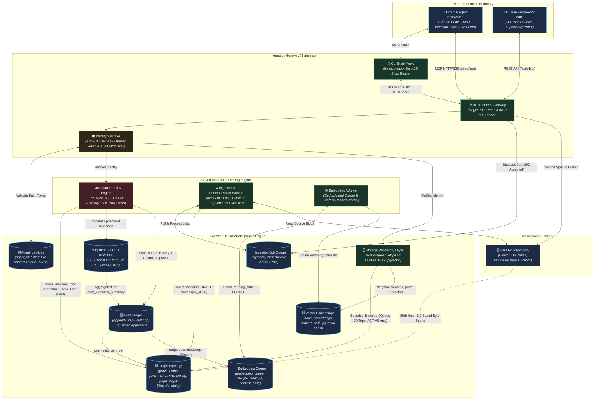

# TKS (The Knowledge Substrate): Architecture

## 1. Context & Drivers

The Knowledge Substrate (TKS) is a purpose-built requirement-intent provenance substrate
that anchors external AI agents and human engineering teams to a unified, version-governed
property graph. This architecture addresses three structural failure modes in agentic
software engineering: context window collapse (code-level context blindness to intent),
specification drift (decoupled documentation), and the monolithic diff dilemma (unscalable
human review of agent-generated output).

The architecture is shaped by the following drivers extracted from the governing vision,
strategic backlog, and Project Initiator directives:

| ID | Driver | Source |
| :--- | :--- | :--- |
| DR-1 | Unified graph-relational substrate combining property graph topology, vector embeddings, and relational audit in a single PostgreSQL engine | vision.md §2 Key Capabilities (1) |
| DR-2 | Document provenance and assisted decomposition: Git-backed content-addressed document store with mechanical AST parsing, LLM-assisted extraction, and human review gates | vision.md §2 Key Capabilities (2) |
| DR-3 | Agent-agnostic integration via MCP and REST: stateless protocol gateway for context retrieval and governed mutation | vision.md §2 Key Capabilities (3) |
| DR-4 | Immutable audit ledger with complete historical reversibility and point-in-time reconstruction for approved requirements | vision.md §2 Key Capabilities (4) |
| DR-5 | Per-node governance: attribute-based authorization controlling autonomous elaboration vs. human gating | vision.md §2 Key Capabilities (5) |
| DR-6 | Self-referential bootstrapping: the substrate manages its own development lifecycle post-Phase 1 | vision.md §2 Key Capabilities (6) |
| DR-7 | Resource-constrained execution model: phased delivery achievable by solo developer or small team on commodity infrastructure | vision.md §3, backlog §1 |
| DR-8 | Sub-second micro-reflex graph traversal latency (<50 ms for k≤3 hops) at the operational hot path | vision.md §2 Operational Timescales, backlog §6 SLA-1 |
| DR-9 | Externalized cognitive compute: the substrate never invokes LLM inference internally; agents supply their own models | vision.md §3 |
| DR-10 | Phased hypothesis de-risking: lightweight spikes validate foundational premises (H-1, H-4) before infrastructure commitment | backlog §2 Phase 0, §5 Spike 0 |
| DR-11 | Token minimization & mechanical 80/20 parsing: minimize LLM reliance and token usage by using mechanical CommonMark AST decomposition for the initial 80%+ of structural parsing, restricting LLM invocations to compact classification tuples | Project Initiator Directive, iteration 2; response.md LD-1 |
| DR-12 | Two-tier state lifecycle with draft compaction: maintain strict distinction between Draft/Editable and Approved/Locked entities; compact intermediate draft history upon approval to eliminate audit ledger bloat | Project Initiator Directive, iteration 2; response.md LD-2 |
| DR-13 | Deterministic byte-offset alignment & non-destructive edge lifecycle: guarantee runtime safety on multi-byte UTF-8 texts and complete reversibility of graph topologies without physical edge deletion | iteration 3; response.md LD-1, LD-2 |

## 2. Constraints

### 2.1 Project Initiator Constraints

> ## Core Philosophy & Token Optimization
>
> Overall, we need to minimize token usage by sticking to a primary philosophy: **minimal LLM reliance and maximum reliance on mechanical processes.**
>
> * **Reducing Output Tokens:** Since output tokens are much more expensive than input tokens, saving on output is key. While we can't reduce ingestion costs significantly, we can lower the LLM's output burden by using mechanical extraction tools to handle the initial 80/20 (or better) of requirements parsing.  
> * **Document Decomposition:** We should explore what existing tools or mechanical options are available to decompose ingested documents and further cut down the LLM token load.
>
> ## State Management & Versioning
>
> We need a clear status distinction between **"Approved / Locked"** and **"Draft / Editable"**. Making every small draft immutable would create far too much churn and turn this into a complex version control system rather than a clean, auditable set of evolving requirements. For history and audit logging, we could maintain detailed event logs while a requirement is in draft. Once it gets approved, we collapse those intermediate draft events to avoid history bloat, while still preserving visibility into why the document mutated during drafting (just an idea, not a strict requirement).

### 2.2 Derived Constraints

| ID | Constraint | Source |
| :--- | :--- | :--- |
| C-1 | Pure Rust package repository: all substrate service code is authored in Rust (edition 2024), built via Cargo stable toolchain | GEMINI.md (project guidelines) |
| C-2 | Single PostgreSQL engine: all topology data, vector embeddings (`pgvector`), relational metadata, and audit records reside in one PostgreSQL instance; no external graph or vector databases | vision.md §3 |
| C-3 | Stateless gateway boundary: MCP and REST interfaces maintain no persistent session memory; every operation is an authenticated, isolated transaction | vision.md §3 |
| C-4 | Document immutability: uploaded text specifications are stored in a Git-backed repository committed to a dedicated specifications branch (`refs/heads/specs`); source spans reference immutable Git blob identities via 0-based byte offsets | vision.md §3, response.md LD-2, LD-12 |
| C-5 | Schema flexibility via progressive JSONB layering: core tables enforce foundational structural edges and typed invariants; domain-specific attributes use typed JSONB fields | vision.md §3 |
| C-6 | Bootstrap boundary: Phase 0 and Phase 1 use conventional tooling; from Phase 1 completion onward all requirements, decisions, and tasks must be tracked within the substrate | vision.md §3 |
| C-7 | No in-database agent execution: the substrate never runs autonomous agent cognitive loops internally | vision.md §3, Invariant I-3 |
| C-8 | LLM interaction restricted to human-directed document ingestion and decomposition pipelines only | vision.md §3 |
| C-9 | Phase 0 and Phase 1 must be achievable on commodity infrastructure by a single developer or small team | vision.md §3, backlog §1 |
| C-10 | Dependency policy: prefer well-established Rust crates; avoid dependencies for functionality small enough to implement with the standard library | GEMINI.md |
| C-11 | Mechanical-first extraction: decomposition must execute CommonMark AST parsing and keyword scanning mechanically; LLMs must never echo verbatim source text and output only compact classification tuples | Project Initiator Directive, iteration 2; response.md LD-1 |
| C-12 | Centralized connection daemon: `tks mcp-stdio` must operate strictly as a streaming proxy to the running `tks serve` daemon; headless multi-process database pooling is prohibited to avoid connection pool exhaustion | response.md LD-6, LD-11 |
| C-13 | Draft lifecycle isolation & staging consolidation: candidate requirements from decomposition and agent proposals reside directly in `graph_nodes` and `graph_edges` with `lifecycle_state = 'DRAFT'`. Production queries filter on `lifecycle_state = 'ACTIVE'`. Staging queue is eliminated. Ephemeral draft edits append to `draft_revisions` and are atomically squashed into a single canonical audit event with `draft_evolution_summary` JSONB upon approval | Project Initiator Directive, iteration 2; response.md LD-3, LD-5, LD-11 |

## 3. Architectural Invariants

| ID | Invariant | Rationale | Verification |
| :--- | :--- | :--- | :--- |
| INV-1 | Every active functional specification, implementation task, and code artifact reference must maintain a valid directed edge path terminating at an authorized active requirement node. Entities in `DRAFT`, `NEEDS_REVERIFICATION`, `SUPERSEDED`, or `ARCHIVED` states are explicitly exempt from requiring active requirement ancestors (draft nodes require only a structural parent edge to an existing draft or active node). Orphan execution tasks must be rejected at the database constraint level. | Ensures end-to-end traceability from vision to code while preventing draft tree authoring failures and invalidation cascade transaction aborts during administrative rollbacks. | Enforced during draft promotion/approval (`POST /api/v1/staging/approve` or transition to `ACTIVE`) via transactional CTE ancestor checks, eliminating row-level trigger write amplification. Integration test: attempt to promote orphan task node without valid requirement path → expect transaction rollback. Rollback cascade test: verify that reverting a parent node transitions children to `NEEDS_REVERIFICATION` without trigger abort. |
| INV-2 | Destructive in-place updates (`UPDATE`, `DELETE`) on active requirements, specifications, and topological edges must not occur. Structural edges in `graph_edges` maintain a strongly typed `lifecycle_state` (`DRAFT`, `ACTIVE`, `SUPERSEDED`, `REVERTED`) and are never physically deleted. All approved state transitions must be recorded as discrete, reversible audit events enabling full point-in-time reconstruction. In `DRAFT` state, intermediate edits append to ephemeral `draft_revisions` and are collapsed (squashed) into a single canonical `APPROVED` event upon approval. | Guarantees complete auditability and historical reversibility for approved requirements and topological relationships while preventing draft history churn from bloating the audit ledger. | Monotonically increasing audit ledger for approved states. Draft approvals insert exactly one canonical `APPROVED` record containing final verified state and a `draft_evolution_summary` JSONB. Integration test: mutate an active node or edge, query historical snapshot at prior timestamp → expect original state. Edge query test: verify recursive CTEs with partial index filter exclude superseded and reverted edges. |
| INV-3 | The core database engine and gateway services must never execute autonomous agent cognitive loops internally. The substrate must function strictly as a deterministic state store and protocol gateway. | Preserves operational determinism; prevents uncontrolled LLM invocations within the trusted storage boundary; keeps cognitive compute externalized and auditable. | Code review gate: no LLM client invocations in gateway or storage crate modules. CI lint rule scanning for prohibited dependency imports. |
| INV-4 | Every requirement derived via the decomposition pipeline must store a persistent cryptographic reference (Git commit/blob hash) and 0-based source byte span coordinates (`byte_start`, `byte_end`) pointing to the original document artifact. | Enables independent verification of requirement provenance against immutable source text; anchors extracted semantics to deterministic byte ranges and prevents runtime UTF-8 string-slicing panics in Rust. | Integration test: for each extracted requirement node, resolve Git blob hash and verify that `&source_bytes[byte_start..byte_end]` matches the stored requirement verbatim text without character boundary slicing panics. |
| INV-5 | Permissions to alter or elaborate a graph node must be governed by explicit per-node `governance_policy` metadata attributes (`AUTONOMOUS_ELABORATION`, `HUMAN_REVIEW_REQUIRED`, `LOCKED`). Node-level policies must take absolute precedence over global agent roles. | Provides granular, progressive delegation of autonomy; prevents agents from modifying safety-critical requirements without human authorization. | Integration test: agent attempts mutation on `LOCKED` node → expect rejection; agent mutates `AUTONOMOUS_ELABORATION` node → expect draft commit; agent mutates `HUMAN_REVIEW_REQUIRED` node → expect staging/review flag. |
| INV-6 | Once foundational ingestion and context retrieval are operational (post-Phase 1), all new feature requirements, architectural adjustments, and development tasks must be authored, reviewed, and tracked within the substrate itself. | Self-referential dogfooding exposes UX friction early; establishes a closed feedback loop validating the substrate's own utility. | Dogfooding gate audit: post-Phase 1 requirements and tasks exist as graph nodes with valid provenance; manual spot-check during milestone reviews. |
| INV-7 | Every mutation submitted through the Integration Gateway must be attributable to a verified external identity (human user or agent instance). Identity credentials must be recorded in the audit ledger alongside mutation events. No mutation may be committed without a verified identity reference. | Non-negotiable audit requirement; enables forensic tracing of any graph change to its originator; supports blast-radius containment for compromised agents. | Two-tier authentication: For Phase 1–2, agents authenticate via pre-shared API keys or HMAC bearer tokens mapped to `agent_identities`; stdio passes credentials via process environment variables (`TKS_AGENT_ID`, `TKS_AUTH_TOKEN`) or tool payload `auth` fields; HTTP/SSE uses `Authorization: Bearer <token>`. Audit ledger schema enforces NOT NULL on `actor_id`, `actor_type`, and `token_fingerprint`. Integration test: submit mutation without auth credentials → expect rejection. |

## 4. Component Topology



### Component Responsibilities & Boundaries

| Component | Responsibility | Owns State | Depends On |
| :--- | :--- | :--- | :--- |
| Axum Server Gateway | Single unified HTTP service hosting REST endpoints (`/api/v1/...`) and MCP over HTTP/SSE (`/mcp/sse`, `/mcp/messages`) on a single port; handles request lifecycle, streaming, and granular approval/rejection endpoints | No (stateless) | Identity Validator, Governance Engine, Storage Repository Layer, Ingestion Job Queue |
| CLI Stdio Adapter (`tks mcp-stdio`) | Lightweight CLI subcommand streaming standard input/output JSON-RPC to the running Axum daemon over HTTP/SSE; maintains zero database connections; implements backoff startup checks and structured initialization error formatting | No (stateless streaming proxy) | Axum Server Gateway |
| Identity Validator | Validates inbound credentials (pre-shared API keys or HMAC bearer tokens against `agent_identities` table for Phase 1–2; OAuth 2.1 in Phase 4); extracts verified caller claims; enforces INV-7 | No (stateless cache only) | Agent Identities table (`agent_identities`) |
| Governance Policy Engine | Evaluates per-node `governance_policy` columns; acquires global transaction advisory lock (`pg_advisory_xact_lock`) for structural DAG mutations and native row locks (`FOR UPDATE`) for leaf attribute updates; manages `draft_revisions` logging and atomic draft squashing | No (reads node metadata) | Graph Topology (PostgreSQL), Draft Revisions, Audit Ledger |
| Storage Repository Layer (`src/storage/envelope.rs`) | Consolidated storage domain module executing quota-partitioned bounded recursive CTE graph traversals (guaranteed 30 topological nodes + up to 10 vector neighbors, node limit 40, depth $\le 3$) under `READ COMMITTED` | No (read-only queries) | Graph Topology, Vector Embeddings |
| Decomposition Pipeline & Worker | Durable background worker consuming `ingestion_jobs`; executes Stage 1 CommonMark AST parsing (`pulldown-cmark`) for 80%+ structural chunking with exact 0-based byte offsets, and Stage 2 targeted LLM semantic classification for compact classification tuples; stages candidate nodes directly in `graph_nodes` with `lifecycle_state = 'DRAFT'` and `job_id` FK | No (stateless worker) | Ingestion Job Queue, Bare Git Repository, Graph Topology, external LLM API |
| Embedding Worker | Dedicated asynchronous worker consuming `embedding_queue`; batch-fetches pending entries (`FOR UPDATE SKIP LOCKED`), calls embedding provider APIs, and updates `node_embeddings` out-of-band using optimistic concurrency control | No (stateless worker) | Embedding Queue, Vector Embeddings, external embedding API |
| Graph Topology (PostgreSQL) | Stores `graph_nodes` (with explicit `DRAFT` and `ACTIVE` states, and `job_id` FK) and `graph_edges` with strongly typed `lifecycle_state` (`DRAFT`, `ACTIVE`, `SUPERSEDED`, `REVERTED`); enforces structural invariants via transactional CTEs | Yes: canonical graph state | PostgreSQL engine |
| Draft Revisions Table (PostgreSQL) | Ephemeral table (`draft_revisions`) tracking intermediate edits and patches to nodes in `DRAFT` state; purged upon approval squashing | Yes: ephemeral draft history | PostgreSQL engine |
| Vector Embeddings (pgvector) | Stores dense vector representations of graph nodes (`node_embeddings`) with `content_hash` and `updated_at` for similarity-based neighbor lookup | Yes: embedding vectors | Graph Topology (node identity) |
| Audit Ledger (PostgreSQL) | Append-only event log recording every approved node/edge mutation with actor identity, timestamp, reversible delta payload, and squashed draft evolution summaries | Yes: immutable event stream | PostgreSQL engine |
| Ingestion Job Queue (PostgreSQL) | Durable queue (`ingestion_jobs`) tracking asynchronous document decomposition tasks and statuses (`QUEUED`, `PROCESSING`, `COMPLETED`, `FAILED`) | Yes: job state | PostgreSQL engine |
| Embedding Queue (PostgreSQL) | Persistent queue (`embedding_queue`) with `UNIQUE (node_id)` and `content_hash` tracking asynchronous node embedding tasks | Yes: queue state | PostgreSQL engine |
| Agent Identities (PostgreSQL) | Table (`agent_identities`) storing authorized agent instances, pre-shared token hashes/HMAC credentials, and active status | Yes: identity records | PostgreSQL engine |
| Git Document Ledger | Content-addressed bare Git repository storing raw Markdown/text specification documents committed directly to dedicated specifications branch (`refs/heads/specs`) | Yes: document artifacts | Dedicated persistent filesystem volume |

### Deployment & Process Model

The deployment model targets a robust single-host configuration suitable for the constrained resource model (solo developer / small team):

* **Single Rust binary** compiled from the `tks` crate:
  * Default server mode (`tks serve`): Runs the unified `Axum` HTTP service hosting both REST endpoints and MCP over HTTP/SSE on the configured port (default `:8080`), along with background worker loops for `ingestion_jobs` and `embedding_queue`. All database connection pooling (`deadpool-postgres`), advisory locking, and Git ODB handles are centralized strictly inside this single process.
  * Dedicated CLI stdio adapter (`tks mcp-stdio`): Invoked by external agent harnesses (Claude Code, Cursor, Windsurf) as a child process. Acts strictly as a lightweight streaming proxy (~150 lines of Rust) forwarding JSON-RPC frames over HTTP/SSE to the running `tks serve` daemon. If `tks serve` is not running, the CLI performs backoff retries and outputs a structured JSON-RPC initialization error rather than crashing the harness process (addressing LD-9, TB-4). It instantiates zero database connection pools, completely eliminating multi-process connection pool exhaustion.
  * Supervisory & Identity CLI commands: Subcommands for staging management (`tks staging list`, `tks staging inspect`, `tks staging approve`, `tks staging reject`) and identity management (`tks identity create`, `tks identity revoke`) provide ergonomic developer workflows without manual SQL or curl usage.
  * Diagnostic logging: `tracing-subscriber` is explicitly configured to write all logs and diagnostic traces strictly to `stderr`. `stdout` is exclusively reserved for valid JSON-RPC framing when operating in stdio mode.
* **PostgreSQL instance** (with `pgvector` extension) runs as a separate process or container, accessed via connection pooling (`deadpool-postgres`).
* **Bare Git repository** (`git init --bare`) resides on a dedicated, persistent filesystem volume co-located with PostgreSQL storage, accessed via `git2` using low-level object-database (ODB) writes. Raw document uploads commit directly onto a dedicated specifications branch (`refs/heads/specs`), ensuring 100% reachability via the Git commit-tree graph without loose reference files or prune configuration overrides (addressing LD-12, TB-1).
* A standard `docker-compose.yml` provisions PostgreSQL with `pgvector` and mounts persistent volumes for PostgreSQL data and the bare Git repository.

## 5. Data & State Model

### 5.1 State Ownership

| State | Owner | Storage | Consistency | Lifecycle |
| :--- | :--- | :--- | :--- | :--- |
| Graph nodes | Graph Topology | PostgreSQL `graph_nodes` table (`id`, `node_type`, `title`, `content`, `lifecycle_state`, `governance_policy`, `job_id REFERENCES ingestion_jobs(job_id) ON DELETE CASCADE`, `attributes JSONB`) | Strong (ACID transactions) | Created via decomposition or agent proposal → `DRAFT` → approved → `ACTIVE` → `SUPERSEDED`, `ARCHIVED`, or `NEEDS_REVERIFICATION` |
| Structural edges | Graph Topology | PostgreSQL `graph_edges` table (`from_node_id`, `to_node_id`, `edge_type`, `lifecycle_state`) | Strong (ACID, global advisory lock, partial index `WHERE lifecycle_state = 'ACTIVE'`) | Created alongside node; supports draft edges between draft nodes; never physically deleted (INV-2), only transitioned to `SUPERSEDED` or `REVERTED` |
| Source span references | Graph Topology | PostgreSQL `source_spans` table (`doc_hash`, `byte_start INT NOT NULL`, `byte_end INT NOT NULL`) | Strong (immutable after creation; pinned to Git blob hash via 0-based byte offsets) | Created mechanically during CommonMark AST parsing (`pulldown-cmark`); re-anchored on document revision |
| Ephemeral draft revisions | Governance Engine | PostgreSQL `draft_revisions` table (`revision_id UUID PRIMARY KEY`, `node_id UUID NOT NULL REFERENCES graph_nodes(id) ON DELETE CASCADE`, `actor_id VARCHAR(64) NOT NULL`, `actor_type VARCHAR(16) NOT NULL`, `patch JSONB NOT NULL`, `created_at TIMESTAMPTZ NOT NULL DEFAULT NOW()`) | Strong (transactional revision log) | Appended on draft leaf mutation; aggregated into `draft_evolution_summary` JSONB on approval; purged on approval/rejection |
| Vector embeddings | Vector Index | PostgreSQL `node_embeddings` table (`node_id UUID PRIMARY KEY`, `embedding vector`, `content_hash VARCHAR(64) NOT NULL`, `updated_at TIMESTAMPTZ NOT NULL`) | Eventually consistent (asynchronously updated out-of-band via `embedding_queue`) | Created on node approval/content change; updated asynchronously by embedding worker with optimistic concurrency |
| Embedding queue | Embedding Pipeline | PostgreSQL `embedding_queue` table (`node_id UUID PRIMARY KEY REFERENCES graph_nodes(id) ON DELETE CASCADE`, `content_hash VARCHAR(64) NOT NULL`, `status`, `retry_count`, `updated_at`) | Strong (transactional deduplicated queue) | Enqueued on node creation/update (`PENDING`) → `PROCESSING` → deleted on success or `FAILED` |
| Governance policy | Graph Topology | Strongly typed column on `graph_nodes` (`VARCHAR` with `CHECK`: `AUTONOMOUS_ELABORATION`, `HUMAN_REVIEW_REQUIRED`, `LOCKED`) | Strong (per-node, indexed, checked at mutation time) | Set at node creation; updated by human administrator only |
| Node lifecycle state | Graph Topology | Strongly typed column on `graph_nodes` (`VARCHAR` with `CHECK`: `DRAFT`, `ACTIVE`, `SUPERSEDED`, `ARCHIVED`, `NEEDS_REVERIFICATION`) | Strong (indexed, evaluated during recursive CTE traversals) | Starts in `DRAFT` or `ACTIVE`; transitions managed by governance engine or dependency sweep |
| Audit events | Audit Ledger | PostgreSQL `audit_ledger` table | Strong (append-only, NOT NULL actor and token constraints) | Created on approved mutation; squashes draft history on approval; never modified or deleted |
| Ingestion jobs | Ingestion Pipeline | PostgreSQL `ingestion_jobs` table (`job_id`, `document_hash`, `status`, `error_message`, `retry_count`, `created_at`, `updated_at`) | Strong (transactional state machine) | Created on `POST /documents/ingest` (`QUEUED`) → `PROCESSING` → `COMPLETED` or `FAILED` |
| Agent identities | Identity Validator | PostgreSQL `agent_identities` table (`agent_id`, `token_hash`, `actor_type`, `is_active`, `created_at`) | Strong (ACID) | Provisioned by administrator CLI (`tks identity create`) or dev seed → active → revoked |
| Document artifacts | Git Document Ledger | Bare Git repository on persistent volume committed to `refs/heads/specs` branch | Strong (content-addressed, cryptographic integrity, standard commit-tree reachability) | Ingested via REST API → committed to bare Git ODB on `specs` branch → immutable blob referenced by commit/blob hash |

#### Entity Typing and Relational Constraints

The primary entity table is `graph_nodes`. It incorporates mandatory typed discriminator and lifecycle columns governed by PostgreSQL `CHECK` constraints:

```sql
CHECK (node_type IN ('REQUIREMENT', 'SPECIFICATION', 'TASK', 'VERIFICATION', 'DECISION'))
CHECK (lifecycle_state IN ('DRAFT', 'ACTIVE', 'SUPERSEDED', 'ARCHIVED', 'NEEDS_REVERIFICATION'))
CHECK (governance_policy IN ('AUTONOMOUS_ELABORATION', 'HUMAN_REVIEW_REQUIRED', 'LOCKED'))
```

Structural edges in `graph_edges` enforce endpoint validity rules via foreign keys, a first-class `lifecycle_state` column, and a dedicated partial index (addressing LD-1):

```sql
CREATE TABLE graph_edges (
    from_node_id UUID NOT NULL REFERENCES graph_nodes(id) ON DELETE CASCADE,
    to_node_id UUID NOT NULL REFERENCES graph_nodes(id) ON DELETE CASCADE,
    edge_type VARCHAR(32) NOT NULL,
    lifecycle_state VARCHAR(20) NOT NULL DEFAULT 'ACTIVE'
        CHECK (lifecycle_state IN ('DRAFT', 'ACTIVE', 'SUPERSEDED', 'REVERTED')),
    PRIMARY KEY (from_node_id, to_node_id, edge_type)
);

CREATE INDEX idx_graph_edges_active ON graph_edges (from_node_id, to_node_id, edge_type)
    WHERE lifecycle_state = 'ACTIVE';
```

Edge relationship rules:

* `FULFILLS` edges must originate at `TASK` or `SPECIFICATION` nodes and terminate at `SPECIFICATION` or `REQUIREMENT` nodes.
* `CONSTRAINED_BY` edges must connect nodes of compatible governance hierarchy.
* `VERIFIED_BY` edges connect `VERIFICATION` nodes to `SPECIFICATION` or `TASK` nodes.

#### Draft Lifecycle and Event Compaction (Squash on Approval)

To honor the Project Initiator's mandate for clean status distinction between "Approved / Locked" and "Draft / Editable" without audit ledger bloat (addressing LD-2, LD-3, LD-5, LD-11):

1. **Direct Draft Graph Storage:** Candidate requirements extracted during document decomposition and agent proposals are written directly to `graph_nodes` and `graph_edges` with `lifecycle_state = 'DRAFT'` and `job_id REFERENCES ingestion_jobs(job_id)`. This allows agents and supervisors to compose and traverse draft subtrees using standard relational tooling. Production context queries (`get_context_envelope`) filter strictly on `lifecycle_state = 'ACTIVE'` using the partial index, completely isolating production agent execution from drafts.
2. **Ephemeral Draft Revision Storage:** While a node is in `DRAFT` state, intermediate edits, typo fixes, and attribute adjustments append to `draft_revisions` and mutate `graph_nodes` current state. They do NOT generate discrete immutable rows in `audit_ledger`:

   ```sql
   CREATE TABLE draft_revisions (
       revision_id UUID PRIMARY KEY DEFAULT gen_random_uuid(),
       node_id UUID NOT NULL REFERENCES graph_nodes(id) ON DELETE CASCADE,
       actor_id VARCHAR(64) NOT NULL,
       actor_type VARCHAR(16) NOT NULL,
       patch JSONB NOT NULL,
       created_at TIMESTAMPTZ NOT NULL DEFAULT NOW()
   );
   CREATE INDEX idx_draft_revisions_node ON draft_revisions(node_id);
   ```

3. **Atomic Squash on Approval:** When a supervisor approves a candidate batch (`POST /api/v1/staging/approve` or CLI `tks staging approve <job_id>`):
   * The engine executes a single transactional CTE statement validating Invariant INV-1 ancestor paths for the nodes being promoted to `ACTIVE`.
   * The engine transitions the approved nodes' `lifecycle_state` from `DRAFT` to `ACTIVE` (and associated edges to `ACTIVE`).
   * The engine aggregates rows from `draft_revisions` for each node to build a structured `draft_evolution_summary` JSONB (capturing revision count, contributing agent/human identities, and approval notes).
   * The engine writes a single canonical `APPROVED` event record per approved node to `audit_ledger` containing the final approved state, Git source span coordinates, and `draft_evolution_summary`.
   * Intermediate records in `draft_revisions` are deleted in the same transaction. This eliminates audit history bloat while preserving 100% auditable reversibility for all approved requirements (Invariant INV-2).
4. **Granular Staging Rejection:** Supervisors can reject spurious candidate nodes via `POST /api/v1/staging/reject` or CLI `tks staging reject <node_id>`, cleanly removing candidate draft nodes without polluting the production graph or audit ledger (addressing LD-7).

#### Relational Ingestion Unification

By eliminating the separate quarantine table (`staging_queue`) and storing candidate requirements directly in `graph_nodes` with `job_id UUID REFERENCES ingestion_jobs(job_id) ON DELETE CASCADE`, all candidate entities become queryable relational nodes immediately. When inspecting an ingestion job via `GET /api/v1/documents/ingest/{job_id}`, PostgreSQL returns the job status along with all associated candidate draft nodes in a single relational join:

```sql
SELECT j.job_id, j.status, n.id AS node_id, n.node_type, n.title, n.content, s.byte_start, s.byte_end
FROM ingestion_jobs j
LEFT JOIN graph_nodes n ON n.job_id = j.job_id
LEFT JOIN source_spans s ON s.node_id = n.id
WHERE j.job_id = $1;
```

#### Rollback Cascade Mechanics & Blast-Radius Containment

Rollback operations (`revert_mutation_batch`, `revert_agent_session`) adhere to the following protocol:

1. **Non-Destructive Event Reversal:** Rollbacks never physically delete rows (`DELETE`) or mutate existing audit ledger entries. The engine computes inverse deltas and appends explicit compensating `REVERT` event records to `audit_ledger`.
2. **State Transition to `SUPERSEDED` / `REVERTED`:** Targeted live nodes transition their `lifecycle_state` column to `SUPERSEDED` or `REVERTED`, and associated edges transition to `REVERTED` or `SUPERSEDED` (addressing LD-1).
3. **Automated Dependency Sweep & State-Aware Invariants:** If a reverted node has active downstream children (e.g., child tasks attached to a reverted specification), the engine executes an automated dependency sweep: dependent child nodes recursively transition their `lifecycle_state` to `NEEDS_REVERIFICATION`. Because Invariant INV-1 path constraints explicitly exempt `NEEDS_REVERIFICATION` nodes, the rollback transaction completes cleanly without foreign key failures or trigger aborts (addressing LD-4).
4. **Blast-Radius Confirmation:** If cross-agent dependent tasks exist on a node targeted for rollback, the administrative interface requires explicit confirmation flags (`--cascade-invalidation` or `--force`) displaying the affected topological subgraph before applying the compensating transaction.

### 5.2 Concurrency Model

* **Async runtime:** The Rust binary executes on the multi-threaded `tokio` runtime.
* **Centralized Connection Pooling:** `deadpool-postgres` provides bounded database connection concurrency exclusively inside the `tks serve` process. The CLI stdio adapter connects over HTTP/SSE without opening database connections, preventing pool exhaustion.
* **Transaction Isolation & Locking Architecture:** Blanket `SERIALIZABLE` isolation is eliminated to prevent `SIREAD` lock escalation and catastrophic `40001 serialization_failure` abort cascades during recursive CTE graph traversals. Concurrency operates as follows:
  * **Read Queries (Context Envelopes):** Context envelope assembly and status queries execute under standard PostgreSQL `READ COMMITTED` isolation. They acquire no table or row locks, running concurrently at maximum throughput to guarantee the sub-50ms latency objective (SLA-1).
  * **Topological Mutations & Global Advisory Locking:** Structural graph mutations (`propose_node_mutation`, edge creation, deletions/reversions, and cycle checks) execute under `READ COMMITTED` paired with a single global transaction advisory lock:

    ```sql
    SELECT pg_advisory_xact_lock(hashtext('tks_structural_mutation'));
    ```

    Partitioning locks by root requirement node hash is mathematically unsound because edge insertion connects previously disjoint subtrees. A global advisory lock serializes structural edge additions and in-database recursive CTE cycle checks across the entire graph. Because recursive cycle validation and edge insertion take under 5ms, this global lock easily sustains >100 edge mutations/second while guaranteeing absolute safety against cyclic races.
  * **Leaf Attribute Mutations via Native Row-Level Locking:** Non-structural attribute updates (e.g., updating a node's content, title, or draft metadata where graph topology is unchanged) execute under native PostgreSQL row-level locks (addressing LD-13):

    ```sql
    SELECT id FROM graph_nodes WHERE id = $1 FOR UPDATE;
    ```

    This completely eliminates the 32-bit hash collision bottlenecks of `pg_advisory_xact_lock(hashtext(node_id))` across $10^5$ nodes, provides native ACID isolation, releases locks automatically on commit, and maximizes concurrent attribute editing throughput.
* **Context Envelope Traversal Guardrails & Quota Partitioning:** To protect against unbounded recursive graph fan-out, DoS, and prompt context pollution (addressing LD-8):
  * Traversal depth requested by external agents is clamped at the gateway: `effective_depth = min(requested_depth, 3)`.
  * Node budget cap: Recursive CTE enforces a strict budget: `LIMIT 40`.
  * Guaranteed Topological Quota: The assembly algorithm in `src/storage/envelope.rs` reserves 30 of the 40 slots strictly for deterministic topological relationships: the target task, immediate ancestors (`DERIVED_FROM`), direct blocking architectural constraints (`CONSTRAINED_BY`), and direct assigned execution sub-tasks.
  * Vector Search Allocation: Vector similarity neighbor search is restricted to: (a) pruning/ranking siblings when the topological subgraph exceeds quota, or (b) retrieving at most 5–10 nearest neighbor nodes tagged with cross-cutting non-functional governance constraints.
  * Graceful Degradation: If embeddings are pending or disabled, the envelope cleanly saturates up to 40 nodes from pure graph topology.
  * Traversal transactions enforce a tight statement timeout: `SET LOCAL statement_timeout = '250ms'`.
* **Two-Stage Mechanical Ingestion:** Ingestion operations are decoupled via `ingestion_jobs`. The background worker executes:
  * *Stage 1 (Mechanical Structural Decomposition):* Streaming CommonMark AST parsing via `pulldown-cmark`. Segments documents along headings (H1–H4), tables, and lists; captures exact 0-based byte offsets (`byte_start`, `byte_end`) with 100% precision and zero token cost; extracts RFC 2119 keywords mechanically. Zero-copy byte slicing `&source_bytes[byte_start..byte_end]` eliminates UTF-8 char boundary panics (LD-2).
  * *Stage 2 (Targeted Semantic Classification):* LLM is invoked solely on candidate chunks requiring classification or ambiguity resolution, returning compact classification tuples referencing the chunk ID without echoing source text, reducing LLM output tokens by >80%.
  * Candidate nodes and edges are inserted directly into `graph_nodes` and `graph_edges` with `lifecycle_state = 'DRAFT'`.
* **Asynchronous Out-of-Band Embedding Generation with Deduplication & Optimistic Concurrency:** When a node is created or its text modified, an entry is upserted into `embedding_queue` within the same transaction. The queue enforces `UNIQUE (node_id)` and tracks `content_hash VARCHAR(64) NOT NULL` (addressing LD-6). A dedicated background worker polls pending items (`FOR UPDATE SKIP LOCKED`), calls the embedding provider API, and updates `node_embeddings` using optimistic concurrency control:

  ```sql
  INSERT INTO node_embeddings (node_id, embedding, content_hash, updated_at)
  VALUES ($1, $2, $3, NOW())
  ON CONFLICT (node_id) DO UPDATE SET
      embedding = EXCLUDED.embedding,
      content_hash = EXCLUDED.content_hash,
      updated_at = EXCLUDED.updated_at
  WHERE node_embeddings.updated_at <= EXCLUDED.updated_at;
  ```

* **Bare Git Branch Commits:** Git operations use direct low-level object-database (ODB) writes via `git2`, committing documents directly to a dedicated specifications branch (`refs/heads/specs`). Standard Git commit-tree reachability guarantees 100% blob preservation, eliminating bespoke loose refs (`refs/tks/blobs/*`) and `.lock` collisions (addressing LD-12, TB-1).

## 6. Interfaces & Contracts

| Interface | Producer → Consumer | Protocol / Format | Failure Semantics | Versioning |
| :--- | :--- | :--- | :--- | :--- |
| `get_context_envelope` | MCP Server (Axum HTTP/SSE or CLI stdio proxy) → External Agent | MCP JSON-RPC | Returns structured error on invalid `node_id` or traversal failure; enforced guardrails: depth $\le 3$, node budget $\le 40$ (quota: guaranteed 30 topological nodes, up to 10 vector neighbors), 250ms statement timeout; filters on `lifecycle_state = 'ACTIVE'` | Tool schema versioned; additive-only |
| `propose_node_mutation` | External Agent → MCP Server → Governance Engine | MCP JSON-RPC; credentials via env (`TKS_AGENT_ID`/`TKS_AUTH_TOKEN`), payload `auth`, or HTTP Bearer | Returns `COMMITTED` (creates `DRAFT` node/edges in `graph_nodes`/`graph_edges` or updates active leaf), `PENDING_REVIEW`, or error (`ERR_GRAPH_CYCLE_DETECTED`, `ERR_GOVERNANCE_REJECTED`, `ERR_AUTH_FAILED`); atomic transaction | Tool schema versioned; additive-only |
| `query_requirements` | MCP Server → External Agent | MCP JSON-RPC | Returns empty result set on no match; error on malformed query; filters on `lifecycle_state = 'ACTIVE'` | Tool schema versioned |
| `get_document_span` | MCP Server → External Agent | MCP JSON-RPC | Returns verbatim source text via 0-based byte slicing (`&source_bytes[byte_start..byte_end]`); error if blob hash not found or byte range out of bounds | Tool schema versioned |
| `revert_mutation_batch` | Admin (CLI or REST) → Audit Ledger | MCP JSON-RPC or REST JSON | Atomic compensating transaction; marks edges `SUPERSEDED`/`REVERTED` and executes dependency sweep marking active children as `NEEDS_REVERIFICATION`; error if batch already reverted | Tool schema versioned |
| `revert_agent_session` | Admin (REST) → Audit Ledger | REST HTTP/JSON (`POST /api/v1/admin/revert-session`) | Atomic compensating rollback of mutations from `agent_instance_id` since timestamp; marks dependent children `NEEDS_REVERIFICATION` | URL path versioned (`/api/v1/...`) |
| Document Ingestion | Human/CLI → REST API → Ingestion Job Queue | REST HTTP/JSON (`POST /api/v1/documents/ingest`) | Synchronous bare Git commit onto `refs/heads/specs` branch; inserts job into `ingestion_jobs`; returns `202 Accepted` with `job_id`; idempotent on duplicate blob hash | URL path versioned |
| Ingestion Job Polling | Human/CLI → REST API → Ingestion Pipeline | REST HTTP/JSON (`GET /api/v1/documents/ingest/{job_id}`) | Returns JSON object with job status, error details, and staged candidate draft nodes via relational join on `graph_nodes.job_id` | URL path versioned |
| Staging Approval | Human/CLI → REST API → Audit Ledger | REST HTTP/JSON (`POST /api/v1/staging/approve`) | Accepts optional `approved_node_ids: Vec<Uuid>` (approves all for `job_id` if omitted). Atomic transaction: validates INV-1, squashes `draft_revisions`, writes canonical `APPROVED` event to `audit_ledger` with `draft_evolution_summary` JSONB, promotes nodes to `ACTIVE` | URL path versioned |
| Staging Rejection | Human/CLI → REST API → Graph Topology | REST HTTP/JSON (`POST /api/v1/staging/reject`) | Accepts `rejected_node_ids: Vec<Uuid>` and `reason`. Atomic transaction: deletes candidate draft nodes and associated draft edges, preventing graph pollution | URL path versioned |
| PostgreSQL wire protocol | Rust process → PostgreSQL | TCP / `libpq` wire protocol | Connection pool retry with exponential backoff on transient connection failures; query timeout enforced | PostgreSQL version compatibility managed via migration tooling |
| Git operations | Rust process → Git repository | `libgit2` (via `git2` crate) | Direct ODB writes; commits to `refs/heads/specs` branch; error propagated on filesystem corruption | Git object model (content-addressed, stable) |

### Failure Semantics Summary

* **Idempotency:** Document ingestion is idempotent on blob hash (identical content yields identical Git blob SHA and attaches to existing ingestion record). Mutation proposals are not idempotent (each submission creates a distinct draft or audit event).
* **Retry Policy:** Transient PostgreSQL connection failures are retried with exponential backoff at the pool level. Advisory locks serialize structural mutations, avoiding serialization failures. Ingestion worker tasks retry with bounded exponential backoff up to 3 times before transitioning job status to `FAILED`. Embedding queue jobs retry up to 5 times with backoff before flagging `FAILED`.
* **Timeout Policy:** Gateway enforces a per-request timeout (default 30s) on HTTP/SSE and REST endpoints. Read traversals enforce `statement_timeout = '250ms'`. Background ingestion decomposition jobs enforce a 180s timeout.

## 7. Technology Stack

| Concern | Selection | Rationale | Alternatives Considered |
| :--- | :--- | :--- | :--- |
| Primary language | Rust (edition 2024, stable toolchain) | Project mandate (GEMINI.md); memory safety, zero-cost abstractions, single-binary distribution | N/A (constrained) |
| Async runtime | `tokio` | De facto standard Rust async runtime; mature multi-threaded work-stealing scheduler | `async-std` (smaller ecosystem) |
| HTTP & Gateway framework | `axum` | Unifies REST API and MCP HTTP/SSE transport on a single port; Tower middleware for auth, tracing, compression | `actix-web` (actor model unnecessary), separate server binaries (rejected; see LD-1 iter 1) |
| CLI & Stdio integration | `clap` + custom streaming stdio proxy (`tks mcp-stdio`) | Pure streaming proxy forwarding JSON-RPC to Axum daemon over HTTP/SSE; zero database connection pools; isolates stdio from network port binding; implements backoff startup checks and structured initialization error handling (see D-7, D-19, TB-4) | Multi-process headless database mode (rejected; exhausts connection pool; see LD-6) |
| Storage Repository Layer | Consolidated in-process module `src/storage/envelope.rs` | Executes quota-partitioned bounded recursive CTEs (30 topological + 10 vector) and pgvector searches directly via pooled connections, eliminating artificial middle-tier service boundaries (see LD-8, LD-9, D-28) | Standalone Context Envelope Assembler service (rejected; see LD-9) |
| Mechanical Markdown Parser | `pulldown-cmark` | High-performance streaming CommonMark AST parser; extracts exact 0-based byte offsets and structural blocks mechanically with zero LLM token cost; zero-copy byte slicing prevents UTF-8 boundary panics (see D-15, D-22, TB-2) | Direct LLM text parsing (rejected; causes output token exhaustion; see LD-1), `comrak` |
| PostgreSQL client | `tokio-postgres` + `deadpool-postgres` | Async native driver; connection pooling; direct SQL control over recursive CTEs and advisory locking | `sqlx` (compile-time query checking adds CI complexity; see D-3), `diesel` (sync, ORM overhead) |
| Database migrations | `refinery` or `sqlx-cli` (offline mode) | Lightweight, file-based SQL migration runner compatible with Rust build pipeline; includes development seed for `agent_identities` (TB-5) | Custom migration scripts (fragile) |
| Vector embeddings | `pgvector` (PostgreSQL extension) | Single-engine constraint (C-2); proven HNSW/IVFFlat indexing for approximate nearest neighbor search; updated asynchronously with content hash and optimistic concurrency (D-18, D-26) | Dedicated vector DB (prohibited by C-2) |
| Graph query strategy | Bounded Recursive CTEs (`WITH RECURSIVE`) on typed adjacency tables under `READ COMMITTED` | Zero external dependencies; runs on vanilla PostgreSQL; fully ACID-compliant; depth clamped $\le 3$, quota-partitioned 40-node limit, partial index on `lifecycle_state = 'ACTIVE'` meets SLA-1 (<50ms for k≤3 hops) (see D-2, D-17, D-21, D-28) | Apache AGE (see D-2), native SQL/PGQ (unavailable until PG 20+) |
| Graph mutation concurrency | Hybrid: Global advisory lock for structural changes; native row-level `FOR UPDATE` for leaf edits | Global `pg_advisory_xact_lock` eliminates cycle races across disjoint subtrees; native `SELECT ... FOR UPDATE` eliminates 32-bit hash collision bottlenecks on leaf node updates (see D-8, D-20, D-30) | Partitioned lock by root hash (rejected; unsound for cycle checks), advisory lock for leaf nodes (rejected; causes 32-bit hash collisions; see LD-13) |
| Git integration | `git2` crate (libgit2 bindings) against bare repository | In-process Git operations; direct ODB writes commit raw specs directly to `refs/heads/specs` branch; commit-tree reachability guarantees 100% blob preservation without loose refs or GC overrides (see D-29, TB-1) | `gitoxide` (pure Rust, less mature), loose ref namespace `refs/tks/blobs/*` (rejected; see LD-12) |
| Serialization | `serde` + `serde_json` | Standard Rust serialization framework; zero-cost abstraction; versioned staging enum retired with elimination of staging queue (see D-23, TB-3) | N/A (de facto standard) |
| Observability | `tracing` + `tracing-subscriber` | Structured logging with span context; explicitly configured to output strictly to `stderr`, preserving `stdout` for JSON-RPC framing | `log` + `env_logger` (less structured) |
| Testing | `cargo test` (unit + integration), `cargo clippy`, `cargo fmt` | Standard Rust validation pipeline per GEMINI.md | External test frameworks (unnecessary complexity) |

## 8. Operational Model

* **Build & Deploy:**
  * Built from repository root via `cargo build --release`, producing a single static binary.
  * The binary provides operational entry points:
    * `tks serve`: Launches the server gateway (Axum REST API + MCP HTTP/SSE listener), the ingestion queue worker, and the asynchronous embedding worker.
    * `tks mcp-stdio`: Lightweight CLI subcommand launched by external agent harnesses for stdio JSON-RPC sessions (acts strictly as a streaming proxy to `tks serve` over HTTP/SSE, with zero direct database connection pools). Implements connection backoff and structured error formatting (TB-4).
    * `tks staging`: CLI subcommands for reviewing candidate drafts (`list`, `inspect`, `approve [--only/--exclude]`, `reject`).
    * `tks identity`: CLI subcommands for provisioning and revoking agent identities (`create`, `revoke`) (TB-5).
  * CI pipeline: `cargo fmt --check` → `cargo clippy --all-targets --all-features -- -D warnings` → `cargo test` → `cargo build --release`.
  * Deployment configuration: `docker-compose.yml` provisions PostgreSQL with `pgvector` and mounts two persistent volumes: `pg_data` for relational/vector state and `git_storage` for the bare Git document repository.
  * Database schema applied via migration tool on startup or via `tks migrate`.

* **Observability:**
  * Structured JSON logs via `tracing` with span context (request ID, actor ID, operation type).
  * Logging stream isolation: All logging outputs write strictly to `stderr`. `stdout` is dedicated exclusively to JSON-RPC protocol messages.
  * Key operational metrics emitted: recursive CTE traversal latency, context envelope assembly duration, advisory lock wait time, row lock wait time, ingestion job duration and queue depth, embedding queue depth and latency, connection pool utilization.
  * Health endpoint (`GET /health`) returning service status and PostgreSQL connectivity.

* **Failure & Recovery:**
  * PostgreSQL crash: Process restarts and initiates automatic WAL recovery. Connection pool detects failure and re-establishes connections with backoff.
  * Gateway / Worker crash: Stateless gateway design allows immediate container/process restart. In-progress ingestion jobs remain stored in `ingestion_jobs` as `PROCESSING` and are reclaimed upon restart via timeout detection. Pending embedding jobs remain safely in `embedding_queue`.
  * Git repository recovery: Bare Git repository is recoverable from content-addressed object storage; standard branch commits on `refs/heads/specs` ensure 100% commit-tree reachability under normal Git GC. Backup scripts synchronize PostgreSQL snapshots with Git bare repository snapshots.
  * Audit ledger integrity: Append-only design ensures historical events cannot be overwritten. Draft approvals atomically squash draft history from `draft_revisions` into canonical audit records with summary metadata.
  * Agent blast-radius containment: Reversion commands (`revert_mutation_batch`, `revert_agent_session`) record compensating inverse events and execute an automated dependency sweep transitioning affected child nodes to `NEEDS_REVERIFICATION` without trigger aborts.

* **Upgrade & Migration:**
  * Schema evolution via ordered SQL migrations. Forward-compatible additions preferred; breaking DDL changes coordinated with application deployment.
  * API evolution: MCP tool schemas use additive-only evolution. REST API uses URL path versioning (`/api/v1/`, `/api/v2/`).

## 9. Decisions & Rejected Alternatives

### D-1: Single PostgreSQL engine for all state (graph, vectors, audit)

* **Status:** Accepted
* **Origin:** Baseline
* **Context:** The system requires graph topology storage, vector similarity search, and an append-only audit ledger. Distributing these across multiple database engines (e.g., Neo4j for graph, Pinecone for vectors, PostgreSQL for relational) would introduce distributed transaction failures, synchronization drift, and operational complexity incompatible with the constrained resource model.
* **Decision:** All state resides in a single PostgreSQL instance using recursive CTEs for graph queries, `pgvector` for vector indexing, and relational tables for the audit ledger.
* **Rationale:** Eliminates distributed transaction failures; leverages proven enterprise PostgreSQL tooling for backup, replication, security; honors the single-engine boundary contract from vision.md §3.
* **Reopen If:** Hypothesis H-3 is falsified (>500 ms latency at ≤10⁵ nodes despite index optimization), or PostgreSQL native SQL/PGQ support matures in PG 20+.

### D-2: Recursive CTEs over Apache AGE for graph queries

* **Status:** Accepted
* **Origin:** Baseline
* **Context:** Graph traversal is required for context envelope assembly (k-hop ancestor and sibling queries). Apache AGE provides rich Cypher syntax but is an external C extension with version-specific PostgreSQL compatibility (PG 19 support pending) and added deployment complexity.
* **Decision:** Use standard `WITH RECURSIVE` CTEs on a relational adjacency table (`graph_edges`) for all graph traversal operations.
* **Rationale:** Zero external dependencies; runs on vanilla PostgreSQL; fully ACID-compliant; adequate performance for k≤4 hop traversals at projected Phase 1–2 scale (≤10⁵ nodes); honors the "start small" and constrained resource model directives.
* **Reopen If:** Query complexity for multi-hop path matching becomes unmanageable in relational SQL; Apache AGE achieves stable PG 19+ support and community adoption justifies the deployment overhead; or native SQL/PGQ lands in PostgreSQL 20+.

### D-3: `tokio-postgres` over `sqlx` for database client

* **Status:** Accepted
* **Origin:** Baseline
* **Context:** Both `tokio-postgres` and `sqlx` are mature async PostgreSQL drivers. `sqlx` provides compile-time query verification but requires a live database connection during `cargo build` (or offline mode with cached query metadata), adding CI complexity.
* **Decision:** Use `tokio-postgres` with `deadpool-postgres` for connection pooling. Queries are verified by integration tests rather than compile-time checking.
* **Rationale:** Simpler build pipeline; no database dependency during compilation; direct SQL control for optimizing recursive CTE and pgvector queries; connection pooling via `deadpool-postgres` is well-proven.
* **Reopen If:** Query correctness bugs become a recurring issue that compile-time checking would prevent; `sqlx` offline mode matures to require zero live-database build dependency.

### D-4: Append-only event ledger for state versioning (over bitemporality)

* **Status:** Accepted
* **Origin:** Baseline
* **Context:** Invariant INV-2 requires auditability, reversibility, and point-in-time reconstruction. Three approaches were evaluated: append-only event ledger with materialized current state, system-versioned temporal tables, and full bitemporal property graph.
* **Decision:** Adopt the append-only event ledger pattern. Mutations write an immutable event record to `audit_ledger`; live graph tables maintain the current snapshot, updated within the same transaction.
* **Rationale:** Conceptual simplicity; fast read performance on current graph; straightforward rollback via inverse events; honors "start small" directive; full bitemporality introduces severe query complexity disproportionate to Phase 1–2 needs.
* **Reopen If:** Requirements emerge for retrospective corrections with separate "asserted at" vs. "effective at" semantics; regulatory compliance mandates full bitemporal audit trails.

### D-5: Rust MCP server (custom implementation) over community SDK

* **Status:** Accepted
* **Origin:** Baseline
* **Context:** The MCP specification defines a JSON-RPC protocol. At baseline, no established, production-quality Rust MCP SDK exists.
* **Decision:** Implement a custom MCP protocol layer in Rust, handling JSON-RPC message framing, tool dispatch, and HTTP/SSE / stdio transports directly.
* **Rationale:** MCP's JSON-RPC protocol is straightforward to implement; avoids dependency on immature community crates; provides full control over tool schema evolution and error handling.
* **Reopen If:** A well-maintained, specification-compliant Rust MCP SDK reaches production maturity (see Q-3).

### D-6: `git2` (libgit2) for Git integration over `gitoxide`

* **Status:** Accepted
* **Origin:** Baseline
* **Context:** Git integration is required for content-addressed document storage. `git2` (Rust bindings to libgit2) is mature and widely used. `gitoxide` is a pure-Rust Git implementation under active development.
* **Decision:** Use `git2` for all Git operations (commit, blob hash, object database writes).
* **Rationale:** Mature, battle-tested C library with stable Rust bindings; supports direct ODB writes; extensive documentation and community usage.
* **Reopen If:** `gitoxide` reaches API stability and feature parity for required operations; `libgit2` C dependency causes cross-compilation or packaging issues.

### D-7: Unified Axum Gateway (REST + MCP HTTP/SSE) with CLI Stdio Subcommand

* **Status:** Accepted (Updated by D-19)
* **Origin:** LD-1, LD-12, iteration 1; updated by LD-6, LD-11, iteration 2
* **Context:** Concurrently running an MCP stdio server and a REST HTTP listener in the same process causes immediate `EADDRINUSE` port collisions when multiple agent child processes launch, prevents external agents from attaching to containerized daemons, and risks corrupting JSON-RPC framing with stdout diagnostic logs.
* **Decision:** Consolidate the server gateway into a single unified `Axum` HTTP service hosting REST endpoints (`/api/v1/...`) and MCP over HTTP/SSE (`/mcp/sse`, `/mcp/messages`) on a single port. Local agent integration via stdio is provided by a dedicated CLI subcommand (`tks mcp-stdio`) operating strictly as a streaming proxy to the daemon (D-19). All diagnostic logging is routed strictly to `stderr`.
* **Rationale:** Eliminates port binding collisions across agent sessions; enables multi-agent remote concurrency over standard HTTP/SSE; keeps JSON-RPC protocol framing pure on `stdout`.
* **Reopen If:** Standard MCP specifications deprecate HTTP/SSE in favor of another transport protocol.

### D-8: Transaction-Scoped Advisory Locks under READ COMMITTED for Graph Mutations

* **Status:** Accepted (Updated by D-20, D-30)
* **Origin:** LD-3, iteration 1; updated by LD-7, iteration 2; updated by LD-13, iteration 3
* **Context:** Running graph mutations and recursive CTE traversals under `SERIALIZABLE` or `REPEATABLE READ` transactions causes PostgreSQL Serializable Snapshot Isolation (SSI) to escalate `SIREAD` predicate locks across table pages, resulting in frequent `40001 serialization_failure` abort cascades under multi-agent workloads and violating SLA-1 (<50ms).
* **Decision:** Use PostgreSQL default `READ COMMITTED` isolation for all operations. Structural mutations and DAG cycle checks acquire a global transaction advisory lock (D-20). Leaf attribute updates use native PostgreSQL row-level locks (`SELECT ... FOR UPDATE`, D-30). Read-only context queries execute concurrently under `READ COMMITTED` without locks.
* **Rationale:** Eliminates serialization abort cascades; guarantees deterministic mutation serialization and cycle prevention without database-wide lock escalation; allows concurrent read traversals to achieve sub-50ms latency.
* **Reopen If:** Distributed multi-node PostgreSQL clustering is adopted where local advisory locks are insufficient.

### D-9: Strongly Typed Discriminator and Lifecycle Columns on graph_nodes

* **Status:** Accepted
* **Origin:** LD-5, LD-9, iteration 1
* **Context:** Storing entity types, `lifecycle_state`, and `governance_policy` in untyped JSONB metadata on a generic `requirement_nodes` table introduces severe performance penalties during recursive CTE joins (JSON parsing overhead, inability to use B-tree index scans) and allows silent type errors.
* **Decision:** Rename `requirement_nodes` to `graph_nodes`. Promote `node_type`, `lifecycle_state`, and `governance_policy` to first-class, indexed SQL columns with PostgreSQL `CHECK` constraints. Reserve JSONB strictly for open-ended, domain-specific extensions.
* **Rationale:** Enables standard B-tree index scans on hot recursive graph queries to guarantee SLA-1 (<50ms); enforces database-level domain integrity and compile-time/schema-time validation.
* **Reopen If:** Entity classification requirements require dynamic user-defined taxonomies that cannot be represented with check-constrained relational columns.

### D-10: In-Database Transactional DAG Cycle Validation

* **Status:** Accepted
* **Origin:** LD-10, iteration 1
* **Context:** Depicting `DAGValidator` as an independent domain engine component outside the database transaction layer creates an artificial layer of indirection and risks race conditions where concurrent transactions commit cycles between application check and database write.
* **Decision:** Consolidate DAG cycle validation directly into the PostgreSQL storage transaction layer, executed via transactional recursive CTE queries or trigger logic within the same advisory-locked transaction as the edge write. Remove `DAGValidator` as a standalone component from topology diagrams and component tables.
* **Rationale:** Guarantees strict transactional atomicity; prevents TOCTOU cycle creation races; eliminates redundant architectural abstractions.
* **Reopen If:** Graph size exceeds recursive CTE performance thresholds and demands a dedicated in-memory graph index engine.

### D-11: Two-Tier Identity Model for Agent Attribution

* **Status:** Accepted
* **Origin:** LD-7, iteration 1
* **Context:** Mandating external OAuth 2.1 + DPoP workload identity federation for Phase 1 and Phase 2 creates an unworkable gap with stdio MCP transport (which lacks HTTP authorization headers), stalls implementation on open question Q-6, and over-engineers authentication for early phases.
* **Decision:** Implement a pragmatic two-tier identity architecture: For Phase 1 and 2, authenticate external agents via pre-shared cryptographic API keys or HMAC bearer tokens mapped to an `agent_identities` table in PostgreSQL. For stdio MCP sessions, credentials are passed via environment variables (`TKS_AGENT_ID`, `TKS_AUTH_TOKEN`) or tool payload `auth` fields; for HTTP/SSE and REST, via `Authorization: Bearer <token>`. In all cases, resolved identities are recorded in `audit_ledger` (enforcing INV-7). Defer external OAuth 2.1 / DPoP workload federation to Phase 4.
* **Rationale:** Fulfills Invariant INV-7 non-repudiation and identity attribution; provides full compatibility with local stdio agent harnesses; removes implementation blockers while establishing a clean migration path.
* **Reopen If:** Enterprise multi-tenant deployment demands federated single sign-on (SSO) before Phase 4.

### D-12: Durable Ingestion Job Queue and Polling API

* **Status:** Accepted
* **Origin:** LD-6, iteration 1
* **Context:** Decomposing large documents via LLMs and performing deterministic character span re-anchoring requires 15–90 seconds. Executing this synchronously or via unmanaged in-process tasks (`tokio::spawn`) leads to HTTP gateway timeouts, dropped tasks on server crashes/restarts, and no resumption capability.
* **Decision:** Implement a durable job queue table (`ingestion_jobs`) in PostgreSQL. The ingestion endpoint (`POST /api/v1/documents/ingest`) commits the raw text to Git, creates a queued job record within the transaction, and returns `202 Accepted` with a `job_id`. A persistent worker loop processes queued jobs with retry tracking and error capture. Clients and UI monitor progress via `GET /api/v1/documents/ingest/{job_id}`.
* **Rationale:** Guarantees job durability across service restarts; prevents HTTP request timeouts on large documents; provides complete observability into decomposition status.
* **Reopen If:** Document ingestion scale requires a dedicated distributed task queue (e.g., Celery, RabbitMQ) beyond single-instance PostgreSQL capabilities.

### D-13: Non-Destructive Rollback with Dependency Sweep to NEEDS_REVERIFICATION

* **Status:** Accepted
* **Origin:** LD-4, iteration 1
* **Context:** Administrative rollback utilities (`revert_mutation_batch`, `revert_agent_session`) previously lacked explicit cascade mechanics, creating risks of foreign key constraint deadlocks or orphaned tasks when parent nodes with active child tasks were reverted.
* **Decision:** Reversion operations are non-destructive (INV-2), appending compensating `REVERT` events to `audit_ledger` and transitioning live node states to `SUPERSEDED` or `REVERTED`. When a node with active dependent children is reverted, an automated dependency sweep recursively transitions dependent child nodes to `NEEDS_REVERIFICATION` rather than triggering foreign key failures or physical deletion. Reverting nodes with cross-agent dependencies requires explicit confirmation flags (`--cascade-invalidation` or `--force`).
* **Rationale:** Preserves Invariant INV-1 and INV-2 without operational deadlocks; prevents orphaned tasks from remaining active; establishes clear blast-radius containment for misbehaving agents.
* **Reopen If:** Graph traversal complexity for deep invalidation sweeps exceeds acceptable transaction limits.

### D-14: Consolidation of Staging Queue into Canonical Graph Topology

* **Status:** Superseded by D-16, D-23
* **Origin:** LD-11, iteration 1; superseded by LD-2, iteration 2; reaffirmed and consolidated by LD-3, LD-11, iteration 3
* **Context:** In iteration 1, LD-11 proposed eliminating `staging_queue` and writing unverified candidates directly into `graph_nodes` with in-place `UPDATE` activation. This was rejected in D-14 due to lack of audit trail, entity collisions, and index bloat.
* **Supersession Rationale:** Superseded by Decision D-16 and fully realized by Decision D-23. D-23 eliminates `staging_queue` by storing candidate requirements directly in `graph_nodes` and `graph_edges` with `lifecycle_state = 'DRAFT'` and `job_id REFERENCES ingestion_jobs(job_id)`. Combined with ephemeral draft revision logging (`draft_revisions`) and draft event compaction upon approval, this preserves Invariant INV-2, eliminates audit bloat, enables graph traversals on drafts, and eliminates multi-version JSON staging complexity.

### D-15: Two-Stage Mechanical CommonMark AST-First Ingestion Pipeline

* **Status:** Accepted
* **Origin:** LD-1, iteration 2
* **Context:** Feeding raw Markdown documents directly to LLM APIs for end-to-end atomization violates the Project Initiator's core directive of token minimization and mechanical reliance. LLM output tokens are 3x–5x more expensive than input tokens, subject to output token caps, and prone to syntax truncation on large PRDs.
* **Decision:** Re-architect decomposition into a two-stage pipeline:
  1. *Stage 1 (Mechanical Parsing):* Integrate `pulldown-cmark` streaming CommonMark AST parser. Segments text along structural boundaries (headings H1–H4, tables, lists); extracts exact coordinates directly from source byte stream with zero token cost; performs deterministic lexical matching for RFC 2119 keywords (`MUST`, `SHALL`, etc.) and entity tags (`REQ-*`, `INV-*`).
  2. *Stage 2 (Targeted Semantic Classification):* External LLM is invoked solely on candidate chunks requiring classification or ambiguity resolution. The LLM is instructed never to echo back source text, returning only compact classification tuples referencing the mechanical chunk ID (e.g. `{"chunk_id": "sec-3.2-p1", "node_type": "REQUIREMENT", "priority": "MUST"}`).
* **Rationale:** Handles $\ge 80\%$ of document decomposition mechanically; eliminates output token exhaustion and truncation; cuts LLM inference costs by >80%.
* **Reopen If:** Ingested specifications predominantly arrive in unstructured natural prose lacking CommonMark formatting or heading structure.

### D-16: Explicit `DRAFT` Lifecycle State and Draft Event Compaction (Squash on Approval)

* **Status:** Accepted (Updated by D-23, D-25)
* **Origin:** LD-2, iteration 2; updated by LD-3, LD-5, LD-11, iteration 3
* **Context:** The Project Initiator mandates a clear status distinction between "Approved / Locked" and "Draft / Editable" without creating audit ledger bloat from micro-draft edits. Trapping drafts in disconnected JSON payloads in `staging_queue` prevents agents from building and traversing hierarchical draft subtrees during task elaboration.
* **Decision:**
  1. Add `DRAFT` to the `lifecycle_state` column on `graph_nodes` and `graph_edges`.
  2. Permit draft nodes and draft edges in `graph_nodes` and `graph_edges`. Production context queries (`get_context_envelope`) filter strictly on `lifecycle_state = 'ACTIVE'` by default using a partial index, isolating active production loops from drafts.
  3. Implement Draft Event Compaction (Squash on Approval): Intermediate mutations on draft nodes append to `draft_revisions` (D-25). Upon approval (`POST /api/v1/staging/approve` or transition to `ACTIVE`), the engine executes an atomic squash, writing a single canonical `APPROVED` event to `audit_ledger` with the final approved state, verified Git source byte span, and a structured `draft_evolution_summary` JSONB. Intermediate draft logs in `draft_revisions` are purged.
* **Rationale:** Fully satisfies Project Initiator directives; enables agents to compose connected draft subtrees; protects `audit_ledger` from low-value draft churn while guaranteeing complete reversibility and auditability for all approved requirements (Invariant INV-2).
* **Reopen If:** Audit compliance mandates permanent cryptographic storage of every keystroke during draft authoring.

### D-17: Context Envelope Traversal Guardrails (Clamped Depth, Node Budget, and Priority Pruning)

* **Status:** Accepted (Updated by D-28)
* **Origin:** LD-3, iteration 2; updated by LD-8, iteration 3
* **Context:** Permitting arbitrary traversal depth in `get_context_envelope` risks exponential fan-out ($O(b^k)$) in dense graphs, leading to memory exhaustion, connection pool starvation, HTTP timeouts, and violation of SLA-1 (<50ms) and token minimization.
* **Decision:** Enforce non-bypassable guardrails in the gateway and storage repository (`src/storage/envelope.rs`):
  1. Depth clamping: `effective_depth = min(requested_depth, 3)`.
  2. Node budget cap: Recursive CTE enforces `LIMIT 40` on retrieved nodes with strict quota partitioning (D-28).
  3. Statement timeout: Enforce `SET LOCAL statement_timeout = '250ms'` on traversal read transactions.
  4. Priority pruning: Recursive CTE prioritizes immediate vertical ancestors (`DERIVED_FROM`), direct blocking constraints (`CONSTRAINED_BY`), and direct assigned execution sub-tasks, while pruning distant sibling branches and non-active entities.
* **Rationale:** Prevents denial-of-service and connection exhaustion; guarantees SLA-1 (<50ms) traversal latency; minimizes prompt context token overhead for external agents.
* **Reopen If:** Complex system verification tasks empirically prove that >40 context nodes are required without increasing hallucination rates.

### D-18: Asynchronous Out-of-Band Embedding Generation with Persistent Queue

* **Status:** Accepted (Updated by D-26)
* **Origin:** LD-4, iteration 2; updated by LD-6, iteration 3
* **Context:** Generating node vector embeddings synchronously during mutation or approval transactions holds PostgreSQL connection slots and transaction state during external HTTP API calls, causing transaction abort cascades on rate limits (HTTP 429/503).
* **Decision:** Mandate asynchronous, out-of-band embedding generation via a persistent `embedding_queue` table in PostgreSQL. When a node is created or its text content updated, an `embedding_queue` row is enqueued in the same transaction with a content hash (D-26). A dedicated background worker batch-fetches pending entries (`FOR UPDATE SKIP LOCKED`), calls the embedding provider API, and updates `node_embeddings` via `pgvector` out-of-band using optimistic concurrency. Context queries degrade gracefully to pure graph traversal if embeddings are pending.
* **Rationale:** Decouples database transaction commit latency from external LLM embedding latency; prevents rate-limit failures from rolling back graph transactions; ensures robust retry handling with exponential backoff.
* **Reopen If:** Real-time semantic similarity search requires sub-second embedding availability immediately upon node creation.

### D-19: Pure Streaming Stdio-to-HTTP/SSE Proxy for CLI Adapter

* **Status:** Accepted (Updates D-7)
* **Origin:** LD-6, LD-11, iteration 2
* **Context:** Allowing `tks mcp-stdio` to operate in a standalone "headless" mode that instantiates independent `tokio` runtimes and `deadpool-postgres` connection pools causes rapid PostgreSQL connection exhaustion (`FATAL: remaining connection slots are reserved`) when multi-agent harnesses spawn multiple CLI child processes concurrently.
* **Decision:** Completely eliminate the standalone headless database mode from `tks mcp-stdio`. Implement `tks mcp-stdio` strictly as a lightweight streaming proxy (~150 lines of Rust) that bridges `stdin`/`stdout` JSON-RPC frames to the local Axum HTTP/SSE gateway (`/mcp/sse`). All database connections, advisory locks, and background workers reside exclusively within the running `tks serve` daemon. If the daemon is not running, the CLI outputs a diagnostic error to `stderr` and formats a valid JSON-RPC initialization error (TB-4).
* **Rationale:** Centralizes connection pool management in a single process; prevents connection pool exhaustion across concurrent agent sessions; eliminates code duplication across dual execution modes.
* **Reopen If:** Local embedded deployment without background daemon capability is explicitly required.

### D-20: Global Advisory Locking for Structural Edge Mutations and DAG Cycle Checks

* **Status:** Accepted (Updates D-8; Updated by D-30)
* **Origin:** LD-7, iteration 2; updated by LD-13, iteration 3
* **Context:** Partitioning transaction advisory locks by the root requirement node ID hash is mathematically unsound for DAG cycle prevention: concurrent transactions adding edges across disjoint subtrees acquire disjoint locks, commit simultaneously, and create illegal cycles under `READ COMMITTED`.
* **Decision:** Mandate that all structural edge creation, node parenting, and DAG cycle validations acquire a single global transaction advisory lock:

  ```sql
  SELECT pg_advisory_xact_lock(hashtext('tks_structural_mutation'));
  ```

  Fine-grained per-node locking for leaf attribute edits is transitioned to native PostgreSQL row-level locks (`SELECT ... FOR UPDATE`, D-30).
* **Rationale:** Mathematically guarantees absolute safety against cyclic races; execution time for in-database cycle check and edge insert is <5ms, easily sustaining >100 structural mutations/second while preserving Phase 1–2 throughput requirements.
* **Reopen If:** Distributed multi-region write topologies require partition-tolerant cycle detection algorithms.

### D-21: First-Class Edge Lifecycle Column (`lifecycle_state`) and Partial Indexing on `graph_edges`

* **Status:** Accepted
* **Origin:** LD-1, iteration 3
* **Context:** Invariant INV-2 prohibits destructive updates (`UPDATE`, `DELETE`) on topological edges, requiring edges to be superseded or marked inactive rather than deleted. However, `graph_edges` previously lacked a state column, making it impossible to mark edges inactive without mutation and causing recursive CTE traversals to traverse superseded edges and revoked constraints.
* **Decision:** Add a strongly typed `lifecycle_state` column to `graph_edges` with a `CHECK` constraint: `CHECK (lifecycle_state IN ('DRAFT', 'ACTIVE', 'SUPERSEDED', 'REVERTED'))`, defaulted to `'ACTIVE'`. Create a partial index `CREATE INDEX idx_graph_edges_active ON graph_edges (from_node_id, to_node_id, edge_type) WHERE lifecycle_state = 'ACTIVE';`. All production recursive CTE traversals filter strictly on `WHERE e.lifecycle_state = 'ACTIVE'`. Edge reversions and refactorings transition edges to `'SUPERSEDED'` or `'REVERTED'`.
* **Rationale:** Enforces Invariant INV-2 non-destructive lineage; allows recursive CTEs to leverage high-performance partial index scans; isolates active production traversals from draft or revoked relationships.
* **Reopen If:** Edge versioning requirements necessitate full temporal range validity tracking (`tstzrange`).

### D-22: Standardization on 0-Based UTF-8 Byte Offsets for Source Document Spans

* **Status:** Accepted
* **Origin:** LD-2, iteration 3
* **Context:** Invariant INV-4 and `source_spans` specified coordinates as `char_start` and `char_end`. In Rust, string slicing `&str[start..end]` operates exclusively on byte offsets, not Unicode codepoints. Slicing Markdown documents containing multi-byte UTF-8 sequences (em-dashes, curly quotes, math symbols) using character codepoints triggers immediate runtime panics (`byte index ... is not a char boundary`). Furthermore, `pulldown-cmark` yields byte offsets natively.
* **Decision:** Standardize on 0-based byte offsets across all database columns, Rust domain models, and API interfaces. Rename columns in `source_spans` to `byte_start INT NOT NULL` and `byte_end INT NOT NULL`. Update Invariant INV-4 and TB-2 to refer strictly to byte offsets. Implement span extraction in Rust via raw byte slicing on the source buffer (`&source_bytes[byte_start..byte_end]`) prior to UTF-8 conversion.
* **Rationale:** Eliminates runtime string slicing panics in Rust; matches `pulldown-cmark`'s native offset tracking; enables $O(1)$ zero-copy verification.
* **Reopen If:** Target storage or external integration standards mandate UTF-16 or Unicode scalar count encoding.

### D-23: Consolidation of Staging Quarantine into Draft Graph Topology and Elimination of `staging_queue`

* **Status:** Accepted (Supersedes D-14; Consolidates with D-16)
* **Origin:** LD-3, LD-11, iteration 3
* **Context:** The architecture maintained two parallel, disconnected mechanisms for unapproved requirements: `staging_queue` (holding unparsed JSON blobs) and `graph_nodes` with `lifecycle_state = 'DRAFT'`. Unparsed JSON blobs in `staging_queue` cannot establish graph edges, cannot be traversed by CTEs, and forced the introduction of a complex versioned enum (`StagedPayload`, TB-3).
* **Decision:** Eliminate the `staging_queue` table entirely and retire Technical Implementation Backlog item TB-3. Write all candidate requirements extracted during document decomposition and agent proposals directly into `graph_nodes` and `graph_edges` with `lifecycle_state = 'DRAFT'` and `job_id REFERENCES ingestion_jobs(job_id)`. Production queries filter on `lifecycle_state = 'ACTIVE'`, completely isolating active agent execution from drafts.
* **Rationale:** Candidate nodes become queryable relational entities immediately; enables hierarchical draft subtrees; eliminates duplicate serialization and staging tables; retires TB-3.
* **Reopen If:** Unverified candidate entities contain untyped data that cannot adhere to PostgreSQL `graph_nodes` table constraints.

### D-24: State-Aware Lifecycle Scoping for Invariant INV-1 Path Constraints

* **Status:** Accepted
* **Origin:** LD-4, iteration 3
* **Context:** Invariant INV-1 mandated that every specification and task must maintain an edge path to an authorized requirement node, verified via deferred constraint trigger at transaction commit. This caused valid draft tree authoring transactions to abort (because parent draft requirements are not yet active/authorized), caused rollback dependency sweeps to abort (when child nodes were swept to `NEEDS_REVERIFICATION`), and introduced prohibitive write amplification from row-level triggers.
* **Decision:** Scope Invariant INV-1 validation strictly to active production entities: `WHERE lifecycle_state = 'ACTIVE' AND node_type IN ('SPECIFICATION', 'TASK')`. Explicitly exempt nodes in `DRAFT`, `NEEDS_REVERIFICATION`, `SUPERSEDED`, and `ARCHIVED` states from requiring active requirement ancestors. Enforce INV-1 during draft promotion/approval (`POST /api/v1/staging/approve`) via transactional CTE statements rather than an unconstrained row-level deferred trigger on every edge mutation.
* **Rationale:** Resolves transaction aborts during draft authoring and rollback cascades; eliminates row-level trigger overhead; maintains strict production traceability.
* **Reopen If:** Safety-critical domains require complete formal ancestor verification even for speculative draft subtrees before saving.

### D-25: Dedicated Ephemeral `draft_revisions` Table for Draft Evolution Tracking

* **Status:** Accepted (Updates D-16)
* **Origin:** LD-5, iteration 3
* **Context:** Decision D-16 specified that intermediate draft edits are collapsed into a canonical `APPROVED` event in `audit_ledger` containing a `draft_evolution_summary` JSONB (capturing revision count, contributor identities, and approval notes). However, the underlying storage for intermediate edits was left unspecified.
* **Decision:** Define a dedicated ephemeral table `draft_revisions` in PostgreSQL (`revision_id UUID PRIMARY KEY`, `node_id UUID REFERENCES graph_nodes(id) ON DELETE CASCADE`, `actor_id VARCHAR(64) NOT NULL`, `actor_type VARCHAR(16) NOT NULL`, `patch JSONB NOT NULL`, `created_at TIMESTAMPTZ NOT NULL DEFAULT NOW()`). Intermediate draft edits append to `draft_revisions` and mutate `graph_nodes`. Upon approval, the engine aggregates `draft_revisions` into `draft_evolution_summary`, writes the canonical record to `audit_ledger`, and deletes the node's rows from `draft_revisions` within the same transaction.
* **Rationale:** Provides concrete relational backing for draft evolution tracking; ensures zero data loss during collaborative drafting while keeping `audit_ledger` compact.
* **Reopen If:** Enterprise compliance demands permanent cryptographic storage of intermediate draft revisions.

### D-26: Content-Hashed Optimistic Concurrency and Deduplication for Asynchronous Embeddings

* **Status:** Accepted (Updates D-18)
* **Origin:** LD-6, iteration 3
* **Context:** Asynchronous embedding generation via `embedding_queue` was vulnerable to duplicate queue entries on rapid edits and out-of-order worker completion, where a slow worker processing Revision 1 overwrites Revision 2's embedding in `node_embeddings`.
* **Decision:** Add `content_hash VARCHAR(64) NOT NULL` to both `embedding_queue` and `node_embeddings`. Add a `UNIQUE (node_id)` constraint on `embedding_queue` (updates reset status to `PENDING` with the new content hash). Update `node_embeddings` using optimistic concurrency control: `ON CONFLICT (node_id) DO UPDATE SET embedding = EXCLUDED.embedding, content_hash = EXCLUDED.content_hash, updated_at = EXCLUDED.updated_at WHERE node_embeddings.updated_at <= EXCLUDED.updated_at;`.
* **Rationale:** Prevents duplicate queue entries; guarantees that stale out-of-order embedding calculations are rejected; ensures `node_embeddings` permanently reflects current text.
* **Reopen If:** Multi-vector embedding strategies are introduced where a node maintains multiple active embeddings.

### D-27: Granular Staging Approval and Rejection Workflows

* **Status:** Accepted
* **Origin:** LD-7, iteration 3
* **Context:** Document decomposition mechanically extracts 30–60 candidate chunks, some of which are false positives (revision tables, non-normative narrative). All-or-nothing batch approval forced supervisors to either pollute the graph with false positives or reject the entire document, threatening Kill Condition #1.
* **Decision:** Update `POST /api/v1/staging/approve` to accept an optional `approved_node_ids: Vec<Uuid>` list (approving all candidate nodes for the `job_id` if omitted). Add `POST /api/v1/staging/reject` with payload `{"rejected_node_ids": ["..."], "reason": "..."}` to discard false positive candidate nodes cleanly. Expand the Phase 1 CLI commands with `--only`, `--exclude`, and `tks staging reject`.
* **Rationale:** Drastically reduces supervisory review friction; prevents graph pollution; directly defends Kill Condition #1 ("Ingestion Friction Falsification").
* **Reopen If:** Fully automated semantic classification achieves 100% precision, eliminating false positives entirely.

### D-28: Quota-Partitioned Context Envelope Assembly (30 Topological / 10 Vector)

* **Status:** Accepted (Updates D-17)
* **Origin:** LD-8, iteration 3
* **Context:** `get_context_envelope` enforces a 40-node budget combining graph traversal with vector similarity search. Unconstrained global vector search pulls semantically similar but topologically irrelevant requirements from unrelated modules or old iterations, polluting the prompt and undermining Hypothesis H-1.
* **Decision:** Formally specify the context envelope assembly priority in `src/storage/envelope.rs`:
  1. Guaranteed Topological Quota: Reserve 30 of the 40 slots strictly for the deterministic topological hierarchy (target node, immediate ancestors `DERIVED_FROM`, direct blocking constraints `CONSTRAINED_BY`, and direct assigned execution sub-tasks).
  2. Secondary Vector Ranking: Use vector search solely for: (a) pruning/ranking siblings when the topological subgraph exceeds quota, or (b) retrieving at most 5–10 nearest neighbor nodes tagged with cross-cutting non-functional governance constraints.
  3. Clean Fallback: If embeddings are pending or disabled, the envelope cleanly saturates up to 40 nodes from pure graph topology.
* **Rationale:** Eliminates prompt noise pollution; preserves causal architectural context; directly supports Hypothesis H-1 validation.
* **Reopen If:** Controlled trials demonstrate that global semantic retrieval outperforms topological priority for certain task classes.

### D-29: Standard Git Branch Commits (`refs/heads/specs`) over Loose Blob References

* **Status:** Accepted
* **Origin:** LD-12, iteration 3
* **Context:** The baseline architecture specified writing raw document blobs to Git ODB and pinning them via loose reference files (`refs/tks/blobs/<blob_hash>`) with `gc.pruneExpire never`. Storing thousands of individual loose-ref files triggers `git fsck` warnings ("points to a blob, not a commit or tree"), pollutes the ref hierarchy, causes filesystem lock collisions (`.git/refs/...lock`), and requires fragile GC configuration hacks.
* **Decision:** Commit raw documents directly into a standard Git tree on a dedicated specifications branch (`refs/heads/specs`). Standard Git commit-tree reachability naturally and permanently preserves 100% of historical blobs without custom reference namespaces, `.lock` contention, `git fsck` warnings, or prune configuration overrides.
* **Rationale:** Aligns with standard Git conventions; eliminates loose ref filesystem bloat; allows developers to inspect document revision history using standard Git CLI commands (`git log`, `git diff`).
* **Reopen If:** Specifications volume exceeds Git branch commit scalability thresholds ($>10^6$ commits).

### D-30: Native Row-Level Locking (`FOR UPDATE`) for Leaf Attribute Mutations over Hash-Based Advisory Locks

* **Status:** Accepted (Updates D-8, D-20)
* **Origin:** LD-13, iteration 3
* **Context:** Section 5.2 specified using per-node advisory locks (`SELECT pg_advisory_xact_lock(hashtext(node_id));`) for non-structural leaf attribute updates. Hashing a 128-bit UUID or string identifier with `hashtext()` produces a signed 32-bit integer. At enterprise scale ($10^5$ nodes), the birthday paradox guarantees that unrelated nodes will collide on the same 32-bit lock key, creating artificial lock contention and blocking independent concurrent agent edits.
* **Decision:** Eliminate hash-based advisory locking for leaf node attribute mutations in favor of native PostgreSQL row-level locking: `SELECT id FROM graph_nodes WHERE id = $1 FOR UPDATE`. Global advisory locking (`pg_advisory_xact_lock(hashtext('tks_structural_mutation'))`) is retained strictly for structural edge mutations and cycle checks.
* **Rationale:** Native row-level locking provides 100% ACID isolation, zero hash collisions, automatic lock release on commit, and eliminates bespoke locking overhead on existing rows.
* **Reopen If:** Leaf attribute updates need to lock non-existent placeholder rows prior to insertion.

## 10. Risks & Spikes

| ID | Risk / Hypothesis | Impact | Spike | Pass Threshold | Fail Response |
| :--- | :--- | :--- | :--- | :--- | :--- |
| R-1 | H-1: Graph-bounded context envelopes may not significantly outperform competent multi-tool agentic retrieval (file read, grep, AST, semantic search) for preserving architectural invariants | High — foundational premise of TKS; failure invalidates the core value proposition | Spike 0 (Phase 0): In-memory graph with ~50–100 hand-curated requirement nodes; compare graph-bounded vs. agentic-baseline constraint violation rates across ≥20 synthetic coding tasks | ≥30% constraint violation reduction = strong greenlight; 15–29% = partial (refine envelope, narrow domain); ≤0% = H-1 falsified | ≤0%: Halt Phase 1 build; trigger strategic re-evaluation. 15–29%: Narrow target domain; refine envelope assembly before proceeding. |
| R-2 | H-4: Commodity LLMs may fail to extract atomic requirements with sufficient span precision from unstructured Markdown | High — decomposition pipeline is the primary data ingestion path | TB-2 Benchmark (Phase 0–1): Benchmark mechanical CommonMark AST parsing (`pulldown-cmark`) for 80%+ structural chunking + exact 0-based byte offsets (`byte_start`, `byte_end`), paired with targeted LLM classification | ≥95% precision/recall on atomic requirement spans; ≥80% structural decomposition handled mechanically without LLM output tokens | <60% precision/recall despite mechanical AST parsing: explore structured-only input formats or manual extraction. |
| R-3 | H-3: Single PostgreSQL instance may not sustain <100 ms query latency at 10⁶ graph nodes for k-hop CTE traversals + pgvector searches | Medium — blocks enterprise scaling but not Phase 1–2 utility | Phase 2–3 benchmark: Load-test PostgreSQL with synthetic graph at 10⁵ and 10⁶ node scales; measure CTE traversal and vector search latencies under concurrent load | Sustained <100 ms at 10⁵ nodes (SLA-2); degradation acceptable at 10⁶ if index optimization and read-replica offloading resolve it | >500 ms at ≤10⁵ nodes despite optimization: single-engine constraint (C-2) must be revisited; evaluate Apache AGE or dedicated graph database. |
| R-4 | H-2: Graph-based supervisory review may not significantly reduce human oversight overhead compared to direct diff review | Medium — affects Phase 3+ supervisory portal value | Phase 3 user study: Compare review time for graph-based impact analysis vs. raw diff inspection across matched feature sets | ≥50% review time reduction (CAL-H2); 25–49% triggers UI workflow refinement | ≤0% reduction: supervisory portal premise is non-viable; pivot to diff-augmentation approach. |
| R-5 | PostgreSQL graph query strategy: recursive CTEs may become unwieldy for complex multi-hop path matching and constraint resolution | Medium — affects query maintainability and developer velocity | Spike 1 (Phase 0–1): Implement core envelope assembly queries using recursive CTEs; evaluate query complexity, maintainability, and latency vs. Apache AGE Cypher on the same schema | CTE queries remain maintainable and meet SLA-1 (<50 ms for k≤3 hops) with depth $\le 3$ and node limit 40 | CTEs become unmanageable or fail SLA-1: re-evaluate Apache AGE or hybrid approach (D-2). |
| R-6 | Git-PostgreSQL coupling: span stability across document revisions and commit branch integrity | Medium — affects INV-4 provenance guarantee on document updates | TB-1 Spike (Phase 1): Verify standard Git branch commits (`refs/heads/specs`) and span re-anchoring on revised Markdown corpus under standard Git operations | 100% of referenced Git blobs survive standard `git gc`; ≥95% of byte spans correctly re-anchored | Loss of Git blobs triggers immediate repo configuration review. <80% re-anchoring accuracy: pin requirements strictly to immutable blob hashes only. |
| R-7 | MCP specification evolution: transport and authentication standardization across agent harnesses | Low — affects transport adapters, not core architecture | Phase 1 validation: Validate Axum-integrated MCP HTTP/SSE listener and CLI streaming proxy with Claude Code, Cursor, and Windsurf harnesses | Reliable JSON-RPC exchange over both stdio proxy and HTTP/SSE transports without port collisions or framing corruption | Transport incompatibility: fallback to pure HTTP REST API proxy for local agent runners. |
| R-8 | Draft event compaction semantic loss: squashing draft mutations into a single canonical audit event might obscure critical rationale | Low — affects forensic auditing of draft evolution | Phase 2 evaluation: Inspect `draft_evolution_summary` JSONB schema aggregated from `draft_revisions` against audit recovery scenarios | `draft_evolution_summary` successfully records participant list, edit count, and approval rationale without losing structural lineage | Expand `draft_evolution_summary` schema to include diff snapshots if rationale is lost. |
| R-9 | Recursive CTE priority pruning latency: structural priority weighting and 40-node limits in recursive CTEs | Medium — affects SLA-1 compliance | Phase 1 Benchmark: Measure CTE query execution plan and latency with priority weighting under simulated 10⁴ node graph | Traversal query executes within <25ms p95 on warm cache, comfortably within SLA-1 (<50ms) | Simplify priority weighting logic in CTE to basic topological hierarchy if latency exceeds 35ms. |
| R-10 | Draft graph isolation during recursive CTE traversals: ensuring external agents and production queries never leak unverified `DRAFT` nodes during complex queries | Medium — affects intent fidelity and agent execution safety | Phase 1 Integration Test: Execute multi-hop CTE queries with mixed `DRAFT` and `ACTIVE` subtrees; verify partial index `idx_graph_edges_active` and node filters strictly isolate drafts | 100% of production envelope queries exclude DRAFT nodes unless explicit draft flag is requested | Add database row-level security (RLS) policies on `graph_nodes` and `graph_edges` to enforce isolation at the engine level. |

## 11. Open Questions

| ID | Question | Blocking | Owner / Next Step |
| :--- | :--- | :--- | :--- |
| Q-1 | What specific PostgreSQL version should be targeted for Phase 1? PG 16/17/18 all support pgvector; PG 19 is current stable. Apache AGE compatibility is version-specific. | No (any PG 16+ suffices for CTE + pgvector baseline) | Resolve during Phase 0 scaffolding; default to latest stable PG with confirmed pgvector extension compatibility. |
| Q-2 | Should the Rust binary expose MCP over stdio only, or also support MCP over HTTP (SSE transport) for remote agent integration? | Resolved by D-7, D-19 | Axum hosts REST API and MCP over HTTP/SSE on a single port; local stdio is provided by CLI streaming proxy `tks mcp-stdio` (D-7, D-19). |
| Q-3 | Is there a maturing Rust MCP SDK (e.g., `mcp-rs`, `rmcp`) that could replace custom JSON-RPC implementation? | No (custom implementation is viable) | Monitor crate ecosystem during Phase 0–1; evaluate if a crate reaches 1.0 stability with MCP spec compliance. |
| Q-4 | What embedding model should be used for `pgvector` node embeddings? `text-embedding-3-small` (OpenAI) vs. open-source alternatives (e.g., `nomic-embed-text`, `all-MiniLM-L6-v2`). | No (embedding model is pluggable behind a trait boundary) | Evaluate during Spike 0 / Phase 1; embedding generation is externalized and asynchronous via `embedding_queue` (D-18, D-26). |
| Q-5 | How should the decomposition pipeline invoke external LLM APIs? Direct HTTP calls to provider APIs vs. abstraction layer (e.g., `llm` crate, provider-agnostic SDK). | No (implementation detail for Phase 1) | Spike 4 / TB-2 evaluation; prefer thin HTTP client with provider-specific adapters behind a trait; inputs restricted to compact classification prompts (D-15). |
| Q-6 | What is the precise OAuth 2.1 / DPoP token validation mechanism for the Identity Validator? Self-hosted JWKS endpoint, external IdP integration, or simpler API key scheme for Phase 1? | Resolved by D-11 | Adopted pragmatic two-tier model (D-11): pre-shared API keys or HMAC bearer tokens in `agent_identities` table for Phase 1–2; external OAuth 2.1 / DPoP federation deferred to Phase 4. |
| Q-7 | Should the `audit_ledger` use a separate PostgreSQL schema or tablespace for operational isolation from the live graph tables? | No (single schema sufficient for Phase 1) | Evaluate during Phase 2 if audit ledger growth impacts graph query performance. |
| Q-8 | What is the strategy for embedding regeneration when node content changes? Synchronous (within mutation transaction) vs. async (background job with eventual consistency)? | Resolved by D-18, D-26 | Adopted asynchronous out-of-band embedding generation via persistent `embedding_queue` table with deduplication, content hashing, and optimistic worker concurrency (D-18, D-26). |
