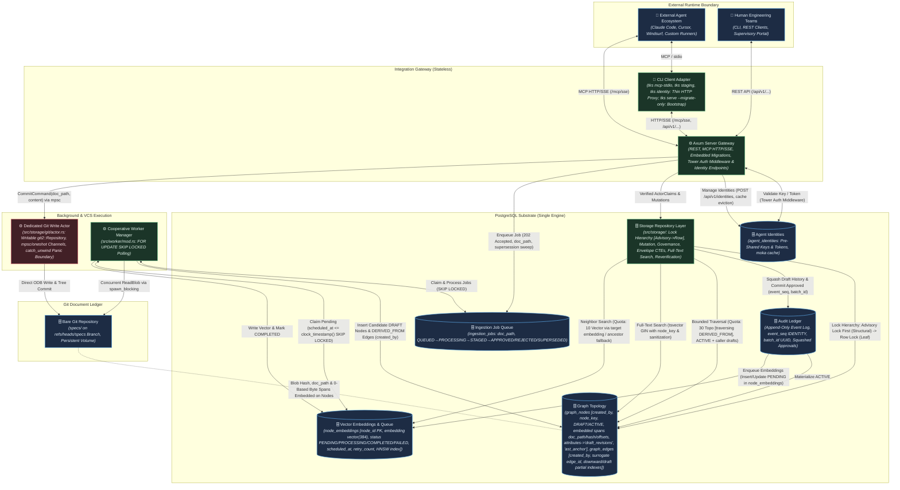

# TKS (The Knowledge Substrate): Architecture

## 1. Context & Drivers

The Knowledge Substrate (TKS) is a purpose-built requirement-intent provenance substrate
that anchors external AI agents and human engineering teams to a unified, version-governed
property graph. This architecture addresses three structural failure modes in agentic
software engineering: context window collapse (code-level context blindness to intent),
specification drift (decoupled documentation), and the monolithic diff dilemma (unscalable
human review of agent-generated output).

The architecture is shaped by the following drivers extracted from the governing vision,
strategic backlog, and Project Initiator directives:

| ID | Driver | Source |
| :--- | :--- | :--- |
| DR-1 | Unified graph-relational substrate combining property graph topology, vector embeddings, and relational audit in a single PostgreSQL engine | vision.md §2 Key Capabilities (1) |
| DR-2 | Document provenance and assisted decomposition: Git-backed content-addressed document store with mechanical AST parsing, LLM-assisted extraction, and human review gates | vision.md §2 Key Capabilities (2) |
| DR-3 | Agent-agnostic integration via MCP and REST: stateless protocol gateway for context retrieval and governed mutation | vision.md §2 Key Capabilities (3) |
| DR-4 | Immutable audit ledger with complete historical reversibility and point-in-time reconstruction for approved requirements | vision.md §2 Key Capabilities (4) |
| DR-5 | Per-node governance: attribute-based authorization controlling autonomous elaboration vs. human gating | vision.md §2 Key Capabilities (5) |
| DR-6 | Self-referential bootstrapping: the substrate manages its own development lifecycle via a phased transition: Phase 1 establishes read-only self-hosting for context querying, while Phase 2 enables autonomous self-evolution | vision.md §2 Key Capabilities (6), §3, §5 Invariant I-6; response.md LD-1 |
| DR-7 | Resource-constrained execution model: phased delivery achievable by solo developer or small team on commodity infrastructure | vision.md §3, backlog §1 |
| DR-8 | Sub-second micro-reflex graph traversal latency (<50 ms for k≤3 hops) at the operational hot path | vision.md §2 Operational Timescales, backlog §6 SLA-1 |
| DR-9 | Externalized cognitive compute: the substrate never invokes LLM inference internally; agents supply their own models | vision.md §3 |
| DR-10 | Phased hypothesis de-risking: lightweight spikes validate foundational premises (H-1, H-4) before infrastructure commitment | backlog §2 Phase 0, §5 Spike 0 |
| DR-11 | Token minimization & mechanical 80/20 parsing: minimize LLM reliance and token usage by using mechanical CommonMark AST decomposition for the initial 80%+ of structural parsing, restricting LLM invocations to compact classification tuples | Project Initiator Directive, iteration 2; response.md LD-1 |
| DR-12 | Two-tier state lifecycle with draft compaction: maintain strict distinction between Draft/Editable and Approved/Locked entities; compact intermediate draft history upon approval to eliminate audit ledger bloat | Project Initiator Directive, iteration 2; response.md LD-2 |
| DR-13 | Deterministic byte-offset alignment & non-destructive edge lifecycle: guarantee runtime safety on multi-byte UTF-8 texts and complete reversibility of graph topologies without physical edge deletion | iteration 3; response.md LD-1, LD-2 |
| DR-14 | Non-cascading data retention, conflict-free edge lifecycle & offline search: ensure canonical requirement survival on job queue pruning, surrogate keys for edge evolution, and sub-5ms offline search via PostgreSQL full-text indexing | iteration 4; response.md LD-1, LD-2, LD-6, LD-8 |
| DR-15 | Document path-anchored Git tree reachability, actor-isolated VCS execution, and strict total event ordering: maintain stable document paths (`doc_path`) for Git diff/log inspection and deterministic span re-anchoring, isolate blocking libgit2 C calls within a dedicated background Git actor, and enforce total event ordering in the audit ledger via monotonic 64-bit sequence keys | iteration 5; response.md LD-1, LD-2, LD-4 |
| DR-16 | Document revision reconciliation, canonical node addressing, and bootstrap migration autonomy: maintain stable human-readable keys (`node_key`) across revisions, reconcile revised CommonMark AST blocks with in-place span re-anchoring and active node supersession, and eliminate circular migration dependencies via auto-applying embedded migrations on boot | iteration 6; response.md LD-1, LD-2, LD-3, LD-5, LD-10 |
| DR-17 | Autonomous elaboration execution flow, lock acquisition hierarchy, and embedded provenance: enable verified agents to elaborate execution tasks directly in `ACTIVE` state under `AUTONOMOUS_ELABORATION` nodes, enforce global advisory locks prior to row-level locks to prevent deadlocks, embed document source spans directly on `graph_nodes`, and split Git operations into serialized writes and concurrent ODB reads | iteration 7; response.md LD-1, LD-2, LD-3, LD-4, LD-5, LD-6, LD-7, LD-8, LD-11, LD-12, LD-13 |
| DR-18 | Concurrency-hardened ingestion staging, caller-scoped draft isolation, explicit reverification, and vector queue consolidation: defer active span re-anchoring to staging approval under advisory transaction locks with audit logging, isolate concurrent drafts by author identity (`created_by`), provide explicit reverification interfaces (`reverify_node`) for degraded/stale nodes, specify explicit vector(384) HNSW indexing, eliminate duplicate queue tables by consolidating embedding tasks into `node_embeddings`, harden worker status transitions and timeout recovery, provide mutation rollback dry-runs, and structure staging lifecycle endpoints as RESTful resources | iteration 8; response.md LD-1, LD-2, LD-3, LD-4, LD-5, LD-6, LD-7, LD-8, LD-9, LD-11, LD-12 |

## 2. Constraints

### 2.1 Project Initiator Constraints

> ## Core Philosophy & Token Optimization
>
> Overall, we need to minimize token usage by sticking to a primary philosophy: **minimal LLM reliance and maximum reliance on mechanical processes.**
>
> * **Reducing Output Tokens:** Since output tokens are much more expensive than input tokens, saving on output is key. While we can't reduce ingestion costs significantly, we can lower the LLM's output burden by using mechanical extraction tools to handle the initial 80/20 (or better) of requirements parsing.  
> * **Document Decomposition:** We should explore what existing tools or mechanical options are available to decompose ingested documents and further cut down the LLM token load.
>
> ## State Management & Versioning
>
> We need a clear status distinction between **"Approved / Locked"** and **"Draft / Editable"**. Making every small draft immutable would create far too much churn and turn this into a complex version control system rather than a clean, auditable set of evolving requirements. For history and audit logging, we could maintain detailed event logs while a requirement is in draft. Once it gets approved, we collapse those intermediate draft events to avoid history bloat, while still preserving visibility into why the document mutated during drafting (just an idea, not a strict requirement).
>
> ## Scope Grounding & Architectural Level of Detail (Iteration 6)
>
> Lets not go too much into specification that is the purpose of the next phase. If we understand the technologies, workflows and boundaries and scopes then the implementation team is capable of elaborating the final detail and will flag up if they need too. This is not a direction to stop iterating it is grounding in how much detail an architecture document should have.

### 2.2 Derived Constraints

| ID | Constraint | Source |
| :--- | :--- | :--- |
| C-1 | Pure Rust package repository: all substrate service code is authored in Rust (edition 2024), built via Cargo stable toolchain | GEMINI.md (project guidelines) |
| C-2 | Single PostgreSQL engine: all topology data, vector embeddings (`pgvector`), relational metadata, and audit records reside in one PostgreSQL instance; no external graph or vector databases | vision.md §3 |
| C-3 | Stateless gateway boundary: MCP and REST interfaces maintain no persistent session memory; every operation is an authenticated, isolated transaction | vision.md §3 |
| C-4 | Document immutability & embedded source spans: uploaded text specifications are stored in a Git-backed repository committed to a dedicated specifications branch (`refs/heads/specs`) with mandatory persistent document paths (`doc_path`); source span coordinates are embedded directly as first-class columns on `graph_nodes` (`doc_path`, `doc_hash`, `byte_start`, `byte_end`) with a partial index on `doc_path`, eliminating standalone table join complexity and duplicate row Cartesian products; in-place span re-anchoring on existing `ACTIVE` nodes is strictly deferred until staging approval under `pg_advisory_xact_lock(hashtext(document_id::text))` with `SPAN_REANCHORED` audit events | vision.md §3; response.md LD-1, LD-8, LD-11 (iter 7); LD-1 (iter 8) |
| C-5 | Schema flexibility via progressive JSONB layering: core tables enforce foundational structural edges and typed invariants; domain-specific attributes use typed JSONB fields | vision.md §3 |
| C-6 | Bootstrap boundary: Phase 0 uses conventional tooling; Phase 1 establishes read-only self-hosting for context querying; Phase 2 onwards all feature requirements, architectural adjustments, and development tasks must be authored, reviewed, and tracked within the substrate | vision.md §3, §5 Invariant I-6; response.md LD-1 |
| C-7 | No in-database agent execution: the substrate never runs autonomous agent cognitive loops internally | vision.md §3, Invariant I-3 |
| C-8 | LLM interaction restricted to human-directed document ingestion and decomposition pipelines only | vision.md §3 |
| C-9 | Phase 0 and Phase 1 must be achievable on commodity infrastructure by a single developer or small team | vision.md §3, backlog §1 |
| C-10 | Dependency policy: prefer well-established Rust crates; avoid dependencies for functionality small enough to implement with the standard library | GEMINI.md |
| C-11 | Mechanical-first extraction: decomposition must execute CommonMark AST parsing and keyword scanning mechanically; LLMs must never echo verbatim source text and output only compact classification tuples | Project Initiator Directive, iteration 2; response.md LD-1 |
| C-12 | Centralized connection daemon & CLI HTTP client: runtime operational CLI commands (`tks mcp-stdio`, `tks staging`, `tks identity`) operate strictly as thin HTTP clients targeting the running `tks serve` daemon to avoid connection pool exhaustion; database migrations are embedded inside `tks serve` and auto-applied on startup before network binding, with a dedicated `--migrate-only` CLI flag for offline CI/CD environments | response.md LD-6, LD-11, LD-8 (iter 5), LD-13 (iter 5), LD-3, LD-10 |
| C-13 | Draft lifecycle isolation & staging consolidation: candidate requirements from decomposition and agent proposals reside directly in `graph_nodes` and `graph_edges` with `lifecycle_state = 'DRAFT'` and mandatory `created_by VARCHAR(64) NOT NULL` attribution. Production queries filter on `lifecycle_state = 'ACTIVE'` unless an explicit draft flag is requested. Concurrent draft visibility is caller-scoped (`created_by = $caller_id` via partial indexes `(document_id, created_by) WHERE lifecycle_state = 'DRAFT'`). Intermediate draft edits append to `graph_nodes.attributes->'draft_revisions'` and are atomically squashed into a single canonical audit event with `draft_evolution_summary` JSONB upon approval | Project Initiator Directive, iteration 2; response.md LD-3, LD-5, LD-11, LD-9, LD-2 (iter 7); LD-2 (iter 8) |
| C-14 | Offline and micro-reflex requirement search: `query_requirements` must execute via PostgreSQL native full-text search (`tsvector` / partial GIN index on active nodes) in <5ms without external network or LLM dependencies, incorporating `node_key` into the search vector and query sanitization to prevent hyphen-negation syntax corruption, reserving vector search strictly for asynchronous out-of-band context envelope enrichment | response.md LD-6, LD-7 (iter 4, iter 7) |
| C-15 | Non-cascading requirement retention: Canonical requirement lifecycle must be decoupled from transient ingestion job retention via non-cascading foreign keys (`ON DELETE SET NULL`) | response.md LD-1 |
| C-16 | Actor-isolated Git execution with read/write concurrency split: libgit2 C write commits execute within a dedicated background Git write actor thread over bounded `mpsc` and `oneshot` channels with panic recovery (`std::panic::catch_unwind`); read-only ODB blob lookups execute concurrently off Tokio worker pools via `tokio::task::spawn_blocking` and read-only ODB handles, eliminating serialization bottlenecks on immutable reads | response.md LD-2 (iter 5), LD-8, LD-12 (iter 7) |
| C-17 | Token-minimized embedding scheduling & consolidated storage: embedding tasks are enqueued strictly upon node transition to `ACTIVE` or content update of an already active node by inserting or updating records directly in `node_embeddings` with `status = 'PENDING'` and `scheduled_at = clock_timestamp()`, consolidating queue and vector storage into a single table; candidate draft nodes must never enqueue embedding jobs | Project Initiator Directive, response.md LD-3 (iter 5); LD-11 (iter 8) |
| C-18 | Canonical node identity resolution: requirements, specifications, and tasks must support human-readable canonical keys (`node_key VARCHAR(64)`) with a partial unique index on active nodes; all MCP and REST interfaces must accept either UUID or string `node_key` polymorphically | response.md LD-5 |
| C-19 | Strict lock acquisition hierarchy: any transaction that performs structural edge mutations, DAG cycle checks, batch staging approvals, or rollbacks must acquire the global transaction advisory lock `pg_advisory_xact_lock(hashtext('tks_structural_mutation'))` *before* acquiring any row-level locks on `graph_nodes` or `graph_edges` | response.md LD-5 (iter 7) |
| C-20 | Conditional typing on draft entities: `chk_node_type` permits `'UNCLASSIFIED'` strictly when `lifecycle_state = 'DRAFT'`, preserving domain typing integrity on active nodes while enabling graceful degradation during offline decomposition | response.md LD-1 (iter 7) |
| C-21 | Caller-scoped draft isolation & author attribution: all candidate draft nodes and edges in `graph_nodes` and `graph_edges` mandate `created_by VARCHAR(64) NOT NULL`, supported by partial composite indexes `(document_id, created_by) WHERE lifecycle_state = 'DRAFT'` and `(from_node_id, created_by) WHERE lifecycle_state = 'DRAFT'`, guaranteeing that concurrent agents and workers can only inspect their own pending drafts during context assembly | response.md LD-2, LD-5 (iter 8) |
| C-22 | Fixed-dimension vector embeddings & partial HNSW indexing: `node_embeddings` specifies fixed dimensionality `embedding vector(384)` matching the `all-MiniLM-L6-v2` reference model, indexed via a partial HNSW cosine distance index (`vector_cosine_ops`) restricted to `WHERE status = 'COMPLETED'`, ensuring index integrity without indexing pending, processing, or failed queue entries | response.md LD-4, LD-11 (iter 8) |

## 3. Architectural Invariants

| ID | Invariant | Rationale | Verification |
| :--- | :--- | :--- | :--- |
| INV-1 | Every active functional specification, implementation task, and code artifact reference must maintain a valid directed edge path terminating at an authorized active requirement node. Entities in `DRAFT`, `NEEDS_REVERIFICATION`, `SUPERSEDED`, or `ARCHIVED` states are explicitly exempt from requiring active requirement ancestors (draft nodes require only a structural parent edge to an existing draft or active node). Nodes in `NEEDS_REVERIFICATION` can be inspected in context envelopes (annotated with staleness warnings) and unblocked through explicit reverification (`POST /api/v1/nodes/{id}/reverify` or MCP tool `reverify_node`) or by proposing clarifying mutations. Orphan execution tasks must be rejected at the database constraint level. During atomic batch draft promotion (`POST /api/v1/documents/ingest/{job_id}/approve`), the transactional CTE ancestor verification evaluates child specification and task nodes against the union of currently `ACTIVE` requirement nodes and candidate requirement nodes included in the current promotion batch (`id = ANY($approved_node_ids)`), traversing `FULFILLS`, `CONSTRAINED_BY`, and `DERIVED_FROM` edges upward to identify active requirement roots. All governance and structural edges must point directed upward toward governing requirements (`child_id -DERIVED_FROM-> parent_id`, `Spec -CONSTRAINED_BY-> Requirement`). Under parent nodes with `governance_policy = 'AUTONOMOUS_ELABORATION'`, verified agents are authorized to create non-normative execution tasks (`TASK`) directly in `ACTIVE` state with immediate commit to `audit_ledger` with monotonic `event_seq`, provided a transactional CTE validates an unbroken upward path to an active requirement. | Ensures end-to-end traceability from vision to code while preventing draft tree authoring failures, batch approval transaction rollbacks, agent elaboration deadlocks, and invalidation cascade transaction aborts during administrative rollbacks. | Enforced during draft promotion/approval (`POST /api/v1/documents/ingest/{job_id}/approve` or transition to `ACTIVE`) via transactional CTE ancestor checks evaluating the union of active and batch-approved nodes, traversing `FULFILLS`, `CONSTRAINED_BY`, and `DERIVED_FROM`. Reverification test: reverify `NEEDS_REVERIFICATION` node via `POST /api/v1/nodes/{id}/reverify` → verify transition to `ACTIVE` and `staleness_score = 0.0`. Autonomous elaboration test: verified agent creates `TASK` under `AUTONOMOUS_ELABORATION` node → expect direct `ACTIVE` creation, inherited `AUTONOMOUS_ELABORATION` policy, and immediate context envelope queryability. Orphan test: attempt to promote task node without requirement path → expect transaction rollback. Rollback cascade test: verify that reverting a parent node transitions children to `NEEDS_REVERIFICATION` without trigger abort. |
| INV-2 | Destructive in-place updates (`UPDATE`, `DELETE`) on active requirements, specifications, and topological edges must not occur. Structural edges in `graph_edges` maintain a strongly typed `lifecycle_state` (`DRAFT`, `ACTIVE`, `SUPERSEDED`, `REVERTED`), use dedicated surrogate primary keys (`edge_id UUID PRIMARY KEY DEFAULT gen_random_uuid()`) with a partial unique index on active edges (`idx_graph_edges_active_unique WHERE lifecycle_state = 'ACTIVE'`), and are never physically deleted. Promoting candidate draft edges requires dual-endpoint active validation (both endpoints must be active) and automatically supersedes conflicting existing active edges. Re-anchoring of in-place spans on `ACTIVE` nodes is strictly deferred until staging approval under `pg_advisory_xact_lock(hashtext(document_id::text))` with `SPAN_REANCHORED` audit events, guaranteeing that background ingestion and draft generation never mutate active graph state. All approved state transitions must be recorded as discrete, reversible audit events in `audit_ledger` with a monotonically increasing integer sequence primary key (`event_seq BIGINT GENERATED ALWAYS AS IDENTITY PRIMARY KEY`) and an atomic transaction correlation key (`batch_id UUID NOT NULL DEFAULT gen_random_uuid()`), guaranteeing strict total event ordering and point-in-time batch reconstruction without timestamp collision vulnerabilities. For entities in `DRAFT` state, intermediate edits append to ephemeral draft revision arrays inside `graph_nodes.attributes->'draft_revisions'` and are collapsed (squashed) into a single canonical `APPROVED` event upon approval. Operational mutations on active execution tasks (`TASK`) lock the row via `SELECT ... FOR UPDATE` and commit discrete reversible state events directly to `audit_ledger`. External agents cannot rewrite active normative requirements in place; modifications must be submitted as candidate `DRAFT` nodes. Rollbacks execute non-destructively via unified `revert_mutations` with optional dry-run preview. | Guarantees complete auditability and historical reversibility for approved requirements, topological relationships, and atomic mutation batches while preventing draft history churn from bloating the audit ledger and eliminating primary key collisions during edge lifecycle transitions. | Monotonically increasing `event_seq` and correlated `batch_id` in audit ledger. In-place span re-anchoring test: verify active node spans remain unchanged during ingestion processing; on staging approval, verify spans update in place and emit `SPAN_REANCHORED` audit event. Draft approvals insert exactly one canonical `APPROVED` record containing final verified state and a `draft_evolution_summary` JSONB. Revert test: invoke `revert_mutations(batch_id: ...)` → verify inverse deltas appended with monotonic `event_seq`, edges marked `SUPERSEDED`/`REVERTED`, and children swept to `NEEDS_REVERIFICATION`. Edge query test: verify recursive CTEs with partial index filter exclude superseded and reverted edges. Active task mutation test: update task status → expect row lock and immediate audit ledger event. |
| INV-3 | The core database engine and gateway services must never execute autonomous agent cognitive loops internally. The substrate must function strictly as a deterministic state store and protocol gateway. | Preserves operational determinism; prevents uncontrolled LLM invocations within the trusted storage boundary; keeps cognitive compute externalized and auditable. | Code review gate: no LLM client invocations in gateway or storage crate modules. CI lint rule scanning for prohibited dependency imports. |
| INV-4 | Every requirement derived via the decomposition pipeline must store a persistent cryptographic reference (Git commit/blob hash `doc_hash`), document path/slug (`doc_path`), and 0-based source byte span coordinates (`byte_start`, `byte_end`) embedded as first-class columns directly on `graph_nodes` pointing to the original document artifact. | Enables independent verification of requirement provenance against immutable source text; anchors extracted semantics to deterministic byte ranges, eliminates standalone relational table joins, prevents 1-to-many Cartesian products across revisions, and prevents runtime UTF-8 string-slicing panics in Rust. | Integration test: for each extracted requirement node, resolve Git blob hash and verify that `&source_bytes[byte_start..byte_end]` matches the stored requirement verbatim text at `doc_path` without character boundary slicing panics. Join verification: inspect staging and context queries to confirm zero joins to legacy span tables. |
| INV-5 | Permissions to alter or elaborate a graph node must be governed by explicit per-node `governance_policy` metadata attributes (`AUTONOMOUS_ELABORATION`, `HUMAN_REVIEW_REQUIRED`, `LOCKED`). Node-level policies must take absolute precedence over global agent roles. Under `AUTONOMOUS_ELABORATION`, verified agents are authorized to elaborate execution sub-tasks (`node_type = 'TASK'`) directly into `ACTIVE` status without manual staging intervention, preserving the autonomous agent execution loop while enforcing Invariant INV-1 ancestor paths. Execution tasks created via autonomous elaboration inherit their parent task's `governance_policy` (`AUTONOMOUS_ELABORATION`) by default unless an explicit override is supplied. | Provides granular, progressive delegation of autonomy; prevents agents from modifying safety-critical requirements without human authorization, while avoiding operational deadlocks on execution task elaboration. | Integration test: agent attempts mutation on `LOCKED` node → expect rejection; agent elaborates execution task on `AUTONOMOUS_ELABORATION` node → expect direct `ACTIVE` creation, inherited `AUTONOMOUS_ELABORATION` policy, and successful context envelope retrieval; agent mutates normative text on `HUMAN_REVIEW_REQUIRED` node → expect candidate draft staging. |
| INV-6 | The Knowledge Substrate must be used to manage its own development through a phased bootstrapping transition. Upon completing Phase 1 foundational ingestion and read-only context retrieval, the substrate must self-host its own documentation (`vision.md`, backlogs) for context querying by human developers and external agents to implement Phase 2 tasks. Upon completing Phase 2 mutation tooling, draft lifecycle handling, and governance, all subsequent feature requirements, architectural adjustments, and development tasks must be authored, reviewed, and tracked within the substrate itself. | Self-referential dogfooding exposes UX friction early and validates utility without blocking Phase 1 exit criteria on non-existent Phase 2 mutation tools. | Phase 1 dogfooding audit: project's own documentation (`vision.md`, backlogs) ingested and queryable via read-only MCP (`get_context_envelope`, `query_requirements`). Phase 2 dogfooding audit: post-Phase 2 tasks and requirements created and mutated directly via MCP tools. |
| INV-7 | Every mutation and candidate draft submitted through the Integration Gateway must be attributable to a verified external identity (human user or agent instance). All draft rows in `graph_nodes` and `graph_edges` must enforce `created_by VARCHAR(64) NOT NULL` to provide caller-scoped draft isolation via partial indexes. Identity credentials must be recorded in the audit ledger alongside mutation events (`actor_id`, `actor_type`, `token_fingerprint`). No mutation may be committed without a verified identity reference. Identity revocation must immediately invalidate local cache entries across running services. | Non-negotiable audit requirement; enables forensic tracing of any graph change to its originator; supports blast-radius containment for compromised agents while preventing concurrent draft collisions. | Two-tier authentication: For Phase 1–2, agents authenticate via pre-shared API keys or HMAC bearer tokens mapped to `agent_identities`; stdio passes credentials via process environment variables (`TKS_AGENT_ID`, `TKS_AUTH_TOKEN`) or tool payload `auth` fields; HTTP/SSE uses `Authorization: Bearer <token>`. Audit ledger schema enforces NOT NULL on `actor_id`, `actor_type`, and `token_fingerprint`. Draft isolation test: create drafts under agent A and agent B → verify agent A queries only see agent A's drafts alongside active nodes. Integration test: submit mutation without auth credentials → expect rejection. Revocation test: call revocation endpoint → verify immediate rejection of cached bearer tokens. |

## 4. Component Topology



### Component Responsibilities & Boundaries

| Component | Responsibility | Owns State | Depends On |
| :--- | :--- | :--- | :--- |
| Axum Server Gateway | Single unified HTTP service hosting REST endpoints (`/api/v1/...`), identity administration (`/api/v1/identities`), reverification (`POST /api/v1/nodes/{id}/reverify`), unified rollback (`POST /api/v1/admin/revert-mutations`), and MCP over HTTP/SSE on a single port; executes embedded migrations (`refinery::embed_migrations!`) on startup before binding listeners; incorporates Tower authentication middleware and `FromRequestParts` extractor (`src/gateway/auth.rs`) validating inbound credentials against `agent_identities` with an in-process `moka` LRU cache; immediately invalidates cache entries upon revocation; handles request lifecycle, streaming, and RESTful approval/rejection endpoints (`POST /api/v1/documents/ingest/{job_id}/approve`, `DELETE /api/v1/documents/ingest/{job_id}`) | No (stateless) | Storage Repository Layer, Dedicated Git Write Actor, Ingestion Job Queue, Agent Identities table |
| CLI Client Adapter (`tks mcp-stdio`, `tks staging`, `tks identity`) | Unified lightweight CLI binary operating strictly as a thin HTTP/SSE client for runtime operations; forwards JSON-RPC frames over HTTP/SSE (`tks mcp-stdio`) and operational commands (`tks staging`, `tks identity`) via REST to the running Axum daemon; supports standalone `--migrate-only` execution on `tks serve` for offline CI/CD database migrations; maintains zero direct database connection pools during routine agent sessions; implements backoff startup checks and structured initialization error formatting | No (stateless thin HTTP client) | Axum Server Gateway |
| Dedicated Git Write Actor Task (`src/storage/git/actor.rs`) | Dedicated background actor thread exclusively owning the writable `git2::Repository` handle; receives write and commit requests via bounded Tokio mpsc channel (`tokio::sync::mpsc::channel`); executes blocking libgit2 C write calls sequentially off the Tokio async worker pool; encapsulates command execution inside `std::panic::catch_unwind` recovery boundary to preserve channel receiver across transient panics; commits raw specs to `refs/heads/specs` at persistent document paths (`doc_path`) and returns results via `tokio::sync::oneshot` channels, eliminating Tokio reactor starvation, thread safety issues, `.lock` collisions, and channel disconnection | Yes: bare Git writable repository handle | Bare Git Repository on persistent volume |
| Concurrent Git ODB Reader | Read-only ODB access module executing within worker and gateway threads via `tokio::task::spawn_blocking` calling `git2::Odb::read`; directly retrieves immutable blob content by cryptographic hash without queuing behind Git write commits or contending on Git ref locks | No (stateless read handle) | Bare Git Repository on persistent volume |
| Storage Repository Layer (`src/storage/`) | Consolidated storage domain module (`src/storage/mutation.rs`, `src/storage/governance.rs`, `src/storage/envelope.rs`) executing transactional mutations under a strict lock acquisition hierarchy (global advisory lock *before* row locks for structural mutations), DAG cycle validation, autonomous elaboration task creation directly into `ACTIVE` state with inherited governance policy, per-node governance checks, polymorphic UUID/`node_key` resolution, quota-partitioned bounded recursive CTE graph traversals (traversing `FULFILLS`, `CONSTRAINED_BY`, and `DERIVED_FROM`), caller-scoped draft query visibility (`created_by`), explicit reverification (`reverify_node`), unified rollback mechanics (`revert_mutations` with dry-run support), and sub-5ms native full-text search with query sanitization preventing hyphen negation | No (stateless repository) | Graph Topology, Audit Ledger, Vector Embeddings |
| Cooperative Worker Manager (`src/worker/mod.rs`) | Unified cooperative background worker manager running inside `tks serve` orchestrating both document decomposition (`ingestion_jobs`) and asynchronous embedding generation (`node_embeddings`) via timer polling with `FOR UPDATE SKIP LOCKED` and exponential backoff sleep (eliminating bespoke `LISTEN/NOTIFY`), centralizing shutdown, telemetry, connection usage, and retry backoff | No (stateless worker) | Ingestion Job Queue, Vector Embeddings & Queue, Concurrent Git ODB Reader, Graph Topology, external LLM/embedding APIs |
| Decomposition Pipeline (Subsystem) | Subsystem of Worker Manager consuming `ingestion_jobs`; executes Stage 1 CommonMark AST parsing (`pulldown-cmark`) maintaining an active heading stack (H1–H4) to mechanically emit upward structural hierarchy edges (`child_id -DERIVED_FROM-> parent_id`) and deterministic heading anchors (`ast_anchor`), capturing embedded 0-based byte offsets and `node_key` tags; executes Stage 2 targeted LLM semantic classification for compact classification tuples; stages candidate nodes directly in `graph_nodes` with `lifecycle_state = 'DRAFT'` and mandatory `created_by` attribution; candidate draft nodes never enqueue embedding generation tasks | No (stateless worker) | Ingestion Job Queue, Concurrent Git ODB Reader, Graph Topology, external LLM API |
| Embedding Worker (Subsystem) | Subsystem of Worker Manager consuming pending records in `node_embeddings`; batch-fetches pending entries (`WHERE status = 'PENDING' AND scheduled_at <= clock_timestamp() FOR UPDATE SKIP LOCKED`), calls embedding provider APIs, updates `node_embeddings` (setting `embedding vector(384)` and `status = 'COMPLETED'`) using optimistic concurrency control, and sets exponential backoff delay (`scheduled_at = clock_timestamp() + INTERVAL '1s' * 2^retry_count`, `status = 'PENDING'`) on rate-limit (429/503) errors | No (stateless worker) | Vector Embeddings & Queue, external embedding API |
| Graph Topology (PostgreSQL) | Stores `graph_nodes` (with mandatory `created_by VARCHAR(64) NOT NULL`, explicit `node_key VARCHAR(64)` indexed partially on active nodes, conditional check constraint permitting `'UNCLASSIFIED'` in `DRAFT`, embedded document source spans `doc_path`, `doc_hash`, `byte_start`, `byte_end` with partial index on `doc_path`, generated `search_tsv tsvector` including `node_key`, `attributes JSONB` storing ephemeral `draft_revisions` and `ast_anchor`, and `job_id` FK with `ON DELETE SET NULL`) and `graph_edges` with surrogate primary key `edge_id`, `created_by VARCHAR(64) NOT NULL`, strongly typed `lifecycle_state` (`DRAFT`, `ACTIVE`, `SUPERSEDED`, `REVERTED`), and partial indexes `idx_graph_edges_active_unique`, `idx_graph_edges_to_node_active`, and `idx_graph_edges_draft`; enforces structural invariants via transactional CTEs | Yes: canonical graph state | PostgreSQL engine |
| Vector Embeddings (pgvector) | Stores dense vector representations and asynchronous queue state directly in `node_embeddings` (`node_id UUID PRIMARY KEY REFERENCES graph_nodes(id) ON DELETE CASCADE`, `embedding vector(384)`, `status VARCHAR(16)`, `retry_count INT`, `scheduled_at TIMESTAMPTZ`, `error_message TEXT`, `updated_at TIMESTAMPTZ`) with partial HNSW cosine distance index (`vector_cosine_ops`) restricted to `WHERE status = 'COMPLETED'`; obsolete vectors explicitly deleted upon node supersession | Yes: embedding vectors and queue state | Graph Topology (node identity) |
| Audit Ledger (PostgreSQL) | Append-only event log recording every approved node/edge mutation with actor identity, timestamp, total event ordering sequence `event_seq`, atomic transaction correlation key `batch_id UUID`, reversible delta payload, `SPAN_REANCHORED` events, and squashed draft evolution summaries | Yes: immutable event stream | PostgreSQL engine |
| Ingestion Job Queue (PostgreSQL) | Durable queue (`ingestion_jobs`) tracking asynchronous document decomposition tasks, persistent document path `doc_path`, and statuses (`QUEUED`, `PROCESSING`, `STAGED`, `APPROVED`, `REJECTED`, `SUPERSEDED`, `FAILED`); re-ingestion triggers supersession sweeps on open jobs; worker transitions to `STAGED` conditionally (`WHERE status = 'PROCESSING'`) and reclaims timeouts at 180s with atomic draft purging | Yes: job state | PostgreSQL engine |
| Agent Identities (PostgreSQL) | Table (`agent_identities`) storing authorized agent instances, pre-shared token hashes/HMAC credentials, and active status | Yes: identity records | PostgreSQL engine |
| Bare Git Document Ledger | Content-addressed bare Git repository storing raw Markdown/text specification documents committed directly to dedicated specifications branch (`refs/heads/specs`) at persistent document paths (`doc_path`); write operations serialized via dedicated background Git write actor task; read operations served concurrently via `tokio::task::spawn_blocking` | Yes: document artifacts | Dedicated persistent filesystem volume |

### Deployment & Process Model

The deployment model targets a robust single-host configuration suitable for the constrained resource model (solo developer / small team):

* **Single Rust binary** compiled from the `tks` crate:
  * Default server mode (`tks serve`): Runs the unified `Axum` HTTP service hosting REST endpoints, identity administration, reverification, unified rollback endpoint (`POST /api/v1/admin/revert-mutations`), and MCP over HTTP/SSE on the configured port (default `:8080`), integrating Tower authentication middleware and extractors, along with the dedicated background Git write actor task (`src/storage/git/actor.rs`) and the cooperative `WorkerManager` running background loops for `ingestion_jobs` and `node_embeddings`. All database connection pooling (`deadpool-postgres`), advisory locking, and Git write serialization are centralized strictly inside this single process. On startup, `tks serve` automatically executes pending embedded database migrations (via `refinery::embed_migrations!`) against PostgreSQL before binding network listeners and starting background workers, ensuring zero deployment synchronization issues.
  * Standalone bootstrap migration mode (`tks serve --migrate-only`): Executes pending embedded database migrations directly against `$DATABASE_URL` and terminates immediately with exit code 0. Used in CI/CD pipelines, Docker Compose init containers, and Kubernetes pre-install hooks without requiring a running server daemon.
  * Dedicated CLI client mode: CLI subcommands (`tks mcp-stdio`, `tks staging`, `tks identity`) operate strictly as thin HTTP clients targeting the local `tks serve` REST API (`http://localhost:8080/api/v1/...`). The CLI binary embeds only a lightweight HTTP client (`reqwest`), eliminating database client dependencies and multi-process connection pool exhaustion. `tks mcp-stdio` forwards standard input/output JSON-RPC to the running Axum daemon over HTTP/SSE, implementing backoff retries and structured JSON-RPC initialization error formatting if `tks serve` is not running (addressing TB-4).
  * Diagnostic logging: `tracing-subscriber` is explicitly configured to write all logs and diagnostic traces strictly to `stderr`. `stdout` is exclusively reserved for valid JSON-RPC framing when operating in stdio mode.
* **PostgreSQL instance** (with `pgvector` extension) runs as a separate process or container, accessed via connection pooling (`deadpool-postgres`).
* **Bare Git repository** (`git init --bare`) resides on a dedicated, persistent filesystem volume co-located with PostgreSQL storage. Writes commit directly onto `refs/heads/specs` under stable document paths (`doc_path`, e.g. `specs/vision.md`) via the Git write actor. Reads execute concurrently via `tokio::task::spawn_blocking` and direct ODB blob lookups, ensuring 100% commit-tree reachability without head-of-line blocking on reads.
* A standard Docker Compose configuration provisions PostgreSQL with `pgvector` and mounts persistent volumes for PostgreSQL data and the bare Git repository.

## 5. Data & State Model

### 5.1 State Ownership

| State | Owner | Storage | Consistency | Lifecycle |
| :--- | :--- | :--- | :--- | :--- |
| Graph nodes | Graph Topology | PostgreSQL `graph_nodes` table (`id`, `node_key VARCHAR(64)`, `node_type`, `title`, `content`, `search_tsv tsvector`, `lifecycle_state`, `governance_policy`, `created_by VARCHAR(64) NOT NULL`, `job_id REFERENCES ingestion_jobs(job_id) ON DELETE SET NULL`, `doc_path VARCHAR(255)`, `doc_hash VARCHAR(64)`, `byte_start INT`, `byte_end INT`, `attributes JSONB`) | Strong (ACID transactions) | Created via decomposition or agent proposal → `DRAFT` (permits `'UNCLASSIFIED'` node_type) with author attribution (`created_by`) → approved → `ACTIVE` → `SUPERSEDED`, `ARCHIVED`, or `NEEDS_REVERIFICATION`; autonomous elaboration permits direct `ACTIVE` creation for tasks with inherited governance policy; candidate drafts not approved in a batch are atomically purged; intermediate draft edits recorded in `attributes->'draft_revisions'`; document source spans embedded directly on row; decoupled from job pruning |
| Structural edges | Graph Topology | PostgreSQL `graph_edges` table (`edge_id UUID PRIMARY KEY`, `from_node_id`, `to_node_id`, `edge_type`, `created_by VARCHAR(64) NOT NULL`, `lifecycle_state`) | Strong (ACID, global advisory lock, partial unique index `WHERE lifecycle_state = 'ACTIVE'`) | Created alongside node; supports draft edges between draft nodes; dual-endpoint active validation on promotion; supersedes conflicting active edges; indexed for downward traversals and draft isolation; never physically deleted (INV-2), only transitioned to `SUPERSEDED` or `REVERTED` without PK collisions; `CONSTRAINED_BY` and `DERIVED_FROM` uniformly point upward |
| Vector embeddings & queue | Vector Index & Worker | PostgreSQL `node_embeddings` table (`node_id UUID PRIMARY KEY REFERENCES graph_nodes(id) ON DELETE CASCADE`, `content_hash VARCHAR(64) NOT NULL`, `embedding vector(384)`, `status VARCHAR(20) NOT NULL DEFAULT 'PENDING' CHECK (status IN ('PENDING', 'PROCESSING', 'COMPLETED', 'FAILED'))`, `retry_count INT NOT NULL DEFAULT 0`, `scheduled_at TIMESTAMPTZ NOT NULL DEFAULT clock_timestamp()`, `error_message TEXT`, `updated_at TIMESTAMPTZ NOT NULL DEFAULT clock_timestamp()`) | Eventually consistent (asynchronously updated out-of-band via internal queue status) | Enqueued strictly on node transition to `ACTIVE` or content update of active node (`PENDING`); candidate draft nodes never enqueue; claimed with `scheduled_at <= clock_timestamp() FOR UPDATE SKIP LOCKED`; updated to `COMPLETED` with vector(384); deleted via foreign key CASCADE or explicitly purged on requirement supersession |
| Governance policy | Storage Repository | Strongly typed column on `graph_nodes` (`VARCHAR` with `CHECK`: `AUTONOMOUS_ELABORATION`, `HUMAN_REVIEW_REQUIRED`, `LOCKED`) | Strong (per-node, indexed, checked at mutation time) | Set at node creation; inherited by autonomous elaboration tasks; updated by human administrator only |
| Node lifecycle state | Graph Topology | Strongly typed column on `graph_nodes` (`VARCHAR` with `CHECK`: `DRAFT`, `ACTIVE`, `SUPERSEDED`, `ARCHIVED`, `NEEDS_REVERIFICATION`) | Strong (indexed, evaluated during recursive CTE traversals) | Starts in `DRAFT` or `ACTIVE`; transitions managed by storage repository, reverification endpoint (`reverify_node`), or dependency sweep |
| Audit events | Audit Ledger | PostgreSQL `audit_ledger` table (`event_seq BIGINT GENERATED ALWAYS AS IDENTITY PRIMARY KEY`, `batch_id UUID NOT NULL DEFAULT gen_random_uuid()`, `event_id UUID`, `event_type`, `entity_id`, `entity_type`, `actor_id`, `actor_type`, `token_fingerprint`, `delta JSONB`, `snapshot JSONB`, `draft_evolution_summary JSONB`, `created_at`) | Strong (append-only, total ordering sequence, batch correlation key, NOT NULL actor and token constraints) | Created on approved mutation, span re-anchoring (`SPAN_REANCHORED`), or reverification; squashes draft history on approval; correlated via `batch_id`; never modified or deleted |
| Ingestion jobs | Ingestion Pipeline | PostgreSQL `ingestion_jobs` table (`job_id UUID PRIMARY KEY`, `doc_path VARCHAR(255) NOT NULL`, `document_hash VARCHAR(64) NOT NULL`, `status`, `error_message`, `retry_count`, `created_at`, `updated_at`) | Strong (transactional state machine) | Created on `POST /api/v1/documents/ingest` (`QUEUED`) → `PROCESSING` → `STAGED` (conditional transition) → `APPROVED` (promoted to `ACTIVE`) or `REJECTED` (candidates discarded via `DELETE /api/v1/documents/ingest/{job_id}`); prior open jobs for `doc_path` transition to `SUPERSEDED` upon re-ingestion; timeout reclaim at 180s purges partial drafts |
| Agent identities | Axum Gateway (Auth) | PostgreSQL `agent_identities` table (`agent_id`, `token_hash`, `actor_type`, `is_active`, `created_at`) | Strong (ACID) | Provisioned by administrator CLI (`tks identity create`) via daemon REST API or dev seed → active → revoked; validated via Tower middleware / extractor with in-process `moka` LRU cache; cache entry invalidated immediately on revocation |
| Document artifacts | Git Document Ledger | Bare Git repository on persistent volume committed to `refs/heads/specs` branch at persistent `doc_path` | Strong (content-addressed, cryptographic integrity, standard commit-tree reachability, dedicated Git write actor task, concurrent ODB reads) | Ingested via REST API → committed to bare Git ODB on `specs` branch at `doc_path` via Git write actor → immutable blob read concurrently via `spawn_blocking` |

#### Entity Typing and Relational Constraints

The primary entity table is `graph_nodes`. It incorporates mandatory typed discriminator and lifecycle columns governed by PostgreSQL `CHECK` constraints, an optional human-readable canonical node key (`node_key`, e.g. `REQ-CORE-001`, `TASK-AUTH-042`) with partial unique indexing on active nodes, embedded document source span columns with partial index on `doc_path` (eliminating the standalone `source_spans` table per LD-11, iter 7), a first-class `created_by VARCHAR(64) NOT NULL` author attribution column with partial index for caller-scoped draft isolation (addressing LD-2, iter 8), a conditional check constraint permitting `'UNCLASSIFIED'` exclusively when `lifecycle_state = 'DRAFT'` (addressing LD-1, iter 7), a generated `tsvector` column incorporating `node_key` with partial GIN indexing for sub-5ms active requirement search (addressing LD-7, iter 7), and a non-cascading foreign key on `job_id`:

```sql
ALTER TABLE graph_nodes ADD COLUMN node_key VARCHAR(64);
CREATE UNIQUE INDEX idx_graph_nodes_node_key_active
    ON graph_nodes (node_key)
    WHERE lifecycle_state = 'ACTIVE' AND node_key IS NOT NULL;

-- First-class author attribution and caller-scoped draft isolation (addressing LD-2, iter 8)
ALTER TABLE graph_nodes ADD COLUMN created_by VARCHAR(64) NOT NULL DEFAULT 'system';
CREATE INDEX idx_graph_nodes_draft_author
    ON graph_nodes (created_by)
    WHERE lifecycle_state = 'DRAFT';

-- Conditional check constraint permitting UNCLASSIFIED strictly in DRAFT (addressing LD-1, iter 7)
ALTER TABLE graph_nodes ADD CONSTRAINT chk_node_type
    CHECK (
        (lifecycle_state = 'DRAFT' AND node_type IN ('REQUIREMENT', 'SPECIFICATION', 'TASK', 'VERIFICATION', 'DECISION', 'UNCLASSIFIED'))
        OR (lifecycle_state != 'DRAFT' AND node_type IN ('REQUIREMENT', 'SPECIFICATION', 'TASK', 'VERIFICATION', 'DECISION'))
    );

ALTER TABLE graph_nodes ADD CONSTRAINT chk_lifecycle_state
    CHECK (lifecycle_state IN ('DRAFT', 'ACTIVE', 'SUPERSEDED', 'ARCHIVED', 'NEEDS_REVERIFICATION'));
ALTER TABLE graph_nodes ADD CONSTRAINT chk_governance_policy
    CHECK (governance_policy IN ('AUTONOMOUS_ELABORATION', 'HUMAN_REVIEW_REQUIRED', 'LOCKED'));

-- Foreign key decoupled from transient job queue retention (addressing LD-1, iter 4)
ALTER TABLE graph_nodes ADD CONSTRAINT fk_graph_nodes_job
    FOREIGN KEY (job_id) REFERENCES ingestion_jobs(job_id) ON DELETE SET NULL;

-- Embedded document source spans (addressing LD-11, iter 7; eliminating source_spans table)
ALTER TABLE graph_nodes ADD COLUMN doc_path VARCHAR(255);
ALTER TABLE graph_nodes ADD COLUMN doc_hash VARCHAR(64);
ALTER TABLE graph_nodes ADD COLUMN byte_start INT;
ALTER TABLE graph_nodes ADD COLUMN byte_end INT;
CREATE INDEX idx_graph_nodes_doc_path ON graph_nodes(doc_path) WHERE doc_path IS NOT NULL;

-- Native full-text search generated column including node_key and partial GIN index (addressing LD-6, iter 4; LD-7, iter 7)
ALTER TABLE graph_nodes ADD COLUMN search_tsv tsvector
    GENERATED ALWAYS AS (to_tsvector('english', coalesce(node_key, '') || ' ' || coalesce(title, '') || ' ' || coalesce(content, ''))) STORED;
CREATE INDEX idx_graph_nodes_search_tsv ON graph_nodes USING gin(search_tsv)
    WHERE lifecycle_state = 'ACTIVE';
```

Structural edges in `graph_edges` enforce endpoint validity rules via foreign keys, a first-class `lifecycle_state` column, a dedicated surrogate key, caller-scoped `created_by` author attribution, a partial unique index on active edges, a downward index for invalidation sweeps, and a draft index for caller isolation (addressing LD-1, LD-2, iter 4; LD-2, LD-5, iter 8):

```sql
CREATE TABLE graph_edges (
    edge_id UUID PRIMARY KEY DEFAULT gen_random_uuid(),
    from_node_id UUID NOT NULL REFERENCES graph_nodes(id) ON DELETE CASCADE,
    to_node_id UUID NOT NULL REFERENCES graph_nodes(id) ON DELETE CASCADE,
    edge_type VARCHAR(32) NOT NULL,
    created_by VARCHAR(64) NOT NULL DEFAULT 'system',
    lifecycle_state VARCHAR(20) NOT NULL DEFAULT 'ACTIVE'
        CHECK (lifecycle_state IN ('DRAFT', 'ACTIVE', 'SUPERSEDED', 'REVERTED'))
);

CREATE UNIQUE INDEX idx_graph_edges_active_unique
    ON graph_edges (from_node_id, to_node_id, edge_type)
    WHERE lifecycle_state = 'ACTIVE';

-- Downward traversal index for automated invalidation cascades and sub-task discovery (addressing LD-5, iter 8)
CREATE INDEX idx_graph_edges_to_node_active
    ON graph_edges (to_node_id, from_node_id, edge_type)
    WHERE lifecycle_state = 'ACTIVE';

-- Caller-scoped draft edge isolation index (addressing LD-2, LD-5, iter 8)
CREATE INDEX idx_graph_edges_draft_author
    ON graph_edges (from_node_id, created_by)
    WHERE lifecycle_state = 'DRAFT';
```

The append-only `audit_ledger` enforces total event ordering, atomic batch correlation, and point-in-time reconstruction via a monotonically increasing sequence primary key, transaction correlation `batch_id`, and referential integrity isolation (addressing LD-4, iter 5; LD-4, iter 7):

```sql
CREATE TABLE audit_ledger (
    event_seq BIGINT GENERATED ALWAYS AS IDENTITY PRIMARY KEY,
    batch_id UUID NOT NULL DEFAULT gen_random_uuid(),
    event_id UUID NOT NULL DEFAULT gen_random_uuid(),
    event_type VARCHAR(32) NOT NULL,
    entity_id UUID NOT NULL,
    entity_type VARCHAR(32) NOT NULL,
    actor_id VARCHAR(64) NOT NULL,
    actor_type VARCHAR(16) NOT NULL,
    token_fingerprint VARCHAR(64) NOT NULL,
    delta JSONB NOT NULL,
    snapshot JSONB NOT NULL,
    draft_evolution_summary JSONB,
    created_at TIMESTAMPTZ NOT NULL DEFAULT NOW()
);

CREATE INDEX idx_audit_ledger_entity ON audit_ledger(entity_id, event_seq);
CREATE INDEX idx_audit_ledger_batch ON audit_ledger(batch_id, event_seq);
CREATE INDEX idx_audit_ledger_created_at ON audit_ledger(created_at);
```

The consolidated `node_embeddings` table unifies vector storage and asynchronous task queue management into a single relational table, specifying explicit fixed dimensionality `vector(384)` and a partial HNSW cosine distance index restricted to completed vectors (addressing LD-4, LD-11, iter 8):

```sql
CREATE TABLE node_embeddings (
    node_id UUID PRIMARY KEY REFERENCES graph_nodes(id) ON DELETE CASCADE,
    content_hash VARCHAR(64) NOT NULL,
    embedding vector(384),
    status VARCHAR(20) NOT NULL DEFAULT 'PENDING'
        CHECK (status IN ('PENDING', 'PROCESSING', 'COMPLETED', 'FAILED')),
    retry_count INT NOT NULL DEFAULT 0,
    scheduled_at TIMESTAMPTZ NOT NULL DEFAULT clock_timestamp(),
    error_message TEXT,
    updated_at TIMESTAMPTZ NOT NULL DEFAULT clock_timestamp()
);

-- Partial HNSW index indexing only completed vectors (addressing LD-4, LD-11, iter 8)
CREATE INDEX idx_node_embeddings_vector
    ON node_embeddings USING hnsw (embedding vector_cosine_ops)
    WHERE status = 'COMPLETED';

-- Asynchronous queue polling index for worker claiming
CREATE INDEX idx_node_embeddings_pending
    ON node_embeddings (scheduled_at, retry_count)
    WHERE status = 'PENDING';
```

Edge relationship rules:

* `FULFILLS` edges originate at `TASK` or `SPECIFICATION` nodes and terminate at `SPECIFICATION` or `REQUIREMENT` nodes (pointing upward).
* `CONSTRAINED_BY` edges originate at the constrained entity and terminate at the governing constraint/requirement (`Spec -CONSTRAINED_BY-> Requirement`), uniformly pointing upward toward governing requirements.
* `DERIVED_FROM` edges connect child headings or sub-blocks to immediate parent headings (`child_id -DERIVED_FROM-> parent_id`), mechanically emitted during CommonMark AST parsing (addressing LD-3, iter 7).
* `VERIFIED_BY` edges connect `VERIFICATION` nodes to `SPECIFICATION` or `TASK` nodes.

#### Draft Lifecycle and Event Compaction (Squash on Approval)

To honor the Project Initiator's mandate for clean status distinction between "Approved / Locked" and "Draft / Editable" without audit ledger bloat:

1. **Direct Draft Graph Storage:** Candidate requirements extracted during document decomposition and agent proposals are written directly to `graph_nodes` and `graph_edges` with `lifecycle_state = 'DRAFT'` and `job_id REFERENCES ingestion_jobs(job_id) ON DELETE SET NULL`. This allows agents and supervisors to compose and traverse draft subtrees using standard relational tooling. Production context queries (`get_context_envelope`) filter strictly on `lifecycle_state = 'ACTIVE'` using the partial index, completely isolating production agent execution from drafts, while allowing speculative draft queries when `include_drafts: true` is explicitly requested (addressing LD-2, iter 7).
2. **Ephemeral Draft Revision Storage in Node Attributes:** While a node is in `DRAFT` state, intermediate edits, typo fixes, and attribute adjustments mutate `graph_nodes` current state and append an entry to the `graph_nodes.attributes->'draft_revisions'` JSONB array. They do NOT create a dedicated database table or generate discrete immutable rows in `audit_ledger`, keeping the schema lean and eliminating unnecessary table churn.
3. **Atomic Squash on Approval & Orphan Purging:** When a supervisor approves a candidate batch (`POST /api/v1/staging/approve` or CLI `tks staging approve <job_id>`):
   * The transaction strictly adheres to the lock acquisition hierarchy: acquiring the global structural mutation advisory lock `SELECT pg_advisory_xact_lock(hashtext('tks_structural_mutation'));` at the start of the transaction *before* updating any rows or edges (addressing LD-5, iter 7).
   * The engine executes a single transactional CTE statement validating Invariant INV-1 ancestor paths for the nodes being promoted to `ACTIVE`, evaluating child paths against the union of currently `ACTIVE` requirement nodes and candidate requirement nodes included in the current promotion batch (`id = ANY($approved_node_ids)`), traversing `FULFILLS`, `CONSTRAINED_BY`, and `DERIVED_FROM` edges upward (addressing LD-3, iter 7).
   * **Atomic Purging of Discarded Drafts:** When `approved_node_ids` is supplied, any candidate draft nodes linked to `job_id` that are NOT in `approved_node_ids` are atomically deleted within the same transaction (`DELETE FROM graph_nodes WHERE job_id = $1 AND lifecycle_state = 'DRAFT' AND id != ALL($approved_node_ids);`), ensuring zero orphaned draft residue (addressing LD-5, iter 5; D-46).
   * **Dual-Endpoint Active Validation and Edge Supersession:** The transaction validates that draft edges transition to `ACTIVE` if and only if both `from_node_id` and `to_node_id` are in `ACTIVE` state. Conflicting active edges are automatically superseded to prevent partial unique index collisions (`idx_graph_edges_active_unique`), and orphaned draft edges are deleted (addressing LD-6, iter 5; D-47).
   * The engine transitions approved nodes from `DRAFT` to `ACTIVE` and transitions `ingestion_jobs.status` from `STAGED` to `APPROVED`.
   * The engine aggregates the `attributes->'draft_revisions'` array for each node to build a structured `draft_evolution_summary` JSONB, and removes the ephemeral `draft_revisions` field from `attributes`.
   * The engine writes a single canonical `APPROVED` event record per approved node to `audit_ledger` with monotonically increasing `event_seq` and a shared transaction correlation `batch_id UUID`.
   * Promoted `ACTIVE` nodes are enqueued into `embedding_queue` with `scheduled_at = NOW()`. Candidate draft nodes never enqueue embeddings.
4. **Granular & Job-Level Staging Rejection:** Supervisors can reject spurious candidate nodes via `POST /api/v1/staging/reject` or CLI `tks staging reject [--job-id <job_id> | <node_id>]`. The endpoint executes `DELETE FROM graph_nodes WHERE (job_id = $1 OR id = ANY($rejected_node_ids)) AND lifecycle_state = 'DRAFT'`. When rejecting at the job level, the transaction additionally transitions `ingestion_jobs.status` to `REJECTED`, cleanly purging candidate draft nodes and associated draft edges in a single operational step without polluting the production graph or audit ledger.

#### Document Revision Reconciliation and Active Requirement Supersession

When a specification document at a known `doc_path` (e.g. `specs/vision.md`) is re-ingested with revised text (`POST /api/v1/documents/ingest`):

1. **Automatic Ingestion Job Supersession Sweep:** The ingestion transaction immediately sweeps all prior open ingestion jobs for that `doc_path` (`status IN ('QUEUED', 'PROCESSING', 'STAGED')`), transitioning their status to `SUPERSEDED` and atomically deleting their candidate draft nodes (`DELETE FROM graph_nodes WHERE job_id = ANY($superseded_job_ids) AND lifecycle_state = 'DRAFT'`), completely preventing obsolete unapproved draft subtrees from lingering in the database (addressing LD-6, iter 7).
2. **Synchronous Bare Git Commit:** The updated document content is committed to the bare Git repository at `refs/heads/specs` under `doc_path` via the dedicated Git write actor task, generating a new Git commit and blob hash.
3. **AST Diffing & 3-Tier Correlation:** The decomposition worker parses the document AST using `pulldown-cmark`. It correlates extracted CommonMark AST structural blocks against existing `ACTIVE` nodes anchored to `doc_path` via a strict 3-tier hierarchy:
   * *Tier 1:* Match by explicit canonical `node_key` if present.
   * *Tier 2:* Match by deterministic hierarchical heading anchor (`ast_anchor`, e.g. `doc_path#heading-1/heading-2`) stored in `graph_nodes.attributes->'ast_anchor'`.
   * *Tier 3:* Match by normalized content hash.
4. **Deferred In-Place Span Re-anchoring:** Candidate structural sections that match an existing active node retain that active node's canonical identity (`id` and `node_key`). The background decomposition worker does NOT update active nodes during ingestion. Instead, candidate re-anchoring coordinates (`doc_hash`, `byte_start`, `byte_end`) are staged in the candidate draft metadata (inside `attributes->'candidate_reanchoring'`). Only upon explicit staging approval (`POST /api/v1/documents/ingest/{job_id}/approve`) does the approval transaction acquire `pg_advisory_xact_lock(hashtext(document_id::text))` and update the embedded span columns on active `graph_nodes` in place, simultaneously appending a `SPAN_REANCHORED` audit event to `audit_ledger`, guaranteeing that active nodes are never mutated by background unapproved jobs (addressing LD-1, iter 8).
5. **Candidate Draft Proposals for Modified/New Sections:** Sections that have been modified or newly added are created as candidate `graph_nodes` with `lifecycle_state = 'DRAFT'`, tagged in `attributes` with replacement provenance (e.g. `replaces_node_id: <uuid>`).
6. **Atomic Supersession, Span Re-anchoring, and Vector Enqueueing upon Approval:** When the supervisor approves the revision batch (`POST /api/v1/documents/ingest/{job_id}/approve`):
   * Re-anchoring coordinates are applied in place to matching active nodes, appending `SPAN_REANCHORED` events to `audit_ledger`.
   * Existing active nodes whose spans were superseded or explicitly replaced transition their `lifecycle_state` from `ACTIVE` to `SUPERSEDED`.
   * Obsolete embedding vectors for superseded nodes are explicitly purged from `node_embeddings` (`DELETE FROM node_embeddings WHERE node_id = ANY($superseded_ids)`).
   * Promoted draft nodes transition to `ACTIVE`, and corresponding embedding tasks are enqueued directly into `node_embeddings` with `status = 'PENDING'`.
   * An automated dependency sweep evaluates active child specifications and tasks linked to the superseded nodes, transitioning them to `NEEDS_REVERIFICATION`.

#### Disambiguated Mutation Pathways

To resolve ambiguity between normative requirement modifications, draft proposals, and execution tracking updates (addressing LD-4, D-57; LD-2, iter 7):

1. **Autonomous Execution Task Elaboration:** For non-normative execution tasks (`node_type = 'TASK'`) created under parent nodes with `governance_policy = 'AUTONOMOUS_ELABORATION'`, verified agents are authorized to create tasks directly in `ACTIVE` state with immediate commit to `audit_ledger` with monotonic `event_seq` and a transaction correlation `batch_id`, provided a transactional CTE validates an upward path to an active requirement (satisfying INV-1). The elaborated task inherits the parent's `governance_policy` (`AUTONOMOUS_ELABORATION`) by default unless an explicit override is supplied, ensuring the creating agent retains permissions to update task status (addressing LD-9, iter 8). External agents can immediately query context envelopes for newly elaborated tasks without manual human CLI intervention, preserving the core autonomous execution loop (addressing LD-2, iter 7).
2. **Active Leaf Execution Task Updates:** Active execution tasks track implementation progress (status transitions between `OPEN`, `IN_PROGRESS`, `BLOCKED`, `COMPLETED`). Updates execute directly under native PostgreSQL row-level locks (`SELECT id FROM graph_nodes WHERE id = $1 FOR UPDATE`) and record directly to `audit_ledger` with a monotonically increasing `event_seq` and `batch_id`. They do NOT generate candidate drafts or write to draft revision arrays.
3. **Normative Requirement & Specification Mutations:** Invariants INV-2 and INV-3 strictly prohibit in-place updates to active normative specifications (`REQUIREMENT`, `SPECIFICATION`). Any proposed modification from an agent or human creates a candidate entity with `lifecycle_state = 'DRAFT'`.
4. **Candidate Draft Evolution:** While an entity is in `DRAFT` state, intermediate edits append to `graph_nodes.attributes->'draft_revisions'` JSONB array without touching `audit_ledger`. Upon staging approval, the draft history is squashed into `draft_evolution_summary` JSONB, the node promotes to `ACTIVE`, and a single canonical `APPROVED` event is committed to `audit_ledger`.

#### Reverification Interface & Operational Unblocking

When upstream requirements are modified or reverted, automated invalidation cascades and rollback sweeps transition downstream child specifications and tasks to `lifecycle_state = 'NEEDS_REVERIFICATION'` (INV-1). To unblock dependent workflows without circular deadlocks (addressing LD-3, iter 8):

1. **Context Inspection for Degraded Nodes:** `get_context_envelope` permits retrieving context envelopes for nodes in `NEEDS_REVERIFICATION` state, decorating the response with a `staleness_warning: true` annotation so agents can inspect changed governing requirements and evaluate necessary adjustments.
2. **Explicit Reverification Endpoint:** Authorized supervisors or agents submit a reverification assertion via `POST /api/v1/nodes/{id}/reverify` or MCP tool `reverify_node` with payload `{"rationale": "...", "updated_attributes": Option<Value>}`.
3. **Validation & Promotion:** The transaction validates that all direct upstream dependencies are in `ACTIVE` state (satisfying INV-1). It transitions the node back to `ACTIVE`, resets `staleness_score = 0.0`, appends an explicit `REVERIFIED` event to `audit_ledger` with actor credentials, and enqueues embedding regeneration in `node_embeddings` if node content was adjusted.

#### Relational Ingestion Unification

By storing candidate requirements directly in `graph_nodes` with embedded source spans (`doc_path`, `doc_hash`, `byte_start`, `byte_end`) and `job_id REFERENCES ingestion_jobs(job_id) ON DELETE SET NULL`, all candidate entities become queryable relational nodes immediately without table join overhead (addressing LD-11, iter 7). When inspecting an ingestion job via `GET /api/v1/documents/ingest/{job_id}`, PostgreSQL returns the job status along with all associated candidate draft nodes in a single table query:

```sql
SELECT j.job_id, j.doc_path, j.status, n.id AS node_id, n.node_type, n.title, n.content, n.byte_start, n.byte_end
FROM ingestion_jobs j
LEFT JOIN graph_nodes n ON n.job_id = j.job_id
WHERE j.job_id = $1;
```

#### Rollback Cascade Mechanics & Blast-Radius Containment

Rollback operations execute via the unified `revert_mutations` interface (addressing LD-13, iter 7; LD-7, iter 8):

1. **Non-Destructive Event Reversal:** Rollbacks never physically delete rows (`DELETE`) or mutate existing audit ledger entries. The engine queries targeted events by `batch_id`, `agent_id`, or `event_seq_range`, computes inverse deltas, and appends explicit compensating `REVERT` event records to `audit_ledger` with monotonically increasing `event_seq` and a new rollback `batch_id`.
2. **State Transition to `SUPERSEDED` / `REVERTED`:** Targeted live nodes transition their `lifecycle_state` column to `SUPERSEDED` or `REVERTED`, and associated edges transition to `REVERTED` or `SUPERSEDED` using surrogate `edge_id` without primary key collisions.
3. **Automated Dependency Sweep & State-Aware Invariants:** If a reverted node has active downstream children, the engine executes an automated dependency sweep: dependent child nodes recursively transition their `lifecycle_state` to `NEEDS_REVERIFICATION`. Because Invariant INV-1 path constraints explicitly exempt `NEEDS_REVERIFICATION` nodes, the rollback transaction completes cleanly without foreign key failures or trigger aborts.
4. **Advisory Locking, Dry-Run Preview & Blast-Radius Confirmation:** The rollback transaction acquires `pg_advisory_xact_lock(hashtext('tks_structural_mutation'))` *before* acquiring row locks to serialize edge state transitions against concurrent mutations. The `revert_mutations` interface accepts `dry_run: Option<bool>` and `force: Option<bool>` (addressing LD-7, iter 8). When `dry_run = true`, the transaction executes the dependency sweep CTE under `READ COMMITTED` and returns the affected subgraph preview (list of affected node IDs, keys, titles, and dependent agent IDs) without committing compensating events. When `dry_run = false`, if dependent cross-agent nodes exist and `force != true`, the engine returns error `ERR_CONFIRMATION_REQUIRED` containing the preview payload, requiring explicit administrative confirmation before applying the compensating transaction.

### 5.2 Concurrency Model

* **Async runtime:** The Rust binary executes on the multi-threaded `tokio` runtime.
* **Centralized Connection Pooling:** `deadpool-postgres` provides bounded database connection concurrency exclusively inside the `tks serve` process. The CLI client connects over HTTP without opening database connections, preventing pool exhaustion.
* **Strict Lock Acquisition Hierarchy:** To completely eliminate PostgreSQL deadlock abort cascades (`40P01 deadlock_detected`) under concurrent multi-agent write traffic, a strict lock acquisition hierarchy is enforced across all repository operations (addressing LD-5, iter 7):
  1. **Global Transaction Advisory Lock First:** Any transaction that performs structural edge mutations, DAG cycle checks, batch staging approvals (`POST /api/v1/staging/approve`), or administrative rollbacks (`revert_mutations`) must acquire the global transaction advisory lock:

     ```sql
     SELECT pg_advisory_xact_lock(hashtext('tks_structural_mutation'));
     ```

     at the very start of the transaction *before* acquiring any row-level locks on `graph_nodes` or `graph_edges`.
  2. **Row-Level Locks Second:** Non-structural leaf attribute mutations on existing active tasks (`node_type = 'TASK'`) and draft entities acquire native row locks:

     ```sql
     SELECT id FROM graph_nodes WHERE id = $1 FOR UPDATE;
     ```

     Leaf attribute mutations do not alter topological edges or cycle constraints and therefore execute concurrently without holding the advisory lock.
* **Transaction Isolation & Locking Architecture:**
  * **Read Queries (Context Envelopes):** Context envelope assembly and status queries execute under standard PostgreSQL `READ COMMITTED` isolation. They acquire no table or row locks, running concurrently at maximum throughput to guarantee the sub-50ms latency objective (SLA-1).
  * **Topological Mutations:** Structural graph mutations (`propose_node_mutation`, edge creation, deletions/reversions, and cycle checks), staging approvals (`POST /api/v1/staging/approve`), and administrative rollbacks (`revert_mutations`) execute under `READ COMMITTED` paired with the global transaction advisory lock. Because recursive cycle validation and edge insertion take under 5ms, this global lock easily sustains >100 edge mutations/second while guaranteeing absolute safety against cyclic races.
  * **Offline Full-Text Search Concurrency:** `query_requirements` executes native PostgreSQL full-text search against generated `search_tsv` (incorporating `node_key`, `title`, and `content`) with a partial GIN index (`WHERE lifecycle_state = 'ACTIVE'`) under `READ COMMITTED` with query sanitization preventing hyphen-negation syntax corruption (addressing LD-7, iter 7). This executes in <5ms without acquiring table or row locks, requires zero external network calls, zero API tokens, and functions fully offline.
* **Context Envelope Traversal Guardrails & Quota Partitioning:**
  * Traversal depth requested by external agents is clamped at the gateway: `effective_depth = min(requested_depth, 3)`.
  * Node budget cap: Recursive CTE enforces a strict budget: `LIMIT 40`.
  * Guaranteed Topological Quota: The assembly algorithm in `src/storage/envelope.rs` reserves 30 of the 40 slots strictly for deterministic topological relationships: the target task, immediate ancestors (`DERIVED_FROM`), direct blocking architectural constraints (`CONSTRAINED_BY`), and direct assigned execution sub-tasks.
  * Caller Draft Query Visibility: By default, envelope queries filter strictly on `lifecycle_state = 'ACTIVE'`. When `include_drafts: true` is passed, the recursive CTE traverses both active nodes and draft nodes authored by the calling agent identity (`WHERE (lifecycle_state = 'ACTIVE' OR (lifecycle_state = 'DRAFT' AND created_by = $calling_actor_id))`), leveraging partial composite indexes `idx_graph_nodes_draft_author` and `idx_graph_edges_draft_author`, guaranteeing that concurrent agents cannot observe each other's unapproved drafts (addressing LD-2, LD-5, iter 8).
  * Degraded Node Inspection: Envelope queries permit retrieving context envelopes for nodes in `NEEDS_REVERIFICATION` state, returned with a `staleness_warning: true` annotation so agents can inspect governing requirements and evaluate necessary adjustments (addressing LD-3, iter 8).
  * Vector Search Allocation: Vector similarity neighbor search is restricted to: (a) pruning/ranking siblings when the topological subgraph exceeds quota, or (b) retrieving at most 5–10 nearest neighbor nodes tagged with cross-cutting non-functional governance constraints. The target node's embedding serves as the reference query vector; for newly created execution tasks lacking an embedding, query vector resolution falls back to the nearest ancestor requirement's embedding or pure topology (TB-6).
  * Graceful Fallback: If `target_node_id` has no embedding record (pending out-of-band generation or external APIs disabled), vector search is cleanly skipped and the full 40-node budget is allocated to pure graph topology.
  * Traversal transactions enforce a tight statement timeout: `SET LOCAL statement_timeout = '250ms'`.
* **Two-Stage Mechanical Ingestion with Graceful Degradation:** Ingestion operations are decoupled via `ingestion_jobs`. The background worker executes:
  * *Stage 1 (Mechanical Structural Decomposition & AST Hierarchy Edges):* Streaming CommonMark AST parsing via `pulldown-cmark`. Segments documents along headings (H1–H4), tables, and lists; maintains an active heading stack (H1–H4) mechanically generating upward structural hierarchy edges (`child_id -DERIVED_FROM-> parent_id`) and deterministic heading anchors (`ast_anchor` in `attributes`); captures persistent `doc_path` and exact 0-based byte offsets embedded in `graph_nodes`; extracts RFC 2119 keywords and canonical `node_key` patterns (addressing LD-3, LD-9, LD-11, iter 7).
  * *Stage 2 (Targeted Semantic Classification):* LLM is invoked solely on candidate chunks requiring classification or ambiguity resolution, returning compact classification tuples referencing the chunk ID without echoing source text, reducing LLM output tokens by >80%.
  * *Graceful Degradation:* If external LLM API credentials are not configured or external provider requests fail/timeout, Stage 1 mechanical extraction still commits candidate chunks to `graph_nodes` as `DRAFT` requirements with default typing (`node_type = 'REQUIREMENT'` for RFC 2119 matches, `'UNCLASSIFIED'` otherwise), permitted by the conditional check constraint on `node_type` for `DRAFT` entities (addressing LD-1, iter 7), recording a warning in `ingestion_jobs.error_message`.
  * Candidate nodes and edges are inserted directly into `graph_nodes` and `graph_edges` with `lifecycle_state = 'DRAFT'`, mandatory `created_by = $worker_id`, and `job_id REFERENCES ingestion_jobs(job_id) ON DELETE SET NULL`. Candidate draft nodes NEVER insert rows into `node_embeddings`. Upon completion of Stage 2 classification, the worker conditionally transitions the job status to `STAGED`: `UPDATE ingestion_jobs SET status = 'STAGED', updated_at = clock_timestamp() WHERE job_id = $1 AND status = 'PROCESSING'`. If zero rows are returned (indicating the job was superseded or cancelled while Stage 2 was running), the worker immediately aborts and purges its drafts: `DELETE FROM graph_nodes WHERE job_id = $1 AND lifecycle_state = 'DRAFT'; DELETE FROM graph_edges WHERE job_id = $1 AND lifecycle_state = 'DRAFT'`, preventing zombie draft generation (addressing LD-6, iter 8).
* **Asynchronous Out-of-Band Embedding Generation with Scheduled Retry Backoff:** When an entity transitions to `lifecycle_state = 'ACTIVE'` (upon staging approval or promotion) or an already active node's content is modified, a record is upserted directly into `node_embeddings` with `embedding = NULL`, `status = 'PENDING'`, and `scheduled_at = clock_timestamp()`. Draft nodes never insert into `node_embeddings`. The dedicated embedding worker batch-claims pending records using `SELECT node_id, content_hash FROM node_embeddings WHERE status = 'PENDING' AND scheduled_at <= clock_timestamp() ORDER BY scheduled_at LIMIT $1 FOR UPDATE SKIP LOCKED`. On claiming, the worker sets `status = 'PROCESSING'`. On HTTP 429 rate limits or transient errors, the worker increments `retry_count`, calculates exponential backoff delay (`scheduled_at = clock_timestamp() + (INTERVAL '1 second' * POWER(2, retry_count))`), sets `status = 'PENDING'`, and records `error_message`, completely eliminating tight-loop API hammering. Upon successful response, the worker sets `embedding = $vector::vector(384)`, `status = 'COMPLETED'`, and `updated_at = clock_timestamp()`. The partial HNSW index `idx_node_embeddings_vector` automatically indexes the newly completed vector (addressing LD-4, LD-11, iter 8).
* **Git Read/Write Concurrency Split:** Bare Git repository operations are split across two optimized concurrency pathways (addressing LD-12, iter 7):
  * *Writes (Git Write Actor):* Direct low-level object-database (ODB) writes via `git2` are serialized in a dedicated background actor thread (`src/storage/git/actor.rs`). Axum request handlers dispatch commit commands over a bounded `tokio::sync::mpsc::channel`. The actor sequentially resolves the latest commit HEAD on `refs/heads/specs`, updates the tree structure in the ODB at `doc_path`, writes the commit object, and advances `refs/heads/specs`, returning results over a `oneshot` channel with panic recovery (`std::panic::catch_unwind`).
  * *Reads (Concurrent ODB Lookups):* Read-only blob extraction (`get_document_span`, worker decomposition) executes concurrently via `tokio::task::spawn_blocking` and read-only repository/ODB handles calling `git2::Odb::read`. Because Git ODB blobs are content-addressed and strictly immutable once written, concurrent reads never block on `.git/refs/...lock` and execute without queuing behind write commits.

## 6. Interfaces & Contracts

| Interface | Producer → Consumer | Protocol / Format | Failure Semantics | Versioning |
| :--- | :--- | :--- | :--- | :--- |
| `get_context_envelope` | MCP Server (Axum HTTP/SSE or CLI stdio proxy) → External Agent | MCP JSON-RPC (`get_context_envelope(node_id: String, depth: Option<u32>, include_drafts: Option<bool>)`) | Resolves `node_id` polymorphically as either UUID or canonical `node_key` (e.g. `REQ-CORE-001`); returns structured error on invalid identifier or traversal failure; enforced guardrails: depth $\le 3$, node budget $\le 40$ (quota: guaranteed 30 topological nodes traversing `FULFILLS`, `CONSTRAINED_BY`, and `DERIVED_FROM`, up to 10 vector neighbors resolved from target node or ancestor fallback, TB-6), 250ms statement timeout; filters on `lifecycle_state = 'ACTIVE'` unless `include_drafts = true` is requested, scoping drafts strictly to caller identity (`created_by = $calling_actor_id`) via partial indexes (LD-2, iter 8); permits targets in `NEEDS_REVERIFICATION` with `staleness_warning: true` (LD-3, iter 8) | Tool schema versioned; additive-only |
| `propose_node_mutation` | External Agent → MCP Server → Storage Repository Layer | MCP JSON-RPC; credentials via env (`TKS_AGENT_ID`/`TKS_AUTH_TOKEN`), payload `auth`, or HTTP Bearer | Resolves target identifier polymorphically (UUID or `node_key`). Under `AUTONOMOUS_ELABORATION`, verified agents creating execution tasks (`TASK`) commit directly to `ACTIVE` state with immediate append to `audit_ledger` (`event_seq`, `batch_id`) validated by upward ancestor CTE (LD-2, iter 7), with the newly created task inheriting the parent's `governance_policy` (`AUTONOMOUS_ELABORATION`) by default (LD-9, iter 8); active execution tasks update in-place under row lock; active normative entities require candidate drafts stamped with `created_by = $caller_id` (LD-2, iter 8); returns `COMMITTED`, `PENDING_REVIEW`, or error (`ERR_GRAPH_CYCLE_DETECTED`, `ERR_GOVERNANCE_REJECTED`, `ERR_AUTH_FAILED`); zero embedding queue insertion for drafts | Tool schema versioned; additive-only |
| `query_requirements` | MCP Server → External Agent | MCP JSON-RPC (`query_requirements(query: String, limit: Option<u32>)`) | Executes PostgreSQL native full-text search against generated `search_tsv` (incorporating `node_key`, `title`, and `content`) and partial GIN index on active `graph_nodes`; sanitizes queries matching canonical key prefixes (`[A-Za-z]+-[0-9]+`) using exact/prefix match combined with `plainto_tsquery` to prevent hyphen-negation syntax corruption (LD-7, iter 7); returns matches with both UUID `id` and canonical `node_key`; executes in <5ms without external API tokens or network latency; returns empty result set on no match; error on malformed query | Tool schema versioned |
| `get_document_span` | MCP Server → External Agent | MCP JSON-RPC (`get_document_span(node_id: String)`) | Reads embedded span coordinates (`doc_path`, `doc_hash`, `byte_start`, `byte_end`) directly from `graph_nodes` without joining legacy tables; extracts verbatim source text via concurrent `tokio::task::spawn_blocking` and read-only ODB blob read (`git2::Odb::read`), returning `&source_bytes[byte_start..byte_end]` without queuing on the Git write actor (LD-11, LD-12, iter 7); error if blob hash not found or byte range out of bounds | Tool schema versioned |
| `revert_mutations` | Admin (CLI or REST) → Storage Repository Layer | MCP JSON-RPC or REST JSON (`POST /api/v1/admin/revert-mutations`) | Unified polymorphic rollback interface accepting filter: `{"batch_id": Option<Uuid>, "agent_id": Option<String>, "since": Option<DateTime>, "event_seq_range": Option<(u64, u64)>, "dry_run": Option<bool>, "force": Option<bool>}` (LD-4, LD-13, iter 7; LD-7, iter 8); atomic compensating transaction acquiring `pg_advisory_xact_lock(hashtext('tks_structural_mutation'))`; if `dry_run = true`, returns affected subgraph preview without committing events; if `dry_run = false`, checks for cross-agent dependent tasks and requires `force = true` or returns `ERR_CONFIRMATION_REQUIRED` with preview; on execution, appends compensating `REVERT` event with monotonic `event_seq` and new `batch_id`, marks edges `SUPERSEDED`/`REVERTED` using surrogate `edge_id`, and executes dependency sweep marking active children as `NEEDS_REVERIFICATION`; error if batch already reverted or no events matched | Tool schema versioned; URL path versioned |
| `reverify_node` | Admin/Agent → Storage Repository Layer | MCP JSON-RPC (`reverify_node(node_id: String, rationale: String, updated_attributes: Option<Value>)`) or REST JSON (`POST /api/v1/nodes/{id}/reverify`) | Validates all direct upstream dependencies are `ACTIVE` (INV-1); transitions target node from `NEEDS_REVERIFICATION` back to `ACTIVE`; resets `staleness_score = 0.0`; appends `REVERIFIED` event to `audit_ledger` with actor credentials; enqueues embedding regeneration in `node_embeddings` if node content updated; returns unblocked node state; error if dependencies inactive (`ERR_DEPENDENCY_INACTIVE`) or node not found (LD-3, iter 8) | Tool schema versioned; URL path versioned |
| Document Ingestion | Human/CLI → REST API → Dedicated Git Actor & Job Queue | REST HTTP/JSON (`POST /api/v1/documents/ingest`) | Payload mandates `{"doc_path": "specs/vision.md", "content": "..."}`; executes automatic supersession sweep transitioning prior open jobs at `doc_path` to `SUPERSEDED` and purging their drafts (LD-6, iter 7); synchronous Git commit onto `refs/heads/specs` at `doc_path` via dedicated Git write actor; inserts job into `ingestion_jobs` with status `QUEUED` and `doc_path`; returns `202 Accepted` with `job_id`; idempotent on duplicate blob hash | URL path versioned |
| Ingestion Job Polling | Human/CLI → REST API → Storage Repository Layer | REST HTTP/JSON (`GET /api/v1/documents/ingest/{job_id}`) | Returns JSON object with job status (`QUEUED`, `PROCESSING`, `STAGED`, `APPROVED`, `REJECTED`, `SUPERSEDED`, `FAILED`), persistent `doc_path`, error details, and staged candidate draft nodes with embedded byte spans directly from `graph_nodes` without table joins (LD-11, iter 7) | URL path versioned |
| Staging Approval | Human/CLI → REST API → Storage Repository Layer | REST HTTP/JSON (`POST /api/v1/documents/ingest/{job_id}/approve` or alias `POST /api/v1/staging/approve`) | Accepts optional `approved_node_ids: Vec<Uuid>` (approves all for `job_id` if omitted). Atomic transaction strictly enforcing lock hierarchy: acquires `pg_advisory_xact_lock(hashtext('tks_structural_mutation'))` and `pg_advisory_xact_lock(hashtext(document_id::text))` before row updates (LD-5, iter 7; LD-1, iter 8); validates INV-1 against union of active requirements and promotion batch candidates, traversing `FULFILLS`, `CONSTRAINED_BY`, and `DERIVED_FROM` (LD-3, iter 7); applies candidate span re-anchoring in place on matching active `graph_nodes` and appends `SPAN_REANCHORED` events to `audit_ledger` (LD-1, iter 8); atomically deletes unapproved candidate draft nodes (`id != ALL($approved_node_ids)`); validates dual-endpoint active presence on draft edges and supersedes conflicting active edges; supersedes replaced active nodes and purges obsolete embeddings from `node_embeddings`; squashes draft revisions from `attributes->'draft_revisions'`; writes canonical `APPROVED` event to `audit_ledger` with monotonic `event_seq`, transaction correlation `batch_id`, and `draft_evolution_summary` JSONB (LD-4, iter 7); promotes nodes to `ACTIVE`; enqueues embeddings for promoted nodes into `node_embeddings` with `status = 'PENDING'`; transitions job status to `APPROVED` | URL path versioned |
| Staging Rejection | Human/CLI → REST API → Storage Repository Layer | REST HTTP/JSON (`DELETE /api/v1/documents/ingest/{job_id}` or alias `POST /api/v1/staging/reject`) | Accepts optional query params or JSON body `{"reason": Option<String>, "rejected_node_ids": Option<Vec<Uuid>>}`. Atomic transaction: executes `DELETE FROM graph_nodes WHERE (job_id = $1 OR id = ANY($rejected_node_ids)) AND lifecycle_state = 'DRAFT'`. When deleting at job level, marks `ingestion_jobs.status = 'REJECTED'`, cleanly purging candidate draft nodes and associated draft edges without polluting graph or audit ledger (LD-12, iter 8) | URL path versioned |
| Identity Provisioning | Admin/CLI → REST API → Agent Identities Table | REST HTTP/JSON (`POST /api/v1/identities`) | Payload: `{"name": "agent-42", "role": "AGENT", "token": "..."}`; inserts identity record into `agent_identities`, seeds or validates local `moka` LRU cache in `tks serve`, returns bearer token | URL path versioned |
| Identity Revocation | Admin/CLI → REST API → Agent Identities Table | REST HTTP/JSON (`POST /api/v1/identities/{id}/revoke`) | Updates `agent_identities SET is_active = false` and immediately evicts the credential from the daemon's in-process `moka` LRU cache (`cache.invalidate(&token_hash)`), ensuring zero delay in blast-radius security containment | URL path versioned |
| Git operations | Axum Gateway / Worker → Dedicated Git Write Actor Task | In-process bounded `tokio::sync::mpsc::channel` | Asynchronous command dispatch returning `oneshot` channel; actor sequentially executes blocking libgit2 C write calls; protected by `catch_unwind` boundary to preserve channel receiver; fails cleanly with error response if ODB write fails; supervisor respawns actor on thread panic (LD-12, iter 7) | Internal trait / message contract |
| Standalone DB Migration | CLI Admin / CI/CD → Embedded Migration Runner | CLI command (`tks serve --migrate-only`) | Runs embedded `refinery` migrations directly against `$DATABASE_URL` and terminates with exit code 0; eliminates network port binding and live server dependencies for bootstrap migrations | CLI flag versioned |
| PostgreSQL wire protocol | Rust process → PostgreSQL | TCP / `libpq` wire protocol | Connection pool retry with exponential backoff on transient connection failures; query timeout enforced | PostgreSQL version compatibility managed via migration tooling |

### Failure Semantics Summary

* **Idempotency:** Document ingestion is idempotent on content hash at `doc_path` (identical content yields identical Git blob SHA and attaches to existing ingestion record). Mutation proposals are not idempotent (each submission creates a distinct draft, active task, or audit event).
* **Retry Policy:** Transient PostgreSQL connection failures are retried with exponential backoff at the pool level. Advisory locks serialize structural mutations, avoiding serialization failures. Ingestion worker tasks retry with bounded exponential backoff up to 3 times before transitioning job status to `FAILED`. Embedding jobs in `node_embeddings` retry up to 5 times with exponential backoff scheduled via `scheduled_at = clock_timestamp() + (INTERVAL '1 second' * POWER(2, retry_count))` before flagging `FAILED`, preventing tight-loop hammering on HTTP 429 rate limits.
* **Timeout Policy:** Gateway enforces a per-request timeout (default 30s) on HTTP/SSE and REST endpoints. Read traversals enforce `statement_timeout = '250ms'`. Background ingestion decomposition jobs enforce a 180s timeout; timed-out jobs reclaimed upon restart atomically purge partial drafts before re-executing.

## 7. Technology Stack

| Concern | Selection | Rationale | Alternatives Considered |
| :--- | :--- | :--- | :--- |
| Primary language | Rust (edition 2024, stable toolchain) | Project mandate (GEMINI.md); memory safety, zero-cost abstractions, single-binary distribution | N/A (constrained) |
| Async runtime | `tokio` | De facto standard Rust async runtime; mature multi-threaded work-stealing scheduler | `async-std` (smaller ecosystem) |
| HTTP & Gateway framework | `axum` | Unifies REST API, identity endpoints, unified rollback endpoint (`POST /api/v1/admin/revert-mutations`), and MCP HTTP/SSE transport on a single port; incorporates Tower authentication middleware and `FromRequestParts` extractor (`src/gateway/auth.rs`) with in-process `moka` LRU cache, immediate revocation eviction, tracing, compression (see D-7, D-19, D-39, D-49, D-73) | `actix-web` (actor model unnecessary), separate server binaries (rejected; see LD-1 iter 1) |
| CLI & Operational Client | `clap` + `reqwest` (thin HTTP client) | All operational CLI commands (`tks mcp-stdio`, `tks staging`, `tks identity`) operate as thin HTTP clients calling `tks serve` REST API; zero direct database connection pools; isolates stdio from network port binding; implements backoff startup checks and structured initialization error handling (see D-19, D-53, TB-4, TB-5). Standalone embedded migrations execute directly via `tks serve --migrate-only` (see D-56). | Multi-process headless database mode (rejected; exhausts connection pool; see LD-6 iter 2, LD-8 iter 5) |
| Storage Repository Layer | Consolidated in-process module `src/storage/` (`envelope.rs`, `mutation.rs`, `governance.rs`) | Consolidates query assembly, DAG cycle checks, lock hierarchy enforcement (advisory lock *before* row locks for structural mutations), autonomous elaboration task creation, governance policy evaluation, and advisory/row locking directly into PostgreSQL repository methods, eliminating artificial middle-tier service boundaries (see D-10, D-28, D-51, D-63, D-66) | Standalone Governance Engine and Context Envelope Assembler services (rejected; see LD-9 iter 3, LD-11 iter 5) |
| Cooperative Worker Manager | Unified in-process module `src/worker/mod.rs` (`WorkerManager`) | Consolidates background task handling inside `tks serve` for both document decomposition (`ingestion_jobs`) and asynchronous embedding generation (`node_embeddings`) via cooperative timer polling with `FOR UPDATE SKIP LOCKED` and backoff sleep; centralizes connection usage, backoff, and telemetry; explicitly eliminates bespoke `LISTEN/NOTIFY` plumbing (see D-40, D-52, D-82) | Separate background worker processes (rejected; churns connection pool), `LISTEN/NOTIFY` (rejected; requires unpooled connections and trigger DDL; see LD-12 iter 5) |
| Full-Text Requirement Search | PostgreSQL native `tsvector` + partial GIN index on `graph_nodes(search_tsv) WHERE lifecycle_state = 'ACTIVE'` with query sanitization | Single-engine constraint (C-2); executes `query_requirements` in <5ms without external API tokens, network latency, or runtime embedding costs; operates fully offline; incorporates `node_key` into `search_tsv` and uses `plainto_tsquery` / prefix matching for hyphenated keys to prevent boolean negation syntax corruption (see D-35, D-60, D-68, TB-7) | Synchronous external embedding generation (rejected; breaches SLA-1 and breaks offline use; see LD-6 iter 4) |
| Mechanical Markdown Parser | `pulldown-cmark` | High-performance streaming CommonMark AST parser; maintains heading stack (H1–H4) to mechanically generate upward structural hierarchy edges (`child_id -DERIVED_FROM-> parent_id`) and deterministic heading anchors (`ast_anchor`); extracts exact 0-based byte offsets and structural blocks mechanically with zero LLM token cost; zero-copy byte slicing prevents UTF-8 boundary panics (see D-15, D-22, D-64, TB-2, TB-7) | Direct LLM text parsing (rejected; causes output token exhaustion; see LD-1 iter 2), `comrak` |
| PostgreSQL client | `tokio-postgres` + `deadpool-postgres` | Async native driver; connection pooling; direct SQL control over recursive CTEs and advisory locking | `sqlx` (compile-time query checking adds CI complexity; see D-3), `diesel` (sync, ORM overhead) |
| Database migrations | `refinery` (`embed_migrations!`) | Lightweight, file-based SQL migration runner compiled directly into the binary; automatically executed on `tks serve` startup before network bind, or runnable standalone via `tks serve --migrate-only` for CI/CD and init containers without network deadlocks; includes development seed for `agent_identities` (see D-56, TB-5) | Custom migration scripts (fragile), HTTP migration endpoint (rejected; deployment deadlock; see LD-3 iter 6) |
| Vector embeddings & queue | `pgvector` (PostgreSQL extension) | Single-engine constraint (C-2); explicit fixed dimensionality `vector(384)` matching `all-MiniLM-L6-v2`; proven HNSW cosine distance indexing (`vector_cosine_ops`) restricted to `status = 'COMPLETED'`; unified with asynchronous task queue in `node_embeddings` table, eliminating separate `embedding_queue` table (see D-18, D-26, D-59, D-77, D-82) | Dedicated vector DB (prohibited by C-2), separate `embedding_queue` table (rejected; redundant foreign keys and transactions; see LD-11 iter 8) |
| Document source spans | Embedded columns directly on `graph_nodes` (`doc_path`, `doc_hash`, `byte_start`, `byte_end`) | Consolidates relational storage, eliminates standalone `source_spans` table and foreign key cascade overhead, guarantees 1-to-1 zero-duplicate joins, simplifies in-place span re-anchoring, and reduces query complexity across inspection, envelope, and MCP tools (see D-69, D-71, TB-7) | Standalone `source_spans` table (rejected; introduces join overhead and duplicate Cartesian products across revisions; see LD-8, LD-11, iter 7) |
| Draft revisions | Consolidated into `graph_nodes.attributes` JSONB array (`attributes->'draft_revisions'`) | Eliminates dedicated `draft_revisions` table and index overhead; intermediate edits recorded in-place on draft nodes; squashed into `draft_evolution_summary` upon approval (see D-61) | Dedicated `draft_revisions` table (rejected; unnecessary table churn; see LD-9 iter 6) |
| Graph query strategy | Bounded Recursive CTEs (`WITH RECURSIVE`) on typed adjacency tables under `READ COMMITTED` | Zero external dependencies; runs on vanilla PostgreSQL; fully ACID-compliant; depth clamped $\le 3$, quota-partitioned 40-node limit, traverses `FULFILLS`, `CONSTRAINED_BY`, and `DERIVED_FROM`, partial index on `lifecycle_state = 'ACTIVE'` meets SLA-1 (<50ms for k≤3 hops); supports optional `include_drafts` flag for caller-authored drafts (see D-2, D-17, D-21, D-28, D-50, D-63, D-64) | Apache AGE (see D-2), native SQL/PGQ (unavailable until PG 20+) |
| Graph mutation concurrency | Strict hierarchy: Global advisory lock first for structural changes; native row-level `FOR UPDATE` for leaf edits | Global `pg_advisory_xact_lock` acquired *before* row locks eliminates deadlock abort cascades and cycle races across disjoint subtrees; native `SELECT ... FOR UPDATE` eliminates 32-bit hash collision bottlenecks on leaf node updates (see D-8, D-20, D-30, D-38, D-66) | Inverted lock acquisition order (rejected; causes deadlocks; see LD-5 iter 7), Partitioned lock by root hash (rejected; unsound for cycle checks) |
| Git integration | Split concurrency: Dedicated Git write actor task for commits + `tokio::task::spawn_blocking` for concurrent ODB reads | Dedicated actor serializes blocking libgit2 C write calls on `refs/heads/specs` with panic recovery (`catch_unwind`); concurrent read-only ODB handles via `spawn_blocking` serve immutable blob reads (`git2::Odb::read`), eliminating Tokio reactor starvation, `.lock` contention, and read serialization bottlenecks (see D-29, D-33, D-42, D-43, D-72, TB-1) | Shared async mutex (rejected; starves Tokio reactor; see LD-2 iter 5), Routing reads through single-threaded write actor queue (rejected; causes head-of-line blocking; see LD-12 iter 7) |
| Rollback & reversion | Unified polymorphic endpoint and MCP tool `revert_mutations` | Single administrative endpoint and tool accepting structured filter (`batch_id`, `agent_id`, `since`, `event_seq_range`, `dry_run`, `force`); provides preview of affected subtrees and blast radius before execution; unifies compensating rollback logic into a single repository method, eliminating duplicate endpoint handlers and testing surface (see D-45, D-65, D-73, D-80) | Duplicate endpoints `revert_mutation_batch` and `revert_agent_session` (rejected; redundant contracts; see LD-13 iter 7) |
| Node reverification | Storage Repository Layer + REST / MCP | Dedicated reverification interface (`POST /api/v1/nodes/{id}/reverify` and `reverify_node`) unblocks tasks in `NEEDS_REVERIFICATION` state following upstream requirement changes or rollbacks; validates upstream dependencies are active, transitions to `ACTIVE`, and appends `REVERIFIED` audit event (see D-76) | Cascading hard invalidation / deletion (rejected; destructive and causes cascading aborts; see LD-3 iter 8) |
| Serialization | `serde` + `serde_json` | Standard Rust serialization framework; zero-cost abstraction; versioned staging enum retired with elimination of staging queue (see D-23, TB-3) | N/A (de facto standard) |
| Observability | `tracing` + `tracing-subscriber` | Structured logging with span context; explicitly configured to output strictly to `stderr`, preserving `stdout` for JSON-RPC framing | `log` + `env_logger` (less structured) |
| Testing | `cargo test` (unit + integration), `cargo clippy`, `cargo fmt` | Standard Rust validation pipeline per GEMINI.md | External test frameworks (unnecessary complexity) |

## 8. Operational Model

* **Build & Deploy:**
  * Built from repository root via `cargo build --release`, producing a single static binary.
  * The binary provides operational entry points:
    * `tks serve`: Launches the server gateway (Axum REST API, identity administration, reverification, unified rollback endpoint `/api/v1/admin/revert-mutations`, and MCP HTTP/SSE listener with integrated Tower auth middleware and extractors), dedicated background Git write actor task owning writable `git2::Repository` over channel IPC, and the cooperative `WorkerManager` running background loops for `ingestion_jobs` and `node_embeddings`. On boot, automatically executes pending embedded migrations before network binding.
    * `tks serve --migrate-only`: Executes pending embedded database migrations directly against `$DATABASE_URL` and terminates with exit code 0; used in CI/CD pipelines, Docker Compose init containers, and Kubernetes pre-install hooks without starting an HTTP daemon (addressing LD-3, LD-10, D-56).
    * `tks mcp-stdio`: Lightweight CLI subcommand launched by external agent harnesses for stdio JSON-RPC sessions (acts strictly as a streaming proxy to `tks serve` over HTTP/SSE, with zero direct database connection pools). Implements connection backoff and structured error formatting (TB-4).
    * `tks staging`: CLI subcommands for reviewing candidate drafts (`list`, `inspect`, `approve [--only/--exclude]`, `reject [--job-id/--only]`) communicating via REST with `tks serve` (addressing D-36, D-41, D-46, D-83).
    * `tks identity`: CLI subcommands for provisioning and revoking agent identities (`create`, `revoke`) communicating via REST with `tks serve`, ensuring immediate cache invalidation (addressing D-49, D-53, TB-5).
  * CI pipeline: `cargo fmt --check` → `cargo clippy --all-targets --all-features -- -D warnings` → `cargo test` → `cargo build --release`.
  * Deployment configuration: Docker Compose provisions PostgreSQL with `pgvector` and mounts two persistent volumes: `pg_data` for relational/vector state and `git_storage` for the bare Git document repository.
  * Database schema applied automatically on startup by `tks serve` via embedded `refinery` migrations, or ahead-of-time via `tks serve --migrate-only`.

* **Observability:**
  * Structured JSON logs via `tracing` with span context (request ID, actor ID, operation type).
  * Logging stream isolation: All logging outputs write strictly to `stderr`. `stdout` is dedicated exclusively to JSON-RPC protocol messages.
  * Key operational metrics emitted: recursive CTE traversal latency, full-text search latency, context envelope assembly duration, advisory lock wait time, row lock wait time, Git write actor queue depth and commit duration, Git read-only ODB lookup duration, ingestion job duration and queue depth, embedding queue depth in `node_embeddings` and retry backoff delays, connection pool utilization.
  * Health endpoint (`GET /health`) returning service status and PostgreSQL connectivity.

* **Failure & Recovery:**
  * PostgreSQL crash: Process restarts and initiates automatic WAL recovery. Connection pool detects failure and re-establishes connections with backoff.
  * Gateway / Worker crash: Stateless gateway design allows immediate container/process restart. In-progress ingestion jobs remain stored in `ingestion_jobs` as `PROCESSING` and are reclaimed upon restart via timeout detection (`updated_at < NOW() - INTERVAL '180s'`); upon reclaim, the worker atomically purges any partial drafts (`DELETE FROM graph_nodes WHERE job_id = $1 AND lifecycle_state = 'DRAFT'`) before restarting decomposition (addressing LD-6, iter 8). Terminal transition to `STAGED` executes conditionally (`WHERE status = 'PROCESSING'`), and if 0 rows update, the worker aborts and deletes its drafts, preventing race conditions with supersession sweeps (LD-6). Re-ingestion of a document at `doc_path` automatically sweeps prior open jobs to `SUPERSEDED` and purges their drafts, preventing orphan draft accumulation (D-67). Pending embedding tasks remain safely in `node_embeddings` with `scheduled_at` backoff.
  * Git Write Actor crash: Dedicated Git write actor task wraps libgit2 operations inside a panic recovery boundary (`std::panic::catch_unwind`) within its command loop, ensuring unexpected panics or errors return structured error responses across the oneshot channel without terminating the thread or dropping the `mpsc::Receiver`. The supervisor acts as a secondary recovery layer, respawning the actor with a fresh repository handle if an unhandled thread termination occurs (addressing LD-8, TB-1). Read-only ODB lookups execute independently via `spawn_blocking` and remain completely unaffected by write actor panics. Standard branch commits on `refs/heads/specs` at `doc_path` ensure 100% commit-tree reachability under normal Git GC.
  * Audit ledger integrity: Append-only design with monotonically increasing sequence `event_seq` and transaction correlation `batch_id` ensures historical events cannot be overwritten and point-in-time state can be deterministically reconstructed. Draft approvals atomically squash draft history from `graph_nodes.attributes->'draft_revisions'` into canonical audit records with summary metadata (D-61). In-place span re-anchoring commits `SPAN_REANCHORED` audit events (LD-1), and reverification commits `REVERIFIED` audit events (LD-3).
  * Vector embeddings cleanup: On requirement node supersession, obsolete vectors are purged from `node_embeddings`, and `ON DELETE CASCADE` prevents orphaned vector rows when nodes are deleted.
  * Agent blast-radius containment: Revoking credentials immediately invalidates local `moka` cache entries in `tks serve`. Reversion commands execute via unified `revert_mutations` with optional `dry_run` preview, recording compensating inverse events with monotonic `event_seq` and a new `batch_id`, executing an automated dependency sweep transitioning affected child nodes to `NEEDS_REVERIFICATION` without trigger aborts (D-65, D-73, D-80). Nodes in `NEEDS_REVERIFICATION` can subsequently be inspected and restored via `reverify_node` (D-76).

* **Upgrade & Migration:**
  * Schema evolution via ordered SQL migrations. Forward-compatible additions preferred; breaking DDL changes coordinated with application deployment.
  * API evolution: MCP tool schemas use additive-only evolution. REST API uses URL path versioning (`/api/v1/`, `/api/v2/`).

## 9. Decisions & Rejected Alternatives

### D-1: Single PostgreSQL engine for all state (graph, vectors, audit)

* **Status:** Accepted
* **Origin:** Baseline
* **Context:** The system requires graph topology storage, vector similarity search, and an append-only audit ledger. Distributing these across multiple database engines (e.g., Neo4j for graph, Pinecone for vectors, PostgreSQL for relational) would introduce distributed transaction failures, synchronization drift, and operational complexity incompatible with the constrained resource model.
* **Decision:** All state resides in a single PostgreSQL instance using recursive CTEs for graph queries, `pgvector` for vector indexing, and relational tables for the audit ledger.
* **Rationale:** Eliminates distributed transaction failures; leverages proven enterprise PostgreSQL tooling for backup, replication, security; honors the single-engine boundary contract from vision.md §3.
* **Reopen If:** Hypothesis H-3 is falsified (>500 ms latency at ≤10⁵ nodes despite index optimization), or PostgreSQL native SQL/PGQ support matures in PG 20+.

### D-2: Recursive CTEs over Apache AGE for graph queries

* **Status:** Accepted
* **Origin:** Baseline
* **Context:** Graph traversal is required for context envelope assembly (k-hop ancestor and sibling queries). Apache AGE provides rich Cypher syntax but is an external C extension with version-specific PostgreSQL compatibility (PG 19 support pending) and added deployment complexity.
* **Decision:** Use standard `WITH RECURSIVE` CTEs on a relational adjacency table (`graph_edges`) for all graph traversal operations.
* **Rationale:** Zero external dependencies; runs on vanilla PostgreSQL; fully ACID-compliant; adequate performance for k≤4 hop traversals at projected Phase 1–2 scale (≤10⁵ nodes); honors the "start small" and constrained resource model directives.
* **Reopen If:** Query complexity for multi-hop path matching becomes unmanageable in relational SQL; Apache AGE achieves stable PG 19+ support and community adoption justifies the deployment overhead; or native SQL/PGQ lands in PostgreSQL 20+.

### D-3: `tokio-postgres` over `sqlx` for database client

* **Status:** Accepted
* **Origin:** Baseline
* **Context:** Both `tokio-postgres` and `sqlx` are mature async PostgreSQL drivers. `sqlx` provides compile-time query verification but requires a live database connection during `cargo build` (or offline mode with cached query metadata), adding CI complexity.
* **Decision:** Use `tokio-postgres` with `deadpool-postgres` for connection pooling. Queries are verified by integration tests rather than compile-time checking.
* **Rationale:** Simpler build pipeline; no database dependency during compilation; direct SQL control for optimizing recursive CTE and pgvector queries; connection pooling via `deadpool-postgres` is well-proven.
* **Reopen If:** Query correctness bugs become a recurring issue that compile-time checking would prevent; `sqlx` offline mode matures to require zero live-database build dependency.

### D-4: Append-only event ledger for state versioning (over bitemporality)

* **Status:** Accepted (Updated by D-45, D-65)
* **Origin:** Baseline; updated by LD-4, iteration 5; LD-4, iteration 7
* **Context:** Invariant INV-2 requires auditability, reversibility, and point-in-time reconstruction. Three approaches were evaluated: append-only event ledger with materialized current state, system-versioned temporal tables, and full bitemporal property graph.
* **Decision:** Adopt the append-only event ledger pattern. Mutations write an immutable event record to `audit_ledger`; live graph tables maintain the current snapshot, updated within the same transaction. Enforce total ordering and deterministic replay via a monotonically increasing sequence primary key (`event_seq BIGINT GENERATED ALWAYS AS IDENTITY PRIMARY KEY`, D-45) and include an atomic batch correlation key (`batch_id UUID NOT NULL DEFAULT gen_random_uuid()`, D-65).
* **Rationale:** Complete auditability with point-in-time snapshot reconstruction; simpler queries on live tables; avoids bitemporal query explosion; eliminates timestamp collision ambiguities during atomic batch replay.
* **Reopen If:** Forensic compliance explicitly mandates sub-millisecond physical transaction time vs. valid time distinctions across all entities.

### D-5: In-process Rust service over microservices

* **Status:** Accepted
* **Origin:** Baseline
* **Context:** Initial architecture could split into separate services: Gateway, Decomposition Worker, Storage Engine, Governance Engine.
* **Decision:** Single Rust binary containing all components as modular crates/modules. Deployable as a single process (`tks serve`) or CLI client.
* **Rationale:** Zero network serialization overhead between internal components; trivial deployment; matches constrained resource model (small team / solo developer); avoids distributed tracing and RPC complexity.
* **Reopen If:** Independent scaling of ingestion worker and read gateway is empirically required by operational metrics.

### D-6: Stateless MCP Gateway over sessionful state

* **Status:** Accepted
* **Origin:** Baseline
* **Context:** External agents connect via Model Context Protocol. Gateway could maintain session state (cached context, in-progress transactions).
* **Decision:** MCP gateway is completely stateless. Every tool invocation is an authenticated, isolated transaction targeting explicit node identifiers and payloads.
* **Rationale:** Horizontal scalability; trivial crash recovery; eliminates session affinity requirements; avoids session state desynchronization with PostgreSQL; honors environmental boundary from vision.md §3.
* **Reopen If:** Agent interaction patterns require multi-turn conversational state that cannot be represented in client context or property graph.

### D-7: SSE + POST over WebSockets for MCP HTTP transport

* **Status:** Accepted (Updated by D-19)
* **Origin:** Baseline; updated by LD-6, iteration 2
* **Context:** Remote agent runners connect via HTTP. Transport could be WebSockets or Server-Sent Events (SSE) with HTTP POST.
* **Decision:** Adopt SSE for server-to-client streaming paired with HTTP POST for client-to-server messages, following the standard MCP HTTP transport specification. Unified with REST API on a single port via Axum (D-19).
* **Rationale:** Aligns with official Model Context Protocol specification; simpler infrastructure (works through standard HTTP reverse proxies without WebSocket upgrade handling); standard HTTP authentication headers.
* **Reopen If:** MCP specification deprecates SSE transport in favor of WebSockets; or bidirectional latency requirements make SSE connection multiplexing unacceptable.

### D-8: Transactional cycle prevention via Recursive CTEs and Global Advisory Locking

* **Status:** Accepted (Updated by D-20, D-30, D-66)
* **Origin:** Baseline; updated by LD-8, iteration 2; LD-13, iteration 3; LD-5, iteration 7
* **Context:** The requirement graph must remain a Directed Acyclic Graph (DAG) for structural relationships (`FULFILLS`, `CONSTRAINED_BY`, `DERIVED_FROM`). Cycles would cause infinite loops in context envelope assembly.
* **Decision:** Enforce acyclicity at mutation time within PostgreSQL: execute a recursive CTE cycle check before edge insertion. Enforce a strict lock acquisition hierarchy: acquire global transaction advisory lock `pg_advisory_xact_lock(hashtext('tks_structural_mutation'))` *before* acquiring any row-level locks on `graph_nodes` or `graph_edges` (D-66). Native row locks (`SELECT ... FOR UPDATE`) are reserved strictly for non-structural leaf edits.
* **Rationale:** In-database check guarantees that no cyclic edge can be committed; ACID transactions guarantee atomicity; lock acquisition hierarchy completely eliminates deadlock cascades (`40P01`) under concurrent multi-agent write traffic.
* **Reopen If:** Edge insertion frequency exceeds 1,000/s and global advisory lock wait times exceed 20ms p95.

### D-9: Bounded Context Envelopes with Dynamic Quota Partitioning

* **Status:** Accepted (Updated by D-17, D-28)
* **Origin:** Baseline; updated by LD-3, iteration 2; LD-11, iteration 3
* **Context:** Agents requesting context could trigger graph fan-out that exceeds prompt context windows or incurs high latency.
* **Decision:** Strictly bound context envelopes: traversal depth clamped to $\le 3$; node budget capped at 40 with guaranteed 30-node deterministic topological quota and up to 10 vector neighbors resolved from target node or parent requirement fallback (TB-6); statement timeout 250ms; structural priority pruning.
* **Rationale:** Eliminates prompt noise pollution; preserves causal architectural context; guarantees sub-50ms retrieval latency (SLA-1); directly supports Hypothesis H-1 validation.
* **Reopen If:** Controlled trials demonstrate that global semantic retrieval outperforms topological priority for certain task classes.

### D-10: Consolidation of Governance Engine into Storage Repository Layer

* **Status:** Accepted (Updates D-11; Updated by D-51)
* **Origin:** LD-9, iteration 3; updated by LD-11, iteration 5
* **Context:** Section 4 Component Topology previously depicted Governance Engine as an independent middle-tier architectural component separate from Storage Repository Layer. In a single-binary Axum application, both execute purely within `tks serve` and interact exclusively via PostgreSQL SQL statements.
* **Decision:** Consolidate Governance Engine directly into Storage Repository Layer as `src/storage/governance.rs` and `src/storage/mutation.rs`.
* **Rationale:** Eliminates redundant component boundaries and conceptual indirection; unifies SQL transaction management; simplifies service maintenance.
* **Reopen If:** Multi-tenant enterprise scaling requires governance policy evaluation to run as a separate microservice.

### D-11: Two-Tier Identity Model (Pre-Shared Keys / HMAC Bearer Tokens)

* **Status:** Accepted (Updated by D-39, D-49)
* **Origin:** Baseline; updated by LD-10, iteration 3; LD-8, iteration 5
* **Context:** Invariant I-7 mandates non-repudiable caller attribution. Full OAuth 2.1 with DPoP adds immense infrastructure complexity during Phase 1–2.
* **Decision:** Adopt a pragmatic two-tier model: pre-shared API keys or HMAC bearer tokens stored in `agent_identities` table for Phase 1–2; managed via daemon REST endpoints with immediate in-process `moka` cache invalidation upon revocation (D-49); external OAuth 2.1 / DPoP federation deferred to Phase 4.
* **Rationale:** Balances non-negotiable audit attribution with the constrained resource model; enables standalone Phase 1 build without external identity infrastructure.
* **Reopen If:** Multi-tenant enterprise requirements mandate external identity federation before Phase 4.

### D-12: Standardized Upward Direction for Traceability and Governance Edges

* **Status:** Accepted (Updated by D-50)
* **Origin:** LD-10, iteration 5
* **Context:** Edge relationship specifications defined `FULFILLS` as pointing upward toward requirements (`Task -> Spec -> Requirement`), but left `CONSTRAINED_BY` ambiguously oriented.
* **Decision:** Formally standardize that all governance and traceability edges uniformly point upward toward governing requirements: `CONSTRAINED_BY` edges must originate at the constrained entity and terminate at the governing constraint or requirement (`Spec -CONSTRAINED_BY-> Requirement`).
* **Rationale:** Enables uniform, fast unidirectional recursive CTE graph traversal; eliminates bidirectional case-switching joins; protects SLA-1 (<50ms).
* **Reopen If:** Graph query engine adopts bidirectional edge traversal syntax where edge orientation is transparent.

### D-13: Cooperative Unified Worker Manager (`WorkerManager`) in `tks serve`

* **Status:** Accepted (Updates D-40, D-52)
* **Origin:** LD-12, iteration 4; updated by LD-12, iteration 5
* **Context:** Independent background worker loops running separate polling threads against PostgreSQL churn connection pools and duplicate backoff logic.
* **Decision:** Consolidate background task handling into a single cooperative worker manager (`src/worker/mod.rs`) running inside `tks serve`. The worker manager polls pending jobs using a unified cooperative timer loop with `FOR UPDATE SKIP LOCKED` and backoff sleep, eliminating bespoke `LISTEN/NOTIFY` complexity.
* **Rationale:** Reduces idle database polling queries and connection pool churn; centralizes telemetry, backoff, and graceful shutdown handling.
* **Reopen If:** Background processing scale requires decomposing workers into independently autoscaled container deployments.

### D-14: Unification of All Operational CLI Subcommands via Local Axum REST Gateway

* **Status:** Accepted (Updates D-19, D-53)
* **Origin:** LD-13, iteration 5
* **Context:** Operational CLI commands previously had fractured execution paths: `tks mcp-stdio` proxied over HTTP/SSE, `tks staging` called REST endpoints, but `tks identity` connected directly to PostgreSQL.
* **Decision:** Unify all operational CLI subcommands (`tks staging`, `tks identity`) to operate as thin HTTP clients targeting the local `tks serve` REST API (`http://localhost:8080/api/v1/...`). The CLI binary embeds only a lightweight HTTP client (`reqwest`), completely eliminating direct database client dependencies from operational CLI commands and centralizing all caching, logging, and connection pooling in `tks serve`.
* **Rationale:** Eliminates multi-process connection pool exhaustion; centralizes cache invalidation and security checks; simplifies CLI packaging and deployment.
* **Reopen If:** Headless offline CLI execution without background daemon capability is explicitly required.

### D-15: Two-Stage Assisted Decomposition (Mechanical CommonMark Parsing + Targeted LLM Classification)

* **Status:** Accepted (Updated by D-22, D-37, D-62, D-64)
* **Origin:** Project Initiator Directive, iteration 2; LD-1, iteration 2; LD-8, iteration 4; LD-1, LD-3, iteration 7
* **Context:** The Project Initiator mandated minimizing LLM reliance and token usage by using mechanical extraction for the initial 80%+ of requirements parsing.
* **Decision:** Implement a two-stage decomposition pipeline:
  1. *Stage 1 (Mechanical Parsing):* Streaming CommonMark AST decomposition (`pulldown-cmark`) segmenting text along heading boundaries (H1–H4), tables, and lists. Maintains an active heading stack (H1–H4) mechanically emitting upward structural hierarchy edges (`child_id -DERIVED_FROM-> parent_id`) and deterministic heading anchors (`ast_anchor`) (D-64). Captures exact 0-based byte offsets embedded on `graph_nodes` and matches RFC 2119 keywords and canonical tags (`node_key`) without LLM token cost.
  2. *Stage 2 (Targeted Semantic Classification):* Selective LLM invocation on candidate chunks returning compact classification tuples without echoing source text.
  3. *Graceful Degradation:* If external LLM API credentials are not configured or external provider requests fail/timeout, Stage 1 mechanical extraction still commits candidate chunks to `graph_nodes` as `DRAFT` requirements with default typing (`node_type = 'REQUIREMENT'` for RFC 2119 matches, `'UNCLASSIFIED'` otherwise), permitted by the conditional check constraint on `node_type` for `DRAFT` entities (D-62).
* **Rationale:** Reduces LLM output tokens by >80%; prevents UTF-8 slicing panics; guarantees offline and uncredentialed developer workflows.
* **Reopen If:** Mechanical AST parsing fails to reach 60% accuracy on complex, non-standard specification formats.

### D-16: Direct Draft Graph Storage and Compaction on Approval

* **Status:** Accepted (Supersedes D-25; Updated by D-61)
* **Origin:** Project Initiator Directive, iteration 2; LD-3, iteration 3; LD-9, iteration 6
* **Context:** Project Initiator requires a clear status distinction between "Approved / Locked" and "Draft / Editable" without turning the substrate into a bloated version control system.
* **Decision:** Candidate requirements extracted during document decomposition and agent proposals are written directly to `graph_nodes` and `graph_edges` with `lifecycle_state = 'DRAFT'` and `job_id REFERENCES ingestion_jobs(job_id) ON DELETE SET NULL`. Intermediate edits append to `graph_nodes.attributes->'draft_revisions'` JSONB array without touching `audit_ledger`. Upon staging approval, the draft history is squashed into `draft_evolution_summary` JSONB on the canonical `audit_ledger` record, the node promotes to `ACTIVE`, and the ephemeral field is removed from `attributes`.
* **Rationale:** Eliminates redundant database tables, indexes, and cascades; keeps intermediate revision tracking transactional and localized to the draft node row; simplifies database maintenance without sacrificing forensic auditability.
* **Reopen If:** Draft editing scale requires concurrent multi-user collaborative delta streams exceeding JSONB row limits (>2MB per node).

### D-17: Traversal Guardrails & Statement Timeouts for Envelope Assembly

* **Status:** Accepted
* **Origin:** Baseline; updated by LD-3, iteration 2
* **Context:** Unbounded recursive CTEs risk statement timeout and server memory exhaustion.
* **Decision:** Enforce strict query-level guardrails: clamp traversal depth at gateway (`effective_depth = min(requested_depth, 3)`); limit total node budget to 40; enforce PostgreSQL statement timeout `SET LOCAL statement_timeout = '250ms'`.
* **Rationale:** Prevents denial-of-service through deep recursive traversals; ensures sub-50ms SLA-1 compliance; isolates rogue agent queries.
* **Reopen If:** Legitimate deep traceability audits require traversing >3 hops in a single context envelope.

### D-18: Asynchronous Out-of-Band Vector Embedding Generation

* **Status:** Accepted (Updated by D-26, D-44, D-48)
* **Origin:** LD-5, iteration 2; updated by LD-3, LD-7, iteration 5
* **Context:** Calculating vector embeddings synchronously during node creation adds 150–500ms network round-trip latency to the write path, breaches write SLAs, and wastes tokens on draft false positives.
* **Decision:** Generate vector embeddings asynchronously out-of-band via persistent `embedding_queue` table. Enqueue rows strictly when a node transitions to `lifecycle_state = 'ACTIVE'` or an active node's content is modified. Scheduled retries use `scheduled_at` exponential backoff.
* **Rationale:** Keeps write transactions sub-5ms; prevents external API token waste on transient drafts; eliminates tight-loop hammering on HTTP 429 rate limits.
* **Reopen If:** Context retrieval requires immediate synchronous vector indexing for newly created unapproved drafts.

### D-19: Unified Axum Server Gateway (REST, MCP HTTP/SSE, Embedded Migrations)

* **Status:** Accepted (Updates D-7; Updated by D-56)
* **Origin:** LD-6, iteration 2; updated by LD-3, LD-10, iteration 6
* **Context:** Operating separate daemon binaries for REST API, MCP server, and migrations introduces port collisions, operational complexity, and deployment synchronization deadlocks.
* **Decision:** Unify REST API, identity endpoints, unified rollback endpoint, and MCP over HTTP/SSE into a single `axum` server binary (`tks serve`) listening on a single configurable port. Embed migrations via `refinery::embed_migrations!` to run automatically on boot or standalone via `tks serve --migrate-only`.
* **Rationale:** Single port simplifies firewall and container networking; unified connection pool and caching; eliminates deployment race conditions.
* **Reopen If:** Specialized scale dictates isolating MCP streaming connections from REST endpoints.

### D-20: Mandatory Global Transaction Advisory Locking for Structural Mutations

* **Status:** Accepted (Updated by D-30, D-38, D-66)
* **Origin:** LD-8, iteration 2; updated by LD-9, iteration 4; LD-5, iteration 7
* **Context:** Concurrent transactions inserting edges or promoting draft batches can interleave and create cycles across previously disjoint subtrees.
* **Decision:** Mandate acquisition of global transaction advisory lock `pg_advisory_xact_lock(hashtext('tks_structural_mutation'))` for all transactions modifying structural edges, performing DAG cycle checks, promoting staging batches, or executing rollbacks. Enforce strict lock acquisition order: advisory lock must be acquired *before* any row locks (D-66).
* **Rationale:** Serializes structural graph modifications and cycle validations; eliminates cyclic race conditions; prevents deadlock cascades (`40P01`).
* **Reopen If:** Graph partitioning algorithms prove safe for disjoint subgraph edge activations.

### D-21: Surrogate Primary Key and Partial Unique Index on `graph_edges`

* **Status:** Accepted (Updates D-32; Updated by D-47)
* **Origin:** LD-2, iteration 4; updated by LD-6, iteration 5
* **Context:** Invariant INV-2 dictates that topological edges are never physically deleted, instead transitioning through `lifecycle_state` (`DRAFT`, `ACTIVE`, `SUPERSEDED`, `REVERTED`). Composite primary keys on `(from_node_id, to_node_id, edge_type)` triggered fatal duplicate key violations when edges were superseded and re-linked.
* **Decision:** Define `graph_edges` with surrogate primary key `edge_id UUID PRIMARY KEY DEFAULT gen_random_uuid()` and enforce active edge uniqueness via partial unique index `idx_graph_edges_active_unique ON graph_edges (from_node_id, to_node_id, edge_type) WHERE lifecycle_state = 'ACTIVE'`.
* **Rationale:** Allows historical `SUPERSEDED` and `REVERTED` edge records to coexist safely without primary key collisions, fully satisfying Invariant INV-2.
* **Reopen If:** Graph database engine migration provides native temporal edge property versioning.

### D-22: Exact 0-Based Byte Offsets for Document Source Spans

* **Status:** Accepted
* **Origin:** LD-2, iteration 3
* **Context:** Storing character offsets or line/column numbers causes string-slicing panics in Rust on multi-byte UTF-8 sequences (em-dashes, curly quotes).
* **Decision:** Source document spans store exact 0-based byte offsets (`byte_start`, `byte_end`) derived directly from `pulldown-cmark` offset tracking, embedded directly on `graph_nodes` (D-71).
* **Rationale:** Zero-copy byte slicing `&source_bytes[byte_start..byte_end]` eliminates UTF-8 char boundary panics; guaranteed O(1) text extraction.
* **Reopen If:** Document format shifts to non-UTF-8 binary formats requiring AST node indexing.

### D-23: Elimination of Staging Queue Table in Favor of Direct Graph Storage

* **Status:** Accepted (Supersedes TB-3)
* **Origin:** LD-3, LD-11, iteration 3
* **Context:** Staging candidate requirements in a separate quarantine table (`staging_queue`) required multi-version JSON blob serialization, custom Rust enums (`StagedPayload`), and prevented relational graph traversal over candidate subtrees.
* **Decision:** Eliminate `staging_queue`. Store candidate requirements directly in `graph_nodes` and `graph_edges` with `lifecycle_state = 'DRAFT'` and `job_id REFERENCES ingestion_jobs(job_id) ON DELETE SET NULL`.
* **Rationale:** Candidate entities become immediately queryable relational nodes; eliminates duplicate schemas; allows supervisors and agents to inspect draft topologies using standard SQL.
* **Reopen If:** Draft volume causes severe B-tree index bloat on production tables.

### D-24: Batch Promotion CTE Union Evaluation for Invariant INV-1

* **Status:** Accepted (Updates D-34)
* **Origin:** LD-4, iteration 4
* **Context:** Invariant INV-1 requires active functional specifications and tasks to maintain a directed edge path terminating at an authorized active requirement node. In atomic batch promotions containing multi-tier trees (Requirement -> Spec -> Task), checking against currently active nodes fails because parent requirements are still in draft state.
* **Decision:** Specify batch promotion CTE semantics: The ancestor path validation CTE evaluates child nodes against the union of currently `ACTIVE` requirement nodes and candidate requirement nodes included in the current promotion batch (`id = ANY($approved_node_ids)`), traversing `FULFILLS`, `CONSTRAINED_BY`, and `DERIVED_FROM` edges upward (D-64).
* **Rationale:** Mathematically ensures hierarchical document trees can be approved atomically in a single transaction without false invariant violations.
* **Reopen If:** Graph authorization rules require multi-stage asynchronous approval workflows where parents and children cannot be approved in the same batch.

### D-25: Dedicated `draft_revisions` Table

* **Status:** Superseded by D-61
* **Origin:** LD-5, iteration 3; superseded by LD-9, iteration 6
* **Context:** Ephemeral edits on unapproved draft entities were previously stored in a dedicated relational table `draft_revisions`.
* **Supersession Rationale:** Superseded by Decision D-61. Maintaining a separate database table, foreign key cascades, and secondary index for transient edits that are squashed upon approval introduced unnecessary DDL ceremony and table churn. Ephemeral draft edits are consolidated directly into `graph_nodes.attributes->'draft_revisions'` JSONB array.

### D-26: Embedding Queue Table with Deduplication and Status State Machine

* **Status:** Accepted (Updated by D-44, D-48)
* **Origin:** LD-5, iteration 2; updated by LD-7, iteration 5
* **Context:** Asynchronous embedding generation requires a durable queue that survives server restarts and deduplicates requests.
* **Decision:** Table `embedding_queue` with `node_id UUID PRIMARY KEY REFERENCES graph_nodes(id) ON DELETE CASCADE`, `content_hash VARCHAR(64)`, `status VARCHAR(20) CHECK (status IN ('PENDING', 'PROCESSING', 'FAILED'))`, `scheduled_at TIMESTAMPTZ`, and `retry_count INT`.
* **Rationale:** Deduplicates embedding generation requests by node identity; persists queue state across process restarts; supports scheduled exponential backoff on provider rate limits.
* **Reopen If:** High-throughput embedding generation mandates external message brokers (e.g., Redis Streams, NATS).

### D-27: Staging Queue Status State Machine Expansion

* **Status:** Superseded by D-36, D-46
* **Origin:** LD-4, iteration 3; superseded by LD-7, iteration 4; LD-5, iteration 5
* **Context:** Defined intermediate states for the legacy staging queue table.
* **Supersession Rationale:** Superseded by D-36 and D-46 upon elimination of the staging queue table and consolidation of candidate draft lifecycle directly into `graph_nodes` and `ingestion_jobs`.

### D-28: Quota-Partitioned Context Envelope Assembly

* **Status:** Accepted (Updates D-9, D-17)
* **Origin:** LD-11, iteration 3; updated by LD-9, iteration 5
* **Context:** Combining topological graph traversal and vector similarity search without quota partitioning risks vector results crowding out essential causal requirement ancestors.
* **Decision:** Enforce dynamic quota partitioning in `src/storage/envelope.rs`:
  1. Guaranteed Topological Quota: Reserve 30 of the 40 slots strictly for deterministic topological hierarchy (target node, immediate ancestors `DERIVED_FROM`, direct blocking constraints `CONSTRAINED_BY`, and direct assigned execution sub-tasks).
  2. Secondary Vector Ranking: Use vector search solely for: (a) pruning/ranking siblings when topological subgraph exceeds quota, or (b) retrieving at most 5–10 nearest neighbor nodes tagged with cross-cutting governance constraints. The query vector is resolved from target node embedding or parent requirement fallback (TB-6).
  3. Clean Fallback: If embeddings are pending or disabled, the envelope cleanly saturates up to 40 nodes from pure graph topology.
* **Rationale:** Eliminates prompt noise pollution; preserves causal architectural context; directly supports Hypothesis H-1 validation.
* **Reopen If:** Controlled trials demonstrate that global semantic retrieval outperforms topological priority for certain task classes.

### D-29: Standard Git Branch Commits (`refs/heads/specs`) over Loose Blob References

* **Status:** Accepted (Updated by D-42)
* **Origin:** LD-12, iteration 3; updated by LD-1, iteration 5
* **Context:** Baseline architecture specified writing raw document blobs to Git ODB and pinning them via loose reference files (`refs/tks/blobs/<blob_hash>`). Storing thousands of loose-ref files triggered `git fsck` warnings and filesystem lock collisions (`.git/refs/...lock`).
* **Decision:** Commit raw documents directly into a standard Git tree on a dedicated specifications branch (`refs/heads/specs`) at persistent document paths (`doc_path`, D-42). Standard Git commit-tree reachability naturally and permanently preserves 100% of historical blobs without custom reference namespaces or prune configuration overrides.
* **Rationale:** Aligns with standard Git conventions; eliminates loose ref filesystem bloat; allows developers to inspect document revision history using standard Git CLI commands (`git log`, `git diff`).
* **Reopen If:** Specifications volume exceeds Git branch commit scalability thresholds ($>10^6$ commits).

### D-30: Native Row-Level Locking (`FOR UPDATE`) for Leaf Attribute Mutations over Hash-Based Advisory Locks

* **Status:** Accepted (Updates D-8, D-20; Updated by D-66)
* **Origin:** LD-13, iteration 3; updated by LD-5, iteration 7
* **Context:** Section 5.2 specified using per-node advisory locks (`SELECT pg_advisory_xact_lock(hashtext(node_id));`) for non-structural leaf attribute updates. Hashing a 128-bit UUID or string identifier with `hashtext()` produces a signed 32-bit integer, guaranteeing hash collisions at scale ($10^5$ nodes).
* **Decision:** Eliminate hash-based advisory locking for leaf node attribute mutations in favor of native PostgreSQL row-level locking: `SELECT id FROM graph_nodes WHERE id = $1 FOR UPDATE`. Global advisory locking (`pg_advisory_xact_lock(hashtext('tks_structural_mutation'))`) is retained strictly for structural edge mutations, staging promotions, cycle checks, and rollbacks, acquired *before* any row locks (D-66).
* **Rationale:** Native row-level locking provides 100% ACID isolation, zero hash collisions, automatic lock release on commit, and eliminates bespoke locking overhead on existing rows.
* **Reopen If:** Leaf attribute updates need to lock non-existent placeholder rows prior to insertion.

### D-31: Non-Cascading Foreign Key on `graph_nodes.job_id` (`ON DELETE SET NULL`)

* **Status:** Accepted
* **Origin:** LD-1, iteration 4
* **Context:** `graph_nodes.job_id` was previously configured with `REFERENCES ingestion_jobs(job_id) ON DELETE CASCADE`. Under `ON DELETE CASCADE`, pruning an old ingestion job automatically cascaded to permanently delete all active canonical requirements originally ingested by that job, violating Invariant INV-2.
* **Decision:** Change the foreign key constraint on `graph_nodes.job_id` to `ON DELETE SET NULL`. To cleanly purge false-positive draft candidates during staging review, `POST /api/v1/staging/reject` executes an explicit `DELETE FROM graph_nodes WHERE (job_id = $1 OR id = ANY($rejected_node_ids)) AND lifecycle_state = 'DRAFT'`.
* **Rationale:** Decouples the permanent lifecycle of canonical requirements from transient operational queue cleanup; prevents catastrophic data loss.
* **Reopen If:** Requirements provenance tracking shifts to an immutable external ledger where job records are never purged.

### D-32: Surrogate Primary Key and Partial Unique Index on `graph_edges`

* **Status:** Accepted (Updates D-21; Updated by D-47)
* **Origin:** LD-2, iteration 4; updated by LD-6, iteration 5
* **Context:** `graph_edges` with a composite primary key `(from_node_id, to_node_id, edge_type)` threw fatal duplicate key violations whenever an edge was superseded/reverted and subsequently re-linked.
* **Decision:** Replace the composite primary key on `graph_edges` with surrogate primary key `edge_id UUID PRIMARY KEY DEFAULT gen_random_uuid()` and enforce active edge uniqueness using partial unique index `idx_graph_edges_active_unique WHERE lifecycle_state = 'ACTIVE'`.
* **Rationale:** Guarantees that at most one active relationship of a given type exists between any two nodes while allowing historical edge records to coexist safely without primary key collisions.
* **Reopen If:** Graph database engine migration provides native temporal edge property versioning.

### D-33: In-Process Repository Mutex for Git Branch Commits (`refs/heads/specs`)

* **Status:** Superseded by D-43
* **Origin:** LD-3, iteration 4; superseded by LD-2, iteration 5
* **Context:** Encapsulated bare Git operations inside `Arc<tokio::sync::Mutex<git2::Repository>>`.
* **Supersession Rationale:** Superseded by Decision D-43. Wrapping synchronous blocking libgit2 C calls inside an in-process async mutex on Tokio worker threads causes async reactor starvation, cannot be bridged cleanly to `spawn_blocking` due to Rust `Send` and `MutexGuard` constraints, and risks thread-safety issues with raw C pointers. D-43 replaces the shared mutex with a dedicated background Git write actor thread communicating over bounded channels.

### D-34: Batch Promotion CTE Union Evaluation for Invariant INV-1

* **Status:** Accepted (Updates D-24)
* **Origin:** LD-4, iteration 4
* **Context:** Invariant INV-1 requires active functional specifications and tasks to maintain a directed edge path terminating at an authorized active requirement node. In atomic batch promotions containing multi-tier trees, checking against currently active nodes fails because parent requirements are still in draft state.
* **Decision:** Ancestor path validation CTE evaluates child nodes against the union of currently `ACTIVE` requirement nodes and candidate requirement nodes included in the current promotion batch (`id = ANY($approved_node_ids)`), traversing `FULFILLS`, `CONSTRAINED_BY`, and `DERIVED_FROM` edges upward (D-64).
* **Rationale:** Mathematically ensures hierarchical document trees can be approved atomically in a single transaction without false invariant violations.
* **Reopen If:** Graph authorization rules require multi-stage asynchronous approval workflows where parents and children cannot be approved in the same batch.

### D-35: Native PostgreSQL Full-Text Search (`tsvector`/GIN) for `query_requirements`

* **Status:** Accepted (Updated by D-60, D-68)
* **Origin:** LD-6, iteration 4; updated by LD-7, iteration 6; LD-7, iteration 7
* **Context:** Coupling `query_requirements` to synchronous external embedding generation requires an on-the-fly embedding calculation per query, adding a 150–500ms network round-trip, breaching SLA-1 (<50ms), creating rate-limit failure modes, and breaking offline developer workflows.
* **Decision:** Specify that `query_requirements` operates via PostgreSQL native full-text search using a generated `tsvector` column (`search_tsv`) and GIN index on `graph_nodes` executing under `READ COMMITTED`. Incorporate `node_key` into `search_tsv` and sanitize key queries to prevent hyphen negation (D-68).
* **Rationale:** Executes in <5ms, requires zero external network calls, zero API tokens, and functions fully offline, strictly satisfying SLA-1 (<50ms) and supporting the constrained resource model (C-9).
* **Reopen If:** Natural language query disambiguation requires semantic embedding ranking for basic keyword search.

### D-36: Expanded Ingestion Job State Machine (`STAGED`, `APPROVED`, `REJECTED`, `SUPERSEDED`)

* **Status:** Accepted (Updated by D-46, D-67)
* **Origin:** LD-7, iteration 4; updated by LD-5, iteration 5; LD-6, iteration 7
* **Context:** The `ingestion_jobs` state machine previously transitioned directly from `PROCESSING` to `COMPLETED`. External clients polling `GET /api/v1/documents/ingest/{job_id}` could not distinguish whether candidate requirements were awaiting human review or already approved/active.
* **Decision:** Expand `ingestion_jobs.status` state machine to: `QUEUED` → `PROCESSING` → `STAGED` (decomposition complete, candidates ready for review) → `APPROVED` (candidates promoted to `ACTIVE`) or `REJECTED` (all candidates discarded), with `SUPERSEDED` for open jobs superseded by document re-ingestion (D-67) and `FAILED` for unrecoverable errors.
* **Rationale:** Establishes an unambiguous operational contract across the REST API, CLI, and supervisory portal; cleanly reflects the human-in-the-loop review gate.
* **Reopen If:** Automated zero-review ingestion mode is introduced where staging is bypassed.

### D-37: Graceful Degradation in Decomposition Worker (Mechanical Default Typing)

* **Status:** Accepted (Updates D-15; Updated by D-62)
* **Origin:** LD-8, iteration 4; updated by LD-1, iteration 7
* **Context:** If a developer runs `tks serve` without external LLM API credentials configured (or when the API returns 429/503 errors), document ingestion previously transitioned to `FAILED`, preventing even mechanical extraction from reaching `DRAFT` status.
* **Decision:** Specify graceful degradation in the Decomposition Worker: If external LLM API credentials are not configured or the provider request fails/times out, Stage 1 mechanical extraction still commits candidate chunks to `graph_nodes` as `DRAFT` requirements with default typing (`node_type = 'REQUIREMENT'` for RFC 2119 matches, `'UNCLASSIFIED'` otherwise), permitted by conditional check constraint on `node_type` for draft entities (D-62). Supervisors adjust types during staging review (`tks staging approve`).
* **Rationale:** Ensures full local utility and CI test execution without mandatory external API keys; preserves the high-value mechanical 80% extraction; honors the constrained resource model (C-9).
* **Reopen If:** Unclassified requirements introduce critical downstream semantic corruption that human staging cannot remediate.

### D-38: Mandatory Global Advisory Locking for Staging Promotion and Rollbacks

* **Status:** Accepted (Updates D-20; Updated by D-66)
* **Origin:** LD-9, iteration 4; updated by LD-5, iteration 7
* **Context:** Decision D-20 mandated global transaction advisory locking (`pg_advisory_xact_lock(hashtext('tks_structural_mutation'))`) for `propose_node_mutation`. However, `POST /api/v1/staging/approve` and `revert_mutations` also alter active graph topology.
* **Decision:** Explicitly mandate that `POST /api/v1/staging/approve` and `revert_mutations` acquire `pg_advisory_xact_lock(hashtext('tks_structural_mutation'))` for the duration of the promotion or rollback transaction, acquired *before* any row-level locks (D-66).
* **Rationale:** Guarantees complete serialization of all active DAG topological modifications and cycle validations; eliminates race conditions between batch promotion, rollback sweeps, and agent mutations.
* **Reopen If:** Graph partitioning algorithms prove safe for disjoint subgraph edge activations.

### D-39: Consolidation of Identity Validator into Axum Middleware / Extractor

* **Status:** Accepted (Updates D-11; Updated by D-49)
* **Origin:** LD-11, iteration 4; updated by LD-8, iteration 5
* **Context:** Section 4 Component Topology previously depicted `AuthN: Identity Validator` as an independent middle-tier architectural component with cache notes.
* **Decision:** Consolidate `Identity Validator` directly into Axum Tower middleware and a `FromRequestParts` extractor (`src/gateway/auth.rs`). The extractor validates bearer tokens or API keys against `agent_identities` (with an in-process `moka` LRU cache) and attaches verified `ActorClaims` directly to request extensions.
* **Rationale:** Eliminates an artificial component boundary; leverages idiomatic Axum/Tower middleware architecture; simplifies testing and middleware composition while strictly enforcing Invariant INV-7.
* **Reopen If:** Identity validation is offloaded to an external API gateway (e.g., Envoy, Kong) in multi-node enterprise deployments.

### D-40: Cooperative Unified Worker Manager (`WorkerManager`) in `tks serve`

* **Status:** Accepted (Updated by D-52)
* **Origin:** LD-12, iteration 4; updated by LD-12, iteration 5
* **Context:** Running dual independent polling loops in a single daemon causes unnecessary connection pool churn, duplicate backoff logic, and fragmented telemetry.
* **Decision:** Consolidate background task handling into a single cooperative worker manager (`src/worker/mod.rs`) running inside `tks serve`. The worker manager polls pending jobs using a unified cooperative timer loop with `FOR UPDATE SKIP LOCKED` and backoff sleep, eliminating bespoke `LISTEN/NOTIFY` complexity (D-52).
* **Rationale:** Reduces idle database polling queries and connection pool churn; centralizes telemetry, backoff, and graceful shutdown handling; simplifies daemon lifecycle.
* **Reopen If:** Background processing scale requires decomposing workers into independently autoscaled container deployments.

### D-41: Atomic Job-Level Staging Rejection (`tks staging reject --job-id`)

* **Status:** Accepted
* **Origin:** LD-13, iteration 4
* **Context:** Staging rejection previously required passing individual `rejected_node_ids: Vec<Uuid>`. If a decomposed document contains dozens of false positives, requiring individual UUID extraction causes significant manual friction during staging review.
* **Decision:** Expand `POST /api/v1/staging/reject` and the CLI command `tks staging reject` to support atomic job-level rejection: `tks staging reject [--job-id <job_id> | <node_id>] [--reason <reason>]`. The endpoint executes `DELETE FROM graph_nodes WHERE (job_id = $1 OR id = ANY($rejected_node_ids)) AND lifecycle_state = 'DRAFT'` and marks the job `REJECTED`.
* **Rationale:** Eliminates manual friction when rejecting false-positive document batches; provides atomic one-step cleanup; defends Kill Condition #1 ("Ingestion Friction Falsification").
* **Reopen If:** Granular audit regulations require individual rejection rationale tombstones for each candidate draft chunk.

### D-42: Mandatory Document Path/Slug (`doc_path`) in Ingestion API, Git Trees, and Relational Schema

* **Status:** Accepted
* **Origin:** LD-1, iteration 5
* **Context:** In `POST /api/v1/documents/ingest` and `ingestion_jobs`, documents were previously identified exclusively by cryptographic hash without storing a persistent document path or slug. This broke libgit2 tree object construction and made standard Git history and span re-anchoring impossible.
* **Decision:**
  1. Mandate `doc_path VARCHAR(255)` in `POST /api/v1/documents/ingest` payload: `{"doc_path": "specs/vision.md", "content": "..."}`.
  2. Add `doc_path VARCHAR(255) NOT NULL` to `ingestion_jobs` and embed `doc_path` directly on `graph_nodes` (D-71).
  3. When committing to `refs/heads/specs` in the bare Git repository ODB, place the blob at `doc_path` within the Git tree object.
  4. On document revision, use `doc_path` to correlate prior active requirement nodes and re-anchor source byte offsets without generating duplicate requirement trees.
* **Rationale:** Restores out-of-the-box compatibility with standard Git CLI tools (`git log`, `git diff`); enables deterministic span re-anchoring across revisions; satisfies Invariant INV-4.
* **Reopen If:** A fully content-addressed filesystem without hierarchical path conventions replaces Git.

### D-43: Dedicated Background Git Write Actor Task with Channel-Based Async Isolation

* **Status:** Accepted (Supersedes D-33; Updated by D-72)
* **Origin:** LD-2, iteration 5; updated by LD-12, iteration 7
* **Context:** Executing synchronous blocking libgit2 C calls directly inside Tokio async worker threads starves the Tokio reactor. Furthermore, Tokio's `MutexGuard` cannot be passed across `spawn_blocking` boundaries due to Rust `Send` and static lifetime requirements.
* **Decision:** Decouple all Git write operations into a dedicated background actor thread (`src/storage/git/actor.rs`). The Git write actor thread exclusively owns the writable `git2::Repository` instance and receives commands via a bounded Tokio mpsc channel (`tokio::sync::mpsc::channel`). The actor sequentially executes blocking libgit2 C calls off the Tokio async worker pool and returns results via `tokio::sync::oneshot` channels with panic recovery (`std::panic::catch_unwind`). Read-only ODB lookups are served concurrently via `tokio::task::spawn_blocking` (D-72).
* **Rationale:** Guarantees strict linear serialization on `refs/heads/specs` without `.lock` collisions (`GIT_ELOCKED`); eliminates Tokio reactor starvation; cleanly isolates unsafe C-pointer handling from async request pipelines.
* **Reopen If:** High-throughput document writes mandate distributed Git microservices.

### D-44: Restricting `embedding_queue` Insertion to Approved Active Nodes

* **Status:** Accepted (Updates D-18, D-26)
* **Origin:** LD-3, iteration 5
* **Context:** Previously, `embedding_queue` enqueued records immediately upon draft node creation during document decomposition, burning LLM tokens and API calls on false positives that human supervisors subsequently rejected.
* **Decision:** Explicitly mandate that rows are inserted into `embedding_queue` ONLY when a node transitions to `lifecycle_state = 'ACTIVE'` (during staging approval in `POST /api/v1/staging/approve` or draft promotion) or when an already `ACTIVE` node's text content is modified. Candidate draft nodes created during decomposition or agent proposals must never enqueue embedding tasks.
* **Rationale:** Prevents external API token waste and rate-limit exhaustion on transient false-positive drafts; honors Project Initiator Constraint §2.1 ("minimal LLM reliance"); aligns queue scheduling with actual query usage.
* **Reopen If:** Interactive draft editing tools require semantic neighbor search across speculative unapproved drafts.

### D-45: Monotonically Increasing Integer Sequence (`event_seq`) and Concrete DDL for `audit_ledger`

* **Status:** Accepted (Updates D-4; Updated by D-65)
* **Origin:** LD-4, iteration 5; updated by LD-4, iteration 7
* **Context:** Invariant INV-2 mandates an append-only audit ledger for approved states enabling deterministic point-in-time reconstruction. Relying on `TIMESTAMPTZ` alone is vulnerable to timestamp collisions and clock skew during atomic batch operations.
* **Decision:** Define concrete DDL schema for `audit_ledger` in §5.1, incorporating a 64-bit monotonically increasing integer sequence: `event_seq BIGINT GENERATED ALWAYS AS IDENTITY PRIMARY KEY`, and an atomic batch correlation key `batch_id UUID NOT NULL DEFAULT gen_random_uuid()` (D-65). Enforce NOT NULL constraints on actor identity and token fingerprint.
* **Rationale:** Guarantees strict total event ordering across concurrent and atomic batch transactions; eliminates timestamp collision ambiguities during snapshot replay; guarantees permanent historical audit retention.
* **Reopen If:** Distributed multi-master ledger partitioning requires Lamport timestamps or UUIDv7 ordering.

### D-46: Atomic Purging of Discarded Draft Nodes During Granular Staging Approval

* **Status:** Accepted (Updates D-27, D-36)
* **Origin:** LD-5, iteration 5
* **Context:** When a supervisor approved a subset of candidate nodes via `POST /api/v1/staging/approve` with `approved_node_ids: Vec<Uuid>`, unapproved candidate draft nodes remained permanently orphaned in `graph_nodes` with `lifecycle_state = 'DRAFT'`.
* **Decision:** Mandate atomic purging of unapproved candidate drafts: When `approved_node_ids` is supplied in `POST /api/v1/staging/approve` (or `--only` / `--exclude` in CLI), any candidate draft nodes linked to `job_id` that are NOT in `approved_node_ids` must be atomically deleted within the same transaction:
  `DELETE FROM graph_nodes WHERE job_id = $1 AND lifecycle_state = 'DRAFT' AND id != ALL($approved_node_ids);`
* **Rationale:** Ensures staging approval is a clean, definitive promotion gate that eliminates rejected false positives without leaving orphan draft residue in `graph_nodes`.
* **Reopen If:** Multi-stage review workflows permit partial approval batches while keeping leftover drafts open for future review sessions.

### D-47: Dual-Endpoint Active Validation and Automatic Supersession for Draft Edge Promotion

* **Status:** Accepted (Updates D-21, D-32)
* **Origin:** LD-6, iteration 5
* **Context:** Promoting draft edges connected to approved nodes risked creating active edges pointing to non-active endpoints or triggering duplicate key violations on `idx_graph_edges_active_unique` where an active edge already existed.
* **Decision:** Specify exact edge transition mechanics during batch promotion:
  1. Validate dual-endpoint active presence: A draft edge promotes to `ACTIVE` if and only if BOTH `from_node_id` and `to_node_id` are in `ACTIVE` state.
  2. Automatic supersession: Atomically update existing active edges of the same type between those active endpoints to `SUPERSEDED` prior to promoting draft edges.
  3. Orphan edge purge: Atomically delete candidate draft edges where either endpoint was discarded.
* **Rationale:** Guarantees strict topological integrity without dangling active edges; prevents unique constraint violations during edge promotion; honors Invariant INV-1 and INV-2.
* **Reopen If:** Multi-graph semantics allow multiple concurrent active edges of the identical type between identical endpoints.

### D-48: Retry Scheduling Column (`scheduled_at`) and Exponential Backoff Claim Filter in `embedding_queue`

* **Status:** Accepted (Updates D-18, D-26)
* **Origin:** LD-7, iteration 5
* **Context:** When an external embedding API returned rate limits (HTTP 429), resetting `status = 'PENDING'` caused the next worker tick (500ms later) to immediately re-claim the record, hammering throttled providers.
* **Decision:** Add `scheduled_at TIMESTAMPTZ NOT NULL DEFAULT NOW()` to `embedding_queue` with partial index `idx_embedding_queue_pending ON embedding_queue(scheduled_at) WHERE status = 'PENDING'`. Worker claim queries filter `WHERE status = 'PENDING' AND scheduled_at <= NOW() ORDER BY scheduled_at LIMIT $1 FOR UPDATE SKIP LOCKED`. On transient error, the worker increments `retry_count` and updates `scheduled_at = NOW() + (INTERVAL '1 second' * POWER(2, retry_count))`.
* **Rationale:** Enforces true exponential backoff scheduling in PostgreSQL-backed queues; eliminates tight-loop API hammering on HTTP 429 rate limits.
* **Reopen If:** Advanced queueing requires external broker scheduling (e.g. RabbitMQ delayed exchange).

### D-49: Daemon REST Gateway Routing for Identity CLI Subcommands with Immediate Cache Invalidation

* **Status:** Accepted (Updates D-39)
* **Origin:** LD-8, iteration 5
* **Context:** When an operator revoked an agent identity via direct CLI database update, the running `tks serve` daemon remained unaware, continuing to authenticate the revoked agent via its in-process `moka` LRU cache until TTL expired.
* **Decision:** Mandate that `tks identity create` and `tks identity revoke` execute via REST endpoints on the running `tks serve` daemon (`POST /api/v1/identities` and `POST /api/v1/identities/{id}/revoke`). Upon revocation, `tks serve` updates PostgreSQL and immediately evicts the credential from its in-process `moka` LRU cache (`cache.invalidate(&token_hash)`).
* **Rationale:** Eliminates authentication cache desynchronization; guarantees immediate blast-radius security containment upon credential revocation.
* **Reopen If:** Distributed multi-daemon deployments adopt pub/sub cache invalidation (e.g. Redis pub/sub).

### D-50: Standardized Directed Upward Orientation of `CONSTRAINED_BY` Traceability Edges

* **Status:** Accepted
* **Origin:** LD-10, iteration 5
* **Context:** Ambiguous orientation of `CONSTRAINED_BY` forced recursive CTEs traversing upward toward root requirements to execute complex bidirectional joins, degrading latency and threatening SLA-1 (<50ms).
* **Decision:** Formally standardize that all governance and traceability edges uniformly point upward toward governing requirements: `CONSTRAINED_BY` edges must originate at the constrained entity and terminate at the governing constraint or requirement (`Spec -CONSTRAINED_BY-> Requirement`).
* **Rationale:** Enables uniform, fast unidirectional recursive CTE graph traversal; eliminates bidirectional case-switching joins; protects SLA-1 (<50ms).
* **Reopen If:** Graph query engine adopts bidirectional edge traversal syntax where edge orientation is transparent.

### D-51: Consolidation of Governance Policy Engine into Storage Repository Layer

* **Status:** Accepted
* **Origin:** LD-11, iteration 5
* **Context:** In a single-binary Axum application, running Governance Engine as an independent middle-tier service created unnecessary component boundaries.
* **Decision:** Consolidate Governance Engine directly into the Storage Repository layer as `src/storage/mutation.rs` and `src/storage/governance.rs`.
* **Rationale:** Eliminates redundant component boundaries and conceptual indirection; unifies SQL transaction management; simplifies service maintenance.
* **Reopen If:** Multi-tenant enterprise scaling requires governance policy evaluation to run as a separate microservice.

### D-52: Standardization of Cooperative Worker Manager on Pooled `FOR UPDATE SKIP LOCKED` Polling

* **Status:** Accepted (Updates D-40)
* **Origin:** LD-12, iteration 5
* **Context:** Adding `LISTEN/NOTIFY` requires maintaining dedicated unpooled database connections, reconnect handling, state synchronization across dropped notifications, and trigger DDL.
* **Decision:** Standardize `WorkerManager` strictly on cooperative timer polling with `FOR UPDATE SKIP LOCKED` and exponential backoff sleep on empty queue ticks. Explicitly eliminate `LISTEN/NOTIFY` from the architecture and technology stack.
* **Rationale:** Eliminates bespoke database notification plumbing and unpooled connections; utilizes standard `deadpool-postgres` connections; provides rock-solid reliability for low-to-medium frequency workflows.
* **Reopen If:** Task submission frequencies exceed 1,000 jobs/second where polling latency overhead becomes unacceptable.

### D-53: Unification of All Operational CLI Subcommands via Local Axum REST Gateway

* **Status:** Accepted (Updates D-19; Updated by D-56)
* **Origin:** LD-13, iteration 5
* **Context:** Operational CLI commands previously had fractured execution paths: `tks mcp-stdio` proxied over HTTP/SSE, `tks staging` called REST endpoints, but `tks identity` connected directly to PostgreSQL.
* **Decision:** Unify all operational CLI subcommands (`tks staging`, `tks identity`) to operate as thin HTTP clients targeting the local `tks serve` REST API (`http://localhost:8080/api/v1/...`). The CLI binary embeds only a lightweight HTTP client (`reqwest`), completely eliminating direct database client dependencies from operational CLI commands.
* **Rationale:** Eliminates multi-process connection pool exhaustion; centralizes cache invalidation and security checks; simplifies CLI packaging and deployment.
* **Reopen If:** Headless offline CLI execution without background daemon capability is explicitly required.

### D-54: Phased Dogfooding Alignment (Read-Only Self-Hosting in Phase 1, Autonomous Self-Evolution in Phase 2)

* **Status:** Accepted (Updates DR-6, C-6, INV-6)
* **Origin:** LD-1, iteration 6
* **Context:** Demanding mutation self-hosting at the end of Phase 1 created a circular bootstrap blocker, because mutation tools (`propose_node_mutation`), staging workflows, and governance engines are Phase 2 deliverables.
* **Decision:** Strictly align Invariant INV-6 with `vision.md` Invariant I-6:
  1. *Gate 1 (Phase 1 Exit):* Read-only self-hosting. Ingestion documents (`vision.md`, backlogs) are ingested into TKS, and external coding agents retrieve context envelopes and query requirements via TKS MCP tools to guide Phase 2 development.
  2. *Gate 2 (Phase 2 Exit):* Autonomous self-evolution. All task decomposition, feature authoring, agent mutations, and governance approvals are tracked natively within TKS.
* **Rationale:** Resolves circular dependency deadlock; provides immediate dogfooding value in Phase 1 without premature reliance on unbuilt mutation interfaces; honors phased delivery model.
* **Reopen If:** Phase 1 scope expands to include mutation tools and staging UI.

### D-55: Document Revision Reconciliation, Span Re-anchoring, and Active Node Supersession

* **Status:** Accepted (Updates D-42; Updated by D-67, D-69, D-71)
* **Origin:** LD-2, iteration 6; updated by LD-6, LD-8, LD-11, iteration 7
* **Context:** When an existing document at `doc_path` was re-ingested with revisions, the decomposition pipeline created duplicate active requirement nodes with identical titles and overlapping contents, while leaving obsolete requirements active in the graph.
* **Decision:** Implement document revision AST diffing and reconciliation:
  1. Execute automatic supersession sweep of open jobs for `doc_path` (D-67).
  2. The decomposition worker AST-diffs re-ingested documents against existing `ACTIVE` nodes associated with `doc_path` using a 3-tier hierarchy: `node_key` -> `ast_anchor` -> content hash (D-69, TB-7).
  3. Unchanged structural sections preserve active node identity and update embedded span columns (`doc_hash`, `byte_start`, `byte_end`) directly on `graph_nodes` in place (D-69, D-71).
  4. Modified or newly added sections generate candidate `DRAFT` nodes tagged with replacement provenance (`replaces_node_id`).
  5. Upon staging approval (`POST /api/v1/staging/approve`), existing active nodes whose spans were replaced are atomically transitioned to `SUPERSEDED`, obsolete vectors are purged from `node_embeddings`, and dependent child tasks are swept to `NEEDS_REVERIFICATION`.
* **Rationale:** Prevents duplicate active requirement nodes; maintains continuous node identity and historical traceability across document revisions; guarantees that superseded requirements do not linger in production context queries.
* **Reopen If:** Multi-document requirements merging requires semantic cross-document deduplication.

### D-56: Embedded Daemon Database Migrations and Standalone Bootstrap CLI Flag

* **Status:** Accepted (Updates D-53)
* **Origin:** LD-3, LD-10, iteration 6
* **Context:** In greenfield deployments, containerized setups, and CI/CD pipelines, calling an HTTP migration endpoint created a circular deadlock: `tks serve` could not start if the database schema did not exist, and migrations could not run because `tks serve` was not running.
* **Decision:** Re-architect database migration execution:
  1. Embed SQL migrations directly into the binary using `refinery::embed_migrations!`.
  2. In `tks serve`, execute pending embedded migrations automatically against `$DATABASE_URL` upon startup before binding network listeners and starting background workers.
  3. Provide a standalone bootstrap CLI flag: `tks serve --migrate-only`. This flag runs embedded migrations directly against PostgreSQL and terminates immediately with exit code 0, without binding network listeners or requiring a running server daemon.
  4. Retire the `tks migrate` HTTP endpoint and subcommand.
* **Rationale:** Completely eliminates bootstrap deadlocks; enables straightforward zero-downtime deployment pipelines in CI/CD, Docker Compose, and Kubernetes init containers; ensures the database schema is permanently synchronized with the running binary version.
* **Reopen If:** Distributed multi-tenant deployments require tenant-specific schema routing managed by external migration controllers.

### D-57: Disambiguated Mutation Pathways for Active Tasks, Normative Requirements, and Draft Entities

* **Status:** Accepted (Updated by D-63)
* **Origin:** LD-4, iteration 6; updated by LD-2, iteration 7
* **Context:** Section 5.1 specified that all non-structural leaf edits append to draft revision logs and squash upon approval. Step 428 in the trajectory attempted to update an active execution task's status from `IN_PROGRESS` to `COMPLETED`, which wrote to draft revisions that were never squashed, stranding task status updates.
* **Decision:** Formally disambiguate mutation pathways:
  1. *Autonomous Task Elaboration:* Under `AUTONOMOUS_ELABORATION` parent nodes, verified agents create execution tasks (`TASK`) directly in `ACTIVE` state with immediate commit to `audit_ledger` (`event_seq`, `batch_id`) validated via upward ancestor CTEs (D-63).
  2. *Active Execution Task Updates:* Active tasks (`node_type = 'TASK'`) track execution status (e.g. `OPEN`, `IN_PROGRESS`, `BLOCKED`, `COMPLETED`). Status updates execute directly under native row locks (`SELECT id FROM graph_nodes WHERE id = $1 FOR UPDATE`) and commit directly to `audit_ledger` with monotonic `event_seq` and `batch_id`.
  3. *Active Normative Requirements & Specifications:* Governed by INV-2 and INV-3; in-place mutations on active normative nodes are prohibited. Proposed edits create candidate `DRAFT` nodes with replacement metadata.
  4. *Candidate Draft Evolution:* Intermediate edits on unapproved draft entities append to `graph_nodes.attributes->'draft_revisions'` JSONB array without touching `audit_ledger`, squashing upon approval.
* **Rationale:** Resolves operational deadlock on execution tracking; eliminates unnecessary draft ceremony for task status changes; maintains strict non-destructive immutability for normative architectural constraints.
* **Reopen If:** Execution task tracking is externalized to third-party issue trackers (e.g. GitHub Issues, Jira).

### D-58: Canonical Human-Readable Node Keys (`node_key`) and Polymorphic Identifier Resolution

* **Status:** Accepted
* **Origin:** LD-5, iteration 6
* **Context:** Nodes were identified solely by 128-bit UUIDs (`id`). When specifications reference standard identifiers (e.g. `REQ-CORE-001`, `INV-2`, `TASK-AUTH-042`) or developers query `get_context_envelope(node_id: "REQ-CORE-001")`, UUID parsing threw an immediate format error.
* **Decision:**
  1. Add an optional column `node_key VARCHAR(64)` to `graph_nodes`.
  2. Create a partial unique index: `CREATE UNIQUE INDEX idx_graph_nodes_node_key_active ON graph_nodes (node_key) WHERE lifecycle_state = 'ACTIVE' AND node_key IS NOT NULL;`.
  3. Support polymorphic identifier resolution across all MCP and REST interfaces (`get_context_envelope`, `propose_node_mutation`): if the supplied identifier string parses as a UUID, query by `id = $1`; otherwise, query by `node_key = $1 AND lifecycle_state = 'ACTIVE'`.
  4. Defer semantic key derivation logic to `technical-backlog.md` (TB-7) per Project Initiator scope guidance.
* **Rationale:** Drastically improves developer and agent ergonomics; supports natural human-readable references; preserves fast B-tree index lookups without sacrificing surrogate UUID primary keys.
* **Reopen If:** Node renaming requirements necessitate historical key alias redirection tables.

### D-59: Referential Integrity and Superseded Vector Purging for `node_embeddings`

* **Status:** Accepted (Updates D-18, D-26)
* **Origin:** LD-6, iteration 6
* **Context:** `node_embeddings.node_id` lacked an explicit foreign key reference to `graph_nodes(id) ON DELETE CASCADE`. When discarded draft nodes were removed, orphaned embeddings lingered in PostgreSQL. Furthermore, when active nodes were superseded, obsolete vector embeddings remained active in `node_embeddings`.
* **Decision:**
  1. Add foreign key cascade: `ALTER TABLE node_embeddings ADD CONSTRAINT fk_node_embeddings_node FOREIGN KEY (node_id) REFERENCES graph_nodes(id) ON DELETE CASCADE;`.
  2. During staging approval of document revisions, explicitly delete obsolete embeddings for superseded nodes: `DELETE FROM node_embeddings WHERE node_id = ANY($superseded_ids);`.
* **Rationale:** Guarantees strict referential integrity; prevents orphaned embeddings from degrading vector search quality; ensures storage reclamation for superseded entities.
* **Reopen If:** Forensic audits require permanent historical vector search across superseded requirements.

### D-60: Partial GIN Indexing for Active Full-Text Requirement Search

* **Status:** Accepted (Updates D-35; Updated by D-68)
* **Origin:** LD-7, iteration 6; updated by LD-7, iteration 7
* **Context:** Decision D-35 created a global GIN index on `graph_nodes(search_tsv)` across all nodes. In large repositories with repeated document revisions and draft proposals, the table accumulates superseded and draft nodes, inflating GIN index size and slowing write operations.
* **Decision:** Restrict the GIN index to active nodes:
  `CREATE INDEX idx_graph_nodes_search_tsv ON graph_nodes USING gin(search_tsv) WHERE lifecycle_state = 'ACTIVE';`
  Incorporate `node_key` into `search_tsv` and sanitize key queries to avoid hyphen-negation syntax corruption (D-68).
* **Rationale:** Reduces GIN index maintenance overhead; shrinks index footprint; guarantees sub-5ms latency on `query_requirements` by searching active requirements exclusively at the index layer.
* **Reopen If:** Search interfaces require querying draft and superseded requirements alongside active ones.

### D-61: Consolidation of Ephemeral Draft Revision History into `graph_nodes.attributes` JSONB

* **Status:** Accepted (Supersedes D-25)
* **Origin:** LD-9, iteration 6
* **Context:** Decision D-25 defined a dedicated relational table `draft_revisions` for tracking intermediate edits on unapproved draft entities, introducing unnecessary DDL ceremony, table churn, and connection overhead.
* **Decision:** Eliminate the `draft_revisions` table. Store ephemeral draft revision history directly inside the `graph_nodes.attributes->'draft_revisions'` JSONB array. Upon staging approval, the array is squashed into `draft_evolution_summary` JSONB on the canonical `audit_ledger` record, and the ephemeral field is removed from `attributes`.
* **Rationale:** Eliminates redundant database tables, indexes, and cascades; keeps intermediate revision tracking transactional and localized to the draft node row; simplifies database maintenance without sacrificing forensic auditability.
* **Reopen If:** Draft editing scale requires concurrent multi-user collaborative delta streams exceeding JSONB row limits (>2MB per node).

### D-62: Conditional Check Constraint on `graph_nodes.node_type` for Draft Entities

* **Status:** Accepted (Updates D-37)
* **Origin:** LD-1, iteration 7
* **Context:** Decision D-37, §5.2, and Spike 4 mandate graceful degradation: when LLM credentials are not configured or external calls fail/timeout, Stage 1 mechanical extraction commits candidate chunks to `graph_nodes` as `DRAFT` with default typing (`node_type = 'REQUIREMENT'` for RFC 2119 matches, `'UNCLASSIFIED'` otherwise). However, the concrete DDL constraint defined in §5.1 restricted `node_type IN ('REQUIREMENT', 'SPECIFICATION', 'TASK', 'VERIFICATION', 'DECISION')`, triggering fatal `23514 check_violation` crashes on non-normative prose during offline decomposition.
* **Decision:** Modify `chk_node_type` to permit `'UNCLASSIFIED'` exclusively while a node is in `DRAFT` lifecycle state:

  ```sql
  ALTER TABLE graph_nodes ADD CONSTRAINT chk_node_type
      CHECK (
          (lifecycle_state = 'DRAFT' AND node_type IN ('REQUIREMENT', 'SPECIFICATION', 'TASK', 'VERIFICATION', 'DECISION', 'UNCLASSIFIED'))
          OR (lifecycle_state != 'DRAFT' AND node_type IN ('REQUIREMENT', 'SPECIFICATION', 'TASK', 'VERIFICATION', 'DECISION'))
      );
  ```

* **Rationale:** Preserves domain typing integrity on active production requirements while enabling reliable, crash-free offline mechanical decomposition in CI and uncredentialed environments.
* **Reopen If:** Domain ontology requires additional first-class node types in active production state.

### D-63: Autonomous Task Elaboration Pathway and Caller Draft Query Visibility

* **Status:** Accepted (Updates D-16, D-57)
* **Origin:** LD-2, iteration 7
* **Context:** Invariant INV-5 and `vision.md` Key Capability #5 grant external agents authority for `AUTONOMOUS_ELABORATION` on designated nodes. However, task creation was previously governed by default candidate draft staging (`lifecycle_state = 'DRAFT'`). Because `get_context_envelope` filtered strictly on `lifecycle_state = 'ACTIVE'`, an autonomous agent elaborating subtasks under an authorized node could not query context envelopes for its newly created subtasks without manual human CLI intervention, deadlocking the agent execution loop.
* **Decision:**
  1. For non-normative execution tasks (`node_type = 'TASK'`) created under parent nodes with `governance_policy = 'AUTONOMOUS_ELABORATION'`, permit verified agents to create tasks directly in `ACTIVE` state with immediate commit to `audit_ledger` with monotonic `event_seq` and transaction correlation `batch_id`, provided a transactional CTE validates an upward path to an active requirement (satisfying INV-1).
  2. Extend `get_context_envelope` in §6 with an optional `include_drafts: Option<bool>` parameter (default `false`). When `include_drafts = true`, the recursive CTE traverses both active entities and draft entities authored by the calling agent identity, allowing agents to inspect speculative draft subtrees without leaking drafts into production agent sessions.
* **Rationale:** Unblocks autonomous agent execution loops under authorized nodes; eliminates human approval bottlenecks for non-normative subtasks; provides caller-scoped draft query visibility without prompt noise pollution.
* **Reopen If:** Autonomous task creation generates excessive uncontrolled task sprawl requiring global rate-limiting quotas.

### D-64: CommonMark AST Structural Hierarchy Edge Generation Rule

* **Status:** Accepted (Updates D-15)
* **Origin:** LD-3, iteration 7
* **Context:** Invariant INV-1 mandates that every active functional specification and implementation task maintain an upward directed edge path to an active requirement, verified during batch promotion (`POST /api/v1/staging/approve`). However, mechanical CommonMark AST decomposition lacked a formal edge generation rule between extracted structural blocks, causing nested specifications or tasks to lack parent edges and fail batch ancestor verification.
* **Decision:**
  1. Specify the AST Structural Hierarchy Edge Generation Rule in §5.2 and TB-2: Stage 1 streaming AST parsing must maintain an active heading stack (H1–H4); every extracted sub-block or child heading mechanically generates a directed upward structural edge (`DERIVED_FROM`) pointing from child to its immediate parent heading node (`child_id -DERIVED_FROM-> parent_id`).
  2. Formally define that the Invariant INV-1 ancestor validation CTE traverses `FULFILLS`, `CONSTRAINED_BY`, and `DERIVED_FROM` edges upward to identify active requirement roots.
* **Rationale:** Guarantees that hierarchical specification and task trees mechanically extracted from Markdown documents maintain unbroken upward lineage to requirement headings, ensuring batch staging approvals succeed without manual edge linking.
* **Reopen If:** Non-hierarchical document layouts require cross-document semantic edge inferencing.

### D-65: Atomic Mutation Batch Correlation Key (`batch_id`) in Audit Ledger

* **Status:** Accepted (Updates D-4, D-45)
* **Origin:** LD-4, iteration 7
* **Context:** Interface `revert_mutation_batch` and Phase 2 MVD mandate the ability to roll back an atomic mutation batch by `batch_id`. However, the concrete DDL schema for `audit_ledger` contained no `batch_id` or transaction correlation column, rendering batch-level rollbacks technically impossible to query or execute.
* **Decision:** Add `batch_id UUID NOT NULL DEFAULT gen_random_uuid()` to `audit_ledger` with index `CREATE INDEX idx_audit_ledger_batch ON audit_ledger(batch_id, event_seq)`. During batch staging approvals (`POST /api/v1/staging/approve`), autonomous task elaborations, and multi-node agent mutation transactions, assign a single consistent `batch_id` to all audit event records generated by that transaction.
* **Rationale:** Provides first-class transaction correlation across all discrete entity changes within an atomic operation, enabling clean point-in-time batch reversibility.
* **Reopen If:** Multi-partition distributed ledgers require composite cross-partition correlation IDs.

### D-66: Strict Lock Acquisition Hierarchy for Structural Mutations

* **Status:** Accepted (Updates D-8, D-20, D-30, D-38)
* **Origin:** LD-5, iteration 7
* **Context:** Inverted lock acquisition orders between agent mutations (which acquired row locks before the global advisory lock in sequence diagrams) and staging approvals (which acquired the global advisory lock before row locks) trigger frequent PostgreSQL deadlock abort cascades (`40P01 deadlock_detected`) under concurrent multi-agent workloads.
* **Decision:** Specify a strict, non-negotiable lock acquisition hierarchy in §5.2: Any transaction that may perform structural edge mutations, DAG cycle checks, batch staging approvals, or rollbacks must acquire the global transaction advisory lock `pg_advisory_xact_lock(hashtext('tks_structural_mutation'))` *before* acquiring any row-level locks on `graph_nodes` or `graph_edges`.
* **Rationale:** Establishes a total ordering on lock acquisition across all database transactions, mathematically preventing deadlock cycles between concurrent agent mutations and staging promotions.
* **Reopen If:** Graph partitioning proves mathematically safe for localized sub-graph advisory locking.

### D-67: Automatic Ingestion Job Supersession and Draft Sweeping on Document Re-Ingestion

* **Status:** Accepted (Updates D-36, D-46, D-55)
* **Origin:** LD-6, iteration 7
* **Context:** When a revised document is ingested at `doc_path` while a prior ingestion job is still in `STAGED` state, candidate draft nodes from previous non-approved ingestion jobs for that same `doc_path` remained permanently orphaned in `graph_nodes` with `lifecycle_state = 'DRAFT'`, violating the invariant of zero orphaned draft residue.
* **Decision:** Specify in §5.1 that creating an ingestion job for `doc_path` executes an automatic supersession sweep: all prior open ingestion jobs for that `doc_path` (`status IN ('QUEUED', 'PROCESSING', 'STAGED')`) transition to `SUPERSEDED`, and their associated draft nodes and draft edges are atomically purged (`DELETE FROM graph_nodes WHERE job_id = ANY($superseded_job_ids) AND lifecycle_state = 'DRAFT'`).
* **Rationale:** Guarantees that obsolete draft subtrees from superseded document revisions do not linger in the database, preserving clean staging review queues and zero draft residue.
* **Reopen If:** Multi-branch document review workflows require concurrent active staging sessions for the same document path.

### D-68: Search Vector Column Expansion (`node_key`) and Full-Text Key Query Sanitization

* **Status:** Accepted (Updates D-35, D-60)
* **Origin:** LD-7, iteration 7
* **Context:** `query_requirements` executes PostgreSQL native full-text search via `websearch_to_tsquery('english', $query)` against `graph_nodes.search_tsv`. In PostgreSQL, `websearch_to_tsquery` interprets hyphens as boolean negation (`NOT`), converting canonical key queries (e.g. `REQ-CORE-001`) into `req & !core & !001` and returning empty result sets. Furthermore, `node_key` was omitted from the generated `search_tsv` expression.
* **Decision:**
  1. Update generated column DDL in §5.1 to include `node_key`:
     `search_tsv tsvector GENERATED ALWAYS AS (to_tsvector('english', coalesce(node_key, '') || ' ' || coalesce(title, '') || ' ' || coalesce(content, ''))) STORED;`
  2. In `src/storage/envelope.rs` and TB-7, sanitize search queries: if the query string matches a canonical key prefix pattern (`[A-Za-z]+-[0-9]+`), combine full-text search with an exact/prefix match query (`WHERE node_key ILIKE $query || '%' OR search_tsv @@ plainto_tsquery('english', $query)`), preventing hyphen-negation syntax corruption.
* **Rationale:** Guarantees sub-5ms exact resolution for standard requirement keys while preserving rich natural language full-text search.
* **Reopen If:** Search requirements demand full regular-expression search across the entire requirement corpus.

### D-69: Deterministic In-Place Source Span Re-Anchoring and Singular Node Span Cardinality

* **Status:** Accepted (Updates D-42, D-55; Updated by D-71)
* **Origin:** LD-8, iteration 7
* **Context:** Specifications exhibited a three-way contradiction regarding document spans: §5.1 defined spans as immutable; D-55 stated re-anchoring created new entries; while TB-7 stated re-anchoring updated spans in-place. Creating new span entries caused 1-to-many Cartesian product duplicates on relational queries.
* **Decision:** Resolve the contradiction in favor of in-place span re-anchoring: every requirement node maintains exactly one current document span mapping (`doc_path`, `doc_hash`, `byte_start`, `byte_end`). Historical spans for previous revisions are preserved in `audit_ledger` event snapshots. Consolidated directly onto `graph_nodes` per D-71.
* **Rationale:** Guarantees 1-to-1 cardinality; eliminates Cartesian product duplication in queries; preserves historical provenance in the audit ledger.
* **Reopen If:** Requirements must be composed from disjoint multi-document span fragments.

### D-70: Pre-Lock Invariant Validation During Staging Approvals

* **Status:** Rejected
* **Origin:** LD-10, iteration 7
* **Context:** Proposed separating transaction read-validation from topological write commit during staging approvals (`POST /api/v1/staging/approve`): running Invariant INV-1 ancestor verification CTEs and draft summary aggregation under `READ COMMITTED` first, then acquiring the global advisory lock immediately prior to updating `lifecycle_state` on edges and nodes, to minimize lock hold time to $<5\text{ ms}$.
* **Rejection Rationale:** Rejected on first-principles architectural grounds:
  1. *TOCTOU Race Hazard:* Running the ancestor verification CTE outside the global advisory lock evaluates against a pre-lock snapshot. If an interleaving transaction (such as a document revision supersession or rollback) supersedes or reverts the parent requirement before the staging transaction acquires the advisory lock, the staging transaction promotes child tasks to `ACTIVE` pointing to a non-active parent, corrupting topological integrity and violating Invariant INV-1.
  2. *Advisory Lock Semantics:* In PostgreSQL, `pg_advisory_xact_lock` releases exclusively upon transaction commit or rollback. Acquiring it halfway through does not allow safe interleaving; rather, it permits un-serialized data to influence invariant assertions.
  3. *Negligible Contention:* Evaluating ancestor paths for 60 nodes on indexed relational tables executes in 1–3 ms. Infrequent human approvals do not justify sacrificing topological integrity for negligible concurrency gain.
* **Reopen If:** Graph partitioning proves mathematically safe for disjoint subgraph edge activations without global advisory locks.

### D-71: Embedded Document Source Span Columns on `graph_nodes`

* **Status:** Accepted (Supersedes C-4 source_spans table)
* **Origin:** LD-11, iteration 7
* **Context:** Modeling `source_spans` as a standalone relational table (`span_id`, `node_id`, `doc_path`, `doc_hash`, `byte_start`, `byte_end`, `created_at`) introduced relational join overhead (`LEFT JOIN source_spans`) on every inspection query, staging list, and MCP tool call, while creating foreign key lock overhead and potential 1-to-many cardinality bugs across document revisions.
* **Decision:** Eliminate the `source_spans` table entirely. Embed source span coordinates directly as first-class columns on `graph_nodes`:
  `doc_path VARCHAR(255)`, `doc_hash VARCHAR(64)`, `byte_start INT`, `byte_end INT`.
  Add a partial index `CREATE INDEX idx_graph_nodes_doc_path ON graph_nodes(doc_path) WHERE doc_path IS NOT NULL;`.
* **Rationale:** Consolidates relational storage; eliminates an entire table and join from the codebase; guarantees 1-to-1 zero-duplicate joins; simplifies in-place span re-anchoring; reduces migration and query complexity.
* **Reopen If:** A single requirement node must reference multiple distinct source documents simultaneously.

### D-72: Read/Write Concurrency Split for Bare Git Repository Operations

* **Status:** Accepted (Updates D-43)
* **Origin:** LD-12, iteration 7
* **Context:** The Dedicated Git Actor Task serialized all Git operations (`CommitCommand` and `ReadBlobCommand`) through a single-threaded `mpsc` queue. When multiple background workers or MCP tool calls (`get_document_span`) attempted to read source text, they queued behind sequential write commits, creating an artificial serialization bottleneck on immutable ODB read operations.
* **Decision:** Restrict the Dedicated Git Actor exclusively to serializing Git *commits* and tree updates (`refs/heads/specs` writes). For read-only blob extraction (`get_document_span`, worker decomposition), allow workers and gateway handlers to open read-only repository handles or direct ODB blob lookups via `tokio::task::spawn_blocking` using `git2::Odb::read`.
* **Rationale:** Because Git ODB blobs are content-addressed and strictly immutable once written, concurrent reads never block on `.git/refs/...lock`, execute concurrently without queuing behind write commits, and eliminate head-of-line blocking on the Git actor.
* **Reopen If:** Read-only ODB access causes filesystem handle exhaustion on constrained container hosts.

### D-73: Unified Administrative Rollback Interface (`revert_mutations`)

* **Status:** Accepted (Updates D-45, D-65)
* **Origin:** LD-13, iteration 7
* **Context:** The architecture maintained two parallel administrative rollback interfaces: `revert_mutation_batch` (taking a `batch_id`) and `revert_agent_session` (taking `agent_instance_id` and timestamp), duplicating endpoint handlers, validation rules, and testing surface area.
* **Decision:** Consolidate into a single polymorphic administrative endpoint and MCP tool: `revert_mutations`, accepting a structured filter: `{ "batch_id": Option<Uuid>, "agent_id": Option<String>, "since": Option<DateTime>, "event_seq_range": Option<(u64, u64)> }`.
* **Rationale:** Unifies rollback mechanics into a single repository method (`src/storage/mutation.rs::revert_mutations`), eliminates redundant interface contracts, and provides greater administrative flexibility with half the code.
* **Reopen If:** Multi-tenant isolation requires distinct role-based permissions separating session rollbacks from batch rollbacks.

### D-74: Defer In-Place Span Re-Anchoring of Active Nodes to Staging Approval

* **Status:** Accepted
* **Origin:** LD-1, iteration 8
* **Context:** In iteration 7, Stage 1 CommonMark AST parsing updated embedded source span coordinates (`doc_hash`, `byte_start`, `byte_end`) in place on existing `ACTIVE` nodes during background ingestion. This prematurely mutated approved production requirements before human supervisory review, corrupted active spans if the ingestion job was subsequently rejected or superseded, and bypassed audit ledger tracking.
* **Decision:** Defer all in-place span re-anchoring on `ACTIVE` nodes to the staging approval transaction (`POST /api/v1/documents/ingest/{job_id}/approve`). During decomposition, candidate re-anchoring coordinates are stored ephemerally in the staging draft metadata (inside `attributes->'candidate_reanchoring'`). Only upon explicit approval does the promotion transaction acquire `pg_advisory_xact_lock(hashtext(document_id::text))` and update the active nodes' embedded span columns in place, simultaneously appending a `SPAN_REANCHORED` audit event to `audit_ledger`.
* **Rationale:** Preserves Invariant INV-2 by guaranteeing that background workers never mutate active requirements, ensures rejected or superseded ingestion jobs leave active nodes pristine, and maintains a complete, tamper-proof audit trail for all span shifts.
* **Reopen If:** Real-time span updates are required for active nodes during in-flight authoring sessions before supervisory review.

### D-75: Caller-Scoped Draft Isolation via `created_by` Author Attribution

* **Status:** Accepted (Updates D-63)
* **Origin:** LD-2, iteration 8
* **Context:** Decision D-63 specified that `get_context_envelope` with `include_drafts: true` should traverse active nodes plus drafts authored by the calling agent identity. However, neither `graph_nodes` nor `graph_edges` contained an author attribution column, making relational draft filtering impossible without expensive unindexed JSONB inspection, and violating Invariant INV-7.
* **Decision:** Add a first-class `created_by VARCHAR(64) NOT NULL` column to both `graph_nodes` and `graph_edges`, along with partial composite indexes: `idx_graph_nodes_draft_author ON graph_nodes(created_by) WHERE lifecycle_state = 'DRAFT'` and `idx_graph_edges_draft_author ON graph_edges(from_node_id, created_by) WHERE lifecycle_state = 'DRAFT'`. Recursive CTEs filter candidate drafts with `WHERE (lifecycle_state = 'ACTIVE' OR (lifecycle_state = 'DRAFT' AND created_by = $calling_actor_id))`.
* **Rationale:** Provides strict, performant multi-tenant and multi-agent draft isolation at the relational engine level, satisfies Invariant INV-7, and prevents concurrent agent draft leakage during context retrieval.
* **Reopen If:** Multi-author collaborative drafts require shared multi-agent write permissions before approval.

### D-76: Explicit Reverification Interface for Stale and Degraded Nodes

* **Status:** Accepted
* **Origin:** LD-3, iteration 8
* **Context:** When upstream requirements mutate or roll back, automated invalidation cascades sweep downstream dependent child specifications and tasks to `NEEDS_REVERIFICATION`. However, without a dedicated reverification interface or the ability to query context for non-active nodes, degraded subtrees entered an operational deadlock where agents could neither inspect nor unblock them.
* **Decision:** Establish a formal reverification pathway: (1) `get_context_envelope` permits retrieving context envelopes for nodes in `NEEDS_REVERIFICATION` state, annotating them with `staleness_warning: true`; (2) provide a dedicated reverification endpoint `POST /api/v1/nodes/{id}/reverify` and MCP tool `reverify_node` accepting an operational rationale and optional attribute updates; (3) validate that all upstream dependencies are `ACTIVE`, transition the node back to `ACTIVE`, reset `staleness_score = 0.0`, record a `REVERIFIED` event in `audit_ledger`, and enqueue vector regeneration in `node_embeddings` if content changed.
* **Rationale:** Restores operational flow to invalidated subtrees, provides explicit human or autonomous verification gates, and guarantees structural consistency before unblocking task completion.
* **Reopen If:** Automated verification agents can deterministically re-validate semantic consistency without human supervision.

### D-77: Explicit Vector Dimensionality (384) and Partial HNSW Index DDL

* **Status:** Accepted (Resolves Q-4, Updates D-26)
* **Origin:** LD-4, iteration 8
* **Context:** In PostgreSQL `pgvector`, creating an HNSW cosine index requires an explicit dimension modifier (e.g. `vector(384)`). The prior schema defined `embedding vector` without dimensions and omitted index creation DDL, forcing vector searches to execute as slow full table scans and leaving Open Question Q-4 unresolved.
* **Decision:** Explicitly define the vector column on `node_embeddings` as `embedding vector(384)`, standardizing on 384-dimensional embeddings (matching `all-MiniLM-L6-v2` / `fastembed-rs` local CPU inference). Add a partial HNSW cosine distance index: `CREATE INDEX idx_node_embeddings_vector ON node_embeddings USING hnsw (embedding vector_cosine_ops) WHERE status = 'COMPLETED'`.
* **Rationale:** Enables sub-10ms approximate nearest neighbor search via pgvector HNSW indexing, prevents indexing incomplete queue rows, eliminates runtime full table scans, and grounds Phase 1 on fast, local, zero-token-cost CPU embeddings.
* **Reopen If:** Upgrading to higher-dimensional commercial models (e.g., 1536-d `text-embedding-3-small`) is justified by semantic recall benchmarks and accompanied by a schema migration.

### D-78: Traversal Downward and Draft Partial Indexes on Structural Edges

* **Status:** Accepted (Updates D-30)
* **Origin:** LD-5, iteration 8
* **Context:** In §5.1, the only index on `graph_edges` was `idx_graph_edges_active_unique` on `(from_node_id, to_node_id, edge_type) WHERE lifecycle_state = 'ACTIVE'`. Because edges point upward, downward traversals for invalidation sweeps and assigned sub-task discovery forced full table scans on `to_node_id`. Furthermore, draft edge queries (`include_drafts: true`) required unindexed scans across the entire edge table.
* **Decision:** Add a dedicated downward active index and a caller-scoped draft index on `graph_edges`:

```sql
CREATE INDEX idx_graph_edges_to_node_active
    ON graph_edges (to_node_id, from_node_id, edge_type)
    WHERE lifecycle_state = 'ACTIVE';

CREATE INDEX idx_graph_edges_draft_author
    ON graph_edges (from_node_id, created_by)
    WHERE lifecycle_state = 'DRAFT';
```

* **Rationale:** Guarantees sub-millisecond reverse lookups during automated invalidation cascades and prevents sequential scans on draft queries and foreign key deletes.
* **Reopen If:** Edge volume grows such that compound index maintenance overhead degrades structural mutation throughput beyond SLA targets.

### D-79: Worker Concurrency Hardening via Conditional Transitions and Atomic Draft Purge

* **Status:** Accepted (Updates D-40, D-67)
* **Origin:** LD-6, iteration 8
* **Context:** Ingestion worker concurrency suffered from two race conditions: (1) if a background worker was executing Stage 2 classification while a document re-ingestion superseded open jobs, the worker would finish and transition `ingestion_jobs` to `STAGED`, resurrecting zombie drafts; (2) if a worker crashed in `PROCESSING` and was reclaimed after a 180s timeout, re-running decomposition created duplicate candidate drafts.
* **Decision:** (1) Enforce conditional terminal status transitions: `UPDATE ingestion_jobs SET status = 'STAGED', updated_at = clock_timestamp() WHERE job_id = $1 AND status = 'PROCESSING'`. If 0 rows are updated, the worker immediately aborts and purges its drafts: `DELETE FROM graph_nodes WHERE job_id = $1 AND lifecycle_state = 'DRAFT'`. (2) Upon reclaiming a timed-out `PROCESSING` job at 180s, the worker atomically deletes any existing partial draft nodes and edges before restarting decomposition.
* **Rationale:** Guarantees idempotency and crash recovery for document decomposition without zombie draft resurrects or duplicate draft pollution.
* **Reopen If:** Distributed multi-node ingestion workers require distributed lock managers (e.g. Redlock) rather than PostgreSQL row-level conditional transitions.

### D-80: Safe Mutation Rollback via `dry_run` and `force` Blast-Radius Preview

* **Status:** Accepted (Updates D-73)
* **Origin:** LD-7, iteration 8
* **Context:** Administrative rollbacks via `revert_mutations` execute irreversible compensating transactions that transition affected active nodes to `SUPERSEDED`/`REVERTED` and cascade child nodes to `NEEDS_REVERIFICATION`. Without a dry-run preview, administrators could not verify blast radius or dependent agent impacts prior to execution.
* **Decision:** Extend `revert_mutations` with `dry_run: Option<bool>` (default `false`) and `force: Option<bool>` (default `false`). When `dry_run = true`, the transaction executes the recursive dependency sweep under `READ COMMITTED` and returns the affected subgraph preview without committing events. When `dry_run = false`, if dependent cross-agent nodes exist and `force != true`, the operation halts and returns `ERR_CONFIRMATION_REQUIRED` containing the preview payload.
* **Rationale:** Prevents unintended cascading invalidation of active agent workflows while maintaining non-destructive, auditable rollback guarantees.
* **Reopen If:** Interactive terminal prompts or GUI confirmation modals supersede API-level confirmation flags.

### D-81: Governance Policy Inheritance for Autonomously Elaborated Execution Tasks

* **Status:** Accepted (Updates D-57)
* **Origin:** LD-9, iteration 8
* **Context:** When a verified agent elaborates an execution sub-task (`node_type = 'TASK'`) directly into `ACTIVE` state under a parent node with `governance_policy = 'AUTONOMOUS_ELABORATION'`, the newly created row requires a valid `governance_policy`. If undefined, it risked triggering NOT NULL constraint violations or defaulting to `HUMAN_REVIEW_REQUIRED`, blocking the agent from updating its own task status.
* **Decision:** Formally specify that execution sub-tasks created via autonomous elaboration inherit the parent's `governance_policy` (`AUTONOMOUS_ELABORATION`) by default unless an explicit override is supplied in the mutation payload.
* **Rationale:** Preserves autonomous agent execution loops, allowing agents to advance elaborated tasks through `IN_PROGRESS` and `COMPLETED` without manual supervisory unblocking, while respecting Invariant INV-1 ancestor validation.
* **Reopen If:** Fine-grained sub-task policies require mandatory human sign-off on specific risk-tagged tasks.

### D-82: Consolidate `embedding_queue` into `node_embeddings` Table

* **Status:** Accepted (Updates D-18, D-26, D-44, D-48)
* **Origin:** LD-11, iteration 8
* **Context:** The architecture maintained two separate 1-to-1 relational tables: `node_embeddings` (storing dense vectors and content hashes) and `embedding_queue` (storing queue statuses, retry counts, and retry timestamps). Both tables shared identical primary keys (`node_id UUID REFERENCES graph_nodes(id) ON DELETE CASCADE`) and duplicate `content_hash` columns, creating redundant cross-table transactions, foreign key locks, and index maintenance overhead.
* **Decision:** Consolidate `embedding_queue` directly into `node_embeddings`. Add queue management columns: `status VARCHAR(20) NOT NULL DEFAULT 'PENDING' CHECK (status IN ('PENDING', 'PROCESSING', 'COMPLETED', 'FAILED'))`, `retry_count INT NOT NULL DEFAULT 0`, `scheduled_at TIMESTAMPTZ NOT NULL DEFAULT clock_timestamp()`, and `error_message TEXT`. When a node activates or updates content, upsert into `node_embeddings` with `status = 'PENDING'`. Workers batch-claim rows with `WHERE status = 'PENDING' AND scheduled_at <= clock_timestamp() FOR UPDATE SKIP LOCKED` and update `embedding = $vector, status = 'COMPLETED'`. The partial HNSW index `idx_node_embeddings_vector` indexes only `status = 'COMPLETED'`.
* **Rationale:** Eliminates an entire table, simplifies worker transaction logic, reduces migration complexity, and preserves 100% of asynchronous retry backoff semantics without cross-table sync overhead.
* **Reopen If:** High-throughput vector regeneration workloads require decoupling transient queue write buffers from the read-heavy vector index table into separate physical tablespaces.

### D-83: RESTful Staging Approval and Rejection Resource Endpoints

* **Status:** Accepted (Updates D-36, D-41, D-46)
* **Origin:** LD-12, iteration 8
* **Context:** Staging approval and rejection were modeled as bespoke RPC-style REST endpoints (`POST /api/v1/staging/approve` and `POST /api/v1/staging/reject`) with overlapping polymorphic argument payloads. Staging rejection simply deletes draft rows from `graph_nodes` and `graph_edges` and transitions `ingestion_jobs.status` to `REJECTED`.
* **Decision:** Consolidate staging lifecycle operations into standard RESTful resource actions on `/api/v1/documents/ingest/{job_id}`: `POST /api/v1/documents/ingest/{job_id}/approve` handles promotion, span re-anchoring, and vector enqueueing, while rejection is modeled as `DELETE /api/v1/documents/ingest/{job_id}`. Legacy `/api/v1/staging/...` routes remain supported as backward-compatible aliases.
* **Rationale:** Eliminates redundant RPC endpoints, aligns the API with standard HTTP resource semantics, and simplifies CLI client command mapping.
* **Reopen If:** Complex partial rejection workflows require fine-grained resource controllers distinct from the parent ingestion job.

## 10. Risks & Spikes

| ID | Risk / Hypothesis | Impact | Spike | Pass Threshold | Fail Response |
| :--- | :--- | :--- | :--- | :--- | :--- |
| R-1 | H-1: Graph-bounded context envelopes may not significantly outperform competent multi-tool agentic retrieval (file read, grep, AST, semantic search) for preserving architectural invariants | High — foundational premise of TKS; failure invalidates the core value proposition | Spike 0 (Phase 0): In-memory graph with ~50–100 hand-curated requirement nodes; compare graph-bounded vs. agentic-baseline constraint violation rates across ≥20 synthetic coding tasks | ≥30% constraint violation reduction = strong greenlight for Phase 0 directional validation (Spike 0); note that full Phase 2 controlled trial target under CAL-H1 is ≥40% reduction (LD-10); 15–29% = partial (refine envelope, narrow domain); ≤0% = H-1 falsified | ≤0%: Halt Phase 1 build; trigger strategic re-evaluation. 15–29%: Narrow target domain; refine envelope assembly before proceeding. |
| R-2 | H-4: Commodity LLMs may fail to extract atomic requirements with sufficient span precision from unstructured Markdown | High — decomposition pipeline is the primary data ingestion path | TB-2 Benchmark (Phase 0–1): Benchmark mechanical CommonMark AST parsing (`pulldown-cmark`) for 80%+ structural chunking + exact 0-based byte offsets embedded in `graph_nodes`, heading stack hierarchy edges (`DERIVED_FROM`), paired with targeted LLM classification and graceful degradation fallback | ≥95% precision/recall on atomic requirement spans; ≥80% structural decomposition handled mechanically without LLM output tokens; successful draft staging on fallback with conditional typing | <60% precision/recall despite mechanical AST parsing: explore structured-only input formats or manual extraction. |
| R-3 | H-3: Single PostgreSQL instance may not sustain <100 ms query latency at 10⁶ graph nodes for k-hop CTE traversals + pgvector searches | Medium — blocks enterprise scaling but not Phase 1–2 utility | Phase 2–3 benchmark: Load-test PostgreSQL with synthetic graph at 10⁵ and 10⁶ node scales; measure CTE traversal and vector search latencies under concurrent load | Sustained <100 ms at 10⁵ nodes (SLA-2); degradation acceptable at 10⁶ if index optimization and read-replica offloading resolve it | >500 ms at ≤10⁵ nodes despite optimization: single-engine constraint (C-2) must be revisited; evaluate Apache AGE or dedicated graph database. |
| R-4 | H-2: Graph-based supervisory review may not significantly reduce human oversight overhead compared to direct diff review | Medium — affects Phase 3+ supervisory portal value | Phase 3 user study: Compare review time for graph-based impact analysis vs. raw diff inspection across matched feature sets | ≥50% review time reduction (CAL-H2); 25–49% triggers UI workflow refinement | ≤0% reduction: supervisory portal premise is non-viable; pivot to diff-augmentation approach. |
| R-5 | PostgreSQL graph query strategy: recursive CTEs may become unwieldy for complex multi-hop path matching and constraint resolution | Medium — affects query maintainability and developer velocity | Spike 1 (Phase 0–1): Implement core envelope assembly queries using recursive CTEs; evaluate query complexity, maintainability, and latency vs. Apache AGE Cypher on the same schema | CTE queries remain maintainable and meet SLA-1 (<50 ms for k≤3 hops) with depth $\le 3$, standardized upward edge direction, and node limit 40 | CTEs become unmanageable or fail SLA-1: re-evaluate Apache AGE or hybrid approach (D-2). |
| R-6 | Git-PostgreSQL coupling: document path tree construction, dedicated actor throughput, and deterministic span re-anchoring across revisions | Medium — affects INV-4 provenance guarantee on document updates | TB-1 Spike (Phase 1): Verify standard Git branch commits on `refs/heads/specs` at `doc_path` serialized via dedicated Git actor task, and span re-anchoring on revised Markdown corpus under concurrent upload load with concurrent ODB read operations | 100% of referenced Git blobs survive standard `git gc`; zero `GIT_ELOCKED` failures under 10 concurrent commit threads; zero Tokio reactor starvation; ≥95% of byte spans correctly re-anchored across document revisions | Loss of Git blobs or lock collisions triggers immediate repo locking review. <80% re-anchoring accuracy: pin requirements strictly to immutable blob hashes only. |
| R-7 | MCP specification evolution: transport and authentication standardization across agent harnesses | Low — affects transport adapters, not core architecture | Phase 1 validation: Validate Axum-integrated MCP HTTP/SSE listener and CLI streaming proxy with Claude Code, Cursor, and Windsurf harnesses | Reliable JSON-RPC exchange over both stdio proxy and HTTP/SSE transports without port collisions or framing corruption | Transport incompatibility: fallback to pure HTTP REST API proxy for local agent runners. |
| R-8 | Draft event compaction semantic loss: squashing draft mutations into a single canonical audit event might obscure critical rationale | Low — affects forensic auditing of draft evolution | Phase 2 evaluation: Inspect `draft_evolution_summary` JSONB schema aggregated from `attributes->'draft_revisions'` against audit recovery scenarios | `draft_evolution_summary` successfully records participant list, edit count, and approval rationale without losing structural lineage | Expand `draft_evolution_summary` schema to include diff snapshots if rationale is lost. |
| R-9 | Recursive CTE priority pruning latency: structural priority weighting and 40-node limits in recursive CTEs | Medium — affects SLA-1 compliance | Phase 1 Benchmark: Measure CTE query execution plan and latency with priority weighting under simulated 10⁴ node graph | Traversal query executes within <25ms p95 on warm cache, comfortably within SLA-1 (<50ms) | Simplify priority weighting logic in CTE to basic topological hierarchy if latency exceeds 35ms. |
| R-10 | Draft graph isolation during recursive CTE traversals: ensuring external agents and production queries never leak unverified `DRAFT` nodes during complex queries | Medium — affects intent fidelity and agent execution safety | Phase 1 Integration Test: Execute multi-hop CTE queries with mixed `DRAFT` and `ACTIVE` subtrees; verify partial index `idx_graph_edges_active_unique` and node filters strictly isolate drafts unless `include_drafts: true` is explicitly passed | 100% of production envelope queries exclude DRAFT nodes unless explicit draft flag is requested | Add database row-level security (RLS) policies on `graph_nodes` and `graph_edges` to enforce isolation at the engine level. |

## 11. Open Questions

| ID | Question | Blocking | Owner / Next Step |
| :--- | :--- | :--- | :--- |
| Q-1 | What specific PostgreSQL version should be targeted for Phase 1? PG 16/17/18 all support pgvector; PG 19 is current stable. Apache AGE compatibility is version-specific. | No (any PG 16+ suffices for CTE + pgvector baseline) | Resolve during Phase 0 scaffolding; default to latest stable PG with confirmed pgvector extension compatibility. |
| Q-2 | Should the Rust binary expose MCP over stdio only, or also support MCP over HTTP (SSE transport) for remote agent integration? | Resolved by D-7, D-19, D-53, D-56 | Axum hosts REST API and MCP over HTTP/SSE on a single port; local stdio is provided by CLI streaming proxy `tks mcp-stdio` (D-7, D-19, D-53, D-56). |
| Q-3 | Is there a maturing Rust MCP SDK (e.g., `mcp-rs`, `rmcp`) that could replace custom JSON-RPC implementation? | No (custom implementation is viable) | Monitor crate ecosystem during Phase 0–1; evaluate if a crate reaches 1.0 stability with MCP spec compliance. |
| Q-4 | What embedding model should be used for `pgvector` node embeddings? `text-embedding-3-small` (OpenAI) vs. open-source alternatives (e.g., `nomic-embed-text`, `all-MiniLM-L6-v2`). | Resolved by D-77 | Standardized on explicit 384-dimensional embeddings (`all-MiniLM-L6-v2`) with partial HNSW cosine index on `node_embeddings` (D-77). Open-source CPU inference via `fastembed-rs` is prioritized for Phase 1. |
| Q-5 | How should the decomposition pipeline invoke external LLM APIs? Direct HTTP calls to provider APIs vs. abstraction layer (e.g., `llm` crate, provider-agnostic SDK). | No (implementation detail for Phase 1) | Spike 4 / TB-2 evaluation; prefer thin HTTP client with provider-specific adapters behind a trait; inputs restricted to compact classification prompts (D-15). |
| Q-6 | What is the precise OAuth 2.1 / DPoP token validation mechanism for the Identity Validator? Self-hosted JWKS endpoint, external IdP integration, or simpler API key scheme for Phase 1? | Resolved by D-11, D-39, D-49 | Adopted pragmatic two-tier model (D-11): pre-shared API keys or HMAC bearer tokens in `agent_identities` table for Phase 1–2; managed via daemon REST endpoints with immediate cache invalidation (D-49); external OAuth 2.1 / DPoP federation deferred to Phase 4. |
| Q-7 | Should the `audit_ledger` use a separate PostgreSQL schema or tablespace for operational isolation from the live graph tables? | No (single schema sufficient for Phase 1) | Evaluate during Phase 2 if audit ledger growth impacts graph query performance. Total ordering guaranteed via `event_seq` and batch correlation via `batch_id` (D-45, D-65). |
| Q-8 | What is the strategy for embedding regeneration when node content changes? Synchronous (within mutation transaction) vs. async (background job with eventual consistency)? | Resolved by D-18, D-26, D-44, D-48, D-82 | Adopted asynchronous out-of-band embedding generation via consolidated `node_embeddings` table restricted to active nodes, with deduplication, content hashing, `scheduled_at` exponential backoff, and optimistic worker concurrency (D-18, D-26, D-44, D-48, D-82). |
