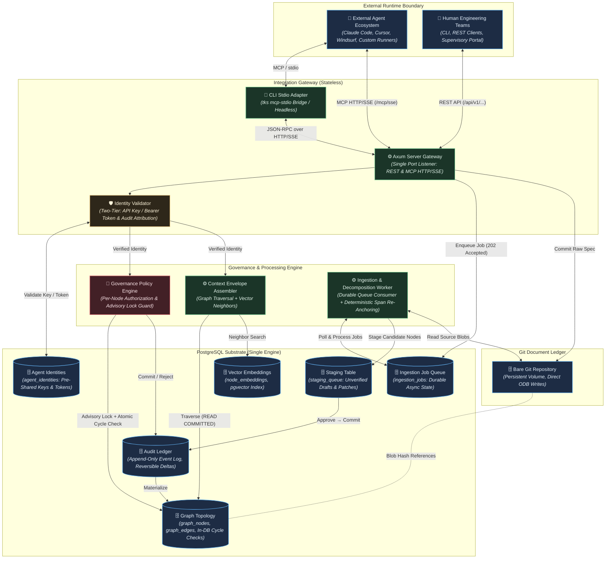

# TKS (The Knowledge Substrate): Architecture

## 1. Context & Drivers

The Knowledge Substrate (TKS) is a purpose-built requirement-intent provenance substrate
that anchors external AI agents and human engineering teams to a unified, version-governed
property graph. This architecture addresses three structural failure modes in agentic
software engineering: context window collapse (code-level context blindness to intent),
specification drift (decoupled documentation), and the monolithic diff dilemma (unscalable
human review of agent-generated output).

The architecture is shaped by the following drivers extracted from the governing vision
and strategic backlog:

| ID | Driver | Source |
| :--- | :--- | :--- |
| DR-1 | Unified graph-relational substrate combining property graph topology, vector embeddings, and relational audit in a single PostgreSQL engine | vision.md §2 Key Capabilities (1) |
| DR-2 | Document provenance and assisted decomposition: Git-backed content-addressed document store with LLM-assisted extraction and human review gates | vision.md §2 Key Capabilities (2) |
| DR-3 | Agent-agnostic integration via MCP and REST: stateless protocol gateway for context retrieval and governed mutation | vision.md §2 Key Capabilities (3) |
| DR-4 | Immutable audit ledger with complete historical reversibility and point-in-time reconstruction | vision.md §2 Key Capabilities (4) |
| DR-5 | Per-node governance: attribute-based authorization controlling autonomous elaboration vs. human gating | vision.md §2 Key Capabilities (5) |
| DR-6 | Self-referential bootstrapping: the substrate manages its own development lifecycle post-Phase 1 | vision.md §2 Key Capabilities (6) |
| DR-7 | Resource-constrained execution model: phased delivery achievable by solo developer or small team on commodity infrastructure | vision.md §3, backlog §1 |
| DR-8 | Sub-second micro-reflex graph traversal latency (<50 ms for k≤3 hops) at the operational hot path | vision.md §2 Operational Timescales, backlog §6 SLA-1 |
| DR-9 | Externalized cognitive compute: the substrate never invokes LLM inference internally; agents supply their own models | vision.md §3 |
| DR-10 | Phased hypothesis de-risking: lightweight spikes validate foundational premises (H-1, H-4) before infrastructure commitment | backlog §2 Phase 0, §5 Spike 0 |

## 2. Constraints

### 2.1 Project Initiator Constraints

> None supplied.

### 2.2 Derived Constraints

| ID | Constraint | Source |
| :--- | :--- | :--- |
| C-1 | Pure Rust package repository: all substrate service code is authored in Rust (edition 2024), built via Cargo stable toolchain | GEMINI.md (project guidelines) |
| C-2 | Single PostgreSQL engine: all topology data, vector embeddings (`pgvector`), relational metadata, and audit records reside in one PostgreSQL instance; no external graph or vector databases | vision.md §3 |
| C-3 | Stateless gateway boundary: MCP and REST interfaces maintain no persistent session memory; every operation is an authenticated, isolated transaction | vision.md §3 |
| C-4 | Document immutability: uploaded text specifications are stored in a Git-backed repository and content-addressed via cryptographic hashes; spans reference immutable blob identities | vision.md §3 |
| C-5 | Schema flexibility via progressive JSONB layering: core tables enforce foundational structural edges and typed invariants; domain-specific attributes use typed JSONB fields | vision.md §3 |
| C-6 | Bootstrap boundary: Phase 0 and Phase 1 use conventional tooling; from Phase 1 completion onward all requirements, decisions, and tasks must be tracked within the substrate | vision.md §3 |
| C-7 | No in-database agent execution: the substrate never runs autonomous agent cognitive loops internally | vision.md §3, Invariant I-3 |
| C-8 | LLM interaction restricted to human-directed document ingestion and decomposition pipelines only | vision.md §3 |
| C-9 | Phase 0 and Phase 1 must be achievable on commodity infrastructure by a single developer or small team | vision.md §3, backlog §1 |
| C-10 | Dependency policy: prefer well-established Rust crates; avoid dependencies for functionality small enough to implement with the standard library | GEMINI.md |

## 3. Architectural Invariants

| ID | Invariant | Rationale | Verification |
| :--- | :--- | :--- | :--- |
| INV-1 | Every functional specification, implementation task, and code artifact reference must maintain a valid directed edge path terminating at an authorized requirement node. Orphan execution tasks must be rejected at the database constraint level. | Ensures end-to-end traceability from vision to code; prevents unanchored agent-generated artifacts from accumulating. | PostgreSQL `CONSTRAINT TRIGGER ... DEFERRABLE INITIALLY DEFERRED` evaluated at transaction `COMMIT` time or atomic transactional insertion statements/CTEs validate ancestor path existence, eliminating insertion-order deadlock while preventing unanchored task commits. Integration test: attempt to commit orphan task node without valid requirement path → expect transaction rollback. |
| INV-2 | Destructive in-place updates (`UPDATE`, `DELETE`) on requirements, specifications, and topological edges must not occur. All state transitions must be recorded as discrete, reversible audit events enabling full point-in-time reconstruction. | Guarantees complete auditability and historical reversibility without data loss; supports clean rollback of agent mutation batches. | Audit ledger row count monotonically increases. All rollbacks and state updates append compensating `REVERT` events to `audit_ledger`. Integration test: mutate a node, query historical snapshot at prior timestamp → expect original state. |
| INV-3 | The core database engine and gateway services must never execute autonomous agent cognitive loops internally. The substrate must function strictly as a deterministic state store and protocol gateway. | Preserves operational determinism; prevents uncontrolled LLM invocations within the trusted storage boundary; keeps cognitive compute externalized and auditable. | Code review gate: no LLM client invocations in gateway or storage crate modules. CI lint rule scanning for prohibited dependency imports. |
| INV-4 | Every requirement derived via the decomposition pipeline must store a persistent cryptographic reference (Git commit/blob hash) and source span coordinates (`char_start`, `char_end`) pointing to the original document artifact. | Enables independent verification of requirement provenance against immutable source text; anchors extracted semantics to deterministic byte ranges. | Integration test: for each extracted requirement node, resolve Git blob hash and verify that `source_text[char_start..char_end]` matches the stored requirement verbatim text. |
| INV-5 | Permissions to alter or elaborate a graph node must be governed by explicit per-node `governance_policy` metadata attributes (`AUTONOMOUS_ELABORATION`, `HUMAN_REVIEW_REQUIRED`, `LOCKED`). Node-level policies must take absolute precedence over global agent roles. | Provides granular, progressive delegation of autonomy; prevents agents from modifying safety-critical requirements without human authorization. | Integration test: agent attempts mutation on `LOCKED` node → expect rejection; agent mutates `AUTONOMOUS_ELABORATION` node → expect commit; agent mutates `HUMAN_REVIEW_REQUIRED` node → expect staging. |
| INV-6 | Once foundational ingestion and context retrieval are operational (post-Phase 1), all new feature requirements, architectural adjustments, and development tasks must be authored, reviewed, and tracked within the substrate itself. | Self-referential dogfooding exposes UX friction early; establishes a closed feedback loop validating the substrate's own utility. | Dogfooding gate audit: post-Phase 1 requirements and tasks exist as graph nodes with valid provenance; manual spot-check during milestone reviews. |
| INV-7 | Every mutation submitted through the Integration Gateway must be attributable to a verified external identity (human user or agent instance). Identity credentials must be recorded in the audit ledger alongside mutation events. No mutation may be committed without a verified identity reference. | Non-negotiable audit requirement; enables forensic tracing of any graph change to its originator; supports blast-radius containment for compromised agents. | Two-tier authentication: For Phase 1–2, agents authenticate via pre-shared API keys or HMAC bearer tokens mapped to `agent_identities`; stdio passes credentials via process environment variables (`TKS_AGENT_ID`, `TKS_AUTH_TOKEN`) or tool payload `auth` fields; HTTP/SSE uses `Authorization: Bearer <token>`. Audit ledger schema enforces NOT NULL on `actor_id`, `actor_type`, and `token_fingerprint`. Integration test: submit mutation without auth credentials → expect rejection. |

## 4. Component Topology



### Component Responsibilities & Boundaries

| Component | Responsibility | Owns State | Depends On |
| :--- | :--- | :--- | :--- |
| Axum Server Gateway | Single unified HTTP service hosting REST endpoints (`/api/v1/...`) and MCP over HTTP/SSE (`/mcp/sse`, `/mcp/messages`) on a single port; handles request lifecycle and streaming | No (stateless) | Identity Validator, Governance Engine, Envelope Assembler, Ingestion Job Queue |
| CLI Stdio Adapter (`tks mcp-stdio`) | Subcommand bridging standard input/output JSON-RPC to the running Axum daemon via HTTP/SSE, or executing in isolated headless stdio mode without binding network ports | No (stateless) | Axum Server Gateway (when proxying) or internal domain handlers |
| Identity Validator | Validates inbound credentials (pre-shared API keys or HMAC bearer tokens against `agent_identities` table for Phase 1–2; OAuth 2.1 in Phase 4); extracts verified caller claims; enforces INV-7 | No (stateless cache only) | Agent Identities table (`agent_identities`) |
| Governance Policy Engine | Evaluates per-node `governance_policy` columns; acquires transaction advisory lock (`pg_advisory_xact_lock`); triggers in-database DAG cycle validation; routes mutations to commit, staging, or rejection | No (reads node metadata) | Graph Topology (PostgreSQL), Audit Ledger |
| Context Envelope Assembler | Executes directed k-hop recursive CTE graph traversals and pgvector neighbor searches under `READ COMMITTED`; assembles bounded context envelopes for external agents | No (read-only queries) | Graph Topology, Vector Embeddings |
| Decomposition Pipeline & Worker | Durable background worker consuming `ingestion_jobs`; orchestrates LLM-assisted requirement extraction; executes deterministic character span re-anchoring; writes draft nodes to `staging_queue` | No (stateless worker) | Ingestion Job Queue, Bare Git Repository, Staging Table, external LLM API |
| Graph Topology (PostgreSQL) | Stores `graph_nodes` and `graph_edges` with strongly typed columns (`node_type`, `lifecycle_state`, `governance_policy`); executes transactional DAG cycle checks | Yes: canonical graph state | PostgreSQL engine |
| Vector Embeddings (pgvector) | Stores dense vector representations of graph nodes (`node_embeddings`) for similarity-based neighbor lookup | Yes: embedding vectors | Graph Topology (node identity) |
| Audit Ledger (PostgreSQL) | Append-only event log recording every node/edge mutation with actor identity, timestamp, and reversible delta payload | Yes: immutable event stream | PostgreSQL engine |
| Staging Table (PostgreSQL) | Quarantine table (`staging_queue`) holding draft decomposition candidates and review-gated agent mutations awaiting human approval | Yes: staging state | PostgreSQL engine |
| Ingestion Job Queue (PostgreSQL) | Durable queue (`ingestion_jobs`) tracking asynchronous document decomposition tasks and statuses (`QUEUED`, `PROCESSING`, `COMPLETED`, `FAILED`) | Yes: job state | PostgreSQL engine |
| Agent Identities (PostgreSQL) | Table (`agent_identities`) storing authorized agent instances, pre-shared token hashes/HMAC credentials, and active status | Yes: identity records | PostgreSQL engine |
| Git Document Ledger | Content-addressed bare Git repository storing raw Markdown/text specification documents; provides commit SHA and blob hash references | Yes: document artifacts | Dedicated persistent filesystem volume |

### Deployment & Process Model

The deployment model targets a robust single-host configuration suitable for the constrained resource model (solo developer / small team):

- **Single Rust binary** compiled from the `tks` crate:
  - Default server mode (`tks serve`): Runs the unified `Axum` HTTP service hosting both REST endpoints and MCP over HTTP/SSE on the configured port (default `:8080`), along with background worker loops for `ingestion_jobs`.
  - Dedicated CLI stdio adapter (`tks mcp-stdio`): Invoked by external agent harnesses (Claude Code, Cursor, Windsurf) as a child process. Acts as a lightweight proxy streaming JSON-RPC to the running Axum daemon over HTTP/SSE, or executes in an isolated headless stdio mode that does NOT bind the HTTP port, avoiding `EADDRINUSE` port collisions.
  - Diagnostic logging: `tracing-subscriber` is explicitly configured to write all logs and diagnostic traces strictly to `stderr`. `stdout` is exclusively reserved for valid JSON-RPC framing when operating in stdio mode.
- **PostgreSQL instance** (with `pgvector` extension) runs as a separate process or container, accessed via connection pooling (`deadpool-postgres`).
- **Bare Git repository** (`git init --bare`) resides on a dedicated, persistent filesystem volume co-located with PostgreSQL storage, accessed via `git2` using low-level object-database (ODB) writes.
- A standard `docker-compose.yml` provisions PostgreSQL with `pgvector` and mounts persistent volumes for PostgreSQL data and the bare Git repository.

## 5. Data & State Model

### 5.1 State Ownership

| State | Owner | Storage | Consistency | Lifecycle |
| :--- | :--- | :--- | :--- | :--- |
| Graph nodes | Graph Topology | PostgreSQL `graph_nodes` table (`id`, `node_type`, `title`, `content`, `lifecycle_state`, `governance_policy`, `attributes JSONB`) | Strong (ACID transactions) | Created via staging approval → `ACTIVE` → `SUPERSEDED`, `ARCHIVED`, or `NEEDS_REVERIFICATION` |
| Structural edges | Graph Topology | PostgreSQL `graph_edges` table (`from_node_id`, `to_node_id`, `edge_type`) | Strong (ACID, deferred FK constraints, in-DB cycle checks) | Created alongside node approval; never deleted (INV-2), only superseded or marked inactive |
| Source span references | Graph Topology | PostgreSQL `source_spans` table (`doc_hash`, `char_start`, `char_end`) | Strong (immutable after creation; pinned to Git blob hash) | Created during decomposition; re-anchored on document revision |
| Vector embeddings | Vector Index | PostgreSQL `node_embeddings` table (`pgvector`) | Eventually consistent (regenerated on node content change) | Created on node approval; updated if node text is revised |
| Governance policy | Graph Topology | Strongly typed column on `graph_nodes` (`VARCHAR` with `CHECK` constraint: `AUTONOMOUS_ELABORATION`, `HUMAN_REVIEW_REQUIRED`, `LOCKED`) | Strong (per-node, indexed, checked at mutation time) | Set at node creation; updated by human administrator only |
| Node lifecycle state | Graph Topology | Strongly typed column on `graph_nodes` (`VARCHAR` with `CHECK` constraint: `ACTIVE`, `SUPERSEDED`, `ARCHIVED`, `NEEDS_REVERIFICATION`) | Strong (indexed, evaluated during recursive CTE traversals) | `ACTIVE` at creation; transitions managed by governance engine or dependency sweep |
| Audit events | Audit Ledger | PostgreSQL `audit_ledger` table | Strong (append-only, NOT NULL actor and token constraints) | Created on every mutation; never modified or deleted |
| Staged mutations | Staging Table | PostgreSQL `staging_queue` table (`staged_id`, `target_node_id`, `mutation_type`, `payload JSONB`, `actor_id`, `created_at`) | Strong (transactional) | Created by decomposition pipeline or governance routing → approved/rejected → archived |
| Ingestion jobs | Ingestion Pipeline | PostgreSQL `ingestion_jobs` table (`job_id`, `document_hash`, `status`, `error_message`, `retry_count`, `created_at`, `updated_at`) | Strong (transactional state machine) | Created on `POST /documents/ingest` (`QUEUED`) → `PROCESSING` → `COMPLETED` or `FAILED` |
| Agent identities | Identity Validator | PostgreSQL `agent_identities` table (`agent_id`, `token_hash`, `actor_type`, `is_active`, `created_at`) | Strong (ACID) | Provisioned by administrator → active → revoked |
| Document artifacts | Git Document Ledger | Bare Git repository on persistent volume (blobs, trees, commits) | Strong (content-addressed, cryptographic integrity) | Ingested via REST API → committed to bare Git ODB → immutable blob referenced by hash |

#### Entity Typing and Relational Constraints

The primary entity table is `graph_nodes` (renamed from `requirement_nodes` per LD-9). It incorporates a mandatory typed discriminator column `node_type VARCHAR NOT NULL` governed by a PostgreSQL `CHECK` constraint:

```sql
CHECK (node_type IN ('REQUIREMENT', 'SPECIFICATION', 'TASK', 'VERIFICATION', 'DECISION'))
```

Structural edges in `graph_edges` enforce endpoint validity rules via foreign keys and deferred validation triggers:

- `FULFILLS` edges must originate at `TASK` or `SPECIFICATION` nodes and terminate at `SPECIFICATION` or `REQUIREMENT` nodes.
- `CONSTRAINED_BY` edges must connect nodes of compatible governance hierarchy.
- `VERIFIED_BY` edges connect `VERIFICATION` nodes to `SPECIFICATION` or `TASK` nodes.

#### Rollback Cascade Mechanics & Blast-Radius Containment

Rollback operations (`revert_mutation_batch`, `revert_agent_session`) adhere to the following protocol (addressing LD-4):

1. **Non-Destructive Event Reversal:** Rollbacks never physically delete rows (`DELETE`) or mutate existing audit ledger entries. The engine computes inverse deltas and appends explicit compensating `REVERT` event records to `audit_ledger`.
2. **State Transition to `SUPERSEDED` / `REVERTED`:** Targeted live nodes transition their `lifecycle_state` column to `SUPERSEDED` or `REVERTED`.
3. **Automated Dependency Sweep:** If a reverted node has active downstream children (e.g., child tasks attached to a reverted specification), the engine executes an automated dependency sweep: dependent child nodes recursively transition their `lifecycle_state` to `NEEDS_REVERIFICATION` rather than triggering foreign key constraint failures or leaving orphaned records.
4. **Blast-Radius Confirmation:** If cross-agent dependent tasks exist on a node targeted for rollback, the administrative interface requires explicit confirmation flags (`--cascade-invalidation` or `--force`) displaying the affected topological subgraph before applying the compensating transaction.

### 5.2 Concurrency Model

- **Async runtime:** The Rust binary executes on the multi-threaded `tokio` runtime.
- **Connection pooling:** `deadpool-postgres` provides bounded database connection concurrency.
- **Transaction Isolation & Advisory Locking:** Blanket `SERIALIZABLE` isolation is eliminated to prevent `SIREAD` lock escalation and catastrophic `40001 serialization_failure` abort cascades during recursive CTE graph traversals (addressing LD-3). The concurrency model operates as follows:
  - **Read Queries:** Context envelope assembly and status queries execute under standard PostgreSQL `READ COMMITTED` isolation. They acquire no table or row locks, running concurrently at maximum throughput to guarantee the sub-50ms latency objective (SLA-1).
  - **Topological Mutations & Cycle Checks:** Structural graph mutations (`propose_node_mutation`, edge creation, deletions/reversions) execute under `READ COMMITTED` paired with transaction-scoped PostgreSQL advisory locks:

    ```sql
    SELECT pg_advisory_xact_lock(hashtext('tks_graph_mutation'));
    ```

    For partitioned subgraphs, locking can be fine-grained using the root requirement node ID hash. Within the advisory-locked transaction, the mutation is staged, an in-database recursive CTE cycle check runs against `graph_edges`, and the audit record and node states commit atomically.
- **Durable Async Ingestion:** Ingestion operations are decoupled from client HTTP request lifecycles via the `ingestion_jobs` queue. Ingestion requests insert a job record in the database within a transaction and return immediately. A persistent worker loop claims jobs with row-level locks (`FOR UPDATE SKIP LOCKED`), executing LLM decomposition and deterministic span re-anchoring with exponential retry backoff.
- **Bare Git ODB Writes:** Git operations are performed against a bare Git repository using direct low-level object-database (ODB) writes, bypassing the working tree and `.git/index` to prevent `.git/index.lock` contention.

## 6. Interfaces & Contracts

| Interface | Producer → Consumer | Protocol / Format | Failure Semantics | Versioning |
| :--- | :--- | :--- | :--- | :--- |
| `get_context_envelope` | MCP Server (Axum HTTP/SSE or CLI stdio) → External Agent | MCP JSON-RPC | Returns structured error on invalid `node_id` or traversal failure; per-request timeout enforced at gateway | Tool schema versioned; additive-only |
| `propose_node_mutation` | External Agent → MCP Server → Governance Engine | MCP JSON-RPC; credentials via env (`TKS_AGENT_ID`/`TKS_AUTH_TOKEN`), payload `auth`, or HTTP Bearer | Returns `COMMITTED`, `PENDING_REVIEW`, or error (`ERR_GRAPH_CYCLE_DETECTED`, `ERR_GOVERNANCE_REJECTED`, `ERR_AUTH_FAILED`); atomic transaction | Tool schema versioned; additive-only |
| `query_requirements` | MCP Server → External Agent | MCP JSON-RPC | Returns empty result set on no match; error on malformed query | Tool schema versioned |
| `get_document_span` | MCP Server → External Agent | MCP JSON-RPC | Error if blob hash not found or span out of range | Tool schema versioned |
| `revert_mutation_batch` | Admin (CLI or REST) → Audit Ledger | MCP JSON-RPC or REST JSON | Atomic compensating transaction; executes dependency sweep marking active children as `NEEDS_REVERIFICATION`; error if batch already reverted | Tool schema versioned |
| `revert_agent_session` | Admin (REST) → Audit Ledger | REST HTTP/JSON (`POST /api/v1/admin/revert-session`) | Atomic compensating rollback of mutations from `agent_instance_id` since timestamp; marks dependent children `NEEDS_REVERIFICATION` | URL path versioned (`/api/v1/...`) |
| Document Ingestion | Human/CLI → REST API → Ingestion Job Queue | REST HTTP/JSON (`POST /api/v1/documents/ingest`) | Synchronous bare Git commit; inserts job into `ingestion_jobs`; returns `202 Accepted` with `job_id`; idempotent on duplicate blob hash | URL path versioned |
| Ingestion Job Polling | Human/CLI → REST API → Ingestion Pipeline | REST HTTP/JSON (`GET /api/v1/documents/ingest/{job_id}`) | Returns JSON object with job status (`QUEUED`, `PROCESSING`, `COMPLETED`, `FAILED`), error details, and staged node IDs | URL path versioned |
| Staging Approval | Human → REST API → Audit Ledger | REST HTTP/JSON (`POST /api/v1/staging/approve`) | Atomic transaction: staged nodes committed to `audit_ledger` and materialized to `graph_nodes`; removes entry from `staging_queue` | URL path versioned |
| PostgreSQL wire protocol | Rust process → PostgreSQL | TCP / `libpq` wire protocol | Connection pool retry with exponential backoff on transient connection failures; query timeout enforced | PostgreSQL version compatibility managed via migration tooling |
| Git operations | Rust process → Git repository | `libgit2` (via `git2` crate) | Direct ODB writes; error propagated on filesystem or object-store corruption | Git object model (content-addressed, stable) |

### Failure Semantics Summary

- **Idempotency:** Document ingestion is idempotent on blob hash (identical content yields identical Git blob SHA and attaches to existing ingestion record). Mutation proposals are not idempotent (each submission creates a distinct audit event).
- **Retry Policy:** Transient PostgreSQL connection failures are retried with exponential backoff at the pool level. Advisory locks serialize mutations, avoiding serialization failures. Ingestion worker tasks retry with bounded exponential backoff up to 3 times before transitioning job status to `FAILED` with diagnostic error capture.
- **Timeout Policy:** Gateway enforces a per-request timeout (default 30s) on HTTP/SSE and REST endpoints. Background ingestion decomposition jobs enforce a 180s timeout before flagging the job for retry.

## 7. Technology Stack

| Concern | Selection | Rationale | Alternatives Considered |
| :--- | :--- | :--- | :--- |
| Primary language | Rust (edition 2024, stable toolchain) | Project mandate (GEMINI.md); memory safety, zero-cost abstractions, single-binary distribution | N/A (constrained) |
| Async runtime | `tokio` | De facto standard Rust async runtime; mature multi-threaded work-stealing scheduler | `async-std` (smaller ecosystem) |
| HTTP & Gateway framework | `axum` | Unifies REST API and MCP HTTP/SSE transport on a single port; Tower middleware for auth, tracing, compression (see D-7) | `actix-web` (actor model unnecessary), separate server binaries (rejected; see LD-1, LD-12) |
| CLI & Stdio integration | `clap` + custom stdio JSON-RPC adapter (`tks mcp-stdio`) | Provides dedicated CLI subcommand for stdio MCP sessions; isolates stdio from network port binding; logs strictly to `stderr` | Running stdio server concurrently in same process with HTTP listener (rejected; causes port collisions; see LD-1) |
| PostgreSQL client | `tokio-postgres` + `deadpool-postgres` | Async native driver; connection pooling; direct SQL control over recursive CTEs and advisory locking | `sqlx` (compile-time query checking adds CI complexity; see D-3), `diesel` (sync, ORM overhead) |
| Database migrations | `refinery` or `sqlx-cli` (offline mode) | Lightweight, file-based SQL migration runner compatible with Rust build pipeline | Custom migration scripts (fragile) |
| Vector embeddings | `pgvector` (PostgreSQL extension) | Single-engine constraint (C-2); proven HNSW/IVFFlat indexing for approximate nearest neighbor search | Dedicated vector DB (prohibited by C-2) |
| Graph query strategy | Recursive CTEs (`WITH RECURSIVE`) on adjacency tables under `READ COMMITTED` | Zero external dependencies; runs on vanilla PostgreSQL; fully ACID-compliant; meets SLA-1 (<50ms for k≤3 hops) when paired with typed column indexes | Apache AGE (see D-2), native SQL/PGQ (unavailable until PG 20+) |
| Graph mutation concurrency | `READ COMMITTED` with `pg_advisory_xact_lock` | Eliminates SSI `SIREAD` lock escalation and 40001 abort cascades while guaranteeing serialization of structural changes (see D-8) | `SERIALIZABLE` isolation (rejected; causes abort cascades; see LD-3) |
| Git integration | `git2` crate (libgit2 bindings) against bare repository | In-process Git operations without shelling out; direct ODB writes bypass `.git/index.lock` contention; persistent volume co-located with PostgreSQL (see TB-1) | `gitoxide` (pure Rust, less mature), CLI `git` subprocess (fragile) |
| Serialization | `serde` + `serde_json` | Standard Rust serialization framework; zero-cost abstraction; universal ecosystem support | N/A (de facto standard) |
| Observability | `tracing` + `tracing-subscriber` | Structured logging with span context; explicitly configured to output strictly to `stderr`, preserving `stdout` for JSON-RPC framing | `log` + `env_logger` (less structured) |
| Testing | `cargo test` (unit + integration), `cargo clippy`, `cargo fmt` | Standard Rust validation pipeline per GEMINI.md | External test frameworks (unnecessary complexity) |

## 8. Operational Model

- **Build & Deploy:**
  - Built from repository root via `cargo build --release`, producing a single static binary.
  - The binary provides two operational entry points:
    - `tks serve`: Launches the server gateway (Axum REST API + MCP HTTP/SSE listener) and the ingestion queue worker.
    - `tks mcp-stdio`: Lightweight CLI subcommand launched by external agent harnesses for stdio JSON-RPC sessions (proxies to `tks serve` or runs in headless local mode without network binding).
  - CI pipeline: `cargo fmt --check` → `cargo clippy --all-targets --all-features -- -D warnings` → `cargo test` → `cargo build --release`.
  - Deployment configuration: `docker-compose.yml` provisions PostgreSQL with `pgvector` and mounts two persistent volumes: `pg_data` for relational/vector state and `git_storage` for the bare Git document repository.
  - Database schema applied via migration tool on startup or via `tks migrate`.

- **Observability:**
  - Structured JSON logs via `tracing` with span context (request ID, actor ID, operation type).
  - Logging stream isolation: All logging outputs write strictly to `stderr`. `stdout` is dedicated exclusively to JSON-RPC protocol messages.
  - Key operational metrics emitted: recursive CTE traversal latency, context envelope assembly duration, advisory lock wait time, ingestion job duration and queue depth, connection pool utilization.
  - Health endpoint (`GET /health`) returning service status and PostgreSQL connectivity.

- **Failure & Recovery:**
  - PostgreSQL crash: Process restarts and initiates automatic WAL recovery. Connection pool detects failure and re-establishes connections with backoff.
  - Gateway / Worker crash: Stateless gateway design allows immediate container/process restart. Any in-progress ingestion job remains safely stored in `ingestion_jobs` as `PROCESSING` and is reclaimed by the worker upon restart via timeout detection.
  - Git repository recovery: Bare Git repository is recoverable from content-addressed object storage; `git fsck` verifies object integrity. Backup scripts synchronize PostgreSQL snapshots with Git bare repository snapshots.
  - Audit ledger integrity: Append-only design ensures historical events cannot be overwritten. Incomplete transactions are aborted by PostgreSQL.
  - Agent blast-radius containment: Reversion commands (`revert_mutation_batch`, `revert_agent_session`) record compensating inverse events and execute an automated dependency sweep transitioning affected child nodes to `NEEDS_REVERIFICATION`.

- **Upgrade & Migration:**
  - Schema evolution via ordered SQL migrations. Forward-compatible additions preferred; breaking DDL changes coordinated with application deployment.
  - API evolution: MCP tool schemas use additive-only evolution. REST API uses URL path versioning (`/api/v1/`, `/api/v2/`).

## 9. Decisions & Rejected Alternatives

### D-1: Single PostgreSQL engine for all state (graph, vectors, audit)

- **Status:** Accepted
- **Origin:** Baseline
- **Context:** The system requires graph topology storage, vector similarity search, and an append-only audit ledger. Distributing these across multiple database engines (e.g., Neo4j for graph, Pinecone for vectors, PostgreSQL for relational) would introduce distributed transaction failures, synchronization drift, and operational complexity incompatible with the constrained resource model.
- **Decision:** All state resides in a single PostgreSQL instance using recursive CTEs for graph queries, `pgvector` for vector indexing, and relational tables for the audit ledger.
- **Rationale:** Eliminates distributed transaction failures; leverages proven enterprise PostgreSQL tooling for backup, replication, security; honors the single-engine boundary contract from vision.md §3.
- **Reopen If:** Hypothesis H-3 is falsified (>500 ms latency at ≤10⁵ nodes despite index optimization), or PostgreSQL native SQL/PGQ support matures in PG 20+.

### D-2: Recursive CTEs over Apache AGE for graph queries

- **Status:** Accepted
- **Origin:** Baseline
- **Context:** Graph traversal is required for context envelope assembly (k-hop ancestor and sibling queries). Apache AGE provides rich Cypher syntax but is an external C extension with version-specific PostgreSQL compatibility (PG 19 support pending) and added deployment complexity.
- **Decision:** Use standard `WITH RECURSIVE` CTEs on a relational adjacency table (`graph_edges`) for all graph traversal operations.
- **Rationale:** Zero external dependencies; runs on vanilla PostgreSQL; fully ACID-compliant; adequate performance for k≤4 hop traversals at projected Phase 1–2 scale (≤10⁵ nodes); honors the "start small" and constrained resource model directives.
- **Reopen If:** Query complexity for multi-hop path matching becomes unmanageable in relational SQL; Apache AGE achieves stable PG 19+ support and community adoption justifies the deployment overhead; or native SQL/PGQ lands in PostgreSQL 20+.

### D-3: `tokio-postgres` over `sqlx` for database client

- **Status:** Accepted
- **Origin:** Baseline
- **Context:** Both `tokio-postgres` and `sqlx` are mature async PostgreSQL drivers. `sqlx` provides compile-time query verification but requires a live database connection during `cargo build` (or offline mode with cached query metadata), adding CI complexity.
- **Decision:** Use `tokio-postgres` with `deadpool-postgres` for connection pooling. Queries are verified by integration tests rather than compile-time checking.
- **Rationale:** Simpler build pipeline; no database dependency during compilation; direct SQL control for optimizing recursive CTE and pgvector queries; connection pooling via `deadpool-postgres` is well-proven.
- **Reopen If:** Query correctness bugs become a recurring issue that compile-time checking would prevent; `sqlx` offline mode matures to require zero live-database build dependency.

### D-4: Append-only event ledger for state versioning (over bitemporality)

- **Status:** Accepted
- **Origin:** Baseline
- **Context:** Invariant INV-2 requires auditability, reversibility, and point-in-time reconstruction. Three approaches were evaluated: append-only event ledger with materialized current state, system-versioned temporal tables, and full bitemporal property graph.
- **Decision:** Adopt the append-only event ledger pattern. Mutations write an immutable event record to `audit_ledger`; live graph tables maintain the current snapshot, updated within the same transaction.
- **Rationale:** Conceptual simplicity; fast read performance on current graph; straightforward rollback via inverse events; honors "start small" directive; full bitemporality introduces severe query complexity disproportionate to Phase 1–2 needs.
- **Reopen If:** Requirements emerge for retrospective corrections with separate "asserted at" vs. "effective at" semantics; regulatory compliance mandates full bitemporal audit trails.

### D-5: Rust MCP server (custom implementation) over community SDK

- **Status:** Accepted
- **Origin:** Baseline
- **Context:** The MCP specification defines a JSON-RPC protocol. At baseline, no established, production-quality Rust MCP SDK exists.
- **Decision:** Implement a custom MCP protocol layer in Rust, handling JSON-RPC message framing, tool dispatch, and HTTP/SSE / stdio transports directly.
- **Rationale:** MCP's JSON-RPC protocol is straightforward to implement; avoids dependency on immature community crates; provides full control over tool schema evolution and error handling.
- **Reopen If:** A well-maintained, specification-compliant Rust MCP SDK reaches production maturity (see Q-3).

### D-6: `git2` (libgit2) for Git integration over `gitoxide`

- **Status:** Accepted
- **Origin:** Baseline
- **Context:** Git integration is required for content-addressed document storage. `git2` (Rust bindings to libgit2) is mature and widely used. `gitoxide` is a pure-Rust Git implementation under active development.
- **Decision:** Use `git2` for all Git operations (commit, blob hash, object database writes).
- **Rationale:** Mature, battle-tested C library with stable Rust bindings; supports direct ODB writes; extensive documentation and community usage.
- **Reopen If:** `gitoxide` reaches API stability and feature parity for required operations; `libgit2` C dependency causes cross-compilation or packaging issues.

### D-7: Unified Axum Gateway (REST + MCP HTTP/SSE) with CLI Stdio Subcommand

- **Status:** Accepted
- **Origin:** LD-1, LD-12, iteration 1
- **Context:** Concurrently running an MCP stdio server and a REST HTTP listener in the same process causes immediate `EADDRINUSE` port collisions when multiple agent child processes launch, prevents external agents from attaching to containerized daemons, and risks corrupting JSON-RPC framing with stdout diagnostic logs.
- **Decision:** Consolidate the server gateway into a single unified `Axum` HTTP service hosting REST endpoints (`/api/v1/...`) and MCP over HTTP/SSE (`/mcp/sse`, `/mcp/messages`) on a single port. Local agent integration via stdio is provided by a dedicated CLI subcommand (`tks mcp-stdio`) that either proxies JSON-RPC over HTTP/SSE to the daemon or executes in a headless stdio mode without binding network ports. All diagnostic logging is routed strictly to `stderr`.
- **Rationale:** Eliminates port binding collisions across agent sessions; enables multi-agent remote concurrency over standard HTTP/SSE; keeps JSON-RPC protocol framing pure on `stdout`.
- **Reopen If:** Standard MCP specifications deprecate HTTP/SSE in favor of another transport protocol.

### D-8: Transaction-Scoped Advisory Locks under READ COMMITTED for Graph Mutations

- **Status:** Accepted
- **Origin:** LD-3, iteration 1
- **Context:** Running graph mutations and recursive CTE traversals under `SERIALIZABLE` or `REPEATABLE READ` transactions causes PostgreSQL Serializable Snapshot Isolation (SSI) to escalate `SIREAD` predicate locks across table pages, resulting in frequent `40001 serialization_failure` abort cascades under multi-agent workloads and violating SLA-1 (<50ms).
- **Decision:** Use PostgreSQL default `READ COMMITTED` isolation for all operations. For structural mutations and DAG cycle checks, acquire transaction-scoped PostgreSQL advisory locks (`pg_advisory_xact_lock`). Read-only context queries execute concurrently under `READ COMMITTED` without advisory locks or predicate locks.
- **Rationale:** Eliminates serialization abort cascades; guarantees deterministic mutation serialization and cycle prevention without database-wide lock escalation; allows concurrent read traversals to achieve sub-50ms latency.
- **Reopen If:** Distributed multi-node PostgreSQL clustering is adopted where local advisory locks are insufficient.

### D-9: Strongly Typed Discriminator and Lifecycle Columns on graph_nodes

- **Status:** Accepted
- **Origin:** LD-5, LD-9, iteration 1
- **Context:** Storing entity types, `lifecycle_state`, and `governance_policy` in untyped JSONB metadata on a generic `requirement_nodes` table introduces severe performance penalties during recursive CTE joins (JSON parsing overhead, inability to use B-tree index scans) and allows silent type errors.
- **Decision:** Rename `requirement_nodes` to `graph_nodes`. Promote `node_type`, `lifecycle_state`, and `governance_policy` to first-class, indexed SQL columns with PostgreSQL `CHECK` constraints. Reserve JSONB strictly for open-ended, domain-specific extensions.
- **Rationale:** Enables standard B-tree index scans on hot recursive graph queries to guarantee SLA-1 (<50ms); enforces database-level domain integrity and compile-time/schema-time validation.
- **Reopen If:** Entity classification requirements require dynamic user-defined taxonomies that cannot be represented with check-constrained relational columns.

### D-10: In-Database Transactional DAG Cycle Validation

- **Status:** Accepted
- **Origin:** LD-10, iteration 1
- **Context:** Depicting `DAGValidator` as an independent domain engine component outside the database transaction layer creates an artificial layer of indirection and risks race conditions where concurrent transactions commit cycles between application check and database write.
- **Decision:** Consolidate DAG cycle validation directly into the PostgreSQL storage transaction layer, executed via transactional recursive CTE queries or trigger logic within the same advisory-locked transaction as the edge write. Remove `DAGValidator` as a standalone component from topology diagrams and component tables.
- **Rationale:** Guarantees strict transactional atomicity; prevents TOCTOU cycle creation races; eliminates redundant architectural abstractions.
- **Reopen If:** Graph size exceeds recursive CTE performance thresholds and demands a dedicated in-memory graph index engine.

### D-11: Two-Tier Identity Model for Agent Attribution

- **Status:** Accepted
- **Origin:** LD-7, iteration 1
- **Context:** Mandating external OAuth 2.1 + DPoP workload identity federation for Phase 1 and Phase 2 creates an unworkable gap with stdio MCP transport (which lacks HTTP authorization headers), stalls implementation on open question Q-6, and over-engineers authentication for early phases.
- **Decision:** Implement a pragmatic two-tier identity architecture: For Phase 1 and 2, authenticate external agents via pre-shared cryptographic API keys or HMAC bearer tokens mapped to an `agent_identities` table in PostgreSQL. For stdio MCP sessions, credentials are passed via environment variables (`TKS_AGENT_ID`, `TKS_AUTH_TOKEN`) or tool payload `auth` fields; for HTTP/SSE and REST, via `Authorization: Bearer <token>`. In all cases, resolved identities are recorded in `audit_ledger` (enforcing INV-7). Defer external OAuth 2.1 / DPoP workload federation to Phase 4.
- **Rationale:** Fulfills Invariant INV-7 non-repudiation and identity attribution; provides full compatibility with local stdio agent harnesses; removes implementation blockers while establishing a clean migration path.
- **Reopen If:** Enterprise multi-tenant deployment demands federated single sign-on (SSO) before Phase 4.

### D-12: Durable Ingestion Job Queue and Polling API

- **Status:** Accepted
- **Origin:** LD-6, iteration 1
- **Context:** Decomposing large documents via LLMs and performing deterministic character span re-anchoring requires 15–90 seconds. Executing this synchronously or via unmanaged in-process tasks (`tokio::spawn`) leads to HTTP gateway timeouts, dropped tasks on server crashes/restarts, and no resumption capability.
- **Decision:** Implement a durable job queue table (`ingestion_jobs`) in PostgreSQL. The ingestion endpoint (`POST /api/v1/documents/ingest`) commits the raw text to Git, creates a queued job record within the transaction, and returns `202 Accepted` with a `job_id`. A persistent worker loop processes queued jobs with retry tracking and error capture. Clients and UI monitor progress via `GET /api/v1/documents/ingest/{job_id}`.
- **Rationale:** Guarantees job durability across service restarts; prevents HTTP request timeouts on large documents; provides complete observability into decomposition status.
- **Reopen If:** Document ingestion scale requires a dedicated distributed task queue (e.g., Celery, RabbitMQ) beyond single-instance PostgreSQL capabilities.

### D-13: Non-Destructive Rollback with Dependency Sweep to NEEDS_REVERIFICATION

- **Status:** Accepted
- **Origin:** LD-4, iteration 1
- **Context:** Administrative rollback utilities (`revert_mutation_batch`, `revert_agent_session`) previously lacked explicit cascade mechanics, creating risks of foreign key constraint deadlocks or orphaned tasks when parent nodes with active child tasks were reverted.
- **Decision:** Reversion operations are non-destructive (INV-2), appending compensating `REVERT` events to `audit_ledger` and transitioning live node states to `SUPERSEDED` or `REVERTED`. When a node with active dependent children is reverted, an automated dependency sweep recursively transitions dependent child nodes to `NEEDS_REVERIFICATION` rather than triggering foreign key failures or physical deletion. Reverting nodes with cross-agent dependencies requires explicit confirmation flags (`--cascade-invalidation` or `--force`).
- **Rationale:** Preserves Invariant INV-1 and INV-2 without operational deadlocks; prevents orphaned tasks from remaining active; establishes clear blast-radius containment for misbehaving agents.
- **Reopen If:** Graph traversal complexity for deep invalidation sweeps exceeds acceptable transaction limits.

### D-14: Consolidation of Staging Queue into Canonical Graph Topology

- **Status:** Rejected
- **Origin:** LD-11, iteration 1
- **Context:** Lead Developer finding LD-11 proposed eliminating `StagingTable` (`staging_queue`) and writing unverified decomposition drafts and review-gated agent mutations directly into `graph_nodes` and `graph_edges` with statuses `PENDING_STAGING` and `PENDING_REVIEW`, activating them via in-place `UPDATE ... SET status = 'ACTIVE'`.
- **Decision:** Reject the consolidation of the staging queue into `graph_nodes` and `graph_edges`. Retain `staging_queue` as a dedicated relational quarantine table for candidate extractions and agent mutation proposals pending human review.
- **Rationale:**
  1. *Violation of Invariant INV-2:* Activating candidate nodes via an in-place `UPDATE ... SET status = 'ACTIVE'` violates the core invariant that destructive in-place updates must not occur and that all state must be materialized from discrete, reversible audit events.
  2. *Entity Identity Collision on Existing Node Mutations:* Proposing a mutation to an existing active node (e.g., `REQ-005`) that requires human review cannot be written to `graph_nodes` without a primary key collision on `id = 'REQ-005'`, or destroying the currently active specification while review is pending. A separate candidate delta store is mathematically necessary.
  3. *Adjacency Table Pollution & SLA-1 Degradation:* LLM decomposition produces noisy extractions and invalid candidates that human reviewers reject. Inserting drafts directly into `graph_nodes` forces either hard deletion (violating INV-2) or indefinite accumulation of dead rejected rows, bloating B-tree indexes and recursive CTE joins on the hot path (threatening SLA-1 <50ms).
  4. *Relational Contamination:* Draft edges in `graph_edges` create topological paths that can be traversed, reference-locked, or depended upon before authorization, compromising Invariant INV-1.
  5. *Violation of Vision Boundary Contracts:* vision.md §2, §3, and §4 explicitly mandate that unverified candidates must pass human staging verification before being committed to the canonical graph and audit ledger.
- **Reopen If:** A unified append-only temporal graph model is implemented that cleanly separates candidate patch versions from active entity snapshots without table bloat or primary key collisions.

## 10. Risks & Spikes

| ID | Risk / Hypothesis | Impact | Spike | Pass Threshold | Fail Response |
| :--- | :--- | :--- | :--- | :--- | :--- |
| R-1 | H-1: Graph-bounded context envelopes may not significantly outperform competent multi-tool agentic retrieval (file read, grep, AST, semantic search) for preserving architectural invariants | High — foundational premise of TKS; failure invalidates the core value proposition | Spike 0 (Phase 0): In-memory graph with ~50–100 hand-curated requirement nodes; compare graph-bounded vs. agentic-baseline constraint violation rates across ≥20 synthetic coding tasks | ≥30% constraint violation reduction = strong greenlight; 15–29% = partial (refine envelope, narrow domain); ≤0% = H-1 falsified | ≤0%: Halt Phase 1 build; trigger strategic re-evaluation. 15–29%: Narrow target domain; refine envelope assembly before proceeding. |
| R-2 | H-4: Commodity LLMs may fail to extract atomic requirements with sufficient span precision from unstructured Markdown, even with deterministic re-anchoring | High — decomposition pipeline is the primary data ingestion path | Early Extraction Prompting Spike (Phase 0): Benchmark few-shot prompts against diverse Markdown structures; measure precision/recall on character spans against ground truth | ≥95% precision/recall on atomic requirement spans (CAL-H4); 80–94% with deterministic re-anchoring fallback acceptable | <60% precision/recall despite deterministic re-anchoring: decomposition pipeline premise is non-viable; explore structured-only input formats or manual extraction. |
| R-3 | H-3: Single PostgreSQL instance may not sustain <100 ms query latency at 10⁶ graph nodes for k-hop CTE traversals + pgvector searches | Medium — blocks enterprise scaling but not Phase 1–2 utility | Phase 2–3 benchmark: Load-test PostgreSQL with synthetic graph at 10⁵ and 10⁶ node scales; measure CTE traversal and vector search latencies under concurrent load | Sustained <100 ms at 10⁵ nodes (SLA-2); degradation acceptable at 10⁶ if index optimization and read-replica offloading resolve it | >500 ms at ≤10⁵ nodes despite optimization: single-engine constraint (C-2) must be revisited; evaluate Apache AGE or dedicated graph database. |
| R-4 | H-2: Graph-based supervisory review may not significantly reduce human oversight overhead compared to direct diff review | Medium — affects Phase 3+ supervisory portal value | Phase 3 user study: Compare review time for graph-based impact analysis vs. raw diff inspection across matched feature sets | ≥50% review time reduction (CAL-H2); 25–49% triggers UI workflow refinement | ≤0% reduction: supervisory portal premise is non-viable; pivot to diff-augmentation approach. |
| R-5 | PostgreSQL graph query strategy: recursive CTEs may become unwieldy for complex multi-hop path matching and constraint resolution | Medium — affects query maintainability and developer velocity | Spike 1 (Phase 0–1): Implement core envelope assembly queries using recursive CTEs; evaluate query complexity, maintainability, and latency vs. Apache AGE Cypher on the same schema | CTE queries remain maintainable and meet SLA-1 (<50 ms for k≤3 hops) | CTEs become unmanageable or fail SLA-1: re-evaluate Apache AGE or hybrid approach (D-2). |
| R-6 | Git-PostgreSQL coupling: span stability across document revisions may be brittle; diff-based re-anchoring may introduce drift | Medium — affects INV-4 provenance guarantee on document updates | Spike 3/4 (Phase 1): Implement span re-anchoring on a corpus of revised Markdown documents; measure re-anchoring accuracy | ≥95% of spans correctly re-anchored after document revision | <80% re-anchoring accuracy: pin requirements strictly to immutable blob hashes only; require re-decomposition on revision rather than span migration. |
| R-7 | MCP specification evolution: transport and authentication standardization across agent harnesses | Low — affects transport adapters, not core architecture | Spike 5/6 (Phase 1): Validate Axum-integrated MCP HTTP/SSE listener and CLI stdio bridge with Claude Code, Cursor, and Windsurf harnesses | Reliable JSON-RPC exchange over both stdio and HTTP/SSE transports without port collisions or framing corruption | Transport incompatibility: fallback to pure HTTP REST API proxy for local agent runners. |

## 11. Open Questions

| ID | Question | Blocking | Owner / Next Step |
| :--- | :--- | :--- | :--- |
| Q-1 | What specific PostgreSQL version should be targeted for Phase 1? PG 16/17/18 all support pgvector; PG 19 is current stable. Apache AGE compatibility is version-specific. | No (any PG 16+ suffices for CTE + pgvector baseline) | Resolve during Phase 0 scaffolding; default to latest stable PG with confirmed pgvector extension compatibility. |
| Q-2 | Should the Rust binary expose MCP over stdio only, or also support MCP over HTTP (SSE transport) for remote agent integration? | Resolved by D-7 | Axum hosts REST API and MCP over HTTP/SSE on a single port; local stdio is provided by CLI subcommand `tks mcp-stdio` (D-7). |
| Q-3 | Is there a maturing Rust MCP SDK (e.g., `mcp-rs`, `rmcp`) that could replace custom JSON-RPC implementation? | No (custom implementation is viable) | Monitor crate ecosystem during Phase 0–1; evaluate if a crate reaches 1.0 stability with MCP spec compliance. |
| Q-4 | What embedding model should be used for `pgvector` node embeddings? `text-embedding-3-small` (OpenAI) vs. open-source alternatives (e.g., `nomic-embed-text`, `all-MiniLM-L6-v2`). | No (embedding model is pluggable behind a trait boundary) | Evaluate during Spike 0 / Phase 1; embedding generation is externalized (not in the substrate hot path). |
| Q-5 | How should the decomposition pipeline invoke external LLM APIs? Direct HTTP calls to provider APIs vs. abstraction layer (e.g., `llm` crate, provider-agnostic SDK). | No (implementation detail for Phase 1) | Spike 4 evaluation; prefer thin HTTP client with provider-specific adapters behind a trait. |
| Q-6 | What is the precise OAuth 2.1 / DPoP token validation mechanism for the Identity Validator? Self-hosted JWKS endpoint, external IdP integration, or simpler API key scheme for Phase 1? | Resolved by D-11 | Adopted pragmatic two-tier model (D-11): pre-shared API keys or HMAC bearer tokens in `agent_identities` table for Phase 1–2; external OAuth 2.1 / DPoP federation deferred to Phase 4. |
| Q-7 | Should the `audit_ledger` use a separate PostgreSQL schema or tablespace for operational isolation from the live graph tables? | No (single schema sufficient for Phase 1) | Evaluate during Phase 2 if audit ledger growth impacts graph query performance. |
| Q-8 | What is the strategy for embedding regeneration when node content changes? Synchronous (within mutation transaction) vs. async (background job with eventual consistency)? | No (either approach is architecturally compatible) | Decide during Phase 1 implementation; async preferred to avoid mutation latency impact. |
