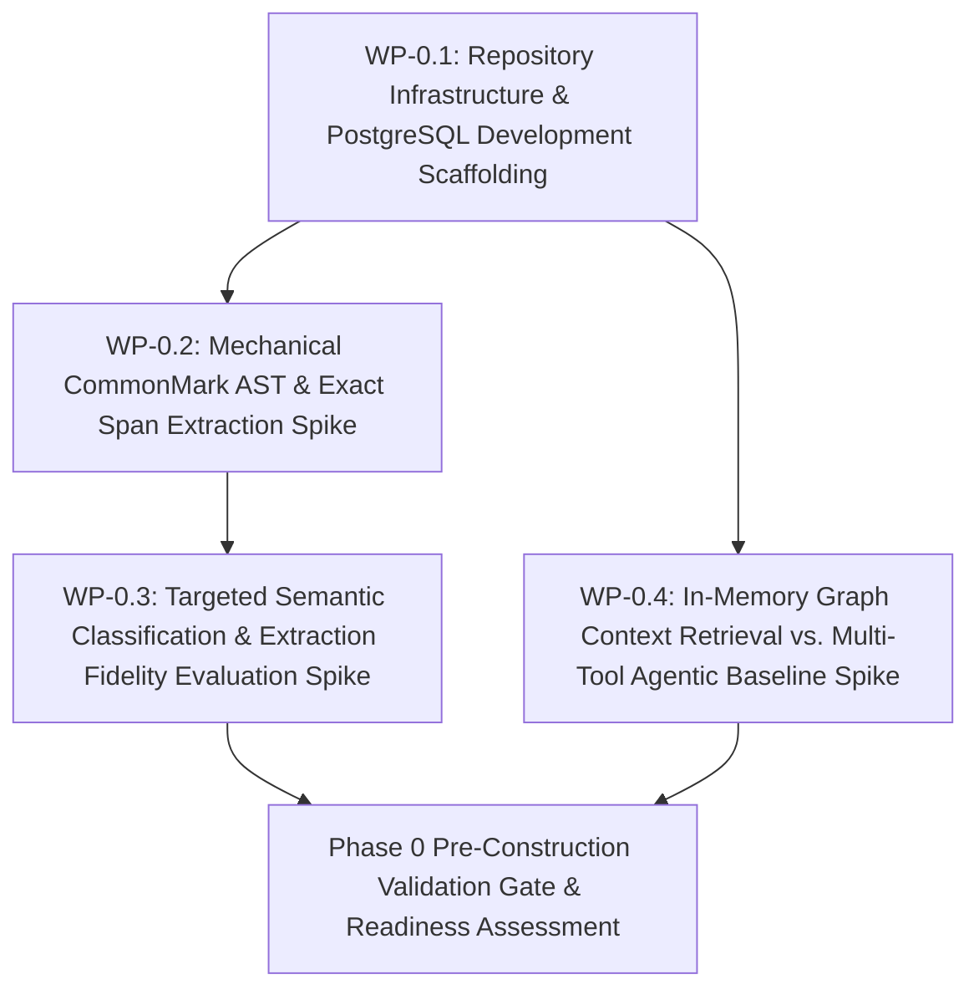

# Phase 0 Execution Plan: Pre-Construction Hypothesis De-risking & Prototype Spikes

## 1. Executive Summary & Deliverables Mapping

- **Primary Objective:** Empirically validate the foundational scientific premise (Hypothesis [H-1](file:///workspaces/tks/docs/vision/vision.md#L253)) and baseline assisted extraction feasibility (Hypothesis [H-4](file:///workspaces/tks/docs/vision/vision.md#L259)) using lightweight, throwaway prototypes before committing to Phase 1 infrastructure construction ([`strategic-planning-backlog.md` §2 Phase 0](file:///workspaces/tks/docs/vision/strategic-planning-backlog.md#L65)).
- **Target Gate / Milestone:** Pre-Construction Hypothesis Validation Gate ([CAL-H1](file:///workspaces/tks/docs/vision/strategic-planning-backlog.md#L343) $\ge 30\%$ violation reduction greenlight across $\ge 20$ controlled synthetic coding tasks; [CAL-H4](file:///workspaces/tks/docs/vision/strategic-planning-backlog.md#L346) $\ge 95\%$ span precision/recall with $\ge 80\%$ mechanical token reduction; containerized PostgreSQL with `pgvector` and embedded migration harness operational).

### Deliverable Traceability Matrix

| Core Deliverable (from Strategic Backlog §2) | Responsible Work Package(s) | Architecture / Technical References |
| :--- | :--- | :--- |
| **Spike 0 (H-1 Directional Validation Spike):** Rapid throwaway test comparing graph-bounded context retrieval against a competent multi-tool agentic retrieval baseline on an in-memory graph (~50–100 nodes), measuring constraint violation reduction across $\ge 20$ synthetic coding tasks | [WP-0.4](#wp-04-in-memory-graph-context-retrieval-vs-multi-tool-agentic-baseline-spike) | [`architecture.md` §1 DR-10](file:///workspaces/tks/docs/vision/architecture.md#L26), [§10 R-1](file:///workspaces/tks/docs/vision/architecture.md#L1133); [`vision.md` §5 H-1](file:///workspaces/tks/docs/vision/vision.md#L253), [§7 Kill #2](file:///workspaces/tks/docs/vision/vision.md#L359); [`strategic-planning-backlog.md` §5 Spike 0](file:///workspaces/tks/docs/vision/strategic-planning-backlog.md#L268), [§6 CAL-H1](file:///workspaces/tks/docs/vision/strategic-planning-backlog.md#L343) |
| **Early Extraction & AST Pre-Parsing Spike (H-4 Pre-Validation / TB-2):** Empirical benchmarking of mechanical CommonMark parsing (`pulldown-cmark`) paired with targeted commodity LLM classification prompts against representative technical Markdown specs to verify 0-based byte offsets, RFC 2119 keywords, canonical tags, and $\ge 80\%$ mechanical token reduction | [WP-0.2](#wp-02-mechanical-commonmark-ast-decomposition--exact-span-extraction-spike), [WP-0.3](#wp-03-targeted-semantic-classification--extraction-fidelity-evaluation-spike) | [`architecture.md` §1 DR-11](file:///workspaces/tks/docs/vision/architecture.md#L27), [§2 C-11](file:///workspaces/tks/docs/vision/architecture.md#L67), [§9 D-15](file:///workspaces/tks/docs/vision/architecture.md#L305), [§9 D-37](file:///workspaces/tks/docs/vision/architecture.md#L876), [§10 R-2](file:///workspaces/tks/docs/vision/architecture.md#L1134); [`technical-backlog.md` TB-2](file:///workspaces/tks/docs/vision/technical-backlog.md#L22), [TB-7](file:///workspaces/tks/docs/vision/technical-backlog.md#L112); [`vision.md` §5 H-4](file:///workspaces/tks/docs/vision/vision.md#L259); [`strategic-planning-backlog.md` §5 Spike 4](file:///workspaces/tks/docs/vision/strategic-planning-backlog.md#L305), [§6 CAL-H4](file:///workspaces/tks/docs/vision/strategic-planning-backlog.md#L346) |
| **Foundational Architecture Scaffolding:** Initial repository setup, developer tooling, Docker compose definition for PostgreSQL with `pgvector`, embedded migration harness (`refinery`), and baseline migration schema | [WP-0.1](#wp-01-repository-infrastructure--postgresql-development-scaffolding) | [`architecture.md` §2 C-1, C-2, C-9, C-10, C-12](file:///workspaces/tks/docs/vision/architecture.md#L57), [§4 Component Topology](file:///workspaces/tks/docs/vision/architecture.md#L88), [§5.1 State Ownership](file:///workspaces/tks/docs/vision/architecture.md#L213), [§7 Technology Stack](file:///workspaces/tks/docs/vision/architecture.md), [§9 D-31, D-32, D-45, D-48, D-56, D-58, D-60](file:///workspaces/tks/docs/vision/architecture.md#L824); [`technical-backlog.md` TB-5](file:///workspaces/tks/docs/vision/technical-backlog.md#L73) |

---

## 2. Work Package Dependency Flow



---

## 3. Work Package Specifications

### WP-0.1: Repository Infrastructure & PostgreSQL Development Scaffolding

- **Goal & Scope:** Provision the containerized development environment for PostgreSQL 16+ with `pgvector`, declare baseline Rust workspace dependencies, implement initial SQL migrations matching the relational schema foundations, and wire up the embedded migration harness with `--migrate-only` CLI support. Strictly out of scope: runtime Axum server daemon, background worker loops, libgit2 actor tasks, or MCP endpoints (deferred to Phase 1).
- **Governing Directives & References:**
  - Constraints: [`architecture.md` §2 C-1](file:///workspaces/tks/docs/vision/architecture.md#L57) (Rust 2024), [C-2](file:///workspaces/tks/docs/vision/architecture.md#L58) (Single PostgreSQL engine + `pgvector`), [C-9](file:///workspaces/tks/docs/vision/architecture.md#L65) (Commodity infrastructure), [C-10](file:///workspaces/tks/docs/vision/architecture.md#L66) (Dependency policy), [C-12](file:///workspaces/tks/docs/vision/architecture.md#L68) (`--migrate-only` bootstrap).
  - Architectural Decisions: [`architecture.md` §9 D-31](file:///workspaces/tks/docs/vision/architecture.md#L824) (`job_id ON DELETE SET NULL`), [D-32](file:///workspaces/tks/docs/vision/architecture.md#L833) (Surrogate key & partial unique index on `graph_edges`), [D-45](file:///workspaces/tks/docs/vision/architecture.md#L952) (Monotonic `event_seq` for `audit_ledger`), [D-48](file:///workspaces/tks/docs/vision/architecture.md#L983) (`scheduled_at` in `embedding_queue`), [D-56](file:///workspaces/tks/docs/vision/architecture.md#L1061) (Embedded migrations via `refinery`), [D-58](file:///workspaces/tks/docs/vision/architecture.md#L1086) (`node_key VARCHAR(64)`), [D-60](file:///workspaces/tks/docs/vision/architecture.md#L1110) (Partial GIN index on `search_tsv`).
  - Architecture: [`architecture.md` §4 Component Topology](file:///workspaces/tks/docs/vision/architecture.md#L88), [§5.1 State Ownership](file:///workspaces/tks/docs/vision/architecture.md#L213), [§7 Technology Stack](file:///workspaces/tks/docs/vision/architecture.md).
  - Technical Backlog: [`technical-backlog.md` TB-5](file:///workspaces/tks/docs/vision/technical-backlog.md#L73) (Development identity migration seed `tks_dev_token`).
- **Inputs & Preconditions:** Clean repository root, Docker engine running on host, stable Rust toolchain (1.98+, edition 2024).
- **Target Artifacts & Changes:**
  - Files / Modules:
    - [`docker-compose.yml`](file:///workspaces/tks/docker-compose.yml): PostgreSQL 16+ service container using `pgvector/pgvector:pg16` image, persistent named volumes for database data (`tks-pgdata`) and bare Git storage (`tks-gitdata`), healthcheck probe, and default development environment variables.
    - [`Cargo.toml`](file:///workspaces/tks/Cargo.toml): Core dependencies (`tokio`, `clap`, `refinery`, `postgres`, `tokio-postgres`, `deadpool-postgres`, `serde`, `serde_json`, `tracing`, `tracing-subscriber`, `uuid`, `chrono`).
    - [`migrations/V1__initial_schema.sql`](file:///workspaces/tks/migrations/V1__initial_schema.sql): Initial DDL creating `graph_nodes`, `graph_edges`, `source_spans`, `audit_ledger`, `ingestion_jobs`, `embedding_queue`, and `agent_identities` with partial indexes and constraints matching architecture §5.1.
    - [`migrations/V2__dev_seed.sql`](file:///workspaces/tks/migrations/V2__dev_seed.sql): Development environment seed provisioning well-known token `tks_dev_token` with role `HUMAN` and `is_active = true`.
    - [`src/db.rs`](file:///workspaces/tks/src/db.rs): Database connection pooling and migration runner using `refinery::embed_migrations!`.
    - [`src/main.rs`](file:///workspaces/tks/src/main.rs): CLI entry point supporting `--migrate-only` flag connecting to `$DATABASE_URL` and running migrations before exiting with code 0.
    - [`tests/migration.rs`](file:///workspaces/tks/tests/migration.rs): Integration test verifying clean migration execution and schema presence.
  - Contracts / APIs / Interfaces:
    - CLI contract: `tks --migrate-only` runs pending migrations against `$DATABASE_URL` and exits cleanly.
    - Database schema: `graph_nodes` (with `node_key VARCHAR(64)` and generated `search_tsv`), `graph_edges` (surrogate `edge_id UUID PRIMARY KEY`, `lifecycle_state`), `audit_ledger` (`event_seq BIGINT GENERATED ALWAYS AS IDENTITY`), `agent_identities`.
- **Implementation Tasks:**
  1. Author [`docker-compose.yml`](file:///workspaces/tks/docker-compose.yml) specifying PostgreSQL 16+ service with `pgvector`, port 5432, volume mounts (`tks-pgdata`, `tks-gitdata`), and `pg_isready` healthcheck.
  2. Declare core runtime dependencies in [`Cargo.toml`](file:///workspaces/tks/Cargo.toml), verifying compatibility with Rust edition 2024.
  3. Author [`migrations/V1__initial_schema.sql`](file:///workspaces/tks/migrations/V1__initial_schema.sql) incorporating all foundational tables, `CHECK` constraints, partial indexes (`idx_graph_nodes_node_key_active`, `idx_graph_edges_active_unique`, `idx_graph_nodes_search_tsv`, `idx_embedding_queue_pending`), and foreign key relationships (`job_id ON DELETE SET NULL`).
  4. Author [`migrations/V2__dev_seed.sql`](file:///workspaces/tks/migrations/V2__dev_seed.sql) seeding `tks_dev_token` into `agent_identities` per [TB-5](file:///workspaces/tks/docs/vision/technical-backlog.md#L73).
  5. Implement [`src/db.rs`](file:///workspaces/tks/src/db.rs) embedding migrations via `refinery::embed_migrations!("migrations")` and exposing `run_migrations(&mut client)` and connection helpers.
  6. Update [`src/main.rs`](file:///workspaces/tks/src/main.rs) with `clap` argument parsing for `--migrate-only` flag executing embedded migrations against `$DATABASE_URL`.
  7. Author integration test in [`tests/migration.rs`](file:///workspaces/tks/tests/migration.rs) validating full migration execution against PostgreSQL.
- **Verification & Proof Criteria:**
  - Container initialization: `docker compose up -d postgres` starts cleanly and passes healthcheck within 15 seconds.
  - Migration execution: `cargo run -- --migrate-only` connects to PostgreSQL and applies migrations V1 and V2 with exit code 0.
  - Integration assertion: `cargo test --test migration` confirms all tables exist and dev identity `tks_dev_token` is present in `agent_identities`.
  - Code hygiene: `cargo fmt --check` and `cargo clippy --all-targets --all-features -- -D warnings` pass with zero warnings.

---

### WP-0.2: Mechanical CommonMark AST Decomposition & Exact Span Extraction Spike

- **Goal & Scope:** Build an empirical prototype and benchmark harness testing mechanical CommonMark AST parsing (`pulldown-cmark`) against technical Markdown specifications. Extract 0-based byte offsets (`byte_start`, `byte_end`), verify zero-copy byte slicing UTF-8 safety (`&source_bytes[byte_start..byte_end]`), extract RFC 2119 keywords, parse canonical `node_key` identifiers, and verify $\ge 80\%$ mechanical structural chunking without LLM output tokens. Strictly out of scope: calling external LLM APIs (covered in WP-0.3), Git ODB writes (Phase 1), or database persistence.
- **Governing Directives & References:**
  - Drivers: [`architecture.md` §1 DR-2](file:///workspaces/tks/docs/vision/architecture.md#L18) (Document provenance & assisted decomposition), [DR-11](file:///workspaces/tks/docs/vision/architecture.md#L27) (Token minimization & mechanical 80/20 parsing), [DR-13](file:///workspaces/tks/docs/vision/architecture.md#L29) (Deterministic byte-offset alignment).
  - Constraints: [`architecture.md` §2 C-11](file:///workspaces/tks/docs/vision/architecture.md#L67) (Mechanical-first extraction).
  - Invariants: [`architecture.md` §3 INV-4](file:///workspaces/tks/docs/vision/architecture.md#L83) (0-based byte span coordinates and UTF-8 safe slicing).
  - Technical Backlog: [`technical-backlog.md` TB-2](file:///workspaces/tks/docs/vision/technical-backlog.md#L22) (Mechanical CommonMark AST parsing, RFC 2119 extraction, zero-copy slicing), [TB-7](file:///workspaces/tks/docs/vision/technical-backlog.md#L112) (Canonical node key lexical extraction).
  - Architecture: [`architecture.md` §10 R-2](file:///workspaces/tks/docs/vision/architecture.md#L1134) (H-4 decomposition risk), [§9 D-15](file:///workspaces/tks/docs/vision/architecture.md#L305), [§9 D-37](file:///workspaces/tks/docs/vision/architecture.md#L876).
  - Strategic Backlog: [`strategic-planning-backlog.md` §5 Spike 4](file:///workspaces/tks/docs/vision/strategic-planning-backlog.md#L305), [§6 CAL-H4](file:///workspaces/tks/docs/vision/strategic-planning-backlog.md#L346).
- **Inputs & Preconditions:** Working Rust toolchain from WP-0.1; sample technical specification documents: [`vision.md`](file:///workspaces/tks/docs/vision/vision.md), [`strategic-planning-backlog.md`](file:///workspaces/tks/docs/vision/strategic-planning-backlog.md), [`architecture.md`](file:///workspaces/tks/docs/vision/architecture.md).
- **Target Artifacts & Changes:**
  - Files / Modules:
    - [`Cargo.toml`](file:///workspaces/tks/Cargo.toml): Add `pulldown-cmark = "0.13"`.
    - [`src/ingest/parser.rs`](file:///workspaces/tks/src/ingest/parser.rs): Streaming CommonMark event walker tracking byte offsets via `pulldown_cmark::OffsetIter`, segmenting along H1–H4, tables, lists, and blockquotes.
    - [`src/ingest/matcher.rs`](file:///workspaces/tks/src/ingest/matcher.rs): Deterministic scanner matching RFC 2119 keywords (`MUST`, `SHALL`, `REQUIRED`, etc.) and canonical tags (`REQ-*`, `INV-*`, `DR-*`, `C-*`, `TB-*`).
    - [`src/ingest/span.rs`](file:///workspaces/tks/src/ingest/span.rs): UTF-8 safe zero-copy byte slicer asserting character boundary safety (`std::str::from_utf8(&bytes[start..end])`).
    - [`benches/ast_decomposition_bench.rs`](file:///workspaces/tks/benches/ast_decomposition_bench.rs): Benchmark harness measuring parse throughput, memory allocations, mechanical chunking percentage, and span extraction integrity across corpus.
    - [`tests/ast_spike.rs`](file:///workspaces/tks/tests/ast_spike.rs): Integration test validating 100% round-trip span fidelity and multi-byte UTF-8 safety.
  - Contracts / APIs / Interfaces:
    - Rust struct `ExtractedChunk { pub byte_start: usize, pub byte_end: usize, pub heading: Option<String>, pub rfc2119_keywords: Vec<String>, pub canonical_keys: Vec<String>, pub is_candidate: bool }`.
    - Function `pub fn parse_markdown_blocks(source: &str) -> Result<Vec<ExtractedChunk>, ParseError>`.
    - Function `pub fn slice_source_span<'a>(source_bytes: &'a [u8], start: usize, end: usize) -> Result<&'a str, SpanError>`.
- **Implementation Tasks:**
  1. Add `pulldown-cmark = "0.13"` to [`Cargo.toml`](file:///workspaces/tks/Cargo.toml).
  2. Implement [`src/ingest/parser.rs`](file:///workspaces/tks/src/ingest/parser.rs) consuming `pulldown_cmark::Parser::new_ext` with `into_offset_iter()` to extract discrete structural block spans.
  3. Implement [`src/ingest/matcher.rs`](file:///workspaces/tks/src/ingest/matcher.rs) scanning chunk tokens for RFC 2119 keywords and regex pattern matching for canonical identifiers (`REQ-[A-Z0-9_-]+`, `INV-[0-9]+`, `DR-[0-9]+`, `C-[0-9]+`, `TB-[0-9]+`), tagging candidate blocks.
  4. Implement [`src/ingest/span.rs`](file:///workspaces/tks/src/ingest/span.rs) providing raw byte slicing with explicit `std::str::from_utf8` validation; include unit tests with multi-byte characters (em-dashes, curly quotes, mathematical symbols $\ge, \le, \rightarrow$).
  5. Author [`tests/ast_spike.rs`](file:///workspaces/tks/tests/ast_spike.rs) parsing `docs/vision/` files, asserting:
     - Every extracted chunk's `[byte_start..byte_end]` slice exactly matches source text.
     - Zero character boundary slicing panics across multi-byte UTF-8 inputs.
  6. Author [`benches/ast_decomposition_bench.rs`](file:///workspaces/tks/benches/ast_decomposition_bench.rs) calculating:
     - Document token count vs. candidate chunk tokens.
     - Percentage of structural blocks handled mechanically without LLM output tokens ($\ge 80\%$).
     - Parsing throughput ($< 10\text{ ms}$ per 10,000 words).
- **Verification & Proof Criteria:**
  - Automated test: `cargo test --test ast_spike` passes with 0 failures, proving 100% round-trip span fidelity and zero UTF-8 boundary panics.
  - Benchmark criteria: `cargo bench --bench ast_decomposition_bench` confirms that $\ge 80\%$ of structural decomposition is achieved mechanically without LLM output generation and parsing latency is $< 10\text{ ms}$ per document.
  - Code hygiene: `cargo clippy --all-targets --all-features -- -D warnings` passes with zero warnings.

---

### WP-0.3: Targeted Semantic Classification & Extraction Fidelity Evaluation Spike

- **Goal & Scope:** Build a throwaway evaluation harness pairing the mechanical CommonMark AST chunks from WP-0.2 with targeted commodity LLM classification prompts. Empirically evaluate candidate typing accuracy against hand-labeled ground-truth spans, verify compact classification tuple formats (`node_type`, `governance_policy`) that eliminate output token echoing, evaluate graceful degradation on missing/failed API calls, and measure CAL-H4 precision/recall ($\ge 95\%$). Strictly out of scope: production worker queues, staging table migrations, or Axum REST endpoints.
- **Governing Directives & References:**
  - Directives: Project Initiator Directive ("minimal LLM reliance and maximum reliance on mechanical processes; reducing output tokens").
  - Drivers: [`architecture.md` §1 DR-11](file:///workspaces/tks/docs/vision/architecture.md#L27) (Token minimization & mechanical 80/20 parsing).
  - Constraints: [`architecture.md` §2 C-8](file:///workspaces/tks/docs/vision/architecture.md#L64) (LLM restricted to decomposition), [C-11](file:///workspaces/tks/docs/vision/architecture.md#L67) (Compact classification tuples).
  - Invariants: [`architecture.md` §3 INV-3](file:///workspaces/tks/docs/vision/architecture.md#L82) (Zero in-database agent execution; LLM externalized).
  - Decisions: [`architecture.md` §9 D-15](file:///workspaces/tks/docs/vision/architecture.md#L305) (Targeted classification tuples), [D-37](file:///workspaces/tks/docs/vision/architecture.md#L876) (Graceful degradation with default typing).
  - Strategic Backlog: [`strategic-planning-backlog.md` §5 Spike 4](file:///workspaces/tks/docs/vision/strategic-planning-backlog.md#L305), [§6 CAL-H4](file:///workspaces/tks/docs/vision/strategic-planning-backlog.md#L346) ($\ge 95\%$ precision/recall).
  - Architecture: [`architecture.md` §10 R-2](file:///workspaces/tks/docs/vision/architecture.md#L1134) (H-4 pass threshold $\ge 95\%$ precision/recall).
- **Inputs & Preconditions:** Mechanical AST parser and span extractor from WP-0.2; hand-labeled ground-truth dataset of 50 requirement spans in test fixture (`tests/fixtures/ground_truth_requirements.json`); optional `$LLM_API_KEY` (with mock provider fallback for offline testing).
- **Target Artifacts & Changes:**
  - Files / Modules:
    - [`src/ingest/classify.rs`](file:///workspaces/tks/src/ingest/classify.rs): Semantic classification prompt builder and compact JSON response parser.
    - [`src/ingest/fallback.rs`](file:///workspaces/tks/src/ingest/fallback.rs): Graceful degradation fallback assigning default types (`REQUIREMENT` for RFC 2119 keyword matches, `UNCLASSIFIED` otherwise) when LLM credentials are unconfigured or API fails.
    - [`tests/fixtures/ground_truth_requirements.json`](file:///workspaces/tks/tests/fixtures/ground_truth_requirements.json): Hand-labeled ground truth spans and types for `docs/vision/vision.md` and test spec files.
    - [`tests/extraction_eval.rs`](file:///workspaces/tks/tests/extraction_eval.rs): Evaluation harness calculating precision, recall, and F1 score against ground truth and measuring output token consumption.
  - Contracts / APIs / Interfaces:
    - Compact classification JSON schema: `[{"chunk_id": "c1", "node_type": "REQUIREMENT|SPECIFICATION|TASK", "governance_policy": "HUMAN_REVIEW_REQUIRED|AUTONOMOUS_ELABORATION"}]`.
    - Function `pub fn build_classification_prompt(chunks: &[ExtractedChunk]) -> String`.
    - Function `pub fn parse_classification_tuples(response_json: &str) -> Result<Vec<ClassificationResult>, ClassificationError>`.
    - Function `pub fn fallback_classify(chunks: &[ExtractedChunk]) -> Vec<ClassificationResult>`.
- **Implementation Tasks:**
  1. Author classification prompt template in [`src/ingest/classify.rs`](file:///workspaces/tks/src/ingest/classify.rs) enforcing strict JSON tuple response output without repeating chunk text.
  2. Implement JSON response deserializer mapping returned classifications to candidate AST chunks.
  3. Implement fallback module [`src/ingest/fallback.rs`](file:///workspaces/tks/src/ingest/fallback.rs) applying RFC 2119 heuristic defaults per Decision [D-37](file:///workspaces/tks/docs/vision/architecture.md#L876).
  4. Create hand-labeled test ground-truth dataset in [`tests/fixtures/ground_truth_requirements.json`](file:///workspaces/tks/tests/fixtures/ground_truth_requirements.json) containing $\ge 50$ labeled requirement and non-requirement spans.
  5. Implement evaluation runner in [`tests/extraction_eval.rs`](file:///workspaces/tks/tests/extraction_eval.rs) supporting both mock and live API execution, asserting precision $\ge 95\%$ and recall $\ge 95\%$ (CAL-H4).
  6. Measure total prompt output tokens versus input tokens, verifying output tokens represent $< 10\%$ of input tokens.
- **Verification & Proof Criteria:**
  - Automated offline evaluation: `cargo test --test extraction_eval -- --nocapture` runs against ground-truth fixtures and confirms $\ge 95\%$ precision and recall on candidate requirement identification.
  - Fallback verification: `cargo test --test extraction_eval test_graceful_degradation` confirms that unconfigured LLM credentials yield valid draft candidates with default typing without panic or error.
  - Token ratio assertion: Test confirms that generated output tokens are $< 10\%$ of document input tokens, proving adherence to Project Initiator token optimization constraints.

---

### WP-0.4: In-Memory Graph Context Retrieval vs. Multi-Tool Agentic Baseline Spike

- **Goal & Scope:** Design and execute Spike 0 to empirically test Hypothesis [H-1](file:///workspaces/tks/docs/vision/vision.md#L253). Build a throwaway in-memory property graph with ~50–100 hand-curated requirement nodes modeling cross-cutting architectural contracts; formulate $\ge 20$ controlled synthetic coding tasks targeting non-local contracts; evaluate external coding agents across Condition A (competent multi-tool agentic baseline: file reading, grep, AST symbol search, semantic search) vs. Condition B (graph-bounded topological context envelope); measure constraint violation reduction against the CAL-H1 decision threshold ($\ge 30\%$). Strictly out of scope: production database CTE queries, REST/MCP network transport, or production agent harnesses.
- **Governing Directives & References:**
  - Hypotheses: [`vision.md` §5 H-1](file:///workspaces/tks/docs/vision/vision.md#L253) (Topological retrieval vs. code-level agentic context assembly).
  - Metrics & Calibrations: [`strategic-planning-backlog.md` §6 CAL-H1](file:///workspaces/tks/docs/vision/strategic-planning-backlog.md#L343) ($\ge 30\%$ violation reduction greenlight; 15–29% scope adjustment; $\le 0\%$ falsification / kill).
  - Architecture: [`architecture.md` §1 DR-10](file:///workspaces/tks/docs/vision/architecture.md#L26), [§10 R-1](file:///workspaces/tks/docs/vision/architecture.md#L1133) (Hypothesis H-1 risk and decision thresholds).
  - Strategic Backlog: [`strategic-planning-backlog.md` §2 Phase 0](file:///workspaces/tks/docs/vision/strategic-planning-backlog.md#L65), [§5 Spike 0](file:///workspaces/tks/docs/vision/strategic-planning-backlog.md#L268).
  - Vision: [`vision.md` §7 Kill Condition #2](file:///workspaces/tks/docs/vision/vision.md#L359).
- **Inputs & Preconditions:** Working Rust environment; hand-curated in-memory graph representing 50–100 requirement nodes modeling a realistic modular multi-service system with cross-cutting invariants; test harness running controlled coding synthesis tasks.
- **Target Artifacts & Changes:**
  - Files / Modules:
    - [`scripts/spikes/h1_spike/model.rs`](file:///workspaces/tks/scripts/spikes/h1_spike/model.rs): In-memory graph data structures (`InMemoryNode`, `InMemoryEdge`, `InMemoryGraph`).
    - [`scripts/spikes/h1_spike/fixtures/curated_graph.json`](file:///workspaces/tks/scripts/spikes/h1_spike/fixtures/curated_graph.json): Hand-curated requirement tree (~75 nodes) with explicit hierarchical contracts (`CONSTRAINED_BY`, `FULFILLS`) modeling non-local invariant rules.
    - [`scripts/spikes/h1_spike/tasks.json`](file:///workspaces/tks/scripts/spikes/h1_spike/tasks.json): 20 controlled synthetic coding tasks specifically designed to target cross-cutting architectural invariants (multi-service token propagation, error handling hierarchies, state machine transitions).
    - [`scripts/spikes/h1_spike/runner.rs`](file:///workspaces/tks/scripts/spikes/h1_spike/runner.rs): Benchmark runner executing Condition A (multi-tool baseline prompt) and Condition B (topological envelope prompt).
    - [`scripts/spikes/h1_spike/evaluator.rs`](file:///workspaces/tks/scripts/spikes/h1_spike/evaluator.rs): Automated rubric validator checking synthesized code against non-local contracts and calculating violation reduction percentage.
    - [`docs/vision/spike0-results.md`](file:///workspaces/tks/docs/vision/spike0-results.md): Empirical trial report documenting violation rates, statistical significance, and gating decision.
  - Contracts / APIs / Interfaces:
    - Function `pub fn assemble_in_memory_envelope(graph: &InMemoryGraph, target_node_id: &str, depth: usize) -> ContextEnvelope`.
    - CLI binary: `cargo run --bin h1_spike_eval` executes the evaluation suite and outputs comparative metrics.
- **Implementation Tasks:**
  1. Author [`curated_graph.json`](file:///workspaces/tks/scripts/spikes/h1_spike/fixtures/curated_graph.json) with 50–100 requirement nodes covering 4 subsystems with cross-cutting constraints.
  2. Implement [`model.rs`](file:///workspaces/tks/scripts/spikes/h1_spike/model.rs) providing topological envelope assembly: given a target task node, extract ancestor requirements up to depth 2 plus immediate sibling `CONSTRAINED_BY` rules.
  3. Author 20 synthetic coding tasks in [`tasks.json`](file:///workspaces/tks/scripts/spikes/h1_spike/tasks.json) with deterministic invariant rubrics (e.g. must propagate trace ID, must use specific error type, must handle state transition invariants).
  4. Implement [`runner.rs`](file:///workspaces/tks/scripts/spikes/h1_spike/runner.rs) running both conditions with identical LLM model (e.g. GPT-4o / Claude 3.5 Sonnet) across all 20 tasks.
  5. Implement [`evaluator.rs`](file:///workspaces/tks/scripts/spikes/h1_spike/evaluator.rs) to score outputs, tabulate violation counts, compute violation reduction percentage:
     $$\text{Reduction} = \frac{V_A - V_B}{V_A} \times 100\%$$
     and output findings to [`spike0-results.md`](file:///workspaces/tks/docs/vision/spike0-results.md).
- **Verification & Proof Criteria:**
  - Automated trial execution: `cargo run --bin h1_spike_eval` executes evaluation over 20 tasks.
  - Decision threshold check:
    - If $\ge 30\%$ reduction: Greenlight for Phase 1 construction.
    - If $15\% - 29\%$ reduction: Graduated scope adjustment (document domain restriction).
    - If $\le 0\%$: Trigger Kill Condition #2 and halt Phase 1.
  - Trial reproducibility: All task inputs, envelope outputs, synthesized code, and rubric evaluations are recorded in [`docs/vision/spike0-results.md`](file:///workspaces/tks/docs/vision/spike0-results.md).

---

## 4. Phase Verification & Exit Gate

### 4.1 Verification Checklist

- [ ] All work package tests and automated checks passing.
- [ ] Project linting, type-checking, and format checks pass cleanly with zero warnings/errors (`cargo fmt --check`, `cargo clippy --all-targets --all-features -- -D warnings`).
- [ ] Docker Compose PostgreSQL with `pgvector` boots cleanly and executes `--migrate-only` successfully.
- [ ] CommonMark AST parsing decomposes specifications with $\ge 80\%$ mechanical chunking and 100% exact UTF-8 byte span fidelity ([TB-2](file:///workspaces/tks/docs/vision/technical-backlog.md#L22)).
- [ ] Extraction benchmark achieves $\ge 95\%$ precision/recall against hand-labeled ground truth ([CAL-H4](file:///workspaces/tks/docs/vision/strategic-planning-backlog.md#L346)).
- [ ] Spike 0 achieves $\ge 30\%$ reduction in constraint violations vs. multi-tool agentic baseline across $\ge 20$ tasks ([CAL-H1](file:///workspaces/tks/docs/vision/strategic-planning-backlog.md#L343)).

### 4.2 Gate / Milestone Demonstration

```bash
# 1. Start containerized PostgreSQL with pgvector
docker compose up -d postgres

# 2. Verify database migration execution via standalone CLI flag
cargo run -- --migrate-only

# 3. Execute all unit and integration test suites
cargo test --all-targets

# 4. Execute CommonMark AST decomposition benchmark
cargo bench --bench ast_decomposition_bench

# 5. Execute Spike 0 H-1 directional evaluation trial
cargo run --bin h1_spike_eval
```

- **Expected Output / Observable Criteria:**
  - Docker Compose service `postgres` reports status `healthy`.
  - Migration CLI logs `Applied V1__initial_schema.sql` and `Applied V2__dev_seed.sql` and terminates with exit code 0.
  - Test suites report all tests passing (`test result: ok`).
  - AST decomposition benchmark outputs `Mechanical chunking ratio: >= 80%` and `Span verification errors: 0`.
  - Spike 0 evaluation reports `Constraint violation reduction: >= 30% (H-1 Directional Validation: GREENLIGHT)`.
