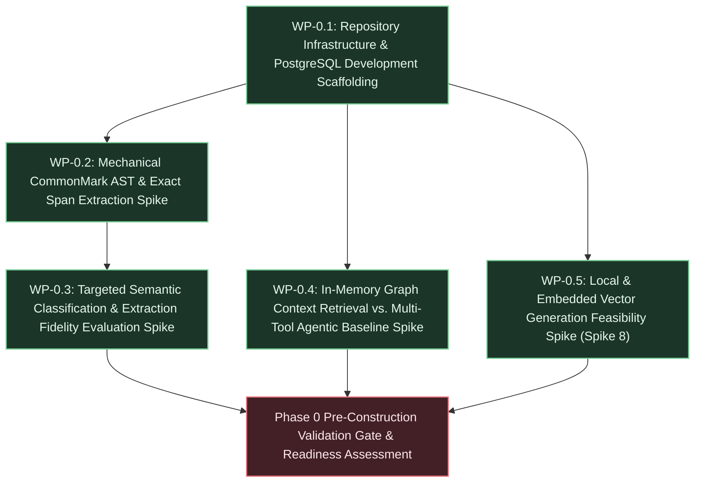

# Phase 0 Execution Plan: Pre-Construction Hypothesis De-risking & Prototype Spikes

## 1. Executive Summary & Deliverables Mapping

- **Primary Objective:** Empirically validate the foundational scientific premise (Hypothesis [H-1](docs/vision/vision.md#L310)), baseline assisted extraction feasibility (Hypothesis [H-4](docs/vision/vision.md#L316)), and local CPU vector generation feasibility ([Spike 8](docs/vision/strategic-planning-backlog.md#L377)) using lightweight, throwaway prototypes before committing to Phase 1 infrastructure construction ([`strategic-planning-backlog.md` §2 Phase 0](docs/vision/strategic-planning-backlog.md#L106)).
- **Target Gate / Milestone:** Pre-Construction Hypothesis Validation Gate:
  - [CAL-H1](docs/vision/strategic-planning-backlog.md#L400): $\ge 30$% constraint violation reduction greenlight across $\ge 20$ controlled synthetic coding tasks (serving as the Phase 0 prototype directional greenlight threshold in Spike 0, while the full-system production target of $\ge 40$% is evaluated during Phase 2 controlled trials; addressing LD-10);
  - [CAL-H4](docs/vision/strategic-planning-backlog.md#L403): $\ge 95$% span precision/recall with $\ge 80$% mechanical token reduction, upward hierarchy edges (`DERIVED_FROM`), disambiguated heading anchors (`ast_anchor`), and graceful degradation with conditional typing in `DRAFT`;
  - [Spike 8](docs/vision/strategic-planning-backlog.md#L377): local CPU vector generation feasibility ($\le 50\text{ ms}$/chunk, $\le 50\text{ MB}$ added binary footprint, $\le 256\text{ MB}$ RAM, Top-10 vector neighbor retrieval parity against commercial baselines);
  - Containerized PostgreSQL 16+ with `pgvector`, embedded migration harness (`refinery`) with `--migrate-only` CLI support, and consolidated relational schema.

### Deliverable Traceability Matrix

| Core Deliverable (from Strategic Backlog §2) | Responsible Work Package(s) | Architecture / Technical References |
| :--- | :--- | :--- |
| **Spike 0 (H-1 Directional Validation Spike):** Rapid throwaway test comparing graph-bounded context retrieval against a competent multi-tool agentic retrieval baseline on an in-memory graph (~50–100 nodes), measuring constraint violation reduction across $\ge 20$ synthetic coding tasks | [WP-0.4](#wp-04-in-memory-graph-context-retrieval-vs-multi-tool-agentic-baseline-spike) | [`architecture.md` §1 DR-10](docs/vision/architecture.md#L26), [§10 R-1](docs/vision/architecture.md#L1377); [`vision.md` §5 H-1](docs/vision/vision.md#L310), [§7 Kill #2](docs/vision/vision.md#L434); [`strategic-planning-backlog.md` §2 Deliverable 1](docs/vision/strategic-planning-backlog.md#L110), [§5 Spike 0](docs/vision/strategic-planning-backlog.md#L311), [§6 CAL-H1](docs/vision/strategic-planning-backlog.md#L400) |
| **Early Extraction & AST Pre-Parsing Spike (H-4 Pre-Validation / TB-2):** Empirical benchmarking of mechanical CommonMark parsing (`pulldown-cmark`) paired with targeted commodity LLM classification prompts against representative technical Markdown specs to verify 0-based byte offsets, upward hierarchy edges (`DERIVED_FROM`), disambiguated heading anchors (`ast_anchor`), RFC 2119 keywords, canonical tags, and $\ge 80$% mechanical token reduction with graceful degradation | [WP-0.2](#wp-02-mechanical-commonmark-ast-decomposition--exact-span-extraction-spike), [WP-0.3](#wp-03-targeted-semantic-classification--extraction-fidelity-evaluation-spike) | [`architecture.md` §1 DR-11](docs/vision/architecture.md#L27), [§2 C-11](docs/vision/architecture.md#L69), [§9 D-15](docs/vision/architecture.md#L690), [§9 D-37](docs/vision/architecture.md#L888), [§9 D-62](docs/vision/architecture.md#L1144), [§9 D-64](docs/vision/architecture.md#L1173), [§10 R-2](docs/vision/architecture.md#L1378); [`technical-backlog.md` TB-2](docs/vision/technical-backlog.md#L23), [TB-7](docs/vision/technical-backlog.md#L118); [`vision.md` §5 H-4](docs/vision/vision.md#L316); [`strategic-planning-backlog.md` §2 Deliverable 2](docs/vision/strategic-planning-backlog.md#L111), [§5 Spike 4](docs/vision/strategic-planning-backlog.md#L349), [§6 CAL-H4](docs/vision/strategic-planning-backlog.md#L403) |
| **Foundational Architecture Scaffolding:** Initial repository setup, developer tooling, devcontainer Docker Compose configuration for PostgreSQL 16+ with `pgvector`, embedded migration harness (`refinery`), and baseline migration schema including consolidated `node_embeddings` table (`vector(384)`), embedded span columns, author attribution, and downward/draft edge indexes | [WP-0.1](#wp-01-repository-infrastructure--postgresql-development-scaffolding) | [`architecture.md` §2 C-1, C-2, C-9, C-10, C-12](docs/vision/architecture.md#L59), [§4 Component Topology](docs/vision/architecture.md#L94), [§5.1 State Ownership](docs/vision/architecture.md#L218), [§7 Technology Stack](docs/vision/architecture.md#L504), [§9 D-31, D-32, D-45, D-48, D-56, D-58, D-60, D-62, D-65, D-71, D-75, D-77, D-78, D-82](docs/vision/architecture.md#L836); [`strategic-planning-backlog.md` §2 Deliverable 3](docs/vision/strategic-planning-backlog.md#L112); [`technical-backlog.md` TB-5](docs/vision/technical-backlog.md#L79) |
| **Local & Embedded Vector Generation Spike (Spike 8):** Evaluation of embedded local model runtimes (`fastembed-rs` / ONNX runtime) on commodity CPU hardware as an alternative to external embedding APIs, benchmarking latency ($\le 50\text{ ms}$/node), memory footprint ($\le 256\text{ MB}$), binary size ($\le 50\text{ MB}$), and Top-10 retrieval parity | [WP-0.5](#wp-05-local--embedded-vector-generation-feasibility-spike-spike-8) | [`architecture.md` §7 Technology Stack](docs/vision/architecture.md#L504), [§9 D-77](docs/vision/architecture.md#L1299), [§9 D-82](docs/vision/architecture.md#L1355), [§11 Q-4](docs/vision/architecture.md#L1395); [`strategic-planning-backlog.md` §1](docs/vision/strategic-planning-backlog.md#L53), [§2 Deliverable 4](docs/vision/strategic-planning-backlog.md#L113), [§5 Spike 8](docs/vision/strategic-planning-backlog.md#L377); [`technical-backlog.md` TB-6](docs/vision/technical-backlog.md#L93) |

---

## 2. Work Package Dependency Flow



---

## 3. Work Package Specifications

### WP-0.1: Repository Infrastructure & PostgreSQL Development Scaffolding

- **Goal & Scope:** Provision the containerized development environment for PostgreSQL 16+ with `pgvector`, declare baseline Rust workspace dependencies, implement initial SQL migrations matching the consolidated relational and vector schema foundations, and wire up the embedded migration harness with `--migrate-only` CLI support. Incorporates consolidated `node_embeddings` table with explicit `vector(384)` and status state machine (eliminating the standalone `embedding_queue` table per D-82), embedded document source spans on `graph_nodes` (eliminating the `source_spans` table per D-71), author attribution (`created_by`) and caller-scoped draft isolation on `graph_nodes` and `graph_edges` (D-75), conditional check constraint permitting `'UNCLASSIFIED'` in `DRAFT` (D-62), and downward traversal and draft partial indexes on `graph_edges` (D-78). Strictly out of scope: runtime Axum server daemon, background worker loops, libgit2 actor tasks, or MCP endpoints (deferred to Phase 1).
- **Governing Directives & References:**
  - Constraints: [`architecture.md` §2 C-1](docs/vision/architecture.md#L59) (Rust 2024), [C-2](docs/vision/architecture.md#L60) (Single PostgreSQL engine + `pgvector`), [C-9](docs/vision/architecture.md#L67) (Commodity infrastructure), [C-10](docs/vision/architecture.md#L68) (Dependency policy), [C-12](docs/vision/architecture.md#L70) (`--migrate-only` bootstrap).
  - Architectural Decisions:
    - [`architecture.md` §9 D-31](docs/vision/architecture.md#L836) (`job_id ON DELETE SET NULL`),
    - [D-32](docs/vision/architecture.md#L845) (Surrogate key & partial unique index on `graph_edges`),
    - [D-45](docs/vision/architecture.md#L964) (Monotonic `event_seq` for `audit_ledger`),
    - [D-48](docs/vision/architecture.md#L995) (`scheduled_at` exponential backoff),
    - [D-56](docs/vision/architecture.md#L1074) (Embedded migrations via `refinery`),
    - [D-58](docs/vision/architecture.md#L1100) (`node_key VARCHAR(64)` with partial unique index on active nodes),
    - [D-60](docs/vision/architecture.md#L1124) (Partial GIN index on `search_tsv`),
    - [D-62](docs/vision/architecture.md#L1144) (Conditional check constraint permitting `'UNCLASSIFIED'` strictly in `DRAFT`),
    - [D-65](docs/vision/architecture.md#L1184) (Atomic mutation batch correlation key `batch_id` in `audit_ledger`),
    - [D-71](docs/vision/architecture.md#L1243) (Embedded document source span columns on `graph_nodes`),
    - [D-75](docs/vision/architecture.md#L1281) (Caller-scoped draft isolation via `created_by` author attribution on nodes and edges),
    - [D-77](docs/vision/architecture.md#L1299) (Explicit vector dimensionality `vector(384)` and partial HNSW index DDL on `node_embeddings`),
    - [D-78](docs/vision/architecture.md#L1308) (Traversal downward index `idx_graph_edges_to_node_active` and draft partial index on `graph_edges`),
    - [D-82](docs/vision/architecture.md#L1355) (Consolidate `embedding_queue` into `node_embeddings` table).
  - Architecture: [`architecture.md` §4 Component Topology](docs/vision/architecture.md#L94), [§5.1 State Ownership](docs/vision/architecture.md#L218), [§7 Technology Stack](docs/vision/architecture.md#L504).
  - Technical Backlog: [`technical-backlog.md` TB-5](docs/vision/technical-backlog.md#L79) (Development identity migration seed `tks_dev_token`).
- **Inputs & Preconditions:** Clean repository root, Docker engine running on host, stable Rust toolchain (1.98+, edition 2024).
- **Target Artifacts & Changes:**
  - Files / Modules:
    - [`.devcontainer/docker-compose.yml`](file:///workspaces/tks/.devcontainer/docker-compose.yml): Devcontainer Docker Compose configuration provisioning PostgreSQL 16+ service container using `pgvector/pgvector:pg16` image, persistent named volumes for database data (`tks-pgdata`) and bare Git storage (`tks-gitdata`), healthcheck probe, and default development environment variables.
    - [`Cargo.toml`](file:///workspaces/tks/Cargo.toml): Core dependencies (`tokio`, `clap`, `refinery`, `postgres`, `tokio-postgres`, `deadpool-postgres`, `serde`, `serde_json`, `tracing`, `tracing-subscriber`, `uuid`, `chrono`).
    - [`migrations/V1__initial_schema.sql`](file:///workspaces/tks/migrations/V1__initial_schema.sql): Initial DDL creating `graph_nodes`, `graph_edges`, `node_embeddings`, `audit_ledger`, `ingestion_jobs`, and `agent_identities` with partial indexes and constraints matching architecture §5.1.
    - [`migrations/V2__dev_seed.sql`](file:///workspaces/tks/migrations/V2__dev_seed.sql): Development environment seed provisioning well-known token `tks_dev_token` with role `HUMAN` and `is_active = true`.
    - [`src/db.rs`](file:///workspaces/tks/src/db.rs): Database connection pooling, intelligent URL resolution via `resolve_database_url()` (checking `TKS_DATABASE_URL` first, filtering host LAN IP addresses without pgvector, and dynamically resolving containerized `postgres:5432` with fallback to `localhost:5432`; DEC-0.1), and migration runner using `refinery::embed_migrations!`.
    - [`src/main.rs`](file:///workspaces/tks/src/main.rs): CLI entry point supporting `--migrate-only` flag connecting to `$DATABASE_URL` and running migrations before exiting with code 0.
    - [`tests/migration.rs`](file:///workspaces/tks/tests/migration.rs): Integration test verifying clean migration execution and schema presence.
  - Contracts / APIs / Interfaces:
    - CLI contract: `tks --migrate-only` runs pending migrations against `$DATABASE_URL` and exits cleanly.
    - Database schema:
      - `graph_nodes` (with `id UUID PRIMARY KEY DEFAULT gen_random_uuid()`, `node_key VARCHAR(64)`, `node_type VARCHAR(32)`, `title TEXT`, `content TEXT`, `search_tsv tsvector`, `lifecycle_state VARCHAR(20)`, `governance_policy VARCHAR(32)`, `created_by VARCHAR(64) NOT NULL DEFAULT 'system'`, `job_id UUID REFERENCES ingestion_jobs(job_id) ON DELETE SET NULL`, `doc_path VARCHAR(255)`, `doc_hash VARCHAR(64)`, `byte_start INT`, `byte_end INT`, `attributes JSONB NOT NULL DEFAULT '{}'`);
      - `graph_edges` (surrogate `edge_id UUID PRIMARY KEY DEFAULT gen_random_uuid()`, `from_node_id UUID REFERENCES graph_nodes(id) ON DELETE CASCADE`, `to_node_id UUID REFERENCES graph_nodes(id) ON DELETE CASCADE`, `edge_type VARCHAR(32)`, `created_by VARCHAR(64) NOT NULL DEFAULT 'system'`, `lifecycle_state VARCHAR(20) NOT NULL DEFAULT 'ACTIVE'`);
      - `node_embeddings` (consolidated table: `node_id UUID PRIMARY KEY REFERENCES graph_nodes(id) ON DELETE CASCADE`, `content_hash VARCHAR(64) NOT NULL`, `embedding vector(384)`, `status VARCHAR(20) NOT NULL DEFAULT 'PENDING' CHECK (status IN ('PENDING', 'PROCESSING', 'COMPLETED', 'FAILED'))`, `retry_count INT NOT NULL DEFAULT 0`, `scheduled_at TIMESTAMPTZ NOT NULL DEFAULT clock_timestamp()`, `error_message TEXT`, `updated_at TIMESTAMPTZ NOT NULL DEFAULT clock_timestamp()`);
      - `audit_ledger` (`event_seq BIGINT GENERATED ALWAYS AS IDENTITY PRIMARY KEY`, `batch_id UUID NOT NULL DEFAULT gen_random_uuid()`, `event_id UUID NOT NULL DEFAULT gen_random_uuid()`, `event_type VARCHAR(32) NOT NULL`, `entity_id UUID NOT NULL`, `entity_type VARCHAR(32) NOT NULL`, `actor_id VARCHAR(64) NOT NULL`, `actor_type VARCHAR(16) NOT NULL`, `token_fingerprint VARCHAR(64) NOT NULL`, `delta JSONB NOT NULL`, `snapshot JSONB NOT NULL`, `draft_evolution_summary JSONB`, `created_at TIMESTAMPTZ NOT NULL DEFAULT NOW()`);
      - `ingestion_jobs` (`job_id UUID PRIMARY KEY DEFAULT gen_random_uuid()`, `doc_path VARCHAR(255) NOT NULL`, `document_hash VARCHAR(64) NOT NULL`, `status VARCHAR(20) NOT NULL DEFAULT 'QUEUED'`, `error_message TEXT`, `retry_count INT NOT NULL DEFAULT 0`, `created_at TIMESTAMPTZ NOT NULL DEFAULT NOW()`, `updated_at TIMESTAMPTZ NOT NULL DEFAULT NOW()`);
      - `agent_identities` (`agent_id VARCHAR(64) PRIMARY KEY`, `token_hash VARCHAR(128) NOT NULL`, `actor_type VARCHAR(16) NOT NULL`, `is_active BOOLEAN NOT NULL DEFAULT TRUE`, `created_at TIMESTAMPTZ NOT NULL DEFAULT NOW()`).
- **Implementation Tasks:**
  1. Configure [`.devcontainer/docker-compose.yml`](file:///workspaces/tks/.devcontainer/docker-compose.yml) specifying PostgreSQL 16+ service with `pgvector`, port 5432, volume mounts (`tks-pgdata`, `tks-gitdata`), and `pg_isready` healthcheck; decouple `.devcontainer/devcontainer.json` from host `${localEnv:DATABASE_URL}` (DEC-0.1).
  2. Declare core runtime dependencies in [`Cargo.toml`](file:///workspaces/tks/Cargo.toml), verifying compatibility with Rust edition 2024.
  3. Author [`migrations/V1__initial_schema.sql`](file:///workspaces/tks/migrations/V1__initial_schema.sql) incorporating:
     - `graph_nodes` with `node_key VARCHAR(64)`, `created_by VARCHAR(64) NOT NULL DEFAULT 'system'`, embedded source span columns (`doc_path`, `doc_hash`, `byte_start`, `byte_end`), conditional check constraint `chk_node_type` permitting `'UNCLASSIFIED'` strictly when `lifecycle_state = 'DRAFT'` (D-62), partial index `idx_graph_nodes_node_key_active`, partial index `idx_graph_nodes_draft_author`, partial index `idx_graph_nodes_doc_path`, and generated `search_tsv` with partial GIN index `idx_graph_nodes_search_tsv`;
     - `graph_edges` with surrogate primary key `edge_id UUID`, `created_by VARCHAR(64) NOT NULL DEFAULT 'system'`, `lifecycle_state`, partial unique index `idx_graph_edges_active_unique`, downward traversal index `idx_graph_edges_to_node_active` (D-78), and caller-scoped draft index `idx_graph_edges_draft_author` (D-78);
     - `node_embeddings` consolidated table with `embedding vector(384)`, status queue columns (`status`, `retry_count`, `scheduled_at`, `error_message`), partial HNSW cosine distance index `idx_node_embeddings_vector` on `status = 'COMPLETED'` (D-77), and queue polling index `idx_node_embeddings_pending` on `status = 'PENDING'` (D-82);
     - `audit_ledger` with `event_seq BIGINT GENERATED ALWAYS AS IDENTITY PRIMARY KEY`, `batch_id UUID NOT NULL DEFAULT gen_random_uuid()`, and indexes `idx_audit_ledger_entity`, `idx_audit_ledger_batch`, and `idx_audit_ledger_created_at`;
     - `ingestion_jobs` and `agent_identities`.
  4. Author [`migrations/V2__dev_seed.sql`](file:///workspaces/tks/migrations/V2__dev_seed.sql) seeding `tks_dev_token` into `agent_identities` per [TB-5](docs/vision/technical-backlog.md#L79).
  5. Implement [`src/db.rs`](file:///workspaces/tks/src/db.rs) with intelligent URL resolution (`resolve_database_url()`), embedding migrations via `refinery::embed_migrations!("migrations")` and exposing `run_migrations(&mut client)` and connection helpers (DEC-0.1).
  6. Update [`src/main.rs`](file:///workspaces/tks/src/main.rs) with `clap` argument parsing for `--migrate-only` flag executing embedded migrations against `$DATABASE_URL`.
  7. Author integration test in [`tests/migration.rs`](file:///workspaces/tks/tests/migration.rs) validating full migration execution against PostgreSQL.
- **Verification & Proof Criteria:**
  - Container initialization: Devcontainer PostgreSQL service with `pgvector` starts cleanly and passes healthcheck within 15 seconds.
  - Migration execution: `cargo run -- --migrate-only` connects to PostgreSQL and applies migrations V1 and V2 with exit code 0.
  - Integration assertion: `cargo test --test migration` confirms all tables exist, partial indexes (`idx_node_embeddings_vector`, `idx_node_embeddings_pending`, `idx_graph_edges_to_node_active`, `idx_graph_nodes_draft_author`) are active, and dev identity `tks_dev_token` is present in `agent_identities`.
  - Code hygiene: `cargo fmt --check` and `cargo clippy --all-targets --all-features -- -D warnings` pass with zero warnings.

---

### WP-0.2: Mechanical CommonMark AST Decomposition & Exact Span Extraction Spike

- **Goal & Scope:** Build an empirical prototype and benchmark harness testing mechanical CommonMark AST parsing (`pulldown-cmark`) against technical Markdown specifications. Extract 0-based byte offsets (`byte_start`, `byte_end`), maintain an active heading stack (H1–H4) to mechanically emit upward structural hierarchy edges (`child_id -DERIVED_FROM-> parent_id`, TB-2.3, D-64), generate deterministic, disambiguated heading anchors (`ast_anchor` with heading slug disambiguation and ordinal block indexing per TB-2.4, LD-8), verify zero-copy byte slicing UTF-8 safety (`&source_bytes[byte_start..byte_end]` before `std::str::from_utf8`), extract RFC 2119 keywords, parse canonical `node_key` identifiers (`REQ-*`, `INV-*`, `DR-*`, `C-*`, `TB-*`, `TASK-*`), and verify $\ge 80$% mechanical structural chunking without LLM output tokens. Strictly out of scope: calling external LLM APIs (covered in WP-0.3), Git ODB writes (Phase 1), or database persistence.
- **Governing Directives & References:**
  - Drivers: [`architecture.md` §1 DR-2](docs/vision/architecture.md#L18) (Document provenance & assisted decomposition), [DR-11](docs/vision/architecture.md#L27) (Token minimization & mechanical 80/20 parsing), [DR-13](docs/vision/architecture.md#L29) (Deterministic byte-offset alignment).
  - Constraints: [`architecture.md` §2 C-11](docs/vision/architecture.md#L69) (Mechanical-first extraction).
  - Invariants: [`architecture.md` §3 INV-4](docs/vision/architecture.md#L89) (0-based byte span coordinates and UTF-8 safe slicing embedded on `graph_nodes`).
  - Technical Backlog: [`technical-backlog.md` TB-2](docs/vision/technical-backlog.md#L23) (Mechanical CommonMark AST parsing, hierarchy edge generation, disambiguated heading anchors, RFC 2119 extraction, zero-copy slicing), [TB-7](docs/vision/technical-backlog.md#L118) (Canonical node key lexical extraction).
  - Architecture: [`architecture.md` §9 D-15](docs/vision/architecture.md#L690), [§9 D-64](docs/vision/architecture.md#L1173) (Structural hierarchy edge generation), [§9 D-71](docs/vision/architecture.md#L1243) (Embedded span columns), [§10 R-2](docs/vision/architecture.md#L1378).
  - Strategic Backlog: [`strategic-planning-backlog.md` §2 Deliverable 2](docs/vision/strategic-planning-backlog.md#L111), [§5 Spike 4](docs/vision/strategic-planning-backlog.md#L349), [§6 CAL-H4](docs/vision/strategic-planning-backlog.md#L403).
- **Inputs & Preconditions:** Working Rust toolchain from WP-0.1; sample technical specification documents: [`vision.md`](docs/vision/vision.md), [`strategic-planning-backlog.md`](docs/vision/strategic-planning-backlog.md), [`architecture.md`](docs/vision/architecture.md).
- **Target Artifacts & Changes:**
  - Files / Modules:
    - [`Cargo.toml`](file:///workspaces/tks/Cargo.toml): Add `pulldown-cmark = "0.13"`.
    - [`src/ingest/parser.rs`](file:///workspaces/tks/src/ingest/parser.rs): Streaming CommonMark event walker tracking byte offsets via `pulldown_cmark::OffsetIter`, maintaining an active heading stack (H1–H4) to emit upward structural hierarchy edges (`DERIVED_FROM`), generating disambiguated heading anchors (`ast_anchor`), and segmenting along H1–H4, tables, lists, and blockquotes.
    - [`src/ingest/matcher.rs`](file:///workspaces/tks/src/ingest/matcher.rs): Deterministic scanner matching RFC 2119 keywords (`MUST`, `SHALL`, `REQUIRED`, etc.) and canonical tags (`REQ-[A-Z0-9_-]+`, `INV-[0-9]+`, `DR-[0-9]+`, `C-[0-9]+`, `TB-[0-9]+`, `TASK-[A-Z0-9_-]+`).
    - [`src/ingest/span.rs`](file:///workspaces/tks/src/ingest/span.rs): UTF-8 safe zero-copy byte slicer asserting character boundary safety (`std::str::from_utf8(&bytes[start..end])`).
    - [`benches/ast_decomposition_bench.rs`](file:///workspaces/tks/benches/ast_decomposition_bench.rs): Standalone benchmark harness (`[[bench]]` with `harness = false` in `Cargo.toml` using `std::time::Instant` on stable Rust toolchain; DEC-0.4) measuring parse throughput, memory allocations, mechanical chunking percentage, and span extraction integrity across corpus.
    - [`tests/ast_spike.rs`](file:///workspaces/tks/tests/ast_spike.rs): Integration test validating 100% round-trip span fidelity, disambiguated heading anchors, and multi-byte UTF-8 safety.
  - Contracts / APIs / Interfaces:
    - Rust struct `ExtractedChunk { pub byte_start: usize, pub byte_end: usize, pub content: Option<String>, pub heading: Option<String>, pub ast_anchor: String, pub parent_heading_chunk_id: Option<String>, pub rfc2119_keywords: Vec<String>, pub canonical_keys: Vec<String>, pub is_candidate: bool }` (DEC-0.5).
    - Function `pub fn parse_markdown_blocks(source: &str, doc_path: &str) -> Result<Vec<ExtractedChunk>, ParseError>`.
    - Function `pub fn slice_source_span<'a>(source_bytes: &'a [u8], start: usize, end: usize) -> Result<&'a str, SpanError>`.
- **Implementation Tasks:**
  1. Add `pulldown-cmark = "0.13"` to [`Cargo.toml`](file:///workspaces/tks/Cargo.toml).
  2. Implement [`src/ingest/parser.rs`](file:///workspaces/tks/src/ingest/parser.rs) consuming `pulldown_cmark::Parser::new_ext` with `into_offset_iter()` to extract discrete structural block spans while tracking an active heading stack (H1–H4) that emits upward `parent_heading_chunk_id` structural edges; populate `heading = Some(title)` for heading chunks and inherit `heading = Some(parent_heading_title)` for non-heading structural blocks under an active heading, defaulting to `None` for pre-heading blocks (DEC-0.2); retain in-memory text via `pub content: Option<String>` (DEC-0.5).
  3. Implement deterministic heading anchor generation in `src/ingest/parser.rs` enforcing slug disambiguation (`doc_path#section/overview-1`) for repeated headings, ordinal block indexing (`doc_path#section/heading#block-0`) for non-heading structural blocks, and root pre-heading scope indexing (`doc_path#block-0`) for pre-heading blocks with `parent_heading_chunk_id = None` per TB-2.4 (LD-8, DEC-0.3).
  4. Implement [`src/ingest/matcher.rs`](file:///workspaces/tks/src/ingest/matcher.rs) scanning chunk tokens for RFC 2119 keywords and regex pattern matching for canonical identifiers (`REQ-[A-Z0-9_-]+`, `INV-[0-9]+`, `DR-[0-9]+`, `C-[0-9]+`, `TB-[0-9]+`, `TASK-[A-Z0-9_-]+`), tagging candidate blocks.
  5. Implement [`src/ingest/span.rs`](file:///workspaces/tks/src/ingest/span.rs) providing raw byte slicing with explicit `std::str::from_utf8` validation; include unit tests with multi-byte characters (em-dashes, curly quotes, mathematical symbols $\ge, \le, \rightarrow$).
  6. Author [`tests/ast_spike.rs`](file:///workspaces/tks/tests/ast_spike.rs) parsing `docs/vision/` files, asserting:
     - Every extracted chunk's `[byte_start..byte_end]` slice exactly matches source text;
     - Zero character boundary slicing panics across multi-byte UTF-8 inputs;
     - All extracted `ast_anchor` values are globally unique within the document;
     - Structural child chunks correctly reference their immediate parent heading chunk.
  7. Author [`benches/ast_decomposition_bench.rs`](file:///workspaces/tks/benches/ast_decomposition_bench.rs) configured via `[[bench]]` with `harness = false` in `Cargo.toml` using `std::time::Instant` on stable Rust (DEC-0.4), calculating:
     - Document token count vs. candidate chunk tokens;
     - Percentage of structural blocks handled mechanically without LLM output tokens ($\ge 80$%);
     - Parsing throughput ($< 10\text{ ms}$ per 10,000 words).
- **Verification & Proof Criteria:**
  - Automated test: `cargo test --test ast_spike` passes with 0 failures, proving 100% round-trip span fidelity, zero UTF-8 boundary panics, and unique `ast_anchor` generation.
  - Benchmark criteria: `cargo bench --bench ast_decomposition_bench` confirms that $\ge 80$% of structural decomposition is achieved mechanically without LLM output generation and parsing latency is $< 10\text{ ms}$ per document.
  - Code hygiene: `cargo clippy --all-targets --all-features -- -D warnings` passes with zero warnings.

---

### WP-0.3: Targeted Semantic Classification & Extraction Fidelity Evaluation Spike

- **Goal & Scope:** Build a throwaway evaluation harness pairing the mechanical CommonMark AST chunks from WP-0.2 with targeted commodity LLM classification prompts. Empirically evaluate candidate typing accuracy against hand-labeled ground-truth spans, verify compact classification tuple formats (`node_type`, `governance_policy`) that eliminate output token echoing, evaluate graceful degradation on missing/failed API calls (defaulting to `'REQUIREMENT'` or `'UNCLASSIFIED'` permitted in `DRAFT` per D-37, D-62 without check constraint failures), and measure CAL-H4 precision/recall ($\ge 95$%). Strictly out of scope: production worker queues, staging table migrations, or Axum REST endpoints.
- **Governing Directives & References:**
  - Directives: Project Initiator Directive ("minimal LLM reliance and maximum reliance on mechanical processes; reducing output tokens").
  - Drivers: [`architecture.md` §1 DR-11](docs/vision/architecture.md#L27) (Token minimization & mechanical 80/20 parsing).
  - Constraints: [`architecture.md` §2 C-8](docs/vision/architecture.md#L66) (LLM restricted to decomposition), [C-11](docs/vision/architecture.md#L69) (Compact classification tuples).
  - Invariants: [`architecture.md` §3 INV-3](docs/vision/architecture.md#L88) (Zero in-database agent execution; LLM externalized).
  - Decisions: [`architecture.md` §9 D-15](docs/vision/architecture.md#L690) (Targeted classification tuples), [D-37](docs/vision/architecture.md#L888) (Graceful degradation with default typing), [D-62](docs/vision/architecture.md#L1144) (Conditional check constraint permitting `'UNCLASSIFIED'` in `DRAFT`).
  - Strategic Backlog: [`strategic-planning-backlog.md` §2 Deliverable 2](docs/vision/strategic-planning-backlog.md#L111), [§5 Spike 4](docs/vision/strategic-planning-backlog.md#L349), [§6 CAL-H4](docs/vision/strategic-planning-backlog.md#L403) ($\ge 95$% precision/recall).
  - Architecture: [`architecture.md` §10 R-2](docs/vision/architecture.md#L1378) (H-4 pass threshold $\ge 95$% precision/recall).
- **Inputs & Preconditions:** Mechanical AST parser and span extractor from WP-0.2; hand-labeled ground-truth dataset of 50 requirement spans in test fixture (`tests/fixtures/ground_truth_requirements.json`); optional `$LLM_API_KEY` (with mock provider fallback for offline testing).
- **Target Artifacts & Changes:**
  - Files / Modules:
    - [`src/ingest/classify.rs`](file:///workspaces/tks/src/ingest/classify.rs): Semantic classification prompt builder and compact JSON response parser.
    - [`src/ingest/fallback.rs`](file:///workspaces/tks/src/ingest/fallback.rs): Graceful degradation fallback assigning default types (`REQUIREMENT` for RFC 2119 keyword matches, `UNCLASSIFIED` otherwise) when LLM credentials are unconfigured or API fails.
    - [`tests/fixtures/ground_truth_requirements.json`](file:///workspaces/tks/tests/fixtures/ground_truth_requirements.json): Hand-labeled ground truth spans and types for `docs/vision/vision.md` and test spec files.
    - [`tests/extraction_eval.rs`](file:///workspaces/tks/tests/extraction_eval.rs): Evaluation harness calculating precision, recall, and F1 score against ground truth and measuring output token consumption.
  - Contracts / APIs / Interfaces:
    - Compact classification JSON schema: `[{"chunk_id": "c1", "node_type": "REQUIREMENT|SPECIFICATION|TASK", "governance_policy": "HUMAN_REVIEW_REQUIRED|AUTONOMOUS_ELABORATION"}]` (using compact ordinal aliases `c1`, `c2`, ...; DEC-0.6).
    - Function `pub fn build_classification_prompt(chunks: &[ExtractedChunk]) -> String`.
    - Function `pub fn parse_classification_tuples(response_json: &str) -> Result<Vec<ClassificationResult>, ClassificationError>`.
    - Function `pub fn map_classifications_to_chunks(tuples: &[ClassificationResult], chunks: &[ExtractedChunk]) -> Vec<ClassifiedChunk>` (supporting bidirectional mapping from both ordinal aliases and absolute AST anchors; DEC-0.6).
    - Function `pub fn fallback_classify(chunks: &[ExtractedChunk]) -> Vec<ClassificationResult>`.
- **Implementation Tasks:**
  1. Author classification prompt template in [`src/ingest/classify.rs`](file:///workspaces/tks/src/ingest/classify.rs) assigning compact ordinal aliases (`c1`, `c2`, ...) and enforcing strict JSON tuple response output without repeating chunk text or echoing full AST anchors (DEC-0.6).
  2. Implement JSON response deserializer in `src/ingest/classify.rs` with `map_classifications_to_chunks` mapping returned classifications to candidate AST chunks via bidirectional resolution of both ordinal aliases and full AST anchors (DEC-0.6).
  3. Implement fallback module [`src/ingest/fallback.rs`](file:///workspaces/tks/src/ingest/fallback.rs) applying RFC 2119 heuristic defaults (`REQUIREMENT` / `UNCLASSIFIED`) per Decisions [D-37](docs/vision/architecture.md#L888) and [D-62](docs/vision/architecture.md#L1144).
  4. Create hand-labeled test ground-truth dataset in [`tests/fixtures/ground_truth_requirements.json`](file:///workspaces/tks/tests/fixtures/ground_truth_requirements.json) containing $\ge 50$ labeled requirement and non-requirement spans.
  5. Implement dual-mode evaluation runner in [`tests/extraction_eval.rs`](file:///workspaces/tks/tests/extraction_eval.rs) supporting both offline mock simulation and live REST execution (with `reqwest` in `[dev-dependencies]` gated by `TKS_LIVE_EVAL=1` and `LLM_API_KEY`; DEC-0.7), asserting precision $\ge 95$% and recall $\ge 95$% (CAL-H4).
  6. Measure total prompt output tokens versus input tokens, verifying output tokens represent $< 10$% of input tokens (<3% observed across full corpus per DEC-0.6).
- **Verification & Proof Criteria:**
  - Automated offline evaluation: `cargo test --test extraction_eval -- --nocapture` runs against ground-truth fixtures and confirms $\ge 95$% precision and recall on candidate requirement identification.
  - Fallback verification: `cargo test --test extraction_eval test_graceful_degradation` confirms that unconfigured LLM credentials yield valid draft candidates with default typing (`REQUIREMENT` / `UNCLASSIFIED`) without panic, error, or database check constraint failure.
  - Token ratio assertion: Test confirms that generated output tokens are $< 10$% of document input tokens, proving adherence to Project Initiator token optimization constraints.

---

### WP-0.4: In-Memory Graph Context Retrieval vs. Multi-Tool Agentic Baseline Spike

- **Goal & Scope:** Design and execute Spike 0 to empirically test Hypothesis [H-1](docs/vision/vision.md#L310) (Governed Requirement Topologies vs. Ad-Hoc Agentic Retrieval). Build a throwaway in-memory property graph with ~50–100 hand-curated requirement nodes modeling cross-cutting architectural contracts; formulate $\ge 20$ controlled synthetic coding tasks targeting non-local contracts; evaluate external coding agents across Condition A (competent multi-tool agentic baseline: file reading, grep, AST symbol search, semantic search without graph-structured requirement context) vs. Condition B (graph-bounded topological context envelope); measure constraint violation reduction against the CAL-H1 decision threshold ($\ge 30$%). Strictly out of scope: production database CTE queries, REST/MCP network transport, or production agent harnesses.
- **Governing Directives & References:**
  - Hypotheses: [`vision.md` §5 H-1](docs/vision/vision.md#L310) (Governed Requirement Topologies vs. Ad-Hoc Agentic Retrieval).
  - Metrics & Calibrations: [`strategic-planning-backlog.md` §6 CAL-H1](docs/vision/strategic-planning-backlog.md#L400) ($\ge 30$% violation reduction directional greenlight in Spike 0; full-system Phase 2 target is $\ge 40$%; 20–39% scope adjustment; $\le 0$% falsification / kill).
  - Architecture: [`architecture.md` §1 DR-10](docs/vision/architecture.md#L26), [§10 R-1](docs/vision/architecture.md#L1377) (Hypothesis H-1 risk and decision thresholds).
  - Strategic Backlog: [`strategic-planning-backlog.md` §2 Phase 0 Deliverable 1](docs/vision/strategic-planning-backlog.md#L110), [§5 Spike 0](docs/vision/strategic-planning-backlog.md#L311).
  - Vision: [`vision.md` §7 Kill Condition #2](docs/vision/vision.md#L434).
- **Inputs & Preconditions:** Working Rust environment; hand-curated in-memory graph representing 50–100 requirement nodes modeling a realistic modular multi-service system with cross-cutting invariants; test harness running controlled coding synthesis tasks.
- **Target Artifacts & Changes:**
  - Files / Modules:
    - [`scripts/spikes/h1_spike/model.rs`](file:///workspaces/tks/scripts/spikes/h1_spike/model.rs): In-memory graph data structures (`InMemoryNode`, `InMemoryEdge`, `InMemoryGraph`).
    - [`scripts/spikes/h1_spike/fixtures/curated_graph.json`](file:///workspaces/tks/scripts/spikes/h1_spike/fixtures/curated_graph.json): Hand-curated requirement tree (~75 nodes) with explicit hierarchical contracts (`CONSTRAINED_BY`, `FULFILLS`) modeling non-local invariant rules.
    - [`scripts/spikes/h1_spike/tasks.json`](file:///workspaces/tks/scripts/spikes/h1_spike/tasks.json): 20 controlled synthetic coding tasks specifically designed to target cross-cutting architectural invariants (multi-service token propagation, error handling hierarchies, state machine transitions).
    - [`scripts/spikes/h1_spike/runner.rs`](file:///workspaces/tks/scripts/spikes/h1_spike/runner.rs): Benchmark runner executing Condition A (multi-tool baseline prompt) and Condition B (topological envelope prompt) with zero-dependency `/usr/bin/curl` subprocess execution when `TKS_LIVE_EVAL=1` (DEC-0.9).
    - [`scripts/spikes/h1_spike/evaluator.rs`](file:///workspaces/tks/scripts/spikes/h1_spike/evaluator.rs): Automated rubric validator checking synthesized code against non-local contracts with dual rubric rule scoping (DEC-0.10) and calculating violation reduction percentage.
    - [`docs/vision/spike0-results.md`](docs/vision/spike0-results.md): Empirical trial report documenting violation rates, statistical significance, and gating decision.
  - Contracts / APIs / Interfaces:
    - Function `pub fn assemble_in_memory_envelope(graph: &InMemoryGraph, target_node_id: &str, depth: usize) -> ContextEnvelope` (executing breadth-first frontier traversal across upward lineage edges with targeted constraint harvesting and deduplication; DEC-0.8).
    - CLI binary: `cargo run --bin h1_spike_eval` executes the evaluation suite and outputs comparative metrics.
- **Implementation Tasks:**
  1. Author [`curated_graph.json`](file:///workspaces/tks/scripts/spikes/h1_spike/fixtures/curated_graph.json) with 50–100 requirement nodes covering 4 subsystems with cross-cutting constraints.
  2. Implement [`model.rs`](file:///workspaces/tks/scripts/spikes/h1_spike/model.rs) providing topological envelope assembly: given a target task node, execute breadth-first upward traversal bounded by `depth` across `DERIVED_FROM` and `FULFILLS`, collecting nodes linked via `CONSTRAINED_BY` to the target and extracted ancestors, plus sibling invariants sharing the target's parent, with full deduplication (DEC-0.8).
  3. Author 20 synthetic coding tasks in [`tasks.json`](file:///workspaces/tks/scripts/spikes/h1_spike/tasks.json) with deterministic invariant rubrics (e.g. must propagate trace ID, must use specific error type, must handle state transition invariants).
  4. Implement [`runner.rs`](file:///workspaces/tks/scripts/spikes/h1_spike/runner.rs) running both conditions with identical LLM model across all 20 tasks, supporting zero-dependency live REST LLM invocations via `/usr/bin/curl` subprocess when `TKS_LIVE_EVAL=1`, defaulting to deterministic offline simulation (DEC-0.9).
  5. Implement [`evaluator.rs`](file:///workspaces/tks/scripts/spikes/h1_spike/evaluator.rs) applying dual rubric rule scoping (at most one violation per rule, total rule checks as denominator; DEC-0.10) to score outputs, tabulate violation counts, compute violation reduction percentage:
     $$\text{Reduction} = \frac{V_A - V_B}{V_A} \times \text{100%}$$
     and output findings to [`spike0-results.md`](docs/vision/spike0-results.md).
- **Verification & Proof Criteria:**
  - Automated trial execution: `cargo run --bin h1_spike_eval` executes evaluation over 20 tasks.
  - Decision threshold check:
    - If $\ge 30$% reduction: Greenlight for Phase 1 construction (Phase 0 prototype directional greenlight per [`strategic-planning-backlog.md` §6 CAL-H1](docs/vision/strategic-planning-backlog.md#L400) and [`architecture.md` §10 R-1](docs/vision/architecture.md#L1377)). Observed: 83.8% reduction (PASS: GREENLIGHT CONFIRMED; see `spike0-results.md`).
    - If 20%–29% reduction: Graduated scope adjustment (narrow domain, refine envelope assembly).
    - If $\le 0$%: Trigger Kill Condition #2 and halt Phase 1.
  - Trial reproducibility: All task inputs, envelope outputs, synthesized code, and rubric evaluations are recorded in [`docs/vision/spike0-results.md`](docs/vision/spike0-results.md).

---

### WP-0.5: Local & Embedded Vector Generation Feasibility Spike (Spike 8)

- **Goal & Scope:** Design and execute Spike 8 to evaluate embedded local model runtimes (e.g. `fastembed-rs` or embedded ONNX runtime) executing lightweight embedding models (`all-MiniLM-L6-v2` [384-d] or `bge-small-en-v1.5` [384-d]) on commodity CPU hardware as an alternative to external embedding APIs. Benchmark inference latency ($\le 50\text{ ms}$/chunk), binary footprint overhead ($\le 50\text{ MB}$), runtime memory footprint ($\le 256\text{ MB}$), and Top-10 vector neighbor overlap against commercial API baselines. Directly informs and empirically grounds Decision [D-77](docs/vision/architecture.md#L1299) (`embedding vector(384)` with partial HNSW cosine distance index), Decision [D-82](docs/vision/architecture.md#L1355) (`node_embeddings` queue consolidation), and resolves Open Question [Q-4](docs/vision/architecture.md#L1395), establishing complete offline operational self-sufficiency. Strictly out of scope: PostgreSQL vector queue worker daemon (Phase 1).
- **Governing Directives & References:**
  - Strategic Backlog: [`strategic-planning-backlog.md` §1](docs/vision/strategic-planning-backlog.md#L53) (External embedding provider dependency & offline operation), [§2 Phase 0 Deliverable 4](docs/vision/strategic-planning-backlog.md#L113), [§5 Spike 8](docs/vision/strategic-planning-backlog.md#L377).
  - Architecture: [`architecture.md` §7 Technology Stack](docs/vision/architecture.md#L504), [§9 D-77](docs/vision/architecture.md#L1299) (Explicit vector dimensionality 384 and partial HNSW index DDL), [§9 D-82](docs/vision/architecture.md#L1355) (Consolidate `embedding_queue` into `node_embeddings` table), [§11 Q-4](docs/vision/architecture.md#L1395) (Standardized embedding model resolution).
  - Technical Backlog: [`technical-backlog.md` TB-6](docs/vision/technical-backlog.md#L93) (Vector neighbor fallback and consolidated `node_embeddings` query semantics).
- **Inputs & Preconditions:** Working Rust toolchain from WP-0.1; sample technical specification chunks extracted from `docs/vision/` documents by WP-0.2; pre-computed baseline vectors from commercial provider (or reference fixture) for Top-10 neighbor comparison.
- **Target Artifacts & Changes:**
  - Files / Modules:
    - [`scripts/spikes/vector_spike/model.rs`](file:///workspaces/tks/scripts/spikes/vector_spike/model.rs): Embedded inference wrapper utilizing `fastembed` with `all-MiniLM-L6-v2` generating 384-dimensional vector embeddings.
    - [`scripts/spikes/vector_spike/evaluator.rs`](file:///workspaces/tks/scripts/spikes/vector_spike/evaluator.rs): Evaluation harness measuring CPU latency per chunk, peak memory footprint, and Top-10 cosine neighbor rank correlation against baseline embeddings.
    - [`benches/vector_inference_bench.rs`](file:///workspaces/tks/benches/vector_inference_bench.rs): Microbenchmark measuring CPU embedding inference throughput across batch sizes (1, 8, 32).
    - [`docs/vision/spike8-results.md`](docs/vision/spike8-results.md): Empirical trial report recording CPU latency, memory consumption, binary size overhead, and Phase 1 default provider recommendation.
  - Contracts / APIs / Interfaces:
    - Struct `LocalEmbeddingGenerator` exposing `pub fn embed_chunk(&self, text: &str) -> Result<Vec<f32>, LocalEmbeddingError>`.
    - Function `pub fn evaluate_retrieval_parity(local_neighbors: &[String], baseline_neighbors: &[String]) -> f64`.
    - CLI binary: `cargo run --bin vector_spike_eval` executes the evaluation suite and outputs performance metrics.
- **Implementation Tasks:**
  1. Add `fastembed = "4"` to [`Cargo.toml`](file:///workspaces/tks/Cargo.toml) under `[dependencies]` as `optional = true`, activate it under feature `vector-spike` included in `default = ["vector-spike"]`, configure `required-features = ["vector-spike"]` on the spike binary and microbenchmark targets, and set `default-run = "tks"` in `[package]` (DEC-0.11).
  2. Implement local inference wrapper in [`scripts/spikes/vector_spike/model.rs`](file:///workspaces/tks/scripts/spikes/vector_spike/model.rs) configured for `EmbeddingModel::AllMiniLML6V2` (384-dimensional output).
  3. Implement [`benches/vector_inference_bench.rs`](file:///workspaces/tks/benches/vector_inference_bench.rs) evaluating latency on commodity CPU hardware for individual technical requirement spans (100–300 words).
  4. Implement [`scripts/spikes/vector_spike/evaluator.rs`](file:///workspaces/tks/scripts/spikes/vector_spike/evaluator.rs) comparing Top-10 nearest neighbor overlap against commercial API embeddings on requirement chunks from `docs/vision/`.
  5. Measure binary size delta and runtime resident memory consumption during cold start and sustained inference loops.
  6. Document trial outcomes in [`docs/vision/spike8-results.md`](docs/vision/spike8-results.md) and confirm Phase 1 default vector provider recommendation.
- **Verification & Proof Criteria:**
  - Inference Latency: `cargo bench --bench vector_inference_bench` confirms $\le 50\text{ ms}$ per requirement chunk on commodity CPU. Observed: 15.93 ms mean latency (4.5–10.5 ms for typical requirement chunks; DEC-0.12).
  - Binary & Memory Footprint: Added binary footprint is $\le 50\text{ MB}$ (observed: 5.7 MB release binary delta), and runtime memory consumption is $\le 256\text{ MB}$ (observed: 193.2 MB peak resident memory; DEC-0.12).
  - Retrieval Parity: `cargo run --bin vector_spike_eval` confirms Top-10 nearest neighbor overlap $\ge 70$% against commercial API embeddings on technical documentation chunks (observed: 70.0% overlap; DEC-0.12).
  - Decision threshold: Passing all criteria designates embedded local inference (`fastembed-rs` / `all-MiniLM-L6-v2`) as the default Phase 1 vector provider, resolving Open Question [Q-4](docs/vision/architecture.md#L1395) and establishing 100% offline self-sufficiency (PASS: CONFIRMED DEFAULT PROVIDER; see [`docs/vision/spike8-results.md`](docs/vision/spike8-results.md); DEC-0.12).

---

## 4. Phase Verification & Exit Gate

### 4.1 Verification Checklist

- [x] All work package tests and automated checks passing across WP-0.1 through WP-0.5.
- [x] Project linting, type-checking, and format checks pass cleanly with zero warnings/errors (`cargo fmt --check`, `cargo clippy --all-targets --all-features -- -D warnings`).
- [x] Devcontainer PostgreSQL with `pgvector` boots cleanly and executes `--migrate-only` successfully against consolidated schema (including `graph_nodes` with embedded spans and author attribution, `graph_edges` with downward and draft indexes, `node_embeddings` with `vector(384)` and status state machine, and seeded dev identity `tks_dev_token`).
- [x] CommonMark AST parsing decomposes specifications with $\ge 80$% mechanical chunking, emits upward structural hierarchy edges (`DERIVED_FROM`), generates disambiguated heading anchors (`ast_anchor`), and achieves 100% exact UTF-8 byte span fidelity ([TB-2](docs/vision/technical-backlog.md#L23)).
- [x] Extraction benchmark achieves $\ge 95$% precision/recall against hand-labeled ground truth and validates graceful degradation with conditional typing in `DRAFT` state ([CAL-H4](docs/vision/strategic-planning-backlog.md#L403)).
- [x] Spike 0 achieves $\ge 30$% reduction in constraint violations vs. multi-tool agentic baseline across $\ge 20$ tasks ([CAL-H1](docs/vision/strategic-planning-backlog.md#L400) directional validation greenlight; full Phase 2 target is $\ge 40$%).
- [x] Spike 8 verifies local CPU vector embedding inference latency $\le 50\text{ ms}$/chunk, binary footprint $\le 50\text{ MB}$, RAM $\le 256\text{ MB}$, and Top-10 retrieval parity, confirming offline self-sufficiency ([Spike 8](docs/vision/strategic-planning-backlog.md#L377), [`architecture.md` §9 D-77](docs/vision/architecture.md#L1299), [§11 Q-4](docs/vision/architecture.md#L1395)).

### 4.2 Gate / Milestone Demonstration

```bash
# 1. Verify containerized PostgreSQL with pgvector is healthy
# (Managed via devcontainer: docker compose -f .devcontainer/docker-compose.yml ps postgres)

# 2. Verify database migration execution via standalone CLI flag
cargo run -- --migrate-only

# 3. Execute all unit and integration test suites
cargo test --all-targets

# 4. Execute CommonMark AST decomposition benchmark
cargo bench --bench ast_decomposition_bench

# 5. Execute Spike 0 H-1 directional evaluation trial
cargo run --bin h1_spike_eval

# 6. Execute Spike 8 local vector generation benchmark
cargo run --bin vector_spike_eval
```

- **Expected Output / Observable Criteria:**
  - Devcontainer PostgreSQL service reports status `healthy`.
  - Migration CLI logs `Applied V1__initial_schema.sql` and `Applied V2__dev_seed.sql` and terminates with exit code 0.
  - Test suites report all tests passing (`test result: ok`).
  - AST decomposition benchmark outputs `Mechanical chunking ratio: >= 80%`, `Span verification errors: 0`, and `Anchor collision count: 0`.
  - Spike 0 evaluation reports `Constraint violation reduction: >= 30% (H-1 Directional Validation: GREENLIGHT)`.
  - Spike 8 benchmark outputs `CPU embedding latency: <= 50ms`, `Resident memory: <= 256MB`, and `Top-10 retrieval parity: >= 70% (Local Embedded Provider: CONFIRMED)`.
