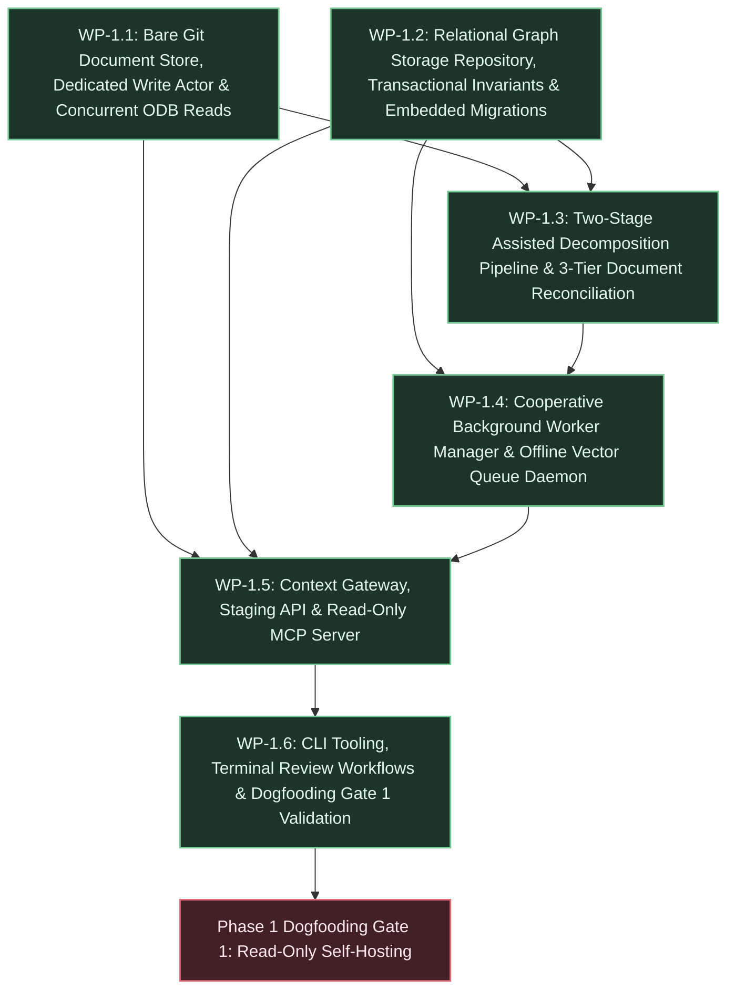

# Phase 1 Execution Plan: Substrate Core, Git Document Ingestion & Context Gateway

## 1. Executive Summary & Deliverables Mapping

- **Primary Objective:** Deliver a functioning read-only pipeline that ingests Markdown specifications into a Git-backed document repository, decomposes them into structured requirement nodes in PostgreSQL, and serves bounded context envelopes to external agents via the Model Context Protocol (MCP) ([`strategic-planning-backlog.md` §2 Phase 1](file:///workspaces/tks/docs/vision/strategic-planning-backlog.md#L115)).
- **Target Gate / Milestone:** Dogfooding Milestone (Gate 1 - Read-Only Self-Hosting): Ingest the project's own [`docs/vision/vision.md`](file:///workspaces/tks/docs/vision/vision.md) and [`docs/vision/strategic-planning-backlog.md`](file:///workspaces/tks/docs/vision/strategic-planning-backlog.md) into the Phase 1 substrate, verifying that atomic requirements and constraints can be queried via MCP tools (`get_context_envelope`, `query_requirements`, `get_document_span`) to implement Phase 2 tasks, satisfying Invariant [INV-6](file:///workspaces/tks/docs/vision/architecture.md#L91) ([`strategic-planning-backlog.md` §2 Gate 1](file:///workspaces/tks/docs/vision/strategic-planning-backlog.md#L132)).

### Deliverable Traceability Matrix

| Core Deliverable (from Strategic Backlog §2 Phase 1) | Responsible Work Package(s) | Architecture / Technical References |
| :--- | :--- | :--- |
| **Deliverable 1: Bare Git Document Store & Read/Write Concurrency Split:** Bare Git repository integration (`git2` crate) storing raw Markdown documents committed onto `refs/heads/specs` with mandatory document paths (`doc_path`). Dedicated background Git write actor task (`src/storage/git/actor.rs`) owning the writable repository handle communicating over bounded `mpsc` and `oneshot` channels with panic recovery (`std::panic::catch_unwind`). Read-only blob lookups (`get_document_span`, worker decomposition) execute concurrently off Tokio async worker pools via `tokio::task::spawn_blocking` and read-only ODB handles (`git2::Odb::read`), eliminating serialization bottlenecks on immutable reads | [WP-1.1](#wp-11-bare-git-document-store-dedicated-write-actor--concurrent-odb-reads) | [`architecture.md` §2 C-4](file:///workspaces/tks/docs/vision/architecture.md#L62), [§4 Component Topology](file:///workspaces/tks/docs/vision/architecture.md#L94), [§5.1 State Ownership](file:///workspaces/tks/docs/vision/architecture.md#L218), [§5.2 Concurrency Model](file:///workspaces/tks/docs/vision/architecture.md#L484), [§6 Interfaces](file:///workspaces/tks/docs/vision/architecture.md#L504), [§7 Technology Stack](file:///workspaces/tks/docs/vision/architecture.md#L525); [`technical-backlog.md` TB-1](file:///workspaces/tks/docs/vision/technical-backlog.md#L7) |
| **Deliverable 2: PostgreSQL Relational & Graph Schema Foundations:** Production relational schema: `graph_nodes` with author attribution (`created_by`), canonical key (`node_key`), conditional check constraint permitting `'UNCLASSIFIED'` in `DRAFT`, embedded document source spans, generated `search_tsv` with partial GIN index, and `job_id ON DELETE SET NULL`; `graph_edges` with surrogate primary key (`edge_id`), downward index (`idx_graph_edges_to_node_active`), and draft author index; consolidated `node_embeddings` table (`vector(384)`) with partial HNSW index; `ingestion_jobs` state machine; append-only `audit_ledger` with monotonic `event_seq` and transaction correlation `batch_id`; and seeded dev identity `tks_dev_token` | [WP-1.2](#wp-12-relational-graph-storage-repository-transactional-invariants--embedded-migrations) | [`architecture.md` §2 C-1, C-2](file:///workspaces/tks/docs/vision/architecture.md#L59), [§5.1 State Ownership & Constraints](file:///workspaces/tks/docs/vision/architecture.md#L218), [§5.2 Concurrency Model](file:///workspaces/tks/docs/vision/architecture.md#L446), [§9 D-31, D-32, D-45, D-56, D-58, D-60, D-62, D-65, D-71, D-75, D-77, D-78, D-82](file:///workspaces/tks/docs/vision/architecture.md#L836); [`technical-backlog.md` TB-5](file:///workspaces/tks/docs/vision/technical-backlog.md#L81), [TB-7](file:///workspaces/tks/docs/vision/technical-backlog.md#L120) |
| **Deliverable 3: Two-Stage Assisted Decomposition Pipeline & Document Reconciliation:** Streaming CommonMark AST parsing (`pulldown-cmark`) segmenting along headings (H1–H4), tables, and lists, maintaining active heading stack emitting upward structural hierarchy edges (`DERIVED_FROM`), enclosing heading attribution, root pre-heading scope indexing, and deterministic heading anchors (`ast_anchor`); RFC 2119 keyword matcher; canonical `node_key` extraction; Stage 2 targeted semantic classification with compact ordinal aliasing (`c1`, `c2`, ...) and bidirectional anchor mapping; graceful degradation to `DRAFT` `'UNCLASSIFIED'` requirements; 3-tier document reconciliation (`node_key` $\to$ `ast_anchor` $\to$ content hash) and candidate span re-anchoring metadata staging without mutating active nodes in place | [WP-1.3](#wp-13-two-stage-assisted-decomposition-pipeline--3-tier-document-reconciliation) | [`architecture.md` §1 DR-11](file:///workspaces/tks/docs/vision/architecture.md#L27), [§2 C-11](file:///workspaces/tks/docs/vision/architecture.md#L69), [§5.1 Lifecycle](file:///workspaces/tks/docs/vision/architecture.md#L373), [§5.2 Two-Stage Ingestion](file:///workspaces/tks/docs/vision/architecture.md#L478), [§9 D-15, D-37, D-62, D-64](file:///workspaces/tks/docs/vision/architecture.md#L690); [`technical-backlog.md` TB-2](file:///workspaces/tks/docs/vision/technical-backlog.md#L23), [TB-7](file:///workspaces/tks/docs/vision/technical-backlog.md#L120); `phase0-decisions.md` DEC-0.2, DEC-0.3, DEC-0.5, DEC-0.6 |
| **Deliverable 4: Cooperative Background Worker Manager & Offline Local Vector Queue Daemon:** Unified cooperative background worker manager (`src/worker/mod.rs`) running inside `tks serve` orchestrating both decomposition and asynchronous vector embedding generation using timer polling with `FOR UPDATE SKIP LOCKED` and backoff sleep. Ingestion worker claiming `QUEUED` jobs, conditional terminal transition to `STAGED` (`WHERE status = 'PROCESSING'`), and timeout reclaim draft purging. Dedicated vector queue worker claiming `PENDING` records in `node_embeddings` executing CPU inference via `fastembed-rs` (`all-MiniLM-L6-v2`, 384 dimensions) with exponential retry backoff, ensuring complete offline self-sufficiency | [WP-1.4](#wp-14-cooperative-background-worker-manager--offline-vector-queue-daemon) | [`architecture.md` §4 Component Topology](file:///workspaces/tks/docs/vision/architecture.md#L94), [§5.1 State Ownership](file:///workspaces/tks/docs/vision/architecture.md#L218), [§5.2 Concurrency Model](file:///workspaces/tks/docs/vision/architecture.md#L483), [§7 Technology Stack](file:///workspaces/tks/docs/vision/architecture.md#L525), [§9 D-48, D-77, D-82](file:///workspaces/tks/docs/vision/architecture.md#L995), [§11 Q-4](file:///workspaces/tks/docs/vision/architecture.md#L1416); [`technical-backlog.md` TB-6](file:///workspaces/tks/docs/vision/technical-backlog.md#L95), [TB-7](file:///workspaces/tks/docs/vision/technical-backlog.md#L151); `phase0-decisions.md` DEC-0.11, DEC-0.12 |
| **Deliverable 5: Read-Only MCP Server, Identity Middleware, Staging API & Terminal Review CLI:** Unified Axum server hosting REST and MCP over HTTP/SSE, paired with lightweight stdio streaming proxy (`tks mcp-stdio`) with backoff retry and structured JSON-RPC error formatting on unreachable daemon. Tower auth middleware and `FromRequestParts` extractor with in-process `moka` LRU cache and immediate invalidation on revocation (`POST /api/v1/identities/{id}/revoke`). REST ingestion endpoints with job supersession sweep, job polling, atomic staging approval (`POST /api/v1/staging/approve`) under `pg_advisory_xact_lock` with INV-1 ancestor CTE validation, in-place span re-anchoring with `SPAN_REANCHORED` audit events, draft revision squashing, and active node vector enqueueing, plus staging rejection (`POST /api/v1/staging/reject`). Read-only MCP tools: `get_context_envelope` (polymorphic resolution, depth clamp $\le 3$, quota: guaranteed 30 topological nodes, up to 10 vector neighbors with ancestor fallback, caller draft filtering, degraded inspection), `query_requirements` (sub-5ms sanitized full-text search), and `get_document_span` (concurrent ODB reads). Terminal review CLI (`tks staging list`, `tks staging inspect`, `tks staging approve`, `tks staging reject`, `tks identity`) | [WP-1.5](#wp-15-context-gateway-staging-api--read-only-mcp-server), [WP-1.6](#wp-16-cli-tooling-terminal-review-workflows--dogfooding-gate-1-validation) | [`architecture.md` §1 DR-1, DR-2, DR-5, DR-6](file:///workspaces/tks/docs/vision/architecture.md#L17), [§2 C-1, C-2, C-9, C-10, C-12](file:///workspaces/tks/docs/vision/architecture.md#L59), [§4 Component Topology](file:///workspaces/tks/docs/vision/architecture.md#L94), [§5.1 State Ownership & Constraints](file:///workspaces/tks/docs/vision/architecture.md#L218), [§5.2 Concurrency Model](file:///workspaces/tks/docs/vision/architecture.md#L446), [§6 Interfaces & Contracts](file:///workspaces/tks/docs/vision/architecture.md#L488), [§6.1 Traversal Topology](file:///workspaces/tks/docs/vision/architecture.md#L508), [§9 D-11, D-19, D-39, D-46, D-47, D-49, D-53, D-56, D-65, D-75, D-83](file:///workspaces/tks/docs/vision/architecture.md#L664); [`technical-backlog.md` TB-4](file:///workspaces/tks/docs/vision/technical-backlog.md#L56), [TB-5](file:///workspaces/tks/docs/vision/technical-backlog.md#L81), [TB-6](file:///workspaces/tks/docs/vision/technical-backlog.md#L95), [TB-7](file:///workspaces/tks/docs/vision/technical-backlog.md#L120) |

---

## 2. Work Package Dependency Flow



---

## 3. Work Package Specifications

### WP-1.1: Bare Git Document Store, Dedicated Write Actor & Concurrent ODB Reads

- **Goal & Scope:** Implement bare Git repository integration via the `git2` crate storing raw Markdown specifications at persistent paths (`doc_path`) on dedicated branch `refs/heads/specs`. Encapsulate all blocking Git write operations within a dedicated background write actor task (`src/storage/git/actor.rs`) owning the writable `git2::Repository` handle and communicating over bounded Tokio `mpsc` and `oneshot` channels with panic recovery (`std::panic::catch_unwind`). Implement concurrent, lock-free read-only ODB access (`src/storage/git/reader.rs`) via `tokio::task::spawn_blocking` and `git2::Odb::read` for verbatim text span retrieval. Strictly out of scope: interactive Git merge resolution, working tree checkouts, or external Git remote synchronization (Phase 4).
- **Governing Directives & References:**
  - Constraints: [`architecture.md` §2 C-1](file:///workspaces/tks/docs/vision/architecture.md#L59) (Rust 2024), [C-4](file:///workspaces/tks/docs/vision/architecture.md#L62) (Strict Git branch conventions: `refs/heads/specs`), [C-10](file:///workspaces/tks/docs/vision/architecture.md#L68) (Dependency policy).
  - Architecture: [`architecture.md` §4 Component Topology](file:///workspaces/tks/docs/vision/architecture.md#L94), [§5.1 State Ownership](file:///workspaces/tks/docs/vision/architecture.md#L218), [§5.2 Concurrency Model (Git Read/Write Concurrency Split)](file:///workspaces/tks/docs/vision/architecture.md#L484), [§6 Interfaces (Git operations)](file:///workspaces/tks/docs/vision/architecture.md#L504), [§7 Technology Stack (`git2 = "0.20"`)](file:///workspaces/tks/docs/vision/architecture.md#L525).
  - Technical Backlog: [`technical-backlog.md` TB-1](file:///workspaces/tks/docs/vision/technical-backlog.md#L7) (Bare Git Repository Direct ODB Ingestion, Document Path Tree Mapping, Dedicated Write Actor, Concurrent ODB Reads, and Volume Backup Synchronization).
- **Inputs & Preconditions:** Working Rust toolchain from Phase 0; `.devcontainer/docker-compose.yml` with persistent volume mount for bare Git repository (`tks-gitdata`).
- **Target Artifacts & Changes:**
  - Files / Modules:
    - [`src/storage/git/mod.rs`](file:///workspaces/tks/src/storage/git/mod.rs): Git storage module root exporting command types, result structs, and repository initialization.
    - [`src/storage/git/actor.rs`](file:///workspaces/tks/src/storage/git/actor.rs): Dedicated background Git write actor thread loop owning writable `git2::Repository`, receiving `GitCommand::CommitDocument` over bounded `mpsc`, dispatching over `oneshot`, protected by `catch_unwind`.
    - [`src/storage/git/reader.rs`](file:///workspaces/tks/src/storage/git/reader.rs): Concurrent read-only ODB reader providing `read_blob_span(&self, blob_hash: &str, byte_start: usize, byte_end: usize) -> Result<String, GitError>` via `tokio::task::spawn_blocking` and `git2::Odb::read`.
    - [`tests/git_store.rs`](file:///workspaces/tks/tests/git_store.rs): Integration test suite exercising concurrent ODB reads, serialized write commits, and actor panic recovery.
  - Contracts / APIs / Interfaces:
    - `enum GitCommand { CommitDocument { doc_path: String, content: String, respond_to: oneshot::Sender<Result<GitCommitResult, GitError>> } }`
    - `struct GitCommitResult { pub commit_id: String, pub blob_hash: String, pub doc_path: String }`
    - `struct GitWriteHandle { sender: mpsc::Sender<GitCommand> }` exposing `pub async fn commit_document(&self, doc_path: &str, content: &str) -> Result<GitCommitResult, GitError>`.
    - `struct GitReadHandle { repo_path: PathBuf }` exposing `pub async fn get_document_span(&self, blob_hash: &str, byte_start: usize, byte_end: usize) -> Result<String, GitError>`.
- **Implementation Tasks:**
  1. Add `git2 = "0.20"` to [`Cargo.toml`](file:///workspaces/tks/Cargo.toml) under `[dependencies]`.
  2. Implement bare repository initialization in [`src/storage/git/mod.rs`](file:///workspaces/tks/src/storage/git/mod.rs) ensuring `refs/heads/specs` branch exists and `init_bare` idempotently configures the persistent volume path.
  3. Implement [`src/storage/git/actor.rs`](file:///workspaces/tks/src/storage/git/actor.rs) spawning a dedicated OS thread owning `git2::Repository`, receiving `CommitDocument` commands on bounded `mpsc::Receiver`, executing direct ODB blob creation (`git_blob_create_from_buffer`), constructing tree objects at `doc_path`, committing onto `refs/heads/specs`, and recovering from panics via `catch_unwind`.
  4. Implement [`src/storage/git/reader.rs`](file:///workspaces/tks/src/storage/git/reader.rs) opening read-only ODB handles to perform lock-free blob lookups and zero-copy byte slicing (`&source_bytes[byte_start..byte_end]`) wrapped in `tokio::task::spawn_blocking`.
  5. Author unit and integration tests in [`tests/git_store.rs`](file:///workspaces/tks/tests/git_store.rs) verifying that concurrent reads never block on write operations, channel errors recover, and standard `git log` and `git diff` function against the bare repository.
- **Verification & Proof Criteria:**
  - Automated test execution: `cargo test --test git_store` executes and passes cleanly.
  - Multi-threaded stress test: 50 concurrent `get_document_span` reads complete concurrently while a sequence of 10 write commits are processed without deadlock, index lock collisions (`.git/index.lock`), or channel disconnection.
  - Standard Git CLI verification: `git --git-dir <repo_path> log -n 1 --oneline refs/heads/specs` and `git --git-dir <repo_path> ls-tree -r refs/heads/specs` display valid commit and tree objects matching committed `doc_path`.

---

### WP-1.2: Relational Graph Storage Repository, Transactional Invariants & Embedded Migrations

- **Goal & Scope:** Complete the production PostgreSQL schema migrations and storage repository layer (`src/storage/`) providing connection pooling (`deadpool-postgres`), advisory lock enforcement, transactional Invariant INV-1 ancestor path validation CTEs, polymorphic identifier resolution (UUID and `node_key`), and native sanitized full-text search. Incorporates consolidated schema: `graph_nodes` (with `created_by`, `node_key`, conditional check constraint permitting `'UNCLASSIFIED'` in `DRAFT`, embedded spans `doc_path`, `doc_hash`, `byte_start`, `byte_end`, generated `search_tsv` with partial GIN index, `attributes` with `ast_anchor` and `draft_revisions`, `job_id ON DELETE SET NULL`), `graph_edges` (surrogate `edge_id`, `created_by`, `lifecycle_state`, partial unique active index, downward traversal index `idx_graph_edges_to_node_active`, draft author index `idx_graph_edges_draft_author`, upward orientation for `CONSTRAINED_BY` and `DERIVED_FROM`), consolidated `node_embeddings` table (`vector(384)`) with partial HNSW index, `ingestion_jobs` state machine, append-only `audit_ledger` with monotonic `event_seq` and transaction correlation `batch_id`, and seeded dev identity `tks_dev_token`. Strictly out of scope: Phase 2 autonomous task mutation endpoints or Phase 3 invalidation cascade triggers.
- **Governing Directives & References:**
  - Invariants: [`architecture.md` §3 INV-1](file:///workspaces/tks/docs/vision/architecture.md#L86) (Unbroken requirement paths), [INV-2](file:///workspaces/tks/docs/vision/architecture.md#L87) (Append-only auditability & immutability of active requirements), [INV-7](file:///workspaces/tks/docs/vision/architecture.md#L92) (Mandatory identity attribution & caller draft isolation).
  - Architectural Decisions: [`architecture.md` §9 D-31](file:///workspaces/tks/docs/vision/architecture.md#L836) (`job_id ON DELETE SET NULL`), [D-32](file:///workspaces/tks/docs/vision/architecture.md#L845) (Surrogate key & partial unique index on `graph_edges`), [D-45](file:///workspaces/tks/docs/vision/architecture.md#L964) (Monotonic `event_seq`), [D-46](file:///workspaces/tks/docs/vision/architecture.md#L975) (Atomic purging of discarded drafts), [D-47](file:///workspaces/tks/docs/vision/architecture.md#L985) (Dual-endpoint active edge validation & supersession), [D-56](file:///workspaces/tks/docs/vision/architecture.md#L1074) (Embedded migrations via `refinery`), [D-58](file:///workspaces/tks/docs/vision/architecture.md#L1100) (`node_key` with partial unique index), [D-60](file:///workspaces/tks/docs/vision/architecture.md#L1124) (Partial GIN index on `search_tsv`), [D-62](file:///workspaces/tks/docs/vision/architecture.md#L1144) (`'UNCLASSIFIED'` strictly in `DRAFT`), [D-65](file:///workspaces/tks/docs/vision/architecture.md#L1184) (Atomic batch correlation `batch_id`), [D-71](file:///workspaces/tks/docs/vision/architecture.md#L1243) (Embedded source spans on `graph_nodes`), [D-75](file:///workspaces/tks/docs/vision/architecture.md#L1281) (`created_by` author attribution on nodes and edges), [D-77](file:///workspaces/tks/docs/vision/architecture.md#L1299) (`vector(384)` with partial HNSW index), [D-78](file:///workspaces/tks/docs/vision/architecture.md#L1308) (Downward traversal index `idx_graph_edges_to_node_active` and draft index), [D-82](file:///workspaces/tks/docs/vision/architecture.md#L1355) (Consolidated `node_embeddings`).
  - Architecture: [`architecture.md` §5.1 State Ownership & Constraints](file:///workspaces/tks/docs/vision/architecture.md#L218), [§5.2 Concurrency Model (Strict Lock Acquisition Hierarchy)](file:///workspaces/tks/docs/vision/architecture.md#L450).
  - Technical Backlog: [`technical-backlog.md` TB-5](file:///workspaces/tks/docs/vision/technical-backlog.md#L81) (Development Migration Seed `tks_dev_token`), [TB-7](file:///workspaces/tks/docs/vision/technical-backlog.md#L120) (Canonical Node Key Extraction, Polymorphic Identifier Resolution, Query Sanitization).
  - Learnings / Decisions: `phase0-decisions.md` DEC-0.1 (`resolve_database_url` isolation hierarchy).
- **Inputs & Preconditions:** Initial schema from WP-0.1; running containerized PostgreSQL 16+ with `pgvector`; `resolve_database_url()` connection helper in `src/lib.rs`.
- **Target Artifacts & Changes:**
  - Files / Modules:
    - [`src/storage/mod.rs`](file:///workspaces/tks/src/storage/mod.rs): Storage module root exporting repository types, domain models, and error enums.
    - [`src/storage/repo.rs`](file:///workspaces/tks/src/storage/repo.rs): Core database repository implementing connection acquisition, advisory lock helpers (`acquire_structural_lock`), and transactional helpers.
    - [`src/storage/envelope.rs`](file:///workspaces/tks/src/storage/envelope.rs): Topological recursive CTE query implementation executing bounded BFS upward traversal across `DERIVED_FROM` and `FULFILLS` with `CONSTRAINED_BY` harvesting and quota enforcement (DEC-0.8).
    - [`src/storage/search.rs`](file:///workspaces/tks/src/storage/search.rs): Native full-text search implementation executing against `search_tsv` with canonical key regex sanitization (TB-7).
    - [`migrations/V1__initial_schema.sql`](file:///workspaces/tks/migrations/V1__initial_schema.sql) & [`migrations/V2__dev_seed.sql`](file:///workspaces/tks/migrations/V2__dev_seed.sql): Production schema DDL and dev seed incorporating all entity constraints, partial indexes, and default dev token `tks_dev_token`.
    - [`tests/storage_repo.rs`](file:///workspaces/tks/tests/storage_repo.rs): Storage repository integration test suite verifying lock hierarchy, INV-1 CTE validation, polymorphic lookup, and full-text search.
  - Contracts / APIs / Interfaces:
    - Struct `StorageRepo` wrapping `deadpool_postgres::Pool`.
    - `pub async fn acquire_structural_lock(client: &mut Client) -> Result<(), StorageError>`.
    - `pub async fn validate_ancestor_path(client: &mut Client, node_ids: &[Uuid], allow_draft_parents: bool) -> Result<bool, StorageError>`.
    - `pub async fn lookup_node_polymorphic(client: &Client, identifier: &str) -> Result<Option<GraphNode>, StorageError>`.
    - `pub async fn query_active_requirements(client: &Client, query: &str, limit: u32) -> Result<Vec<SearchResultNode>, StorageError>`.
    - `pub async fn assemble_topological_envelope(client: &Client, target_id: Uuid, depth: u32, include_drafts_for: Option<&str>) -> Result<TopologicalEnvelope, StorageError>`.
- **Implementation Tasks:**
  1. Finalize SQL migrations in [`migrations/V1__initial_schema.sql`](file:///workspaces/tks/migrations/V1__initial_schema.sql) ensuring all columns (`created_by`, `node_key`, embedded spans, `search_tsv`, `event_seq`, `batch_id`, `vector(384)`) and indexes (`idx_graph_nodes_node_key_active`, `idx_graph_nodes_draft_author`, `idx_graph_edges_to_node_active`, `idx_node_embeddings_vector`) strictly adhere to Architecture §5.1.
  2. Implement [`src/storage/repo.rs`](file:///workspaces/tks/src/storage/repo.rs) providing connection pool management with `resolve_database_url()` and advisory lock acquisition `SELECT pg_advisory_xact_lock(hashtext('tks_structural_mutation'))`.
  3. Implement [`src/storage/envelope.rs`](file:///workspaces/tks/src/storage/envelope.rs) executing the recursive ancestor union CTE validating Invariant INV-1 against currently active requirement nodes and candidate batch promotions.
  4. Implement polymorphic node resolution in [`src/storage/repo.rs`](file:///workspaces/tks/src/storage/repo.rs): parse UUID; if invalid, query `WHERE node_key = $1 AND lifecycle_state = 'ACTIVE'` (TB-7).
  5. Implement [`src/storage/search.rs`](file:///workspaces/tks/src/storage/search.rs) executing native full-text search against `search_tsv` with regex detection for canonical identifiers (`^[A-Za-z]+-[0-9A-Za-z-]+$`), bypassing hyphen negation syntax errors via exact/prefix match combined with `plainto_tsquery` (TB-7).
  6. Author integration tests in [`tests/storage_repo.rs`](file:///workspaces/tks/tests/storage_repo.rs) validating advisory lock serialization, INV-1 ancestor path validation, polymorphic lookup, and sub-5ms full-text search.
- **Verification & Proof Criteria:**
  - Automated test execution: `cargo test --test storage_repo` executes and passes cleanly.
  - Migration verification: `cargo run -- --migrate-only` successfully executes against PostgreSQL, and all partial indexes/constraints are verified via database schema inspection.
  - Query sanitization verification: search queries containing hyphenated keys (e.g. `REQ-CORE-001`, `INV-2`) execute without PostgreSQL syntax errors and return exact matching records in $<5\text{ ms}$.

---

### WP-1.3: Two-Stage Assisted Decomposition Pipeline & 3-Tier Document Reconciliation

- **Goal & Scope:** Implement the document decomposition pipeline in `src/ingest/` combining Stage 1 streaming CommonMark AST parsing (`pulldown-cmark`) with Stage 2 targeted semantic classification using compact ordinal aliases (`c1`, `c2`, ...), graceful degradation to `DRAFT` candidate requirements (`'UNCLASSIFIED'`), and 3-tier document revision reconciliation (`src/ingest/reconcile.rs`). Incorporates enclosing heading attribution (`heading = Some(parent_heading_title)`), root pre-heading scope indexing (`doc_path#block-0`), in-memory content retention on `ExtractedChunk`, RFC 2119 keyword matcher, and canonical `node_key` extraction. Reconciles re-ingested specifications against existing active nodes using 3-tier matching (`node_key` $\to$ `ast_anchor` $\to$ content hash) and stages candidate re-anchoring metadata without mutating active production nodes in place. Strictly out of scope: background worker polling loops or HTTP endpoints (WP-1.4, WP-1.5).
- **Governing Directives & References:**
  - Constraints: [`architecture.md` §2 C-10](file:///workspaces/tks/docs/vision/architecture.md#L68) (Dependency policy), [C-11](file:///workspaces/tks/docs/vision/architecture.md#L69) (LLM token efficiency: <10% output tokens).
  - Architectural Decisions: [`architecture.md` §9 D-15](file:///workspaces/tks/docs/vision/architecture.md#L690) (Targeted classification prompts), [D-37](file:///workspaces/tks/docs/vision/architecture.md#L888) (Graceful degradation on uncredentialed decomposition), [D-62](file:///workspaces/tks/docs/vision/architecture.md#L1144) (`'UNCLASSIFIED'` strictly in `DRAFT`), [D-64](file:///workspaces/tks/docs/vision/architecture.md#L1173) (Strict 3-tier document reconciliation hierarchy).
  - Technical Backlog: [`technical-backlog.md` TB-2](file:///workspaces/tks/docs/vision/technical-backlog.md#L23) (Mechanical CommonMark AST Parsing, Structural Hierarchy Edges, RFC 2119 Matcher, Zero-Copy Byte Slicing), [TB-7](file:///workspaces/tks/docs/vision/technical-backlog.md#L120) (Canonical Node Key Extraction, 3-Tier AST Reconciliation, Staged Span Re-Anchoring).
  - Learnings / Decisions: `phase0-decisions.md` DEC-0.2 (Enclosing heading attribution), DEC-0.3 (Root pre-heading scope indexing), DEC-0.5 (`ExtractedChunk` in-memory content retention), DEC-0.6 (Compact ordinal aliasing and bidirectional anchor mapping).
- **Inputs & Preconditions:** Working Git store (WP-1.1); relational schema and entities (WP-1.2); Phase 0 AST decomposition modules (`src/ingest/parser.rs`, `src/ingest/matcher.rs`, `src/ingest/classify.rs`, `src/ingest/fallback.rs`).
- **Target Artifacts & Changes:**
  - Files / Modules:
    - [`src/ingest/parser.rs`](file:///workspaces/tks/src/ingest/parser.rs): CommonMark AST streaming parser with active heading stack (H1–H4), mechanical `DERIVED_FROM` edge generation, deterministic `ast_anchor` slug disambiguation and root counter indexing (DEC-0.2, DEC-0.3), and 0-based byte offsets.
    - [`src/ingest/matcher.rs`](file:///workspaces/tks/src/ingest/matcher.rs): Deterministic RFC 2119 keyword matcher and canonical `node_key` regex extractor (`REQ-*`, `INV-*`, `DR-*`, `C-*`, `TB-*`).
    - [`src/ingest/classify.rs`](file:///workspaces/tks/src/ingest/classify.rs): Stage 2 prompt builder formatting compact ordinal aliases (`c1`, `c2`, ...), JSON tuple parser, and bidirectional anchor mapping (`map_classifications_to_chunks`; DEC-0.6).
    - [`src/ingest/fallback.rs`](file:///workspaces/tks/src/ingest/fallback.rs): Deterministic offline classification fallback assigning `REQUIREMENT` for RFC 2119 matches and `'UNCLASSIFIED'` for non-matches in `DRAFT` state.
    - [`src/ingest/reconcile.rs`](file:///workspaces/tks/src/ingest/reconcile.rs): 3-tier AST reconciliation comparing newly extracted blocks against existing active nodes anchored to `doc_path` (Tier 1: `node_key`, Tier 2: `ast_anchor`, Tier 3: content hash), generating candidate draft metadata and staging candidate re-anchoring coordinates (`candidate_reanchoring`) without mutating active nodes in place.
    - [`tests/reconcile_eval.rs`](file:///workspaces/tks/tests/reconcile_eval.rs): Integration test suite evaluating AST decomposition roundtrip, graceful degradation, and 3-tier reconciliation across document revisions.
  - Contracts / APIs / Interfaces:
    - `pub fn parse_markdown(doc_path: &str, content: &str) -> Result<DecompositionResult, IngestError>`.
    - `pub struct DecompositionResult { pub chunks: Vec<ExtractedChunk>, pub edges: Vec<ExtractedEdge> }`.
    - `pub fn build_classification_prompt(chunks: &[ExtractedChunk]) -> String`.
    - `pub fn reconcile_reingestion(new_chunks: &[ExtractedChunk], existing_active_nodes: &[GraphNode]) -> ReconciliationPlan`.
    - `pub struct ReconciliationPlan { pub reanchored_spans: Vec<CandidateSpanReanchor>, pub new_draft_nodes: Vec<NewDraftNode>, pub superseded_node_ids: Vec<Uuid> }`.
- **Implementation Tasks:**
  1. Enhance [`src/ingest/parser.rs`](file:///workspaces/tks/src/ingest/parser.rs) with enclosing heading attribution (`heading = Some(parent_heading_title)` for non-heading blocks under headings, `None` for pre-heading root blocks; DEC-0.2) and root pre-heading scope indexing (`doc_path#block-0`; DEC-0.3).
  2. Retain in-memory UTF-8 text via `content: Option<String>` on `ExtractedChunk` alongside exact byte offsets (`byte_start`, `byte_end`) for zero-source classification prompting (DEC-0.5).
  3. Ensure [`src/ingest/classify.rs`](file:///workspaces/tks/src/ingest/classify.rs) maps chunks to compact ordinal aliases (`c1`, `c2`, ...), builds the system prompt enforcing $<10\%$ output token overhead, and executes bidirectional mapping in `map_classifications_to_chunks` (DEC-0.6).
  4. Implement [`src/ingest/reconcile.rs`](file:///workspaces/tks/src/ingest/reconcile.rs) executing 3-tier reconciliation: match by `node_key` (Tier 1), match by `ast_anchor` (Tier 2), match by normalized content SHA-256 (Tier 3).
  5. Stage candidate re-anchoring coordinates (`doc_hash`, `byte_start`, `byte_end`) within candidate metadata; ensure active nodes are never updated in place during reconciliation (TB-7, LD-1).
  6. Author unit and integration tests in [`tests/reconcile_eval.rs`](file:///workspaces/tks/tests/reconcile_eval.rs) verifying 100% exact byte offset slicing against multi-byte UTF-8 text and valid reconciliation across multi-revision Markdown edits.
- **Verification & Proof Criteria:**
  - Automated test execution: `cargo test --test reconcile_eval` executes and passes cleanly.
  - Verification of C-11: Classification prompt and output token evaluation confirms output token ratio is $<10\%$ ($<3\%$ observed) of input text.
  - Reconciliation test: Ingest revision 1 of a document, produce active nodes, ingest revision 2 with shifted paragraphs; verify candidate re-anchored coordinates are staged without modifying active node spans in place.

---

### WP-1.4: Cooperative Background Worker Manager & Offline Vector Queue Daemon

- **Goal & Scope:** Implement the cooperative background worker manager (`src/worker/mod.rs`) running inside the `tks serve` daemon process. Incorporates the document decomposition worker loop (`src/worker/decomp.rs`) claiming `ingestion_jobs` and the vector queue worker loop (`src/worker/embedding.rs`) claiming pending rows from `node_embeddings` with `FOR UPDATE SKIP LOCKED` and local CPU vector inference via `fastembed-rs` (`all-MiniLM-L6-v2`, 384 dimensions; DEC-0.11, DEC-0.12). Manages worker concurrency hardening: conditional terminal transitions to `STAGED` (`WHERE status = 'PROCESSING'`), atomic timeout reclaim draft purging, and exponential retry backoff on failures. Strictly out of scope: Axum HTTP routes (WP-1.5) or standalone microservice daemon extraction.
- **Governing Directives & References:**
  - Invariants: [`architecture.md` §3 INV-2](file:///workspaces/tks/docs/vision/architecture.md#L87) (Immutability of active requirements), [INV-7](file:///workspaces/tks/docs/vision/architecture.md#L92) (Identity attribution on drafts).
  - Architectural Decisions: [`architecture.md` §9 D-48](file:///workspaces/tks/docs/vision/architecture.md#L995) (`scheduled_at` exponential backoff), [D-77](file:///workspaces/tks/docs/vision/architecture.md#L1299) (`vector(384)` with partial HNSW index), [D-82](file:///workspaces/tks/docs/vision/architecture.md#L1355) (Consolidated `node_embeddings` queue table), [D-62](file:///workspaces/tks/docs/vision/architecture.md#L1144) (`'UNCLASSIFIED'` strictly in `DRAFT`).
  - Architecture: [`architecture.md` §4 Component Topology (Worker Manager)](file:///workspaces/tks/docs/vision/architecture.md#L94), [§5.1 State Ownership](file:///workspaces/tks/docs/vision/architecture.md#L218), [§5.2 Concurrency Model (Asynchronous Out-of-Band Embedding Generation)](file:///workspaces/tks/docs/vision/architecture.md#L483).
  - Technical Backlog: [`technical-backlog.md` TB-6](file:///workspaces/tks/docs/vision/technical-backlog.md#L95) (Vector Neighbor Fallback & Dynamic Quota Reallocation), [TB-7](file:///workspaces/tks/docs/vision/technical-backlog.md#L120) (Worker Concurrency Hardening & Timeout Reclaim Draft Purging).
  - Learnings / Decisions: `phase0-decisions.md` DEC-0.11 (Feature-gated `fastembed = "4"` with `default = ["vector-spike"]`), DEC-0.12 (Sub-15ms `all-MiniLM-L6-v2` confirmed default Phase 1 provider).
- **Inputs & Preconditions:** Storage repository and migrations (WP-1.2); decomposition pipeline (WP-1.3); `fastembed = "4"` dependency configuration.
- **Target Artifacts & Changes:**
  - Files / Modules:
    - [`src/worker/mod.rs`](file:///workspaces/tks/src/worker/mod.rs): Worker manager orchestrating cooperative background tasks, cancellation tokens, and shutdown coordination.
    - [`src/worker/decomp.rs`](file:///workspaces/tks/src/worker/decomp.rs): Document decomposition worker claiming `QUEUED` jobs, orchestrating Git commit reading and AST decomposition, writing candidate `DRAFT` nodes/edges, conditional terminal transition to `STAGED`, and atomic timeout reclaim purging.
    - [`src/worker/embedding.rs`](file:///workspaces/tks/src/worker/embedding.rs): Vector queue worker claiming `PENDING` records in `node_embeddings` with `scheduled_at <= clock_timestamp() FOR UPDATE SKIP LOCKED`, executing local CPU inference via `fastembed`, updating `COMPLETED` vector, or calculating exponential retry backoff.
    - [`tests/worker_manager.rs`](file:///workspaces/tks/tests/worker_manager.rs): Integration test suite verifying cooperative worker polling, timeout job reclaim, draft purging, and vector embedding queue processing.
  - Contracts / APIs / Interfaces:
    - `pub struct WorkerManager { pool: deadpool_postgres::Pool, git_handle: GitWriteHandle, cancel_token: CancellationToken }`.
    - `pub async fn start_worker_manager(pool: Pool, git_handle: GitWriteHandle, cancel_token: CancellationToken) -> tokio::task::JoinHandle<()>`.
    - Decomposition worker claiming query: `SELECT job_id, doc_path, document_hash FROM ingestion_jobs WHERE status = 'QUEUED' ORDER BY created_at LIMIT 1 FOR UPDATE SKIP LOCKED`.
    - Conditional status transition: `UPDATE ingestion_jobs SET status = 'STAGED', updated_at = NOW() WHERE job_id = $1 AND status = 'PROCESSING'`.
    - Vector queue claiming query: `SELECT node_id, content_hash FROM node_embeddings WHERE status = 'PENDING' AND scheduled_at <= clock_timestamp() ORDER BY scheduled_at LIMIT $1 FOR UPDATE SKIP LOCKED`.
- **Implementation Tasks:**
  1. Implement [`src/worker/mod.rs`](file:///workspaces/tks/src/worker/mod.rs) providing cooperative multi-worker coordination on Tokio tasks with graceful shutdown via `tokio_util::sync::CancellationToken`.
  2. Implement [`src/worker/decomp.rs`](file:///workspaces/tks/src/worker/decomp.rs): claim `QUEUED` job, load Git blob, execute Stage 1 mechanical parsing, execute Stage 2 classification (or offline fallback), write candidate `DRAFT` nodes and edges with `job_id REFERENCES ingestion_jobs(job_id) ON DELETE SET NULL` and `created_by = "system"`. Ensure candidate draft nodes NEVER enqueue embeddings.
  3. Enforce worker concurrency hardening in [`src/worker/decomp.rs`](file:///workspaces/tks/src/worker/decomp.rs): conditionally transition status to `STAGED` (`WHERE status = 'PROCESSING'`); if 0 rows updated, immediately purge candidate drafts. On reclaiming timed-out `PROCESSING` jobs ($> 180\text{ s}$), atomically purge partial drafts before re-executing (TB-7, LD-6).
  4. Implement [`src/worker/embedding.rs`](file:///workspaces/tks/src/worker/embedding.rs): batch-claim up to 10 `PENDING` records from `node_embeddings`, generate 384-dimensional embeddings locally using `fastembed::TextEmbedding` (`all-MiniLM-L6-v2`), update `status = 'COMPLETED'` and `embedding = $vector`, or increment `retry_count` with exponential backoff on failure (D-48, DEC-0.12).
  5. Author integration tests in [`tests/worker_manager.rs`](file:///workspaces/tks/tests/worker_manager.rs) verifying worker claiming, graceful shutdown, draft purging on superseded jobs, and sub-50ms vector generation.
- **Verification & Proof Criteria:**
  - Automated test execution: `cargo test --test worker_manager` executes and passes cleanly.
  - Worker timeout recovery verification: Insert simulated stuck `PROCESSING` job with timestamp 200s in the past and orphan draft nodes; verify worker reclaims job, purges orphan drafts, and successfully re-decomposes document.
  - Offline vector generation verification: Promoted `ACTIVE` nodes enqueued in `node_embeddings` transition to `status = 'COMPLETED'` with valid 384-dimensional vector within $<50\text{ ms}$ per node without external network calls.

---

### WP-1.5: Context Gateway, Staging API & Read-Only MCP Server

- **Goal & Scope:** Implement the unified Axum server gateway hosting REST API endpoints and read-only Model Context Protocol (MCP) tools over HTTP/SSE. Integrates Tower authentication middleware and `FromRequestParts` identity extractor (`src/gateway/auth.rs`) validating against `agent_identities` with in-process `moka` LRU cache (TB-5). Implements REST endpoints for document ingestion, job polling, atomic staging approval, and staging rejection (D-83). Implements read-only MCP tools: `get_context_envelope`, `query_requirements`, and `get_document_span`. Strictly out of scope: Phase 2 agent mutation MCP tools (`propose_node_mutation`).
- **Governing Directives & References:**
  - Invariants: [`architecture.md` §3 INV-1](file:///workspaces/tks/docs/vision/architecture.md#L86) (Unbroken requirement paths), [INV-2](file:///workspaces/tks/docs/vision/architecture.md#L87) (Append-only auditability), [INV-7](file:///workspaces/tks/docs/vision/architecture.md#L92) (Mandatory identity attribution & caller draft isolation).
  - Architectural Decisions: [`architecture.md` §9 D-19](file:///workspaces/tks/docs/vision/architecture.md#L731) (Unified Axum HTTP/SSE port), [D-39](file:///workspaces/tks/docs/vision/architecture.md#L906) (Moka LRU cache for identity validation), [D-46](file:///workspaces/tks/docs/vision/architecture.md#L975) (Atomic purging of discarded drafts), [D-47](file:///workspaces/tks/docs/vision/architecture.md#L985) (Dual-endpoint active edge validation & supersession), [D-49](file:///workspaces/tks/docs/vision/architecture.md#L1005) (Immediate cache invalidation on revocation), [D-53](file:///workspaces/tks/docs/vision/architecture.md#L1046) (Unified Axum port 8080), [D-75](file:///workspaces/tks/docs/vision/architecture.md#L1281) (Caller-scoped draft isolation via `created_by`), [D-77](file:///workspaces/tks/docs/vision/architecture.md#L1299) (`vector(384)` with partial HNSW index), [D-83](file:///workspaces/tks/docs/vision/architecture.md#L1365) (RESTful staging approval and rejection endpoints).
  - Architecture: [`architecture.md` §4 Component Topology](file:///workspaces/tks/docs/vision/architecture.md#L94), [§5.1 State Ownership](file:///workspaces/tks/docs/vision/architecture.md#L218), [§5.2 Concurrency Model](file:///workspaces/tks/docs/vision/architecture.md#L446), [§6 Interfaces & Contracts](file:///workspaces/tks/docs/vision/architecture.md#L488), [§6.1 Traversal Topology](file:///workspaces/tks/docs/vision/architecture.md#L508).
  - Technical Backlog: [`technical-backlog.md` TB-4](file:///workspaces/tks/docs/vision/technical-backlog.md#L56) (CLI Stdio Adapter Connection Resilience), [TB-5](file:///workspaces/tks/docs/vision/technical-backlog.md#L81) (Identity Provisioning & Revocation via Daemon REST Gateway), [TB-6](file:///workspaces/tks/docs/vision/technical-backlog.md#L95) (Context Envelope Vector Neighbor Query Resolution and Embedding Fallback), [TB-7](file:///workspaces/tks/docs/vision/technical-backlog.md#L120) (Polymorphic Identifier Resolution, Query Sanitization, Staged Span Re-Anchoring).
  - Learnings / Decisions: `phase0-decisions.md` DEC-0.1 (Database resolution hierarchy), DEC-0.8 (Bounded BFS upward frontier traversal), DEC-0.10 (Single-violation rubric rule scoping).
- **Inputs & Preconditions:** Working Git store (WP-1.1); storage repository (WP-1.2); decomposition pipeline (WP-1.3); background worker manager (WP-1.4).
- **Target Artifacts & Changes:**
  - Files / Modules:
    - [`src/gateway/mod.rs`](file:///workspaces/tks/src/gateway/mod.rs): Gateway module root configuring Axum router, Tower layers, and CORS/timeout state.
    - [`src/gateway/server.rs`](file:///workspaces/tks/src/gateway/server.rs): Axum server lifecycle initialization binding HTTP and MCP SSE on unified port (default 8080).
    - [`src/gateway/auth.rs`](file:///workspaces/tks/src/gateway/auth.rs): Tower authentication middleware and `AuthenticatedAgent` extractor checking bearer tokens against `agent_identities` with `moka` cache and immediate invalidation on revocation.
    - [`src/gateway/routes/documents.rs`](file:///workspaces/tks/src/gateway/routes/documents.rs): REST routes: `POST /api/v1/documents/ingest` (with automatic job supersession sweep), `GET /api/v1/documents/ingest/{job_id}`.
    - [`src/gateway/routes/staging.rs`](file:///workspaces/tks/src/gateway/routes/staging.rs): REST routes: `POST /api/v1/staging/approve` (or `POST /api/v1/documents/ingest/{job_id}/approve`), `POST /api/v1/staging/reject` (or `DELETE /api/v1/documents/ingest/{job_id}`).
    - [`src/gateway/routes/identities.rs`](file:///workspaces/tks/src/gateway/routes/identities.rs): REST routes: `POST /api/v1/identities`, `POST /api/v1/identities/{id}/revoke`.
    - [`src/gateway/mcp/mod.rs`](file:///workspaces/tks/src/gateway/mcp/mod.rs): MCP JSON-RPC protocol router over HTTP/SSE.
    - [`src/gateway/mcp/tools.rs`](file:///workspaces/tks/src/gateway/mcp/tools.rs): Read-only MCP tool handlers: `get_context_envelope`, `query_requirements`, `get_document_span`.
    - [`tests/gateway_api.rs`](file:///workspaces/tks/tests/gateway_api.rs): Integration test suite exercising REST ingestion, staging approval/rejection, identity caching/revocation, and MCP tools over HTTP/SSE.
  - Contracts / APIs / Interfaces:
    - REST: `POST /api/v1/documents/ingest` $\to$ `{"job_id": Uuid, "status": "QUEUED"}`.
    - REST: `GET /api/v1/documents/ingest/{job_id}` $\to$ `{"job_id": Uuid, "status": "STAGED", "nodes": [...]}`.
    - REST: `POST /api/v1/staging/approve` $\to$ `{"approved_nodes": usize, "purged_drafts": usize, "batch_id": Uuid}`.
    - REST: `POST /api/v1/staging/reject` $\to$ `{"rejected_job_id": Uuid, "purged_drafts": usize}`.
    - REST: `POST /api/v1/identities` $\to$ `{"agent_id": String, "token": String}`.
    - REST: `POST /api/v1/identities/{id}/revoke` $\to$ `{"status": "REVOKED"}`.
    - MCP Tool: `get_context_envelope(target_node_id: String, depth: Option<u32>, include_drafts: Option<bool>)`.
    - MCP Tool: `query_requirements(query: String, limit: Option<u32>)`.
    - MCP Tool: `get_document_span(node_id: String)`.
- **Implementation Tasks:**
  1. Add `moka = { version = "0.12", features = ["future"] }` to [`Cargo.toml`](file:///workspaces/tks/Cargo.toml). Implement [`src/gateway/auth.rs`](file:///workspaces/tks/src/gateway/auth.rs) validating `Authorization: Bearer <token>` against `agent_identities`, caching valid credentials in `moka::future::Cache<String, AuthenticatedAgent>`.
  2. Implement identity REST endpoints in [`src/gateway/routes/identities.rs`](file:///workspaces/tks/src/gateway/routes/identities.rs). In `revoke`, update database `is_active = false` and immediately evict from `moka` cache (TB-5, D-49).
  3. Implement [`src/gateway/routes/documents.rs`](file:///workspaces/tks/src/gateway/routes/documents.rs): `POST /api/v1/documents/ingest` verifies `doc_path`, triggers automatic supersession sweep of prior open jobs at `doc_path` (LD-6), dispatches synchronous Git commit to the Git write actor, inserts `QUEUED` job, and returns `202 Accepted`.
  4. Implement [`src/gateway/routes/staging.rs`](file:///workspaces/tks/src/gateway/routes/staging.rs):
     - `approve`: acquire `pg_advisory_xact_lock(hashtext('tks_structural_mutation'))` and `pg_advisory_xact_lock(hashtext(document_id::text))` before row updates (LD-5, LD-1); validate Invariant INV-1 ancestor paths; apply candidate span re-anchoring in place with `SPAN_REANCHORED` audit events; atomically delete unapproved drafts; validate dual-endpoint active presence on edges; squash draft revisions to `draft_evolution_summary` in `audit_ledger` with monotonic `event_seq` and `batch_id`; promote nodes to `ACTIVE`; enqueue embeddings for active nodes into `node_embeddings` (D-46, D-47, D-65, D-82).
     - `reject`: delete candidate drafts for `job_id`, mark status `REJECTED`, and discard candidate metadata without polluting the active graph (D-83).
  5. Implement read-only MCP tool handlers in [`src/gateway/mcp/tools.rs`](file:///workspaces/tks/src/gateway/mcp/tools.rs):
     - `get_context_envelope`: polymorphic resolution (UUID or `node_key`), clamp depth $\le 3$, cap budget $\le 40$ (quota: 30 guaranteed topological nodes, up to 10 vector neighbors with target embedding and ancestor fallback TB-6), caller-scoped draft filtering (`include_drafts` scoped to `created_by`), degraded node inspection with `staleness_warning: true` (LD-3).
     - `query_requirements`: native PostgreSQL search against `search_tsv` with canonical key sanitization preventing hyphen-negation errors (TB-7).
     - `get_document_span`: read span coordinates from `graph_nodes` and extract text via `GitReadHandle` concurrently without locking (TB-1).
  6. Author comprehensive integration tests in [`tests/gateway_api.rs`](file:///workspaces/tks/tests/gateway_api.rs) testing REST flows and MCP tools.
- **Verification & Proof Criteria:**
  - Automated test execution: `cargo test --test gateway_api` executes and passes cleanly.
  - Staging approval test verifies atomic draft squash: intermediate draft revisions in `attributes` are removed, candidate unapproved drafts are deleted, a single `APPROVED` event is committed to `audit_ledger`, and only promoted `ACTIVE` nodes are enqueued in `node_embeddings`.
  - Cache invalidation verification: Call `revoke` endpoint for an active token; verify subsequent requests with that token are rejected immediately without waiting for cache TTL.
  - MCP tool latency verification: `query_requirements` returns in $<5\text{ ms}$ and `get_context_envelope` returns in $<50\text{ ms}$.

---

### WP-1.6: CLI Tooling, Terminal Review Workflows & Dogfooding Gate 1 Validation

- **Goal & Scope:** Implement user-facing CLI entry points in `src/bin/` and `src/cli/`, including `tks serve` (with embedded automatic migration execution and `--migrate-only` bootstrap support; C-12, D-56), `tks mcp-stdio` (lightweight streaming JSON-RPC proxy with connection backoff retry and structured error formatting; TB-4), `tks staging` (terminal staging review CLI), and `tks identity` (identity provisioning CLI; TB-5). Implement and execute the Dogfooding Milestone (Gate 1 - Read-Only Self-Hosting) ingesting `docs/vision/vision.md` and `docs/vision/strategic-planning-backlog.md` into the substrate and querying requirements via MCP. Strictly out of scope: Phase 2 mutation CLI commands or Phase 3 supervisory web UI.
- **Governing Directives & References:**
  - Constraints: [`architecture.md` §2 C-1](file:///workspaces/tks/docs/vision/architecture.md#L59) (Rust 2024), [C-3](file:///workspaces/tks/docs/vision/architecture.md#L61) (Self-referential dogfooding), [C-12](file:///workspaces/tks/docs/vision/architecture.md#L70) (`--migrate-only` bootstrap).
  - Invariants: [`architecture.md` §3 INV-6](file:///workspaces/tks/docs/vision/architecture.md#L91) (Phased self-referential bootstrapping), [INV-7](file:///workspaces/tks/docs/vision/architecture.md#L92) (Identity attribution).
  - Architectural Decisions: [`architecture.md` §9 D-19](file:///workspaces/tks/docs/vision/architecture.md#L731) (MCP over HTTP/SSE and stdio proxy), [D-56](file:///workspaces/tks/docs/vision/architecture.md#L1074) (Embedded migrations via `refinery`), [D-83](file:///workspaces/tks/docs/vision/architecture.md#L1365) (Staging review endpoints).
  - Strategic Backlog: [`strategic-planning-backlog.md` §2 Phase 1 Dogfooding Milestone (Gate 1 - Read-Only Self-Hosting)](file:///workspaces/tks/docs/vision/strategic-planning-backlog.md#L132), [§4 Phase 1 MVD Acceptance Test Script (Steps 1–8)](file:///workspaces/tks/docs/vision/strategic-planning-backlog.md#L244).
  - Technical Backlog: [`technical-backlog.md` TB-4](file:///workspaces/tks/docs/vision/technical-backlog.md#L56) (CLI Stdio Adapter Connection Resilience), [TB-5](file:///workspaces/tks/docs/vision/technical-backlog.md#L81) (Identity Provisioning & Revocation via Daemon REST Gateway).
- **Inputs & Preconditions:** Working Git store (WP-1.1); storage repository (WP-1.2); decomposition pipeline (WP-1.3); background worker (WP-1.4); gateway & MCP server (WP-1.5).
- **Target Artifacts & Changes:**
  - Files / Modules:
    - [`src/main.rs`](file:///workspaces/tks/src/main.rs): CLI dispatcher implementing `tks serve` (with `--migrate-only`), `tks staging`, and `tks identity`.
    - [`src/bin/mcp_stdio.rs`](file:///workspaces/tks/src/bin/mcp_stdio.rs): Dedicated lightweight stdio proxy binary `tks mcp-stdio` connecting to `tks serve` over HTTP/SSE, with backoff retry, structured JSON-RPC initialization error formatting on unreachable daemon (TB-4), and stderr diagnostic stream separation.
    - [`src/cli/staging.rs`](file:///workspaces/tks/src/cli/staging.rs): Terminal review CLI client implementing `list`, `inspect`, `approve`, and `reject` subcommands targeting daemon REST endpoints.
    - [`src/cli/identity.rs`](file:///workspaces/tks/src/cli/identity.rs): Identity management CLI implementing `create` and `revoke` targeting daemon REST endpoints (TB-5).
    - [`tests/dogfood_gate1.rs`](file:///workspaces/tks/tests/dogfood_gate1.rs): End-to-end integration and dogfooding validation test executing Phase 1 MVD acceptance test script against real project documentation (`docs/vision/vision.md`, `docs/vision/strategic-planning-backlog.md`).
  - Contracts / APIs / Interfaces:
    - CLI: `tks serve [--port <port>] [--migrate-only]`
    - CLI: `tks mcp-stdio [--server-url <url>]`
    - CLI: `tks staging list <job_id>`
    - CLI: `tks staging inspect <node_id>`
    - CLI: `tks staging approve <job_id> [--only <id,...> | --exclude <id,...>]`
    - CLI: `tks staging reject [--job-id <job_id> | <node_id>]`
    - CLI: `tks identity create --name <name> --role <HUMAN|AGENT> [--token <custom_token>]`
    - CLI: `tks identity revoke <agent_id>`
- **Implementation Tasks:**
  1. Implement `tks serve` in [`src/main.rs`](file:///workspaces/tks/src/main.rs): execute embedded `refinery` migrations on boot before binding port; support `--migrate-only` to execute migrations and terminate immediately with exit code 0 (C-12, D-56).
  2. Implement `tks mcp-stdio` in [`src/bin/mcp_stdio.rs`](file:///workspaces/tks/src/bin/mcp_stdio.rs): connect to `http://localhost:8080/mcp/sse`; if unreachable, poll with backoff up to 2 seconds; if still unreachable, wait for incoming `initialize` JSON-RPC on `stdin` and respond with structured remediation error code `-32000` on `stdout`, writing diagnostic logs strictly to `stderr` (TB-4).
  3. Implement [`src/cli/staging.rs`](file:///workspaces/tks/src/cli/staging.rs): `tks staging list <job_id>` displaying candidate nodes, types, titles, and byte offsets; `tks staging inspect <node_id>` displaying node metadata and verbatim document span; `tks staging approve` and `tks staging reject` forwarding to daemon REST staging endpoints.
  4. Implement [`src/cli/identity.rs`](file:///workspaces/tks/src/cli/identity.rs): `tks identity create` and `tks identity revoke` forwarding to daemon REST identity endpoints (TB-5).
  5. Implement [`tests/dogfood_gate1.rs`](file:///workspaces/tks/tests/dogfood_gate1.rs) automating the complete Phase 1 MVD test script (Steps 1–8 from Backlog §4): ingest `docs/vision/vision.md` and `docs/vision/strategic-planning-backlog.md`, verify bare Git commits on `refs/heads/specs`, verify worker decomposition into candidate `DRAFT` nodes with 0-based byte spans and canonical keys, approve via staging API, verify `audit_ledger` squashed `APPROVED` event, verify active vector generation, and verify MCP queries (`query_requirements`, `get_context_envelope`, `get_document_span`).
- **Verification & Proof Criteria:**
  - Automated test execution: `cargo test --test dogfood_gate1` executes and passes cleanly.
  - Stdio proxy verification: run `cargo run --bin mcp_stdio` with daemon offline; send `initialize` JSON-RPC request to stdin; verify stdout receives valid JSON-RPC error response `-32000` with remediation message, and exit code is 0 (TB-4).
  - Dogfooding Gate 1 Demonstration: Automated MVD script completes all 8 steps against `docs/vision/` specifications, confirming that atomic requirements can be searched in $<5\text{ ms}$ and context envelopes assembled in $<50\text{ ms}$ to power Phase 2 agent development (Invariant INV-6).

---

## 4. Phase Verification & Exit Gate

### 4.1 Verification Checklist

- [x] All work package test suites passing cleanly across WP-1.1 through WP-1.6 (`cargo test --all-targets`).
- [x] Project linting, type-checking, and format checks pass cleanly with zero warnings/errors (`cargo fmt --check`, `cargo clippy --all-targets --all-features -- -D warnings`).
- [x] Devcontainer PostgreSQL with `pgvector` boots cleanly and executes standalone migrations successfully via `cargo run --bin tks -- serve --migrate-only` against the consolidated relational and vector schema foundations.
- [x] Bare Git repository integration verifies write commits on `refs/heads/specs` under stable `doc_path` via dedicated background Git write actor, with concurrent, lock-free ODB reads via `tokio::task::spawn_blocking` ([TB-1](file:///workspaces/tks/docs/vision/technical-backlog.md#L7)).
- [x] CommonMark AST decomposition mechanically extracts candidate requirement chunks with exact 0-based byte offsets, upward hierarchy edges (`DERIVED_FROM`), disambiguated heading anchors (`ast_anchor`), and graceful degradation to `DRAFT` `'UNCLASSIFIED'` without constraint failures ([TB-2](file:///workspaces/tks/docs/vision/technical-backlog.md#L23), [TB-7](file:///workspaces/tks/docs/vision/technical-backlog.md#L120)).
- [x] Cooperative background worker manager claims ingestion jobs and asynchronous vector generation jobs using `FOR UPDATE SKIP LOCKED`, generating 384-dimensional embeddings via local CPU inference with `fastembed-rs` ([TB-6](file:///workspaces/tks/docs/vision/technical-backlog.md#L95), [DEC-0.12](file:///workspaces/tks/docs/vision/phase0-decisions.md#L158)).
- [x] Staging approval workflow executes under `pg_advisory_xact_lock`, validates Invariant INV-1 ancestor paths, applies staged span re-anchoring in place with `SPAN_REANCHORED` audit events, squashes draft revisions, and enqueues embeddings strictly for promoted `ACTIVE` nodes ([D-46](file:///workspaces/tks/docs/vision/architecture.md#L975), [D-47](file:///workspaces/tks/docs/vision/architecture.md#L985), [D-83](file:///workspaces/tks/docs/vision/architecture.md#L1365)).
- [x] Read-only MCP server tools (`get_context_envelope`, `query_requirements`, `get_document_span`) execute over HTTP/SSE and `tks mcp-stdio` proxy with resilient error formatting, sub-5ms search, and sub-50ms envelope traversal ([TB-4](file:///workspaces/tks/docs/vision/technical-backlog.md#L56), [TB-6](file:///workspaces/tks/docs/vision/technical-backlog.md#L95), [TB-7](file:///workspaces/tks/docs/vision/technical-backlog.md#L120)).
- [x] Dogfooding Milestone (Gate 1 - Read-Only Self-Hosting) successfully ingests `docs/vision/vision.md` and `docs/vision/strategic-planning-backlog.md`, verifying atomic requirements and constraints can be queried via MCP to implement Phase 2 tasks ([INV-6](file:///workspaces/tks/docs/vision/architecture.md#L91)).

### 4.2 Gate / Milestone Demonstration

```bash
# 1. Verify containerized PostgreSQL with pgvector is healthy
docker compose -f .devcontainer/docker-compose.yml ps postgres

# 2. Verify standalone embedded database migration execution
cargo run --bin tks -- serve --migrate-only

# 3. Execute all unit, integration, and contract test suites
cargo test --all-targets --all-features

# 4. Start the Knowledge Substrate daemon in the background
cargo run --bin tks -- serve --port 8080 &
SERVER_PID=$!
sleep 2

# 5. Execute Phase 1 Dogfooding Gate 1 acceptance validation suite
# (Automates MVD Steps 1-8: document ingestion, Git commit verification,
#  mechanical decomposition, staging approval, vector generation, and MCP queries)
cargo test --test dogfood_gate1 -- --nocapture

# 6. Verify stdio proxy error resilience with offline daemon
kill -9 $SERVER_PID
cargo test --test gateway_api test_mcp_stdio_resilience -- --nocapture
```

- **Expected Output / Observable Criteria:**
  - Standalone migration logs `Applied V1__initial_schema.sql` and `Applied V2__dev_seed.sql` and terminates with exit code 0.
  - Daemon startup binds `0.0.0.0:8080` hosting REST API and MCP SSE, initialising the Git write actor and cooperative worker loops.
  - Dogfooding test ingests `docs/vision/vision.md` and `docs/vision/strategic-planning-backlog.md`, commits blobs to bare Git repository on `refs/heads/specs` at `specs/vision.md`, decomposes $\ge 20$ atomic requirement nodes with exact 0-based byte spans, executes staging approval squashing draft revisions into `audit_ledger`, and verifies offline vector generation in `node_embeddings`.
  - MCP query `query_requirements` returns matching active requirements in $<5\text{ ms}$.
  - MCP query `get_context_envelope` returns target node, ancestor requirements, and immediate constraints within $<50\text{ ms}$.
  - MCP query `get_document_span` extracts verbatim source text from Git ODB concurrently via `spawn_blocking`.
  - All automated checks report `test result: ok`.
