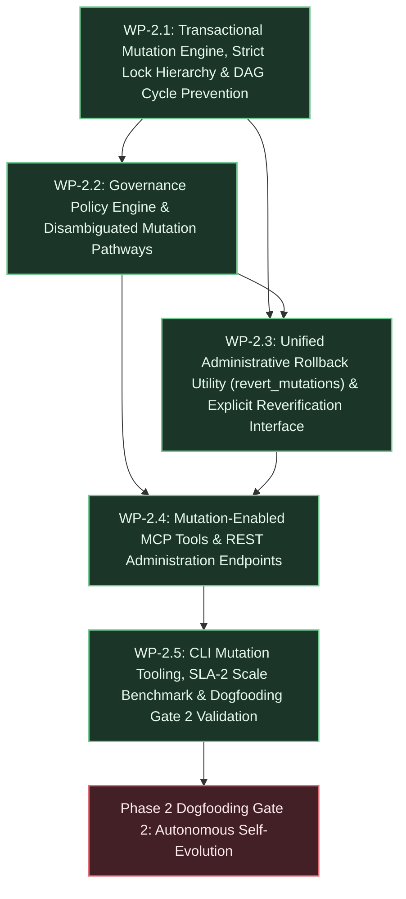

# Phase 2 Execution Plan: Bounded Agent Mutation & Per-Node Governance

## 1. Executive Summary & Deliverables Mapping

- **Primary Objective:** Enable external AI agents to submit candidate graph mutations (sub-tasks, refined specifications, test definitions) while enforcing per-node governance policies, non-negotiable identity attribution, strict lock acquisition hierarchies, and reversible, append-only auditability ([`strategic-planning-backlog.md` §2 Phase 2](file:///workspaces/tks/docs/vision/strategic-planning-backlog.md#L134)).
- **Target Gate / Milestone:** Dogfooding Milestone (Gate 2 - Autonomous Self-Evolution): Use external coding agents operating through MCP to author, review, and track Phase 3 preparation tasks, generate implementation sub-specs, and commit them directly to the substrate, satisfying Invariant [INV-6](file:///workspaces/tks/docs/vision/architecture.md#L91) ([`strategic-planning-backlog.md` §2 Gate 2](file:///workspaces/tks/docs/vision/strategic-planning-backlog.md#L147), [§3 Bootstrap Phasing Plan](file:///workspaces/tks/docs/vision/strategic-planning-backlog.md#L236)).

### Deliverable Traceability Matrix

| Core Deliverable (from Strategic Backlog §2 Phase 2) | Responsible Work Package(s) | Architecture / Technical References |
| :--- | :--- | :--- |
| **Deliverable 1: Mutation-Enabled MCP Tools & REST Gateways:** MCP tools `propose_node_mutation`, `create_subtask`, `update_node_status`, `revert_mutations`, and `reverify_node`, supporting polymorphic UUID and string `node_key` identifiers, caller authentication, token verification, and corresponding REST administrative endpoints | [WP-2.4](#wp-24-mutation-enabled-mcp-tools--rest-administration-endpoints) | [`architecture.md` §1 DR-3](file:///workspaces/tks/docs/vision/architecture.md#L19), [§3 INV-7](file:///workspaces/tks/docs/vision/architecture.md#L92), [§6 Interfaces & Contracts](file:///workspaces/tks/docs/vision/architecture.md#L488), [§9 D-6, D-7, D-19, D-58, D-73, D-76](file:///workspaces/tks/docs/vision/architecture.md#L630); [`technical-backlog.md` TB-4](file:///workspaces/tks/docs/vision/technical-backlog.md#L56), [TB-5](file:///workspaces/tks/docs/vision/technical-backlog.md#L81), [TB-7](file:///workspaces/tks/docs/vision/technical-backlog.md#L120) |
| **Deliverable 2: Autonomous Task Elaboration & Disambiguated Mutation Pathways:** Autonomous task elaboration under `AUTONOMOUS_ELABORATION` parent nodes creating non-normative execution tasks (`TASK`) directly in `ACTIVE` state with monotonic `event_seq`, transaction correlation `batch_id`, upward requirement ancestor CTE validation, default governance policy inheritance, and caller-scoped draft query visibility; native row-level locked in-place updates for active execution tasks; candidate draft staging for normative specifications; and ephemeral draft revision logging with atomic compaction on approval | [WP-2.1](#wp-21-transactional-mutation-engine-strict-lock-hierarchy--dag-cycle-prevention), [WP-2.2](#wp-22-governance-policy-engine--disambiguated-mutation-pathways) | [`architecture.md` §1 DR-5, DR-12, DR-17](file:///workspaces/tks/docs/vision/architecture.md#L21), [§3 INV-1, INV-2, INV-5, INV-7](file:///workspaces/tks/docs/vision/architecture.md#L86), [§5.1 State Ownership & Mutation Pathways](file:///workspaces/tks/docs/vision/architecture.md#L218), [§5.2 Concurrency Model](file:///workspaces/tks/docs/vision/architecture.md#L446), [§9 D-16, D-30, D-57, D-61, D-63, D-75, D-81](file:///workspaces/tks/docs/vision/architecture.md#L723); [`technical-backlog.md` TB-6](file:///workspaces/tks/docs/vision/technical-backlog.md#L95), [TB-7](file:///workspaces/tks/docs/vision/technical-backlog.md#L120) |
| **Deliverable 3: Append-Only Audit Ledger with Batch Correlation:** Monotonic sequence `event_seq BIGINT GENERATED ALWAYS AS IDENTITY PRIMARY KEY` with transaction correlation `batch_id UUID NOT NULL` linking operations committed within the same transaction or batch promotion, capturing actor attribution, snapshot payloads, and draft evolution summaries | [WP-2.1](#wp-21-transactional-mutation-engine-strict-lock-hierarchy--dag-cycle-prevention), [WP-2.2](#wp-22-governance-policy-engine--disambiguated-mutation-pathways), [WP-2.3](#wp-23-unified-administrative-rollback-utility-revert_mutations--explicit-reverification-interface) | [`architecture.md` §1 DR-4, DR-15](file:///workspaces/tks/docs/vision/architecture.md#L20), [§3 INV-2, INV-7](file:///workspaces/tks/docs/vision/architecture.md#L87), [§5.1 Audit Ledger DDL](file:///workspaces/tks/docs/vision/architecture.md#L316), [§9 D-4, D-45, D-65](file:///workspaces/tks/docs/vision/architecture.md#L612) |
| **Deliverable 4: Governance Policy Engine & Strict Lock Acquisition Hierarchy:** Storage repository governance engine (`src/storage/governance.rs`) evaluating per-node policies (`AUTONOMOUS_ELABORATION`, `HUMAN_REVIEW_REQUIRED`, `LOCKED`); strict lock acquisition hierarchy requiring global advisory lock `pg_advisory_xact_lock(hashtext('tks_structural_mutation'))` *before* row locks for structural mutations, DAG cycle checks, batch approvals, and rollbacks; and concurrent row-level locks (`SELECT ... FOR UPDATE`) for leaf attribute updates | [WP-2.1](#wp-21-transactional-mutation-engine-strict-lock-hierarchy--dag-cycle-prevention), [WP-2.2](#wp-22-governance-policy-engine--disambiguated-mutation-pathways) | [`architecture.md` §1 DR-5, DR-17](file:///workspaces/tks/docs/vision/architecture.md#L21), [§2 C-19](file:///workspaces/tks/docs/vision/architecture.md#L77), [§3 INV-5](file:///workspaces/tks/docs/vision/architecture.md#L90), [§5.2 Concurrency Model](file:///workspaces/tks/docs/vision/architecture.md#L450), [§9 D-8, D-10, D-20, D-30, D-38, D-51, D-66](file:///workspaces/tks/docs/vision/architecture.md#L648) |
| **Deliverable 5: Unified Administrative Rollback Utility (`revert_mutations`) & Explicit Reverification Interface:** Single polymorphic administrative endpoint and MCP tool `revert_mutations` with structured filters, dry-run previews under `READ COMMITTED`, and compensating inverse `REVERT` events under advisory lock with confirmation safety flags (`force`), cascading active child tasks to `NEEDS_REVERIFICATION`; paired with explicit reverification interface (`POST /api/v1/nodes/{id}/reverify` and `reverify_node`) validating active upstream dependencies and unblocking downstream execution loops | [WP-2.3](#wp-23-unified-administrative-rollback-utility-revert_mutations--explicit-reverification-interface), [WP-2.4](#wp-24-mutation-enabled-mcp-tools--rest-administration-endpoints) | [`architecture.md` §1 DR-4, DR-18](file:///workspaces/tks/docs/vision/architecture.md#L20), [§3 INV-1, INV-2](file:///workspaces/tks/docs/vision/architecture.md#L86), [§5.1 Rollback Cascade Mechanics & Reverification Interface](file:///workspaces/tks/docs/vision/architecture.md#L418), [§6 Interfaces](file:///workspaces/tks/docs/vision/architecture.md#L496), [§9 D-4, D-45, D-65, D-73, D-76, D-80](file:///workspaces/tks/docs/vision/architecture.md#L612) |
| **Deliverable 6: CLI Mutation Tooling, Scale Traversal Benchmarks & Dogfooding Gate 2 Validation:** User-facing operational CLI commands (`tks task create`, `tks task update`, `tks admin revert`, `tks admin reverify`); benchmark verifying SLA-2 Context Envelope Assembly Latency strictly $<100\text{ ms}$ at $10^5$ nodes in PostgreSQL; and end-to-end execution of Phase 2 MVD acceptance script (Steps 1–11) managing Phase 3 tasks via external agents | [WP-2.5](#wp-25-cli-mutation-tooling-sla-2-scale-benchmark--dogfooding-gate-2-validation) | [`architecture.md` §2 C-12](file:///workspaces/tks/docs/vision/architecture.md#L70), [§3 INV-6](file:///workspaces/tks/docs/vision/architecture.md#L91), [§8 Operational Model](file:///workspaces/tks/docs/vision/architecture.md#L551), [§9 D-14, D-53](file:///workspaces/tks/docs/vision/architecture.md#L702); [`strategic-planning-backlog.md` §4 Phase 2 MVD](file:///workspaces/tks/docs/vision/strategic-planning-backlog.md#L277), [§6 SLA-2, CAL-H1](file:///workspaces/tks/docs/vision/strategic-planning-backlog.md#L81) |

---

## 2. Work Package Dependency Flow



---

## 3. Work Package Specifications

### WP-2.1: Transactional Mutation Engine, Strict Lock Hierarchy & DAG Cycle Prevention

- **Goal & Scope:** Implement core transactional graph mutation foundations in `src/storage/mutation.rs` and `src/storage/repo.rs`. Implements the strict lock acquisition hierarchy: acquiring the global transaction advisory lock `pg_advisory_xact_lock(hashtext('tks_structural_mutation'))` *before* acquiring any row-level locks for structural mutations, DAG cycle checks, edge creation, and batch updates. Implements in-database DAG cycle detection via recursive CTEs traversing upward relationships (`FULFILLS`, `CONSTRAINED_BY`, `DERIVED_FROM`), rejecting cyclic edges with structured error `ERR_GRAPH_CYCLE_DETECTED`. Implements native PostgreSQL row-level locking (`SELECT ... FOR UPDATE`) for concurrent leaf attribute updates. Implements Invariant INV-1 ancestor path validation CTE for active requirement roots, polymorphic UUID and string `node_key` identifier resolution, and atomic batch correlation key (`batch_id UUID`) generation with monotonic `event_seq` assignment in `audit_ledger`. Strictly out of scope: policy enforcement logic (WP-2.2), rollback cascades (WP-2.3), or gateway/HTTP endpoints (WP-2.4).
- **Governing Directives & References:**
  - Constraints: [`architecture.md` §2 C-1](file:///workspaces/tks/docs/vision/architecture.md#L59) (Rust 2024), [C-2](file:///workspaces/tks/docs/vision/architecture.md#L60) (Single PostgreSQL engine), [C-18](file:///workspaces/tks/docs/vision/architecture.md#L76) (Polymorphic node keys), [C-19](file:///workspaces/tks/docs/vision/architecture.md#L77) (Strict lock acquisition hierarchy).
  - Invariants: [`architecture.md` §3 INV-1](file:///workspaces/tks/docs/vision/architecture.md#L86) (Unbroken requirement paths), [INV-2](file:///workspaces/tks/docs/vision/architecture.md#L87) (Append-only auditability, monotonic `event_seq`, `batch_id`), [INV-7](file:///workspaces/tks/docs/vision/architecture.md#L92) (Identity attribution, `created_by`).
  - Architectural Decisions: [`architecture.md` §9 D-8, D-20, D-38, D-66](file:///workspaces/tks/docs/vision/architecture.md#L648) (Strict lock acquisition hierarchy: global advisory lock before row locks), [D-21, D-32](file:///workspaces/tks/docs/vision/architecture.md#L768) (Surrogate `edge_id` and partial unique index on `graph_edges`), [D-30](file:///workspaces/tks/docs/vision/architecture.md#L848) (Native row locks for leaf attribute mutations), [D-45, D-65](file:///workspaces/tks/docs/vision/architecture.md#L985) (Monotonic `event_seq` and atomic `batch_id`), [D-50](file:///workspaces/tks/docs/vision/architecture.md#L1034) (Standardized upward edge orientation), [D-58](file:///workspaces/tks/docs/vision/architecture.md#L1121) (Polymorphic UUID / `node_key` resolution).
  - Technical Backlog: [`technical-backlog.md` TB-7](file:///workspaces/tks/docs/vision/technical-backlog.md#L120) (Polymorphic Identifier Resolution).
- **Inputs & Preconditions:** Working PostgreSQL schema from Phase 1 (`migrations/V1__initial_schema.sql` through `V3__ingestion_jobs_attributes.sql`); `StorageRepo` pool connection in `src/storage/repo.rs`.
- **Target Artifacts & Changes:**
  - Files / Modules:
    - [`src/storage/mutation.rs`](file:///workspaces/tks/src/storage/mutation.rs): Core mutation execution primitives, lock acquisition wrappers, recursive DAG cycle detection CTE, INV-1 ancestor CTE validation, and atomic audit logging.
    - [`src/storage/mod.rs`](file:///workspaces/tks/src/storage/mod.rs): Export mutation types, payload structs, error enums (`MutationError`), and function signatures.
    - [`src/storage/repo.rs`](file:///workspaces/tks/src/storage/repo.rs): Extend `StorageRepo` with mutation transaction methods (`execute_structural_mutation`, `update_leaf_attributes_locked`).
    - [`tests/mutation_engine.rs`](file:///workspaces/tks/tests/mutation_engine.rs): Integration test suite exercising lock serialization, cycle rejection, polymorphic resolution, and audit event sequencing.
  - Contracts / APIs / Interfaces:
    - `pub enum MutationError { CycleDetected { from_id: Uuid, to_id: Uuid }, NotFound(String), InvalidAncestorPath(String), GovernanceRejected(String), LockFailure(String), Database(tokio_postgres::Error), Serialization(serde_json::Error) }`
    - `pub struct StructuralMutationTx<'a>`: Encapsulates active PostgreSQL transaction holding `pg_advisory_xact_lock(hashtext('tks_structural_mutation'))`.
    - `pub async fn check_dag_cycle(client: &(impl tokio_postgres::GenericClient + ?Sized), from_id: Uuid, to_id: Uuid) -> Result<bool, StorageError>`
    - `pub async fn insert_structural_edge(client: &(impl tokio_postgres::GenericClient + ?Sized), from_id: Uuid, to_id: Uuid, edge_type: &str, created_by: &str, state: &str) -> Result<GraphEdge, MutationError>`
    - `pub async fn insert_audit_event(client: &(impl tokio_postgres::GenericClient + ?Sized), batch_id: Uuid, event_type: &str, entity_id: Uuid, entity_type: &str, actor_id: &str, actor_type: &str, token_fingerprint: &str, delta: serde_json::Value, snapshot: serde_json::Value) -> Result<i64, StorageError>`
- **Implementation Tasks:**
  1. Implement [`src/storage/mutation.rs`](file:///workspaces/tks/src/storage/mutation.rs) defining mutation data contracts (`NodeMutationPayload`, `EdgeMutationPayload`, `MutationResult`) and error taxonomy (`MutationError`).
  2. Implement `check_dag_cycle` executing a recursive CTE starting at `to_id` walking upward across `FULFILLS`, `CONSTRAINED_BY`, and `DERIVED_FROM` edges to verify `from_id` is never reachable, returning `true` if a cycle is detected.
  3. Implement transaction lifecycle helper `begin_structural_mutation` that starts a PostgreSQL transaction and immediately executes `SELECT pg_advisory_xact_lock(hashtext('tks_structural_mutation'))` before yielding the transaction handle (C-19, D-66).
  4. Implement `update_leaf_attributes_locked` executing `SELECT id FROM graph_nodes WHERE id = $1 FOR UPDATE` for non-structural leaf attribute mutations without holding the global advisory lock (D-30).
  5. Implement `insert_audit_event` writing to `audit_ledger` with generated or supplied `batch_id UUID`, monotonic `event_seq`, actor attributes (`actor_id`, `actor_type`, `token_fingerprint`), and snapshot payloads (D-45, D-65).
  6. Author comprehensive tests in [`tests/mutation_engine.rs`](file:///workspaces/tks/tests/mutation_engine.rs) proving cycle prevention (`A -> B -> C -> A` rejected with `ERR_GRAPH_CYCLE_DETECTED`), lock hierarchy ordering, and polymorphic UUID/`node_key` lookups.
- **Verification & Proof Criteria:**
  - Automated test execution: `cargo test --test mutation_engine` executes and passes cleanly.
  - Cycle detection test: Insertion of an edge creating a directed cycle between active or candidate nodes aborts with `MutationError::CycleDetected` and leaves graph topology unaltered.
  - Lock hierarchy verification: Concurrent execution of 20 structural mutations and 20 leaf attribute updates completes without deadlock abort cascades (`40P01`).

---

### WP-2.2: Governance Policy Engine & Disambiguated Mutation Pathways

- **Goal & Scope:** Implement the per-node governance policy engine and disambiguated mutation pathways in `src/storage/governance.rs` and `src/storage/mutation.rs`. Evaluates per-node governance policies (`AUTONOMOUS_ELABORATION`, `HUMAN_REVIEW_REQUIRED`, `LOCKED`; INV-5). Implements Pathway 1 (Autonomous Task Elaboration): permits verified agents to create non-normative execution tasks (`TASK`) directly in `ACTIVE` state with immediate commit to `audit_ledger` with monotonic `event_seq` and `batch_id`, inheriting the parent's `governance_policy` (`AUTONOMOUS_ELABORATION`) by default (D-57, D-63, D-81, TB-7.7) and stamped with `created_by` author attribution (INV-7, D-75). Implements Pathway 2 (Active Leaf Task Updates): executes status transitions (`OPEN`, `IN_PROGRESS`, `BLOCKED`, `COMPLETED`) directly in-place under native row lock (`FOR UPDATE`) with immediate append of discrete reversible audit events (D-30, D-57). Implements Pathway 3 (Normative Requirement Proposals): strictly prohibits in-place edits to active normative specifications (`REQUIREMENT`, `SPECIFICATION`), intercepting mutations and creating candidate entities in `lifecycle_state = 'DRAFT'` with `PENDING_REVIEW` policy (INV-2, INV-3, D-57). Implements Pathway 4 (Candidate Draft Evolution & Compaction): intermediate edits on `DRAFT` nodes append to `attributes->'draft_revisions'` JSONB array; atomic staging approval squashes draft history into `draft_evolution_summary` JSONB in `audit_ledger` upon approval (D-16, D-61). Strictly out of scope: administrative rollbacks (WP-2.3) or HTTP/MCP layer binding (WP-2.4).
- **Governing Directives & References:**
  - Constraints: [`architecture.md` §2 C-5](file:///workspaces/tks/docs/vision/architecture.md#L63) (Progressive JSONB layering), [C-13](file:///workspaces/tks/docs/vision/architecture.md#L71) (Draft lifecycle isolation), [C-20](file:///workspaces/tks/docs/vision/architecture.md#L78) (Conditional typing), [C-21](file:///workspaces/tks/docs/vision/architecture.md#L79) (Caller-scoped draft isolation).
  - Invariants: [`architecture.md` §3 INV-1](file:///workspaces/tks/docs/vision/architecture.md#L86) (Ancestors of elaborated tasks), [INV-2](file:///workspaces/tks/docs/vision/architecture.md#L87) (Immutability of active normative specifications), [INV-5](file:///workspaces/tks/docs/vision/architecture.md#L90) (Per-node governance policy authority & default policy inheritance), [INV-7](file:///workspaces/tks/docs/vision/architecture.md#L92) (Author attribution & caller draft isolation).
  - Architectural Decisions: [`architecture.md` §9 D-10, D-51](file:///workspaces/tks/docs/vision/architecture.md#L666) (Consolidation into storage layer), [D-16, D-61](file:///workspaces/tks/docs/vision/architecture.md#L723) (Draft evolution in `attributes->'draft_revisions'` and squash on approval), [D-30](file:///workspaces/tks/docs/vision/architecture.md#L848) (Row-level locking for tasks), [D-57](file:///workspaces/tks/docs/vision/architecture.md#L1108) (Disambiguated mutation pathways), [D-62](file:///workspaces/tks/docs/vision/architecture.md#L1165) (`chk_node_type` permitting `'UNCLASSIFIED'` in `DRAFT`), [D-63](file:///workspaces/tks/docs/vision/architecture.md#L1183) (Autonomous task elaboration directly to `ACTIVE` and caller draft visibility), [D-75](file:///workspaces/tks/docs/vision/architecture.md#L1302) (`created_by` author attribution), [D-81](file:///workspaces/tks/docs/vision/architecture.md#L1367) (Governance policy inheritance for elaborated tasks).
  - Technical Backlog: [`technical-backlog.md` TB-6](file:///workspaces/tks/docs/vision/technical-backlog.md#L95) (Vector Neighbor Fallback for Newly Elaborated Tasks), [TB-7](file:///workspaces/tks/docs/vision/technical-backlog.md#L120) (Governance Policy Inheritance for Autonomous Tasks).
- **Inputs & Preconditions:** Mutation engine primitives and lock hierarchy from WP-2.1; existing staging approval squash mechanics in `src/gateway/routes/staging.rs`.
- **Target Artifacts & Changes:**
  - Files / Modules:
    - [`src/storage/governance.rs`](file:///workspaces/tks/src/storage/governance.rs): Governance policy evaluator (`evaluate_governance_action`), policy transition rules, and permission checks.
    - [`src/storage/mutation.rs`](file:///workspaces/tks/src/storage/mutation.rs): Elaborate task pathway, active execution task status update pathway, normative draft creation pathway, and ephemeral draft revision appender.
    - [`src/storage/mod.rs`](file:///workspaces/tks/src/storage/mod.rs): Export governance enums (`GovernancePolicy`, `MutationPathway`, `TaskStatus`) and public storage APIs.
    - [`tests/governance_pathways.rs`](file:///workspaces/tks/tests/governance_pathways.rs): Integration test suite verifying all 4 mutation pathways, policy enforcement, policy inheritance, and draft squashing.
  - Contracts / APIs / Interfaces:
    - `pub enum GovernancePolicy { AutonomousElaboration, HumanReviewRequired, Locked }`
    - `pub enum TaskStatus { Open, InProgress, Blocked, Completed }`
    - `pub async fn elaborate_task(client: &mut deadpool_postgres::Client, parent_id: &str, title: &str, content: Option<&str>, attributes: Option<serde_json::Value>, actor: &AuthenticatedAgent) -> Result<ElaboratedTaskResult, MutationError>`
    - `pub async fn update_task_status(client: &mut deadpool_postgres::Client, task_id: &str, status: TaskStatus, notes: Option<&str>, actor: &AuthenticatedAgent) -> Result<TaskUpdateResult, MutationError>`
    - `pub async fn propose_normative_draft(client: &mut deadpool_postgres::Client, target_id: &str, title: Option<&str>, content: &str, attributes: Option<serde_json::Value>, actor: &AuthenticatedAgent) -> Result<DraftProposalResult, MutationError>`
    - `pub async fn mutate_draft_entity(client: &mut deadpool_postgres::Client, draft_id: &str, patch: serde_json::Value, actor: &AuthenticatedAgent) -> Result<DraftMutationResult, MutationError>`
- **Implementation Tasks:**
  1. Implement [`src/storage/governance.rs`](file:///workspaces/tks/src/storage/governance.rs) checking target node `governance_policy`: `LOCKED` rejects all mutations with `ERR_GOVERNANCE_LOCKED`; `HUMAN_REVIEW_REQUIRED` forces normative proposals to `DRAFT`; `AUTONOMOUS_ELABORATION` allows direct `TASK` activation.
  2. Implement `elaborate_task`: resolves parent node polymorphically; verifies parent allows elaboration; runs transactional CTE validating unbroken path to active requirement (INV-1); inserts `TASK` directly into `graph_nodes` with `lifecycle_state = 'ACTIVE'`, `governance_policy = 'AUTONOMOUS_ELABORATION'` (inherited from parent by default per D-81, TB-7.7), `created_by = actor.agent_id`; creates upward `FULFILLS` / `DERIVED_FROM` edge; commits discrete audit event to `audit_ledger` with monotonic `event_seq` and `batch_id`.
  3. Implement `update_task_status`: acquires row-level lock `SELECT id, lifecycle_state, node_type, governance_policy FROM graph_nodes WHERE id = $1 FOR UPDATE`; confirms `node_type = 'TASK'`; updates status in `attributes->'execution_status'`; writes state transition event directly to `audit_ledger` with monotonic `event_seq` and `batch_id` without touching draft revisions (D-57).
  4. Implement `propose_normative_draft`: rejects in-place updates if target is `ACTIVE` normative requirement (`REQUIREMENT`, `SPECIFICATION`); inserts new candidate node in `graph_nodes` with `lifecycle_state = 'DRAFT'`, `created_by = actor.agent_id`, `attributes->'replaces_node_id' = target_id`, and upward edge; returns `PENDING_REVIEW` result (INV-2, D-57).
  5. Implement `mutate_draft_entity`: updates draft node in-place; appends edit metadata patch to `attributes->'draft_revisions'` JSONB array; avoids emitting rows in `audit_ledger` (D-16, D-61).
  6. Author integration tests in [`tests/governance_pathways.rs`](file:///workspaces/tks/tests/governance_pathways.rs) validating each pathway under authenticated agent identities.
- **Verification & Proof Criteria:**
  - Automated test execution: `cargo test --test governance_pathways` executes and passes cleanly.
  - Autonomous elaboration test: External agent creates a `TASK` under an `AUTONOMOUS_ELABORATION` node; task is created in `ACTIVE` state, inherits `AUTONOMOUS_ELABORATION` policy, creates upward edge satisfying INV-1, and emits discrete audit event with `batch_id`.
  - Normative safety test: Attempt to update active requirement text in-place is intercepted; candidate node is created with `lifecycle_state = 'DRAFT'` and `created_by`, leaving the active requirement unmodified.
  - Active task status test: Updating an active task from `OPEN` to `IN_PROGRESS` and `COMPLETED` writes directly to `graph_nodes` under row lock and emits discrete `audit_ledger` rows without generating draft revisions.

---

### WP-2.3: Unified Administrative Rollback Utility (`revert_mutations`) & Explicit Reverification Interface

- **Goal & Scope:** Implement the unified administrative rollback utility (`src/storage/rollback.rs`) and explicit reverification interface (`src/storage/reverify.rs`). Implements unified `revert_mutations` accepting structured filter criteria (`batch_id`, `agent_id`, `since`, `event_seq_range`, `dry_run: Option<bool>`, `force: Option<bool>`) (D-45, D-65, D-73, D-80). When `dry_run = true`, performs recursive dependency sweep under `READ COMMITTED` and returns preview of affected nodes, keys, titles, and dependent agents without committing changes. When `dry_run = false`, acquires global advisory lock `pg_advisory_xact_lock(hashtext('tks_structural_mutation'))`; if cross-agent dependent tasks exist and `force != true`, halts with `ERR_CONFIRMATION_REQUIRED` and preview payload; if confirmed, appends compensating `REVERT` events with monotonic `event_seq` and new `batch_id`, transitions nodes to `SUPERSEDED`/`REVERTED`, marks edges `REVERTED` using surrogate `edge_id`, and cascades active child tasks to `NEEDS_REVERIFICATION` (INV-1, INV-2). Implements `reverify_node` (`src/storage/reverify.rs`): verifies all direct upstream dependencies are in `ACTIVE` state (INV-1), transitions node from `NEEDS_REVERIFICATION` to `ACTIVE`, resets `staleness_score = 0.0`, commits `REVERIFIED` audit event, and triggers vector re-indexing in `node_embeddings` if content modified (D-76). Strictly out of scope: UI rendering (Phase 3) or external VCS git commits (Phase 4).
- **Governing Directives & References:**
  - Invariants: [`architecture.md` §3 INV-1](file:///workspaces/tks/docs/vision/architecture.md#L86) (Requirement ancestors; exemption for `NEEDS_REVERIFICATION`), [INV-2](file:///workspaces/tks/docs/vision/architecture.md#L87) (Non-destructive rollback via compensating events, surrogate edge keys), [INV-7](file:///workspaces/tks/docs/vision/architecture.md#L92) (Identity attribution).
  - Architectural Decisions: [`architecture.md` §9 D-4, D-45, D-65](file:///workspaces/tks/docs/vision/architecture.md#L612) (Total event ordering via `event_seq`, batch correlation `batch_id`), [D-21, D-32](file:///workspaces/tks/docs/vision/architecture.md#L768) (Surrogate `edge_id` for collision-free edge reversion), [D-66](file:///workspaces/tks/docs/vision/architecture.md#L1214) (Advisory lock before row locks), [D-73](file:///workspaces/tks/docs/vision/architecture.md#L1284) (Unified `revert_mutations` interface), [D-76](file:///workspaces/tks/docs/vision/architecture.md#L1311) (Explicit reverification interface), [D-80](file:///workspaces/tks/docs/vision/architecture.md#L1358) (Dry-run preview and blast-radius confirmation via `force`).
  - Architecture: [`architecture.md` §5.1 Rollback Cascade Mechanics & Blast-Radius Containment](file:///workspaces/tks/docs/vision/architecture.md#L437), [§5.1 Reverification Interface & Operational Unblocking](file:///workspaces/tks/docs/vision/architecture.md#L418).
- **Inputs & Preconditions:** Mutation engine (WP-2.1) and governance pathways (WP-2.2); working `audit_ledger` with `event_seq` and `batch_id`.
- **Target Artifacts & Changes:**
  - Files / Modules:
    - [`src/storage/rollback.rs`](file:///workspaces/tks/src/storage/rollback.rs): Unified rollback implementation, dependency sweep CTE, dry-run preview generator, cross-agent dependency detector, and compensating `REVERT` event appender.
    - [`src/storage/reverify.rs`](file:///workspaces/tks/src/storage/reverify.rs): Node reverification logic, upstream active dependency validator, `REVERIFIED` audit event emitter, and vector re-enqueueing.
    - [`src/storage/mod.rs`](file:///workspaces/tks/src/storage/mod.rs): Export rollback and reverification request/response types.
    - [`tests/rollback_reverify.rs`](file:///workspaces/tks/tests/rollback_reverify.rs): Integration test suite validating dry-run rollback, blast-radius `force` abort, compensating transactions, cascading `NEEDS_REVERIFICATION`, and reverification unblocking.
  - Contracts / APIs / Interfaces:
    - `pub struct RevertFilter { pub batch_id: Option<Uuid>, pub agent_id: Option<String>, pub since: Option<chrono::DateTime<chrono::Utc>>, pub event_seq_range: Option<(i64, i64)>, pub dry_run: Option<bool>, pub force: Option<bool> }`
    - `pub struct RevertPreview { pub affected_nodes: Vec<Uuid>, pub affected_edges: Vec<Uuid>, pub cross_agent_dependencies: Vec<String>, pub total_events: usize }`
    - `pub struct RevertResult { pub batch_id: Uuid, pub reverted_events: usize, pub affected_nodes: Vec<Uuid>, pub cascade_reverified_nodes: Vec<Uuid> }`
    - `pub async fn revert_mutations(client: &mut deadpool_postgres::Client, filter: RevertFilter, actor: &AuthenticatedAgent) -> Result<RevertExecutionResult, MutationError>`
    - `pub async fn reverify_node(client: &mut deadpool_postgres::Client, node_id: &str, rationale: &str, updated_attributes: Option<serde_json::Value>, actor: &AuthenticatedAgent) -> Result<ReverifyResult, MutationError>`
- **Implementation Tasks:**
  1. Implement [`src/storage/rollback.rs`](file:///workspaces/tks/src/storage/rollback.rs): construct dynamic query matching target audit events by `batch_id`, `agent_id`, `since`, or `event_seq_range`.
  2. Implement downward recursive CTE traversing `FULFILLS`, `CONSTRAINED_BY`, and `DERIVED_FROM` to discover all active child entities dependent on targeted nodes.
  3. If `dry_run = true`, return `RevertPreview` without modifying data or taking advisory locks.
  4. If `dry_run = false`, acquire `pg_advisory_xact_lock(hashtext('tks_structural_mutation'))`; detect if any child tasks were authored by agents other than the targeted actor; if so and `force != true`, abort with `ERR_CONFIRMATION_REQUIRED` returning the preview.
  5. If confirmed, generate compensating inverse `REVERT` records in `audit_ledger` with monotonic `event_seq` and a shared rollback `batch_id`; transition live nodes to `SUPERSEDED` / `REVERTED`; transition edges to `REVERTED`; recursively transition active child nodes to `NEEDS_REVERIFICATION`.
  6. Implement [`src/storage/reverify.rs`](file:///workspaces/tks/src/storage/reverify.rs): resolve target node; verify direct upstream parents are in `ACTIVE` state (INV-1); update node `lifecycle_state = 'ACTIVE'` and `staleness_score = 0.0`; append `REVERIFIED` event to `audit_ledger`; enqueue embedding update in `node_embeddings` if content/attributes changed.
  7. Author integration tests in [`tests/rollback_reverify.rs`](file:///workspaces/tks/tests/rollback_reverify.rs) validating dry-run output, `force` rejection, cascading invalidation, and reverification recovery.
- **Verification & Proof Criteria:**
  - Automated test execution: `cargo test --test rollback_reverify` executes and passes cleanly.
  - Dry-run preview verification: Invoking rollback with `dry_run = true` returns accurate list of affected nodes and edges with zero mutations committed to database.
  - Safety confirmation verification: Attempting to revert a batch with dependent tasks from a second agent without `force = true` returns `ERR_CONFIRMATION_REQUIRED`; resubmitting with `force = true` succeeds.
  - Invalidation and reverification loop: Reverted parent transitions child task to `NEEDS_REVERIFICATION`; calling `reverify_node` restores child to `ACTIVE` and emits `REVERIFIED` event in `audit_ledger`.

---

### WP-2.4: Mutation-Enabled MCP Tools & REST Administration Endpoints

- **Goal & Scope:** Expose mutation, rollback, and reverification capabilities across both Model Context Protocol (MCP) JSON-RPC and Axum REST interfaces. Implements MCP tools in `src/gateway/mcp/tools.rs`: `propose_node_mutation`, `create_subtask`, `update_node_status`, `revert_mutations`, and `reverify_node`. Registers tools in `list_tools()` with strict JSON Schema definitions. Implements REST endpoints in `src/gateway/routes/`: `POST /api/v1/nodes/mutate`, `POST /api/v1/nodes/{id}/subtasks`, `PATCH /api/v1/nodes/{id}/status`, `POST /api/v1/admin/revert-mutations`, and `POST /api/v1/nodes/{id}/reverify`. Enforces caller authentication via Tower `AuthenticatedAgent` extractor (`src/gateway/auth.rs`), passing caller identity (`agent_id`, `actor_type`) into storage methods to satisfy Invariant INV-7 author attribution and `created_by` draft isolation. Updates stdio proxy routing in `src/gateway/mcp/mod.rs` to dispatch new tools. Strictly out of scope: supervisory web UI (Phase 3) or third-party webhooks (Phase 4).
- **Governing Directives & References:**
  - Constraints: [`architecture.md` §2 C-1](file:///workspaces/tks/docs/vision/architecture.md#L59) (Rust 2024), [C-2](file:///workspaces/tks/docs/vision/architecture.md#L60) (Single PostgreSQL engine), [C-3](file:///workspaces/tks/docs/vision/architecture.md#L61) (Stateless gateway), [C-18](file:///workspaces/tks/docs/vision/architecture.md#L76) (Polymorphic keys).
  - Invariants: [`architecture.md` §3 INV-1](file:///workspaces/tks/docs/vision/architecture.md#L86) (Ancestors of mutations), [INV-2](file:///workspaces/tks/docs/vision/architecture.md#L87) (Append-only auditability), [INV-5](file:///workspaces/tks/docs/vision/architecture.md#L90) (Per-node governance), [INV-7](file:///workspaces/tks/docs/vision/architecture.md#L92) (Mandatory identity attribution & token verification).
  - Architectural Decisions: [`architecture.md` §9 D-6](file:///workspaces/tks/docs/vision/architecture.md#L630) (Stateless MCP gateway), [D-7, D-19](file:///workspaces/tks/docs/vision/architecture.md#L639) (Unified Axum HTTP/SSE port), [D-39, D-49](file:///workspaces/tks/docs/vision/architecture.md#L927) (Tower auth middleware and Moka cache), [D-58](file:///workspaces/tks/docs/vision/architecture.md#L1121) (Polymorphic UUID / `node_key` resolution), [D-63](file:///workspaces/tks/docs/vision/architecture.md#L1183) (Autonomous elaboration tool dispatch), [D-73, D-80](file:///workspaces/tks/docs/vision/architecture.md#L1284) (Unified rollback tool / endpoint), [D-76](file:///workspaces/tks/docs/vision/architecture.md#L1311) (Reverification tool / endpoint).
  - Architecture: [`architecture.md` §6 Interfaces & Contracts](file:///workspaces/tks/docs/vision/architecture.md#L488) (`propose_node_mutation`, `revert_mutations`, `reverify_node`).
  - Technical Backlog: [`technical-backlog.md` TB-4](file:///workspaces/tks/docs/vision/technical-backlog.md#L56) (CLI Stdio Adapter Resilience), [TB-5](file:///workspaces/tks/docs/vision/technical-backlog.md#L81) (Identity Provisioning & Revocation), [TB-7](file:///workspaces/tks/docs/vision/technical-backlog.md#L120) (Polymorphic Resolution in Tools).
- **Inputs & Preconditions:** Storage mutation engine (WP-2.1), governance pathways (WP-2.2), and rollback/reverify engine (WP-2.3); existing Axum server and MCP dispatcher in `src/gateway/`.
- **Target Artifacts & Changes:**
  - Files / Modules:
    - [`src/gateway/mcp/tools.rs`](file:///workspaces/tks/src/gateway/mcp/tools.rs): Add tool handlers `handle_propose_node_mutation`, `handle_create_subtask`, `handle_update_node_status`, `handle_revert_mutations`, `handle_reverify_node`, and update `list_tools()`.
    - [`src/gateway/mcp/mod.rs`](file:///workspaces/tks/src/gateway/mcp/mod.rs): Route new tools in `process_jsonrpc_request` passing authenticated caller context.
    - [`src/gateway/routes/mutation.rs`](file:///workspaces/tks/src/gateway/routes/mutation.rs): REST route handlers for node mutations, subtasks, task status updates, rollbacks, and reverifications.
    - [`src/gateway/routes/mod.rs`](file:///workspaces/tks/src/gateway/routes/mod.rs): Export mutation routes.
    - [`src/gateway/mod.rs`](file:///workspaces/tks/src/gateway/mod.rs): Register REST routes in `create_router(state)`.
    - [`tests/mutation_api.rs`](file:///workspaces/tks/tests/mutation_api.rs): Integration test suite exercising new MCP tools and REST endpoints over HTTP/SSE and direct JSON-RPC.
  - Contracts / APIs / Interfaces:
    - MCP Tool: `propose_node_mutation(target_node_id: String, mutation_type: String, proposed_attributes: Option<Value>, proposed_content: Option<String>, edge_type: Option<String>)`
    - MCP Tool: `create_subtask(parent_node_id: String, title: String, content: Option<String>, attributes: Option<Value>)`
    - MCP Tool: `update_node_status(node_id: String, status: String, notes: Option<String>)`
    - MCP Tool: `revert_mutations(batch_id: Option<String>, agent_id: Option<String>, since: Option<String>, event_seq_range: Option<[i64; 2]>, dry_run: Option<bool>, force: Option<bool>)`
    - MCP Tool: `reverify_node(node_id: String, rationale: String, updated_attributes: Option<Value>)`
    - REST: `POST /api/v1/nodes/mutate` -> `{"status": "COMMITTED" | "PENDING_REVIEW", "node_id": Uuid, "batch_id": Uuid}`
    - REST: `POST /api/v1/nodes/{id}/subtasks` -> `{"task_id": Uuid, "node_key": String, "status": "ACTIVE", "batch_id": Uuid}`
    - REST: `PATCH /api/v1/nodes/{id}/status` -> `{"status": "UPDATED", "task_id": Uuid, "execution_status": String}`
    - REST: `POST /api/v1/admin/revert-mutations` -> `{"status": "REVERTED" | "PREVIEW", "reverted_events": usize, ...}`
    - REST: `POST /api/v1/nodes/{id}/reverify` -> `{"status": "ACTIVE", "node_id": Uuid, "staleness_score": 0.0}`
- **Implementation Tasks:**
  1. In [`src/gateway/mcp/tools.rs`](file:///workspaces/tks/src/gateway/mcp/tools.rs), implement `list_tools()` additions for the 5 new MCP tools with clear descriptions and strict JSON schema properties.
  2. Implement MCP handlers extracting and validating arguments, resolving polymorphic target identifiers, calling storage layer methods, and formatting JSON-RPC responses.
  3. Update [`src/gateway/mcp/mod.rs`](file:///workspaces/tks/src/gateway/mcp/mod.rs) to extract `AuthenticatedAgent` from SSE/POST session headers and pass down to tool handlers, ensuring unauthenticated tool requests fail with JSON-RPC error code `-32000` / `ERR_AUTH_FAILED` (INV-7).
  4. Create [`src/gateway/routes/mutation.rs`](file:///workspaces/tks/src/gateway/routes/mutation.rs) implementing REST handlers mapping requests to storage methods, returning appropriate HTTP status codes (200 OK, 201 Created, 202 Accepted, 400 Bad Request, 403 Forbidden, 409 Conflict).
  5. Register new routes in [`src/gateway/mod.rs`](file:///workspaces/tks/src/gateway/mod.rs).
  6. Author comprehensive tests in [`tests/mutation_api.rs`](file:///workspaces/tks/tests/mutation_api.rs) testing MCP JSON-RPC over `/mcp` and REST endpoints with valid and invalid tokens.
- **Verification & Proof Criteria:**
  - Automated test execution: `cargo test --test mutation_api` executes and passes cleanly.
  - MCP `tools/list` verification: Querying `tools/list` returns all 8 tools (3 read-only from Phase 1 + 5 mutation tools from Phase 2).
  - Unauthenticated rejection: Calling `propose_node_mutation` or `revert_mutations` without valid authorization bearer token fails with HTTP 401 / JSON-RPC error `-32000`.
  - Polymorphic routing: Calling `create_subtask` using either UUID or `node_key` successfully creates the task and returns consistent JSON structure.

---

### WP-2.5: CLI Mutation Tooling, SLA-2 Scale Benchmark & Dogfooding Gate 2 Validation

- **Goal & Scope:** Implement user-facing CLI operational commands for mutation and administration in `src/cli/` (`tks task create`, `tks task update`, `tks admin revert`, `tks admin reverify`), operating as thin HTTP clients calling the running `tks serve` daemon. Implement and execute the SLA-2 performance benchmark verifying Context Envelope Assembly Latency is strictly $<100\text{ ms}$ at $10^5$ nodes in PostgreSQL (`benches/context_envelope_bench.rs`). Implement and execute the end-to-end Dogfooding Milestone (Gate 2 - Autonomous Self-Evolution) acceptance suite in `tests/dogfood_gate2.rs`, automating Phase 2 MVD Acceptance Test Script Steps 1 through 11: agent authentication, autonomous elaboration, DAG cycle rejection, active task updates, normative draft staging, caller draft querying, staging draft squash, rollback dry-run, cross-agent confirmation safety abort, compensating execution, cascading invalidation, and reverification recovery, followed by using external agents via MCP to author and track Phase 3 preparatory tasks directly inside the substrate. Strictly out of scope: Phase 3 web portal or Phase 4 CI git commit integration.
- **Governing Directives & References:**
  - Constraints: [`architecture.md` §2 C-1](file:///workspaces/tks/docs/vision/architecture.md#L59) (Rust 2024), [C-2](file:///workspaces/tks/docs/vision/architecture.md#L60) (Single PostgreSQL engine), [C-6](file:///workspaces/tks/docs/vision/architecture.md#L64) (Phase 2 self-referential bootstrapping), [C-12](file:///workspaces/tks/docs/vision/architecture.md#L70) (Thin CLI HTTP clients), [C-18](file:///workspaces/tks/docs/vision/architecture.md#L76) (Polymorphic identifiers), [C-19](file:///workspaces/tks/docs/vision/architecture.md#L77) (Lock hierarchy).
  - Invariants: [`architecture.md` §3 INV-1](file:///workspaces/tks/docs/vision/architecture.md#L86) (Requirement traceability), [INV-2](file:///workspaces/tks/docs/vision/architecture.md#L87) (Reversibility & auditability), [INV-5](file:///workspaces/tks/docs/vision/architecture.md#L90) (Per-node governance), [INV-6](file:///workspaces/tks/docs/vision/architecture.md#L91) (Phased bootstrapping - Gate 2 Autonomous Self-Evolution), [INV-7](file:///workspaces/tks/docs/vision/architecture.md#L92) (Identity attribution).
  - Operational Metrics: [`strategic-planning-backlog.md` §6 SLA-2](file:///workspaces/tks/docs/vision/strategic-planning-backlog.md#L81) (Envelope Assembly Latency $<100\text{ ms}$ at $10^5$ nodes), [CAL-H1](file:///workspaces/tks/docs/vision/strategic-planning-backlog.md#L82) ($\ge 40\%$ contract violation reduction production target).
  - Strategic Backlog: [`strategic-planning-backlog.md` §2 Phase 2 Dogfooding Milestone (Gate 2 - Autonomous Self-Evolution)](file:///workspaces/tks/docs/vision/strategic-planning-backlog.md#L147), [§3 Bootstrap Phasing Plan (Phase 2+)](file:///workspaces/tks/docs/vision/strategic-planning-backlog.md#L236), [§4 Phase 2 MVD Acceptance Test Script (Steps 1–11)](file:///workspaces/tks/docs/vision/strategic-planning-backlog.md#L277).
  - Technical Backlog: [`technical-backlog.md` TB-4](file:///workspaces/tks/docs/vision/technical-backlog.md#L56) (CLI Stdio Adapter), [TB-5](file:///workspaces/tks/docs/vision/technical-backlog.md#L81) (Identity provisioning), [TB-6](file:///workspaces/tks/docs/vision/technical-backlog.md#L95) (Context envelope fallback), [TB-7](file:///workspaces/tks/docs/vision/technical-backlog.md#L120) (Polymorphic resolution & policy inheritance).
- **Inputs & Preconditions:** All previous work packages (WP-2.1 through WP-2.4) complete; running `tks serve` daemon with containerized PostgreSQL; Phase 1 dogfooded substrate graph loaded.
- **Target Artifacts & Changes:**
  - Files / Modules:
    - [`src/cli/task.rs`](file:///workspaces/tks/src/cli/task.rs): CLI subcommands: `tks task create`, `tks task update`, `tks task list`.
    - [`src/cli/admin.rs`](file:///workspaces/tks/src/cli/admin.rs): CLI subcommands: `tks admin revert [--dry-run] [--force]`, `tks admin reverify`.
    - [`src/cli/mod.rs`](file:///workspaces/tks/src/cli/mod.rs) & [`src/main.rs`](file:///workspaces/tks/src/main.rs): Register new CLI subcommands.
    - [`benches/context_envelope_bench.rs`](file:///workspaces/tks/benches/context_envelope_bench.rs): Benchmark measuring context envelope assembly latency under synthetic $10^5$ node graph (SLA-2).
    - [`tests/dogfood_gate2.rs`](file:///workspaces/tks/tests/dogfood_gate2.rs): Comprehensive end-to-end integration and dogfooding validation test executing Phase 2 MVD Steps 1–11 and self-authoring Phase 3 preparatory tasks.
  - Contracts / APIs / Interfaces:
    - CLI: `tks task create --parent <id_or_key> --title <title> [--content <text>]`
    - CLI: `tks task update <id_or_key> --status <OPEN|IN_PROGRESS|BLOCKED|COMPLETED> [--notes <notes>]`
    - CLI: `tks admin revert [--batch-id <id>] [--agent-id <id>] [--since <iso8601>] [--dry-run] [--force]`
    - CLI: `tks admin reverify <id_or_key> --rationale <text>`
- **Implementation Tasks:**
  1. Implement [`src/cli/task.rs`](file:///workspaces/tks/src/cli/task.rs) providing thin HTTP client subcommands for task creation and status updates targeting `tks serve`.
  2. Implement [`src/cli/admin.rs`](file:///workspaces/tks/src/cli/admin.rs) providing thin HTTP client subcommands for `revert` (supporting `--dry-run` and `--force`) and `reverify`.
  3. Update [`src/main.rs`](file:///workspaces/tks/src/main.rs) CLI parser (`clap`) to integrate `task` and `admin` subcommand trees.
  4. Implement [`benches/context_envelope_bench.rs`](file:///workspaces/tks/benches/context_envelope_bench.rs) populating a temporary PostgreSQL schema with $10^5$ synthetic nodes across hierarchical depths 1–6 with cross-cutting constraints, measuring `assemble_topological_envelope` latency across 100 random targets, verifying p95 $<100\text{ ms}$ (SLA-2).
  5. Implement [`tests/dogfood_gate2.rs`](file:///workspaces/tks/tests/dogfood_gate2.rs) automating the full Phase 2 MVD acceptance script (Steps 1–11):
     - Authenticate test agent `agent-runner-42`.
     - Elaborate sub-tasks under `AUTONOMOUS_ELABORATION` node `REQ-005` -> check direct `ACTIVE` creation, inherited policy, `audit_ledger` correlation `batch_id`.
     - Verify immediate `get_context_envelope` queryability for new task.
     - Attempt circular constraint edge -> assert `ERR_GRAPH_CYCLE_DETECTED`.
     - Update active task to `COMPLETED` -> verify row lock and immediate audit event.
     - Propose normative change to `REQ-006` (`HUMAN_REVIEW_REQUIRED`) -> verify candidate `DRAFT` staging.
     - Query caller draft subtree via `include_drafts: true`.
     - Approve draft -> verify atomic squash into `draft_evolution_summary` in `audit_ledger`.
     - Revert batch: test `dry_run = true` preview; test `force = false` confirmation abort; test `force = true` compensating commit.
     - Verify child task cascade to `NEEDS_REVERIFICATION`.
     - Reverify child task via `reverify_node` -> verify restoration to `ACTIVE` and `REVERIFIED` event.
     - Author and track real Phase 3 preparatory tasks (web explorer layout, cascade algorithms) directly in the substrate via MCP.
- **Verification & Proof Criteria:**
  - Automated test execution: `cargo test --test dogfood_gate2` executes and passes cleanly.
  - Scale benchmark verification: `cargo bench --bench context_envelope_bench` (or test runner) confirms envelope assembly latency is $<100\text{ ms}$ at $10^5$ nodes in PostgreSQL (SLA-2).
  - CLI subcommand verification: CLI commands `tks task create`, `tks task update`, `tks admin revert`, and `tks admin reverify` interact with running daemon and output structured feedback.
  - Dogfooding Milestone (Gate 2) Demonstration: External agents author, inspect, and transition Phase 3 preparation tasks within the substrate, proving autonomous self-evolution without human intervention for execution subtasks (Invariant INV-6).

---

## 4. Phase Verification & Exit Gate

### 4.1 Verification Checklist

- [x] All work package test suites passing cleanly across WP-2.1 through WP-2.5 (`cargo test --all-targets`).
- [x] Project linting, type-checking, and format checks pass cleanly with zero warnings/errors (`cargo fmt --check`, `cargo clippy --all-targets --all-features -- -D warnings`).
- [x] Strict lock acquisition hierarchy verified: global advisory lock `pg_advisory_xact_lock(hashtext('tks_structural_mutation'))` acquired *before* row locks on structural mutations, DAG cycle checks, batch approvals, and rollbacks ([D-66](file:///workspaces/tks/docs/vision/architecture.md#L1214)).
- [x] DAG cycle prevention verified: cyclic constraint or derivation edges rejected with `ERR_GRAPH_CYCLE_DETECTED` ([D-8](file:///workspaces/tks/docs/vision/architecture.md#L648)).
- [x] Disambiguated mutation pathways verified: autonomous task elaboration creates directly active tasks with inherited governance policy; leaf task updates lock rows via `SELECT ... FOR UPDATE` and commit discrete audit events; active normative specs require candidate drafts ([D-57](file:///workspaces/tks/docs/vision/architecture.md#L1108), [D-81](file:///workspaces/tks/docs/vision/architecture.md#L1367)).
- [x] Unified administrative rollback (`revert_mutations`) verified: dry-run previews return affected subgraphs; cross-agent dependencies require `force = true` confirmation; compensating transactions emit `REVERT` events with monotonic `event_seq` and cascade child nodes to `NEEDS_REVERIFICATION` ([D-73](file:///workspaces/tks/docs/vision/architecture.md#L1284), [D-80](file:///workspaces/tks/docs/vision/architecture.md#L1358)).
- [x] Explicit reverification interface (`reverify_node`) verified: checks active parents, restores node to `ACTIVE`, commits `REVERIFIED` event, and unblocks dependent tasks ([D-76](file:///workspaces/tks/docs/vision/architecture.md#L1311)).
- [x] Mutation MCP tools and REST endpoints verified with caller authentication and token verification ([INV-7](file:///workspaces/tks/docs/vision/architecture.md#L92), [TB-5](file:///workspaces/tks/docs/vision/technical-backlog.md#L81)).
- [x] SLA-2 Performance Target verified: Context Envelope Assembly Latency strictly $<100\text{ ms}$ at $10^5$ nodes in PostgreSQL ([SLA-2](file:///workspaces/tks/docs/vision/strategic-planning-backlog.md#L81)).
- [x] Dogfooding Milestone (Gate 2 - Autonomous Self-Evolution) successfully executed: External agents author, review, and track Phase 3 preparation tasks within the substrate itself ([INV-6](file:///workspaces/tks/docs/vision/architecture.md#L91)).

### 4.2 Gate / Milestone Demonstration

```bash
# 1. Verify containerized PostgreSQL with pgvector is healthy
docker compose -f .devcontainer/docker-compose.yml ps postgres

# 2. Verify standalone embedded database migration execution
cargo run --bin tks -- serve --migrate-only

# 3. Execute all unit, integration, and mutation test suites
cargo test --all-targets --all-features

# 4. Execute SLA-2 Context Envelope scale benchmark at 10^5 nodes
cargo bench --bench context_envelope_bench

# 5. Start the Knowledge Substrate daemon in the background
cargo run --bin tks -- serve --port 8080 &
SERVER_PID=$!
sleep 2

# 6. Execute Phase 2 Dogfooding Gate 2 acceptance validation suite
# (Automates MVD Steps 1-11: agent authentication, autonomous elaboration,
#  DAG cycle check rejection, active task updates, normative draft staging,
#  caller draft query isolation, staging draft squash, rollback dry-run,
#  cross-agent safety abort, compensating revert execution, cascading invalidation,
#  and reverification unblocking)
cargo test --test dogfood_gate2 -- --nocapture

# 7. Clean up background daemon
kill -9 $SERVER_PID
```

- **Expected Output / Observable Criteria:**
  - Standalone migration verifies database is up to date and terminates with exit code 0.
  - Scale benchmark confirms p95 context envelope assembly latency is $<100\text{ ms}$ at $10^5$ nodes in PostgreSQL (satisfying SLA-2).
  - Daemon startup binds `0.0.0.0:8080` hosting REST API and MCP SSE, initializing mutation handlers.
  - Dogfooding Gate 2 test completes all 11 steps against the substrate:
    - Agent creates sub-tasks under `AUTONOMOUS_ELABORATION` node directly in `ACTIVE` state with valid upward edges (INV-1), inherited `governance_policy`, and shared `batch_id` in `audit_ledger`.
    - Newly created task resolves immediately in `get_context_envelope`.
    - Circular edge attempt fails cleanly with `ERR_GRAPH_CYCLE_DETECTED`.
    - Active task status updates to `COMPLETED` under row lock (`FOR UPDATE`), recording discrete event to `audit_ledger`.
    - Normative requirement edit staged as `DRAFT` candidate stamped with `created_by`.
    - Speculative drafts queryable by author via `include_drafts: true` while isolated from default queries.
    - Draft approved and squashed into canonical `APPROVED` audit record with `draft_evolution_summary`.
    - Unified rollback `revert_mutations`: dry-run returns preview; `force = false` aborts with `ERR_CONFIRMATION_REQUIRED` on cross-agent dependencies; `force = true` commits compensating `REVERT` events.
    - Child tasks cascade to `NEEDS_REVERIFICATION`.
    - `reverify_node` restores child task to `ACTIVE` and commits `REVERIFIED` event.
    - External agents author and track Phase 3 preparation tasks within the substrate.
  - All automated checks report `test result: ok`.
