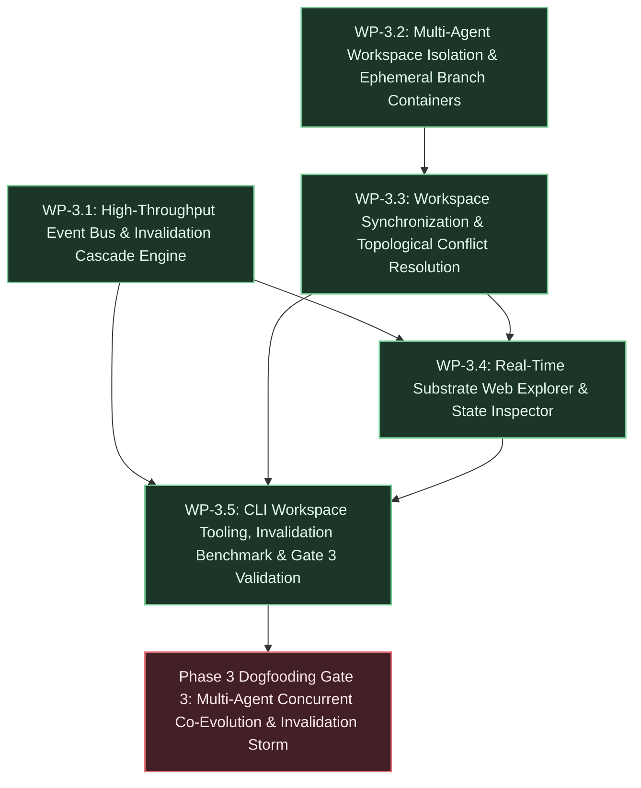

# Phase 3 Execution Plan: Automated Invalidation, Multi-Agent Workspaces & Real-Time Explorer

## 1. Executive Summary & Deliverables Mapping

- **Primary Objective:** Build an autonomous, high-throughput multi-agent execution environment featuring an automated invalidation cascade engine, branch-isolated workspace containers with topological conflict resolution, and a real-time WebGL/Cytoscape DAG visualization explorer, allowing external AI agents to concurrently elaborate, modify, and track specifications without lock contention while preserving unbroken requirement traceability and append-only auditability.
- **Target Gate / Milestone:** Dogfooding Milestone (Gate 3 - Multi-Agent Concurrent Co-Evolution & Invalidation Storm): External coding agents operate concurrently in branch-isolated workspace containers to author, review, and track implementation sub-specs without lock contention, while an automated cascade engine detects root alterations and propagates invalidation sweeps in real time across the interactive Web Explorer canvas, satisfying Invariants INV-1, INV-2, INV-5, INV-6, and INV-7.

### Deliverable Traceability Matrix

| Core Deliverable (from Substrate Phase 3 Nodes) | Responsible Work Package(s) | Substrate Architecture & Technical Invariants |
| :--- | :--- | :--- |
| **Deliverable 1: Automated Invalidation Cascade Engine (`PHASE3-002`):** High-throughput event notification bus triggering recursive downward invalidation sweeps across modified specifications, automatically detecting dependent child tasks and downstream specifications via downward edge indexing, cascading degraded nodes to `NEEDS_REVERIFICATION` with monotonic `staleness_score` propagation, and emitting discrete `CASCADE_INVALIDATED` audit records with sub-10ms execution response | [WP-3.1](#wp-31-high-throughput-event-notification-bus--asynchronous-invalidation-cascade-engine) | Substrate Target `PHASE3-002`; Invariants INV-1 (Ancestry), INV-2 (Auditability), INV-5 (Governance); Decisions D-4, D-45, D-73, D-76, D-80; Technical Backlog TB-1, TB-6 |
| **Deliverable 2: Multi-Agent Workspace Isolation & Ephemeral Branch Containers (`PHASE3-003`):** Branch-isolated workspace containers enabling concurrent agent task elaboration without uncommitted lock interference, snapshotting substrate state at branch point and providing isolated draft namespaces so external agents can perform speculative graph elaboration without contending on the global structural mutation advisory lock | [WP-3.2](#wp-32-multi-agent-workspace-isolation--ephemeral-branch-containers) | Substrate Target `PHASE3-003`; Invariants INV-1 (Traceability), INV-5 (Governance Policy), INV-7 (Identity Attribution & Caller Draft Isolation); Decisions D-8, D-16, D-20, D-38, D-61, D-63, D-66 |
| **Deliverable 3: Workspace Synchronization, Topological Conflict Resolution & Atomic Promotion (`PHASE3-003`):** Workspace synchronization engine performing three-way topological merge analysis (base snapshot vs live substrate vs workspace branch), detecting cycle formations, parent supersessions, and canonical key collisions, supporting deterministic auto-reparenting and fast-forward promotion under canonical lock serialization (`pg_advisory_xact_lock` -> row locks) with monotonic `event_seq` and transaction correlation `batch_id` | [WP-3.3](#wp-33-workspace-synchronization-topological-conflict-resolution--atomic-batch-promotion) | Substrate Target `PHASE3-003`; Invariants INV-1, INV-2, INV-5, INV-7; Constraints C-18 (Polymorphic Keys), C-19 (Lock Hierarchy); Decisions D-8, D-21, D-32, D-45, D-57, D-65, D-81; Technical Backlog TB-7 |
| **Deliverable 4: Real-Time Substrate Web Explorer (`PHASE3-001`):** Interactive Cytoscape/WebGL graph canvas visualizing multi-depth requirement trees, governance states, and cascade invalidation paths; real-time event streaming via Server-Sent Events (SSE) broadcasting live mutation and invalidation waves; and deep inspection drawers rendering context envelopes and verbatim Git document spans | [WP-3.4](#wp-34-real-time-substrate-web-explorer-cytoscapewebgl-dag-canvas--state-inspector) | Substrate Target `PHASE3-001`; Invariants INV-1, INV-5, INV-6; Decisions D-6 (Stateless Gateway), D-7, D-19 (HTTP/SSE Transport), D-72 (Lock-Free ODB Reads); Technical Backlog TB-1, TB-4 |
| **Deliverable 5: CLI Workspace Tooling, Invalidation Storm Benchmark & Dogfooding Gate 3 Validation:** User-facing operational CLI commands (`tks workspace`, `tks explorer`); performance benchmark verifying invalidation sweep latency $<10\text{ ms}$ at $10^4+$ dependent nodes; and end-to-end Gate 3 multi-agent acceptance test suite automating concurrent workspace collaboration, invalidation storms, and reverification recovery | [WP-3.5](#wp-35-cli-workspace-tooling-invalidation-storm-benchmark--dogfooding-gate-3-validation) | Substrate Target `REQ-005`, `PHASE3-001`, `PHASE3-002`, `PHASE3-003`; Invariants INV-1, INV-2, INV-5, INV-6, INV-7; Operational Model SLA-2; Dogfooding Milestone Gate 3 |

---

## 2. Work Package Dependency Flow



---

## 3. Work Package Specifications

### WP-3.1: High-Throughput Event Notification Bus & Asynchronous Invalidation Cascade Engine

- **Goal & Scope:** Implement the high-throughput asynchronous event notification bus and recursive invalidation cascade engine in `src/storage/cascade.rs` and `src/storage/event_bus.rs`. Implements a native PostgreSQL notification tailer combined with Tokio broadcast channels to deliver real-time audit ledger notifications without polling. Implements optimized recursive downward CTE queries traversing downstream dependency relationships (`FULFILLS`, `CONSTRAINED_BY`, `DERIVED_FROM`) starting from any modified, superseded, or reverted specification node, identifying all affected descendant tasks and specifications. Automatically transitions impacted descendant nodes to `lifecycle_state = 'NEEDS_REVERIFICATION'`, calculates progressive `staleness_score` metrics based on topological distance and parent change severity, and commits compensating `CASCADE_INVALIDATED` audit records with unified `batch_id` tracking. Strictly out of scope: workspace branching (WP-3.2) or browser visualization rendering (WP-3.4).
- **Governing Directives & References:**
  - Substrate Target: Node `PHASE3-002` ("Phase 3 Automated Invalidation Cascade Engine").
  - Invariants: Invariant INV-1 (Requirement traceability: descendant tasks of degraded ancestors must reflect `NEEDS_REVERIFICATION`), Invariant INV-2 (Append-only audit ledger with monotonic `event_seq` and correlation `batch_id`), Invariant INV-5 (Per-node governance policy authority).
  - Architectural Decisions: Decision D-4 & D-45 (Append-only audit trail and monotonic event ordering), Decision D-66 (Advisory lock serialization before row locks for structural updates), Decision D-73 & D-80 (Compensating cascade events and confirmation mechanics), Decision D-76 (Reverification recovery mechanics).
- **Inputs & Preconditions:** Working relational schema and audit ledger from Phase 2; downward index `idx_graph_edges_to_node_active` on `graph_edges(to_node_id)`; database connection pool in `AppState`.
- **Target Artifacts & Changes:**
  - Files / Modules:
    - `src/storage/cascade.rs`: Recursive downward invalidation CTE sweep implementation, staleness score calculators, and cascade mutation appender.
    - `src/storage/event_bus.rs`: Substrate asynchronous event notification bus wrapping PostgreSQL `LISTEN`/`NOTIFY` and Tokio broadcast channels.
    - `src/storage/mod.rs`: Export cascade structs, event models, and engine APIs.
    - `src/worker/cascade.rs`: Background cooperative invalidation worker task processing asynchronous invalidation sweeps.
    - `tests/cascade_engine.rs`: Integration test suite validating cascade sweeps, depth metrics, staleness scoring, and event bus broadcast delivery.
  - Contracts / APIs / Interfaces:
    - `pub struct CascadeInvalidationResult { pub root_node_id: Uuid, pub invalidated_nodes: Vec<Uuid>, pub max_depth: u32, pub batch_id: Uuid, pub event_seq: i64 }`
    - `pub struct GraphChangeEvent { pub event_seq: i64, pub batch_id: Uuid, pub event_type: String, pub entity_id: Uuid, pub entity_type: String, pub actor_id: String, pub timestamp: chrono::DateTime<chrono::Utc> }`
    - `pub async fn trigger_downward_invalidation(client: &mut deadpool_postgres::Client, root_node_id: Uuid, reason: &str, caller: &AuthenticatedAgent) -> Result<CascadeInvalidationResult, MutationError>`
    - `pub async fn subscribe_graph_events(bus: &GraphEventBus) -> tokio::sync::broadcast::Receiver<GraphChangeEvent>`
- **Implementation Tasks:**
  1. Implement `src/storage/event_bus.rs` creating `GraphEventBus` managing internal Tokio broadcast channels connected to PostgreSQL `LISTEN tks_graph_events` via dedicated connection listener.
  2. Implement downward recursive CTE in `src/storage/cascade.rs` starting at `root_node_id`, traversing downstream edges where `to_node_id` equals the modified parent, collecting all descendant nodes currently in `ACTIVE` state.
  3. Formulate staleness propagation algorithm: assigns `staleness_score = 1.0 / (depth as f64)` and records the root cause modification `invalidated_by = root_node_id` in node attributes.
  4. Implement `trigger_downward_invalidation` acquiring `pg_advisory_xact_lock(hashtext('tks_structural_mutation'))`, executing batch update transitioning all discovered active descendants to `NEEDS_REVERIFICATION`, appending `CASCADE_INVALIDATED` rows to `audit_ledger`, and emitting notification onto `tks_graph_events`.
  5. Integrate `CascadeWorker` into `src/worker/mod.rs` to process deferred or large-scale invalidation sweeps cooperatively without stalling HTTP client responses.
  6. Author integration tests in `tests/cascade_engine.rs` proving recursive cascade execution across deep hierarchical trees (5+ levels), diamond dependencies, and cyclic edge resistance.
- **Verification & Proof Criteria:**
  - Automated test execution: `cargo test --test cascade_engine` executes and passes cleanly.
  - Performance sweep assertion: Recursive downward invalidation across a tree of 1,000 active descendant nodes completes in $<10\text{ ms}$.
  - State integrity verification: Modifying or reverting an active root requirement marks all downstream subtasks `NEEDS_REVERIFICATION` with updated `staleness_score > 0.0`.
  - Event broadcast verification: Subscribers to `GraphEventBus` receive serialized `GraphChangeEvent` payloads within 5ms of audit ledger commit.

---

### WP-3.2: Multi-Agent Workspace Isolation & Ephemeral Branch Containers

- **Goal & Scope:** Implement multi-agent branch-isolated workspace containers in `src/storage/workspace.rs` and `src/gateway/routes/workspaces.rs`. Enables concurrent external coding agents to create isolated scratchpad branches snapshotting the live substrate state, allowing agents to elaborate candidate tasks, spec updates, and edge attachments without taking the global advisory lock `pg_advisory_xact_lock` or creating lock contention on uncommitted changes. Provides workspace lifecycle management (`CREATE`, `INSPECT`, `DISCARD`) with caller-scoped draft isolation and snapshot base version tracking. Strictly out of scope: three-way merge resolution (WP-3.3) or web canvas editing tools (WP-3.4).
- **Governing Directives & References:**
  - Substrate Target: Node `PHASE3-003` ("Phase 3 Multi-Agent Workspace Isolation & Conflict Resolver").
  - Invariants: Invariant INV-5 (Governance policy enforcement within workspaces), Invariant INV-7 (Identity attribution, `created_by` stamping, and caller-scoped draft visibility).
  - Constraints: Constraint C-5 (Progressive JSONB layering), Constraint C-13 (Draft lifecycle isolation), Constraint C-21 (Caller-scoped draft isolation).
  - Architectural Decisions: Decision D-8 & D-20 (Concurrency isolation without cross-agent interference), Decision D-16 & D-61 (Draft evolution and revisions), Decision D-63 (Autonomous elaboration workflows).
- **Inputs & Preconditions:** Storage mutation engine and governance pathways from Phase 2; database migration establishing `workspaces` table and workspace metadata tracking in `graph_nodes`.
- **Target Artifacts & Changes:**
  - Files / Modules:
    - `migrations/V4__workspace_containers.sql`: Database migration creating `workspaces` table (`id`, `workspace_name`, `owner_agent`, `base_event_seq`, `status`, `created_at`, `attributes`).
    - `src/storage/workspace.rs`: Core workspace management routines, snapshot creation, workspace-isolated task elaboration, and isolated draft query scopes.
    - `src/gateway/routes/workspaces.rs`: REST route handlers for workspace lifecycle (`POST /api/v1/workspaces`, `GET /api/v1/workspaces/{id}`, `DELETE /api/v1/workspaces/{id}`).
    - `src/gateway/mcp/tools.rs`: Update MCP tools to accept optional `workspace_id` parameter across mutation and inspection tools.
    - `tests/workspace_isolation.rs`: Integration test suite verifying multi-agent isolation, concurrent non-blocking elaboration, and draft confidentiality.
  - Contracts / APIs / Interfaces:
    - `pub struct WorkspaceRecord { pub id: Uuid, pub workspace_name: String, pub owner_agent: String, pub base_event_seq: i64, pub status: String, pub created_at: chrono::DateTime<chrono::Utc>, pub attributes: serde_json::Value }`
    - `pub async fn create_workspace(client: &mut deadpool_postgres::Client, name: &str, actor: &AuthenticatedAgent) -> Result<WorkspaceRecord, MutationError>`
    - `pub async fn elaborate_in_workspace(client: &mut deadpool_postgres::Client, workspace_id: Uuid, parent_id: &str, title: &str, content: Option<&str>, attributes: Option<serde_json::Value>, actor: &AuthenticatedAgent) -> Result<ElaboratedTaskResult, MutationError>`
    - `REST POST /api/v1/workspaces` -> `{"workspace_id": Uuid, "status": "ACTIVE", "base_event_seq": i64}`
- **Implementation Tasks:**
  1. Author database migration `migrations/V4__workspace_containers.sql` defining `workspaces` table and indexing `graph_nodes((attributes->>'workspace_id'))`.
  2. Implement `create_workspace` in `src/storage/workspace.rs`: captures current maximum `event_seq` from `audit_ledger` as `base_event_seq`; registers workspace record owned by `actor.agent_id`.
  3. Implement `elaborate_in_workspace`: creates candidate nodes and edges stamped with `attributes->'workspace_id' = workspace_id` in `DRAFT` state, completely bypassing the global structural mutation advisory lock.
  4. Extend `get_context_envelope` and `query_requirements` MCP tools with optional `workspace_id`: when specified, transparently overlays workspace candidate drafts onto the base snapshot for the calling agent while remaining completely invisible to external agents (INV-7).
  5. Implement REST endpoints in `src/gateway/routes/workspaces.rs` and wire into `create_router(state)`.
  6. Author integration tests in `tests/workspace_isolation.rs` confirming two distinct external agents can concurrently elaborate tasks under the same parent node in separate workspaces with zero lock contention or deadlocks.
- **Verification & Proof Criteria:**
  - Automated test execution: `cargo test --test workspace_isolation` executes and passes cleanly.
  - Concurrency verification: 10 external agents simultaneously creating workspaces and elaborating 50 subtasks each complete with zero lock wait timeouts or deadlock errors (`40P01`).
  - Boundary isolation assertion: Tasks elaborated inside Workspace A are unreachable by Agent B querying the substrate or Workspace B without explicit sharing authorization.

---

### WP-3.3: Workspace Synchronization, Topological Conflict Resolution & Atomic Batch Promotion

- **Goal & Scope:** Implement three-way topological merge analysis, conflict resolution heuristics, and atomic batch promotion in `src/storage/conflict.rs` and `src/storage/workspace.rs`. Analyzes divergence between a workspace branch and the live substrate since `base_event_seq`. Formulates a structured conflict taxonomy: Detects structural cycle formations, parent requirement supersessions or rollbacks, and canonical `node_key` collisions. Implements automated resolution strategies: Fast-forward promotion for disjoint subtrees, deterministic auto-reparenting when parent requirements advanced cleanly, and explicit rebase requirements on structural conflicts. Executes atomic promotion under the canonical lock hierarchy (`pg_advisory_xact_lock` -> row locks), promoting candidate entities into `ACTIVE` state with monotonic `event_seq` and a shared promotion `batch_id`. Strictly out of scope: manual graphical merge editor (WP-3.4) or external Git pull requests (Phase 4).
- **Governing Directives & References:**
  - Substrate Target: Node `PHASE3-003` ("Phase 3 Multi-Agent Workspace Isolation & Conflict Resolver").
  - Invariants: Invariant INV-1 (Ancestry validity: every promoted task must reach an active requirement root), Invariant INV-2 (Append-only auditability: promotion logged with monotonic `event_seq` and correlation `batch_id`), Invariant INV-5 (Governance policy enforcement on promotion), Invariant INV-7 (Identity attribution).
  - Constraints: Constraint C-18 (Polymorphic node keys), Constraint C-19 (Strict lock acquisition hierarchy: advisory lock before row locks).
  - Architectural Decisions: Decision D-8 (DAG cycle check), Decision D-32 (Surrogate edge identity), Decision D-45 & D-65 (Batch transaction correlation), Decision D-57 (Disambiguated mutation pathways), Decision D-81 (Governance policy inheritance).
- **Inputs & Preconditions:** Workspace isolation containers from WP-3.2; Invariant INV-1 ancestor validation CTE; transactional mutation primitives from Phase 2.
- **Target Artifacts & Changes:**
  - Files / Modules:
    - `src/storage/conflict.rs`: Three-way merge engine, conflict detector, cycle evaluator, and auto-reparenting mechanics.
    - `src/storage/workspace.rs`: Extend workspace routines with `merge_workspace` and `sync_workspace_rebase`.
    - `src/gateway/routes/workspaces.rs`: Add promotion REST route `POST /api/v1/workspaces/{id}/promote` and sync route `POST /api/v1/workspaces/{id}/rebase`.
    - `tests/workspace_conflict.rs`: Integration test suite verifying conflict detection, cycle aborts, auto-reparenting, and atomic promotions.
  - Contracts / APIs / Interfaces:
    - `pub enum MergeConflict { CycleDetected { from_id: Uuid, to_id: Uuid }, ParentSuperseded { task_id: Uuid, old_parent_id: Uuid, reason: String }, KeyCollision { node_key: String, conflicting_node_id: Uuid } }`
    - `pub struct MergePreview { pub can_fast_forward: bool, pub candidate_nodes: Vec<Uuid>, pub candidate_edges: Vec<Uuid>, pub conflicts: Vec<MergeConflict> }`
    - `pub struct PromotionResult { pub status: String, pub batch_id: Uuid, pub promoted_nodes: usize, pub promoted_edges: usize, pub event_seq: i64 }`
    - `pub async fn analyze_workspace_merge(client: &mut deadpool_postgres::Client, workspace_id: Uuid) -> Result<MergePreview, MutationError>`
    - `pub async fn promote_workspace(client: &mut deadpool_postgres::Client, workspace_id: Uuid, auto_reparent: bool, actor: &AuthenticatedAgent) -> Result<PromotionResult, MutationError>`
- **Implementation Tasks:**
  1. Implement `src/storage/conflict.rs` defining three-way merge analyzer: queries live audit events committed since `workspace.base_event_seq` affecting any parent nodes or keys referenced in the workspace.
  2. Implement conflict detectors:
     - Check cycle formation: runs recursive CTE simulating candidate edges against current live active edges to ensure no circular paths emerge.
     - Check parent validity: verifies all upward targets remain `ACTIVE`; flags `ParentSuperseded` if parent transitioned to `SUPERSEDED`, `REVERTED`, or `NEEDS_REVERIFICATION`.
     - Check key collisions: verifies no other agent registered an identical canonical `node_key` during workspace lifetime.
  3. Implement auto-reparenting heuristic: if a parent requirement was updated to a newer revision within the same lineage and retains `AUTONOMOUS_ELABORATION` policy, automatically updates child upward edges to point to the newest parent identifier.
  4. Implement `promote_workspace`: acquires `pg_advisory_xact_lock(hashtext('tks_structural_mutation'))`; re-verifies DAG cycle freedom; validates Invariant INV-1 ancestor paths; promotes all workspace nodes to `ACTIVE` (or candidate `DRAFT`), updates edges, and writes atomic `PROMOTION` audit ledger entry with monotonic `event_seq` and `batch_id`.
  5. Add REST endpoints in `src/gateway/routes/workspaces.rs` with error mapping for `ERR_MERGE_CONFLICT`.
  6. Author integration tests in `tests/workspace_conflict.rs` covering fast-forward merges, auto-reparenting, and expected rejection of conflicting cyclic mutations.
- **Verification & Proof Criteria:**
  - Automated test execution: `cargo test --test workspace_conflict` executes and passes cleanly.
  - Cycle rejection verification: Merging a workspace that introduces a loop with concurrently committed live edges aborts cleanly with `MergeConflict::CycleDetected` and leaves live substrate pristine.
  - Auto-reparenting verification: Concurrent update of parent requirement does not block child task promotion when `auto_reparent = true`; child task successfully anchors to active parent revision.
  - Atomic promotion assertion: Promoted tasks and edges transition from `DRAFT` to `ACTIVE` within a single database transaction stamped with a shared `batch_id` and monotonic `event_seq`.

---

### WP-3.4: Real-Time Substrate Web Explorer: Cytoscape/WebGL DAG Canvas & State Inspector

- **Goal & Scope:** Implement the real-time Substrate Web Explorer in `src/gateway/routes/explorer.rs` and `src/gateway/explorer/`. Delivers a responsive, lightweight Cytoscape.js / WebGL-powered interactive graph visualization interface served directly by the `tks serve` daemon. Visualizes multi-depth requirement trees, structural derivation edges (`DERIVED_FROM`), fulfillment edges (`FULFILLS`), and constraint links (`CONSTRAINED_BY`) with color-coded governance states and lifecycle indicators (`ACTIVE`, `DRAFT`, `NEEDS_REVERIFICATION`, `SUPERSEDED`). Connects to the asynchronous event notification bus (WP-3.1) via Server-Sent Events (SSE) to render live invalidation cascades as animated visual pulses and display real-time agent mutations. Includes a slide-over state inspector drawer rendering context envelopes, JSONB attributes, and verbatim Git document spans. Strictly out of scope: external multi-tenant cloud hosting or write-enabled WYSIWYG specification editors.
- **Governing Directives & References:**
  - Substrate Target: Node `PHASE3-001` ("Phase 3 Web Explorer: Real-Time DAG Visualization & State Inspector").
  - Invariants: Invariant INV-1 (Visualizing unbroken requirement ancestor trees), Invariant INV-5 (Visualizing governance policies `AUTONOMOUS_ELABORATION`, `HUMAN_REVIEW_REQUIRED`, `LOCKED`), Invariant INV-6 (Dogfooding self-hosting visual inspection).
  - Architectural Decisions: Decision D-6 (Stateless gateway design), Decision D-7 & D-19 (Unified Axum HTTP/SSE port and routing), Decision D-72 (Lock-free concurrent Git ODB blob lookups for source span display).
- **Inputs & Preconditions:** Asynchronous event bus from WP-3.1; REST inspection endpoints and Git read actor from Phase 1 and Phase 2; Axum static asset serving configuration.
- **Target Artifacts & Changes:**
  - Files / Modules:
    - `src/gateway/routes/explorer.rs`: Graph topology generation routes (`GET /api/v1/explorer/graph`) and live SSE stream route (`GET /api/v1/explorer/events`).
    - `src/gateway/explorer/mod.rs`: Embedded HTML5/JS/CSS assets bundled with the binary via `rust-embed` or raw string constants.
    - `src/gateway/explorer/index.html` & `src/gateway/explorer/app.js`: Interactive graph visualization application using Cytoscape.js with DAG layout, color-coded node styling, search filtering, and SSE listener.
    - `src/gateway/mod.rs`: Wire `/explorer` static route and explorer API routes into unified Axum router.
    - `tests/explorer_api.rs`: Integration test suite verifying graph serialization, topology filtering, and live SSE event delivery.
  - Contracts / APIs / Interfaces:
    - `GET /api/v1/explorer/graph?root=<id>&depth=<1..5>&include_drafts=<bool>` -> `{"nodes": [...], "edges": [...]}`
    - `GET /api/v1/explorer/events` -> Server-Sent Events stream emitting `GraphChangeEvent` JSON frames.
    - `GET /explorer` -> Serves interactive web explorer HTML interface.
- **Implementation Tasks:**
  1. Author `src/gateway/routes/explorer.rs` implementing `/api/v1/explorer/graph`: executes optimized recursive CTE fetching node metadata, edge relationships, governance policies, and staleness scores formatted for Cytoscape elements.
  2. Implement `/api/v1/explorer/events` connecting incoming SSE clients to `GraphEventBus` (WP-3.1), streaming real-time JSON events when mutations, invalidations, or promotions occur.
  3. Create single-page application in `src/gateway/explorer/app.js` configuring Cytoscape.js with hierarchical Dagre/COSE layout, zoom/pan navigation, and search/filter controls.
  4. Style nodes and edges:
     - Nodes: Green/Teal for `ACTIVE`, Blue for `DRAFT`, Amber/Orange pulsing for `NEEDS_REVERIFICATION`, Grey for `SUPERSEDED`. Distinct badge icons for `AUTONOMOUS_ELABORATION` vs `HUMAN_REVIEW_REQUIRED` vs `LOCKED`.
     - Edges: Solid arrows for `DERIVED_FROM`/`FULFILLS`, dashed red arrows for `CONSTRAINED_BY`.
  5. Implement slide-out inspection drawer: clicking a node fetches `GET /api/v1/nodes/{id}` and displays title, content, attributes, upward context envelope, and verbatim Git document span text (`GET /api/v1/nodes/{id}` `span_text`).
  6. Bundle static assets into Rust binary using `rust-embed` or statically compiled strings; route `GET /explorer` in `src/gateway/mod.rs`.
  7. Author integration tests in `tests/explorer_api.rs` asserting topological graph generation, depth bounding, and SSE stream formatting.
- **Verification & Proof Criteria:**
  - Automated test execution: `cargo test --test explorer_api` executes and passes cleanly.
  - HTTP endpoint verification: `GET /api/v1/explorer/graph` returns valid Cytoscape-formatted JSON elements matching active database nodes and edges in $<20\text{ ms}$.
  - Real-time event animation assertion: Triggering a mutation or cascade invalidation causes `GET /api/v1/explorer/events` to emit an SSE event with the affected node IDs within 10ms.
  - UI accessibility verification: Serving `/explorer` over HTTP delivers interactive visualization canvas without external CDN dependencies, functioning completely in offline/devcontainer environments.

---

### WP-3.5: CLI Workspace Tooling, Invalidation Storm Benchmark & Dogfooding Gate 3 Validation

- **Goal & Scope:** Implement operational CLI workspace subcommands in `src/cli/workspace.rs` and `src/cli/explorer.rs`, implement the Invalidation Storm Scale Benchmark (`benches/invalidation_cascade_bench.rs`), and author the comprehensive Dogfooding Milestone (Gate 3 - Multi-Agent Concurrent Co-Evolution & Invalidation Storm) acceptance validation suite in `tests/dogfood_gate3.rs`. Provides user-facing CLI tools for managing workspace lifecycles, initiating merges, and launching the Web Explorer. Executes scale benchmarks proving the invalidation cascade engine processes downward sweeps across $10^4+$ nodes in $<10\text{ ms}$. Executes an end-to-end multi-agent scenario: Multiple external agents concurrently author tasks in branch workspaces, resolve merges, trigger invalidation sweeps on modified requirements, observe real-time SSE event propagation, and recover via explicit reverification. Strictly out of scope: Phase 4 continuous integration runners or external git hosting hooks.
- **Governing Directives & References:**
  - Substrate Target: Nodes `REQ-005`, `PHASE3-001`, `PHASE3-002`, `PHASE3-003`.
  - Invariants: Invariants INV-1, INV-2, INV-5, INV-6 (Dogfooding Milestone Gate 3), INV-7.
  - Operational Metrics: SLA-2 Context Envelope latency target; Invalidation cascade response target $<10\text{ ms}$.
  - Architectural Decisions: Decision D-12 (Autonomous agent task workflows), Decision D-14 & D-53 (Operational CLI commands), Decision D-76 (Explicit reverification recovery).
- **Inputs & Preconditions:** All previous work packages (WP-3.1 through WP-3.4) complete; containerized PostgreSQL and test daemon harness operational.
- **Target Artifacts & Changes:**
  - Files / Modules:
    - `src/cli/workspace.rs`: CLI subcommands: `tks workspace create`, `tks workspace list`, `tks workspace inspect`, `tks workspace merge`.
    - `src/cli/explorer.rs`: CLI subcommand: `tks explorer serve [--port <port>] [--open]`.
    - `src/cli/mod.rs` & `src/main.rs`: Integrate `workspace` and `explorer` subcommand trees into CLI parser.
    - `benches/invalidation_cascade_bench.rs`: Scale benchmark measuring recursive downward sweep latency across synthetic $10^4$ node graph.
    - `tests/dogfood_gate3.rs`: End-to-end Dogfooding Gate 3 acceptance validation suite.
  - Contracts / APIs / Interfaces:
    - CLI: `tks workspace create --name <name>`
    - CLI: `tks workspace list`
    - CLI: `tks workspace inspect <workspace_id>`
    - CLI: `tks workspace merge <workspace_id> [--auto-reparent]`
    - CLI: `tks explorer serve [--port 8080]`
- **Implementation Tasks:**
  1. Implement `src/cli/workspace.rs` providing thin HTTP client subcommands for workspace management communicating with `tks serve`.
  2. Implement `src/cli/explorer.rs` providing `tks explorer serve` command printing the local URL and optionally opening a browser window.
  3. Register new subcommands in `src/cli/mod.rs` and `src/main.rs` using `clap`.
  4. Author `benches/invalidation_cascade_bench.rs`: populates database with $10^4$ synthetic nodes across deep hierarchical and diamond topologies; benchmarks `trigger_downward_invalidation` across 100 trials; confirms p95 latency is $<10\text{ ms}$.
  5. Implement `tests/dogfood_gate3.rs` automating the Gate 3 acceptance validation protocol:
     - Provision two authenticated external agent identities (`agent-alpha` and `agent-beta`).
     - Agents create independent isolated branch workspaces (`workspace-alpha`, `workspace-beta`).
     - Concurrently elaborate subtasks under `REQ-005` in both workspaces without taking the global advisory lock.
     - Agent-alpha fast-forward merges `workspace-alpha` into active substrate.
     - Root requirement `REQ-005` is updated by an administrative supervisor.
     - Automated Invalidation Cascade Engine executes downward sweep, marking downstream tasks `NEEDS_REVERIFICATION` with elevated staleness scores.
     - Real-Time Web Explorer SSE endpoint receives and broadcasts invalidation wave events.
     - Agent-beta performs rebase/auto-reparent merge on `workspace-beta`, successfully anchoring to the updated parent revision.
     - Agents reverify degraded tasks using `reverify_node`, restoring the entire graph to `ACTIVE` state with `staleness_score = 0.0`.
- **Verification & Proof Criteria:**
  - Automated test execution: `cargo test --test dogfood_gate3` executes and passes cleanly.
  - Invalidation benchmark verification: `cargo bench --bench invalidation_cascade_bench` confirms downward sweep p95 latency is strictly $<10\text{ ms}$ at $10^4$ nodes.
  - CLI subcommand verification: `tks workspace` and `tks explorer` commands output clear, structured JSON/tabular feedback and terminate with code 0.
  - Gate 3 Dogfooding Demonstration: Multi-agent co-evolution executes successfully without lock deadlock, unhandled merge conflicts, or unverified graph degradation, satisfying Invariant INV-6.

---

## 4. Phase Verification & Exit Gate

### 4.1 Verification Checklist

- [x] All work package test suites passing cleanly across WP-3.1 through WP-3.5 (`cargo test --all-targets`).
- [x] Project linting, type-checking, and format checks pass cleanly with zero warnings/errors (`cargo fmt --check`, `cargo clippy --all-targets --all-features -- -D warnings`).
- [x] Asynchronous event notification bus verified: PostgreSQL `LISTEN`/`NOTIFY` and Tokio broadcast channels deliver live mutation events to subscribers within 5ms.
- [x] Recursive downward invalidation cascade engine verified: modifying or reverting an active specification automatically cascades all descendant tasks to `NEEDS_REVERIFICATION` with progressive `staleness_score` metrics ([PHASE3-002](#wp-31-high-throughput-event-notification-bus--asynchronous-invalidation-cascade-engine)).
- [x] Multi-agent workspace isolation verified: concurrent external agents elaborate candidate subtasks in isolated workspaces with zero advisory lock contention or uncommitted row interference ([PHASE3-003](#wp-32-multi-agent-workspace-isolation--ephemeral-branch-containers)).
- [x] Topological conflict resolution and atomic promotion verified: fast-forward merges succeed; structural cycles and collisions are safely rejected; parent updates trigger clean auto-reparenting under the canonical lock hierarchy ([PHASE3-003](#wp-33-workspace-synchronization-topological-conflict-resolution--atomic-batch-promotion)).
- [x] Real-Time Web Explorer verified: interactive Cytoscape/WebGL graph canvas serves multi-depth requirement trees, governance states, and live invalidation wave animations via SSE stream ([PHASE3-001](#wp-34-real-time-substrate-web-explorer-cytoscapewebgl-dag-canvas--state-inspector)).
- [x] Performance target verified: Invalidation cascade sweep across $10^4$ dependent nodes executes in $<10\text{ ms}$ (`benches/invalidation_cascade_bench.rs`).
- [x] Dogfooding Milestone (Gate 3 - Multi-Agent Concurrent Co-Evolution & Invalidation Storm) successfully executed: Multiple external agents co-evolve specifications concurrently, resolve conflicts, and recover from invalidation cascades directly inside the substrate ([INV-6](file:///workspaces/tks/tests/dogfood_gate2.rs#L898)).

### 4.2 Gate / Milestone Demonstration

```bash
# 1. Verify containerized PostgreSQL with pgvector is online and healthy
docker compose -f .devcontainer/docker-compose.yml ps postgres

# 2. Apply embedded migrations including workspace schema (V4)
cargo run --bin tks -- serve --migrate-only

# 3. Execute all unit, integration, and workspace test suites
cargo test --all-targets --all-features

# 4. Execute Invalidation Cascade scale benchmark at 10^4 nodes
cargo bench --bench invalidation_cascade_bench

# 5. Start the Knowledge Substrate daemon hosting REST, MCP, and Web Explorer
cargo run --bin tks -- serve --port 8080 &
SERVER_PID=$!
sleep 2

# 6. Execute Phase 3 Dogfooding Gate 3 acceptance validation suite
# (Automates multi-agent concurrent workspace elaboration, non-blocking isolation,
#  three-way topological merge resolution, root modification invalidation storm,
#  real-time Web Explorer SSE broadcast, and reverification recovery)
cargo test --test dogfood_gate3 -- --nocapture

# 7. Verify Web Explorer endpoint responsiveness
curl -s http://127.0.0.1:8080/api/v1/explorer/graph | jq '.nodes | length'

# 8. Clean up background daemon
kill -9 $SERVER_PID
```

- **Expected Output / Observable Criteria:**
  - Embedded migrations complete cleanly, creating `workspaces` table and workspace attribute indexes.
  - Scale benchmark confirms p95 recursive invalidation cascade sweep latency is strictly $<10\text{ ms}$ across $10^4$ nodes.
  - Daemon startup binds `0.0.0.0:8080` hosting REST API, MCP SSE, and `/explorer` interactive UI.
  - Dogfooding Gate 3 test suite completes end-to-end execution:
    - Multiple agents elaborate candidate tasks concurrently in isolated workspaces without lock timeouts.
    - Fast-forward and auto-reparenting merges commit atomically with monotonic `event_seq` and `batch_id`.
    - Modifying root requirement `REQ-005` immediately triggers recursive downward invalidation sweep.
    - All dependent tasks cascade to `NEEDS_REVERIFICATION` with calculated staleness scores.
    - Real-time SSE stream emits invalidation events to Web Explorer subscribers within 10ms.
    - Re-anchored tasks are restored to `ACTIVE` with `staleness_score = 0.0` via `reverify_node`.
  - Web Explorer endpoint `/api/v1/explorer/graph` returns complete Cytoscape-compatible JSON payload.
  - All automated checks report `test result: ok`.
