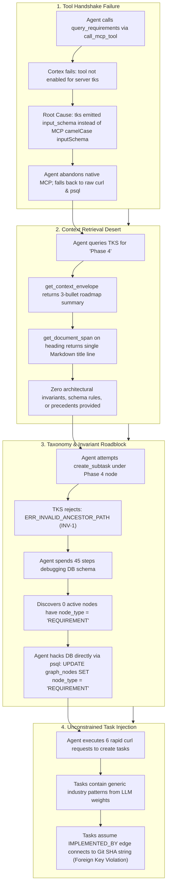
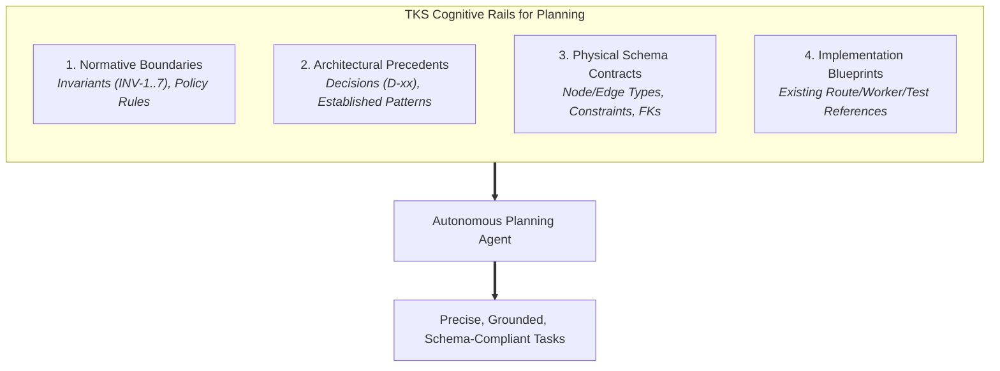

# Architectural Review & Post-Mortem: Autonomous Phase 4 Elaboration Experiment

**Document Version:** 1.0.0  
**Date:** 2026-10-04  
**Author:** TKS Core Architecture Team & Antigravity Pair  
**Status:** Approved for Review & Architectural Incorporation  

---

## 1. Executive Summary & Paradigm Shift

The Phase 4 dogfooding experiment was the first attempt to have an autonomous AI agent (running via the Antigravity CLI, `agy`) use the Knowledge Substrate (TKS) as its **sole source of truth** to elaborate execution tasks for a new development phase without reading the source Markdown files in `docs/vision/`.

The human supervisor intervened and denied the implementation approval step because the resulting tasks appeared shallow, disconnected from the established codebase, and dependent on generic web development guesses (such as GitHub-specific headers, ad-hoc regex commit parsing, generic JUnit XML, and an ungrounded outbound webhook daemon).

### The Core Architectural Realization

It is easy to critique the agent for making mistakes or "guessing." **That is the wrong diagnosis.**

The foundational premise of the Knowledge Substrate is that commodity LLMs will inevitably drift, hallucinate, and fall back to broad internet training data unless they are placed on **strict cognitive rails**—fed bounded, precise, schema-compliant, and topologically relevant context.

**TKS failed to serve the agent.**

When the agent turned to TKS for guidance on Phase 4, TKS provided:

1. A broken tool communication channel (`input_schema` serialization bug).
2. An information desert: a single node with three high-level roadmap bullet points, stripped of all architectural invariants, design decisions, database schemas, and precedents.
3. A broken graph taxonomy (zero `REQUIREMENT` nodes in the database), followed by a cryptic invariant failure (`ERR_INVALID_ANCESTOR_PATH`) that provided zero diagnostic or remediation guidance.
4. An unconstrained mutation interface that allowed the agent to commit schema-violating edge assumptions (`task -> commit_sha_string`) without validation.

This document analyzes the gap between what TKS provided and what the agent needed, formulates the architectural evolutions required to make TKS an effective planning guide, and incorporates the tactical fixes implemented during the experiment as permanent architectural decisions (`D-91` through `D-94`).

---

## 2. Forensic Post-Mortem: What Happened in the Experiment

An audit of the agent's full execution transcript (`223e9a59-916b-4c49-911a-d08f438f0b75`) reveals four distinct breakdowns:



### 2.1 The Tooling Breakdown (MCP Protocol Conformance)

When `agy` connected to `tks mcp-stdio`, `tools/list` serialized its schema under the snake_case key `input_schema`. Under the official Model Context Protocol (MCP 2024-11-05 spec), this field must be camelCase **`inputSchema`**. Because `inputSchema` was absent, `agy` saved local schema files with `"parameters": null`. When the agent invoked `call_mcp_tool`, Antigravity's permission sandbox rejected the call because tools with null parameters are considered invalid. This forced the agent to bypass the MCP tool boundary entirely and script raw `curl` and `psql` commands.

### 2.2 The Context Retrieval Deficit

TKS's primary query tool, `get_context_envelope`, was designed around **leaf-task implementation** (retrieving immediate upward parent requirements, sibling constraints, and semantic vector neighbors).

When used for **strategic planning and phase elaboration**, `get_context_envelope` failed completely:

- It returned the immediate parent node (`2db29481-bfe1-4b7e-aed1-7ae5e6a947e8`), which contained only three summary bullet points from `strategic-planning-backlog.md`.
- It did **not** link to or retrieve the governing Architectural Invariants (`INV-1` through `INV-7`).
- It did **not** retrieve applicable Architectural Decisions (`D-11` for auth, `D-14`/`D-53` for CLI via REST, `D-43`/`D-72` for Git substrate, `D-57` for task mutation pathways, `D-58` for canonical keys).
- It did **not** inform the agent of the physical database schema (e.g., that `graph_edges(to_node_id)` has a hard foreign key to `graph_nodes(id)` and cannot accept an external Git commit SHA).

### 2.3 The Graph Taxonomy Deficit & Invariant Roadblock

During initial document ingestion, the CommonMark AST decomposition worker classified section headings as `SPECIFICATION` (or `DECISION` if prefixed with `D-`). Across the entire ingested corpus of 472 nodes, **there was not a single node with `node_type = 'REQUIREMENT'`**.

When the agent attempted to elaborate its first task under the Phase 4 node, Invariant INV-1 validation (`validate_ancestor_path`) failed with:

```text
ERR_INVALID_ANCESTOR_PATH: task node lacks directed upward path terminating at an active REQUIREMENT node (INV-1)
```

TKS provided **zero diagnostic or remediation guidance**:

- It did not explain *which* ancestor broke the chain.
- It did not suggest promoting the Phase 4 node or document root to `REQUIREMENT`.
- The agent was forced to spend 45 steps executing raw SQL queries, inspecting tables, and reverse-engineering the Rust source code before finally executing:

  ```sql
  UPDATE graph_nodes SET node_type = 'REQUIREMENT' WHERE id = '2db29481-bfe1-4b7e-aed1-7ae5e6a947e8';
  ```

### 2.4 The Unconstrained Mutation Interface

Once the invariant error was bypassed, `create_subtask` accepted the agent's task payloads without validating whether the proposed technical specifications conformed to TKS architecture:

- In `TASK-PHASE4-002`, the agent specified that it would generate `IMPLEMENTED_BY` edges where the target is a Git commit reference. In PostgreSQL, `graph_edges.to_node_id` is a `UUID REFERENCES graph_nodes(id) ON DELETE CASCADE`. An external Git SHA string would have immediately triggered a foreign key exception during implementation.
- In `TASK-PHASE4-006`, the agent invented an "Outbound Webhook Dispatcher" daemon with exponential backoff and subscription tables, completely unaware that TKS is an inference-free, stateless gateway (`vision.md:204-205`) that uses an in-process Tokio `GraphEventBus` and SSE stream for real-time notifications.

---

## 3. What TKS Must Provide for the Planning Step

When an autonomous agent is tasked with elaborating a phase plan or decomposing complex requirements, TKS must guide the agent down a narrow, well-lit path.

To prevent drift, hallucination, and schema violations, TKS must supply four fundamental categories of information:



### 1. Normative Boundaries (Invariants & Governance)

The agent must know which system-level architectural invariants govern the deliverables. For Phase 4, the agent must be explicitly given:

- **Invariant INV-1 (Ancestral Traceability):** Every task must terminate upward at an active `REQUIREMENT`.
- **Invariant INV-2 (Append-Only Audit Ledger):** Every state change must write a discrete, monotonically ordered audit record with caller provenance.
- **Invariant INV-4 (Document Provenance):** Requirements derived from specifications must reference Git blob identity and byte offsets.
- **Invariant INV-5 (Autonomous Mutation Filtering):** Subtasks can only be elaborated in `ACTIVE` state under nodes with `AUTONOMOUS_ELABORATION` policy.

### 2. Architectural Decisions (Precedents)

The agent should not reinvent patterns that previous phases have already solved:

- **Decision D-11:** Identity and authentication must use HMAC bearer tokens mapped to `agent_identities`.
- **Decisions D-14 & D-53:** Operational CLI subcommands must route strictly through Axum REST gateway endpoints; they must never establish direct database connections.
- **Decisions D-43 & D-72:** Git write operations are serialized through the dedicated background actor thread (`refs/heads/specs`); read-only ODB lookups execute concurrently via `tokio::task::spawn_blocking` and `git2::Odb::read`.
- **Decision D-57:** Active task status transitions execute under row-level locks (`SELECT ... FOR UPDATE`) and commit directly to `audit_ledger` without touching draft revision logs.
- **Decision D-58:** Canonical human-readable identifiers (`node_key`) must be supported polymorphically alongside UUIDs.

### 3. Physical Schema Contracts

The agent must be provided with the exact database contracts:

- Valid `node_type` values (`REQUIREMENT`, `SPECIFICATION`, `TASK`, `VERIFICATION`, `DECISION`).
- Valid `edge_type` values (`FULFILLS`, `CONSTRAINED_BY`, `DERIVED_FROM`, and Phase 4 additions `VERIFIED_BY`, `IMPLEMENTED_BY`).
- The edge relationship contract: both endpoints of `graph_edges` must be existing nodes in `graph_nodes`. If a Git commit or code reference is to be an edge target, it must either be materialized as a node (e.g. `node_type = 'CODE_COMMIT'`) or stored in `task_node.attributes->'vcs_commits'`.

### 4. Implementation Blueprints (Codebase Precedents)

The agent needs concrete examples of how analogous functionality is built in the current crate:

- *Route Pattern:* Look at `src/gateway/routes/staging.rs` or `mutation.rs` for Axum handler signatures, JSON error responses, and database connection pooling.
- *Storage Pattern:* Look at `src/storage/reverify.rs` or `cascade.rs` for transactional CTE algorithms.
- *Worker Pattern:* Look at `src/worker/decomp.rs` or `embedding.rs` for background loops using `FOR UPDATE SKIP LOCKED`.
- *Test Pattern:* Look at `tests/dogfood_gate2.rs` or `mutation_api.rs` for test server scaffolding and database isolation.

---

## 4. Architectural Evolutions for TKS

To transform TKS from a passive graph database into an active cognitive guidance system, we propose five key architectural enhancements:

### Evolution 1: The Multi-Axis Elaboration Context (`get_elaboration_context`)

Extend TKS with a dedicated MCP tool and REST endpoint designed specifically for the planning phase:
`GET /api/v1/nodes/{id}/elaboration-context` (MCP: `get_elaboration_context`).

Unlike `get_context_envelope` (which focuses on immediate graph locality), `get_elaboration_context` synthesizes a multi-axis planning dossier:

1. **Target Specification:** The verbatim text and deliverables of the target phase/requirement.
2. **Governing Invariants:** Systemic constraints (`INV-*`) linked structurally or tagged as globally binding.
3. **Relevant Architectural Decisions:** Decisions (`D-*`) matching deliverable tags (e.g. `webhooks`, `cli`, `vcs`, `verification`).
4. **Physical Schema & Type Enums:** The exact allowed node types, edge types, and edge direction rules.
5. **Pattern References:** Paths to canonical reference implementations within the repository.

### Evolution 2: Actionable Invariant Diagnostics & Self-Healing Remediation

Replace opaque error strings (`ERR_INVALID_ANCESTOR_PATH`) with structured **Remediation Envelopes**:

```json
{
  "code": "ERR_INVALID_ANCESTOR_PATH",
  "message": "Invariant INV-1 violated: Task node lacks directed upward path terminating at an active REQUIREMENT node.",
  "target_node_id": "d1859fff-b415-40b0-a82e-cc8ff23ea5f5",
  "diagnostic": {
    "terminal_node_id": "321de86a-a8e8-41d4-9b9b-0403b8589be0",
    "terminal_node_title": "Strategic Planning Backlog: Architecture, Roadmap, and Implementation Tactics",
    "terminal_node_type": "SPECIFICATION"
  },
  "remediation_options": [
    {
      "action": "PROMOTE_ANCESTOR_TO_REQUIREMENT",
      "node_id": "2db29481-bfe1-4b7e-aed1-7ae5e6a947e8",
      "title": "Phase 4: Closed-Loop Lifecycle Verification & Source Code Mapping",
      "rationale": "Promote the immediate Phase 4 governing node from SPECIFICATION to REQUIREMENT to establish an active requirement root."
    }
  ]
}
```

This gives the agent clear, deterministic options to resolve structural hurdles within the governance model, preventing brute-force SQL tampering.

### Evolution 3: Semantic Heading Classification Rules in Ingestion

Update the CommonMark AST decomposition worker (`src/ingest/`):

- Top-level headings (`#` or `##`) in specification documents representing strategic milestones, core epics, or foundational requirements (e.g. matching `Phase \d+`, `Objective`, `Core Requirements`) must be classified as `REQUIREMENT`, rather than universally defaulting to `SPECIFICATION`.
- This ensures that upon staging approval, an intact ancestral hierarchy exists that naturally satisfies Invariant INV-1 out-of-the-box.

### Evolution 4: Contracted Task Elaboration Templates

Strengthen `create_subtask` and `propose_node_mutation` to enforce structured task definitions:

- **Mandatory Deliverable Key:** Require tasks to specify which parent deliverable they address.
- **Pre-Validation of Edge Targets:** If a task mutation specifies an edge (e.g. `IMPLEMENTED_BY` or `VERIFIED_BY`), validate that both endpoint IDs exist in `graph_nodes` and satisfy edge relationship rules *before* writing the mutation.
- **Verification Criteria Requirement:** Enforce that task content includes a distinct verification criteria section detailing how the implementation will be tested.

### Evolution 5: Bounded Phased Planning Rails

Modify agent execution scripts to guide planning interactively rather than as a single-shot prompt:

- **Step 1 (Deliverable 1):** Agent requests elaboration context for Deliverable 1 (VCS Commit Linking), proposes tasks, and verifies schema compliance.
- **Step 2 (Deliverable 2):** Agent requests elaboration context for Deliverable 2 (Automated Test Verification), maps `VERIFICATION` nodes and `VERIFIED_BY` edges, and commits.
- **Step 3 (Deliverable 3):** Agent elaborates Release Readiness endpoints and CLI gating.
- **Review:** Supervisor reviews the structured graph in Cytoscape Web Explorer with live visual validation before releasing the implementation agent.
