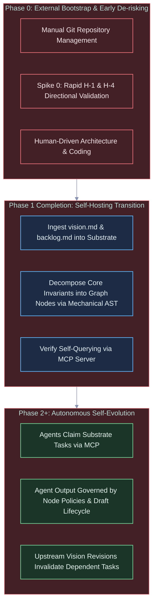
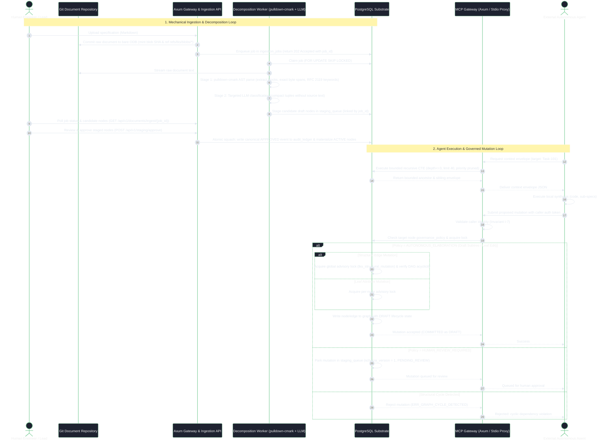

# Strategic Planning Backlog: Architecture, Roadmap, and Implementation Tactics

---

## 1. Executive Summary & Strategic Context

This document is the execution, tactical, and architectural companion to the [Technical Vision](file:///workspaces/tks/docs/vision/vision.md). While the vision document defines the enduring North Star, foundational principles, environmental boundaries, and falsification criteria, this backlog details the phased execution roadmap, technical evaluation spikes, operational metrics, and concrete implementation workflows.

This backlog is specifically organized around the **"Start Small"**, **"Constrained Resource Model"**, **"Token Minimization & Mechanical Reliance"**, and **"Self-Referential Dogfooding"** directives:

- Minimize premature architectural complexity during early phases.
- Build the simplest viable mechanisms that satisfy the core vision invariants.
- Scope Phase 0 and Phase 1 to be fully achievable by a small team or solo developer using commodity infrastructure, ensuring each phase delivers standalone value.
- Reach self-hosting as early as possible so the system defines, tracks, and governs its own ongoing development.
- Maximize mechanical processes (e.g. streaming CommonMark AST parsing) to handle the initial 80%+ of document decomposition, minimizing costly LLM output token generation.
- Enforce strict lifecycle distinction between editable drafts and locked approved requirements, utilizing draft event compaction to eliminate audit ledger bloat.

---

## 2. Phased Execution Roadmap

```mermaid
%%{init: {
  'theme': 'base',
  'themeVariables': {
    'darkMode': true,
    'background': '#161922',
    'mainBkg': '#1e2230',
    'nodeBorder': '#434c5e',
    'textColor': '#e2e8f0',
    'fontFamily': 'ui-sans-serif, system-ui, sans-serif',
    'lineColor': '#8892b0',
    'primaryColor': '#1b3528',
    'primaryBorderColor': '#73c991',
    'secondaryColor': '#1d2c44',
    'secondaryBorderColor': '#61afef'
  }
}}%%
flowchart LR
    classDef phase fill:#1b3528,stroke:#73c991,stroke-width:1.5px,color:#e6f7ee;
    classDef gate fill:#1d2c44,stroke:#61afef,stroke-width:1.5px,color:#e4f0fc;

    P0["Phase 0: Pre-Construction Spikes<br/><i>(Lightweight H-1 & H-4 De-risking)</i>"]:::phase
    P1["Phase 1: Substrate Core & Read Context<br/><i>(Git Store + PG Graph + Read MCP)</i>"]:::phase
    G1["Dogfooding Gate 1:<br/><i>Self-Ingest Vision & Backlog</i>"]:::gate
    P2["Phase 2: Bounded Mutation & Governance<br/><i>(Write MCP + Audit Log + Node Policies)</i>"]:::phase
    G2["Dogfooding Gate 2:<br/><i>Manage Phase 3 Tasks via Substrate</i>"]:::gate
    P3["Phase 3: Impact Analysis & Observability<br/><i>(Web Portal + Invalidation Cascading)</i>"]:::phase
    P4["Phase 4: Closed-Loop Traceability<br/><i>(Git Commits + Automated Verification)</i>"]:::phase

    P0 --> P1 --> G1 --> P2 --> G2 --> P3 --> P4
```



### Phase 0: Pre-Construction Hypothesis De-risking & Prototype Spikes

- **Primary Objective:** Empirically validate the foundational scientific premise (Hypothesis H-1) and baseline assisted extraction feasibility (Hypothesis H-4) using lightweight, throwaway prototypes before committing to Phase 1 infrastructure construction.
- **Core Deliverables:**
  1. **Spike 0 (H-1 Directional Validation Spike):** Rapid throwaway test comparing graph-bounded context retrieval against a competent multi-tool agentic retrieval baseline (file reading, grep, AST symbol search, and semantic search without graph-structured requirement context) on an in-memory graph of hand-curated requirement nodes (~50–100 nodes), measuring constraint violation reduction during agentic code synthesis.
  2. **Early Extraction & AST Pre-Parsing Spike (H-4 Pre-Validation):** Empirical benchmarking of mechanical CommonMark parsing (`pulldown-cmark`) paired with targeted commodity LLM classification prompts against representative technical Markdown specs to verify character offset extraction accuracy and token reduction.
  3. **Foundational Architecture Scaffolding:** Initial repository setup, developer tooling, Docker compose definition for PostgreSQL with `pgvector`, and baseline migration harness.

### Phase 1: Substrate Core, Git Document Ingestion & Context Gateway

- **Primary Objective:** Deliver a functioning read-only pipeline that ingests Markdown specifications into a Git-backed document repository, decomposes them into structured requirement nodes in PostgreSQL, and serves bounded context envelopes to external agents via the Model Context Protocol (MCP).
- **Core Deliverables:**
  1. **Git-Backed Document Store:** Bare Git repository integration (`git2` crate) for storing raw Markdown/text documents via direct ODB writes, generating immutable commit and blob object references pinned under permanent references `refs/tks/blobs/<blob_hash>` to prevent `git gc` loss.
  2. **PostgreSQL Relational & Graph Schema:** Core tables for requirement entities (`graph_nodes`), structural edges (`graph_edges`), source text span references (`source_spans`), and asynchronous vector embeddings (`node_embeddings`, `embedding_queue`). Explicit `lifecycle_state` including `DRAFT` and `ACTIVE`.
  3. **Two-Stage Assisted Decomposition Pipeline:** Ingestion REST API endpoint orchestrating a durable background queue (`ingestion_jobs`):
     - *Stage 1 (Mechanical Parsing):* Streaming CommonMark AST decomposition (`pulldown-cmark`) segmenting text along heading boundaries, tables, and lists, extracting exact source character offsets (`char_start`, `char_end`) with zero token cost and deterministic RFC 2119 keyword tagging.
     - *Stage 2 (Targeted Semantic Classification):* Selective LLM invocation on candidate chunks returning compact classification tuples without echoing source text.
     - Candidate nodes staged relationally via `job_id UUID REFERENCES ingestion_jobs(job_id)`.
  4. **Read-Only MCP Server & Identity Scaffolding:** Unified Axum server hosting REST and MCP over HTTP/SSE, paired with a lightweight stdio streaming proxy (`tks mcp-stdio`). Tool `get_context_envelope` implements strict guardrails (depth $\le 3$, node budget $\le 40$, 250ms statement timeout, and priority pruning).
- **Dogfooding Milestone (Gate 1):** Ingest the project's own `vision.md` and `strategic-planning-backlog.md` into the Phase 1 substrate, verifying that atomic requirements and constraints can be queried via MCP.

### Phase 2: Bounded Agent Mutation & Per-Node Governance

- **Primary Objective:** Enable external AI agents to submit candidate graph mutations (sub-tasks, refined specifications, test definitions) while enforcing per-node governance policies, non-negotiable identity attribution, and reversible, append-only auditability.
- **Core Deliverables:**
  1. **Mutation-Enabled MCP Tools:** MCP tools `propose_node_mutation`, `create_subtask`, and `update_node_status`, with caller authentication and token verification.
  2. **Draft Lifecycle & Event Compaction (Squash on Approval):** Support for draft nodes and edges in `graph_nodes` and `graph_edges` allowing authoring agents to build draft subtrees while keeping them isolated from production context envelopes. Atomic draft event compaction squashes intermediate draft revisions into a single canonical `APPROVED` event in `audit_ledger` with `draft_evolution_summary` JSONB.
  3. **Append-Only Audit Ledger:** Change-log mechanism recording all approved entity and edge mutations as discrete, reversible delta events, capturing caller identity (`agent_instance_id`, `caller_type`, `auth_fingerprint`) alongside mutation payloads.
  4. **Governance Policy Engine:** Database triggers and gateway filters enforcing `governance_policy` flags (`AUTONOMOUS_ELABORATION`, `HUMAN_REVIEW_REQUIRED`, `LOCKED`).
  5. **Rollback & Reversion Utility:** Administrative tooling (`revert_mutation_batch`, `revert_agent_session`) applying non-destructive compensating `REVERT` events with automated dependency sweeps to `NEEDS_REVERIFICATION`.
  6. **Semantic Corruption Defenses & Global Advisory Lock:** Structural edge mutations and DAG cycle checks serialized via a global PostgreSQL transaction advisory lock (`pg_advisory_xact_lock(hashtext('tks_structural_mutation'))`), preventing cyclic races across disjoint subtrees.
- **Dogfooding Milestone (Gate 2):** Use external coding agents (e.g., Claude Code, Cursor, custom runners) operating through MCP to claim Phase 3 preparation tasks, generate implementation sub-specs, and commit them directly to the substrate.

### Phase 3: Topological Impact Analysis & Human Supervisory Portal

- **Primary Objective:** Provide human engineering leads with high-level observability and automated impact analysis when upstream requirements change.
- **Core Deliverables:**
  1. **Web-Based Supervisory Portal:** Interactive UI for visual graph exploration, node status inspection, and human review queues for `PENDING_REVIEW` mutations and staged ingestion candidates linked via `job_id`.
  2. **Automated Invalidation Cascading:** Graph traversal algorithms that detect modifications to upstream requirements, recursively mark downstream specifications and tasks as `NEEDS_REVERIFICATION`, and block dependent agent execution until resolved.
  3. **Impact Analysis Dashboard:** Visual diff tool showing the topological blast radius of a proposed requirement revision.

### Phase 4: Closed-Loop Lifecycle Verification & Source Code Mapping

- **Primary Objective:** Establish bidirectional synchronization between leaf tasks in the knowledge graph, source code repository commits, and automated test execution results.
- **Core Deliverables:**
  1. **VCS Commit Linking:** Webhooks connecting repository commits and pull requests directly to task nodes (`IMPLEMENTED_BY` edges).
  2. **Automated Test Verification:** CI pipeline integration mapping test suite execution results to verification nodes (`VERIFIED_BY` edges), enforcing automated proof of requirement satisfaction prior to release sign-off.
  3. **Spec-Driven Release Gateways:** Formal release validation gates preventing deployment if unresolved or invalidated requirement paths remain in the graph.

---

## 3. Self-Referential Bootstrapping & Dogfooding Strategy

A foundational principle of the project is that the system must reach self-hosting capability, analogous to a self-hosting compiler. This addresses the classic bootstrapping tension ("start small" while aiming to manage complex lifecycles).



### Bootstrap Phasing Plan

1. **Phase 0 (Current Baseline & Hypothesis De-risking):**
   - The project is designed and bootstrapped using conventional development environments, standard Git workflows, and manually maintained documentation (`vision.md`, `strategic-planning-backlog.md`).
   - Early hypothesis de-risking: Execute Spike 0 (in-memory graph-bounded retrieval vs. competent agentic code retrieval on coding tasks) and early decomposition prompt tests (H-4) to establish directional confidence before committing to Phase 1 infrastructure.
   - Scope is intentionally constrained: build only the storage layer, Git connection, mechanical CommonMark AST parser, and read MCP server.
2. **Phase 1 Transition (Dogfooding Activation):**
   - Upon completing Phase 1, the development team executes the first real-world ingestion: uploading the project's own documentation files into the Git document ledger.
   - The mechanical AST decomposition pipeline breaks the technical vision into atomic requirement nodes with verified source spans.
   - Verification test: developers and agents retrieve context for Phase 2 implementation tasks using the substrate's own MCP server.
3. **Phase 2+ (Substrate-Governed Evolution):**
   - All subsequent feature backlogs, bug tracking, and architectural enhancements are tracked as nodes in the substrate.
   - When an agent is tasked with writing code for the substrate, it must query its context envelope from the substrate itself.

---

## 4. Minimum Viable Demonstration (MVD) Acceptance Test Scripts

### Phase 1 MVD: Ingestion, Git Anchoring, Mechanical Decomposition, and Read Context

- **Preconditions:** Fresh PostgreSQL instance with schema applied; bare Git repository configured with `refs/tks/blobs/` namespace and `gc.pruneExpire never`.
- **Test Procedure:**
  1. Submit a multi-page Markdown specification (e.g., `vision.md`) to `POST /api/v1/documents/ingest`.
  2. Verify that the document is committed to the bare Git repository ODB, yielding a verifiable commit SHA and blob hash with a named reference `refs/tks/blobs/<blob_hash>`.
  3. Verify that the background worker decomposes the document: CommonMark AST parsing (`pulldown-cmark`) mechanically extracts $\ge 10$ distinct requirement chunks with exact byte offsets, and targeted semantic classification tags candidate nodes.
  4. Verify candidate nodes are accessible via `GET /api/v1/documents/ingest/{job_id}` through relational join.
  5. Human reviewer approves the staged draft nodes via `POST /api/v1/staging/approve`.
  6. Connect an MCP client (e.g., Claude Code or test harness) and invoke:

     ```json
     {
       "tool": "get_context_envelope",
       "arguments": {
         "target_node_id": "REQ-002",
         "depth": 2
       }
     }
     ```

  7. Verify that the response returns the target node, its ancestor requirements, immediate sibling constraints, and source text snippets within $< 50\text{ ms}$, respecting depth clamp ($\le 3$) and node limit (40).

### Phase 2 MVD: Bounded Mutation, Governance Enforcement, and Clean Rollback

- **Preconditions:** Phase 1 graph loaded; node `REQ-005` set to `AUTONOMOUS_ELABORATION`; node `REQ-006` set to `HUMAN_REVIEW_REQUIRED`; authenticated agent session initialized with verified identity (`agent_instance_id: "agent-runner-42"`).
- **Test Procedure:**
  1. External agent calls `propose_node_mutation` targeting `REQ-005` to create three child sub-tasks in `DRAFT` state, passing bearer authorization credentials.
  2. Verify immediate database write in `graph_nodes` with `lifecycle_state = 'DRAFT'`, creation of valid directed draft edges, and that production queries for `ACTIVE` nodes exclude the drafts.
  3. External agent attempts to introduce an invalid circular constraint edge targeting `REQ-005`; verify that global advisory lock and database-level DAG cycle constraints reject the mutation with error code `ERR_GRAPH_CYCLE_DETECTED`.
  4. External agent calls `propose_node_mutation` targeting `REQ-006` to modify requirement text.
  5. Verify that the mutation is intercepted, placed in `staging_queue` with `schema_version = 1`, attributed to the agent identity, and no live graph edges are updated.
  6. Administrative user approves the draft sub-tasks under `REQ-005`: verify atomic squash recording a single canonical `APPROVED` event in `audit_ledger` with `draft_evolution_summary` JSONB.
  7. Administrative user triggers rollback for the agent session:

     ```json
     {
       "command": "revert_mutation_batch",
       "arguments": {
         "batch_id": "BATCH-2026-001"
       }
     }
     ```

  8. Verify that child sub-tasks under `REQ-005` transition to `REVERTED` / `NEEDS_REVERIFICATION` via compensating `REVERT` events without leaving orphan edges or corrupting table state.

### Phase 3 MVD: Automated Invalidation Cascading

- **Preconditions:** Hierarchical graph with top-level requirement `REQ-001` linked to 5 downstream specifications and 12 implementation tasks.
- **Test Procedure:**
  1. User updates `REQ-001` via supervisory portal, modifying a core constraint.
  2. Background cascade job traverses downstream dependency edges (`CONSTRAINED_BY`, `FULFILLS`).
  3. Verify that all 5 child specifications and 12 implementation tasks transition to status `NEEDS_REVERIFICATION`.
  4. External agent attempts to complete an associated task via MCP; verify that the gateway blocks task completion with an error requiring upstream reverification.

---

## 5. Architectural Evaluation Spikes & Technical Investigations

### Spike 0: Graph-Bounded Context Envelopes vs. Multi-Tool Agentic Retrieval Baseline (Hypothesis H-1 De-risking)

- **Status:** **Active Phase 0 Pre-Construction Spike** (Tracked in `architecture.md` §10 R-1).
- **Context:** Hypothesis H-1 (graph-bounded context envelopes significantly outperform code-level retrieval for preserving architectural invariants) is the foundational scientific bet of TKS. While Microsoft GraphRAG (2024) demonstrated multi-hop reasoning gains for text summarization, evaluating requirement graphs solely against naive flat-vector search is a strawman: modern 2026 agentic workflows (e.g., Cursor, Claude Code) already employ multi-tool retrieval (file inspection, symbol grep, AST code exploration). The genuine scientific test is whether supplying a graph-bounded requirement context envelope significantly reduces contract violations compared to an agent equipped with state-of-the-art code-level tools but lacking topological requirement provenance. Phase 1 infrastructure must not proceed without early directional signal.
- **Experimental Setup & Scoping:**
  - Throwaway prototype testable in days, requiring zero production database setup.
  - In-memory graph representation with a hand-curated requirement tree (~50–100 nodes) modeling a realistic modular software component with explicit hierarchical constraints and sibling invariants.
  - Standard commodity embedding model (e.g., `text-embedding-3-small`) and LLM coding agent (e.g., Claude 3.5 Sonnet / GPT-4o).
- **Evaluation Conditions:**
  - *Condition A (Competent Multi-Tool Agentic Baseline):* External agent equipped with standard code-level tooling (file read/grep, AST-based symbol navigation, and semantic search over flat documentation) operating without topological requirement graph context.
  - *Condition B (Topological Context Envelope):* The same agent provided with a graph-bounded context envelope (target task + ancestor requirements + sibling architectural constraints and non-functional rules).
- **Measurement:** Rate of invariant violations (missed architectural contracts, violated interfaces, dropped non-functional constraints) across $\ge 20$ controlled synthetic coding tasks.
- **Decision Thresholds:**
  - $\ge 30\%$ reduction in constraint violations provides strong directional greenlight for Phase 1 construction (reflecting meaningful intent preservation against a competent baseline).
  - $15\% - 29\%$ reduction indicates partial advantage; refine envelope assembly logic and narrow domain scope before full build.
  - $\le 0\%$ or non-significant difference signals failure of H-1 premise; halts Phase 1 build and triggers immediate strategic re-evaluation.

### Spike 1: Graph Storage & Query Strategy in PostgreSQL

- **Status:** **Incorporated into Architecture** (`architecture.md` §7 Technology Stack, §9 Decision D-2).
- **Context:** SQL/PGQ (SQL:2023 Part 16) was reverted from the PostgreSQL 19 release cycle due to design, catalog stability, and security concerns. Native SQL/PGQ support may reappear in a future major release (earliest PostgreSQL 20).
- **Outcome:** Adopted standard recursive CTEs (`WITH RECURSIVE`) on typed relational adjacency tables (`graph_nodes`, `graph_edges`) under `READ COMMITTED` isolation. Eliminates external C extension dependencies (Apache AGE) and satisfies SLA-1 (<50ms for $k \le 3$).

### Spike 2: State Versioning Mechanism (Simplicity vs. Bitemporality)

- **Status:** **Incorporated into Architecture** (`architecture.md` §5.1 State Ownership, §9 Decisions D-4 and D-16).
- **Context:** Invariant INV-2 requires auditability and reversibility without data loss, while Project Initiator constraints mandate that draft editing must not create immutable audit history churn.
- **Outcome:** Adopted the Append-Only Event Ledger with two-tier lifecycle state management: active entities commit discrete reversible audit events; draft entities undergo draft event compaction (squash on approval) into a single canonical `APPROVED` event with `draft_evolution_summary` JSONB.

### Spike 3: Git-PostgreSQL Storage Coupling Architecture

- **Status:** **Incorporated into Architecture** (`architecture.md` §4 Component Topology, §5.1 State Ownership, §7 Technology Stack; `technical-backlog.md` TB-1).
- **Context:** Text specification documents are versioned in Git, while metadata and graph topology reside in PostgreSQL.
- **Outcome:** Bare Git repository (`git init --bare`) accessed via `git2` direct ODB writes (`git_blob_create_from_buffer`), bypassing index lock contention. Pinned to permanent reference namespace `refs/tks/blobs/<blob_hash>` with `gc.pruneExpire never` and `gc.auto 0` to prevent automated garbage collection loss.

### Spike 4: Assisted Decomposition & Mechanical AST Pre-Parsing

- **Status:** **Adjusted and Incorporated into Architecture** (`architecture.md` §4 Component Topology, §5.2 Concurrency Model, §7 Technology Stack, §9 Decision D-15; `technical-backlog.md` TB-2).
- **Context:** In response to the Project Initiator's core directive on token minimization and mechanical 80/20 extraction (LD-1), raw LLM text decomposition is replaced by a two-stage pipeline.
- **Outcome:**
  1. *Stage 1 (Mechanical Parsing):* Integrated streaming CommonMark AST parser (`pulldown-cmark`) decomposing documents along heading boundaries, tables, and lists. Derives 100% exact byte/char offsets directly from source stream and matches RFC 2119 keywords without LLM token cost.
  2. *Stage 2 (Targeted Semantic Classification):* LLM invoked solely on candidate chunks requiring classification, outputting compact classification tuples without echoing source text.
  3. Benchmarking tracked in `technical-backlog.md` TB-2.

### Spike 5: Model Context Protocol (MCP) Tool Schema Design

- **Status:** **Incorporated into Architecture** (`architecture.md` §6 Interfaces & Contracts, §9 Decision D-17).
- **Context:** Standardized JSON-RPC tools for agent context retrieval and mutation proposals.
- **Outcome:** Core tools defined (`get_context_envelope`, `propose_node_mutation`, `query_requirements`, `get_document_span`, `revert_mutation_batch`, `revert_agent_session`). Traversal guardrails enforced: depth clamped to $\le 3$, node budget capped at 40, transaction statement timeout 250ms, and structural priority pruning.

### Spike 6: Agent Identity, Workload Authentication & Semantic Defenses (Invariant I-7)

- **Status:** **Incorporated into Architecture** (`architecture.md` §4 Identity Validator, §5.2 Concurrency Model, §9 Decisions D-11 and D-20).
- **Context:** Invariant I-7 mandates non-repudiable caller attribution; multi-agent races risk cyclic DAG corruption.
- **Outcome:** Adopted pragmatic two-tier identity model (pre-shared API keys and HMAC tokens for Phase 1–2; OAuth 2.1 deferred to Phase 4). Structural edge mutations and cycle checks serialized via global transaction advisory lock (`pg_advisory_xact_lock(hashtext('tks_structural_mutation'))`), eliminating cycle creation races across disjoint subtrees.

### Spike 7: Node Lifecycle State Management & Context Envelope Pruning

- **Status:** **Incorporated into Architecture** (`architecture.md` §5.1 State Ownership, §9 Decisions D-9 and D-16).
- **Context:** Lifecycle states prevent obsolete requirements from polluting agent context envelopes.
- **Outcome:** Added strongly typed `lifecycle_state` column to `graph_nodes` (`DRAFT`, `ACTIVE`, `SUPERSEDED`, `ARCHIVED`, `NEEDS_REVERIFICATION`). Production context queries filter on `lifecycle_state = 'ACTIVE'` by default; draft event compaction squashes intermediate draft history on approval.

---

## 6. Quantitative Operational Targets & Metric Calibrations

While the technical vision defines qualitative hypotheses, this backlog establishes the specific numerical targets used for calibration and validation during execution:

| Metric Identifier | Metric Name | Strategic Calibration Target | Validation Horizon |
| :--- | :--- | :--- | :--- |
| **SLA-1** | Micro-Reflex Graph Traversal Latency | $< 50\text{ ms}$ for $k \le 3$ hop topological queries | Phase 1 Benchmark |
| **SLA-2** | Context Envelope Assembly Latency | $< 100\text{ ms}$ at $10^5$ nodes in PostgreSQL | Phase 2 Benchmark |
| **CAL-H1** | Contract Violation Reduction (Hypothesis H-1) | $\ge 40\%$ fewer architectural violations vs. competent agentic baseline | Phase 2 Controlled Trial |
| **CAL-H2** | Human Review Overhead Reduction (Hypothesis H-2) | $\ge 50\%$ reduction in supervisory review time per feature | Phase 3 User Study |
| **CAL-H3** | Single-Engine Scalability Bound (Hypothesis H-3) | Sustained $< 100\text{ ms}$ query latency at $10^6$ nodes | Phase 3 Stress Test |
| **CAL-H4** | Extraction Fidelity Benchmark (Hypothesis H-4) | $\ge 95\%$ precision/recall on atomic requirement spans | Phase 1 Ingestion Eval |

### Graduated Evaluation Framework & Calibration Interpretation

In alignment with the Technical Vision's graduated response model (§7), empirical evaluation outcomes are evaluated across three operational tiers to prevent premature program termination when partial validation occurs:

| Metric Identifier | Target Validation Band (Full Success) | Graduated Scope Adjustment Band (Partial Validation) | Falsification / Kill Band (Termination / Pivot) |
| :--- | :--- | :--- | :--- |
| **CAL-H1** (Constraint Preservation) | $\ge 40\%$ violation reduction vs. competent agentic baseline | **$20\% - 39\%$ reduction:** Narrow domain to deeply coupled architectures or modular microservices; refine envelope filtering and hybridize topological envelopes with local code search. | $\le 0\%$ or non-significant improvement vs. competent agentic baseline (Triggers Kill #2). |
| **CAL-H2** (Supervisory Review Overhead) | $\ge 50\%$ review time reduction | **$25\% - 49\%$ reduction:** Streamline supervisory UI staging workflows and enrich topological blast-radius visualizations. | $\le 0\%$ reduction (supervisory graph review equals or exceeds diff review time; Triggers Kill #1). |
| **CAL-H3** (Single-Engine Scalability) | Sustained $< 100\text{ ms}$ at $10^6$ nodes | **$< 100\text{ ms}$ at $10^5$ nodes, degrading at $10^6$:** Satisfies small-to-mid enterprise repos; apply read-replica offloading, partition audit ledger, and optimize CTE indexes. | $> 500\text{ ms}$ latency at $\le 10^5$ nodes despite index optimization (Triggers Kill #3). |
| **CAL-H4** (Assisted Ingestion Fidelity) | $\ge 95\%$ precision/recall on spans | **$80\% - 94\%$ precision/recall:** Engage deterministic span re-anchoring post-processor (fuzzy byte alignment against source) to correct offset drift; enforce structured Markdown specification templates and mandatory human-in-the-loop staging corrections. | $< 60\%$ precision/recall or severe span hallucination despite deterministic re-anchoring (Triggers Kill #1). |

---

## 7. Operational Workflow Specifications & Interaction Sequences



### Detailed Sequence Description

1. **Upload & Versioning:** The human engineer uploads a Markdown specification to the REST API. The document is immediately committed to the bare Git repository object database via direct ODB writes (`git_blob_create_from_buffer`), generating cryptographic blob identifiers and a permanent reference under `refs/tks/blobs/<blob_hash>`. An ingestion job record is inserted into `ingestion_jobs` and returns `202 Accepted` with a `job_id`.
2. **Two-Stage Mechanical Decomposition:** A persistent background worker claims the job. Stage 1 mechanically parses the CommonMark AST using `pulldown-cmark`, extracting structural blocks (headings, tables, lists), exact byte/char offsets, and RFC 2119 keywords with zero LLM token cost. Stage 2 invokes external LLM classification only on ambiguous fragments, instructing the model to output compact classification tuples without echoing source text. Staged candidate nodes are linked directly to `job_id`.
3. **Staging & Human Verification:** Parsed requirements enter staging linked to the ingestion job. The engineer inspects job status and candidates via a unified relational query (`GET /api/v1/documents/ingest/{job_id}`).
4. **Graph Materialization & Draft Compaction:** Approved items are committed to PostgreSQL. For draft proposals, intermediate modifications are squashed into a single canonical `APPROVED` event in `audit_ledger` with `draft_evolution_summary` JSONB, and promoted to `ACTIVE` in `graph_nodes`.
5. **Context Request:** External agents connecting over MCP (via HTTP/SSE or streaming stdio proxy) request context for assigned tasks. The substrate executes a bounded recursive CTE query (depth clamped $\le 3$, node budget $\le 40$, 250ms statement timeout, and priority pruning), retrieving parent requirements, direct architectural constraints, and vector-similar contextual nodes without fan-out DoS.
6. **Execution, Identity Validation & Governed Mutation:** The agent runs locally, then submits proposed updates via MCP presenting its workload credentials. The MCP gateway statelessly validates caller identity (Invariant I-7). For structural mutations, the transaction acquires a global advisory lock (`pg_advisory_xact_lock(hashtext('tks_structural_mutation'))`), executes an in-database recursive cycle check, and writes the draft node/edges. If autonomous elaboration is authorized, the change commits as `DRAFT` in `graph_nodes`; if human review is required, it is parked in `staging_queue` (`schema_version = 1`); if a cyclic dependency or invariant violation is detected, it is deterministically rejected.
