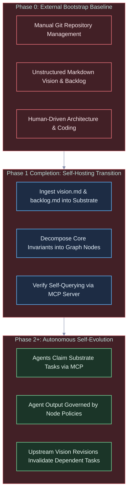
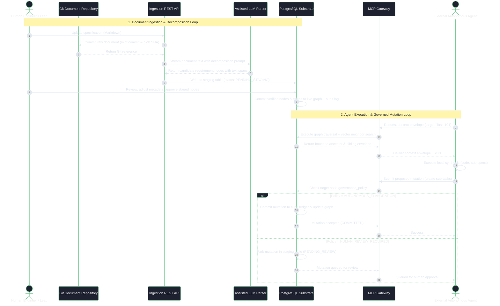

# Strategic Planning Backlog: Architecture, Roadmap, and Implementation Tactics

---

## 1. Executive Summary & Strategic Context

This document is the execution, tactical, and architectural companion to the [Technical Vision](file:///workspaces/tks/docs/vision/vision.md). While the vision document defines the enduring North Star, foundational principles, environmental boundaries, and falsification criteria, this backlog details the phased execution roadmap, technical evaluation spikes, operational metrics, and concrete implementation workflows.

This backlog is specifically organized around the **"Start Small"** and **"Self-Referential Dogfooding"** directives:

- Minimize premature architectural complexity during early phases.
- Build the simplest viable mechanisms that satisfy the core vision invariants.
- Reach self-hosting as early as possible so the system defines, tracks, and governs its own ongoing development.

---

## 2. Phased Execution Roadmap

```mermaid
%%{init: {
  'theme': 'base',
  'themeVariables': {
    'darkMode': true,
    'background': '#161922',
    'mainBkg': '#1e2230',
    'nodeBorder': '#434c5e',
    'textColor': '#e2e8f0',
    'fontFamily': 'ui-sans-serif, system-ui, sans-serif',
    'lineColor': '#8892b0',
    'primaryColor': '#1b3528',
    'primaryBorderColor': '#73c991',
    'secondaryColor': '#1d2c44',
    'secondaryBorderColor': '#61afef'
  }
}}%%
flowchart LR
    classDef phase fill:#1b3528,stroke:#73c991,stroke-width:1.5px,color:#e6f7ee;
    classDef gate fill:#1d2c44,stroke:#61afef,stroke-width:1.5px,color:#e4f0fc;

    P1["Phase 1: Substrate Core & Read Context<br/><i>(Git Store + PG Graph + Read MCP)</i>"]:::phase
    G1["Dogfooding Gate 1:<br/><i>Self-Ingest Vision & Backlog</i>"]:::gate
    P2["Phase 2: Bounded Mutation & Governance<br/><i>(Write MCP + Audit Log + Node Policies)</i>"]:::phase
    G2["Dogfooding Gate 2:<br/><i>Manage Phase 3 Tasks via Substrate</i>"]:::gate
    P3["Phase 3: Impact Analysis & Observability<br/><i>(Web Portal + Invalidation Cascading)</i>"]:::phase
    P4["Phase 4: Closed-Loop Traceability<br/><i>(Git Commits + Automated Verification)</i>"]:::phase

    P1 --> G1 --> P2 --> G2 --> P3 --> P4
```



### Phase 1: Substrate Core, Git Document Ingestion & Context Gateway

- **Primary Objective:** Deliver a functioning read-only pipeline that ingests Markdown specifications into a Git-backed document repository, decomposes them into structured requirement nodes in PostgreSQL, and serves bounded context envelopes to external agents via the Model Context Protocol (MCP).
- **Core Deliverables:**
  1. **Git-Backed Document Store:** Local/server-side Git repository integration for storing raw Markdown/text documents, generating commit and blob object references.
  2. **PostgreSQL Relational & Graph Schema:** Core tables for requirement entities, structural edges (`DERIVED_FROM`, `CONSTRAINED_BY`), source text span references (document hash, character start/end), and vector embeddings (`pgvector`).
  3. **Assisted Decomposition Pipeline:** Ingestion REST API endpoint orchestrating prompt-based requirement extraction via external LLM APIs, with a staging table for human review before graph insertion.
  4. **Read-Only MCP Server:** MCP endpoint exposing tool `get_context_envelope` that performs directed graph traversals and vector neighbor lookups, assembling bounded ancestor and sibling context.
- **Dogfooding Milestone (Gate 1):** Ingest the project's own `vision.md` and `strategic-planning-backlog.md` into the Phase 1 substrate, verifying that atomic requirements and constraints can be queried via MCP.

### Phase 2: Bounded Agent Mutation & Per-Node Governance

- **Primary Objective:** Enable external AI agents to submit candidate graph mutations (sub-tasks, refined specifications, test definitions) while enforcing per-node governance policies and reversible, append-only auditability.
- **Core Deliverables:**
  1. **Mutation-Enabled MCP Tools:** MCP tools `propose_node_mutation`, `create_subtask`, and `update_node_status`.
  2. **Append-Only Audit Ledger:** Change-log mechanism recording all entity and edge mutations as discrete, reversible delta events, supporting point-in-time state reconstruction.
  3. **Governance Policy Engine:** Database triggers and gateway filters enforcing `governance_policy` flags (`AUTONOMOUS_ELABORATION`, `HUMAN_REVIEW_REQUIRED`, `LOCKED`).
  4. **Rollback & Reversion Utility:** Administrative tooling to cleanly revert a sequence of agent mutations without leaving orphan nodes or dangling relationships.
- **Dogfooding Milestone (Gate 2):** Use external coding agents (e.g., Claude Code, Aider, custom runners) operating through MCP to claim Phase 3 preparation tasks, generate implementation sub-specs, and commit them directly to the substrate.

### Phase 3: Topological Impact Analysis & Human Supervisory Portal

- **Primary Objective:** Provide human engineering leads with high-level observability and automated impact analysis when upstream requirements change.
- **Core Deliverables:**
  1. **Web-Based Supervisory Portal:** Interactive UI for visual graph exploration, node status inspection, and human review queues for `PENDING_REVIEW` mutations.
  2. **Automated Invalidation Cascading:** Graph traversal algorithms that detect modifications to upstream requirements, recursively mark downstream specifications and tasks as `NEEDS_REVERIFICATION`, and block dependent agent execution until resolved.
  3. **Impact Analysis Dashboard:** Visual diff tool showing the topological blast radius of a proposed requirement revision.

### Phase 4: Closed-Loop Lifecycle Verification & Source Code Mapping

- **Primary Objective:** Establish bidirectional synchronization between leaf tasks in the knowledge graph, source code repository commits, and automated test execution results.
- **Core Deliverables:**
  1. **VCS Commit Linking:** Webhooks connecting repository commits and pull requests directly to task nodes (`IMPLEMENTED_BY` edges).
  2. **Automated Test Verification:** CI pipeline integration mapping test suite execution results to verification nodes (`VERIFIED_BY` edges), enforcing automated proof of requirement satisfaction prior to release sign-off.
  3. **Spec-Driven Release Gateways:** Formal release validation gates preventing deployment if unresolved or invalidated requirement paths remain in the graph.

---

## 3. Self-Referential Bootstrapping & Dogfooding Strategy

A foundational principle of the project is that the system must reach self-hosting capability, analogous to a self-hosting compiler. This addresses the classic bootstrapping tension ("start small" while aiming to manage complex lifecycles).



### Bootstrap Phasing Plan

1. **Phase 0 (Current Baseline):**
   - The project is designed and bootstrapped using conventional development environments, standard Git workflows, and manually maintained documentation (`vision.md`, `strategic-planning-backlog.md`).
   - Scope is intentionally constrained: build only the storage layer, Git connection, basic ingestion parser, and read MCP server.
2. **Phase 1 Transition (Dogfooding Activation):**
   - Upon completing Phase 1, the development team executes the first real-world ingestion: uploading the project's own documentation files into the Git document ledger.
   - The decomposition pipeline breaks the technical vision into atomic requirement nodes.
   - Verification test: developers and agents retrieve context for Phase 2 implementation tasks using the substrate's own MCP server.
3. **Phase 2+ (Substrate-Governed Evolution):**
   - All subsequent feature backlogs, bug tracking, and architectural enhancements are tracked as nodes in the substrate.
   - When an agent is tasked with writing code for the substrate, it must query its context envelope from the substrate itself.

---

## 4. Minimum Viable Demonstration (MVD) Acceptance Test Scripts

### Phase 1 MVD: Ingestion, Git Anchoring, Decomposition, and Read Context

- **Preconditions:** Fresh PostgreSQL instance with schema applied; local Git repository configured.
- **Test Procedure:**
  1. Submit a multi-page Markdown specification (e.g., `vision.md`) to `POST /api/v1/documents/ingest`.
  2. Verify that the document is committed to the Git document repository, yielding a verifiable commit SHA and blob hash.
  3. Verify that the decomposition pipeline extracts $\ge 10$ distinct requirement nodes with valid character span offsets pointing into the source text.
  4. Human reviewer approves the staged nodes via `POST /api/v1/staging/approve`.
  5. Connect an MCP client (e.g., Claude Code or test harness) and invoke:

     ```json
     {
       "tool": "get_context_envelope",
       "arguments": {
         "target_node_id": "REQ-002",
         "depth": 2
       }
     }
     ```

  6. Verify that the response returns the target node, its ancestor requirements, immediate sibling constraints, and source text snippets within $< 100\text{ ms}$.

### Phase 2 MVD: Bounded Mutation, Governance Enforcement, and Clean Rollback

- **Preconditions:** Phase 1 graph loaded; node `REQ-005` set to `AUTONOMOUS_ELABORATION`; node `REQ-006` set to `HUMAN_REVIEW_REQUIRED`.
- **Test Procedure:**
  1. External agent calls `propose_node_mutation` targeting `REQ-005` to create three child sub-tasks.
  2. Verify immediate database write, creation of valid directed edges, and audit ledger entry.
  3. External agent calls `propose_node_mutation` targeting `REQ-006` to modify requirement text.
  4. Verify that the mutation is intercepted, placed in `PENDING_REVIEW`, and no live graph edges are updated.
  5. Administrative user triggers rollback for the agent session:

     ```json
     {
       "command": "revert_mutation_batch",
       "arguments": {
         "batch_id": "BATCH-2026-001"
       }
     }
     ```

  6. Verify that all three child sub-tasks under `REQ-005` are reverted to historical snapshot without leaving orphan edges or corrupting table state.

### Phase 3 MVD: Automated Invalidation Cascading

- **Preconditions:** Hierarchical graph with top-level requirement `REQ-001` linked to 5 downstream specifications and 12 implementation tasks.
- **Test Procedure:**
  1. User updates `REQ-001` via supervisory portal, modifying a core constraint.
  2. Background cascade job traverses downstream dependency edges (`CONSTRAINED_BY`, `FULFILLS`).
  3. Verify that all 5 child specifications and 12 implementation tasks transition to status `NEEDS_REVERIFICATION`.
  4. External agent attempts to complete an associated task via MCP; verify that the gateway blocks task completion with an error requiring upstream reverification.

---

## 5. Architectural Evaluation Spikes & Technical Investigations

### Spike 1: Graph Storage & Query Strategy in PostgreSQL

- **Context:** SQL/PGQ (SQL:2023 Part 16) was removed from PostgreSQL 19 development branches in September 2026 due to catalog stability, concurrency, and security concerns. The project requires an alternative graph query approach within PostgreSQL.
- **Options Under Evaluation:**
  1. **Apache AGE (openCypher Extension):**
     - *Pros:* Rich Cypher query syntax, native graph storage model, optimized for multi-hop graph traversals.
     - *Cons:* External C extension; compatibility restricted to specific PostgreSQL major versions (currently 14–16); added deployment complexity.
  2. **Standard Recursive CTEs (`WITH RECURSIVE` on Relational Schema):**
     - *Pros:* Zero external dependencies, runs on any vanilla PostgreSQL version, completely stable, fully covered by standard ACID guarantees.
     - *Cons:* More verbose SQL queries for complex path matching; performance requires careful indexing on adjacency tables.
  3. **Hybrid Adjacency List with JSONB Path Materialization:**
     - *Pros:* Extremely fast ancestor-lookup queries; simple table structure (`nodes`, `edges`).
     - *Cons:* Higher write amplification on deep graph hierarchy reorganizations.
- **Evaluation Criteria:** Simplicity, operational reliability, query latency on $k$-hop traversals ($k \le 4$), and ease of initial setup.

### Spike 2: State Versioning Mechanism (Simplicity vs. Bitemporality)

- **Context:** The vision mandates auditability, reversibility, and point-in-time state reconstruction (Invariant I-2). Full bitemporal data modeling (valid time + transaction time across all entities and edges) introduces extreme schema and query complexity.
- **Options Under Evaluation:**
  1. **Append-Only Event Ledger with Materialized Current State:**
     - State mutations write an immutable event record to `audit_ledger`. Live graph tables maintain the current snapshot, updated within the same transaction.
     - *Pros:* Conceptual simplicity, fast read performance on current graph, straightforward rollback via inverse events.
  2. **System-Versioned Temporal Tables (`system_time`):**
     - Using standard PostgreSQL range types and historical archive tables triggered on update.
     - *Pros:* Standardized query interface using timestamp ranges.
  3. **Full Bitemporal Property Graph:**
     - Tracking both `asserted_at` and `effective_at` timestamps on every node and edge.
     - *Pros:* Complete academic auditability across retrospective corrections.
     - *Cons:* Severe query verbosity, complex recursive graph traversal over bitemporal edges, excessive initial engineering burden.
- **Recommendation:** Adopt the **Append-Only Event Ledger** for Phase 1 and 2 to honor the "Start Small" directive while strictly preserving reversibility.

### Spike 3: Git-PostgreSQL Storage Coupling Architecture

- **Context:** Text specification documents are versioned in Git, while metadata, graph topology, and requirement mappings live in PostgreSQL.
- **Design Challenges:**
  1. **Identity & Referencing:**
     - Anchor documents to Git commit hashes and blob SHAs (`git hash-object`).
     - Store document metadata (file path, commit hash, author, timestamp) in PostgreSQL table `document_artifacts`.
  2. **Span Stability Across Revisions:**
     - Character offset spans (`char_start`, `char_end`) become invalid if a source document is edited upstream.
     - *Mitigation strategy:* Pin extracted requirements strictly to an immutable Git commit/blob hash. When a document revision is ingested via a new commit, run a diff-based span relocation algorithm or flag affected requirements for re-annotation.
  3. **Retrieval Interface:**
     - REST API provides raw text retrieval by resolving the Git reference (`git cat-file` or `libgit2` bindings) for external agents and UI rendering.

### Spike 4: Assisted Decomposition Prompting & Prior Art Analysis

- **Context:** Automated requirement extraction from unstructured Markdown documents must produce coherent, atomic graph nodes with high precision.
- **Prior Art to Analyze:**
  - **SARA:** Analyzes requirements as knowledge graphs using Git and Markdown. Study its document parsing conventions and edge taxonomies.
  - **Proj-Theseus:** Multi-level requirement traceability models; inspect its schema conventions for specification decomposition.
- **Evaluation Tasks:**
  - Benchmark few-shot prompts against diverse Markdown structures (tables, bulleted lists, RFC 2119 keyword sections).
  - Validate character span accuracy returned by LLMs (e.g., handling UTF-8 multibyte offsets and newline normalization).

### Spike 5: Model Context Protocol (MCP) Tool Schema Design

- **Context:** External agents interact with the substrate through a standardized MCP server.
- **Proposed Tool Definitions:**
  - `get_context_envelope(node_id: string, depth: int, include_vectors: bool)`: Returns structured context JSON including target node, ancestor requirements, linked constraints, and sibling context.
  - `propose_node_mutation(target_node_id: string, mutation_type: string, payload: object)`: Submits candidate changes; returns status (`COMMITTED` or `PENDING_REVIEW`).
  - `query_requirements(query_text: string, limit: int)`: Performs hybrid vector + keyword search over requirement nodes.
  - `get_document_span(document_hash: string, start_offset: int, end_offset: int)`: Retrieves verified source text from Git backend.

---

## 6. Quantitative Operational Targets & Metric Calibrations

While the technical vision defines qualitative hypotheses, this backlog establishes the specific numerical targets used for calibration and validation during execution:

| Metric Identifier | Metric Name | Strategic Calibration Target | Validation Horizon |
| --- | --- | --- | --- |
| **SLA-1** | Micro-Reflex Graph Traversal Latency | $< 50\text{ ms}$ for $k \le 3$ hop topological queries | Phase 1 Benchmark |
| **SLA-2** | Context Envelope Assembly Latency | $< 100\text{ ms}$ at $10^5$ nodes in PostgreSQL | Phase 2 Benchmark |
| **CAL-H1** | Contract Violation Reduction (Hypothesis H-1) | $\ge 70\%$ fewer architectural violations vs. flat-file vector search | Phase 2 Controlled Trial |
| **CAL-H2** | Human Review Overhead Reduction (Hypothesis H-2) | $\ge 50\%$ reduction in supervisory review time per feature | Phase 3 User Study |
| **CAL-H3** | Single-Engine Scalability Bound (Hypothesis H-3) | Sustained $< 100\text{ ms}$ query latency at $10^6$ nodes | Phase 3 Stress Test |
| **CAL-H4** | Extraction Fidelity Benchmark (Hypothesis H-4) | $\ge 95\%$ precision/recall on atomic requirement spans | Phase 1 Ingestion Eval |

---

## 7. Operational Workflow Specifications & Interaction Sequences



### Detailed Sequence Description

1. **Upload & Versioning:** The human engineer uploads a Markdown specification to the REST API. The document is immediately committed to the underlying Git repository, preserving byte-for-byte fidelity and generating cryptographic commit and blob identifiers.
2. **Parsing & Character Span Tagging:** The ingestion service formats the document for the decomposition LLM prompt. The model segments the text into atomic requirement items, returning character coordinate spans (`[start, end]`) corresponding to the source text in Git.
3. **Staging & Human Verification:** Parsed requirements enter a staging state. The engineer reviews the extracted nodes, adjusts governance flags, and approves insertion.
4. **Graph Materialization:** Approved items are committed to PostgreSQL, writing records to the live graph topology, embedding tables, and append-only audit ledger.
5. **Context Request:** External agents connecting over MCP request context for assigned tasks. The substrate executes a directed graph query retrieving parent requirements, linked architectural constraints, and vector-similar contextual nodes.
6. **Execution & Governed Mutation:** The agent runs locally, then submits proposed graph updates via MCP. The substrate inspects the target node's governance policy. If autonomous elaboration is authorized, the change commits immediately; otherwise, it is parked in a review queue for human sign-off.
