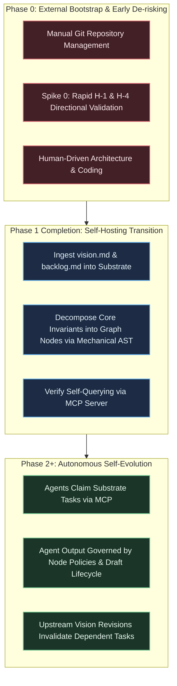

# Strategic Planning Backlog: Architecture, Roadmap, and Implementation Tactics

---

## 1. Executive Summary & Strategic Context

This document is the execution, tactical, and architectural companion to the [Technical Vision](file:///workspaces/tks/docs/vision/vision.md). While the vision document defines the enduring North Star, foundational principles, environmental boundaries, and falsification criteria, this backlog details the phased execution roadmap, technical evaluation spikes, operational metrics, and concrete implementation workflows.

This backlog is specifically organized around the **"Start Small"**, **"Constrained Resource Model"**, **"Token Minimization & Mechanical Reliance"**, and **"Self-Referential Dogfooding"** directives:

- Minimize premature architectural complexity during early phases.
- Build the simplest viable mechanisms that satisfy the core vision invariants.
- Scope Phase 0 and Phase 1 to be fully achievable by a small team or solo developer using commodity infrastructure, ensuring each phase delivers standalone value.
- Reach self-hosting as early as possible so the system defines, tracks, and governs its own ongoing development.
- Maximize mechanical processes (e.g. streaming CommonMark AST parsing via `pulldown-cmark`) to handle the initial 80%+ of document decomposition, maintaining an active heading stack to mechanically generate upward structural hierarchy edges (`child_id -DERIVED_FROM-> parent_id`) and deterministic heading anchors (`ast_anchor`), minimizing costly LLM output token generation.
- Enforce strict lifecycle distinction between editable drafts and locked approved requirements, storing candidates directly in the graph topology as `DRAFT` entities, permitting conditional typing (`'UNCLASSIFIED'`) exclusively during drafting, and utilizing ephemeral draft revision logging directly inside `graph_nodes.attributes->'draft_revisions'` with atomic draft compaction upon approval to eliminate audit ledger bloat and avoid standalone table complexity.
- Consolidate document provenance by embedding source span coordinates directly on `graph_nodes` (`doc_path`, `doc_hash`, `byte_start`, `byte_end`), eliminating standalone table join overhead and duplicate cardinality issues, while automating ingestion job supersession sweeps on document re-ingestion to guarantee zero orphaned draft residue.
- Eliminate loose Git reference hacks in favor of standard Git branch commits (`refs/heads/specs`) with mandatory document paths/slugs (`doc_path`), ensuring natural 100% reachability, out-of-the-box `git log`/`git diff`, and deterministic span re-anchoring across revisions without garbage collection overrides.
- Establish a clean read/write concurrency split for Git operations: isolate blocking libgit2 C write calls from the async reactor via a dedicated background Git write actor task communicating over bounded `mpsc` and `oneshot` channels with internal panic recovery (`std::panic::catch_unwind`), while routing read-only ODB blob lookups (`get_document_span`, worker decomposition) through concurrent `tokio::task::spawn_blocking` routines, eliminating head-of-line blocking on immutable reads.
- Strictly reject premature abstractions (distributed databases, distributed consensus, complex OAuth 2.1) during early phases in favor of single-engine PostgreSQL, pre-shared keys, and HMAC tokens.
- Enforce a strict lock acquisition hierarchy for mutations: any transaction performing structural edge mutations, DAG cycle checks, batch staging approvals, or rollbacks must acquire the global transaction advisory lock `pg_advisory_xact_lock(hashtext('tks_structural_mutation'))` *before* acquiring any row-level locks on `graph_nodes` or `graph_edges`. Pure leaf attribute edits and task status changes execute concurrently using native PostgreSQL row-level locks (`SELECT ... FOR UPDATE`), eliminating 32-bit hash collision bottlenecks.
- Decouple canonical requirement lifecycle from operational job retention (`ON DELETE SET NULL`), eliminate edge lifecycle constraint collisions with surrogate keys and active partial indexes, validate dual active endpoints and supersede existing active edges on promotion, and guarantee sub-5ms offline search for `query_requirements` via native PostgreSQL full-text search (`tsvector` / partial GIN index on active nodes) with query sanitization preventing hyphen-negation syntax corruption.
- Enable autonomous agent execution loops under `AUTONOMOUS_ELABORATION` nodes: permit verified agents to create non-normative execution tasks (`TASK`) directly in `ACTIVE` state with immediate commit to `audit_ledger` with monotonic `event_seq` (validated via transactional ancestor CTE), while providing caller-scoped draft query visibility via an optional `include_drafts` parameter on `get_context_envelope`.
- Assign consistent transaction correlation keys (`batch_id UUID`) in `audit_ledger`, and consolidate administrative rollback interfaces into a single polymorphic operation (`revert_mutations`) taking structured filter criteria.
- Support human-readable canonical identifiers (`REQ-*`, `INV-*`, `DR-*`, `Task-*`) via a dedicated `node_key VARCHAR(64)` column with a partial unique index on active entities, enabling polymorphic UUID/key resolution across all MCP and REST interfaces.
- Protect external embedding providers and external LLM tokens by enqueueing embedding generation strictly upon node transition to `ACTIVE` (or content mutation of active nodes), scheduling retries via `scheduled_at` exponential backoff to eliminate tight-loop hammering on HTTP 429 rate limits, and falling back to ancestor requirement embeddings for newly created tasks.
- Auto-apply embedded database migrations (`refinery::embed_migrations!`) on `tks serve` daemon startup prior to binding network listeners, and provide a standalone CLI flag (`tks serve --migrate-only`) for offline CI/CD pipelines, eliminating deployment deadlocks. Route runtime operational commands (`tks staging`, `tks identity`) through local Axum REST gateway endpoints to immediately invalidate the daemon's in-process `moka` LRU cache upon revocation and prevent multi-process connection pool exhaustion.
- Align dogfooding with the phased progression model: Phase 1 establishes read-only self-hosting for context querying, while Phase 2 enables autonomous self-evolution. Hold Phase 3 and Phase 4 execution as strictly contingent on empirical validation of foundational hypotheses (H-1, H-4) and successful Phase 1 dogfooding adoption.

### Architectural Governance Notation: Binding Strategic Invariants vs. Tactical Implementation Preferences

To maintain implementation agility and prevent this backlog from acting as an overly rigid architectural straightjacket, engineering decisions are categorized across two operational tiers:

1. **Binding Strategic Invariants:** Foundational commitments derived directly from the Technical Vision that require explicit stakeholder alignment and formal revision to change:
   - Single-engine PostgreSQL operational footprint (zero distributed database complexity or secondary DBMS synchronization in Phases 0–2).
   - Externalized cognitive compute (zero in-database LLM inference execution inside operational transactions).
   - Append-only audit ledger with draft lifecycle compaction upon approval (eliminating audit bloat while preserving lineage).
   - Strict bidirectional traceability (Invariant I-1) and non-repudiable agent identity attribution (Invariant I-7).
   - Phased self-referential bootstrapping (read-only self-hosting at Phase 1; autonomous self-evolution at Phase 2).
   - Strict lock acquisition hierarchy: global structural advisory locks must precede row-level locks.
2. **Tactical Implementation Preferences:** Concrete design choices and operational parameters:
   - Specific column names and relational constraint identifiers.
   - Exact JSONB attribute paths (e.g. `attributes->'draft_revisions'`, `attributes->'ast_anchor'`).
   - Advisory lock hash constants and Tokio channel buffer sizes.
   - Worker polling backoff intervals and cache TTL configurations.

These tactical details represent battle-tested directional guidance. Implementers and autonomous coding agents are fully empowered to refine, optimize, or adjust these tactical specifics during development without requiring formal backlog amendments, provided the underlying binding strategic invariants, environmental boundaries, and performance SLAs are upheld.

### Strategic Risk Context & Deferred Considerations

- **External Embedding Provider Dependency & Offline Operation:** While context envelopes allocate 30 nodes to deterministic topological retrieval and only 10 nodes to vector neighbors, vector generation currently assumes an external API provider. In fully air-gapped or offline environments, or during external API throttling, vector generation is disabled or degraded (falling back to ancestor requirement embeddings or pure topology per TB-6). To eliminate external gating and establish complete operational self-sufficiency, Phase 0 includes a technical investigation (Spike 8) evaluating local, CPU-efficient embedded model runtimes (e.g., ONNX runtime / `fastembed-rs`).
- **Phased Sequencing of Institutional Process & Procedural Modeling:** While the Technical Vision establishes procedural entities and compliance checklists as foundational to organizational memory (Key Capability #8), execution is strictly phased. In Phases 1–2, the property graph schema accommodates procedural concepts via flexible JSONB node attributes and foundational edge types (`GOVERNED_BY_PROCEDURE`), while ingestion, context retrieval, and MVD acceptance testing focus cleanly on the core **Requirement $\to$ Specification $\to$ Task** traceability loop. Dedicated procedural validation engines, mandatory checklist gates (licensing, CVEs), and cross-layer gap detection algorithms are deferred to Phase 3+, after the core requirement-to-task loop is empirically proven.
- **Enterprise Multi-Tenancy & Project Isolation (Deferred to Phase 3+):** Phases 0–2 intentionally operate under a single-tenant, single-project model to preserve developer velocity under the constrained resource model. To ensure future enterprise viability without disruptive schema migrations, Phase 1–2 database entities (`graph_nodes`, `ingestion_jobs`, `audit_ledger`, `agent_identities`) include an optional `project_id VARCHAR(64) DEFAULT 'default'` discriminator column, enabling forward-compatibility for row-level security (RLS) and multi-tenancy in Phase 3+.

---

## 2. Phased Execution Roadmap

```mermaid
%%{init: {
  'theme': 'base',
  'themeVariables': {
    'darkMode': true,
    'background': '#161922',
    'mainBkg': '#1e2230',
    'nodeBorder': '#434c5e',
    'textColor': '#e2e8f0',
    'fontFamily': 'ui-sans-serif, system-ui, -apple-system, BlinkMacSystemFont, "Segoe UI", Roboto, "Helvetica Neue", Arial, sans-serif',
    'fontSize': '14px',
    'lineColor': '#8892b0',
    'primaryColor': '#422026',
    'primaryTextColor': '#fde8ec',
    'primaryBorderColor': '#e06c75',
    'secondaryColor': '#1b3528',
    'secondaryTextColor': '#e6f7ee',
    'secondaryBorderColor': '#73c991',
    'tertiaryColor': '#1d2c44',
    'tertiaryTextColor': '#e4f0fc',
    'tertiaryBorderColor': '#61afef',
    'clusterBkg': '#13161f',
    'clusterBorder': '#373e51',
    'noteBkgColor': '#2e271a',
    'noteTextColor': '#fdf4db',
    'noteBorderColor': '#e5c07b',
    'edgeLabelBackground': '#1a1d27'
  }
}}%%
flowchart LR
    classDef primary fill:#422026,stroke:#e06c75,stroke-width:1.5px,color:#fde8ec;
    classDef secondary fill:#1b3528,stroke:#73c991,stroke-width:1.5px,color:#e6f7ee;
    classDef tertiary fill:#1d2c44,stroke:#61afef,stroke-width:1.5px,color:#e4f0fc;

    P0["Phase 0: Pre-Construction Spikes<br/><i>(Lightweight H-1 & H-4 De-risking)</i>"]:::secondary
    P1["Phase 1: Substrate Core & Read Context<br/><i>(Git Store + PG Graph + Read MCP)</i>"]:::secondary
    G1["Dogfooding Gate 1:<br/><i>Self-Ingest Vision & Backlog</i>"]:::primary
    P2["Phase 2: Bounded Mutation & Governance<br/><i>(Write MCP + Audit Log + Node Policies)</i>"]:::secondary
    G2["Dogfooding Gate 2:<br/><i>Manage Phase 3 Tasks via Substrate</i>"]:::primary
    P3["Phase 3: Impact Analysis & Observability<br/><i>(Web Portal + Invalidation Cascading)</i>"]:::secondary
    P4["Phase 4: Closed-Loop Traceability<br/><i>(Git Commits + Automated Verification)</i>"]:::secondary

    P0 --> P1 --> G1 --> P2 --> G2 --> P3 --> P4
```



### Phase 0: Pre-Construction Hypothesis De-risking & Prototype Spikes

- **Primary Objective:** Empirically validate the foundational scientific premise (Hypothesis H-1) and baseline assisted extraction feasibility (Hypothesis H-4) using lightweight, throwaway prototypes before committing to Phase 1 infrastructure construction.
- **Core Deliverables:**
  1. **Spike 0 (H-1 Directional Validation Spike):** Rapid throwaway test comparing graph-bounded context retrieval against a competent multi-tool agentic retrieval baseline (file reading, grep, AST symbol search, and semantic search without graph-structured requirement context) on an in-memory graph of hand-curated requirement nodes (~50–100 nodes), measuring constraint violation reduction during agentic code synthesis.
  2. **Early Extraction & AST Pre-Parsing Spike (H-4 Pre-Validation):** Empirical benchmarking of mechanical CommonMark parsing (`pulldown-cmark`) paired with targeted commodity LLM classification prompts against representative technical Markdown specs to verify 0-based byte offset extraction accuracy and token reduction.
  3. **Foundational Architecture Scaffolding:** Initial repository setup, developer tooling, Docker compose definition for PostgreSQL with `pgvector`, and baseline migration harness.
  4. **Local & Embedded Vector Generation Spike (Spike 8):** Evaluation of embedded local model runtimes (e.g., `fastembed-rs` or ONNX runtime) on commodity CPU hardware as an alternative to external embedding APIs, benchmarking latency (<50ms/node), binary footprint, and offline zero-dependency viability.

### Phase 1: Substrate Core, Git Document Ingestion & Context Gateway

- **Primary Objective:** Deliver a functioning read-only pipeline that ingests Markdown specifications into a Git-backed document repository, decomposes them into structured requirement nodes in PostgreSQL, and serves bounded context envelopes to external agents via the Model Context Protocol (MCP).
- **Core Deliverables:**
  1. **Git-Backed Document Store & Read/Write Concurrency Split:** Bare Git repository integration (`git2` crate) storing raw Markdown documents committed onto `refs/heads/specs` with mandatory document paths (`doc_path`). Blocking libgit2 write operations are isolated in a dedicated background Git write actor thread (`src/storage/git/actor.rs`) owning the writable repository handle and communicating over bounded `mpsc` and `oneshot` channels with panic recovery (`std::panic::catch_unwind`). Read-only blob lookups (`get_document_span`, worker decomposition) execute concurrently off Tokio async worker pools via `tokio::task::spawn_blocking` and read-only ODB handles (`git2::Odb::read`), eliminating serialization bottlenecks on immutable reads (addressing LD-12, iteration 7; TB-1).
  2. **PostgreSQL Relational & Graph Schema:**
     - `graph_nodes`: Typed nodes with canonical `node_key VARCHAR(64)` with partial unique index `idx_graph_nodes_node_key_active`; conditional check constraint on `node_type` permitting `'UNCLASSIFIED'` exclusively when `lifecycle_state = 'DRAFT'`; `lifecycle_state` (`DRAFT`, `ACTIVE`, `SUPERSEDED`, `ARCHIVED`, `NEEDS_REVERIFICATION`); embedded document source span columns (`doc_path VARCHAR(255)`, `doc_hash VARCHAR(64)`, `byte_start INT`, `byte_end INT`) with partial index on `doc_path` (eliminating the `source_spans` table per LD-11); generated full-text search vector `search_tsv` (`tsvector`) incorporating `node_key`, `title`, and `content` with partial GIN index on active nodes (LD-7); non-cascading foreign key `job_id REFERENCES ingestion_jobs(job_id) ON DELETE SET NULL`; and `attributes JSONB` storing ephemeral draft revision history (`attributes->'draft_revisions'`) and heading anchors (`attributes->'ast_anchor'`).
     - `graph_edges`: Structural edges with surrogate primary key `edge_id UUID PRIMARY KEY DEFAULT gen_random_uuid()`, explicit `lifecycle_state` (`DRAFT`, `ACTIVE`, `SUPERSEDED`, `REVERTED`), and partial unique index `idx_graph_edges_active_unique` on active edges. Standardized upward orientation for `CONSTRAINED_BY` and `DERIVED_FROM` edges to allow uniform unidirectional recursive CTEs.
     - `node_embeddings` & `embedding_queue`: Strongly typed vector table with foreign key `ON DELETE CASCADE` and automatic purge on node supersession. `embedding_queue`: Deduplicated queue with optimistic concurrency and retry backoff scheduling column `scheduled_at TIMESTAMPTZ NOT NULL DEFAULT NOW()`. Enqueuing strictly restricted to approved `ACTIVE` nodes to minimize token waste.
     - `ingestion_jobs`: Durable state machine tracking decomposition lifecycle: `QUEUED` → `PROCESSING` → `STAGED` → `APPROVED` or `REJECTED`, with `SUPERSEDED` for open jobs superseded by revised document ingestion (LD-6), persistent `doc_path`, and `FAILED` for unrecoverable errors.
     - `audit_ledger`: Append-only table with total event ordering sequence (`event_seq BIGINT GENERATED ALWAYS AS IDENTITY PRIMARY KEY`), atomic batch correlation key (`batch_id UUID NOT NULL DEFAULT gen_random_uuid()`), `event_id UUID`, `event_type`, `entity_id`, `entity_type`, `actor_id`, `actor_type`, `token_fingerprint`, `delta JSONB`, `snapshot JSONB`, and `draft_evolution_summary JSONB` (addressing LD-4, iteration 7).
  3. **Two-Stage Assisted Decomposition Pipeline & Cooperative Worker Manager:** Unified background worker manager (`src/worker/mod.rs`) running cooperatively inside `tks serve` orchestrating both decomposition and embedding queues using timer polling with `FOR UPDATE SKIP LOCKED` and backoff sleep. Ingestion REST API endpoint (`POST /api/v1/documents/ingest`) requiring `doc_path`, triggering automatic job supersession sweeps for prior open jobs at that path (LD-6):
     - *Stage 1 (Mechanical Parsing):* Streaming CommonMark AST decomposition (`pulldown-cmark`) segmenting text along heading boundaries, tables, and lists. Maintains an active heading stack (H1–H4) mechanically generating upward structural hierarchy edges (`child_id -DERIVED_FROM-> parent_id`) and deterministic heading anchors (`ast_anchor`), capturing exact source byte offsets with zero token cost, extracting RFC 2119 keywords, and capturing canonical tags into `node_key` (TB-2, TB-7).
     - *Stage 2 (Targeted Semantic Classification):* Selective LLM invocation on candidate chunks returning compact classification tuples without echoing source text.
     - *Graceful Degradation:* If external LLM API credentials are not configured or external provider returns errors/timeouts, Stage 1 mechanical extraction still commits candidate chunks to `graph_nodes` as `DRAFT` requirements with default typing (`node_type = 'REQUIREMENT'` for RFC 2119 matches, `'UNCLASSIFIED'` otherwise), logging a warning in `ingestion_jobs.error_message`, preserving full local and offline utility (addressing LD-1, LD-8).
     - Candidate nodes and draft structural edges written directly to `graph_nodes` and `graph_edges` with `lifecycle_state = 'DRAFT'` and `job_id REFERENCES ingestion_jobs(job_id) ON DELETE SET NULL`. Candidate draft nodes do NOT insert rows into `embedding_queue`. The worker transitions the job status to `STAGED`.
  4. **Read-Only MCP Server, Identity Middleware, Embedded Migrations & Terminal Review CLI:** Unified Axum server hosting REST and MCP over HTTP/SSE, paired with a lightweight stdio streaming proxy (`tks mcp-stdio`). Database schema migrations are embedded directly via `refinery::embed_migrations!` and automatically executed by `tks serve` on boot before network listeners bind, with a standalone `tks serve --migrate-only` CLI entry point for CI/CD environments. Axum integrates Tower middleware and `FromRequestParts` extractor for identity validation (`src/gateway/auth.rs`) against `agent_identities` with in-process `moka` LRU cache. Identity management subcommands (`tks identity create`, `tks identity revoke`) operate via REST endpoints (`/api/v1/identities`), immediately invalidating the daemon's local `moka` cache on revocation (TB-5). Tool `get_context_envelope` implements polymorphic UUID/`node_key` lookup, optional `include_drafts` flag (LD-2), and strict quota allocation: 30 guaranteed deterministic topological nodes, up to 10 vector neighbors resolved using the target node's embedding (with ancestor fallback, TB-6). Tool `query_requirements` operates via PostgreSQL native full-text search with query sanitization preventing hyphen negation (LD-7), executing in <5ms without external API dependencies or token costs. The terminal review CLI provides ergonomic staging workflows (`tks staging list`, `tks staging inspect`, `tks staging approve`, `tks staging reject`).
- **Dogfooding Milestone (Gate 1 - Read-Only Self-Hosting):** Ingest the project's own `vision.md` and `strategic-planning-backlog.md` into the Phase 1 substrate, verifying that atomic requirements and constraints can be queried via MCP to implement Phase 2 tasks (aligning with vision.md Invariant I-6).

### Phase 2: Bounded Agent Mutation & Per-Node Governance

- **Primary Objective:** Enable external AI agents to submit candidate graph mutations (sub-tasks, refined specifications, test definitions) while enforcing per-node governance policies, non-negotiable identity attribution, strict lock acquisition hierarchies, and reversible, append-only auditability.
- **Core Deliverables:**
  1. **Mutation-Enabled MCP Tools:** MCP tools `propose_node_mutation`, `create_subtask`, and `update_node_status`, supporting polymorphic UUID and string `node_key` identifiers, caller authentication, and token verification.
  2. **Autonomous Task Elaboration & Disambiguated Mutation Pathways:**
     - *Autonomous Task Elaboration:* Under parent nodes with `governance_policy = 'AUTONOMOUS_ELABORATION'`, verified agents are authorized to create non-normative execution tasks (`node_type = 'TASK'`) directly in `ACTIVE` state with immediate commit to `audit_ledger` with monotonic `event_seq` and transaction correlation `batch_id`, provided a transactional CTE validates an unbroken upward path to an active requirement (satisfying Invariant INV-1). External agents can immediately retrieve context envelopes for newly created tasks without human CLI intervention (addressing LD-2, iteration 7).
     - *Draft Spec Subtrees:* Speculative requirement or specification proposals reside in `lifecycle_state = 'DRAFT'`. Authors query draft subtrees via `get_context_envelope(include_drafts: true)`. Intermediate edits append to `graph_nodes.attributes->'draft_revisions'`. Atomic draft event compaction squashes intermediate revisions into a single canonical `APPROVED` event in `audit_ledger` upon approval.
     - *Active Execution Nodes:* Authorized operational updates to existing active execution tasks lock the row via `SELECT ... FOR UPDATE`, apply updates in place, and append discrete reversible state transition events directly to `audit_ledger` with monotonic `event_seq` and `batch_id`.
     - *Active Normative Nodes:* In-place rewriting of active normative specifications remains prohibited; modifications must be submitted as candidate `DRAFT` nodes referencing the parent/target node.
  3. **Append-Only Audit Ledger with Batch Correlation:** Change-log recording all approved mutations with actor identity, snapshot payloads, monotonic `event_seq`, and `batch_id UUID` linking operations committed within the same transaction or batch promotion.
  4. **Governance Policy Engine & Strict Lock Hierarchy:** Consolidated into the Storage Repository layer (`src/storage/governance.rs`). Strict lock acquisition hierarchy: any transaction performing structural edge mutations, DAG cycle checks, batch staging approvals, or rollbacks must acquire the global transaction advisory lock `pg_advisory_xact_lock(hashtext('tks_structural_mutation'))` *before* acquiring any row-level locks on `graph_nodes` or `graph_edges` (addressing LD-5, iteration 7). Non-structural leaf attribute updates execute concurrently using native PostgreSQL row-level locks (`SELECT id FROM graph_nodes WHERE id = $1 FOR UPDATE`).
  5. **Unified Administrative Rollback Utility (`revert_mutations`):** Single polymorphic administrative endpoint (`POST /api/v1/admin/revert-mutations`) and MCP tool `revert_mutations`, accepting a structured filter (`batch_id`, `agent_id`, `since`, `event_seq_range`). Executes compensating inverse `REVERT` events under the global structural advisory lock with monotonic `event_seq` and automated dependency sweeps marking child tasks `NEEDS_REVERIFICATION` (addressing LD-4, LD-13).
- **Dogfooding Milestone (Gate 2 - Autonomous Self-Evolution):** Use external coding agents operating through MCP to author, review, and track Phase 3 preparation tasks, generate implementation sub-specs, and commit them directly to the substrate.

### Phase 3: Topological Impact Analysis & Human Supervisory Portal

- **Primary Objective:** Provide human engineering leads with high-level observability and automated impact analysis when upstream requirements change.
- **Core Deliverables:**
  1. **Minimal Read-Only Supervisory Web Explorer & Review Interface:** A lightweight, single-page read-only visualization tool and triage interface focused strictly on topological inspection, invalidation blast-radius exploration, and staging review queues, consuming standard Axum REST and MCP endpoints.
  2. **Automated Invalidation Cascading:** Graph traversal algorithms that detect modifications to upstream requirements, recursively mark downstream specifications and tasks as `NEEDS_REVERIFICATION`, and block dependent agent execution until resolved.
  3. **Impact Analysis Dashboard:** Visual diff tool showing the topological blast radius of a proposed requirement revision.

### Phase 4: Closed-Loop Lifecycle Verification & Source Code Mapping

- **Primary Objective:** Establish bidirectional synchronization between leaf tasks in the knowledge graph, source code repository commits, and automated test execution results.
- **Core Deliverables:**
  1. **VCS Commit Linking:** Webhooks connecting repository commits and pull requests directly to task nodes (`IMPLEMENTED_BY` edges).
  2. **Automated Test Verification:** CI pipeline integration mapping test suite execution results to verification nodes (`VERIFIED_BY` edges), enforcing automated proof of requirement satisfaction prior to release sign-off.
  3. **Spec-Driven Release Readiness Webhooks & Status API:** Lightweight inspection endpoints (`GET /api/v1/release/readiness`) and status webhooks that export graph verification status, traceability coverage, and unresolved invalidation paths to external CI/CD platforms.

---

## 3. Self-Referential Bootstrapping & Dogfooding Strategy

A foundational principle of the project is that the system must reach self-hosting capability, analogous to a self-hosting compiler. This addresses the classic bootstrapping tension ("start small" while aiming to manage complex lifecycles).



### Bootstrap Phasing Plan

1. **Phase 0 (Current Baseline & Hypothesis De-risking):**
   - The project is designed and bootstrapped using conventional development environments, standard Git workflows, and manually maintained documentation (`vision.md`, `strategic-planning-backlog.md`).
   - Early hypothesis de-risking: Execute Spike 0 and early decomposition prompt tests (H-4) to establish directional confidence before committing to Phase 1 infrastructure.
   - Scope is intentionally constrained: build only the storage layer, Git connection, mechanical CommonMark AST parser, and read MCP server.
2. **Phase 1 Transition (Dogfooding Gate 1 - Read-Only Self-Hosting):**
   - Upon completing Phase 1, the development team executes the first real-world ingestion: uploading the project's own documentation files (`specs/vision.md`, `specs/strategic-planning-backlog.md`) into the Git document ledger.
   - The mechanical AST decomposition pipeline breaks the technical vision into atomic requirement nodes with canonical `node_key` tags, heading hierarchy edges (`DERIVED_FROM`), and verified byte spans embedded on `graph_nodes`.
   - Verification test: developers and agents retrieve bounded context envelopes via MCP (`get_context_envelope`, `query_requirements`) to implement Phase 2 tasks.
3. **Phase 2+ (Dogfooding Gate 2 - Autonomous Self-Evolution):**
   - Upon completing Phase 2 mutation tooling and governance, all subsequent feature requirements, architectural adjustments, and development tasks must be authored, reviewed, and tracked directly within the substrate itself.
   - When an agent is tasked with writing code for the substrate, it queries its context envelope and submits candidate mutations via MCP. Autonomous elaboration allows verified agents to author implementation subtasks directly into active state.

---

## 4. Minimum Viable Demonstration (MVD) Acceptance Test Scripts

### Phase 1 MVD: Ingestion, Git Anchoring, Mechanical Decomposition, and Read Context

- **Preconditions:** PostgreSQL instance with schema applied automatically on `tks serve` startup (or via `tks serve --migrate-only`); bare Git repository configured with `refs/heads/specs` branch; development identity seeded.
- **Test Procedure:**
  1. Submit a multi-page Markdown specification with explicit path: `POST /api/v1/documents/ingest` with payload `{"doc_path": "specs/vision.md", "content": "# Technical Vision..."}`.
  2. Verify that the document is committed to the bare Git repository ODB via the dedicated Git write actor task over mpsc channel, placing the blob at path `specs/vision.md` on branch `refs/heads/specs`. Verify that standard `git log specs/vision.md` and `git diff` function.
  3. Verify that the background worker claims the job: CommonMark AST parsing (`pulldown-cmark`) mechanically extracts $\ge 10$ distinct requirement chunks with exact 0-based byte offsets embedded in `graph_nodes`, extracts canonical `node_key` tags, builds heading hierarchy edges (`DERIVED_FROM`), and handles uncredentialed execution gracefully via `'UNCLASSIFIED'` typing in `DRAFT` state without check constraint violations.
  4. Verify candidate nodes are written directly into `graph_nodes` with `lifecycle_state = 'DRAFT'` and embedded span columns (`doc_path`, `doc_hash`, `byte_start`, `byte_end`), inspectable via `tks staging list <job_id>` and `tks staging inspect <node_id>`. Verify that `embedding_queue` contains ZERO rows for these unapproved draft nodes.
  5. Human reviewer inspects candidate nodes in their document span context, rejects false positives via `tks staging reject [--job-id <job_id> | <node_id>]`, and approves verified candidate nodes via `tks staging approve <job_id> [--only <id,...> | --exclude <id,...>]`:
     - Verify atomic purging: unapproved candidate draft nodes linked to `job_id` are atomically deleted from `graph_nodes`.
     - Verify edge promotion: candidate draft edges promote to `ACTIVE` only if both endpoints are active; conflicting active edges transition to `SUPERSEDED`.
     - On document re-ingestion, verify existing active nodes anchored to `doc_path` transition to `SUPERSEDED` and active children transition to `NEEDS_REVERIFICATION`.
     - Verify batch ancestor union CTE check succeeds under `pg_advisory_xact_lock(hashtext('tks_structural_mutation'))` traversing `FULFILLS`, `CONSTRAINED_BY`, and `DERIVED_FROM` edges.
     - Verify `audit_ledger` receives canonical `APPROVED` event with monotonically increasing `event_seq` and transaction correlation `batch_id`.
     - Verify `embedding_queue` receives jobs ONLY for the promoted `ACTIVE` nodes with `scheduled_at <= NOW()`.
     - Job status transitions to `APPROVED`.
  6. Connect an MCP client (e.g., Claude Code or test harness) and test both full-text search and context retrieval:
     - Invoke `query_requirements` with text search query (e.g. `{"query": "REQ-CORE-001"}`); verify matching `ACTIVE` requirement nodes return in $<5\text{ ms}$ via native `tsvector`/partial GIN index without hyphen-negation syntax errors.
     - Invoke `get_context_envelope` using canonical `node_key` or UUID:

       ```json
       {
         "tool": "get_context_envelope",
         "arguments": {
           "target_node_id": "REQ-002",
           "depth": 2
         }
       }
       ```

  7. Verify that the response returns the target node, its ancestor requirements, immediate sibling constraints, and source text snippets within $< 50\text{ ms}$, respecting depth clamp ($\le 3$) and quota budget (guaranteed 30 topological nodes, up to 10 vector neighbors resolved via target node's embedding or parent requirement fallback, TB-6).
  8. Invoke `get_document_span` to retrieve verbatim text; verify read executes via concurrent `tokio::task::spawn_blocking` and read-only ODB handle without queuing behind Git write commits.

### Phase 2 MVD: Bounded Mutation, Autonomous Elaboration, and Clean Rollback

- **Preconditions:** Phase 1 graph loaded; node `REQ-005` set to `AUTONOMOUS_ELABORATION`; node `REQ-006` set to `HUMAN_REVIEW_REQUIRED`; authenticated agent session initialized with verified identity (`agent_instance_id: "agent-runner-42"`).
- **Test Procedure:**
  1. External agent calls `propose_node_mutation` targeting `REQ-005` to create three child sub-tasks (`node_type = 'TASK'`), passing bearer authorization credentials.
  2. Verify that under `AUTONOMOUS_ELABORATION`, the tasks are created directly in `ACTIVE` state with valid upward edges to `REQ-005` (satisfying INV-1), committed to `audit_ledger` with monotonic `event_seq` and a shared `batch_id`.
  3. External agent immediately calls `get_context_envelope(target_node_id: <new_task_id>)`; verify context envelope resolves successfully without requiring human supervisory approval.
  4. External agent attempts to introduce an invalid circular constraint edge targeting `REQ-005`; verify that global advisory lock (`tks_structural_mutation`) and database-level DAG cycle constraints reject the mutation with error code `ERR_GRAPH_CYCLE_DETECTED`.
  5. External agent claims an active task (`TASK-101`) and marks status `COMPLETED`: verify row-level lock (`FOR UPDATE`), direct update to `graph_nodes`, and immediate append of discrete reversible state transition event to `audit_ledger` with monotonic `event_seq` and `batch_id`.
  6. External agent calls `propose_node_mutation` targeting `REQ-006` to modify normative requirement text.
  7. Verify that the mutation is intercepted, tagged as `PENDING_REVIEW` in `graph_nodes` with `lifecycle_state = 'DRAFT'`, attributed to the agent identity, and no active production edges or requirement texts are updated in place.
  8. External agent queries speculative draft subtrees using `get_context_envelope(node_id: <draft_id>, include_drafts: true)`; verify drafts authored by caller are visible while isolated from default agent sessions.
  9. Administrative user approves the draft under `REQ-006`: verify atomic squash recording a single canonical `APPROVED` event in `audit_ledger` with `event_seq`, `batch_id`, and `draft_evolution_summary` JSONB.
  10. Administrative user triggers rollback for the batch using unified `revert_mutations`:

      ```json
      {
        "command": "revert_mutations",
        "arguments": {
          "batch_id": "BATCH-2026-001"
        }
      }
      ```

  11. Verify that child sub-tasks under `REQ-005` transition to `REVERTED` / `NEEDS_REVERIFICATION` and edges to `REVERTED` via compensating `REVERT` events without violating INV-1 path constraints or leaving orphan edges.

### Phase 3 MVD: Automated Invalidation Cascading

- **Preconditions:** Hierarchical graph with top-level requirement `REQ-001` linked to 5 downstream specifications and 12 implementation tasks.
- **Test Procedure:**
  1. User updates `REQ-001` via supervisory portal, modifying a core constraint.
  2. Background cascade job traverses downstream dependency edges (`CONSTRAINED_BY`, `FULFILLS`, `DERIVED_FROM`).
  3. Verify that all 5 child specifications and 12 implementation tasks transition to status `NEEDS_REVERIFICATION`.
  4. External agent attempts to complete an associated task via MCP; verify that the gateway blocks task completion with an error requiring upstream reverification.

---

## 5. Architectural Evaluation Spikes & Technical Investigations

### Spike 0: Graph-Bounded Context Envelopes vs. Multi-Tool Agentic Retrieval Baseline (Hypothesis H-1 De-risking)

- **Status:** **Active Phase 0 Pre-Construction Spike** (Tracked in `architecture.md` §10 R-1).
- **Context:** Hypothesis H-1 (graph-bounded context envelopes significantly outperform code-level retrieval for preserving architectural invariants) is the foundational scientific bet of TKS. While Microsoft GraphRAG (2024) demonstrated multi-hop reasoning gains for text summarization, evaluating requirement graphs solely against naive flat-vector search is a strawman: modern 2026 agentic workflows (e.g., Cursor, Claude Code) already employ multi-tool retrieval (file inspection, symbol grep, AST code exploration). The genuine scientific test is whether supplying a graph-bounded requirement context envelope significantly reduces contract violations compared to an agent equipped with state-of-the-art code-level tools but lacking topological requirement provenance. Phase 1 infrastructure must not proceed without early directional signal.
- **Experimental Setup & Scoping:**
  - Throwaway prototype testable in days, requiring zero production database setup.
  - In-memory graph representation with a hand-curated requirement tree (~50–100 nodes) modeling a realistic modular software component with explicit hierarchical constraints and sibling invariants.
  - Test tasks must rigorously avoid localized algorithmic routines (e.g., implementing an isolated helper function), where standard code-level tools and LSP already achieve high success.
  - Synthetic coding tasks must specifically target **cross-cutting architectural invariants and non-local contracts** (e.g., multi-service authentication token propagation, subsystem error handling hierarchies, and state machine transitions across component boundaries) where requirement-intent provenance is hypothesized to provide decisive leverage.
  - Standard commodity embedding model (e.g., `text-embedding-3-small`) and LLM coding agent (e.g., Claude 3.5 Sonnet / GPT-4o).
- **Evaluation Conditions:**
  - *Condition A (Competent Multi-Tool Agentic Baseline):* External agent equipped with standard code-level tooling (file read/grep, AST-based symbol navigation, and semantic search over flat documentation) operating without topological requirement graph context.
  - *Condition B (Topological Context Envelope):* The same agent provided with a graph-bounded context envelope (target task + ancestor requirements + sibling architectural constraints and non-functional rules).
- **Measurement:** Rate of invariant violations (missed architectural contracts, violated interfaces, dropped non-functional constraints across component boundaries) across $\ge 20$ controlled synthetic coding tasks.
- **Decision Thresholds:**
  - $\ge 30$% reduction in constraint violations provides strong directional greenlight for Phase 1 construction (reflecting meaningful intent preservation against a competent baseline).
  - 15%–29% reduction indicates partial advantage; refine envelope assembly logic and narrow domain scope before full build.
  - $\le 0$% or non-significant difference signals failure of H-1 premise; halts Phase 1 build and triggers immediate strategic re-evaluation.

### Spike 1: Graph Storage & Query Strategy in PostgreSQL

- **Status:** **Incorporated into Architecture** (`architecture.md` §7 Technology Stack, §9 Decision D-2).
- **Context:** SQL/PGQ (SQL:2023 Part 16) was reverted from the PostgreSQL 19 release cycle due to design, catalog stability, and security concerns. Native SQL/PGQ support may reappear in a future major release (earliest PostgreSQL 20). Furthermore, while a dedicated Neo4j graph instance is pre-configured and available in the environment (`$NEO4J_URI`), maintaining a dual-database architecture would violate the Single-Engine Operational Footprint.
- **Outcome:** Adopted standard recursive CTEs (`WITH RECURSIVE`) on typed relational adjacency tables (`graph_nodes`, `graph_edges`) under `READ COMMITTED` isolation. Eliminates external C extension dependencies (Apache AGE) and satisfies SLA-1 (<50ms for $k \le 3$).
- **Decision Record (Neo4j Rejection & Revisit Trigger):** Deliberately rejected Neo4j during Phases 0–2 in favor of operational simplicity. Managing dual-database consistency across relational audit logs, vector indices, and graph topology introduces distributed transaction overhead, two-phase commit failure modes, and state synchronization drift during rollbacks. Recursive CTEs on indexed relational tables satisfy SLA-1 and SLA-2 with zero secondary database operational overhead. *Revisit Trigger:* If Phase 2 empirical benchmarks fail to meet SLA-1 (<50ms for $k \le 3$) or SLA-2 (<100ms at $10^5$ nodes) despite index tuning and recursive query optimization, re-evaluate Neo4j strictly as a read-replica graph query engine with unidirectional change-data-capture (CDC) replication from PostgreSQL as the single authoritative state store.

### Spike 2: State Versioning Mechanism (Simplicity vs. Bitemporality)

- **Status:** **Incorporated into Architecture** (`architecture.md` §5.1 State Ownership, §9 Decisions D-4, D-16, D-25, D-45, D-57, D-61, D-65, D-69, and D-71).
- **Context:** Invariant INV-2 requires auditability and reversibility without data loss, while Project Initiator constraints mandate that draft editing must not create immutable audit history churn.
- **Outcome:** Adopted the Append-Only Event Ledger with two-tier lifecycle state management: active execution entities commit discrete reversible audit events directly; draft entities log intermediate changes directly into `graph_nodes.attributes->'draft_revisions'` (eliminating the standalone `draft_revisions` table per D-61) and undergo draft event compaction (squash on approval) into a single canonical `APPROVED` event with `draft_evolution_summary` JSONB. Disambiguated mutation pathways (D-57) ensure active normative requirements require candidate draft proposals rather than in-place mutation. Enforced total event ordering and deterministic snapshot replay via monotonic sequence `event_seq BIGINT GENERATED ALWAYS AS IDENTITY PRIMARY KEY` on `audit_ledger`, and added transaction correlation key `batch_id UUID NOT NULL` to guarantee point-in-time reversibility of atomic mutation batches (D-45, D-65). Consolidated document source spans directly as columns on `graph_nodes` (`doc_path`, `doc_hash`, `byte_start`, `byte_end`), eliminating standalone table join complexity and duplicate row Cartesian products (D-69, D-71).

### Spike 3: Git-PostgreSQL Storage Coupling Architecture

- **Status:** **Incorporated into Architecture** (`architecture.md` §4 Component Topology, §5.1 State Ownership, §5.2 Concurrency Model, §7 Technology Stack, §9 Decisions D-29, D-33, D-42, D-43, D-55, D-71, and D-72; `technical-backlog.md` TB-1).
- **Context:** Text specification documents are versioned in Git, while metadata and graph topology reside in PostgreSQL.
- **Outcome:** Bare Git repository (`git init --bare`) accessed via `git2` direct ODB writes, creating commits directly onto a dedicated specifications branch (`refs/heads/specs`). Mandates document path/slug (`doc_path`) for all tree objects, enabling standard Git history tracking (`git log`, `git diff`) and deterministic AST block re-anchoring across revisions (D-42, D-55). Embedded span coordinates directly on `graph_nodes` (D-71). Established a clean read/write split: all bare Git write and commit operations are decoupled into a dedicated background Git write actor task communicating over bounded `mpsc` and `oneshot` channels with panic recovery (`std::panic::catch_unwind`), while read-only blob lookups execute concurrently via `tokio::task::spawn_blocking` and read-only ODB handles, eliminating async reactor starvation, `.lock` collisions (`GIT_ELOCKED`), and head-of-line read blocking (D-43, D-72, TB-1).

### Spike 4: Assisted Decomposition & Mechanical AST Pre-Parsing

- **Status:** **Adjusted and Incorporated into Architecture** (`architecture.md` §4 Component Topology, §5.2 Concurrency Model, §7 Technology Stack, §9 Decisions D-15, D-22, D-37, D-62, and D-64; `technical-backlog.md` TB-2, TB-7).
- **Context:** In response to the Project Initiator's core directive on token minimization and mechanical 80/20 extraction (LD-1), raw LLM text decomposition is replaced by a two-stage pipeline with exact byte offsets to prevent UTF-8 slicing panics (LD-2).
- **Outcome:**
  1. *Stage 1 (Mechanical Parsing):* Integrated streaming CommonMark AST parser (`pulldown-cmark`) decomposing documents along heading boundaries, tables, and lists. Maintains an active heading stack (H1–H4) mechanically generating upward structural hierarchy edges (`child_id -DERIVED_FROM-> parent_id`) and deterministic heading anchors (`ast_anchor`) (D-64, TB-2). Derives 100% exact 0-based byte offsets (`byte_start`, `byte_end`) embedded on `graph_nodes` and matches RFC 2119 keywords and canonical tags (`node_key`) without LLM token cost.
  2. *Stage 2 (Targeted Semantic Classification):* LLM invoked solely on candidate chunks requiring classification, outputting compact classification tuples without echoing source text.
  3. *Graceful Degradation & Conditional Check Constraints:* If external LLM API credentials are not configured or the provider request fails/times out, Stage 1 mechanical extraction still commits candidate chunks to `graph_nodes` as `DRAFT` with default typing (`node_type = 'REQUIREMENT'` for RFC 2119 matches, `'UNCLASSIFIED'` otherwise), permitted by a conditional check constraint on `node_type` for `DRAFT` entities (D-62). Supervisors adjust types during staging review (`tks staging approve`).
  4. Candidate nodes written directly to `graph_nodes` with `lifecycle_state = 'DRAFT'` and `job_id REFERENCES ingestion_jobs(job_id) ON DELETE SET NULL`.

### Spike 5: Model Context Protocol (MCP) Tool Schema Design

- **Status:** **Incorporated into Architecture** (`architecture.md` §6 Interfaces & Contracts, §7 Technology Stack, §9 Decisions D-17, D-28, D-35, D-50, D-58, D-60, D-63, D-68, and D-73; `technical-backlog.md` TB-6, TB-7).
- **Context:** Standardized JSON-RPC tools for agent context retrieval and mutation proposals.
- **Outcome:** Core tools defined (`get_context_envelope`, `propose_node_mutation`, `query_requirements`, `get_document_span`, `revert_mutations`), supporting polymorphic UUID and canonical `node_key` lookup (D-58, TB-7). Traversal guardrails enforced: depth clamped to $\le 3$, node budget capped at 40 with guaranteed 30-node deterministic topological quota and up to 10 vector neighbors resolved from target node or parent requirement fallback (TB-6), statement timeout 250ms, and structural priority pruning. Extended `get_context_envelope` with optional `include_drafts` flag for caller-scoped draft query visibility (D-63). `query_requirements` operates via PostgreSQL native full-text search with key query sanitization (`plainto_tsquery` / prefix matching) preventing hyphen-negation syntax corruption (D-68), executing in <5ms offline. Consolidated administrative rollback into unified `revert_mutations` (D-73).

### Spike 6: Agent Identity, Workload Authentication & Semantic Defenses (Invariant I-7)

- **Status:** **Incorporated into Architecture** (`architecture.md` §4 Component Topology, §5.2 Concurrency Model, §7 Technology Stack, §9 Decisions D-11, D-20, D-30, D-38, D-39, D-49, D-53, D-56, D-57, D-63, D-66, and D-73; `technical-backlog.md` TB-5).
- **Context:** Invariant I-7 mandates non-repudiable caller attribution; multi-agent races risk cyclic DAG corruption, lock collisions, and deadlocks.
- **Outcome:** Pragmatic two-tier identity model (pre-shared API keys and HMAC tokens for Phase 1–2). Identity validation consolidated directly into Axum Tower middleware and extractor (`src/gateway/auth.rs`) with in-process `moka` LRU cache. Administrative identity commands route via REST (`/api/v1/identities`) to invalidate cache immediately on revocation (D-49). Enforced strict lock acquisition hierarchy: transactions modifying topology or verifying DAG cycles must acquire the global advisory lock `pg_advisory_xact_lock(hashtext('tks_structural_mutation'))` *before* acquiring any row-level locks (D-66). Permitted verified agents to elaborate execution tasks directly in `ACTIVE` state under `AUTONOMOUS_ELABORATION` nodes (D-63). Leaf attribute updates utilize native PostgreSQL row-level locks (`SELECT id FROM graph_nodes WHERE id = $1 FOR UPDATE`). Rollbacks execute via unified `revert_mutations` with `batch_id` (D-73).

### Spike 7: Node & Edge Lifecycle State Management & Context Envelope Pruning

- **Status:** **Incorporated into Architecture** (`architecture.md` §5.1 State Ownership, §9 Decisions D-9, D-16, D-21, D-23, D-31, D-32, D-34, D-36, D-44, D-46, D-47, D-48, D-54, D-58, D-59, D-61, D-62, D-67, and D-71).
- **Context:** Lifecycle states prevent obsolete requirements from polluting agent context envelopes and enable non-destructive reversibility.
- **Outcome:** Strongly typed `lifecycle_state` on `graph_nodes` and `graph_edges` (`DRAFT`, `ACTIVE`, `SUPERSEDED`, `ARCHIVED`, `NEEDS_REVERIFICATION`, `REVERTED`). Candidate requirements write directly into `graph_nodes` as drafts with non-cascading foreign key `job_id REFERENCES ingestion_jobs(job_id) ON DELETE SET NULL`. Added canonical `node_key VARCHAR(64)` with partial unique index on active nodes (D-58). Structural edges in `graph_edges` utilize surrogate key (`edge_id UUID PRIMARY KEY`) and partial unique index (`WHERE lifecycle_state = 'ACTIVE'`). Candidate draft nodes never enqueue embeddings until approved (D-44). Staging approval atomically purges unapproved candidate draft nodes (`DELETE FROM graph_nodes WHERE job_id = $1 AND lifecycle_state = 'DRAFT' AND id != ALL($approved_node_ids)`), eliminating orphaned draft residue (D-46). Re-ingestion triggers an automatic job supersession sweep marking prior open jobs `SUPERSEDED` and deleting their unapproved drafts (D-67). Candidate draft edges promote to `ACTIVE` only if both endpoints are active, superseding conflicting active edges (D-47). Obsolete vectors are purged from `node_embeddings` upon node supersession (D-59). Intermediate draft edits append to `attributes->'draft_revisions'` and squash on approval (D-61). Embedding retries scheduled with exponential backoff via `scheduled_at` (D-48). Conditional check constraint permits `'UNCLASSIFIED'` strictly in `DRAFT` state (D-62). Document spans embedded on `graph_nodes` (D-71).

### Spike 8: Local & Embedded Vector Generation Feasibility (Air-Gapped Operation)

- **Status:** **Active Phase 0 Pre-Construction Spike**.
- **Context:** To eliminate external API provider rate limits (HTTP 429), cost overhead, and dependency failure in air-gapped or offline development environments, evaluate local embedding inference directly within the Rust binary.
- **Experimental Setup & Investigation:** Benchmark embedded ONNX runtime / `fastembed-rs` executing lightweight embedding models (e.g., `all-MiniLM-L6-v2` [384-d] or `bge-small-en-v1.5` [384-d]) on commodity CPU hardware.
- **Evaluation Criteria:**
  1. *Inference Latency:* $\le 50\text{ ms}$ per requirement chunk on standard commodity CPU.
  2. *Binary & Memory Footprint:* Added binary size $\le 50\text{ MB}$, runtime memory consumption $\le 256\text{ MB}$.
  3. *Retrieval Parity:* Evaluate Top-10 vector neighbor overlap against commercial API baselines on technical Markdown documentation.
- **Decision Thresholds:**
  - Satisfying all criteria designates embedded local inference as the default Phase 1 vector provider, making TKS 100% operationally self-sufficient offline.
  - Partial performance (latency 50–100ms) establishes local inference as an offline fallback to external API providers.

---

## 6. Quantitative Operational Targets & Metric Calibrations

While the technical vision defines qualitative hypotheses, this backlog establishes the specific numerical targets used for calibration and validation during execution:

| Metric Identifier | Metric Name | Strategic Calibration Target | Validation Horizon |
| :--- | :--- | :--- | :--- |
| **SLA-1** | Micro-Reflex Graph Traversal Latency | $< 50\text{ ms}$ for $k \le 3$ hop topological queries | Phase 1 Benchmark |
| **SLA-2** | Context Envelope Assembly Latency | $< 100\text{ ms}$ at $10^5$ nodes in PostgreSQL | Phase 2 Benchmark |
| **CAL-H1** | Contract Violation Reduction (Hypothesis H-1) | $\ge 40$% fewer architectural violations vs. competent agentic baseline | Phase 2 Controlled Trial |
| **CAL-H2** | Human Review Overhead Reduction (Hypothesis H-2) | $\ge 50$% reduction in supervisory review time per feature | Phase 3 User Study |
| **CAL-H3** | Single-Engine Scalability Bound (Hypothesis H-3) | Sustained $< 100\text{ ms}$ query latency at $10^6$ nodes | Phase 3 Stress Test |
| **CAL-H4** | Extraction Fidelity Benchmark (Hypothesis H-4) | $\ge 95$% precision/recall on atomic requirement spans | Phase 1 Ingestion Eval |
| **CAL-TTFV** | Time-to-First-Value Latency (Observable 7) | $\le 30\text{ minutes}$ from raw markdown specification upload to first active agent context retrieval | Phase 1 Benchmark |

### Graduated Evaluation Framework & Calibration Interpretation

In alignment with the Technical Vision's graduated response model (§7), empirical evaluation outcomes are evaluated across three operational tiers to prevent premature program termination when partial validation occurs:

| Metric Identifier | Target Validation Band (Full Success) | Graduated Scope Adjustment Band (Partial Validation) | Falsification / Kill Band (Termination / Pivot) |
| :--- | :--- | :--- | :--- |
| **CAL-H1** (Constraint Preservation) | $\ge 40$% violation reduction vs. competent agentic baseline | **20%–39% reduction:** Narrow domain to deeply coupled architectures or modular microservices; refine envelope filtering and hybridize topological envelopes with local code search. | $\le 0$% or non-significant improvement vs. competent agentic baseline (Triggers Kill #2). |
| **CAL-H2** (Supervisory Review Overhead) | $\ge 50$% review time reduction | **25%–49% reduction:** Streamline supervisory UI staging workflows and enrich topological blast-radius visualizations. | $\le 0$% reduction (supervisory graph review equals or exceeds diff review time; Triggers Kill #1). |
| **CAL-H3** (Single-Engine Scalability) | Sustained $< 100\text{ ms}$ at $10^6$ nodes | **$< 100\text{ ms}$ at $10^5$ nodes, degrading at $10^6$:** Satisfies small-to-mid enterprise repos; apply read-replica offloading, partition audit ledger, and optimize CTE indexes. | $> 500\text{ ms}$ latency at $\le 10^5$ nodes despite index optimization (Triggers Kill #3). |
| **CAL-H4** (Assisted Ingestion Fidelity) | $\ge 95$% precision/recall on spans | **80%–94% precision/recall:** Engage deterministic span re-anchoring post-processor to correct offset drift; enforce structured Markdown specification templates and mandatory human-in-the-loop staging corrections. | $< 60$% precision/recall or severe span hallucination despite deterministic re-anchoring (Triggers Kill #1). |
| **CAL-TTFV** (Time-to-First-Value) | $\le 30\text{ minutes}$ total onboarding | **30–60 minutes:** Refine CommonMark AST block extraction and streamline CLI review commands. | $> 120\text{ minutes}$ or manual curation required before first context envelope (Triggers Kill #1). |

---

## 7. Operational Workflow Specifications & Interaction Sequences

```mermaid
%%{init: {
  'theme': 'base',
  'themeVariables': {
    'darkMode': true,
    'background': '#161922',
    'mainBkg': '#1e2230',
    'nodeBorder': '#434c5e',
    'textColor': '#e2e8f0',
    'fontFamily': 'ui-sans-serif, system-ui, -apple-system, BlinkMacSystemFont, "Segoe UI", Roboto, sans-serif',
    'fontSize': '14px',
    'lineColor': '#8892b0',
    'primaryColor': '#422026',
    'primaryTextColor': '#fde8ec',
    'primaryBorderColor': '#e06c75',
    'secondaryColor': '#1b3528',
    'secondaryTextColor': '#e6f7ee',
    'secondaryBorderColor': '#73c991',
    'tertiaryColor': '#1d2c44',
    'tertiaryTextColor': '#e4f0fc',
    'tertiaryBorderColor': '#61afef',
    'clusterBkg': '#13161f',
    'clusterBorder': '#373e51',
    'noteBkgColor': '#2e271a',
    'noteTextColor': '#fdf4db',
    'noteBorderColor': '#e5c07b',
    'actorBkg': '#1e2230',
    'actorBorder': '#61afef',
    'actorTextColor': '#e2e8f0',
    'actorLineColor': '#6c7693',
    'signalColor': '#8892b0',
    'signalTextColor': '#e2e8f0',
    'altBackground': '#13161f',
    'activationBkgColor': '#2d3548',
    'activationBorderColor': '#61afef'
  }
}}%%
sequenceDiagram
    autonumber
    actor Engineer as Human Engineer / Lead
    participant API as Axum Gateway & Ingestion API
    participant GitActor as Git Write Actor (mpsc channel)
    participant Git as Bare Git Repo (refs/heads/specs)
    participant Worker as Cooperative Worker Manager
    participant DB as PostgreSQL Substrate (Storage Layer)
    participant MCP as MCP Gateway (Axum / Stdio Proxy)
    actor Agent as External Autonomous Agent

    Note over Engineer, DB: 1. Mechanical Ingestion & Decomposition Loop
    Engineer->>API: Upload specification (doc_path: specs/vision.md, content: Markdown)
    API->>GitActor: Dispatch CommitCommand(doc_path, content) via mpsc
    GitActor->>Git: Write blob to ODB & advance refs/heads/specs tree object
    GitActor-->>API: Return Git commit/blob SHA via oneshot channel
    API->>DB: Enqueue job in ingestion_jobs (return 202 Accepted with job_id; sweep superseded jobs)
    Worker->>DB: Claim job (FOR UPDATE SKIP LOCKED)
    Worker->>Git: Concurrent read-only ODB blob read via spawn_blocking
    Worker->>Worker: Stage 1: pulldown-cmark AST parse (extract blocks, doc_path, byte spans, heading stack DERIVED_FROM edges, RFC 2119 keywords)
    Worker->>Worker: Stage 2: Targeted LLM classification (or fallback to default typing on error/unconfigured)
    Worker->>DB: Insert candidate nodes & DERIVED_FROM edges into graph_nodes & graph_edges (DRAFT state, embedded spans, job_id FK ON DELETE SET NULL)
    Worker->>DB: Transition ingestion_jobs status to STAGED
    Engineer->>API: Review candidate nodes via CLI (tks staging list / inspect)
    Engineer->>API: Granular approval or atomic rejection (tks staging approve [--only/--exclude] or reject [--job-id])
    API->>DB: Acquire global advisory lock (tks_structural_mutation) BEFORE row updates
    API->>DB: Validate INV-1 batch union CTE (traversing FULFILLS, CONSTRAINED_BY, DERIVED_FROM)
    API->>DB: Atomic purge: DELETE unapproved draft nodes (id != ALL($approved_node_ids))
    API->>DB: Promote edges (dual-endpoint active check, supersede conflicting active edges)
    API->>DB: Atomic squash: write canonical APPROVED event to audit_ledger (event_seq, batch_id), promote nodes to ACTIVE, mark job APPROVED
    API->>DB: Enqueue promoted ACTIVE nodes into embedding_queue (scheduled_at = NOW())

    Note over Agent, DB: 2. Agent Execution & Governed Mutation Loop
    Agent->>MCP: Search requirements or request context envelope
    opt Full-Text Search
        MCP->>DB: Execute sanitized full-text query (prefix match + plainto_tsquery on search_tsv including node_key, ACTIVE only)
        DB-->>MCP: Return matching active requirements (<5ms, offline)
    end
    Agent->>MCP: Request context envelope (target: Task-101, include_drafts: false)
    MCP->>DB: Execute bounded recursive CTE (quota: 30 topological + 10 vector via target embedding / fallback, depth<=3, statement_timeout 250ms)
    DB-->>MCP: Return bounded ancestor & sibling envelope (ACTIVE nodes only)
    MCP-->>Agent: Deliver context envelope JSON
    Agent->>Agent: Execute local synthesis (code, sub-tasks)
    Agent->>MCP: Submit proposed mutation with caller auth token
    MCP->>MCP: Validate caller identity via Tower middleware / extractor (Invariant I-7)
    alt Structural Mutation / Edge Creation (Lock Hierarchy: Advisory Lock First)
        MCP->>DB: Acquire global advisory lock (tks_structural_mutation)
        MCP->>DB: Check parent node governance_policy & verify DAG acyclicity
        alt Policy = AUTONOMOUS_ELABORATION (Task Creation)
            DB->>DB: Validate INV-1 active requirement ancestor CTE
            DB->>DB: Insert TASK directly into graph_nodes (ACTIVE state) & commit discrete event to audit_ledger (event_seq, batch_id)
            DB-->>MCP: Task created & activated (COMMITTED)
            MCP-->>Agent: Success (Task active, queryable via envelope)
        else Policy = AUTONOMOUS_ELABORATION (Draft Spec Subtree)
            DB->>DB: Write node/edge with DRAFT lifecycle state (surrogate edge_id, upward edge)
            DB-->>MCP: Draft subtree committed
            MCP-->>Agent: Success
        else Policy = HUMAN_REVIEW_REQUIRED (or Active Normative Rewrite)
            DB->>DB: Write candidate node to graph_nodes (DRAFT state, PENDING_REVIEW policy)
            DB-->>MCP: Mutation queued for review
            MCP-->>Agent: Queued for human approval
        else Structural Cycle Detected
            DB-->>MCP: Reject mutation (ERR_GRAPH_CYCLE_DETECTED)
            MCP-->>Agent: Rejected: cyclic dependency violation
        end
    else Non-Structural Leaf Mutation (Row Lock Only)
        MCP->>DB: Acquire native row lock (SELECT ... FOR UPDATE)
        alt Leaf Attribute Mutation on DRAFT Node
            DB->>DB: Update node & append ephemeral patch to attributes->'draft_revisions'
            DB-->>MCP: Mutation accepted
            MCP-->>Agent: Success
        else Operational Status Update on ACTIVE Execution Task
            DB->>DB: Update task status & append discrete state transition event directly to audit_ledger (event_seq, batch_id)
            DB-->>MCP: Task status updated
            MCP-->>Agent: Success
        end
    end
```

### Detailed Sequence Description

1. **Upload, Document Path Anchoring & Dedicated Git Write Actor:** The human engineer uploads a Markdown specification with mandatory path (`doc_path`, e.g. `specs/vision.md`) to the REST API. The API forwards a commit command over a bounded `mpsc` channel to the dedicated Git write actor task (`src/storage/git/actor.rs`). The actor executes direct ODB writes (`git_blob_create_from_buffer`), updates the tree structure at `doc_path`, and advances `refs/heads/specs` sequentially, returning the commit SHA and blob hash over a `oneshot` channel without Tokio reactor starvation, `.lock` collisions, or channel breaks across transient panics (`std::panic::catch_unwind`, TB-1). An ingestion job record is inserted into `ingestion_jobs` (with `doc_path`), executing an automatic supersession sweep transitioning prior open jobs for that path to `SUPERSEDED` and purging their drafts, returning `202 Accepted` with a `job_id`.
2. **Two-Stage Mechanical Decomposition & Concurrent ODB Reads:** The unified background worker manager claims the job via `FOR UPDATE SKIP LOCKED`. For source text reading, the worker opens a read-only ODB handle via `tokio::task::spawn_blocking` with `git2::Odb::read`, bypassing the write actor queue (TB-1). Stage 1 mechanically parses the CommonMark AST using `pulldown-cmark`, tracking an active heading stack (H1–H4) to emit upward structural hierarchy edges (`child_id -DERIVED_FROM-> parent_id`) and deterministic heading anchors (`ast_anchor`), extracting structural blocks, exact 0-based byte offsets embedded in `graph_nodes`, `node_key` canonical tags, `doc_path`, and RFC 2119 keywords with zero LLM token cost. Stage 2 invokes external LLM classification only on ambiguous fragments, instructing the model to output compact classification tuples. If LLM credentials are not configured or fail, the worker gracefully degrades by assigning default typing (`node_type = 'REQUIREMENT'` or `'UNCLASSIFIED'`) permitted in `DRAFT` state by the conditional check constraint (D-62). Candidate nodes and draft structural edges are written directly into `graph_nodes` and `graph_edges` with `lifecycle_state = 'DRAFT'` and `job_id REFERENCES ingestion_jobs(job_id) ON DELETE SET NULL`. Candidate draft nodes do NOT insert rows into `embedding_queue`. The worker transitions the job status to `STAGED`.
3. **Staging & Granular Human Verification:** Candidate requirements exist directly in `graph_nodes` as drafts linked to `job_id`. The engineer inspects job status, hierarchical structure, and source byte spans using ergonomic CLI review commands (`tks staging list <job_id>`, `tks staging inspect <node_id>`) or direct API query (`GET /api/v1/documents/ingest/{job_id}`). False positives are discarded via individual or job-level rejection commands (`tks staging reject [--job-id <job_id> | <node_id>]`), while valid requirements are approved via granular CLI commands (`tks staging approve <job_id> [--only <id,...> | --exclude <id,...>]`).
4. **Graph Materialization, Lock Hierarchy & Draft Compaction:** Staging approval strictly enforces the lock acquisition hierarchy: acquiring `pg_advisory_xact_lock(hashtext('tks_structural_mutation'))` at the very beginning of the transaction *before* updating any rows or edges (D-66). The transaction evaluates Invariant INV-1 ancestor paths against the union of currently `ACTIVE` requirement nodes and candidate requirement nodes included in the promotion batch (`id = ANY($approved_node_ids)`), traversing `FULFILLS`, `CONSTRAINED_BY`, and `DERIVED_FROM` edges (D-34, D-64). Any candidate draft nodes not included in `approved_node_ids` are atomically deleted from `graph_nodes`. Candidate draft edges promote to `ACTIVE` only if both endpoints are active, and conflicting active edges are automatically superseded. On document re-ingestion, replaced active nodes at `doc_path` transition to `SUPERSEDED` and active children are marked `NEEDS_REVERIFICATION`. Approved items are promoted to `ACTIVE`, `ingestion_jobs.status` transitions to `APPROVED`, and promoted active nodes are enqueued into `embedding_queue`. For draft proposals, intermediate modifications stored in `attributes->'draft_revisions'` are squashed into a single canonical `APPROVED` event in `audit_ledger` with monotonic `event_seq`, transaction correlation `batch_id`, and `draft_evolution_summary` JSONB.
5. **Context Request & Requirement Querying:** External agents query requirements or request context for assigned tasks using polymorphic UUID or `node_key` identifiers (TB-7). Requirements search (`query_requirements`) executes via PostgreSQL native full-text search (`tsvector` / partial GIN index on active nodes) with key query sanitization (`plainto_tsquery` / prefix matching) in <5ms without external API tokens or hyphen-negation errors (D-68). Context envelope retrieval (`get_context_envelope`) executes a bounded recursive CTE query with a partitioned quota: guaranteed 30 deterministic topological nodes, up to 10 vector neighbors resolved from target embedding or ancestor fallback (TB-6; depth clamped $\le 3$, node budget $\le 40$, 250ms statement timeout), supporting an optional `include_drafts` flag to query caller-authored speculative drafts (D-63).
6. **Execution, Autonomous Elaboration & Governed Mutation:** The agent runs locally, then submits proposed updates via MCP presenting its workload credentials. The MCP gateway statelessly validates caller identity via Axum Tower middleware and extractor (`src/gateway/auth.rs`) against `agent_identities`. For structural mutations or edge creations, the transaction acquires the global advisory lock (`tks_structural_mutation`) *before* row locks. Under `AUTONOMOUS_ELABORATION`, verified agents creating execution tasks (`TASK`) commit them directly to `ACTIVE` state with immediate append to `audit_ledger` (`event_seq`, `batch_id`), validated by upward requirement ancestor CTEs (D-63). For leaf attribute mutations, the transaction acquires a native PostgreSQL row-level lock (`SELECT id FROM graph_nodes WHERE id = $1 FOR UPDATE`): if the entity is `DRAFT`, edits append to `attributes->'draft_revisions'`; if the entity is an `ACTIVE` execution task, edits write discrete state transitions directly to `audit_ledger` with monotonic `event_seq` and `batch_id`. Active normative requirements reject in-place edits and require candidate draft submissions. Rollbacks execute via unified `revert_mutations` with `batch_id` (D-73).
