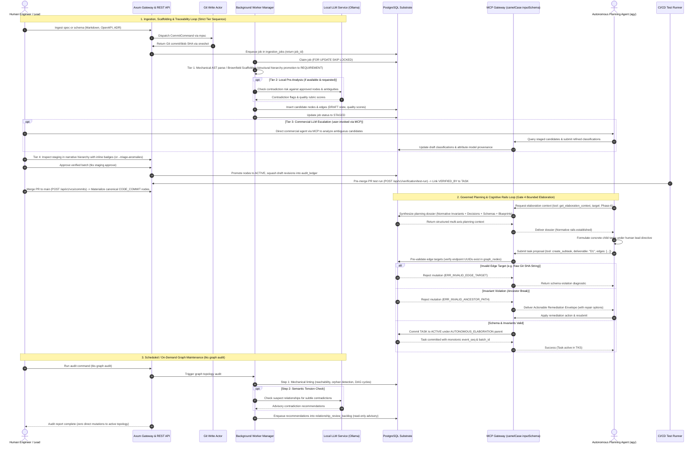

# Strategic Planning Backlog: Architecture, Roadmap, and Implementation Tactics

---

## 1. Executive Summary & Strategic Context

This document is the execution, tactical, and architectural companion to the [Technical Vision](docs/vision/vision.md). While the vision document defines the enduring North Star, foundational principles, environmental boundaries, and falsification criteria, this backlog details the phased execution roadmap, technical evaluation spikes, operational metrics, and concrete implementation workflows.

### Foundational Principles & Resource Model

This backlog is organized around the **"Start Small"**, **"Constrained Resource Model"**, **"Token Minimization & Mechanical Reliance"**, and **"Self-Referential Dogfooding"** directives:

- Minimize premature architectural complexity during early phases.
- Build the simplest viable mechanisms that satisfy the core vision invariants.
- Scope early progression to be fully achievable by a small team or solo developer using commodity infrastructure, ensuring each phase delivers standalone value.
- Reach self-hosting as early as possible so the system defines, tracks, and governs its own ongoing development.
- Maximize mechanical processes (e.g. streaming CommonMark AST parsing via `pulldown-cmark`) to handle the initial 80%+ of document decomposition, maintaining an active heading stack to mechanically generate upward structural hierarchy edges (`child_id -DERIVED_FROM-> parent_id`) and deterministic, disambiguated heading anchors (`ast_anchor`), establishing a principled structural hierarchy convention where top-level structural containers and Level-1/Level-2 headings automatically classify as `REQUIREMENT` anchors (with optional frontmatter overrides) rather than relying on brittle keyword regexes, minimizing costly LLM output token generation.
- Support **Brownfield Intent Scaffolding**: mechanical, zero-token ingestion adapters that extract baseline requirement and architectural decision nodes from existing structured repository artifacts (OpenAPI/Protobuf schemas, ADRs, BDD feature files), rapidly collapsing Time-to-First-Value (`CAL-TTFV`) without speculative code-level reverse-engineering.
- Enforce strict lifecycle distinction between editable drafts and locked approved requirements, storing candidates directly in the graph topology as `DRAFT` entities with first-class `created_by VARCHAR(64) NOT NULL` author attribution, permitting conditional typing (`'UNCLASSIFIED'`) exclusively during drafting, and utilizing ephemeral draft revision logging directly inside `graph_nodes.attributes->'draft_revisions'` with atomic draft compaction upon approval to eliminate audit ledger bloat.
- Consolidate document provenance by embedding source span coordinates directly on `graph_nodes` (`doc_path`, `doc_hash`, `byte_start`, `byte_end`), eliminating standalone table join overhead and duplicate cardinality issues, while governing document re-ingestion via a three-way delta reconciliation sweep: matching candidate sections against existing active nodes via AST anchors and hashes, preserving existing active node UUIDs, elaborated child tasks, and downstream verification edges, routing modifications to staging as targeted invalidation cascades (`NEEDS_REVERIFICATION`) rather than clobbering active topologies, and sweeping superseded unapproved drafts.
- Eliminate loose Git reference hacks in favor of standard Git branch commits (`refs/heads/specs`) with mandatory document paths/slugs (`doc_path`), ensuring natural 100% reachability, out-of-the-box `git log`/`git diff`, and deterministic span re-anchoring across revisions without garbage collection overrides.
- Establish a clean read/write concurrency split for Git operations: isolate blocking libgit2 C write calls from the async reactor via a dedicated background Git write actor task communicating over bounded `mpsc` and `oneshot` channels with internal panic recovery (`std::panic::catch_unwind`), while routing read-only ODB blob lookups (`get_document_span`, worker decomposition) through concurrent `tokio::task::spawn_blocking` routines, eliminating head-of-line blocking on immutable reads.
- Enforce a strict lock acquisition hierarchy for mutations: any transaction performing structural edge mutations, DAG cycle checks, batch staging approvals, or rollbacks must acquire the global transaction advisory lock `pg_advisory_xact_lock(hashtext('tks_structural_mutation'))` *before* acquiring any row-level locks on `graph_nodes` or `graph_edges`. Pure leaf attribute edits and task status changes execute concurrently using native PostgreSQL row-level locks (`SELECT ... FOR UPDATE`).
- Resolve **VCS Commit Dual-Representation & Pre-Merge CI Gating**: Ongoing branch-level commit SHAs are recorded in task execution attributes (`attributes->'vcs_commits'`), avoiding graph pollution. For pre-merge continuous integration (CI) gating, test verification runs can bind directly to active `TASK` entities via `VERIFIED_BY` edges carrying PR head commit SHAs in verification metadata (or link to provisional `CODE_COMMIT` entities), allowing CI pipelines to certify PR branch readiness *prior* to merging into `main`. Canonical merge commits to `main` or signed release tags are permanently materialized as canonical `CODE_COMMIT` graph nodes linked via explicit `IMPLEMENTED_BY` edges.
- Enforce **Scheduled & Advisory Graph Maintenance**: Background relationship maintenance runs as an on-demand or scheduled audit (`tks graph audit`) rather than an unconstrained daemon. It executes deterministic topological linting first, local LLM evaluation second, strictly emitting advisory recommendations to `relationship_review_backlog` without mutating active topology. Focus **Modular Governance Profiles** strictly on high-leverage institutional, security, and architectural policies (third-party dependency onboarding checklists, licensing compatibility rules, CVE audits, EU CRA compliance, architectural boundary invariants) while delegating file-syntax and markdown linting to standard CI tooling. Enforce policy severity tiers (Breaking vs. Advisory) and blast-radius throttling with batched work-package digests to prevent supervisory alert floods.
- Preserve **Narrative Context in Staging UX**: Review interfaces (`tks staging list`, Web Explorer) preserve the source document's hierarchical narrative order as the default presentation, rendering Quality Rubric and Contradiction Risk scores as inline visual badges, with a dedicated `--triage-anomalies` secondary view for flat exception scanning.
- Guarantee sub-5ms offline search for `query_requirements` via native PostgreSQL full-text search (`tsvector` / partial GIN index on active nodes) with query sanitization preventing hyphen-negation syntax corruption.
- Align dogfooding with the phased progression model: Phase 1 established read-only self-hosting for context querying, while Phase 2 established autonomous self-evolution.

### Strategic Pivot: Reprioritization & Closed-Loop Acceleration

Following the completion of Phase 3, an empirical dogfooding experiment was conducted (`scripts/phase4-experiment.sh`; detailed in `docs/vision/phase4-experiment-review.md`) to evaluate whether an autonomous coding agent (`agy`) could use TKS as its **sole source of truth** to elaborate execution tasks without reading `docs/vision/`.

The experiment revealed that while the underlying PostgreSQL storage, Git ODB actor, and mutation endpoints functioned as designed, **TKS exhibited four specific structural failure modes**:

1. **Protocol Handshake Breakdown:** The MCP stdio server serialized tool parameters using snake_case `input_schema` instead of the MCP specification's camelCase `inputSchema`, causing the agent's permission harness to reject MCP calls and forcing fallback to raw CLI/SQL.
2. **Context Retrieval Desert:** `get_context_envelope` was designed for leaf-task execution (narrow immediate graph locality). For strategic planning and phase elaboration, it delivered only a 3-bullet summary stripped of governing architectural invariants (`INV-*`), historical design decisions (`D-*`), physical database schemas, and codebase blueprints.
3. **Graph Taxonomy Deficit & Invariant Roadblock:** The CommonMark AST decomposition worker classified section headings universally as `SPECIFICATION`, leaving zero `REQUIREMENT` nodes in the database. When the agent attempted task elaboration, Invariant INV-1 validation failed with `ERR_INVALID_ANCESTOR_PATH`, delivering zero diagnostic or remediation guidance and prompting the agent to hack the database directly via SQL.
4. **Unconstrained Mutation Interface:** The mutation API accepted tasks that violated physical relational schemas (attempting to connect `IMPLEMENTED_BY` edges directly to raw Git SHA strings rather than node UUIDs) and hallucinated ungrounded components because edge targets were not pre-validated.

**Strategic Realization:** None of these four failure modes required building complex multi-tier commercial LLM escalation pipelines or continuous local background LLM daemons. Inserting expansive semantic phases ahead of core verification created an over-correction that unnecessarily delayed the central value proposition of TKS: **closed-loop traceability from requirements to code commits and test runs**. Furthermore, autonomous agents should not be tasked with unguided, open-ended strategic roadmap invention; rather, they excel when performing **bounded, interactive task elaboration under human-directed deliverable directives**.

**Reprioritized Strategic Action:**
1. **Pull Closed-Loop Traceability Forward into Phase 4:** Directly couple foundational mechanical fixes (structural heading taxonomy in `src/worker/decomp.rs`, camelCase MCP serialization, relational edge pre-validation, living graph delta reconciliation) with pre-merge PR commit linking and CI test execution mapping. Proving that approved requirements govern executable code is foundational viability.
2. **Cognitive Planning Rails in Phase 5:** Equip TKS with `get_elaboration_context`, actionable remediation envelopes (with ancestor promotion options), and bounded interactive task elaboration templates, achieving Gate 4 dogfooding under human lead directives.
3. **Modular Governance & Scheduled Maintenance in Phase 6:** Encapsulate high-value institutional and architectural policy profiles with blast-radius throttling, and deploy scheduled/on-demand graph audits (`tks graph audit`) emitting advisory proposals to `relationship_review_backlog`.
4. **Benchmark Realignment & Stratified Downgrading:** Adopt the **Real-World Feature Extension Benchmark** using commercial utility models (Haiku/Flash/mini, 10x–20x cost reduction) as the primary empirical standard for model downgrading efficiency in Phase 5 Gate 4, while reserving local commodity 8B edge models and complete self-reconstruction as aspirational post-v1.0 research horizons (Phase N+).

---

## 2. Phased Execution Roadmap

```mermaid
%%{init: {
  'theme': 'base',
  'themeVariables': {
    'darkMode': true,
    'background': '#161922',
    'mainBkg': '#1e2230',
    'nodeBorder': '#434c5e',
    'textColor': '#e2e8f0',
    'fontFamily': 'ui-sans-serif, system-ui, -apple-system, BlinkMacSystemFont, "Segoe UI", Roboto, "Helvetica Neue", Arial, sans-serif',
    'fontSize': '14px',
    'lineColor': '#8892b0',
    'primaryColor': '#422026',
    'primaryTextColor': '#fde8ec',
    'primaryBorderColor': '#e06c75',
    'secondaryColor': '#1b3528',
    'secondaryTextColor': '#e6f7ee',
    'secondaryBorderColor': '#73c991',
    'tertiaryColor': '#1d2c44',
    'tertiaryTextColor': '#e4f0fc',
    'tertiaryBorderColor': '#61afef',
    'clusterBkg': '#13161f',
    'clusterBorder': '#373e51',
    'noteBkgColor': '#2e271a',
    'noteTextColor': '#fdf4db',
    'noteBorderColor': '#e5c07b',
    'edgeLabelBackground': '#1a1d27'
  }
}}%%
flowchart LR
    classDef primary fill:#422026,stroke:#e06c75,stroke-width:1.5px,color:#fde8ec;
    classDef secondary fill:#1b3528,stroke:#73c991,stroke-width:1.5px,color:#e6f7ee;
    classDef tertiary fill:#1d2c44,stroke:#61afef,stroke-width:1.5px,color:#e4f0fc;
    classDef completed fill:#1c2d27,stroke:#529b71,stroke-width:1.5px,color:#c2ebd4;

    P0["Phase 0: Pre-Construction Spikes<br/><i>[COMPLETED]</i>"]:::completed
    P1["Phase 1: Substrate Core & Read Context<br/><i>[COMPLETED]</i>"]:::completed
    P2["Phase 2: Bounded Agent Mutation<br/><i>[COMPLETED]</i>"]:::completed
    P3["Phase 3: Impact Analysis & Observability<br/><i>[COMPLETED]</i>"]:::completed

    P4["Phase 4: Foundational Ingestion & Closed-Loop Traceability<br/><i>(Heading Promotion + MCP camelCase + Edge Pre-Val + VCS/CI Traceability)</i>"]:::secondary
    P5["Phase 5: Cognitive Planning Rails & Governed Dogfooding<br/><i>(Multi-Axis Context + Remediation Envelopes + Bounded Gate 4)</i>"]:::secondary
    P6["Phase 6: Modular Governance Profiles & Scheduled Maintenance<br/><i>(Policy Packs + On-Demand Audit + Invalidation Cascades)</i>"]:::secondary
    PN["Phase N+: Advanced Strategic Horizons<br/><i>(Real-World Feature Extension + Self-Reimplementation POC)</i>"]:::tertiary

    P0 --> P1 --> P2 --> P3 --> P4 --> P5 --> P6 --> PN
```

### Completed Phases Summary (Phases 0–3)

The foundational substrate, storage architecture, mutation engines, and supervisory observability portals were implemented and validated across Phases 0 through 3:

| Phase | Core Milestone & Capabilities Delivered | Verification Status & Artifacts |
| :--- | :--- | :--- |
| **Phase 0: Hypothesis De-risking & Spikes** | Validated Hypothesis H-1 via Spike 0 (83.8% constraint violation reduction). Validated local embedded vector inference via Spike 8 (`fastembed-rs`, 15.9ms latency). Scaffolding for PostgreSQL + `pgvector` containerization. | **COMPLETED & VERIFIED:** `spike0-results.md`; `spike8-results.md`; `phase0-decisions.md` (DEC-0.1..0.12) |
| **Phase 1: Substrate Core & Read Context** | Bare Git document repository (`refs/heads/specs`) with dedicated background write actor. PostgreSQL schema (`graph_nodes`, `graph_edges`, `node_embeddings`, `audit_ledger`, `ingestion_jobs`). Two-stage CommonMark AST decomposition (`pulldown-cmark`) with embedded source spans. Axum REST gateway, stdio MCP server proxy, and embedded refinery migrations. | **COMPLETED & VERIFIED (Gate 1):** `phase1-plan.md`; `phase1-decisions.md` (D-1..D-50); Successful self-hosting of `vision.md` and backlogs |
| **Phase 2: Bounded Agent Mutation & Governance** | Mutation MCP tools (`propose_node_mutation`, `create_subtask`, `update_node_status`). Strict lock acquisition hierarchy (global advisory lock before row locks). Autonomous task elaboration under `AUTONOMOUS_ELABORATION` nodes. Draft lifecycle event compaction squashing intermediate edits upon approval. Unified administrative rollback (`revert_mutations`). | **COMPLETED & VERIFIED (Gate 2):** `phase2-plan.md`; `phase2-decisions.md` (D-51..D-82); Tests: `tests/dogfood_gate2.rs`, `tests/mutation_api.rs` |
| **Phase 3: Impact Analysis & Supervisory Portal** | Automated invalidation cascading marking downstream nodes as `NEEDS_REVERIFICATION`. Reverification endpoints (`POST /api/v1/nodes/{id}/reverify`) and MCP tools. Single-page Cytoscape Web Explorer (`/explorer`) with live SSE event streaming. Multi-agent branch workspace container isolation (DEC-3.5) with atomic promotion serialization. | **COMPLETED & VERIFIED (Gate 3):** `phase3-plan.md`; `phase3-decisions.md` (D-83..D-90); Tests: `tests/cascade_integration.rs`, `tests/branch_workspace.rs` |

---

### Phase 4: Foundational Ingestion & Closed-Loop Traceability

- **Primary Objective:** Deliver foundational mechanical ingestion fixes, strict protocol conformance, relational edge pre-validation, brownfield intent scaffolding, and end-to-end closed-loop code traceability, proving that approved requirements govern executable code.
- **Core Deliverables:**
  1. **Structural Heading Taxonomy & Invariant I-1 Hierarchy Normalization:**
     - Update CommonMark AST decomposition worker (`src/worker/decomp.rs`): replace fragile keyword regex heuristics with a principled structural hierarchy convention. Top-level structural containers and Level-1 (`#`) or Level-2 (`##`) headings automatically classify as `REQUIREMENT` anchors by structural depth, with support for explicit frontmatter metadata overrides (`type: REQUIREMENT`). Sub-sections classify as `SPECIFICATION` nodes.
     - Ensures that upon staging approval, an intact ancestral hierarchy exists that naturally satisfies Invariant INV-1 out-of-the-box across arbitrary, real-world documentation formats.
  2. **MCP Protocol Conformance & Hardening:**
     - Enforce strict adherence to the official Model Context Protocol (MCP 2024-11-05 spec) across `tks mcp-stdio` and HTTP endpoints.
     - Specifically serialize tool parameter schemas under camelCase **`inputSchema`** (fixing the snake_case bug that prevented `call_mcp_tool` integration in client agent harnesses).
  3. **Relational Edge Pre-Validation & Endpoint Integrity:**
     - Enforce pre-validation on all proposed edge targets: both `from_node_id` and `to_node_id` must resolve to registered node UUIDs in `graph_nodes` *before* transaction execution, rejecting foreign-key violations (such as raw Git SHA strings) with clear error diagnostics.
  4. **Pre-Merge CI Traceability & VCS Commit Duality:**
     - Webhook endpoints (`POST /api/v1/vcs/commits`) and CLI commands linking repository commits directly to task nodes.
     - Pre-Merge PR Verification Gating: Resolve the pre-merge paradox by enabling CI test execution results (`POST /api/v1/verification/test-run`) to link directly to active `TASK` entities via `VERIFIED_BY` edges carrying candidate PR head commit SHAs in verification metadata (or to provisional `CODE_COMMIT` nodes). This allows CI pipelines to certify PR branch readiness *before* merging into `main`.
     - Release Commit Materialization: Ongoing branch-level commits remain in `attributes->'vcs_commits'`, while canonical merge commits to `main` or signed release tags are permanently materialized as typed `CODE_COMMIT` graph nodes linked via explicit `IMPLEMENTED_BY` edges.
     - Release readiness status inspection endpoint (`GET /api/v1/release/readiness`) reporting requirement fulfillment.
  5. **Brownfield Intent Scaffolding:**
     - Mechanical, zero-token ingestion adapters parsing OpenAPI/AsyncAPI/Protobuf schemas, Architecture Decision Records (ADRs), and BDD feature files into baseline requirement, architectural decision, and specification nodes.
     - Drastically lowers Time-to-First-Value (`CAL-TTFV`) for brownfield repositories without speculative code reverse-engineering.
  6. **Multi-Tier Ingestion Analysis & Narrative-Preserving Staging Review:**
     - *Tier 1 (Mechanical AST Extraction):* Mandatory baseline zero-token structural decomposition (`pulldown-cmark`) with structural heading promotion.
     - *Tier 2 (Local LLM Pre-Analysis):* Executed **if available and requested**, evaluating **Contradiction Risk against existing approved nodes first**, followed by preliminary ambiguity and testability scores.
     - *Tier 3 (User-Invoked Commercial LLM Escalation):* User escalates via open protocols to inspect candidates and resolve ambiguities without echoing source text.
     - *Tier 4 (Human Supervisory Gate):* Staging review in CLI (`tks staging list`) and Web Explorer **strictly preserves the source document's hierarchical narrative order as the default presentation**, rendering Quality Rubric and Contradiction Risk scores as inline visual heatmaps and section callouts. A secondary `--triage-anomalies` flag provides flat exception triage.
  7. **Living Graph Re-Ingestion & Three-Way Delta Reconciliation:**
     - Re-ingesting updated specifications executes an additive delta reconciliation against the active graph topology rather than a destructive wholesale replacement.
     - Stable AST anchors and cryptographic hashes match candidate sections to active graph nodes. Unmodified nodes retain active status, UUIDs, and downstream task/verification edges.
     - Modified sections enter staging as delta candidates, triggering targeted invalidation cascades (`NEEDS_REVERIFICATION`) upon approval instead of clobbering active state.
     - Omitted sections are flagged for supervised deprecation, preventing accidental orphan cascades while preserving human supervisory oversight.

---

### Phase 5: Cognitive Planning Rails & Governed Dogfooding Milestone

- **Primary Objective:** Equip TKS with active cognitive planning rails that supply external agents with the complete normative, architectural, and schema context needed to elaborate execution plans interactively under human-directed deliverable directives, culminating in Gate 4 dogfooding.
- **Core Deliverables:**
  1. **Multi-Axis Planning Dossier (`get_elaboration_context`):**
     - Introduce a dedicated MCP tool and REST endpoint: `GET /api/v1/nodes/{id}/elaboration-context` (`get_elaboration_context`), distinct from leaf-level `get_context_envelope`.
     - Synthesizes a structured planning dossier across four informational axes:
       - *Normative Boundaries:* Binding architectural invariants (`INV-1` through `INV-9`) and governance policies.
       - *Architectural Precedents:* Relevant architectural decisions (`D-*`) matching deliverable tags.
       - *Physical Schema Contracts:* Explicit node type and edge type enums, foreign key rules, and directionality constraints.
       - *Implementation Blueprints:* Paths to canonical route handlers, storage CTEs, background workers, and test scaffolding in the repository.
  2. **Actionable Invariant Diagnostics & Self-Healing Remediation Envelopes:**
     - Replace opaque error strings (`ERR_INVALID_ANCESTOR_PATH`) with structured JSON remediation envelopes containing the exact terminal failure node and deterministic remediation options (e.g., deterministic ancestor promotion suggestions to promote an immediate `SPECIFICATION` ancestor to `REQUIREMENT` under authorized caller governance).
  3. **Bounded Interactive Phased Planning Rails:**
     - Structure agent planning workflows interactively deliverable-by-deliverable rather than as a single-shot prompt dump.
     - The agent receives human deliverable directives and formulates schema-compliant child tasks without violating architectural invariants.
  4. **Tactical Decision Capture & Permission Scoping:**
     - Automatically record agent-specified implementation parameters (ranges, CLI flags, types) into node attributes with full caller provenance.
     - Enforce permission scoping restricting upward propagation to preserve vision integrity.
- **Dogfooding Milestone (Gate 4 - Bounded Planning of Phase 6):**
  - Execute `scripts/phase4-experiment.sh` (or updated equivalent runner): the autonomous agent powered by a commercial utility model (e.g., Claude 3.5 Haiku, Gemini Flash, GPT-4o-mini, delivering 10x–20x cost reduction), strictly forbidden from reading `docs/vision/`, connects to TKS via MCP, requests `get_elaboration_context`, and successfully elaborates grounded, schema-compliant execution tasks for Phase 6 deliverables under human direction in the live property graph.

---

### Phase 6: Modular Governance Profiles & Scheduled Relationship Maintenance

- **Primary Objective:** Model institutional governance, policies, and standard operating procedures as modular, reusable graph clusters, and maintain graph hygiene through scheduled and on-demand audits.
- **Core Deliverables:**
  1. **Modular Governance Profiles:**
     - Define and ingest governance materials (processes, procedures, policies, standards) as encapsulated modular graph units.
     - Introduce **Governance Profiles**: reusable packages linking specific high-leverage policies (e.g., third-party dependency onboarding checklists, licensing compatibility policies, CVE supply-chain auditing, EU Cyber Resilience Act compliance, and architectural boundary invariants—relying on standard external tools for static file formatting and syntax linting) to a project's root nodes via `GOVERNED_BY_PROCEDURE` edges.
     - Establish the **Quality Verification Loop**: linking project artifacts, tasks, and commits directly to active governance profile rules and checklists.
  2. **Scheduled & On-Demand Graph Maintenance Auditor (`tks graph audit`):**
     - Run relationship maintenance as an explicit, on-demand or periodic audit command (`tks graph audit`) rather than an unconstrained continuous daemon.
     - Mandatory deterministic first pass: executes structural topology linting (reachability, orphan detection, broken transitive closures) before invoking local LLM inference.
     - Enforce strictly read-only advisory status: the relationship worker **never directly mutates, prunes, or deletes active graph edges**. It strictly emits candidate recommendations into `relationship_review_backlog`.
  3. **Prioritized Relationship Review Backlog:**
     - Stores suspicious, conflicting, or orphaned relationships in a ranked queue (`relationship_review_backlog`).
     - Surfaces high-priority graph anomalies in the Web Explorer and CLI for human engineering triage.
  4. **Policy Invalidation Cascades & Blast-Radius Throttling:**
     - Enforce policy update severity classification (Breaking vs. Advisory).
     - When breaking governance policies update, the invalidation engine cascades downstream across linked projects with blast-radius throttling, grouping invalidations into batched digest work packages and flagging affected requirements as `NEEDS_REVERIFICATION` to eliminate supervisory alert fatigue.

---

### Phase N+: Advanced Strategic Horizons (Future Roadmap)

- **The Real-World Feature Extension Benchmark (Tier 1 Utility Models):** The primary empirical evaluation demonstrating that an external agent powered by a commercial utility model (Haiku/Flash/mini, 10x–20x cost reduction) guided by TKS cognitive rails implements complex new feature modules in realistic codebases without invariant violations, proving model downgrading efficiency.
- **The Self-Reimplementation Benchmark & Edge Model Evaluation (Tier 2 Commodity 8B):** An aspirational post-v1.0 research evaluation exploring complete self-reconstruction and complex feature extension using local commodity 8B models (e.g., Qwen 8B in Ollama), investigating the lower limits of model scale when supported by cognitive rails.
- **Reverse Document Projection:** Dynamic aggregation and synthesis of graph subgraphs into tailored, human-readable Markdown specifications (broad vision/architecture overviews or targeted vertical slices) via LLM orchestration.
- **External Artifact Validation & Knowledge Base Review:** Validating external documents (slide decks, RFCs, PRDs) against the authoritative knowledge graph, providing structured inconsistency and gap feedback.

---

## 3. Self-Referential Bootstrapping & Dogfooding Strategy

```mermaid
%%{init: {
  'theme': 'base',
  'themeVariables': {
    'darkMode': true,
    'background': '#161922',
    'mainBkg': '#1e2230',
    'nodeBorder': '#434c5e',
    'textColor': '#e2e8f0',
    'fontFamily': 'ui-sans-serif, system-ui, -apple-system, BlinkMacSystemFont, "Segoe UI", Roboto, "Helvetica Neue", Arial, sans-serif',
    'fontSize': '14px',
    'lineColor': '#8892b0',
    'primaryColor': '#422026',
    'primaryTextColor': '#fde8ec',
    'primaryBorderColor': '#e06c75',
    'secondaryColor': '#1b3528',
    'secondaryTextColor': '#e6f7ee',
    'secondaryBorderColor': '#73c991',
    'tertiaryColor': '#1d2c44',
    'tertiaryTextColor': '#e4f0fc',
    'tertiaryBorderColor': '#61afef',
    'clusterBkg': '#13161f',
    'clusterBorder': '#373e51',
    'noteBkgColor': '#2e271a',
    'noteTextColor': '#fdf4db',
    'noteBorderColor': '#e5c07b',
    'edgeLabelBackground': '#1a1d27'
  }
}}%%
flowchart TD
    classDef primary fill:#422026,stroke:#e06c75,stroke-width:1.5px,color:#fde8ec;
    classDef secondary fill:#1b3528,stroke:#73c991,stroke-width:1.5px,color:#e6f7ee;
    classDef tertiary fill:#1d2c44,stroke:#61afef,stroke-width:1.5px,color:#e4f0fc;
    classDef completed fill:#1c2d27,stroke:#529b71,stroke-width:1.5px,color:#c2ebd4;

    subgraph Complete["Completed Bootstrapping Foundations"]
        G1["Gate 1 (Phase 1): Read-Only Self-Hosting<br/><i>(Self-ingested vision.md & backlogs)</i>"]:::completed
        G2["Gate 2 (Phase 2): Autonomous Self-Evolution<br/><i>(Agent subtask elaboration via MCP)</i>"]:::completed
        G3["Gate 3 (Phase 3): Impact Cascading & Workspaces<br/><i>(Branch isolation & reverification)</i>"]:::completed
    end

    subgraph TraceabilityAndRails["Foundational Verification & Planning Rails"]
        B4["Phase 4: Foundational Ingestion & Closed-Loop Traceability<br/><i>(Heading Promotion + Pre-Val + VCS/CI Traceability + Brownfield)</i>"]:::secondary
        B5["Phase 5: Cognitive Planning Rails & Bounded Dogfooding<br/><i>(Multi-Axis Dossier + Remediation + Gate 4 Elaboration)</i>"]:::secondary
        B6["Phase 6: Modular Governance Profiles & Scheduled Maintenance<br/><i>(Policy Packs + On-Demand tks graph audit)</i>"]:::secondary
    end

    subgraph DogfoodTarget["Gate 4: Bounded Planning Benchmark"]
        G4["Dogfooding Gate 4:<br/><i>Autonomous Agent Elaborates Phase 6 Tasks via TKS MCP Only (Zero docs/vision/ Access)</i>"]:::primary
        Bench["Feature Extension Benchmark:<br/><i>Agent Implements Substantial Feature Module in Realistic Codebase</i>"]:::tertiary
    end

    Complete --> TraceabilityAndRails --> DogfoodTarget
```

### Bootstrap Phasing Plan

1. **Phases 0–3 Baseline (Completed):**
   - Built storage, Git coupling, two-stage mechanical AST decomposition, read/write MCP gateways, audit logging, per-node governance, supervisory web explorer, and branch workspace isolation.
   - Passed Gate 1 (self-hosting documentation query), Gate 2 (autonomous mutation elaboration), and Gate 3 (multi-agent branch isolation and invalidation cascading).
2. **Phase 4 Pipeline (Foundational Ingestion, Closed-Loop Traceability & Brownfield Scaffolding):**
   - Implements mechanical heading promotion, camelCase MCP serialization, edge pre-validation, Brownfield Intent Scaffolding (OpenAPI, ADRs, BDD), and basic VCS commit / CI test-run mapping.
   - Eliminates roadmap latency by proving the end-to-end loop from requirements to code commits and test runs early.
3. **Phase 5 Transition (Cognitive Planning Rails & Dogfooding Gate 4):**
   - Deploys `get_elaboration_context`, actionable remediation envelopes, and bounded interactive task templates.
   - **Verification Experiment:** Launch `scripts/phase4-experiment.sh` (or updated equivalent runner). An autonomous agent running via `agy` connects to TKS with `docs/vision/` forbidden, requests elaboration context, and generates grounded, schema-compliant child tasks for Phase 6 deliverables under human lead directives.
4. **Phase 6 (Modular Governance & Scheduled Maintenance):**
   - Ingests governance policy profiles, runs scheduled/on-demand graph audits (`tks graph audit`) emitting to `relationship_review_backlog`, and cascades invalidations.
5. **Phase N+ (Advanced Strategic Horizons):**
   - Real-World Feature Extension Benchmark, Reverse Document Projection, External Artifact Validation, and Self-Reimplementation POC.

---

## 4. Minimum Viable Demonstration (MVD) Acceptance Test Scripts

### Historical Demonstrations Summary (Milestones 1–3 - Completed)

- **Milestone 1 (Ingest, Version, and Retrieve - Phase 1):** Verified Git bare repository commit on `refs/heads/specs`, mechanical CommonMark AST decomposition into draft nodes with byte spans, staging CLI approval, and sub-5ms full-text and context queries.
- **Milestone 2 (Bounded Mutation & Clean Rollback - Phase 2):** Verified autonomous task creation under `AUTONOMOUS_ELABORATION` nodes, transactional ancestor CTE validation, draft compaction upon approval, DAG cycle rejection, and unified `revert_mutations` rollback.
- **Milestone 3 (Impact Cascading & Reverification - Phase 3):** Verified automated invalidation cascading marking downstream nodes as `NEEDS_REVERIFICATION`, context inspection of invalidated nodes, reverification via `reverify_node`, and Cytoscape explorer visualization.

---

### Phase 4 MVD: Foundational Ingestion & Closed-Loop Traceability

- **Preconditions:** PostgreSQL instance active; Git repository initialized; dev identity authenticated; optional devcontainer Ollama service available.
- **Test Procedure:**
  1. Submit a multi-section technical vision document (`POST /api/v1/documents/ingest` with `doc_path = "specs/vision.md"`) containing top-level headings (`# Phase 1`, `## Core Requirements`). Also ingest a sample OpenAPI contract and ADR file to verify Brownfield Intent Scaffolding.
  2. Verify Tier 1: CommonMark AST parser mechanically classifies top-level structural containers and Level-1/Level-2 headings as `REQUIREMENT` nodes (with canonical `node_key` tags) by structural hierarchy convention rather than keyword regexes, and sub-sections as `SPECIFICATION` nodes, constructing valid `DERIVED_FROM` edges at zero token cost.
  3. Verify Tier 2: When requested, local LLM performs automated pre-analysis and scores candidate requirements against the Quality Rubric, evaluating **Contradiction Risk against existing approved nodes first**, followed by Ambiguity, Testability, and Atomicity.
  4. Verify Tier 3 (Escalation): Ingest a deliberately ambiguous chunk; user escalates to external commercial LLM via open protocol to resolve classification, verifying TKS records model provenance attributes.
  5. Invoke `tks staging list <job_id>`; verify candidate nodes are displayed in their source document **hierarchical narrative order by default**, with Quality Rubric and Contradiction Risk scores rendered as inline visual badges. Invoke with `--triage-anomalies` to verify secondary flat anomaly view.
  6. Approve the staging batch via `tks staging approve <job_id>`; verify nodes are promoted to `ACTIVE`, with root `REQUIREMENT` nodes established in the live graph.
  7. Pre-Merge PR Verification & Commit Duality: Simulate continuous integration testing on a pull request branch: dispatch `POST /api/v1/verification/test-run` linking test results directly to active `TASK` entities via `VERIFIED_BY` edges carrying the PR head commit SHA in verification metadata (or provisional `CODE_COMMIT` entities), certifying PR branch readiness *before* merge. Dispatch `POST /api/v1/vcs/commits` upon merge to `main`, permanently materializing canonical `CODE_COMMIT` nodes linked via `IMPLEMENTED_BY` edges.
  8. Query `GET /api/v1/release/readiness`; verify release readiness reports active requirement satisfaction.
  9. Living Graph Re-Ingestion Verification: Ingest an updated revision of `specs/vision.md` with modified section text and an added requirement. Verify that three-way delta reconciliation preserves existing active node UUIDs, elaborated child tasks, and downstream verification links, while staging only modified and added nodes.

---

### Phase 5 MVD: Cognitive Planning Rails & Bounded Dogfooding Benchmark (Gate 4)

- **Preconditions:** Phase 4 active; governance policy on target parent set to `AUTONOMOUS_ELABORATION`.
- **Test Procedure:**
  1. Connect `agy` or an external MCP client powered by a commercial utility model (e.g. Claude 3.5 Haiku, Gemini Flash, GPT-4o-mini, achieving 10x–20x cost reduction) to `tks mcp-stdio`. Verify `tools/list` returns valid JSON with camelCase `inputSchema` (zero permission errors in client).
  2. The agent invokes `get_elaboration_context` for the target Phase 6 parent node:
     - Verify response delivers: verbatim deliverable specifications, binding invariants (`INV-1`..`INV-9`), applicable decisions (`D-11`, `D-14`, `D-43`), physical schema enums, and concrete repository blueprint paths.
  3. The agent attempts to create a task with an invalid edge target (e.g. an external Git SHA string):
     - Verify mutation engine rejects the payload prior to transaction commit, returning an actionable error indicating target ID is not a registered node UUID.
  4. The agent attempts an elaboration violating Invariant INV-1 under a `SPECIFICATION` node:
     - Verify gateway returns an **Actionable Remediation Envelope** specifying the terminal node and providing a structured option to promote the immediate ancestor to `REQUIREMENT`.
  5. The agent executes bounded phased elaboration under human deliverable directives, generating atomic child tasks for Deliverables 1, 2, and 3:
     - Verify all created tasks are active in `graph_nodes`, correctly linked to parent requirements, and visible in Web Explorer.

---

### Phase 6 MVD: Modular Governance Profiles & Scheduled Graph Maintenance

- **Preconditions:** Active property graph with Phase 4 and 5 deliverables approved.
- **Test Procedure:**
  1. Ingest a modular governance document (`specs/policies/dependency-vetting.md`) defining third-party dependency onboarding and CVE supply-chain auditing procedures. Link to root requirement via `GOVERNED_BY_PROCEDURE` edge.
  2. Update a core policy rule in the governance profile with breaking severity; verify that the invalidation cascade applies blast-radius throttling, grouping affected downstream requirements into a batched digest work package marked as `NEEDS_REVERIFICATION` without triggering alert floods.
  3. Run on-demand audit: `tks graph audit`. Verify deterministic topological linting executes first, followed by local LLM contradiction check.
  4. Verify relationship worker operates in strictly read-only advisory capacity: candidate adjustments and pruning suggestions are enqueued into `relationship_review_backlog` without modifying active graph topology.
  5. Inspect review backlog in CLI and Web Explorer.

---

## 5. Architectural Evaluation Spikes & Technical Investigations

*(Spikes 0 through 8 represent completed pre-construction investigations grounding system decisions D-1 through D-82; see `architecture.md` §9 and `phase0-decisions.md` for full results).*

- **Spike 0 (Completed):** Graph-bounded context envelopes vs. multi-tool agentic retrieval (Hypothesis H-1). Confirmed 83.8% constraint violation reduction. Greenlight for construction.
- **Spike 1 (Completed):** Recursive CTEs on PostgreSQL relational adjacency tables vs. external graph DBMS. Satisfied SLA-1 (<50ms for $k \le 3$) with zero multi-database synchronization drift.
- **Spike 2 (Completed):** Append-only audit ledger with draft lifecycle event compaction upon approval. Eliminates ledger bloat while ensuring point-in-time reversibility.
- **Spike 3 (Completed):** Dedicated background Git write actor over mpsc/oneshot channels paired with concurrent read-only ODB lookups (`git2::Odb::read`).
- **Spike 4 (Completed):** Streaming CommonMark AST parsing (`pulldown-cmark`) extracting 80%+ of structural blocks and exact character spans at zero token cost.
- **Spike 5 (Completed):** MCP tool schemas (`get_context_envelope`, `propose_node_mutation`, `query_requirements`, `get_document_span`, `revert_mutations`) with depth and quota guardrails.
- **Spike 6 (Completed):** Two-tier identity model (API keys/HMAC) with Tower middleware and in-process cache, enforcing global advisory locks for structural mutations.
- **Spike 7 (Completed):** Strongly typed `lifecycle_state`, partial unique indexes, and atomic staging draft purging.
- **Spike 8 (Completed):** Local embedded vector inference (`fastembed-rs`, `all-MiniLM-L6-v2`). Achieved 15.9ms latency and 70% retrieval parity with commercial embeddings on commodity CPU.

---

## 6. Quantitative Operational Targets & Metric Calibrations

| Metric Identifier | Metric Name | Strategic Calibration Target | Validation Horizon |
| :--- | :--- | :--- | :--- |
| **SLA-1** | Micro-Reflex Graph Traversal Latency | $< 50\text{ ms}$ for $k \le 3$ hop topological queries | Phase 1 Benchmark (Validated) |
| **SLA-2** | Context Envelope Assembly Latency | $< 100\text{ ms}$ at $10^5$ nodes in PostgreSQL | Phase 2 Benchmark (Validated) |
| **CAL-H1** | Contract Violation Reduction (Hypothesis H-1) | $\ge 40$% fewer architectural violations vs. competent agentic baseline (Spike 0 achieved 83.8%) | Phase 2 Controlled Trial |
| **CAL-H2** | Human Review Overhead Reduction (Hypothesis H-2) | $\ge 50$% reduction in supervisory review time per feature | Phase 3 User Study |
| **CAL-H3** | Single-Engine Scalability Bound (Hypothesis H-3) | Sustained $< 100\text{ ms}$ query latency at $10^6$ nodes | Phase 3 Stress Test |
| **CAL-H4** | Extraction Fidelity Benchmark (Hypothesis H-4) | $\ge 95$% precision/recall on atomic requirement spans | Phase 1 Ingestion Eval |
| **CAL-TTFV** | Time-to-First-Value Latency (Observable 7) | $\le 30\text{ minutes}$ from raw markdown specification upload to first active agent context retrieval | Phase 1 Benchmark |
| **CAL-BROWN** | Brownfield Intent Scaffolding Efficiency | $\le 5\text{ minutes}$ to mechanically extract baseline requirement and decision nodes from OpenAPI or ADRs at zero token cost | Phase 4 Benchmark |
| **CAL-Q1** | Ingestion Quality Rubric & Narrative Preservation | $\ge 90$% precision in automated detection of contradiction risk (ranked first), ambiguity, and untestable assertions; 100% preservation of narrative order in default staging view | Phase 4 Benchmark |
| **CAL-PLAN** | Autonomous Planning Schema Compliance | 100% of agent-elaborated tasks and edges pass relational pre-validation (zero FK or orphan errors) under bounded human deliverable directives | Phase 5 Dogfooding (Gate 4) |
| **CAL-DOWN-1** | Commercial Utility Model Arbitrage (Tier 1) | High-speed commercial utility model (Haiku/Flash/mini, 10x–20x cost reduction) guided by `get_elaboration_context` matches unguided frontier model plan completeness and feature fidelity on Real-World Feature Extension Benchmark | Phase 5 Evaluation (Gate 4) |
| **CAL-DOWN-2** | Local Commodity 8B Edge Parity (Tier 2) | Local commodity 8B model (Qwen 8B) guided by `get_elaboration_context` achieves schema compliance and task elaboration on Feature Extension Benchmark | Phase N+ Research Horizon |

---

## 7. Operational Workflow Specifications & Interaction Sequences

### Detailed Sequence Description

1. **Foundational Ingestion & Structural Heading Classification:** The human engineer uploads technical markdown or brownfield structured artifacts (OpenAPI schemas, ADRs, BDD feature files) via REST. The Git write actor commits documents to `refs/heads/specs`. The background worker executes Tier 1 mechanical CommonMark parsing and scaffolding, promoting top-level structural containers and Level-1/Level-2 headings directly to `REQUIREMENT` nodes under a principled structural hierarchy convention and generating upward `DERIVED_FROM` hierarchy edges.
2. **Quality Scoring & Narrative-Preserving Staging:**
   - *Tier 1 (Mechanical):* Zero-token AST parsing extracts structural blocks, byte spans, and scaffolded entities.
   - *Tier 2 (Local LLM Pre-Analysis):* If available and requested, a local model evaluates **Contradiction Risk against existing approved nodes first**, flagging potential semantic conflicts and computing preliminary ambiguity/testability scores.
   - *Tier 3 (User Escalation to Commercial LLM):* The user can optionally instruct an external commercial LLM via open protocols to inspect staged candidates and resolve complex semantic classifications.
   - *Tier 4 (Human Gate):* Staging candidates are surfaced in the CLI and Web Explorer **preserving the document's native narrative order by default**, with Quality Rubric and Contradiction Risk scores rendered as inline badges and callouts. For re-ingested specifications, Tier 4 performs three-way delta reconciliation against active graph topology, preserving active node UUIDs, elaborated child tasks, and downstream verification links while staging only detected deltas. Promoted nodes commit to `graph_nodes` in `ACTIVE` state with active `REQUIREMENT` roots established.
3. **Closed-Loop Code & Test Traceability (Pre-Merge CI & Commit Duality):** Continuous integration pipelines report test results during PR evaluation via `POST /api/v1/verification/test-run`, linking test results directly to active `TASK` nodes via `VERIFIED_BY` edges carrying candidate PR commit SHA metadata (or provisional `CODE_COMMIT` nodes) to certify PR branch readiness *before* merging into `main`. Upon merge to `main`, `POST /api/v1/vcs/commits` permanently materializes canonical `CODE_COMMIT` nodes linked via `IMPLEMENTED_BY` edges.
4. **Multi-Axis Planning Dossier Retrieval:** When an autonomous agent (powered by a commercial utility model) is assigned to elaborate deliverables, it calls `get_elaboration_context` via the MCP gateway. Rather than returning a bare summary, the gateway synthesizes a multi-axis planning dossier containing binding invariants (`INV-*`), historical architectural decisions (`D-*`), physical schema contracts, and canonical codebase blueprints.
5. **Governed Task Elaboration & Edge Pre-Validation:** Guided by human deliverable directives, the agent elaborates concrete subtasks deliverable-by-deliverable. The gateway pre-validates edge endpoints to ensure both source and target IDs exist as registered node UUIDs, rejecting foreign-key violations before database commits.
6. **Actionable Invariant Remediation:** If an invariant is violated (e.g., an ancestor chain missing an active `REQUIREMENT`), the gateway returns a structured JSON Remediation Envelope detailing the terminal failure node and deterministic repair options (e.g., ancestor promotion suggestions), enabling the agent to self-heal within governance rules rather than tampering with the database. Valid tasks commit directly to `ACTIVE` state with caller provenance recorded in `audit_ledger`.
7. **Scheduled & Advisory Graph Hygiene & Institutional Governance:** Maintenance sweeps run on-demand or on schedule (`tks graph audit`). The worker executes deterministic topological linting first, followed by optional local LLM semantic evaluation. All findings are enqueued into `relationship_review_backlog` in a strictly read-only advisory capacity without mutating active topology. Modular Governance Profiles encapsulate high-value institutional and architectural policies (dependency onboarding, licensing, CVEs, EU CRA) with severity tiers and blast-radius throttling, grouping updates into digest work packages to prevent alert fatigue.
