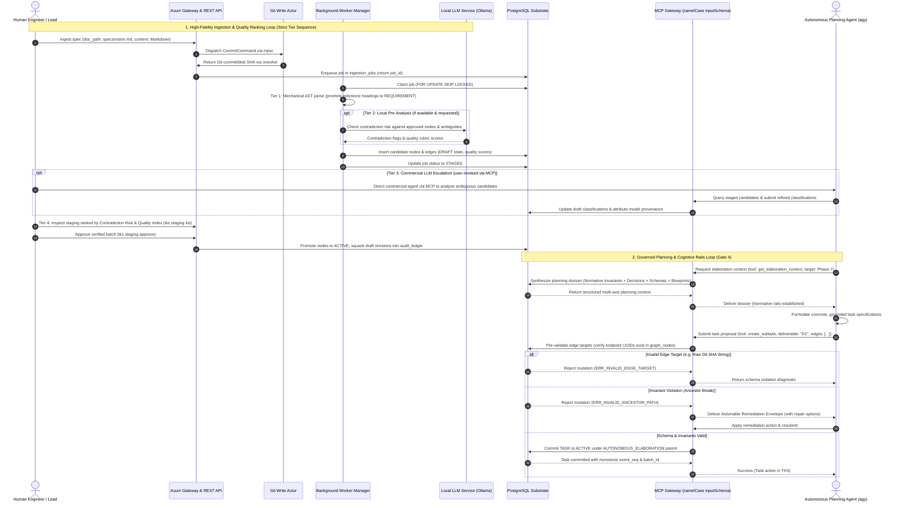

# Strategic Planning Backlog: Architecture, Roadmap, and Implementation Tactics

---

## 1. Executive Summary & Strategic Context

This document is the execution, tactical, and architectural companion to the [Technical Vision](docs/vision/vision.md). While the vision document defines the enduring North Star, foundational principles, environmental boundaries, and falsification criteria, this backlog details the phased execution roadmap, technical evaluation spikes, operational metrics, and concrete implementation workflows.

### Foundational Principles & Resource Model

This backlog is organized around the **"Start Small"**, **"Constrained Resource Model"**, **"Token Minimization & Mechanical Reliance"**, and **"Self-Referential Dogfooding"** directives:

- Minimize premature architectural complexity during early phases.
- Build the simplest viable mechanisms that satisfy the core vision invariants.
- Scope early progression to be fully achievable by a small team or solo developer using commodity infrastructure, ensuring each phase delivers standalone value.
- Reach self-hosting as early as possible so the system defines, tracks, and governs its own ongoing development.
- Maximize mechanical processes (e.g. streaming CommonMark AST parsing via `pulldown-cmark`) to handle the initial 80%+ of document decomposition, maintaining an active heading stack to mechanically generate upward structural hierarchy edges (`child_id -DERIVED_FROM-> parent_id`) and deterministic, disambiguated heading anchors (`ast_anchor`), minimizing costly LLM output token generation.
- Enforce strict lifecycle distinction between editable drafts and locked approved requirements, storing candidates directly in the graph topology as `DRAFT` entities with first-class `created_by VARCHAR(64) NOT NULL` author attribution, permitting conditional typing (`'UNCLASSIFIED'`) exclusively during drafting, and utilizing ephemeral draft revision logging directly inside `graph_nodes.attributes->'draft_revisions'` with atomic draft compaction upon approval to eliminate audit ledger bloat.
- Consolidate document provenance by embedding source span coordinates directly on `graph_nodes` (`doc_path`, `doc_hash`, `byte_start`, `byte_end`), eliminating standalone table join overhead and duplicate cardinality issues, while automating ingestion job supersession sweeps on document re-ingestion to guarantee zero orphaned draft residue.
- Eliminate loose Git reference hacks in favor of standard Git branch commits (`refs/heads/specs`) with mandatory document paths/slugs (`doc_path`), ensuring natural 100% reachability, out-of-the-box `git log`/`git diff`, and deterministic span re-anchoring across revisions without garbage collection overrides.
- Establish a clean read/write concurrency split for Git operations: isolate blocking libgit2 C write calls from the async reactor via a dedicated background Git write actor task communicating over bounded `mpsc` and `oneshot` channels with internal panic recovery (`std::panic::catch_unwind`), while routing read-only ODB blob lookups (`get_document_span`, worker decomposition) through concurrent `tokio::task::spawn_blocking` routines, eliminating head-of-line blocking on immutable reads.
- Enforce a strict lock acquisition hierarchy for mutations: any transaction performing structural edge mutations, DAG cycle checks, batch staging approvals, or rollbacks must acquire the global transaction advisory lock `pg_advisory_xact_lock(hashtext('tks_structural_mutation'))` *before* acquiring any row-level locks on `graph_nodes` or `graph_edges`. Pure leaf attribute edits and task status changes execute concurrently using native PostgreSQL row-level locks (`SELECT ... FOR UPDATE`).
- Guarantee sub-5ms offline search for `query_requirements` via native PostgreSQL full-text search (`tsvector` / partial GIN index on active nodes) with query sanitization preventing hyphen-negation syntax corruption.
- Align dogfooding with the phased progression model: Phase 1 established read-only self-hosting for context querying, while Phase 2 established autonomous self-evolution.

### Strategic Pivot: Phase Deferral & The Cognitive Planning Rails Imperative

Following the completion of Phase 3, an empirical dogfooding experiment was conducted (`scripts/phase4-experiment.sh`; detailed in `docs/vision/phase4-experiment-review.md`) to evaluate whether an autonomous coding agent (`agy`) could use TKS as its **sole source of truth** to elaborate execution tasks for Closed-Loop Lifecycle Verification without reading `docs/vision/`.

The experiment revealed that while the underlying PostgreSQL storage, Git ODB actor, and mutation endpoints functioned as designed, **TKS failed to serve the agent as an effective planning guide**:

1. **Protocol Handshake Breakdown:** The MCP stdio server serialized tool parameters using snake_case `input_schema` instead of the MCP specification's camelCase `inputSchema`, causing the agent's permission harness to reject MCP calls and forcing fallback to raw CLI/SQL.
2. **Context Retrieval Desert:** `get_context_envelope` was designed for leaf-task execution (narrow immediate graph locality). For strategic planning and phase elaboration, it delivered only a 3-bullet summary stripped of governing architectural invariants (`INV-*`), historical design decisions (`D-*`), physical database schemas, and codebase blueprints.
3. **Graph Taxonomy Deficit & Invariant Roadblock:** The CommonMark AST decomposition worker classified section headings universally as `SPECIFICATION`, leaving zero `REQUIREMENT` nodes in the database. When the agent attempted task elaboration under Phase 4, Invariant INV-1 validation failed with `ERR_INVALID_ANCESTOR_PATH`, delivering zero diagnostic or remediation guidance and prompting the agent to hack the database directly via SQL.
4. **Unconstrained Mutation Interface:** The mutation API accepted tasks that violated physical relational schemas (attempting to connect `IMPLEMENTED_BY` edges directly to raw Git SHA strings rather than node UUIDs) and hallucinated ungrounded components (outbound webhook daemons) because edge targets were not pre-validated.

**Strategic Realization:** Commodity LLMs will inevitably drift, hallucinate, and fall back to generic internet training data unless they are placed on **strict cognitive rails**—fed bounded, precise, schema-compliant, and topologically relevant context.

**Strategic Action:** The original Phase 4 (Closed-Loop Lifecycle Verification & Source Code Mapping) is strategically deferred to **Phase 7 (Phase N)**. Intermediate phases (Phases 4 through 6) are introduced to systematically resolve ingestion quality, modular governance linking, background relationship maintenance, and multi-axis cognitive planning rails. The overarching milestone is to successfully dogfood the planning and elaboration of Phase 7 directly within TKS.

---

## 2. Phased Execution Roadmap

```mermaid
%%{init: {
  'theme': 'base',
  'themeVariables': {
    'darkMode': true,
    'background': '#161922',
    'mainBkg': '#1e2230',
    'nodeBorder': '#434c5e',
    'textColor': '#e2e8f0',
    'fontFamily': 'ui-sans-serif, system-ui, -apple-system, BlinkMacSystemFont, "Segoe UI", Roboto, "Helvetica Neue", Arial, sans-serif',
    'fontSize': '14px',
    'lineColor': '#8892b0',
    'primaryColor': '#422026',
    'primaryTextColor': '#fde8ec',
    'primaryBorderColor': '#e06c75',
    'secondaryColor': '#1b3528',
    'secondaryTextColor': '#e6f7ee',
    'secondaryBorderColor': '#73c991',
    'tertiaryColor': '#1d2c44',
    'tertiaryTextColor': '#e4f0fc',
    'tertiaryBorderColor': '#61afef',
    'clusterBkg': '#13161f',
    'clusterBorder': '#373e51',
    'noteBkgColor': '#2e271a',
    'noteTextColor': '#fdf4db',
    'noteBorderColor': '#e5c07b',
    'edgeLabelBackground': '#1a1d27'
  }
}}%%
flowchart LR
    classDef primary fill:#422026,stroke:#e06c75,stroke-width:1.5px,color:#fde8ec;
    classDef secondary fill:#1b3528,stroke:#73c991,stroke-width:1.5px,color:#e6f7ee;
    classDef tertiary fill:#1d2c44,stroke:#61afef,stroke-width:1.5px,color:#e4f0fc;
    classDef completed fill:#1c2d27,stroke:#529b71,stroke-width:1.5px,color:#c2ebd4;

    P0["Phase 0: Pre-Construction Spikes<br/><i>[COMPLETED]</i>"]:::completed
    P1["Phase 1: Substrate Core & Read Context<br/><i>[COMPLETED]</i>"]:::completed
    P2["Phase 2: Bounded Agent Mutation<br/><i>[COMPLETED]</i>"]:::completed
    P3["Phase 3: Impact Analysis & Observability<br/><i>[COMPLETED]</i>"]:::completed

    P4["Phase 4: High-Fidelity Ingestion & Quality Ranking<br/><i>(Multi-Tier LLM + Rubric Scoring + Heading Promotion)</i>"]:::secondary
    P5["Phase 5: Modular Governance & Relationship Maintenance<br/><i>(Policy Profiles + Continuous Local Worker + Pruning)</i>"]:::secondary
    P6["Phase 6: Cognitive Planning Rails & Autonomous Dogfooding<br/><i>(Elaboration Context + Remediation Envelopes + Gate 4)</i>"]:::secondary
    P7["Phase 7 (Deferred Old Phase 4): Closed-Loop Verification<br/><i>(Git Commits + CI Tests + Release Readiness)</i>"]:::tertiary

    P0 --> P1 --> P2 --> P3 --> P4 --> P5 --> P6 --> P7
```

### Completed Phases Summary (Phases 0–3)

The foundational substrate, storage architecture, mutation engines, and supervisory observability portals were implemented and validated across Phases 0 through 3:

| Phase | Core Milestone & Capabilities Delivered | Verification Status & Artifacts |
| :--- | :--- | :--- |
| **Phase 0: Hypothesis De-risking & Spikes** | Validated Hypothesis H-1 via Spike 0 (83.8% constraint violation reduction). Validated local embedded vector inference via Spike 8 (`fastembed-rs`, 15.9ms latency). Scaffolding for PostgreSQL + `pgvector` containerization. | **COMPLETED & VERIFIED:** `spike0-results.md`; `spike8-results.md`; `phase0-decisions.md` (DEC-0.1..0.12) |
| **Phase 1: Substrate Core & Read Context** | Bare Git document repository (`refs/heads/specs`) with dedicated background write actor. PostgreSQL schema (`graph_nodes`, `graph_edges`, `node_embeddings`, `audit_ledger`, `ingestion_jobs`). Two-stage CommonMark AST decomposition (`pulldown-cmark`) with embedded source spans. Axum REST gateway, stdio MCP server proxy, and embedded refinery migrations. | **COMPLETED & VERIFIED (Gate 1):** `phase1-plan.md`; `phase1-decisions.md` (D-1..D-50); Successful self-hosting of `vision.md` and backlogs |
| **Phase 2: Bounded Agent Mutation & Governance** | Mutation MCP tools (`propose_node_mutation`, `create_subtask`, `update_node_status`). Strict lock acquisition hierarchy (global advisory lock before row locks). Autonomous task elaboration under `AUTONOMOUS_ELABORATION` nodes. Draft lifecycle event compaction squashing intermediate edits upon approval. Unified administrative rollback (`revert_mutations`). | **COMPLETED & VERIFIED (Gate 2):** `phase2-plan.md`; `phase2-decisions.md` (D-51..D-82); Tests: `tests/dogfood_gate2.rs`, `tests/mutation_api.rs` |
| **Phase 3: Impact Analysis & Supervisory Portal** | Automated invalidation cascading marking downstream nodes as `NEEDS_REVERIFICATION`. Reverification endpoints (`POST /api/v1/nodes/{id}/reverify`) and MCP tools. Single-page Cytoscape Web Explorer (`/explorer`) with live SSE event streaming. Multi-agent branch workspace container isolation (DEC-3.5) with atomic promotion serialization. | **COMPLETED & VERIFIED (Gate 3):** `phase3-plan.md`; `phase3-decisions.md` (D-83..D-90); Tests: `tests/cascade_integration.rs`, `tests/branch_workspace.rs` |

---

### Phase 4: High-Fidelity Ingestion, Multi-Tier Analysis & Requirement Quality Ranking

- **Primary Objective:** Transform document ingestion from a passive syntactic text chunker into a high-fidelity semantic extraction and quality-scoring engine that guarantees valid ancestral taxonomy (`REQUIREMENT` roots) and surfaces a prioritized review queue for human supervisors.
- **Core Deliverables:**
  1. **Semantic Heading Classification & Taxonomy Normalization:**
     - Update CommonMark AST decomposition worker (`src/worker/decomp.rs`): top-level headings (`#` or `##`) representing strategic milestones, core epics, or foundational requirements (matching patterns such as `Phase \d+`, `Objective`, `Core Requirements`, `Capability \d+`) are classified directly as `REQUIREMENT` rather than defaulting to `SPECIFICATION`.
     - Ensures that upon staging approval, an intact ancestral hierarchy exists that naturally satisfies Invariant INV-1 out-of-the-box without requiring manual database intervention.
  2. **Multi-Tier Ingestion Analysis Pipeline (Strict Sequential Tiers):**
     - *Tier 1 (Deterministic Mechanical AST Extraction):* Mandatory baseline zero-token structural decomposition (`pulldown-cmark`) extracting headings, code blocks, lists, exact byte spans, and RFC 2119 keywords, handling the initial 80%+ parsing mechanically.
     - *Tier 2 (Local LLM Pre-Analysis & Contradiction Detection):* Executed **if available and requested** by configuration/flags (e.g. devcontainer Ollama `qwen3:8b` / `gemma4:e4b`), scanning candidate chunks for immediate semantic overlaps, ungrounded assertions, and contradiction candidates against existing approved nodes, logging model capability metadata in job attributes.
     - *Tier 3 (User-Invoked Commercial LLM Escalation):* If the user chooses to escalate, TKS returns the staged candidate batch with preliminary quality markers; the user then directs an external commercial/frontier LLM (e.g. Claude Code, Gemini via MCP) to inspect candidates, resolve subtle ambiguities, and propose high-precision classifications without echoing source text.
     - *Tier 4 (Human-in-the-Loop Supervisory Review Gate):* Final deliberative review and sign-off in CLI and Web Explorer.
     - *Tier Composition Invariant:* Any combination of these tiers is valid (e.g. Mechanical $\to$ Human; Mechanical $\to$ Local $\to$ Human; Mechanical $\to$ Local $\to$ Commercial $\to$ Human), but execution must **always proceed strictly in that sequence**.
  3. **Requirement Quality Ranking & Rubric Scoring Engine (Contradiction-First):**
     - Automated scoring of candidate requirements across five core dimensions, with **Contradiction Risk against existing approved nodes ranked first and weighted highest**:
       - *1. Contradiction Risk (Primary Dimension):* Evaluates semantic tension or direct conflict against active approved requirements in the property graph; any candidate flagged with potential contradiction is immediately elevated to the top of the review backlog.
       - *2. Ambiguity Score:* Penalizes vague, unbounded language ("scalable", "fast", "performant") lacking objective parameters.
       - *3. Testability & Verifiability:* Checks for concrete verification criteria, acceptance thresholds, or deterministic test conditions.
       - *4. Atomicity:* Flags compound chunks combining disparate architectural concerns that require subdivision.
       - *5. Traceability Completeness:* Evaluates upward lineage reachability to vision goals and governance policies.
     - Computes the **Quality Ranking Index** surfaced in `tks staging list`, ordering candidate requirements from highest risk/contradiction to lowest, ensuring human review focus is applied where systemic architectural contracts are most vulnerable.
  4. **Incremental Ingestion & Hierarchical Authority Validation:**
     - Enables incremental specification ingestion across multiple documents without dropping prior state.
     - Evaluates document authority: blocks lower-tier implementation specs from silently mutating or superseding upstream architectural or vision-level requirements without explicit supervisory authorization.

---

### Phase 5: Modular Governance Profiles & Continuous Relationship Maintenance

- **Primary Objective:** Model institutional governance, policies, and standard operating procedures as modular, reusable graph clusters, and maintain graph hygiene through continuous background auditing.
- **Core Deliverables:**
  1. **Modular Governance Profiles:**
     - Define and ingest governance materials (processes, procedures, policies, standards) as encapsulated modular graph units.
     - Introduce **Governance Profiles**: reusable packages linking specific policies (e.g., Markdown/Mermaid linting standards, repository hygiene, security compliance like EU CRA equivalents) to a project's root nodes.
     - Establish the **Quality Verification Loop**: linking project artifacts and commits directly to active governance profile rules and checklists.
  2. **Continuous Background Relationship Worker:**
     - Dedicated low-priority background worker running inside `tks serve` (leveraging local LLM via OpenAI-compatible endpoint).
     - Periodically sweeps active requirement linkages to identify indirect contradictions, outdated dependencies, and opportunities to strengthen or prune connections over time.
  3. **Prioritized Relationship Review Backlog:**
     - Stores suspicious, conflicting, or orphaned relationships in a ranked queue (`relationship_review_backlog`).
     - Surfaces high-priority graph anomalies in the Web Explorer and CLI for human engineering triage.
  4. **Policy Invalidation Cascades & Work Package Generation:**
     - When an organizational governance policy or top-level standard updates, the invalidation engine cascades downstream across linked projects.
     - Automatically generates structured work packages and flags affected requirements as `NEEDS_REVERIFICATION`.

---

### Phase 6: Cognitive Planning Rails & Autonomous Dogfooding Milestone

- **Primary Objective:** Equip TKS with active cognitive planning rails that supply external agents with the complete normative, architectural, and schema context needed to elaborate execution plans autonomously, culminating in the successful dogfooding of Phase 7 planning.
- **Core Deliverables:**
  1. **MCP Protocol Conformance & Hardening:**
     - Enforce strict adherence to the official Model Context Protocol (MCP 2024-11-05 spec) across `tks mcp-stdio` and HTTP endpoints.
     - Specifically serialize tool parameter schemas under camelCase **`inputSchema`** (fixing the snake_case bug that prevented `call_mcp_tool` integration in Antigravity).
  2. **Multi-Axis Planning Dossier (`get_elaboration_context`):**
     - Introduce a dedicated MCP tool and REST endpoint: `GET /api/v1/nodes/{id}/elaboration-context` (`get_elaboration_context`), distinct from leaf-level `get_context_envelope`.
     - Synthesizes a structured planning dossier across four informational axes:
       - *Normative Boundaries:* Binding architectural invariants (`INV-1` through `INV-9`) and governance policies.
       - *Architectural Precedents:* Relevant architectural decisions (`D-*`) matching deliverable tags.
       - *Physical Schema Contracts:* Explicit node type and edge type enums, foreign key rules, and directionality constraints.
       - *Implementation Blueprints:* Paths to canonical route handlers, storage CTEs, background workers, and test scaffolding in the repository.
  3. **Actionable Invariant Diagnostics & Self-Healing Remediation Envelopes:**
     - Replace opaque error strings (`ERR_INVALID_ANCESTOR_PATH`) with structured JSON remediation envelopes containing the exact terminal failure node and deterministic remediation options (e.g., ancestor promotion actions).
  4. **Contracted Task Elaboration Templates & Edge Pre-Validation:**
     - Require task mutations to specify mandatory parent deliverable keys and explicit verification criteria.
     - Enforce pre-validation on all proposed edge targets: both endpoints must exist as registered node UUIDs in `graph_nodes` *before* transaction execution, rejecting foreign-key violations (e.g., raw Git SHA strings).
  5. **Tactical Decision Capture & Permission Scoping:**
     - Automatically record agent-specified implementation parameters (ranges, CLI flags, types) into node attributes with full caller provenance.
     - Enforce permission scoping restricting upward propagation to preserve vision integrity.
  6. **Bounded Phased Planning Rails:**
     - Structure agent planning workflows interactively deliverable-by-deliverable rather than as a single-shot prompt dump.
- **Dogfooding Milestone (Gate 4 - Autonomous Planning of Phase 7):**
  - Execute `scripts/phase4-experiment.sh` (or updated equivalent runner): the autonomous agent, strictly forbidden from reading `docs/vision/`, connects to TKS via MCP, requests `get_elaboration_context`, and successfully elaborates grounded, schema-compliant execution tasks for Phase 7 (Closed-Loop Verification) in the live property graph.

---

### Phase 7 (Deferred Old Phase 4): Closed-Loop Lifecycle Verification & Source Code Mapping

- **Primary Objective:** Establish bidirectional synchronization between leaf tasks in the knowledge graph, source code repository commits, and automated test execution results, adhering to level-appropriate testing policies.
- **Core Deliverables:**
  1. **VCS Commit Linking:**
     - Webhook endpoints and CLI commands linking repository commits and pull requests directly to task nodes.
     - Store commit references via typed nodes (`CODE_COMMIT`) or structured entity attributes (`attributes->'vcs_commits'`) with relational edge mapping (`IMPLEMENTED_BY`), strictly preserving foreign key integrity.
  2. **Automated Test Verification & Level-Appropriate Testing Policies:**
     - CI pipeline integration mapping automated test suite execution results to verification nodes (`VERIFIED_BY` edges).
     - Level-appropriate testing enforcement: unit tests for tactical implementation decisions, integration tests for core architectural contracts, with coverage gates scaled by requirement criticality.
  3. **Spec-Driven Release Readiness Webhooks & Status API:**
     - Inspection endpoints (`GET /api/v1/release/readiness`) and status webhooks exporting graph verification status, traceability coverage, and unresolved invalidation paths to external CI/CD platforms.

---

### Phase N+: Advanced Strategic Horizons (Future Roadmap)

- **Reverse Document Projection:** Dynamic aggregation and synthesis of graph subgraphs into tailored, human-readable Markdown specifications (broad vision/architecture overviews or targeted vertical slices) via LLM orchestration.
- **External Artifact Validation & Knowledge Base Review:** Validating external documents (slide decks, RFCs, PRDs) against the authoritative knowledge graph, providing structured inconsistency and gap feedback.
- **The Self-Reimplementation Benchmark:** Rebuilding TKS using an earlier stable version of TKS paired with a smaller, cheaper local model (e.g., Qwen 8B), proving that cognitive rails reduce the degrees of freedom required for complex software engineering.

---

## 3. Self-Referential Bootstrapping & Dogfooding Strategy

```mermaid
%%{init: {
  'theme': 'base',
  'themeVariables': {
    'darkMode': true,
    'background': '#161922',
    'mainBkg': '#1e2230',
    'nodeBorder': '#434c5e',
    'textColor': '#e2e8f0',
    'fontFamily': 'ui-sans-serif, system-ui, -apple-system, BlinkMacSystemFont, "Segoe UI", Roboto, "Helvetica Neue", Arial, sans-serif',
    'fontSize': '14px',
    'lineColor': '#8892b0',
    'primaryColor': '#422026',
    'primaryTextColor': '#fde8ec',
    'primaryBorderColor': '#e06c75',
    'secondaryColor': '#1b3528',
    'secondaryTextColor': '#e6f7ee',
    'secondaryBorderColor': '#73c991',
    'tertiaryColor': '#1d2c44',
    'tertiaryTextColor': '#e4f0fc',
    'tertiaryBorderColor': '#61afef',
    'clusterBkg': '#13161f',
    'clusterBorder': '#373e51',
    'noteBkgColor': '#2e271a',
    'noteTextColor': '#fdf4db',
    'noteBorderColor': '#e5c07b',
    'edgeLabelBackground': '#1a1d27'
  }
}}%%
flowchart TD
    classDef primary fill:#422026,stroke:#e06c75,stroke-width:1.5px,color:#fde8ec;
    classDef secondary fill:#1b3528,stroke:#73c991,stroke-width:1.5px,color:#e6f7ee;
    classDef tertiary fill:#1d2c44,stroke:#61afef,stroke-width:1.5px,color:#e4f0fc;
    classDef completed fill:#1c2d27,stroke:#529b71,stroke-width:1.5px,color:#c2ebd4;

    subgraph Complete["Completed Bootstrapping Foundations"]
        G1["Gate 1 (Phase 1): Read-Only Self-Hosting<br/><i>(Self-ingested vision.md & backlogs)</i>"]:::completed
        G2["Gate 2 (Phase 2): Autonomous Self-Evolution<br/><i>(Agent subtask elaboration via MCP)</i>"]:::completed
        G3["Gate 3 (Phase 3): Impact Cascading & Workspaces<br/><i>(Branch isolation & reverification)</i>"]:::completed
    end

    subgraph Expansion["Reliability & Cognitive Rails Pipeline"]
        B4["Phase 4: Ingestion Quality & Taxonomy Normalization<br/><i>(Top-level headings to REQUIREMENT + Quality Rubrics)</i>"]:::secondary
        B5["Phase 5: Governance Profiles & Relationship Hygiene<br/><i>(Policy packs + Background auditing)</i>"]:::secondary
        B6["Phase 6: Multi-Axis Planning Rails (get_elaboration_context)<br/><i>(Normative boundaries + Decisions + Schemas)</i>"]:::secondary
    end

    subgraph DogfoodTarget["Gate 4: The Phase 7 Dogfooding Benchmark"]
        G4["Dogfooding Gate 4:<br/><i>Autonomous Agent Plans Phase 7 via TKS MCP Only (Zero docs/vision/ Access)</i>"]:::primary
        P7Exec["Phase 7 Implementation:<br/><i>Closed-Loop Traceability Executed from TKS Tasks</i>"]:::tertiary
    end

    Complete --> Expansion --> DogfoodTarget
```

### Bootstrap Phasing Plan

1. **Phases 0–3 Baseline (Completed):**
   - Built storage, Git coupling, two-stage mechanical AST decomposition, read/write MCP gateways, audit logging, per-node governance, supervisory web explorer, and branch workspace isolation.
   - Passed Gate 1 (self-hosting documentation query), Gate 2 (autonomous mutation elaboration), and Gate 3 (multi-agent branch isolation and invalidation cascading).
2. **Phases 4–5 Pipeline (Reliability, Quality & Governance):**
   - Fixes the root causes of the Phase 4 experiment failure: promotes milestone headings to active `REQUIREMENT` nodes, establishes multi-tier ingestion with rubric-based quality ranking, encapsulates governance profiles, and runs continuous background relationship maintenance.
3. **Phase 6 Transition (Dogfooding Gate 4 - Autonomous Planning Rails):**
   - Deploys `get_elaboration_context`, camelCase `inputSchema` MCP compliance, actionable remediation envelopes, and edge pre-validation.
   - **Verification Experiment:** Launch `scripts/phase4-experiment.sh`. An autonomous agent running via `agy` connects to TKS with `docs/vision/` forbidden, requests elaboration context, and generates grounded, schema-compliant Phase 7 tasks directly into the graph.
4. **Phase 7+ (Closed-Loop Evolution):**
   - Implementation agents execute the tasks elaborated during Gate 4, connecting Git commits and automated tests back to requirements.

---

## 4. Minimum Viable Demonstration (MVD) Acceptance Test Scripts

### Historical Demonstrations Summary (Milestones 1–3 - Completed)

- **Milestone 1 (Ingest, Version, and Retrieve - Phase 1):** Verified Git bare repository commit on `refs/heads/specs`, mechanical CommonMark AST decomposition into draft nodes with byte spans, staging CLI approval, and sub-5ms full-text and context queries.
- **Milestone 2 (Bounded Mutation & Clean Rollback - Phase 2):** Verified autonomous task creation under `AUTONOMOUS_ELABORATION` nodes, transactional ancestor CTE validation, draft compaction upon approval, DAG cycle rejection, and unified `revert_mutations` rollback.
- **Milestone 3 (Impact Cascading & Reverification - Phase 3):** Verified automated invalidation cascading marking downstream nodes as `NEEDS_REVERIFICATION`, context inspection of invalidated nodes, reverification via `reverify_node`, and Cytoscape explorer visualization.

---

### Phase 4 MVD: High-Fidelity Ingestion & Quality Rubric Ranking

- **Preconditions:** PostgreSQL instance active; Git repository initialized; dev identity authenticated; optional devcontainer Ollama service available.
- **Test Procedure:**
  1. Submit a multi-section technical vision document (`POST /api/v1/documents/ingest` with `doc_path = "specs/vision.md"`) containing top-level milestone headings (`# Phase 1`, `## Core Requirements`).
  2. Verify Tier 1: CommonMark AST parser mechanically classifies milestone headings as `REQUIREMENT` nodes (with canonical `node_key` tags) and sub-sections as `SPECIFICATION` nodes, constructing valid `DERIVED_FROM` edges at zero token cost.
  3. Verify Tier 2: When requested, local LLM performs automated pre-analysis and scores candidate requirements against the Quality Rubric, evaluating **Contradiction Risk against existing approved nodes first**, followed by Ambiguity, Testability, and Atomicity.
  4. Verify Tier 3 (Escalation): Ingest a deliberately ambiguous chunk; user escalates to external commercial LLM via MCP to resolve classification, verifying TKS records model provenance attributes.
  5. Invoke `tks staging list <job_id>`; verify candidate nodes are ranked by the Quality Index with contradiction risks elevated to the top of the queue.
  6. Approve the staging batch via `tks staging approve <job_id>`; verify nodes are promoted to `ACTIVE`, with root `REQUIREMENT` nodes established in the live graph.

---

### Phase 5 MVD: Modular Governance Profiles & Relationship Maintenance

- **Preconditions:** Active property graph with Phase 4 requirements approved.
- **Test Procedure:**
  1. Ingest a modular governance document (`specs/policies/documentation.md`) defining Markdown and Mermaid standards.
  2. Link the governance profile to a project root requirement node via a `GOVERNED_BY_PROCEDURE` edge.
  3. Update a core policy rule in the governance profile; verify that the invalidation cascade flags downstream project requirements as `NEEDS_REVERIFICATION` and generates an updated work package.
  4. Trigger background relationship maintenance worker; verify indirect contradictions or ungrounded edges are detected and enqueued in `relationship_review_backlog`.

---

### Phase 6 MVD: Cognitive Planning Rails & Autonomous Dogfooding Benchmark (Gate 4)

- **Preconditions:** Phases 4 and 5 active; governance policy on target parent set to `AUTONOMOUS_ELABORATION`.
- **Test Procedure:**
  1. Connect `agy` or an external MCP client to `tks mcp-stdio`. Verify `tools/list` returns valid JSON with camelCase `inputSchema` (zero permission errors in client).
  2. The agent invokes `get_elaboration_context` for the target Phase 7 parent node:
     - Verify response delivers: verbatim deliverable specifications, binding invariants (`INV-1`..`INV-9`), applicable decisions (`D-11`, `D-14`, `D-43`), physical schema enums, and concrete repository blueprint paths.
  3. The agent attempts to create a task with an invalid edge target (e.g. an external Git SHA string):
     - Verify mutation engine rejects the payload prior to transaction commit, returning an actionable error indicating target ID is not a registered node UUID.
  4. The agent attempts an elaboration violating Invariant INV-1:
     - Verify gateway returns an **Actionable Remediation Envelope** specifying the terminal node and providing a structured option to promote the immediate ancestor.
  5. The agent executes bounded phased elaboration, generating atomic tasks for Deliverables 1, 2, and 3:
     - Verify all created tasks are active in `graph_nodes`, correctly linked to parent requirements, and visible in Web Explorer.

---

### Phase 7 MVD (Deferred Old Phase 4 MVD): Closed-Loop Lifecycle Verification

- **Preconditions:** Phase 7 tasks elaborated in live graph from Phase 6 MVD.
- **Test Procedure:**
  1. Agent claims an active task, implements the feature in Rust, and pushes a Git commit.
  2. Webhook endpoint (`POST /api/v1/vcs/commits`) maps the commit SHA to the task node via an `IMPLEMENTED_BY` edge (using a typed `CODE_COMMIT` node or structured attribute).
  3. CI pipeline submits automated test execution results to `POST /api/v1/verification/test-run`.
  4. Verify test results are mapped to verification nodes via `VERIFIED_BY` edges.
  5. Query `GET /api/v1/release/readiness`; verify release readiness reports 100% requirement satisfaction.

---

## 5. Architectural Evaluation Spikes & Technical Investigations

*(Spikes 0 through 8 represent completed pre-construction investigations grounding system decisions D-1 through D-82; see `architecture.md` §9 and `phase0-decisions.md` for full results).*

- **Spike 0 (Completed):** Graph-bounded context envelopes vs. multi-tool agentic retrieval (Hypothesis H-1). Confirmed 83.8% constraint violation reduction. Greenlight for construction.
- **Spike 1 (Completed):** Recursive CTEs on PostgreSQL relational adjacency tables vs. external graph DBMS. Satisfied SLA-1 (<50ms for $k \le 3$) with zero multi-database synchronization drift.
- **Spike 2 (Completed):** Append-only audit ledger with draft lifecycle event compaction upon approval. Eliminates ledger bloat while ensuring point-in-time reversibility.
- **Spike 3 (Completed):** Dedicated background Git write actor over mpsc/oneshot channels paired with concurrent read-only ODB lookups (`git2::Odb::read`).
- **Spike 4 (Completed):** Streaming CommonMark AST parsing (`pulldown-cmark`) extracting 80%+ of structural blocks and exact character spans at zero token cost.
- **Spike 5 (Completed):** MCP tool schemas (`get_context_envelope`, `propose_node_mutation`, `query_requirements`, `get_document_span`, `revert_mutations`) with depth and quota guardrails.
- **Spike 6 (Completed):** Two-tier identity model (API keys/HMAC) with Tower middleware and in-process cache, enforcing global advisory locks for structural mutations.
- **Spike 7 (Completed):** Strongly typed `lifecycle_state`, partial unique indexes, and atomic staging draft purging.
- **Spike 8 (Completed):** Local embedded vector inference (`fastembed-rs`, `all-MiniLM-L6-v2`). Achieved 15.9ms latency and 70% retrieval parity with commercial embeddings on commodity CPU.

---

## 6. Quantitative Operational Targets & Metric Calibrations

| Metric Identifier | Metric Name | Strategic Calibration Target | Validation Horizon |
| :--- | :--- | :--- | :--- |
| **SLA-1** | Micro-Reflex Graph Traversal Latency | $< 50\text{ ms}$ for $k \le 3$ hop topological queries | Phase 1 Benchmark (Validated) |
| **SLA-2** | Context Envelope Assembly Latency | $< 100\text{ ms}$ at $10^5$ nodes in PostgreSQL | Phase 2 Benchmark (Validated) |
| **CAL-H1** | Contract Violation Reduction (Hypothesis H-1) | $\ge 40$% fewer architectural violations vs. competent agentic baseline (Spike 0 achieved 83.8%) | Phase 2 Controlled Trial |
| **CAL-H2** | Human Review Overhead Reduction (Hypothesis H-2) | $\ge 50$% reduction in supervisory review time per feature | Phase 3 User Study |
| **CAL-H3** | Single-Engine Scalability Bound (Hypothesis H-3) | Sustained $< 100\text{ ms}$ query latency at $10^6$ nodes | Phase 3 Stress Test |
| **CAL-H4** | Extraction Fidelity Benchmark (Hypothesis H-4) | $\ge 95$% precision/recall on atomic requirement spans | Phase 1 Ingestion Eval |
| **CAL-TTFV** | Time-to-First-Value Latency (Observable 7) | $\le 30\text{ minutes}$ from raw markdown specification upload to first active agent context retrieval | Phase 1 Benchmark |
| **CAL-Q1** | Ingestion Quality Rubric Accuracy | $\ge 90$% precision in automated detection of contradiction risk (ranked first), ambiguity, and untestable assertions | Phase 4 Benchmark |
| **CAL-PLAN** | Autonomous Planning Schema Compliance | 100% of agent-elaborated tasks and edges pass relational pre-validation (zero FK or orphan errors) | Phase 6 Dogfooding (Gate 4) |
| **CAL-REM** | Remediation Envelope Recovery Rate | $\ge 80$% autonomous recovery by agents upon receiving structured remediation envelopes | Phase 6 Benchmark |
| **CAL-DOWN** | Model Downgrading Planning Parity | Smaller/local model (Qwen 8B) guided by `get_elaboration_context` matches unguided frontier model plan completeness | Phase 6 Evaluation |

---

## 7. Operational Workflow Specifications & Interaction Sequences

### Detailed Sequence Description

1. **High-Fidelity Ingestion & Heading Promotion:** The human engineer uploads technical markdown via REST. The Git write actor commits the document to `refs/heads/specs`. The background worker executes Tier 1 mechanical CommonMark parsing, promoting top-level milestone and epic headings directly to `REQUIREMENT` nodes and generating upward `DERIVED_FROM` hierarchy edges.
2. **Quality Scoring & Prioritized Staging (Strict Tier Progression):**
   - *Tier 1 (Mechanical):* Zero-token AST parsing extracts structural blocks and byte spans.
   - *Tier 2 (Local LLM Pre-Analysis):* If available and requested, a local model evaluates **Contradiction Risk against existing approved nodes first**, flagging potential semantic conflicts and computing preliminary ambiguity/testability scores.
   - *Tier 3 (User Escalation to Commercial LLM):* The user can optionally instruct an external commercial LLM via MCP to inspect the staged candidates and resolve complex semantic classifications.
   - *Tier 4 (Human Gate):* Staging candidates are surfaced in the CLI and Web Explorer ranked with contradiction risks at the very top of the review backlog. Promoted nodes commit to `graph_nodes` in `ACTIVE` state with active `REQUIREMENT` roots established.
3. **Multi-Axis Planning Dossier Retrieval:** When an autonomous agent is assigned to plan a development phase or epic, it calls `get_elaboration_context` via the MCP gateway. Rather than returning a bare summary, the gateway synthesizes a multi-axis planning dossier containing binding invariants (`INV-*`), historical architectural decisions (`D-*`), physical schema contracts, and canonical codebase blueprints.
4. **Governed Task Elaboration & Edge Pre-Validation:** The agent elaborates concrete subtasks deliverable-by-deliverable. The gateway pre-validates edge endpoints to ensure both source and target IDs exist as registered node UUIDs, rejecting foreign-key violations before database commits.
5. **Actionable Invariant Remediation:** If an invariant is violated, the gateway returns a structured JSON Remediation Envelope detailing the terminal failure node and deterministic repair options, enabling the agent to self-heal within governance rules rather than tampering with the database. Valid tasks commit directly to `ACTIVE` state with caller provenance recorded in `audit_ledger`.
