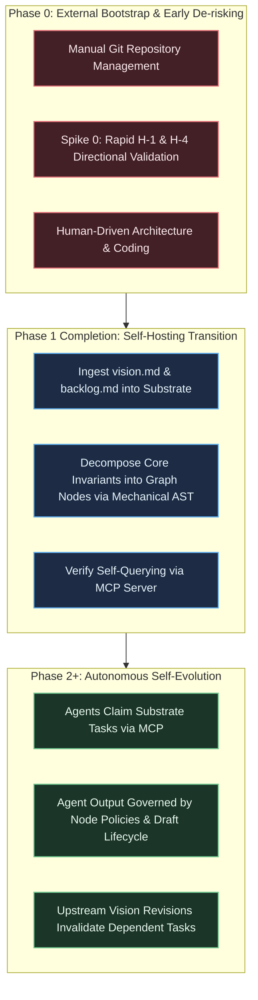
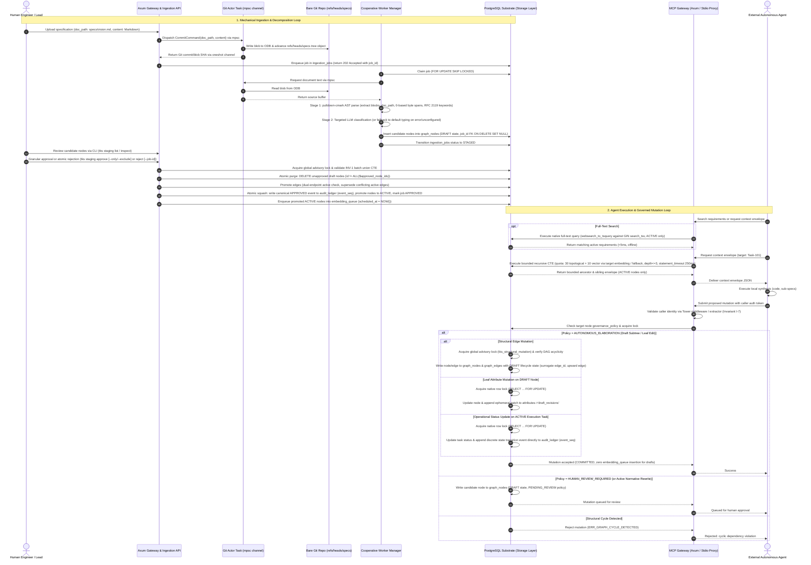

# Strategic Planning Backlog: Architecture, Roadmap, and Implementation Tactics

---

## 1. Executive Summary & Strategic Context

This document is the execution, tactical, and architectural companion to the [Technical Vision](file:///workspaces/tks/docs/vision/vision.md). While the vision document defines the enduring North Star, foundational principles, environmental boundaries, and falsification criteria, this backlog details the phased execution roadmap, technical evaluation spikes, operational metrics, and concrete implementation workflows.

This backlog is specifically organized around the **"Start Small"**, **"Constrained Resource Model"**, **"Token Minimization & Mechanical Reliance"**, and **"Self-Referential Dogfooding"** directives:

- Minimize premature architectural complexity during early phases.
- Build the simplest viable mechanisms that satisfy the core vision invariants.
- Scope Phase 0 and Phase 1 to be fully achievable by a small team or solo developer using commodity infrastructure, ensuring each phase delivers standalone value.
- Reach self-hosting as early as possible so the system defines, tracks, and governs its own ongoing development.
- Maximize mechanical processes (e.g. streaming CommonMark AST parsing via `pulldown-cmark`) to handle the initial 80%+ of document decomposition, minimizing costly LLM output token generation.
- Enforce strict lifecycle distinction between editable drafts and locked approved requirements, storing candidates directly in the graph topology as `DRAFT` entities and utilizing ephemeral draft revision logging directly inside `graph_nodes.attributes->'draft_revisions'` with atomic draft compaction upon approval to eliminate audit ledger bloat and avoid standalone table complexity.
- Eliminate loose Git reference hacks in favor of standard Git branch commits (`refs/heads/specs`) with mandatory document paths/slugs (`doc_path`), ensuring natural 100% reachability, out-of-the-box `git log`/`git diff`, and deterministic span re-anchoring across revisions without garbage collection overrides.
- Isolate blocking libgit2 C calls from the async reactor via a dedicated background Git actor task communicating over bounded `mpsc` and `oneshot` channels with internal panic recovery (`std::panic::catch_unwind`), guaranteeing linear serialization without mutex contention, thread-safety hazards, or channel disconnection.
- Strictly reject premature abstractions (distributed databases, distributed consensus, complex OAuth 2.1) during early phases in favor of single-engine PostgreSQL, pre-shared keys, and HMAC tokens.
- Maximize concurrency using native PostgreSQL row-level locking (`SELECT ... FOR UPDATE`) for active execution task updates and draft attribute edits while reserving global transaction advisory locks strictly for structural DAG edge mutations, staging approvals, and rollbacks.
- Decouple canonical requirement lifecycle from operational job retention (`ON DELETE SET NULL`), eliminate edge lifecycle constraint collisions with surrogate keys and active partial indexes, validate dual active endpoints and supersede existing active edges on promotion, and guarantee sub-5ms offline search for `query_requirements` via native PostgreSQL full-text search (`tsvector` / partial GIN index on active nodes).
- Support human-readable canonical identifiers (`REQ-*`, `INV-*`, `DR-*`, `Task-*`) via a dedicated `node_key VARCHAR(64)` column with a partial unique index on active entities, enabling polymorphic UUID/key resolution across all MCP and REST interfaces.
- Protect external embedding providers and external LLM tokens by enqueueing embedding generation strictly upon node transition to `ACTIVE` (or content mutation of active nodes), scheduling retries via `scheduled_at` exponential backoff to eliminate tight-loop hammering on HTTP 429 rate limits, and falling back to ancestor requirement embeddings for newly created tasks.
- Auto-apply embedded database migrations (`refinery::embed_migrations!`) on `tks serve` daemon startup prior to binding network listeners, and provide a standalone CLI flag (`tks serve --migrate-only`) for offline CI/CD pipelines, eliminating deployment deadlocks. Route runtime operational commands (`tks staging`, `tks identity`) through local Axum REST gateway endpoints to immediately invalidate the daemon's in-process `moka` LRU cache upon revocation and prevent multi-process connection pool exhaustion.
- Disambiguate operational mutation pathways: operational updates to active execution entities (e.g. `TASK` status) lock the row via `FOR UPDATE` and commit discrete reversible state events directly to `audit_ledger`; active normative requirements cannot be mutated in place and require candidate `DRAFT` proposals; draft edits append to `attributes->'draft_revisions'` and squash on approval.
- Consolidate governance evaluation into a unified storage repository layer and standardize background processing on cooperative `FOR UPDATE SKIP LOCKED` polling with backoff, eliminating bespoke `LISTEN/NOTIFY` triggers.
- Align dogfooding with the phased progression model: Phase 1 establishes read-only self-hosting for context querying, while Phase 2 enables autonomous self-evolution. Hold Phase 3 and Phase 4 execution as strictly contingent on empirical validation of foundational hypotheses (H-1, H-4) and successful Phase 1 dogfooding adoption.

### Architectural Governance Notation: Binding Strategic Invariants vs. Tactical Implementation Preferences

To maintain implementation agility and prevent this backlog from acting as an overly rigid architectural straightjacket, engineering decisions are categorized across two operational tiers:

1. **Binding Strategic Invariants:** Foundational commitments derived directly from the Technical Vision that require explicit stakeholder alignment and formal revision to change:
   - Single-engine PostgreSQL operational footprint (zero distributed database complexity or secondary DBMS synchronization in Phases 0–2).
   - Externalized cognitive compute (zero in-database LLM inference execution inside operational transactions).
   - Append-only audit ledger with draft lifecycle compaction upon approval (eliminating audit bloat while preserving lineage).
   - Strict bidirectional traceability (Invariant I-1) and non-repudiable agent identity attribution (Invariant I-7).
   - Phased self-referential bootstrapping (read-only self-hosting at Phase 1; autonomous self-evolution at Phase 2).
2. **Tactical Implementation Preferences:** Concrete design choices and operational parameters:
   - Specific column names and relational constraint identifiers.
   - Exact JSONB attribute paths (e.g. `attributes->'draft_revisions'`).
   - Advisory lock hash constants and Tokio channel buffer sizes.
   - Worker polling backoff intervals and cache TTL configurations.

These tactical details represent battle-tested directional guidance. Implementers and autonomous coding agents are fully empowered to refine, optimize, or adjust these tactical specifics during development without requiring formal backlog amendments, provided the underlying binding strategic invariants, environmental boundaries, and performance SLAs are upheld.

### Strategic Risk Context & Deferred Considerations

- **External Embedding Provider Dependency & Offline Operation:** While context envelopes allocate 30 nodes to deterministic topological retrieval and only 10 nodes to vector neighbors, vector generation currently assumes an external API provider. In fully air-gapped or offline environments, or during external API throttling, vector generation is disabled or degraded (falling back to ancestor requirement embeddings or pure topology per TB-6). To eliminate external gating and establish complete operational self-sufficiency, Phase 0 includes a technical investigation (Spike 8) evaluating local, CPU-efficient embedded model runtimes (e.g., ONNX runtime / `fastembed-rs`).
- **Phased Sequencing of Institutional Process & Procedural Modeling:** While the Technical Vision establishes procedural entities and compliance checklists as foundational to organizational memory (Key Capability #8), execution is strictly phased. In Phases 1–2, the property graph schema accommodates procedural concepts via flexible JSONB node attributes and foundational edge types (`GOVERNED_BY_PROCEDURE`), while ingestion, context retrieval, and MVD acceptance testing focus cleanly on the core **Requirement $\to$ Specification $\to$ Task** traceability loop. Dedicated procedural validation engines, mandatory checklist gates (licensing, CVEs), and cross-layer gap detection algorithms are deferred to Phase 3+, after the core requirement-to-task loop is empirically proven.
- **Enterprise Multi-Tenancy & Project Isolation (Deferred to Phase 3+):** Phases 0–2 intentionally operate under a single-tenant, single-project model to preserve developer velocity under the constrained resource model. To ensure future enterprise viability without disruptive schema migrations, Phase 1–2 database entities (`graph_nodes`, `ingestion_jobs`, `audit_ledger`, `agent_identities`) include an optional `project_id VARCHAR(64) DEFAULT 'default'` discriminator column, enabling forward-compatibility for row-level security (RLS) and multi-tenancy in Phase 3+.

---

## 2. Phased Execution Roadmap

```mermaid
%%{init: {
  'theme': 'base',
  'themeVariables': {
    'darkMode': true,
    'background': '#161922',
    'mainBkg': '#1e2230',
    'nodeBorder': '#434c5e',
    'textColor': '#e2e8f0',
    'fontFamily': 'ui-sans-serif, system-ui, -apple-system, BlinkMacSystemFont, "Segoe UI", Roboto, "Helvetica Neue", Arial, sans-serif',
    'fontSize': '14px',
    'lineColor': '#8892b0',
    'primaryColor': '#422026',
    'primaryTextColor': '#fde8ec',
    'primaryBorderColor': '#e06c75',
    'secondaryColor': '#1b3528',
    'secondaryTextColor': '#e6f7ee',
    'secondaryBorderColor': '#73c991',
    'tertiaryColor': '#1d2c44',
    'tertiaryTextColor': '#e4f0fc',
    'tertiaryBorderColor': '#61afef',
    'clusterBkg': '#13161f',
    'clusterBorder': '#373e51',
    'noteBkgColor': '#2e271a',
    'noteTextColor': '#fdf4db',
    'noteBorderColor': '#e5c07b',
    'edgeLabelBackground': '#1a1d27'
  }
}}%%
flowchart LR
    classDef primary fill:#422026,stroke:#e06c75,stroke-width:1.5px,color:#fde8ec;
    classDef secondary fill:#1b3528,stroke:#73c991,stroke-width:1.5px,color:#e6f7ee;
    classDef tertiary fill:#1d2c44,stroke:#61afef,stroke-width:1.5px,color:#e4f0fc;

    P0["Phase 0: Pre-Construction Spikes<br/><i>(Lightweight H-1 & H-4 De-risking)</i>"]:::secondary
    P1["Phase 1: Substrate Core & Read Context<br/><i>(Git Store + PG Graph + Read MCP)</i>"]:::secondary
    G1["Dogfooding Gate 1:<br/><i>Self-Ingest Vision & Backlog</i>"]:::primary
    P2["Phase 2: Bounded Mutation & Governance<br/><i>(Write MCP + Audit Log + Node Policies)</i>"]:::secondary
    G2["Dogfooding Gate 2:<br/><i>Manage Phase 3 Tasks via Substrate</i>"]:::primary
    P3["Phase 3: Impact Analysis & Observability<br/><i>(Web Portal + Invalidation Cascading)</i>"]:::secondary
    P4["Phase 4: Closed-Loop Traceability<br/><i>(Git Commits + Automated Verification)</i>"]:::secondary

    P0 --> P1 --> G1 --> P2 --> G2 --> P3 --> P4
```



### Phase 0: Pre-Construction Hypothesis De-risking & Prototype Spikes

- **Primary Objective:** Empirically validate the foundational scientific premise (Hypothesis H-1) and baseline assisted extraction feasibility (Hypothesis H-4) using lightweight, throwaway prototypes before committing to Phase 1 infrastructure construction.
- **Core Deliverables:**
  1. **Spike 0 (H-1 Directional Validation Spike):** Rapid throwaway test comparing graph-bounded context retrieval against a competent multi-tool agentic retrieval baseline (file reading, grep, AST symbol search, and semantic search without graph-structured requirement context) on an in-memory graph of hand-curated requirement nodes (~50–100 nodes), measuring constraint violation reduction during agentic code synthesis.
  2. **Early Extraction & AST Pre-Parsing Spike (H-4 Pre-Validation):** Empirical benchmarking of mechanical CommonMark parsing (`pulldown-cmark`) paired with targeted commodity LLM classification prompts against representative technical Markdown specs to verify 0-based byte offset extraction accuracy and token reduction.
  3. **Foundational Architecture Scaffolding:** Initial repository setup, developer tooling, Docker compose definition for PostgreSQL with `pgvector`, and baseline migration harness.
  4. **Local & Embedded Vector Generation Spike (Spike 8):** Evaluation of embedded local model runtimes (e.g., `fastembed-rs` or ONNX runtime) on commodity CPU hardware as an alternative to external embedding APIs, benchmarking latency (<50ms/node), binary footprint, and offline zero-dependency viability.

### Phase 1: Substrate Core, Git Document Ingestion & Context Gateway

- **Primary Objective:** Deliver a functioning read-only pipeline that ingests Markdown specifications into a Git-backed document repository, decomposes them into structured requirement nodes in PostgreSQL, and serves bounded context envelopes to external agents via the Model Context Protocol (MCP).
- **Core Deliverables:**
  1. **Git-Backed Document Store & Dedicated Git Actor Task:** Bare Git repository integration (`git2` crate) for storing raw Markdown/text documents via direct ODB writes, creating commits directly onto a dedicated specifications branch (`refs/heads/specs`) with mandatory document paths (`doc_path`, e.g. `specs/<doc_path>`). Git operations are isolated in a dedicated background actor thread (`src/storage/git/actor.rs`) owning the `git2::Repository` handle and communicating over bounded `mpsc` and `oneshot` channels, eliminating Tokio reactor starvation, `.lock` collisions (`GIT_ELOCKED`), and non-fast-forward push rejections (addressing LD-1, LD-2, iteration 5; TB-1).
  2. **PostgreSQL Relational & Graph Schema:**
     - `graph_nodes`: Typed nodes with `node_key VARCHAR(64)` for canonical tags (`REQ-*`, `INV-*`, `DR-*`, `Task-*`) with partial unique index `idx_graph_nodes_node_key_active (node_key) WHERE lifecycle_state = 'ACTIVE' AND node_key IS NOT NULL` (addressing LD-5, iteration 6; TB-7); `lifecycle_state` (`DRAFT`, `ACTIVE`, `SUPERSEDED`, `ARCHIVED`, `NEEDS_REVERIFICATION`); generated full-text search vector `search_tsv` (`tsvector`) with partial GIN index `WHERE lifecycle_state = 'ACTIVE'` (addressing LD-6, iteration 4; LD-7, iteration 6); non-cascading foreign key `job_id UUID REFERENCES ingestion_jobs(job_id) ON DELETE SET NULL` preventing canonical requirement loss on operational job cleanup (addressing LD-1); and `attributes JSONB` storing domain extensions and ephemeral draft revision history (`attributes->'draft_revisions'`).
     - `graph_edges`: Structural edges with surrogate primary key `edge_id UUID PRIMARY KEY DEFAULT gen_random_uuid()`, explicit `lifecycle_state` (`DRAFT`, `ACTIVE`, `SUPERSEDED`, `REVERTED`), and partial unique index `idx_graph_edges_active_unique (from_node_id, to_node_id, edge_type) WHERE lifecycle_state = 'ACTIVE'` preventing constraint collisions during edge re-linking and lifecycle transitions (addressing LD-1, LD-2). Standardized upward orientation for `CONSTRAINED_BY` edges (`Spec -CONSTRAINED_BY-> Requirement`) to allow uniform unidirectional recursive CTEs (addressing LD-10, iteration 5).
     - `source_spans`: Cryptographic document anchoring with concrete schema (`span_id UUID PRIMARY KEY`, `node_id UUID NOT NULL REFERENCES graph_nodes(id) ON DELETE CASCADE`, `doc_path VARCHAR(255) NOT NULL`, `doc_hash VARCHAR(64) NOT NULL`, `byte_start INT NOT NULL`, `byte_end INT NOT NULL`, and `idx_source_spans_node` index) enabling instant relational inspection joins, deterministic span re-anchoring on document revisions, and zero-copy UTF-8 safe byte slicing (addressing LD-1, iteration 5; LD-2, LD-5).
     - Ephemeral Draft Revision History: Consolidated directly into `graph_nodes.attributes->'draft_revisions'` as an array of compact JSON objects while an entity is in `DRAFT` state, eliminating the standalone `draft_revisions` table and secondary cleanup overhead (addressing LD-9, iteration 6).
     - `node_embeddings` & `embedding_queue`: Strongly typed vector table with foreign key `node_id UUID PRIMARY KEY REFERENCES graph_nodes(id) ON DELETE CASCADE` ensuring zero orphaned vectors on node purging, and automatic vector deletion when nodes transition to `SUPERSEDED` or `REVERTED` (addressing LD-6, iteration 6). `embedding_queue`: Deduplicated queue (`UNIQUE (node_id)`), content-hashed optimistic concurrency (`content_hash VARCHAR(64)`), and retry backoff scheduling column (`scheduled_at TIMESTAMPTZ NOT NULL DEFAULT NOW()`) claiming records via `WHERE status = 'PENDING' AND scheduled_at <= NOW() FOR UPDATE SKIP LOCKED` (addressing LD-7, iteration 5). Restricting queue insertion strictly to approved `ACTIVE` nodes to minimize token waste (addressing LD-3, iteration 5).
     - `ingestion_jobs`: Durable state machine tracking decomposition lifecycle: `QUEUED` → `PROCESSING` → `STAGED` (decomposition complete, candidates pending review) → `APPROVED` (candidates promoted to `ACTIVE`) or `REJECTED` (candidates discarded), with `doc_path VARCHAR(255) NOT NULL` and `FAILED` for errors (addressing LD-1, LD-7).
     - `audit_ledger`: Append-only table with total event ordering sequence (`event_seq BIGINT GENERATED ALWAYS AS IDENTITY PRIMARY KEY`), `event_id UUID`, `event_type`, `entity_id`, `entity_type`, `actor_id`, `actor_type`, `token_fingerprint`, `delta JSONB`, `snapshot JSONB`, and `draft_evolution_summary JSONB` (addressing LD-4, iteration 5).
  3. **Two-Stage Assisted Decomposition Pipeline & Cooperative Worker Manager:** Unified background worker manager (`src/worker/mod.rs`) running cooperatively inside `tks serve` orchestrating both decomposition and embedding queues using timer polling with `FOR UPDATE SKIP LOCKED` and backoff sleep, eliminating bespoke `LISTEN/NOTIFY` complexity (addressing LD-12, iteration 5). Ingestion REST API endpoint (`POST /api/v1/documents/ingest`) requiring `doc_path` and orchestrating `ingestion_jobs`:
     - *Stage 1 (Mechanical Parsing):* Streaming CommonMark AST decomposition (`pulldown-cmark`) segmenting text along heading boundaries, tables, and lists, extracting exact source 0-based byte offsets (`byte_start`, `byte_end`) with zero token cost, extracting RFC 2119 keywords, and capturing canonical tags into `node_key` (TB-2, TB-7).
     - *Stage 2 (Targeted Semantic Classification):* Selective LLM invocation on candidate chunks returning compact classification tuples without echoing source text.
     - *Graceful Degradation:* If external LLM API credentials are not configured or external provider returns errors/timeouts, Stage 1 mechanical extraction still commits candidate chunks to `graph_nodes` as `DRAFT` requirements with default typing (`node_type = 'REQUIREMENT'` for RFC 2119 matches, `'UNCLASSIFIED'` otherwise), logging a warning in `ingestion_jobs.error_message`, preserving full local and offline utility (addressing LD-8).
     - Candidate nodes and draft structural edges written directly to `graph_nodes` and `graph_edges` with `lifecycle_state = 'DRAFT'` and `job_id REFERENCES ingestion_jobs(job_id)`, completely eliminating the quarantine staging table and JSON blob serialization (addressing LD-3, LD-11, retiring TB-3).
  4. **Read-Only MCP Server, Identity Middleware, Embedded Migrations & Terminal Review CLI:** Unified Axum server hosting REST and MCP over HTTP/SSE, paired with a lightweight stdio streaming proxy (`tks mcp-stdio`). Database schema migrations are embedded directly via `refinery::embed_migrations!` and automatically executed by `tks serve` on boot before network listeners bind, with a standalone `tks serve --migrate-only` CLI entry point for CI/CD environments (eliminating circular HTTP migration dependencies; addressing LD-3, LD-10, iteration 6). Axum integrates Tower middleware and `FromRequestParts` extractor for identity validation (`src/gateway/auth.rs`) against `agent_identities` with in-process `moka` LRU cache. Identity management subcommands (`tks identity create`, `tks identity revoke`) operate via REST endpoints (`/api/v1/identities`, `/api/v1/identities/{id}/revoke`), immediately invalidating the daemon's local `moka` cache on revocation to preserve blast-radius containment (addressing LD-8, iteration 5; TB-5). Tool `get_context_envelope` implements polymorphic UUID/`node_key` lookup and strict quota allocation: 30 guaranteed deterministic topological nodes, up to 10 vector neighbors resolved using the target node's embedding (with ancestor requirement embedding fallback for newly elaborated tasks, or pure topology fallback if pending or disabled, TB-6, LD-11). Tool `query_requirements` operates via PostgreSQL native full-text search (`tsvector` / partial GIN) executing in <5ms without external API dependencies or token costs, meeting SLA-1 and working offline (addressing LD-6, LD-7). The terminal review CLI provides ergonomic staging workflows:
     - `tks staging list <job_id>`: Displays candidate requirements in formatted tabular/tree hierarchy.
     - `tks staging inspect <node_id>`: Displays candidate node text side-by-side with its exact source document byte span.
     - `tks staging approve <job_id> [--only <id,...> | --exclude <id,...>]`: Submits granular approval (`POST /api/v1/staging/approve`) and promotes verified nodes to `ACTIVE`. Any candidate draft nodes not included in the approval list are atomically purged from `graph_nodes` within the same transaction (`DELETE FROM graph_nodes WHERE job_id = $1 AND lifecycle_state = 'DRAFT' AND id != ALL($approved_node_ids)`), preventing orphaned draft leaks (addressing LD-5, iteration 5). Validates dual-endpoint active presence for candidate edges and supersedes conflicting active edges before promotion (addressing LD-6, iteration 5). On document re-ingestion at `doc_path`, replaces active nodes anchored to `doc_path` with `SUPERSEDED`, supersedes conflicting active edges, and marks child tasks `NEEDS_REVERIFICATION` (addressing LD-2, iteration 6). Transactional CTE validates Invariant INV-1 against the union of active requirement nodes and candidate requirement nodes included in the promotion batch (`id = ANY($approved_node_ids)`). Transaction acquires `pg_advisory_xact_lock(hashtext('tks_structural_mutation'))`.
     - `tks staging reject [--job-id <job_id> | <node_id>]`: Submits rejection (`POST /api/v1/staging/reject`) to purge candidate drafts cleanly at either individual node level or atomic job level (`DELETE FROM graph_nodes WHERE job_id = $1 AND lifecycle_state = 'DRAFT'`), marking the job `REJECTED` (addressing LD-7, LD-13).
- **Dogfooding Milestone (Gate 1 - Read-Only Self-Hosting):** Ingest the project's own `vision.md` and `strategic-planning-backlog.md` into the Phase 1 substrate, verifying that atomic requirements and constraints can be queried via MCP to implement Phase 2 tasks (aligning with vision.md Invariant I-6; addressing LD-1, iteration 6).

### Phase 2: Bounded Agent Mutation & Per-Node Governance

- **Primary Objective:** Enable external AI agents to submit candidate graph mutations (sub-tasks, refined specifications, test definitions) while enforcing per-node governance policies, non-negotiable identity attribution, and reversible, append-only auditability.
- **Core Deliverables:**
  1. **Mutation-Enabled MCP Tools:** MCP tools `propose_node_mutation`, `create_subtask`, and `update_node_status`, supporting polymorphic UUID and string `node_key` identifiers, caller authentication, and token verification.
  2. **Disambiguated Mutation Pathways & Draft Lifecycle Compaction:**
     - *Draft Entities:* Authoring agents build draft subtrees while keeping them isolated from production context envelopes. Intermediate edits append to `graph_nodes.attributes->'draft_revisions'`. Atomic draft event compaction squashes intermediate revisions into a single canonical `APPROVED` event in `audit_ledger` with `draft_evolution_summary` JSONB. Draft nodes never enqueue embeddings until promoted to `ACTIVE` (addressing LD-3, iteration 5; LD-9, iteration 6).
     - *Active Execution Nodes:* Authorized operational updates to active execution entities (e.g. updating an assigned `TASK` node's status to `COMPLETED`) lock the row via `SELECT ... FOR UPDATE`, apply the update, and write a discrete, reversible state transition event directly to `audit_ledger` with monotonic `event_seq`. They never touch draft revisions (addressing LD-4, iteration 6).
     - *Active Normative Nodes:* An external agent cannot rewrite the normative content or title of an `ACTIVE` requirement or specification in-place. Such alterations must be submitted as candidate `DRAFT` nodes referencing the parent/target node, requiring supervisory approval (addressing LD-4, iteration 6).
  3. **Append-Only Audit Ledger:** Change-log mechanism recording all approved entity and edge mutations as discrete, reversible delta events, capturing caller identity (`agent_instance_id`, `caller_type`, `auth_fingerprint`), snapshot payloads, and total ordering sequence `event_seq` (addressing LD-4, iteration 5).
  4. **Governance Policy Engine:** Consolidated into the Storage Repository layer (`src/storage/governance.rs`), evaluating `governance_policy` flags (`AUTONOMOUS_ELABORATION`, `HUMAN_REVIEW_REQUIRED`, `LOCKED`) directly within SQL transactions (addressing LD-11, iteration 5).
  5. **Rollback & Reversion Utility:** Administrative tooling (`revert_mutation_batch`, `revert_agent_session`) applying non-destructive compensating `REVERT` events with automated dependency sweeps to `NEEDS_REVERIFICATION`. Invariant INV-1 path constraints exempt `NEEDS_REVERIFICATION` and `DRAFT` nodes, preventing cascade transaction aborts.
  6. **Concurrency Defenses & Locking Strategy:** Structural edge mutations and DAG cycle checks serialized via a global PostgreSQL transaction advisory lock (`pg_advisory_xact_lock(hashtext('tks_structural_mutation'))`). Non-structural leaf attribute updates execute concurrently using native PostgreSQL row-level locks (`SELECT id FROM graph_nodes WHERE id = $1 FOR UPDATE`), eliminating 32-bit hash collision bottlenecks.
- **Dogfooding Milestone (Gate 2 - Autonomous Self-Evolution):** Use external coding agents (e.g., Claude Code, Cursor, custom runners) operating through MCP to author, review, and track Phase 3 preparation tasks, generate implementation sub-specs, and commit them directly to the substrate (aligning with vision.md Invariant I-6; addressing LD-1, iteration 6).

### Phase 3: Topological Impact Analysis & Human Supervisory Portal

- **Primary Objective:** Provide human engineering leads with high-level observability and automated impact analysis when upstream requirements change.
- **Core Deliverables:**
  1. **Minimal Read-Only Supervisory Web Explorer & Review Interface:** A lightweight, single-page read-only visualization tool and triage interface (or terminal-first TUI companion / MCP-connected supervisory copilot) focused strictly on topological inspection, invalidation blast-radius exploration, and staging review queues, consuming standard Axum REST and MCP endpoints and deferring heavy custom portal development in favor of core graph observability.
  2. **Automated Invalidation Cascading:** Graph traversal algorithms that detect modifications to upstream requirements, recursively mark downstream specifications and tasks as `NEEDS_REVERIFICATION`, and block dependent agent execution until resolved.
  3. **Impact Analysis Dashboard:** Visual diff tool showing the topological blast radius of a proposed requirement revision.

### Phase 4: Closed-Loop Lifecycle Verification & Source Code Mapping

- **Primary Objective:** Establish bidirectional synchronization between leaf tasks in the knowledge graph, source code repository commits, and automated test execution results.
- **Core Deliverables:**
  1. **VCS Commit Linking:** Webhooks connecting repository commits and pull requests directly to task nodes (`IMPLEMENTED_BY` edges).
  2. **Automated Test Verification:** CI pipeline integration mapping test suite execution results to verification nodes (`VERIFIED_BY` edges), enforcing automated proof of requirement satisfaction prior to release sign-off.
  3. **Spec-Driven Release Readiness Webhooks & Status API:** Lightweight inspection endpoints (`GET /api/v1/release/readiness`) and status webhooks that export graph verification status, traceability coverage, and unresolved invalidation paths to external CI/CD platforms (e.g., GitHub Actions, GitLab CI, ArgoCD, OPA/Gatekeeper). TKS functions strictly as the authoritative intent and verification data provider, delegating active gate enforcement and deployment blocking to existing, purpose-built delivery infrastructure.

---

## 3. Self-Referential Bootstrapping & Dogfooding Strategy

A foundational principle of the project is that the system must reach self-hosting capability, analogous to a self-hosting compiler. This addresses the classic bootstrapping tension ("start small" while aiming to manage complex lifecycles).



### Bootstrap Phasing Plan

1. **Phase 0 (Current Baseline & Hypothesis De-risking):**
   - The project is designed and bootstrapped using conventional development environments, standard Git workflows, and manually maintained documentation (`vision.md`, `strategic-planning-backlog.md`).
   - Early hypothesis de-risking: Execute Spike 0 (in-memory graph-bounded retrieval vs. competent agentic code retrieval on coding tasks) and early decomposition prompt tests (H-4) to establish directional confidence before committing to Phase 1 infrastructure.
   - Scope is intentionally constrained: build only the storage layer, Git connection, mechanical CommonMark AST parser, and read MCP server.
2. **Phase 1 Transition (Dogfooding Gate 1 - Read-Only Self-Hosting):**
   - Upon completing Phase 1, the development team executes the first real-world ingestion: uploading the project's own documentation files (`specs/vision.md`, `specs/strategic-planning-backlog.md`) into the Git document ledger.
   - The mechanical AST decomposition pipeline breaks the technical vision into atomic requirement nodes with canonical `node_key` tags and verified byte spans.
   - Verification test: developers and agents retrieve bounded context envelopes via MCP (`get_context_envelope`, `query_requirements`) to implement Phase 2 tasks.
3. **Phase 2+ (Dogfooding Gate 2 - Autonomous Self-Evolution):**
   - Upon completing Phase 2 mutation tooling and governance, all subsequent feature requirements, architectural adjustments, and development tasks must be authored, reviewed, and tracked directly within the substrate itself.
   - When an agent is tasked with writing code for the substrate, it must query its context envelope and submit candidate mutations via MCP.

---

## 4. Minimum Viable Demonstration (MVD) Acceptance Test Scripts

### Phase 1 MVD: Ingestion, Git Anchoring, Mechanical Decomposition, and Read Context

- **Preconditions:** PostgreSQL instance with schema applied automatically on `tks serve` startup (or via `tks serve --migrate-only`); bare Git repository configured with `refs/heads/specs` branch; development identity seeded.
- **Test Procedure:**
  1. Submit a multi-page Markdown specification (e.g., `vision.md`) with explicit path: `POST /api/v1/documents/ingest` with payload `{"doc_path": "specs/vision.md", "content": "# Technical Vision..."}`.
  2. Verify that the document is committed to the bare Git repository ODB via the dedicated Git actor task over mpsc channel, placing the blob at path `specs/vision.md` on branch `refs/heads/specs` without `.lock` collisions or Tokio worker starvation. Verify that standard `git log specs/vision.md` and `git diff` function.
  3. Verify that the background worker claims the job: CommonMark AST parsing (`pulldown-cmark`) mechanically extracts $\ge 10$ distinct requirement chunks with exact 0-based byte offsets (`byte_start`, `byte_end`), `node_key` tags, and `doc_path`, targeted semantic classification tags candidate nodes (or falls back to default typing with warning on missing LLM credentials), and job transitions to `STAGED`.
  4. Verify candidate nodes are written directly into `graph_nodes` with `lifecycle_state = 'DRAFT'` and `job_id REFERENCES ingestion_jobs(job_id) ON DELETE SET NULL`, inspectable via `tks staging list <job_id>` and `tks staging inspect <node_id>`. Verify that `embedding_queue` contains ZERO rows for these unapproved draft nodes.
  5. Human reviewer inspects candidate nodes in their document span context, rejects false positives via `tks staging reject [--job-id <job_id> | <node_id>]`, and approves verified candidate nodes via `tks staging approve <job_id> [--only <id,...> | --exclude <id,...>]` (executing `POST /api/v1/staging/approve`):
     - Verify atomic purging: unapproved candidate draft nodes linked to `job_id` are atomically deleted from `graph_nodes`.
     - Verify edge promotion: candidate draft edges promote to `ACTIVE` only if both endpoints are active; conflicting active edges transition to `SUPERSEDED`.
     - On document re-ingestion, verify existing active nodes anchored to `doc_path` transition to `SUPERSEDED` and active children transition to `NEEDS_REVERIFICATION`.
     - Verify batch ancestor union CTE check succeeds under `pg_advisory_xact_lock(hashtext('tks_structural_mutation'))`.
     - Verify `audit_ledger` receives canonical `APPROVED` event with monotonically increasing `event_seq`.
     - Verify `embedding_queue` receives jobs ONLY for the promoted `ACTIVE` nodes with `scheduled_at <= NOW()`.
     - Job status transitions to `APPROVED`.
  6. Connect an MCP client (e.g., Claude Code or test harness) and test both full-text search and context retrieval:
     - Invoke `query_requirements` with text search query (e.g. `{"query": "PostgreSQL single engine"}`); verify matching `ACTIVE` requirement nodes return in $<5\text{ ms}$ via native `tsvector`/partial GIN index without external API calls.
     - Invoke `get_context_envelope` using canonical `node_key`:

     ```json
     {
       "tool": "get_context_envelope",
       "arguments": {
         "target_node_id": "REQ-002",
         "depth": 2
       }
     }
     ```

  7. Verify that the response returns the target node, its ancestor requirements, immediate sibling constraints, and source text snippets within $< 50\text{ ms}$, respecting depth clamp ($\le 3$) and quota budget (guaranteed 30 topological nodes, up to 10 vector neighbors resolved via target node's embedding or parent requirement fallback, TB-6).

### Phase 2 MVD: Bounded Mutation, Governance Enforcement, and Clean Rollback

- **Preconditions:** Phase 1 graph loaded; node `REQ-005` set to `AUTONOMOUS_ELABORATION`; node `REQ-006` set to `HUMAN_REVIEW_REQUIRED`; authenticated agent session initialized with verified identity (`agent_instance_id: "agent-runner-42"`).
- **Test Procedure:**
  1. External agent calls `propose_node_mutation` targeting `REQ-005` to create three child sub-tasks in `DRAFT` state, passing bearer authorization credentials.
  2. Verify immediate database write in `graph_nodes` and `graph_edges` with `lifecycle_state = 'DRAFT'`, creation of valid directed draft edges (pointing upward), and that production queries for `ACTIVE` nodes exclude the drafts. Verify zero rows inserted into `embedding_queue`.
  3. External agent attempts to introduce an invalid circular constraint edge targeting `REQ-005`; verify that global advisory lock (`tks_structural_mutation`) and database-level DAG cycle constraints reject the mutation with error code `ERR_GRAPH_CYCLE_DETECTED`.
  4. External agent updates a leaf attribute on an existing draft task: verify concurrency utilizes native PostgreSQL row-level locking (`SELECT id FROM graph_nodes WHERE id = $1 FOR UPDATE`) and logs patch into `graph_nodes.attributes->'draft_revisions'`.
  5. External agent claims an active task (`TASK-101`) and marks status `COMPLETED`: verify row-level lock (`FOR UPDATE`), direct update to `graph_nodes`, and immediate append of discrete reversible state transition event to `audit_ledger` with monotonic `event_seq`. Verify `attributes->'draft_revisions'` is untouched.
  6. External agent calls `propose_node_mutation` targeting `REQ-006` to modify requirement text.
  7. Verify that the mutation is intercepted, tagged as `PENDING_REVIEW` in `graph_nodes` with `job_id` or draft status, attributed to the agent identity, and no active production edges or requirement texts are updated in place.
  8. Administrative user approves the draft sub-tasks under `REQ-005`: verify atomic squash recording a single canonical `APPROVED` event in `audit_ledger` with `event_seq` and `draft_evolution_summary` JSONB extracted from `attributes->'draft_revisions'`, clearing draft revision history, and enqueuing embeddings in `embedding_queue`.
  9. Administrative user triggers rollback for the agent session:

     ```json
     {
       "command": "revert_mutation_batch",
       "arguments": {
         "batch_id": "BATCH-2026-001"
       }
     }
     ```

  10. Verify that child sub-tasks under `REQ-005` transition to `REVERTED` / `NEEDS_REVERIFICATION` and edges to `REVERTED` via compensating `REVERT` events without violating INV-1 path constraints or leaving orphan edges.

### Phase 3 MVD: Automated Invalidation Cascading

- **Preconditions:** Hierarchical graph with top-level requirement `REQ-001` linked to 5 downstream specifications and 12 implementation tasks.
- **Test Procedure:**
  1. User updates `REQ-001` via supervisory portal, modifying a core constraint.
  2. Background cascade job traverses downstream dependency edges (`CONSTRAINED_BY`, `FULFILLS`).
  3. Verify that all 5 child specifications and 12 implementation tasks transition to status `NEEDS_REVERIFICATION`.
  4. External agent attempts to complete an associated task via MCP; verify that the gateway blocks task completion with an error requiring upstream reverification.

---

## 5. Architectural Evaluation Spikes & Technical Investigations

### Spike 0: Graph-Bounded Context Envelopes vs. Multi-Tool Agentic Retrieval Baseline (Hypothesis H-1 De-risking)

- **Status:** **Active Phase 0 Pre-Construction Spike** (Tracked in `architecture.md` §10 R-1).
- **Context:** Hypothesis H-1 (graph-bounded context envelopes significantly outperform code-level retrieval for preserving architectural invariants) is the foundational scientific bet of TKS. While Microsoft GraphRAG (2024) demonstrated multi-hop reasoning gains for text summarization, evaluating requirement graphs solely against naive flat-vector search is a strawman: modern 2026 agentic workflows (e.g., Cursor, Claude Code) already employ multi-tool retrieval (file inspection, symbol grep, AST code exploration). The genuine scientific test is whether supplying a graph-bounded requirement context envelope significantly reduces contract violations compared to an agent equipped with state-of-the-art code-level tools but lacking topological requirement provenance. Phase 1 infrastructure must not proceed without early directional signal.
- **Experimental Setup & Scoping:**
  - Throwaway prototype testable in days, requiring zero production database setup.
  - In-memory graph representation with a hand-curated requirement tree (~50–100 nodes) modeling a realistic modular software component with explicit hierarchical constraints and sibling invariants.
  - Test tasks must rigorously avoid localized algorithmic routines (e.g., implementing an isolated helper function), where standard code-level tools and LSP already achieve high success.
  - Synthetic coding tasks must specifically target **cross-cutting architectural invariants and non-local contracts** (e.g., multi-service authentication token propagation, subsystem error handling hierarchies, and state machine transitions across component boundaries) where requirement-intent provenance is hypothesized to provide decisive leverage.
  - Standard commodity embedding model (e.g., `text-embedding-3-small`) and LLM coding agent (e.g., Claude 3.5 Sonnet / GPT-4o).
- **Evaluation Conditions:**
  - *Condition A (Competent Multi-Tool Agentic Baseline):* External agent equipped with standard code-level tooling (file read/grep, AST-based symbol navigation, and semantic search over flat documentation) operating without topological requirement graph context.
  - *Condition B (Topological Context Envelope):* The same agent provided with a graph-bounded context envelope (target task + ancestor requirements + sibling architectural constraints and non-functional rules).
- **Measurement:** Rate of invariant violations (missed architectural contracts, violated interfaces, dropped non-functional constraints across component boundaries) across $\ge 20$ controlled synthetic coding tasks.
- **Decision Thresholds:**
  - $\ge 30$% reduction in constraint violations provides strong directional greenlight for Phase 1 construction (reflecting meaningful intent preservation against a competent baseline).
  - 15%–29% reduction indicates partial advantage; refine envelope assembly logic and narrow domain scope before full build.
  - $\le 0$% or non-significant difference signals failure of H-1 premise; halts Phase 1 build and triggers immediate strategic re-evaluation.

### Spike 1: Graph Storage & Query Strategy in PostgreSQL

- **Status:** **Incorporated into Architecture** (`architecture.md` §7 Technology Stack, §9 Decision D-2).
- **Context:** SQL/PGQ (SQL:2023 Part 16) was reverted from the PostgreSQL 19 release cycle due to design, catalog stability, and security concerns. Native SQL/PGQ support may reappear in a future major release (earliest PostgreSQL 20). Furthermore, while a dedicated Neo4j graph instance is pre-configured and available in the environment (`$NEO4J_URI`), maintaining a dual-database architecture would violate the Single-Engine Operational Footprint.
- **Outcome:** Adopted standard recursive CTEs (`WITH RECURSIVE`) on typed relational adjacency tables (`graph_nodes`, `graph_edges`) under `READ COMMITTED` isolation. Eliminates external C extension dependencies (Apache AGE) and satisfies SLA-1 (<50ms for $k \le 3$).
- **Decision Record (Neo4j Rejection & Revisit Trigger):** Deliberately rejected Neo4j during Phases 0–2 in favor of operational simplicity. Managing dual-database consistency across relational audit logs, vector indices, and graph topology introduces distributed transaction overhead, two-phase commit failure modes, and state synchronization drift during rollbacks. Recursive CTEs on indexed relational tables satisfy SLA-1 and SLA-2 with zero secondary database operational overhead. *Revisit Trigger:* If Phase 2 empirical benchmarks fail to meet SLA-1 (<50ms for $k \le 3$) or SLA-2 (<100ms at $10^5$ nodes) despite index tuning and recursive query optimization, re-evaluate Neo4j strictly as a read-replica graph query engine with unidirectional change-data-capture (CDC) replication from PostgreSQL as the single authoritative state store.

### Spike 2: State Versioning Mechanism (Simplicity vs. Bitemporality)

- **Status:** **Incorporated into Architecture** (`architecture.md` §5.1 State Ownership, §9 Decisions D-4, D-16, D-25, D-45, D-57, and D-61).
- **Context:** Invariant INV-2 requires auditability and reversibility without data loss, while Project Initiator constraints mandate that draft editing must not create immutable audit history churn.
- **Outcome:** Adopted the Append-Only Event Ledger with two-tier lifecycle state management: active execution entities commit discrete reversible audit events directly; draft entities log intermediate changes directly into `graph_nodes.attributes->'draft_revisions'` (eliminating the standalone `draft_revisions` table per D-61) and undergo draft event compaction (squash on approval) into a single canonical `APPROVED` event with `draft_evolution_summary` JSONB. Disambiguated mutation pathways (D-57) ensure active normative requirements require candidate draft proposals rather than in-place mutation. Enforced total event ordering and deterministic snapshot replay via monotonic sequence `event_seq BIGINT GENERATED ALWAYS AS IDENTITY PRIMARY KEY` on `audit_ledger`, resolving timestamp collision risks during atomic batch operations (D-45).

### Spike 3: Git-PostgreSQL Storage Coupling Architecture

- **Status:** **Incorporated into Architecture** (`architecture.md` §4 Component Topology, §5.1 State Ownership, §5.2 Concurrency Model, §7 Technology Stack, §9 Decisions D-29, D-33, D-42, D-43, and D-55; `technical-backlog.md` TB-1).
- **Context:** Text specification documents are versioned in Git, while metadata and graph topology reside in PostgreSQL.
- **Outcome:** Bare Git repository (`git init --bare`) accessed via `git2` direct ODB writes, creating commits directly onto a dedicated specifications branch (`refs/heads/specs`). Mandates document path/slug (`doc_path`) for all tree objects, enabling standard Git history tracking (`git log`, `git diff`) and deterministic AST block re-anchoring across revisions (D-42, D-55). All bare Git operations are decoupled from Tokio worker threads into a dedicated background Git actor task communicating over bounded `mpsc` and `oneshot` channels with an internal panic recovery boundary (`std::panic::catch_unwind`), eliminating async reactor starvation, `.lock` collisions (`GIT_ELOCKED`), thread safety hazards with raw C pointers, and channel disconnection breaks (D-43, TB-1).

### Spike 4: Assisted Decomposition & Mechanical AST Pre-Parsing

- **Status:** **Adjusted and Incorporated into Architecture** (`architecture.md` §4 Component Topology, §5.2 Concurrency Model, §7 Technology Stack, §9 Decisions D-15, D-22, and D-37; `technical-backlog.md` TB-2, TB-7).
- **Context:** In response to the Project Initiator's core directive on token minimization and mechanical 80/20 extraction (LD-1), raw LLM text decomposition is replaced by a two-stage pipeline with exact byte offsets to prevent UTF-8 slicing panics (LD-2).
- **Outcome:**
  1. *Stage 1 (Mechanical Parsing):* Integrated streaming CommonMark AST parser (`pulldown-cmark`) decomposing documents along heading boundaries, tables, and lists. Derives 100% exact 0-based byte offsets (`byte_start`, `byte_end`) directly from source stream and matches RFC 2119 keywords and canonical tags (`node_key`) without LLM token cost. Zero-copy byte slicing in Rust prevents UTF-8 panics.
  2. *Stage 2 (Targeted Semantic Classification):* LLM invoked solely on candidate chunks requiring classification, outputting compact classification tuples without echoing source text.
  3. *Graceful Degradation:* If external LLM API credentials are not configured or the provider request fails/times out, Stage 1 mechanical extraction still commits candidate chunks to `graph_nodes` as `DRAFT` with default typing (`node_type = 'REQUIREMENT'` for RFC 2119 matches, `'UNCLASSIFIED'` otherwise) and logs a warning in `ingestion_jobs.error_message`, ensuring 100% offline utility and CI resilience (addressing LD-8, iteration 4).
  4. Candidate nodes written directly to `graph_nodes` with `lifecycle_state = 'DRAFT'` and `job_id REFERENCES ingestion_jobs(job_id) ON DELETE SET NULL`.

### Spike 5: Model Context Protocol (MCP) Tool Schema Design

- **Status:** **Incorporated into Architecture** (`architecture.md` §6 Interfaces & Contracts, §7 Technology Stack, §9 Decisions D-17, D-28, D-35, D-50, D-58, and D-60; `technical-backlog.md` TB-6, TB-7).
- **Context:** Standardized JSON-RPC tools for agent context retrieval and mutation proposals.
- **Outcome:** Core tools defined (`get_context_envelope`, `propose_node_mutation`, `query_requirements`, `get_document_span`, `revert_mutation_batch`, `revert_agent_session`), supporting polymorphic UUID and canonical `node_key` lookup (D-58, TB-7). Traversal guardrails enforced: depth clamped to $\le 3$, node budget capped at 40 with guaranteed 30-node deterministic topological quota and up to 10 vector neighbors resolved from the target node's embedding (with ancestor requirement embedding fallback for newly elaborated tasks, or pure topology fallback if missing, TB-6), transaction statement timeout 250ms, and structural priority pruning. Standardized `CONSTRAINED_BY` edges to point upward (`Spec -CONSTRAINED_BY-> Requirement`) to ensure uniform unidirectional recursive CTE execution (D-50). `query_requirements` operates via PostgreSQL native full-text search (`tsvector` / partial GIN index on active nodes, D-60) executing in <5ms without external API dependencies or token costs, preserving SLA-1 (<50ms) and offline workflows (addressing LD-6, iteration 4; LD-7, iteration 6).

### Spike 6: Agent Identity, Workload Authentication & Semantic Defenses (Invariant I-7)

- **Status:** **Incorporated into Architecture** (`architecture.md` §4 Component Topology, §5.2 Concurrency Model, §7 Technology Stack, §9 Decisions D-11, D-20, D-30, D-38, D-39, D-49, D-53, D-56, and D-57; `technical-backlog.md` TB-5).
- **Context:** Invariant I-7 mandates non-repudiable caller attribution; multi-agent races risk cyclic DAG corruption and lock collisions.
- **Outcome:** Adopted pragmatic two-tier identity model (pre-shared API keys and HMAC tokens for Phase 1–2; OAuth 2.1 deferred to Phase 4). Identity validation is consolidated directly into Axum Tower middleware and `FromRequestParts` extractor (`src/gateway/auth.rs`) with in-process `moka` LRU cache. Administrative identity commands (`tks identity create`, `tks identity revoke`) route via local daemon REST endpoints (`/api/v1/identities`), invalidating the in-process `moka` cache immediately on revocation to preserve blast-radius security (D-49, D-53, TB-5). Structural edge mutations, DAG cycle checks, batch staging approvals (`POST /api/v1/staging/approve`), and administrative rollbacks (`revert_mutation_batch`, `revert_agent_session`) serialize via a global transaction advisory lock (`pg_advisory_xact_lock(hashtext('tks_structural_mutation'))`), eliminating cycle creation races across disjoint subtrees. Leaf attribute updates utilize native PostgreSQL row-level locks (`SELECT id FROM graph_nodes WHERE id = $1 FOR UPDATE`), eliminating 32-bit hash collision bottlenecks. Operational updates to active execution entities write directly to `audit_ledger` under row lock; active normative requirements require candidate draft proposals (D-57).

### Spike 7: Node & Edge Lifecycle State Management & Context Envelope Pruning

- **Status:** **Incorporated into Architecture** (`architecture.md` §5.1 State Ownership, §9 Decisions D-9, D-16, D-21, D-23, D-31, D-32, D-34, D-36, D-44, D-46, D-47, D-48, D-54, D-58, D-59, and D-61).
- **Context:** Lifecycle states prevent obsolete requirements from polluting agent context envelopes and enable non-destructive reversibility.
- **Outcome:** Added strongly typed `lifecycle_state` column to `graph_nodes` and `graph_edges` (`DRAFT`, `ACTIVE`, `SUPERSEDED`, `ARCHIVED`, `NEEDS_REVERIFICATION`, `REVERTED`). Candidate requirements write directly into `graph_nodes` as drafts with non-cascading foreign key `job_id REFERENCES ingestion_jobs(job_id) ON DELETE SET NULL`. Added canonical `node_key VARCHAR(64)` with partial unique index on active nodes (D-58). Structural edges in `graph_edges` utilize a dedicated surrogate key (`edge_id UUID PRIMARY KEY`) and partial unique index (`WHERE lifecycle_state = 'ACTIVE'`). Candidate draft nodes never enqueue embedding generation tasks until approved, preserving tokens (D-44). Staging approval atomically purges unapproved candidate draft nodes (`DELETE FROM graph_nodes WHERE job_id = $1 AND lifecycle_state = 'DRAFT' AND id != ALL($approved_node_ids)`), eliminating orphaned draft residue (D-46). Candidate draft edges promote to `ACTIVE` only if both endpoints are active, and conflicting active edges are automatically superseded to prevent unique index collisions (D-47). On document re-ingestion, replaced active nodes transition to `SUPERSEDED` and dependent child tasks are swept to `NEEDS_REVERIFICATION` (D-54). Obsolete vector embeddings are purged from `node_embeddings` upon node supersession (D-59). Intermediate draft edits append to `attributes->'draft_revisions'` and squash on approval, eliminating the standalone table (D-61). Embedding queue retries are scheduled with exponential backoff via `scheduled_at` to prevent tight-loop API throttling (D-48).

### Spike 8: Local & Embedded Vector Generation Feasibility (Air-Gapped Operation)

- **Status:** **Active Phase 0 Pre-Construction Spike**.
- **Context:** To eliminate external API provider rate limits (HTTP 429), cost overhead, and dependency failure in air-gapped or offline development environments, evaluate local embedding inference directly within the Rust binary.
- **Experimental Setup & Investigation:** Benchmark embedded ONNX runtime / `fastembed-rs` executing lightweight embedding models (e.g., `all-MiniLM-L6-v2` [384-d] or `bge-small-en-v1.5` [384-d]) on commodity CPU hardware.
- **Evaluation Criteria:**
  1. *Inference Latency:* $\le 50\text{ ms}$ per requirement chunk on standard commodity CPU.
  2. *Binary & Memory Footprint:* Added binary size $\le 50\text{ MB}$, runtime memory consumption $\le 256\text{ MB}$.
  3. *Retrieval Parity:* Evaluate Top-10 vector neighbor overlap against commercial API baselines on technical Markdown documentation.
- **Decision Thresholds:**
  - Satisfying all criteria designates embedded local inference as the default Phase 1 vector provider, making TKS 100% operationally self-sufficient offline.
  - Partial performance (latency 50–100ms) establishes local inference as an offline fallback to external API providers.

---

## 6. Quantitative Operational Targets & Metric Calibrations

While the technical vision defines qualitative hypotheses, this backlog establishes the specific numerical targets used for calibration and validation during execution:

| Metric Identifier | Metric Name | Strategic Calibration Target | Validation Horizon |
| :--- | :--- | :--- | :--- |
| **SLA-1** | Micro-Reflex Graph Traversal Latency | $< 50\text{ ms}$ for $k \le 3$ hop topological queries | Phase 1 Benchmark |
| **SLA-2** | Context Envelope Assembly Latency | $< 100\text{ ms}$ at $10^5$ nodes in PostgreSQL | Phase 2 Benchmark |
| **CAL-H1** | Contract Violation Reduction (Hypothesis H-1) | $\ge 40$% fewer architectural violations vs. competent agentic baseline | Phase 2 Controlled Trial |
| **CAL-H2** | Human Review Overhead Reduction (Hypothesis H-2) | $\ge 50$% reduction in supervisory review time per feature | Phase 3 User Study |
| **CAL-H3** | Single-Engine Scalability Bound (Hypothesis H-3) | Sustained $< 100\text{ ms}$ query latency at $10^6$ nodes | Phase 3 Stress Test |
| **CAL-H4** | Extraction Fidelity Benchmark (Hypothesis H-4) | $\ge 95$% precision/recall on atomic requirement spans | Phase 1 Ingestion Eval |
| **CAL-TTFV** | Time-to-First-Value Latency (Observable 7) | $\le 30\text{ minutes}$ from raw markdown specification upload to first active agent context retrieval | Phase 1 Benchmark |

### Graduated Evaluation Framework & Calibration Interpretation

In alignment with the Technical Vision's graduated response model (§7), empirical evaluation outcomes are evaluated across three operational tiers to prevent premature program termination when partial validation occurs:

| Metric Identifier | Target Validation Band (Full Success) | Graduated Scope Adjustment Band (Partial Validation) | Falsification / Kill Band (Termination / Pivot) |
| :--- | :--- | :--- | :--- |
| **CAL-H1** (Constraint Preservation) | $\ge 40$% violation reduction vs. competent agentic baseline | **20%–39% reduction:** Narrow domain to deeply coupled architectures or modular microservices; refine envelope filtering and hybridize topological envelopes with local code search. | $\le 0$% or non-significant improvement vs. competent agentic baseline (Triggers Kill #2). |
| **CAL-H2** (Supervisory Review Overhead) | $\ge 50$% review time reduction | **25%–49% reduction:** Streamline supervisory UI staging workflows and enrich topological blast-radius visualizations. | $\le 0$% reduction (supervisory graph review equals or exceeds diff review time; Triggers Kill #1). |
| **CAL-H3** (Single-Engine Scalability) | Sustained $< 100\text{ ms}$ at $10^6$ nodes | **$< 100\text{ ms}$ at $10^5$ nodes, degrading at $10^6$:** Satisfies small-to-mid enterprise repos; apply read-replica offloading, partition audit ledger, and optimize CTE indexes. | $> 500\text{ ms}$ latency at $\le 10^5$ nodes despite index optimization (Triggers Kill #3). |
| **CAL-H4** (Assisted Ingestion Fidelity) | $\ge 95$% precision/recall on spans | **80%–94% precision/recall:** Engage deterministic span re-anchoring post-processor (fuzzy byte alignment against source) to correct offset drift; enforce structured Markdown specification templates and mandatory human-in-the-loop staging corrections. | $< 60$% precision/recall or severe span hallucination despite deterministic re-anchoring (Triggers Kill #1). |
| **CAL-TTFV** (Time-to-First-Value) | $\le 30\text{ minutes}$ total onboarding | **30–60 minutes:** Refine CommonMark AST block extraction and streamline CLI review commands. | $> 120\text{ minutes}$ or manual curation required before first context envelope (Triggers Kill #1). |

---

## 7. Operational Workflow Specifications & Interaction Sequences



### Detailed Sequence Description

1. **Upload, Document Path Anchoring & Dedicated Git Actor:** The human engineer uploads a Markdown specification with mandatory path (`doc_path`, e.g. `specs/vision.md`) to the REST API. The API forwards a commit command over a bounded `mpsc` channel to the dedicated Git actor task (`src/storage/git/actor.rs`). The actor executes direct ODB writes (`git_blob_create_from_buffer`), updates the tree structure at `doc_path`, and advances `refs/heads/specs` sequentially, returning the commit SHA and blob hash over a `oneshot` channel without Tokio reactor starvation, `.lock` collisions, or channel breaks across transient panics (`std::panic::catch_unwind`, TB-1). An ingestion job record is inserted into `ingestion_jobs` (with `doc_path`) and returns `202 Accepted` with a `job_id`.
2. **Two-Stage Mechanical Decomposition & Cooperative Worker:** The unified background worker manager (`src/worker/mod.rs`) claims the job via `FOR UPDATE SKIP LOCKED`. Stage 1 mechanically parses the CommonMark AST using `pulldown-cmark`, extracting structural blocks (headings, tables, lists), exact 0-based byte offsets (`byte_start`, `byte_end`), `node_key` canonical tags, `doc_path`, and RFC 2119 keywords with zero LLM token cost. Stage 2 invokes external LLM classification only on ambiguous fragments, instructing the model to output compact classification tuples without echoing source text. If LLM credentials are not configured or the external API call fails, the worker gracefully degrades by assigning default typing (`node_type = 'REQUIREMENT'` or `'UNCLASSIFIED'`) and logging a warning. Candidate nodes and draft structural edges are written directly into `graph_nodes` and `graph_edges` with `lifecycle_state = 'DRAFT'` and `job_id REFERENCES ingestion_jobs(job_id) ON DELETE SET NULL`. Candidate draft nodes do NOT insert rows into `embedding_queue`. The worker transitions the job status to `STAGED`.
3. **Staging & Granular Human Verification:** Candidate requirements exist directly in `graph_nodes` as drafts linked to `job_id`. The engineer inspects job status, hierarchical structure, and source byte spans using ergonomic CLI review commands (`tks staging list <job_id>`, `tks staging inspect <node_id>`) or direct API query (`GET /api/v1/documents/ingest/{job_id}`). False positives are discarded via individual or job-level rejection commands (`tks staging reject [--job-id <job_id> | <node_id>]`, executing `POST /api/v1/staging/reject`), while valid requirements are approved via granular CLI commands (`tks staging approve <job_id> [--only <id,...> | --exclude <id,...>]`).
4. **Graph Materialization, Orphan Purging & Draft Compaction:** Staging approval acquires `pg_advisory_xact_lock(hashtext('tks_structural_mutation'))` and evaluates Invariant INV-1 ancestor paths against the union of currently `ACTIVE` requirement nodes and candidate requirement nodes included in the promotion batch (`id = ANY($approved_node_ids)`). Any candidate draft nodes not included in `approved_node_ids` are atomically deleted from `graph_nodes` (`DELETE FROM graph_nodes WHERE job_id = $1 AND lifecycle_state = 'DRAFT' AND id != ALL($approved_node_ids)`), eliminating orphan drafts. Candidate draft edges promote to `ACTIVE` only if both endpoints are active, and conflicting active edges are automatically superseded. On document re-ingestion, replaced active nodes at `doc_path` transition to `SUPERSEDED` and active children are marked `NEEDS_REVERIFICATION` (D-54). Approved items are promoted to `ACTIVE` in `graph_nodes` and `graph_edges`, `ingestion_jobs.status` transitions to `APPROVED`, and promoted active nodes are enqueued into `embedding_queue`. For draft proposals, intermediate modifications stored in `attributes->'draft_revisions'` are squashed into a single canonical `APPROVED` event in `audit_ledger` with monotonic `event_seq` and `draft_evolution_summary` JSONB, and draft revision history is cleared.
5. **Context Request & Requirement Querying:** External agents connecting over MCP (via HTTP/SSE or streaming stdio proxy) query requirements or request context for assigned tasks using polymorphic UUID or `node_key` identifiers (TB-7). Requirements search (`query_requirements`) executes via PostgreSQL native full-text search (`tsvector` / partial GIN index on active nodes) in <5ms without external API tokens or network latency. Context envelope retrieval (`get_context_envelope`) executes a bounded recursive CTE query with a partitioned quota: guaranteed 30 deterministic topological nodes, up to 10 vector neighbors resolved from the target node's embedding (with ancestor requirement fallback for newly elaborated tasks, or pure topology fallback if missing, TB-6; depth clamped $\le 3$, node budget $\le 40$, 250ms statement timeout, and priority pruning), retrieving parent requirements, direct architectural constraints, and vector-similar contextual nodes without fan-out DoS or prompt noise pollution. Directed `CONSTRAINED_BY` edges point uniformly upward toward governing requirements, allowing fast unidirectional CTE traversal.
6. **Execution, Identity Validation & Governed Mutation:** The agent runs locally, then submits proposed updates via MCP presenting its workload credentials. The MCP gateway statelessly validates caller identity via Axum Tower middleware and request extractor (`src/gateway/auth.rs`) against `agent_identities` (Invariant I-7). Administrative identity commands route via REST (`/api/v1/identities`) to invalidate the daemon's local `moka` cache immediately on revocation. For structural mutations, the transaction acquires a global advisory lock (`pg_advisory_xact_lock(hashtext('tks_structural_mutation'))`), executes an in-database recursive cycle check, and writes the draft node and edges with surrogate `edge_id` and partial unique indexing. For leaf attribute mutations, the transaction acquires a native PostgreSQL row-level lock (`SELECT id FROM graph_nodes WHERE id = $1 FOR UPDATE`): if the entity is `DRAFT`, edits append to `attributes->'draft_revisions'`; if the entity is an `ACTIVE` execution task, edits write discrete state transitions directly to `audit_ledger` with monotonic `event_seq`. Active normative requirements reject in-place edits and require candidate draft submissions. If autonomous elaboration is authorized, the change commits as `DRAFT` in `graph_nodes`; if human review is required, it is flagged for review; if a cyclic dependency or invariant violation is detected, it is deterministically rejected.
