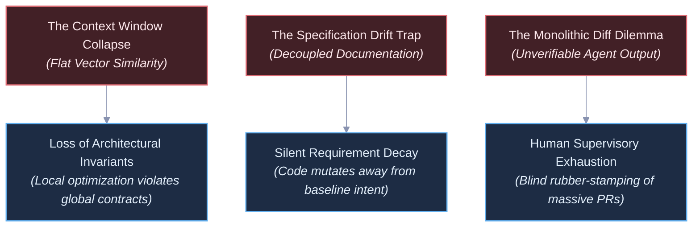
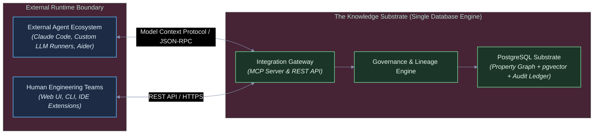
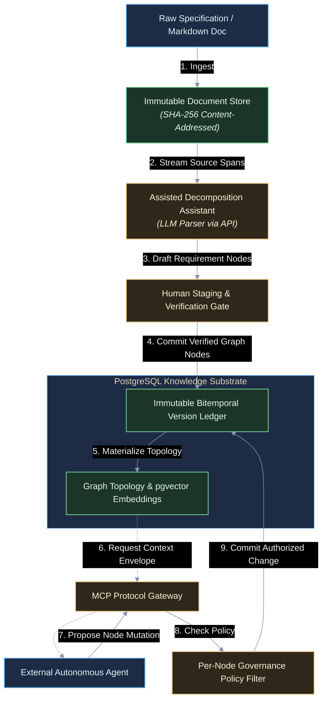
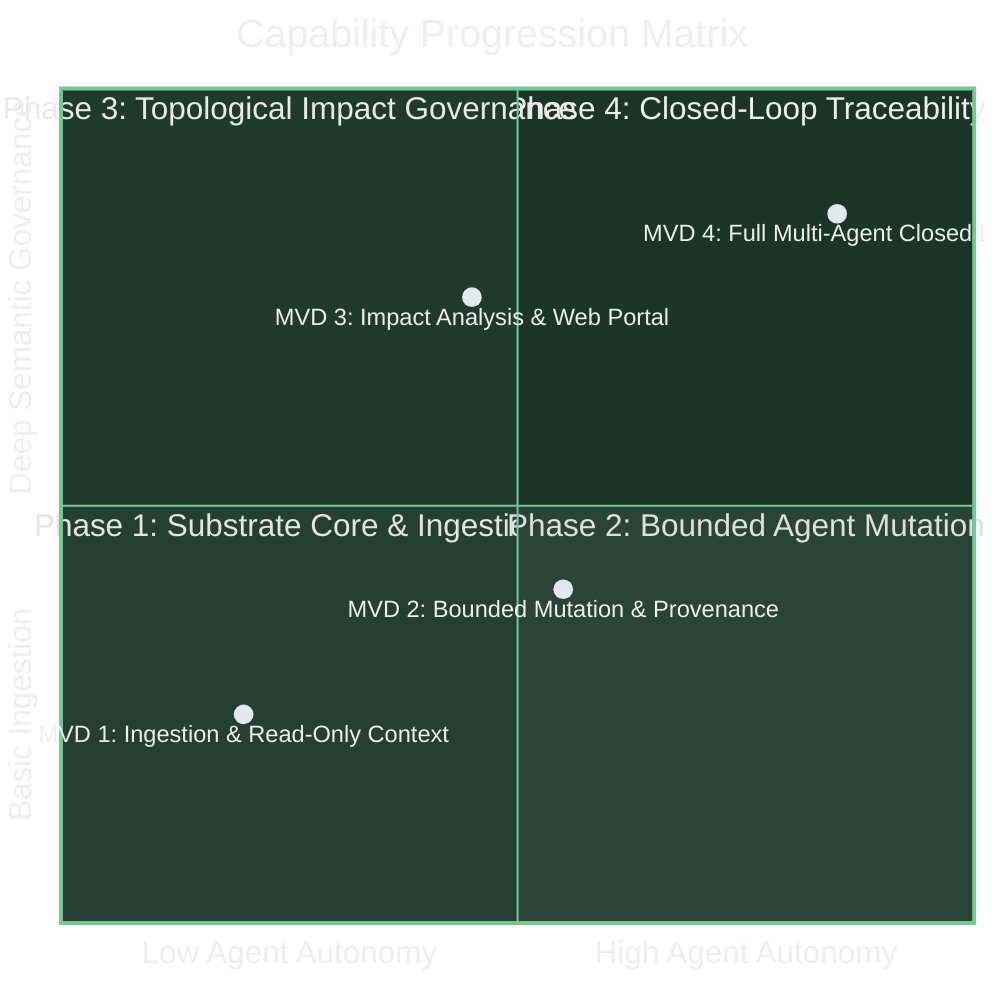

# Technical Vision: The Knowledge Substrate for Agentic Software Engineering

---

## 1. The Problem Space & Current Paradigm Limitations

Autonomous AI agents are increasingly capable of generating functional software modules, yet the medium through which software engineering is organized—unstructured text documents, linear source files, and flat issue trackers—was engineered for human visual scanning, not distributed machine reasoning. Current industry paradigms exhibit three structural failure modes that prevent autonomous agents from operating reliably at enterprise scale:

### The Context Window Collapse (Flat Vector Search Limitations)

Standard agentic workflows rely on flat semantic search across raw codebases and unstructured documentation. Vector similarity measures lexical and topical proximity, but is blind to hierarchical constraints, dependency depths, and parent architectural rules. When an agent queries an unfamiliar codebase, it retrieves localized snippets while missing the systemic invariants that govern them, producing locally plausible implementations that violate system-wide architectural integrity.

### The Specification Drift Trap (Decoupled Intent)

In modern delivery lifecycles, project vision documents, product requirements (PRDs), and architectural specifications are write-once artifacts. Once engineering starts, implementation rapidly decouples from documentation. When autonomous agents operate within this disconnected paradigm, every development loop compounds intent decay. Lacking an immutable, queryable link between functional requirements and execution tasks, agents introduce unintended scope, duplicate capabilities, and silently drop edge-case requirements.

### The Monolithic Diff Dilemma (The Human Review Bottleneck)

As agent synthesis speed outpaces human reading capacity, human supervisors face an unscalable verification burden: reviewing massive, multi-file code diffs generated in seconds. Humans cannot verify whether thousands of lines of synthesized code adhere to twenty subtle non-functional constraints, cross-cutting security policies, and accepted product requirements. Software engineering risks shifting from an intentional design discipline into an opaque quality-assurance bottleneck.

---

## 2. The North Star Vision

### Core Vision Statement

> **Engineer an agent-agnostic knowledge substrate that anchors external AI agents and human teams to a unified, version-governed property graph, establishing end-to-end traceability and bidirectional coherence from vision to executable code.** *(30 words)*

### Key Capabilities

1. **Unified Graph-Relational Substrate:** A PostgreSQL storage layer combining native property graph structures with vector embeddings, modeling vision, requirements, specifications, tasks, and artifacts as a strongly typed, navigable topology.
2. **Document Provenance & Assisted Decomposition Pipeline:** Ingestion of source documents into a cryptographically signed document store, using conversational LLM pipelines and human review gates to extract structured requirement nodes with verified lineage.
3. **Open Protocol Integration Gateway:** Standardized Model Context Protocol (MCP) and REST interfaces enabling external agent runtimes to retrieve bounded context envelopes and submit proposed graph mutations.
4. **Immutable Versioning & Bitemporal Lineage:** An append-only audit ledger ensuring every requirement, specification, task, and dependency edge is completely reversible, diffable, and point-in-time reconstructible.
5. **Attribute-Based Node Governance:** Granular, per-node governance attributes that dictate whether an entity is open for autonomous agent elaboration or strictly gated by human authorization.

### Operational Timescales

| Horizon | Mechanical Cadence | System Operation |
| --- | --- | --- |
| **Micro-Reflex** | $< 50\text{ ms}$ | Graph traversal queries, vector similarity neighbor lookups, and transactional edge validation within PostgreSQL. |
| **Agent Cycle** | Seconds to Minutes | External agents query context envelopes via MCP, execute local code synthesis, and submit candidate graph mutations. |
| **Supervisory Review** | Hours to Days | Human engineers review extracted requirement drafts, inspect topological impact analyses, and sign off on gated nodes. |
| **Systemic Evolution** | Weeks to Months | Strategic iteration on product roadmaps, high-level vision revisions, and schema attribute extensions across the project lifecycle. |

### Conceptual Grounding

To maintain engineering precision, all structural concepts are anchored in standard software engineering and project management terminology:

| System Concept | Concrete Engineering Specification |
| --- | --- |
| **Knowledge Substrate** | A PostgreSQL engine uniting graph topologies (SQL/PGQ), dense vector indices (`pgvector`), and relational audit tables in an ACID-compliant store. |
| **Document Ledger** | A content-addressed, cryptographically signed (`SHA-256`) artifact store preserving the exact byte-level source text from which requirements were derived. |
| **Topological Context Envelope** | A $k$-hop directed subgraph query centered on an assigned task node, aggregating ancestor requirements and sibling constraints into a bounded prompt context. |
| **Per-Node Governance Policy** | Metadata attributes stored on individual graph nodes designating the operational authorization level (`AUTONOMOUS_ELABORATION`, `HUMAN_REVIEW_REQUIRED`, `LOCKED`). |

---

## 3. Environmental & Boundary Contracts

The Knowledge Substrate operates strictly within the following architectural boundaries:

* **Single-Engine Operational Footprint:** All topology data, vector embeddings, relational metadata, and audit records reside in a single PostgreSQL instance. Distributed dual-database setups (e.g., maintaining an external vector database alongside a graph store) are prohibited, eliminating distributed transaction failures.
* **Externalized Cognitive Compute:** The core Knowledge Substrate never directly invokes LLM inference for its internal operational loops. External agents supply their own compute and models. LLM interaction within the substrate is restricted to human-directed document ingestion and decomposition pipelines.
* **Stateless Gateway Boundary:** The MCP and REST interfaces maintain no persistent session memory. Each operation is an authenticated, isolated transaction targeting explicit node identifiers and payloads.
* **Document Immutability Guarantee:** Uploaded source documents (Markdown, text) are immediately content-addressed via cryptographic hashing (`SHA-256`) and stored in an append-only document repository. Requirements derived from them reference the document signature and source character offsets.
* **Schema Flexibility via Progressive Layering:** Core system tables enforce only foundational structural edges (`DERIVED_FROM`, `CONSTRAINED_BY`, `FULFILLS`, `VERIFIED_BY`). Domain-specific attributes and evolving project taxonomy are managed via typed JSONB fields to avoid costly schema migrations during early project phases.

---

## 4. System Topology & Information Flow

The architecture is organized around two decoupled operational loops: the **Document Ingestion & Decomposition Pipeline** and the **Agent Execution & Governance Loop**.

### Communication Contracts & Workflow Protocols

#### 1. Ingestion & Decomposition Flow

1. **Source Ingestion:** An engineering lead or product manager uploads a plain text or Markdown specification via the REST API.
2. **Cryptographic Sealing:** The substrate computes the document's SHA-256 hash, stores the raw artifact in the document ledger, and mints a unique `DocumentArtifact` identifier.
3. **Assisted Parsing:** A decomposition workflow provides the document content and structure prompts to an external or local LLM session. The LLM extracts proposed atomic requirement nodes, mapping each directly to character spans within the source document.
4. **Staging & Verification:** The proposed nodes are held in a staging table. A human supervisor reviews the parsed requirement boundaries, adjusts initial metadata and governance flags, and authorizes insertion into the live graph.

#### 2. Agent Execution & Graph Mutation Flow

1. **Context Extraction (Graph RAG):** An external agent queries context for an assigned work unit (e.g., `Task-205`) via the MCP server. The server executes a topological query retrieving the target node, its direct ancestor specifications, linked architectural constraints, and vector-similar sibling context.
2. **Bounded Execution:** The agent receives this bounded context envelope and executes its software engineering task within its external runtime (e.g., generating code, writing unit tests, or refining a functional specification).
3. **Mutation Submission:** The agent submits a mutation payload back through the MCP gateway, proposing the creation of new sub-tasks, test results, or elaborated design specifications.
4. **Governance Interception:** The substrate checks the target node's `governance_policy` attribute:

* If flagged `AUTONOMOUS_ELABORATION`, the write succeeds immediately, committing an append-only delta to the audit ledger.
* If flagged `HUMAN_REVIEW_REQUIRED`, the mutation is parked in a `PENDING_REVIEW` state, and an event is queued for human inspection.

---

## 5. Invariants, Boundary Constraints & Hypotheses

### Architectural Invariants (Engineering Directives)

* **Invariant I-1 (Strict Bidirectional Traceability):** Every functional specification, implementation task, and code artifact reference must maintain a valid, directed edge path terminating at an authorized requirement node. Orphan execution tasks are rejected at the database constraint level.
* **Invariant I-2 (Immutable Append-Only Provenance):** Destructive in-place updates (`UPDATE` or `DELETE`) on requirements, specifications, and topological edges are strictly prohibited. State transitions must be recorded as newly versioned records pointing to predecessors via `SUPERSEDES` edges, guaranteeing full historical state reconstruction.
* **Invariant I-3 (Zero In-Database Agent Execution):** The core database engine and gateway services shall never execute autonomous agent cognitive loops internally. The substrate functions strictly as a deterministic state store and protocol gateway.
* **Invariant I-4 (Cryptographic Source Anchoring):** Every requirement derived via the decomposition pipeline must store a persistent cryptographic reference (`SHA-256` document hash) and source span coordinates pointing to the original document artifact.
* **Invariant I-5 (Explicit Per-Node Governance Authority):** Permissions to alter or elaborate a node are governed by explicit per-node metadata attributes (`governance_policy`). Node-level policies take absolute precedence over global agent roles.

### Strategic Hypotheses (Scientific Bets to De-Risk)

* **Hypothesis H-1 (Topological Retrieval vs. Flat Vector Precision):**
*We hypothesize that* supplying agents with graph-bounded context envelopes (ancestor requirements plus direct architectural constraints) reduces downstream architectural contract violations by $\ge 70\%$ compared to standard top-$k$ flat semantic vector retrieval.
* **Hypothesis H-2 (Sublinear Human Oversight Overhead):**
*We hypothesize that* managing autonomous agents through structured requirement graphs and topological impact analyses reduces human supervisory time per feature by $\ge 50\%$ compared to manual line-by-line inspection of agent-generated code diffs.
* **Hypothesis H-3 (Single-Engine Relational Scalability):**
*We hypothesize that* a single PostgreSQL instance combining graph query extensions and `pgvector` can comfortably scale to $10^6$ nodes with sub-100ms context envelope query latency, eliminating the need for dedicated graph or vector database clusters.
* **Hypothesis H-4 (Assisted Ingestion Accuracy):**
*We hypothesize that* a human-in-the-loop decomposition pipeline powered by a local or commodity LLM achieves $\ge 95\%$ requirement extraction fidelity from unstructured technical markdown without requiring proprietary parsing tools.

### Inside-Out Mechanics to Outside-In Strategic Leverage

| Architectural Mechanism (Inside-Out) | Strategic & Economic Leverage (Outside-In) |
| --- | --- |
| **Agent-Agnostic Protocol Gateway (MCP / REST)** | **Vendor Decoupling & Model Arbitrage:** The enterprise can adopt emerging LLM models and specialized external agent frameworks without modifying the underlying project knowledge base or business logic. |
| **Unified PostgreSQL Engine** | **Operational Economy & Zero Infrastructure Sprawl:** Utilizes proven enterprise database tooling for backup, replication, security, and compliance, avoiding the operational cost of multi-database synchronization. |
| **Cryptographic Document Lineage** | **Auditability & Regulatory Defense:** Establishes unambiguous, mathematically verifiable proof linking production code back to signed customer contracts, compliance mandates, and approved design documents. |
| **Per-Node Governance Controls** | **Controlled Scaling of Autonomous Capacity:** Engineering leadership can progressively delegate lower-risk system layers to autonomous agents while enforcing strict human oversight over mission-critical components. |

---

## 6. Multi-Axis Progression Roadmap

Program advancement is organized across two orthogonal vectors: **Governance & Provenance Maturity** and **Agent Autonomy & Integration Breadth**.

### Execution Phases

#### Phase 1: Substrate Core, Document Ingestion & Context Gateway

* **Core Deliverable:** PostgreSQL operational instance configured with core property graph tables, `pgvector`, and an append-only document repository. REST endpoints for uploading source documents and initiating LLM-assisted decomposition. An MCP server providing read-only context envelope retrieval for external agents.
* **Focus:** Validate document ingestion, cryptographic hashing, and graph-traversal context assembly.

#### Phase 2: Bounded Agent Mutation & Per-Node Governance

* **Core Deliverable:** Write-enabled MCP protocol tools allowing external agents to submit candidate specification and task nodes; database-level enforcement of append-only bitemporal versioning and per-node `governance_policy` attributes.
* **Focus:** Verify multi-agent concurrent writes, reversion workflows, and policy-driven mutation blocking.

#### Phase 3: Topological Impact Analysis & Human Supervisory Portal

* **Core Deliverable:** A web-based supervisory interface providing visual graph navigation, downstream invalidation alerts when parent requirements change, and review/approval queues for human-gated nodes.
* **Focus:** Deliver human observability into project evolution; replace raw database inspection with topological impact tracking.

#### Phase 4: Closed-Loop Lifecycle Verification & Source Code Mapping

* **Core Deliverable:** Bi-directional synchronization mapping version-control commits and automated test run results directly to leaf execution nodes; formal sign-off and approval lifecycles for release candidates.
* **Focus:** Realize full spec-driven development where code merges require continuous, automated proof of requirement satisfaction.

---

## 7. Directional Gating & Governance

### Key Observables

Progression across project phases is evaluated using four directional metrics:

* **Retrieval Boundedness & Relevance:** Ratio of required context tokens delivered to external agents versus irrelevant noise, measuring the efficiency of the topological context envelope.
* **Decomposition Lineage Fidelity:** Percentage of extracted requirement nodes that correctly resolve to exact, verifiable source spans within the signed source documents.
* **Drift & Invalidation Velocity:** Latency from the moment a parent requirement is modified to the complete identification and flagging of all invalidated downstream tasks.
* **Supervisory Decision Latency:** Time required for an engineering lead to evaluate, approve, or reject an agent-proposed requirement mutation via the supervisory interface.

### Minimum Viable Demonstrations (MVDs)

* **Phase 1 MVD (Ingest, Decompose, and Retrieve):**
* *Demonstration:* Upload a multi-page Markdown system specification via the REST API. The assisted decomposition pipeline parses the document into atomic requirement nodes, presents them for human review, and commits them to PostgreSQL with cryptographic SHA-256 parent links. An external agent connects via MCP, requests context for an assigned requirement, and receives a bounded context envelope containing parent requirements and sibling constraints without manual prompt construction.

* **Phase 2 MVD (Bounded Mutation & Clean Rollback):**
* *Demonstration:* An external agent claims an open requirement flagged for autonomous elaboration via MCP, decomposes it into three functional specifications, and commits them to the database. An authorized human supervisor issues a rollback command; the entire generated sub-graph reverts cleanly to the historical snapshot without leaving orphan edges or corrupting database state.

* **Phase 3 MVD (Automated Invalidation Cascading):**
* *Demonstration:* A human user modifies a top-level requirement via the web dashboard. The system executes a graph traversal, marks all downstream specifications and tasks as `NEEDS_REVERIFICATION`, and blocks external agents from completing those tasks until an engineer updates the dependent specs.

### Falsification & Termination Criteria (Kill Conditions)

The program should be halted, redirected, or fundamentally restructured if any of the following failure conditions occur:

1. **The Ingestion Friction Falsification:**
If the overhead of ingesting, decomposing, and verifying markdown specifications in the graph exceeds the time required for engineering teams to manually write tickets and code, the core value proposition of an automated knowledge substrate is disproven.
2. **The Graph RAG Inefficacy Falsification (Hypothesis H-1 Failure):**
If controlled benchmarks reveal that external agents operating over graph-structured context envelopes exhibit comparable rates of architectural drift and hallucination to agents using simple flat-file vector search, the graph-native thesis is falsified.
3. **The Single-Engine Relational Bottleneck (Hypothesis H-3 Failure):**
If recursive graph traversals over bitemporally versioned tables in PostgreSQL fail to maintain sub-100ms response latencies at $10^5$ nodes, and this bottleneck cannot be resolved through index optimization, the single-engine architectural boundary must be abandoned in favor of a specialized graph database.

### Strategic Planning Handoff

Exact database table definitions, API route contracts, specific embedding model selections, and UI wireframes are intentionally deferred to the **Strategic Planning Backlog** to be resolved during phased implementation planning.
