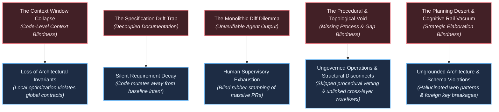
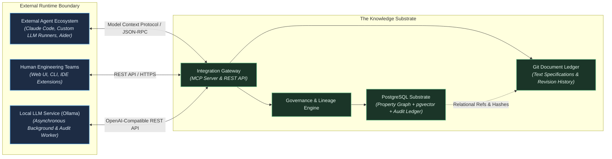
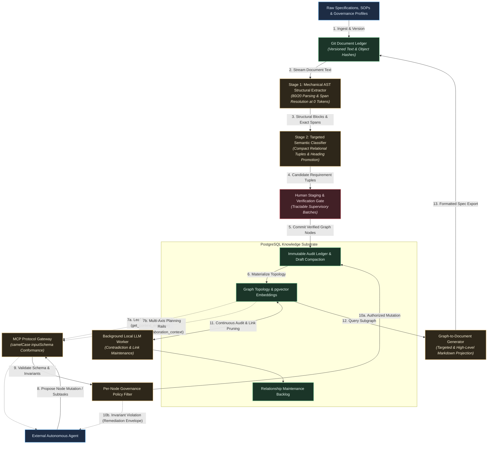
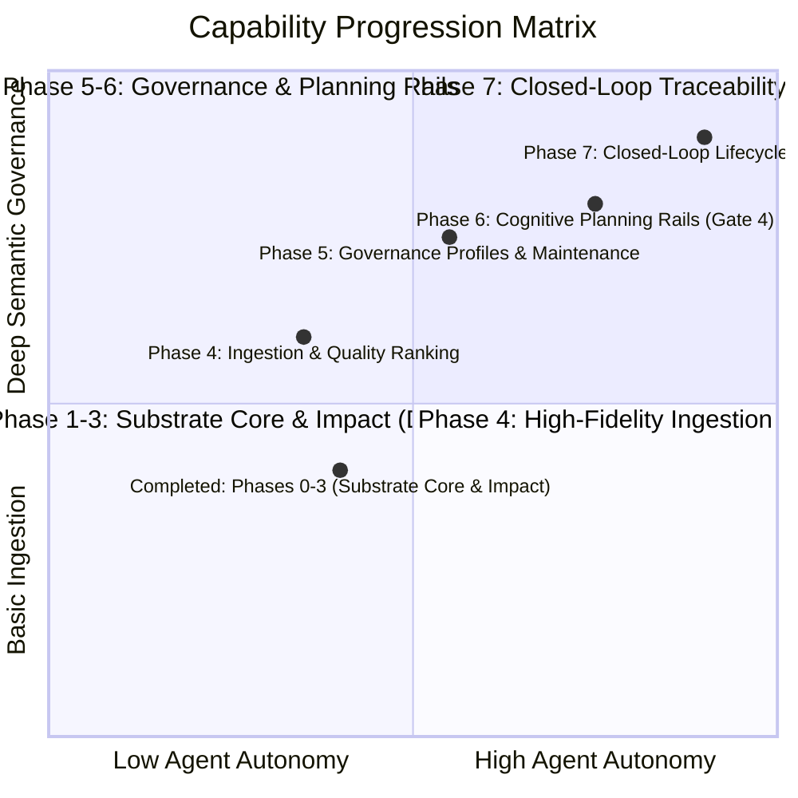

# Technical Vision: The Knowledge Substrate for Agentic Software Engineering

---

## 1. The Problem Space & Current Paradigm Limitations

Autonomous AI agents are increasingly capable of generating functional software modules, yet the medium through which software engineering is organized—unstructured text documents, linear source files, and flat issue trackers—was engineered for human visual scanning, not distributed machine reasoning. Current industry paradigms exhibit structural failure modes that prevent autonomous agents from operating reliably at enterprise scale:

### The Context Window Collapse (Code-Level Context Blindness)

Contemporary AI-native engineering environments assemble context dynamically via Abstract Syntax Tree (AST) parsing, type-system traversal, symbol grepping, and iterative file exploration. While these techniques significantly surpass naive vector similarity, code-level context assembly remains structurally blind to the intent and requirement layer. Code-level tools can discover what existing code *does*, but they cannot infer what the software is *supposed to do*, why specific architectural invariants exist, or which upstream business requirements govern a component. Lacking a topological requirement substrate, agents assemble context that is locally coherent at the syntax level but blind to systemic architectural contracts, generating code that passes unit tests while violating high-level system invariants.

### The Specification Drift Trap (Decoupled Intent)

In modern delivery lifecycles, project vision documents, product requirements (PRDs), and architectural specifications are write-once artifacts. Once engineering starts, implementation rapidly decouples from documentation. When autonomous agents operate within this disconnected paradigm, every development loop compounds intent decay. Lacking an immutable, queryable link between functional requirements and execution tasks, agents introduce unintended scope, duplicate capabilities, and silently drop edge-case requirements.

### The Monolithic Diff Dilemma (The Human Review Bottleneck)

As agent synthesis speed outpaces human reading capacity, human supervisors face an unscalable verification burden: reviewing massive, multi-file code diffs generated in seconds. Humans cannot verify whether thousands of lines of synthesized code adhere to twenty subtle non-functional constraints, cross-cutting security policies, and accepted product requirements. Software engineering risks shifting from an intentional design discipline into an opaque quality-assurance bottleneck. Crucially, this verification crisis cannot be resolved by simply displacing cognitive fatigue from code diffs to hundreds of isolated, atomized graph candidate nodes; human oversight must be grounded in tractable supervisory granularity.

### The Procedural & Topological Void (Absence of Process and Cross-Layer Gap Blindness)

Software engineering is fundamentally more than a static cascade of functional requirements; it is equally governed by operational procedures, engineering workflows, and cross-layer architectural coherence. When an engineering task requires introducing a new third-party dependency, for example, execution is governed not only by functional utility, but by mandatory institutional procedures: vetting licensing compatibility, evaluating commit frequency and maintenance health, verifying CVE management history, and auditing supply chain blast radius. In flat issue trackers and code-centric agent environments, these operational procedures, checklists, and institutional policies are completely severed from execution context.

Furthermore, existing paradigms lack the topological reachability to detect *architectural gaps*. When traversing a user workflow, engineering teams expect presentation-layer actions to link systematically to corresponding functional specifications, domain logic, and service contracts. Current tooling cannot determine whether those cross-layer links exist, whether critical workflows were ever formally considered, or where systemic omissions lie. Autonomous agents generate code in a procedural and topological vacuum, leaving critical organizational processes unexecuted and architectural discontinuities unflagged until production failure.

### The Specification Void & The Cold-Start Adoption Barrier (The Upstream Intent Prerequisite)

Autonomous agents cannot align with intent if no externalized intent exists. Today, the vast majority of engineering organizations lack structured requirement graphs, relying instead on ephemeral chat threads, fragmented issue tickets, and implicit knowledge in developers' heads. TKS is fundamentally an intent provenance substrate, not an autonomous mind-reader: it solves the structural problem of anchoring agent execution to specifications, but it presupposes that engineering teams possess—or are willing to articulate—text-based specifications. The upfront cognitive and operational investment required to author, decompose, and curate requirement graphs represents an acute adoption cold-start barrier: before the substrate can provide topological guidance, initial intent must be formulated and ingested. TKS directly confronts this barrier via assisted mechanical decomposition, yet the structural boundary remains absolute: without externalized seed specifications, agentic reasoning operates in an intent vacuum.

### The Planning Desert & Cognitive Rail Vacuum (Strategic Elaboration Blindness)

When autonomous agents transition from executing narrow leaf tasks to performing strategic planning, epic decomposition, or phase elaboration, passive context retrieval models fail completely. If an agent is provided only a sparse summary node stripped of governing architectural invariants, prior design decisions, physical schema contracts, and established codebase blueprints, it finds itself in an "information desert."

Deprived of normative rails, commodity LLMs inevitably fall back to their broad internet pre-training weights. They hallucinate ungrounded architectural components (e.g., ad-hoc background daemons, generic webhook dispatchers), guess brittle regex patterns, and formulate task mutations that violate physical relational schemas (e.g., treating foreign-key node references as raw Git SHA strings). The failure in planning is not an inherent limitation of the agent's reasoning capacity, but a structural deficiency in the substrate: without a multi-axis planning envelope that actively binds normative boundaries, architectural precedents, and schema contracts, autonomous planning degrades into speculative guessing.

### The Build-vs-Leverage Imperative (Operational Intent Substrate vs. Code-Level Orchestration & Retrospective ALM)

The contemporary engineering ecosystem presents two divergent paradigms, neither of which addresses the foundational intent-fidelity gap:

1. **AI-Native Development Tools (Thin Code Orchestration):** AI-native IDEs (e.g., Cursor, Windsurf, Devin Desktop) and terminal-first agentic harnesses (e.g., Claude Code, Codex CLI) operate as thin orchestration layers over raw code artifacts. Through Language Server Protocol (LSP) integration, Abstract Syntax Tree (AST) search, and multi-tool agentic retrieval, they excel at discovering and manipulating existing syntax. Even when augmented with automated codebase graph generators (e.g., Graphify, AST knowledge graphs), code-derived graphs merely reflect current syntactic implementation; they remain structurally blind to governing business intent, non-functional requirements, architectural contracts, and organizational procedures. Ad-hoc Model Context Protocol (MCP) bridges to issue trackers or flat documentation stores offer only fragmented, unverified context without topological coherence or mutation governance.
2. **Legacy ALM Platforms (Retrospective Compliance):** Traditional Application Lifecycle Management suites (e.g., IBM DOORS Next, Jama Connect, Siemens Polarion) and issue-tracker traceability matrix plugins treat requirements traceability as a human-facing, retrospective reporting and compliance exercise. They were never designed to serve as an active, sub-second operational substrate for machine agents requiring topological graph traversals, co-located vector search, and transactional mutation governance.

TKS occupies the critical gap between these two extremes: it is neither a code-editing assistant nor a compliance database. It is a purpose-built **knowledge and intent provenance substrate** that anchors external agent reasoning directly to a version-governed property graph of requirements, operational processes, and architectural relationships, supplying the institutional guidance and topological coherence that code-level tooling structurally lacks.

---

## 2. The North Star Vision

### Core Vision Statement

> **Engineer an agent-agnostic knowledge substrate that anchors external AI agents and human teams to a unified, version-governed property graph, establishing end-to-end traceability and bidirectional coherence across institutional knowledge, operational processes, requirements, and executable code.**

### The Core Metaphor: The Substrate as Organization, The Agent as Employee

To crystallize the architectural purpose and operational scope of The Knowledge Substrate, consider an organizational mental model:

* **The Knowledge Substrate is the Organization and its Institutional Memory:** In an engineering enterprise, the organization embodies collective institutional memory, architectural guidelines, standard operating procedures (SOPs), compliance checklists, domain knowledge, regulatory policies, and topological requirement maps. It defines *how* the enterprise builds software, *what* architectural invariants must be preserved, and *which* procedures must be followed. The substrate is durable, authoritative, version-governed, and structured.
* **The LLM Agent is the Employee / Knowledge Worker:** External LLMs play the role of employees operating within the firm. The LLM is not built *into* the substrate's operational engine; rather, it consults the organization. It is guided through the operational landscape by the organization's processes, procedures, checklists, and topological context envelopes, which direct it on how to navigate the engineering terrain and what standards must be satisfied.
* **The Agent as Creative Generator:** Crucially, while the substrate provides the governing scaffolding and institutional guardrails, the LLM remains the *creative generator*—the flexible engine of synthesis, code construction, and novel problem-solving. By decoupling authoritative institutional scaffolding (the substrate) from creative cognitive labor (the external agent), the system empowers autonomous agents to synthesize complex, novel solutions without violating institutional norms, dropping compliance checks, or wandering into architectural drift.

### Core Philosophy: Minimal LLM Reliance & Maximum Mechanical Reliance

To ensure scalability, economic sustainability, and operational determinism, TKS adheres strictly to a foundational principle: **minimal LLM reliance and maximum reliance on mechanical processes**.

* **Minimizing Expensive Output Tokens:** In modern LLM economics, output tokens are substantially more expensive in latency and cost than input tokens. While document ingestion context cannot be compressed arbitrarily, the LLM's output burden must be radically minimized. TKS achieves this by delegating the initial 80/20 (or greater) of parsing, structural segmentation, and boundary extraction to deterministic, zero-cost mechanical tools (CommonMark AST parsers, deterministic regex extractors, and recursive relational queries). LLM inference is invoked only when mechanical rules encounter semantic ambiguity, and then solely to emit compact relational tuples rather than echoing large text blocks.
* **Mechanical Scaffolding over Cognitive Guesswork:** Invariant validation, dependency graph reachability, foreign key integrity, and ancestral lineage checking are enforced entirely by deterministic relational constraints and transactional CTEs in PostgreSQL, completely bypassing probabilistic LLM judgment for structural verification.

### Key Capabilities

1. **Unified Graph-Relational Substrate:** A PostgreSQL storage layer combining native property graph structures with vector embeddings, modeling vision, requirements, specifications, tasks, and artifacts as a strongly typed, navigable topology with strict relational edge integrity.
2. **Document Provenance, Multi-Tier Analysis & Contradiction-First Quality Ranking:** Ingestion of text-based specifications into a Git-backed, content-addressed document store coupled to PostgreSQL. Operates across a strictly ordered multi-tier analysis pipeline: Tier 1 (Mechanical CommonMark AST parsing achieving 80/20 structural extraction and byte spans at zero token cost, with semantic heading rules classifying milestone headings as `REQUIREMENT`); Tier 2 (Local LLM pre-analysis if available and requested, evaluating contradiction risk against active approved requirements and preliminary quality markers); Tier 3 (User-invoked commercial LLM escalation via MCP for complex classification); and Tier 4 (Human-in-the-loop review). Candidate requirements are ranked by a Quality Index that places **Contradiction Risk against existing approved nodes first**, followed by ambiguity and testability scores. Supports incremental multi-document ingestion with hierarchical authority validation.
3. **Open Protocol Integration Gateway:** Standardized Model Context Protocol (MCP) and REST interfaces enabling external agent runtimes to retrieve bounded context envelopes and submit proposed graph mutations. Enforces strict protocol conformance (including camelCase `inputSchema` serialization) to guarantee seamless client tool handshakes.
4. **Immutable Audit Ledger & Historical Reversibility:** A clear operational distinction between active, approved entities and isolated drafts. Approved requirements, specifications, and tasks are strictly immutable and point-in-time reconstructible via an append-only audit ledger. Intermediate candidate mutations undergo lifecycle compaction upon approval, collapsing exploratory draft churn into canonical audit milestones to prevent ledger bloat while preserving drafting rationale.
5. **Attribute-Based Node Governance & Tactical Decision Capture:** Granular per-node governance attributes that dictate whether an entity is open for autonomous agent elaboration or strictly gated by human authorization. When planning or implementation agents make inconsequential tactical decisions (such as parameter ranges or CLI flags), those choices are automatically captured back into the substrate with full audit attribution, while permission scoping prevents unauthorized upward drift into vision-level requirements.
6. **Self-Referential Bootstrapping & Self-Reimplementation Benchmark:** The capability of the Knowledge Substrate to manage its own development lifecycle via a phased transition (Phase 1 read-only self-hosting, Phase 2 autonomous self-evolution). Grounded by a formal performance benchmark: demonstrating that an earlier version of TKS paired with a smaller, cheaper, less capable LLM can successfully reimplement TKS, proving that high-precision cognitive rails reduce the degrees of freedom required for complex software construction.
7. **Tractable Supervisory Granularity:** Structuring human verification gates around cohesive functional modules, document sections, and hierarchical batches rather than isolated relational micro-nodes, presenting candidate entities in the context of their source document spans to ensure supervisory review remains cognitively tractable.
8. **Institutional Process, Procedural Knowledge & Modular Governance Profiles:** First-class modeling of engineering processes, SOPs, compliance workflows, and verification checklists as strongly typed entities. Organizations encapsulate standards into **Modular Governance Profiles** (e.g., documentation policies mandating Markdown/Mermaid linting, security compliance like EU Cyber Resilience Act equivalents, repository hygiene rules) that link automatically into new projects, creating a continuous **Quality Verification Loop** tying commits and artifacts directly to requirements and governance standards.
9. **Topological Gap Detection & Continuous Graph Maintenance:** Algorithmic and agentic evaluation of graph reachability, layer bindings, and procedural completeness (e.g., discovering presentation actions lacking functional backend bindings). Augmented by an asynchronous, low-priority background process that continuously analyzes the relationship graph, detects contradictions, adapts or prunes stale linkages, and maintains a prioritized review backlog.
10. **Multi-Axis Cognitive Planning Rails (`get_elaboration_context`):** A dedicated planning dossier synthesis endpoint distinct from leaf-level context envelopes. When agents plan phases or elaborate epics, TKS delivers four cohesive informational axes: Normative Boundaries (systemic invariants), Architectural Precedents (relevant architectural decisions), Physical Schema Contracts (node/edge enums and relational constraints), and Implementation Blueprints (canonical codebase patterns).
11. **Actionable Invariant Diagnostics & Self-Healing Remediation Envelopes:** Replacement of opaque, cryptic error codes with structured remediation envelopes. When an invariant is violated (e.g., an ancestor chain missing an active `REQUIREMENT`), TKS delivers a machine-readable diagnostic specifying the broken link alongside deterministic remediation options, empowering agents to resolve structural issues within governance rules without resorting to unauthorized database tampering.
12. **Human-Readable Document Generation & Reverse Projection:** Dynamic synthesis of human-readable documentation directly from the living property graph. External agents or users can query broad syntheses (high-level vision or architectural overviews) or targeted vertical slices (how and why a specific UI workflow operates), orchestrating an LLM to assemble graph nodes and edges into cohesive Markdown adhering to project documentation standards.
13. **External Artifact Validation & Knowledge Base Review:** Utilizing TKS as an authoritative knowledge base to validate external content presented to it (such as executive summary slide decks, architectural RFCs, or PRDs). TKS analyzes external claims against the grounded graph topology, flagging factual errors, ungrounded abstractions, and requirement contradictions.
14. **Recursive Standards & Level-Appropriate Testing Policies:** Recursive application of formal systems engineering standards (e.g., NASA, INCOSE) to TKS's own requirements graph. Enforces layered testing policies across architectural levels: tactical decisions are verified via unit tests, architectural decisions via integration tests, with test coverage rules dynamically scaled to requirement criticality.

### Operational Timescales

| Horizon | Operational Cadence | System Operation |
| --- | --- | --- |
| **Micro-Reflex** | Real-Time / Sub-Second | Graph traversal queries, vector similarity neighbor lookups, and transactional edge validation within PostgreSQL. |
| **Agent Cycle** | Iterative Execution | External agents query context envelopes via MCP, execute local code synthesis, and submit candidate graph mutations. |
| **Background Analysis & Maintenance** | Asynchronous / Low-Priority Sweeps | Background workers continuously analyze relationship validity, prune stale links, evaluate indirect contradictions via local LLM, and maintain a prioritized graph review backlog. |
| **Supervisory Review** | Deliberative Oversight | Human engineers review extracted requirement drafts, inspect topological impact analyses, and sign off on gated nodes. |
| **Systemic Evolution** | Strategic Progression | Strategic iteration on product roadmaps, high-level vision revisions, governance profile updates, and schema attribute extensions across the project lifecycle. |

### Conceptual Grounding

To maintain engineering precision, all structural concepts are anchored in standard software engineering and project management terminology:

| System Concept | Concrete Engineering Specification |
| --- | --- |
| **Knowledge Substrate** | The authoritative living property graph uniting graph topologies, dense vector indices (`pgvector`), and relational audit tables in an ACID-compliant PostgreSQL store. |
| **Document Ledger** | A Git-backed, content-addressed artifact store serving as an immutable historical intake ledger and baseline reference archive for text-based specifications, as well as a projection target for graph-exported artifacts. |
| **Topological Context Envelope** | A directed subgraph query centered on an assigned task node, aggregating ancestor requirements, applicable procedural checklists, and sibling constraints into a bounded prompt context (`get_context_envelope`). |
| **Multi-Axis Planning Dossier** | A specialized planning envelope (`get_elaboration_context`) synthesizing normative invariants, architectural decisions, physical schema rules, and codebase precedents for epic and phase elaboration. |
| **Governance Profile & Modular Policy Pack** | Reusable, modular graph clusters encapsulating organizational policies (documentation linting, EU CRA compliance, repository rules) linked systematically to project vision nodes. |
| **Quality Verification Loop** | Automated validation pipelines tying VCS commits, code artifacts, and test runs directly to leaf requirements and linked governance profile standards. |
| **Actionable Remediation Envelope** | Structured JSON diagnostic payload emitted on invariant violations, providing the precise failure point and deterministic options for structural repair. |
| **Relationship Maintenance Backlog** | A ranked queue of suspect or evolving graph relationships asynchronously analyzed, strengthened, or pruned by background audit workers. |
| **Tactical Decision Capture** | Automated recording of agent-specified implementation parameters (ranges, flags, types) into node attributes, bounded by upward permission scoping. |
| **Self-Reimplementation Benchmark** | The evaluation standard proving an earlier TKS version plus a smaller, cheaper LLM can rebuild TKS due to high-precision contextual rails. |
| **Reverse Document Projection** | Dynamic aggregation and synthesis of graph subgraphs into cohesive, human-readable Markdown documents matching project style guidelines. |
| **Level-Appropriate Verification Policy** | Rule set mapping verification rigor to architectural depth: unit tests for tactical choices, integration tests for architectural decisions, and criticality-weighted test gates. |
| **Per-Node Governance Policy** | Metadata attributes stored on individual graph nodes designating the operational authorization level (`AUTONOMOUS_ELABORATION`, `HUMAN_REVIEW_REQUIRED`, `LOCKED`). |
| **Self-Referential Engine** | The application of the Knowledge Substrate to its own codebase and lifecycle, establishing a closed feedback loop where the tool governs its own evolution. |
| **Tractable Supervisory Unit** | A cohesive, hierarchical batch of candidate graph nodes presented in source document context for human verification, preventing supervisory review exhaustion. |
| **Procedural Entity & Checklist Node** | Strongly typed graph nodes representing operational workflows, Standard Operating Procedures (SOPs), and compliance checklists required to authorize task completion. |
| **Topological Gap Analysis** | Structural and semantic graph traversal algorithms paired with external LLM auditing to detect architectural discontinuities or omitted procedural steps. |
| **Organizational Knowledge Metaphor** | The foundational design paradigm wherein the substrate acts as the authoritative organization/playbook and external agents act as employees/creative generators navigating its guidance. |

---

## 3. Environmental & Boundary Contracts

The Knowledge Substrate operates strictly within the following architectural boundaries:

* **Resource-Constrained Execution Model:** The project operates under an explicitly constrained resource model. The phased roadmap is engineered so that each progression phase delivers standalone operational value and can be evaluated or falsified independently. Phase 0 and Phase 1 are scoped to be achievable by a small team (or individual developer) utilizing commodity infrastructure. Subsequent milestones (Phases 3 and 4) are aspirational targets whose investment is strictly contingent on the demonstrated viability and dogfooding adoption of earlier phases.
* **Specification Prerequisite & Cold-Start Operational Boundary:** The Knowledge Substrate operates on the foundational premise that human engineering teams provide or curate text-based specifications (PRDs, architecture RFCs, SOPs). TKS is not an autonomous requirements generator or reverse-engineering scanner; it anchors execution to externalized human intent. For teams lacking documented specifications, the initial value curve exhibits an inevitable cold-start barrier: the substrate requires upfront specification intake before downstream agent leverage is realized. Minimizing this cold-start latency through low-friction assisted decomposition is a primary architectural imperative, but the prerequisite of documented intent is an explicit environmental boundary.
* **Single-Engine Operational Footprint:** All topology data, vector embeddings, relational metadata, and audit records reside in a single PostgreSQL instance. Distributed multi-database setups (e.g., maintaining an external vector database or separate graph DBMS alongside PostgreSQL) are prohibited, eliminating distributed transaction failures and synchronization drift. Raw text specifications are version-governed via Git and referenced relationally.
* **Externalized Cognitive Compute & Local LLM Integration Boundaries:** The core Knowledge Substrate database engine and gateway services never directly invoke LLM inference for internal state transactions; the engine remains strictly deterministic and inference-free. External agents supply their own compute and models. However, TKS supports optional integration with a standard, local LLM API (such as the devcontainer Ollama service via an OpenAI-compatible endpoint) for asynchronous background audit workers, contradiction analysis, link refinement, and assisted ingestion validation. Model attributes (context window, model strength) are logged alongside recorded decisions to preserve audit context around automated evaluations.
* **Stateless Gateway Boundary & Strict Protocol Conformance:** The MCP and REST interfaces maintain no persistent session memory. Each operation is an authenticated, isolated transaction targeting explicit node identifiers and payloads. The gateway validates caller identity on every request. Crucially, the MCP server must strictly adhere to the official Model Context Protocol specifications (including camelCase `inputSchema` serialization in tool declarations) to guarantee error-free tool registration across diverse agent harnesses.
* **Document Immutability & Bidirectional Projection Guarantee:** Uploaded text specifications (Markdown, plain text) are stored in a Git-backed document repository and content-addressed via cryptographic hashes, serving as an immutable historical intake ledger and baseline reference archive. The PostgreSQL Property Graph is the sole authoritative living substrate for active project intent, requirements, governance states, and execution tasks. Text specifications in Git represent seed artifacts and point-in-time projection targets (i.e., human-readable Markdown can be dynamically synthesized and exported *from* the living graph), eliminating the fragility of bidirectional synchronization.
* **Physical Schema Contracts & Edge Integrity:** In PostgreSQL, graph topology is governed by strict foreign key relationships (`graph_edges.to_node_id REFERENCES graph_nodes(id)`). The substrate strictly forbids treating edge targets as raw external strings (such as Git commit SHAs). All edge relationships must link valid, registered node entities. External code references and commit hashes must either be materialized as typed nodes (e.g., `CODE_COMMIT`) or stored in structured node attributes (`attributes->'vcs_commits'`). Edge mutations are pre-validated before database transactions execute.
* **Hierarchical Ingestion Authority & Precedence:** Ingestion pipelines must evaluate a document's hierarchical position and authority relative to existing knowledge before permitting mutations. For example, lower-level implementation notes or tactical proposals cannot overwrite upstream architectural invariants or vision requirements without explicit governance authorization. When top-level governance or architecture updates occur, changes cascade downstream into affected requirement nodes, generating updated work packages for human review.
* **Schema Flexibility via Progressive Layering:** Core system tables enforce only foundational structural and procedural edges (`DERIVED_FROM`, `CONSTRAINED_BY`, `FULFILLS`, `VERIFIED_BY`, `IMPLEMENTED_BY`, `GOVERNED_BY_PROCEDURE`, `BINDS_LAYER`). Domain-specific attributes, checklists, and evolving project taxonomy are managed via typed JSONB fields to avoid costly schema migrations during early project phases.
* **Bootstrap Boundary Contract & Self-Reimplementation Gating:** Initial system design and Phase 0 development occur using conventional developer tooling. The bootstrapping transition proceeds across distinct gates:
  1. *Phase 1 Dogfooding Gate (Read-Only Self-Hosting):* Documentation (`vision.md`, backlogs) is ingested; developers and agents retrieve context envelopes via the read-only MCP gateway to implement Phase 2 tasks.
  2. *Phase 2 Dogfooding Gate (Autonomous Self-Evolution):* All subsequent feature requirements, architectural adjustments, and tasks are authored, reviewed, and governed directly within the substrate itself.
  3. *Self-Reimplementation Benchmark Gate:* The ultimate validation milestone wherein a previous version of TKS, guiding a smaller, cheaper, less capable LLM, successfully rebuilds the substrate from its ingested specifications.

---

## 4. System Topology & Information Flow

The architecture is organized around four decoupled operational loops: the **Document Ingestion & Governance Pipeline**, the **Agent Execution & Planning Rails Loop**, the **Topological Coherence & Background Maintenance Loop**, and the **Graph Projection & Document Generation Loop**.

### Conceptual Operational Loops

1. **Document & Institutional Knowledge Ingestion Loop:**
   Ingests text specifications, engineering SOPs, and modular governance profiles into the Git document ledger as immutable baseline references. Decomposes documents through a strictly ordered multi-tier pipeline:
   * *Tier 1 (Mechanical AST Structural Extraction):* Deterministically segments structural blocks (headings, lists, code fences, tables) and resolves exact source character spans at zero token cost, completing 80%+ of the parsing work mechanically. Classifies milestone and core epic headings as `REQUIREMENT` nodes rather than defaulting to generic `SPECIFICATION` nodes, ensuring an intact ancestral hierarchy for Invariant INV-1.
   * *Tier 2 (Local LLM Pre-Analysis & Contradiction Risk Check):* Executed if available and requested (e.g. devcontainer Ollama), evaluating candidate chunks against active approved nodes with **contradiction risk evaluated first**, followed by preliminary ambiguity and testability scoring.
   * *Tier 3 (User-Invoked Commercial LLM Escalation):* If escalated by the user, an external commercial LLM is directed via MCP to inspect candidates, resolve semantic ambiguities, and classify compact relational tuples.
   * *Tier 4 (Human Supervisory Gate):* Candidate nodes are presented in hierarchical batches ranked by the Quality Index (contradictions prioritized at the top). Verified nodes are committed to PostgreSQL with cryptographic source span links.
   * *Tier Ordering Invariant:* Any combination of tiers is valid, but execution must always follow this strict sequence.
2. **Agent Execution, Governed Mutation & Cognitive Planning Rails Loop:**
   Provides external autonomous agents with tailored context along two distinct pathways:
   * *Leaf-Task Implementation:* Retrieves immediate upward parent requirements, sibling constraints, and semantic vector neighbors via `get_context_envelope`.
   * *Strategic Phase & Task Elaboration:* Retrieves a multi-axis planning dossier via `get_elaboration_context`, providing normative invariants, historical decisions, physical schema rules, and codebase implementation blueprints.
   * Agents execute planning or coding in external runtimes and propose mutations back through the gateway. Mutations are checked against per-node governance policies, deliverable contracts, and physical edge constraints (verifying that edge endpoints exist as valid node UUIDs before committing).
   * Inconsequential tactical decisions made by the agent (e.g., parameter ranges, CLI flags) are automatically captured into node attributes with full caller provenance, bounded by permission scoping that prohibits unauthorized upward propagation.
   * If an invariant is violated, TKS emits a structured **Remediation Envelope** detailing the broken ancestor chain and deterministic repair options, enabling autonomous self-healing.
3. **Topological Coherence, Background Relationship Maintenance & Gap Auditing Loop:**
   Traverses the property graph via explicit edge traversals and vector neighborhoods to identify systemic omissions and discontinuities. Augmented by an asynchronous, low-priority background process (optionally utilizing a standard local LLM):
   * Continuously evaluates requirement linkages, detecting indirect contradictions, strengthening valid associations, and pruning stale edges over time.
   * Populates a prioritized relationship review backlog for incremental refinement.
   * Evaluates ingestion hierarchy authority: when top-level policies or architectural specifications update, the cascade engine automatically flags affected downstream requirements, generating updated work packages for human review.
4. **Graph Projection & Human-Readable Document Generation Loop:**
   Solves the machine-versus-human representation gap. While graph nodes, edge vectors, and JSONB attributes are optimized for agentic traversals, human comprehension requires narrative structure.
   * Traverses and aggregates diverse graph nodes and relationships across broad perspectives (high-level vision and architecture overviews) or targeted vertical slices (end-to-end trace of a single user workflow).
   * Orchestrates an LLM to query the substrate, assemble the retrieved context, and format the output into structured, linted Markdown adhering to project documentation standards.
   * Exports the generated documents back to the Git repository as versioned, point-in-time reference artifacts.

*(Note: Detailed step-by-step API message protocols and interaction sequences are cataloged in the [Strategic Planning Backlog](docs/vision/strategic-planning-backlog.md).)*

---

## 5. Invariants, Boundary Constraints & Hypotheses

### Architectural Invariants (Engineering Directives)

* **Invariant I-1 (Strict Bidirectional Traceability & Procedural Grounding):** Every functional specification, implementation task, and code artifact reference must maintain a valid, directed edge path terminating at an active requirement node. Furthermore, execution tasks involving institutional procedures (e.g., introducing third-party dependencies, altering security boundaries) must maintain explicit dependency edges to applicable procedural policy and checklist nodes. Verification of tasks must adhere to level-appropriate policies (unit tests for tactical choices, integration tests for architectural decisions). Orphan execution tasks and ungoverned procedural actions are rejected at the database constraint level.
* **Invariant I-2 (Auditability & Reversible Lineage):** Destructive in-place updates (`UPDATE` or `DELETE`) on approved requirements, specifications, and topological edges are strictly prohibited. State transitions across approved entities must be recorded such that every state mutation is fully auditable, reversible, and point-in-time reconstructible without data loss. A strict distinction is enforced between active, approved entities and candidate drafts: candidate entities and exploratory agent proposals reside in an isolated draft lifecycle and are subject to lifecycle event compaction upon promotion to active status, collapsing drafting churn into a single canonical audit milestone to eliminate ledger bloat while preserving active lineage.
* **Invariant I-3 (Zero In-Database Agent Execution):** The core database engine and gateway services shall never execute autonomous agent cognitive loops internally. The substrate functions strictly as a deterministic state store and protocol gateway. Auxiliary background audit workers or decomposition pipelines connecting to local or external LLMs operate strictly as externalized clients through standard authenticated APIs.
* **Invariant I-4 (Cryptographic Source Anchoring):** Every requirement derived via the decomposition pipeline must store a persistent cryptographic reference (Git commit/blob hash) and source span coordinates pointing to the original document artifact.
* **Invariant I-5 (Explicit Per-Node Governance Authority & Bounded Tactical Delegation):** Permissions to alter or elaborate a node are governed by explicit per-node metadata attributes (`governance_policy`). Node-level policies take absolute precedence over global agent roles. External agents may be granted bounded delegation to resolve inconsequential tactical decisions (such as parameter ranges or CLI flags), which are captured in node attributes with complete provenance, but policies strictly restrict how far up the requirement hierarchy an agent can propagate changes without human authorization.
* **Invariant I-6 (Self-Referential Bootstrapping & Multi-Agent Co-Evolution):** The Knowledge Substrate must be used to manage its own development through a phased bootstrapping transition. Upon completing Phase 1 foundational ingestion and read-only context retrieval, the substrate self-hosts its own documentation for context querying. Upon completing Phase 2 mutation tooling and governance, all subsequent feature requirements, architectural adjustments, and development tasks are authored, reviewed, and tracked directly within the substrate itself. Upon completing Phase 3, the substrate supports concurrent multi-agent co-evolution within branch workspace containers, automated invalidation cascades, and reverification recovery under topological conflict resolution (Gate 3). Performance is periodically validated against the Self-Reimplementation Benchmark.
* **Invariant I-7 (Agent Identity Attribution & Workspace Draft Isolation):** Every mutation and candidate draft submitted through the Integration Gateway must be attributable to a verified external identity (human user or autonomous agent instance) stamped with `created_by` and recorded in the audit ledger (`actor_id`, `actor_type`, `token_fingerprint`). Candidate entities elaborated within ephemeral branch workspace containers (`attributes->'workspace_id'`) are strictly confidential and isolated from the live substrate and peer workspaces (INV-7, DEC-3.5), visible dynamically only to the authoring agent session until verified and atomically promoted under canonical lock serialization. Identity credentials must be validated on every mutation request; revocation must immediately invalidate local cache entries across running services.
* **Invariant I-8 (Actionable Diagnostics & Self-Healing Remediation Envelopes):** Opaque, uninformative constraint error strings (such as bare `ERR_INVALID_ANCESTOR_PATH`) are strictly prohibited in public gateway responses. Whenever a structural invariant or ancestor path validation fails, the gateway must return a structured JSON Remediation Envelope detailing the precise point of failure (e.g., terminal node identity and type) and enumerated, deterministic remediation actions (e.g., ancestor promotion options), enabling autonomous agents to self-correct within the governance framework.
* **Invariant I-9 (Physical Edge Relational Integrity & Pre-Validation):** Graph edge relationships (`graph_edges`) enforce strict relational integrity: both `from_node_id` and `to_node_id` must resolve to valid UUIDs in `graph_nodes`. Treating edge targets as external string primitives (such as raw Git commit SHAs) is prohibited at both gateway and database levels. External artifacts must be mapped via typed nodes or stored in structured entity attributes (`attributes->'vcs_commits'`). All edge mutations must be validated against schema and relationship contracts prior to transaction execution.

### Strategic Hypotheses (Scientific Bets to De-Risk)

* **Hypothesis H-1 (Governed Requirement Topologies vs. Ad-Hoc Agentic Retrieval):**
  *We hypothesize that* anchoring external agents to a *purpose-built, version-governed, human-curated* requirement graph provides decisive advantage over best-available code-level agentic context assembly—including multi-tool code exploration, AST symbol traversal, and ad-hoc or auto-generated code knowledge graphs lacking requirement provenance—by supplying authoritative intent provenance, operational policies, and audit lineage that code-level syntax exploration structurally lacks, thereby significantly reducing downstream architectural contract violations and intent drift.
* **Hypothesis H-2 (Sublinear Human Oversight Overhead):**
  *We hypothesize that* managing autonomous agents through structured requirement graphs and topological impact analyses significantly reduces human supervisory overhead compared to manual inspection of agent-generated code diffs.
* **Hypothesis H-3 (Single-Engine Relational Scalability):**
  *We hypothesize that* a single PostgreSQL instance combining graph query patterns and `pgvector` scales comfortably to support large-scale enterprise project graphs without requiring dedicated graph or vector database clusters.
* **Hypothesis H-4 (Assisted Ingestion Accuracy & 80/20 Mechanical Efficiency):**
  *We hypothesize that* a decomposition pipeline combining mechanical AST structural parsing for the initial 80/20 extraction with commodity LLMs for narrow semantic classification achieves high-fidelity requirement extraction from technical markdown at a fraction of the token expenditure required by monolithic LLM ingestion prompts.
* **Hypothesis H-5 (Topological Gap Detection & Procedural Scaffolding):**
  *We hypothesize that* structuring institutional procedures (such as dependency onboarding, licensing verification, and CVE audits) and cross-layer architectural contracts as a navigable property graph allows structural traversals combined with external LLM-in-the-loop auditing to detect systemic gaps (such as unlinked UI-to-backend workflows or unvetted third-party libraries) significantly earlier than conventional PR reviews, while reducing agent procedural non-compliance.
* **Hypothesis H-6 (Substrate-Guided Model Downgrading / Self-Reimplementation Efficiency):**
  *We hypothesize that* providing an autonomous agent with a multi-axis planning dossier (`get_elaboration_context`) and strict topological rails narrows the required degrees of freedom sufficiently that a smaller, cheaper, less capable LLM can achieve task implementation and phase elaboration fidelity equivalent to an unguided frontier model, successfully achieving the self-reimplementation benchmark at substantially lower inference cost.
* **Hypothesis H-7 (Modular Governance Profiles & Cascading Compliance):**
  *We hypothesize that* encapsulating institutional standards into modular, reusable governance profiles and automatically cascading policy updates downstream into affected requirement nodes eliminates institutional compliance drift and reduces the latency of adopting regulatory or security mandates across large codebases.

*(Note: Quantitative calibration targets and metric benchmarks for each hypothesis are cataloged in the [Strategic Planning Backlog](docs/vision/strategic-planning-backlog.md).)*

### Inside-Out Mechanics to Outside-In Strategic Leverage

| Architectural Mechanism (Inside-Out) | Strategic & Economic Leverage (Outside-In) |
| --- | --- |
| **Agent-Agnostic Protocol Gateway (MCP / REST)** | **Vendor Decoupling & Model Arbitrage:** The enterprise can adopt emerging LLM models and specialized external agent frameworks without modifying the underlying project knowledge base or business logic. |
| **Unified PostgreSQL Engine** | **Operational Economy & Zero Infrastructure Sprawl:** Utilizes proven enterprise database tooling for backup, replication, security, and compliance, avoiding the operational cost of multi-database synchronization. |
| **Git-Backed Document Ledger** | **Proven Versioning & Transparent Text Diffing:** Leverages industry-standard VCS infrastructure for text artifact versioning and delta compression, seamlessly integrating with existing developer workflows. |
| **Per-Node Governance Controls & Tactical Delegation** | **Controlled Scaling of Autonomous Capacity:** Engineering leadership can progressively delegate lower-risk system layers and tactical parameters to autonomous agents while enforcing strict human oversight over mission-critical components. |
| **Self-Referential Architecture & Reimplementation Benchmark** | **Accelerated Dogfooding & Grounded Viability:** Forcing the system to manage and rebuild its own codebase exposes UX friction and semantic gaps early, ensuring the product solves real engineering problems. |
| **First-Class Procedural & Gap Modeling** | **Institutional Continuity & Proactive Quality Assurance:** Encodes corporate development standards and cross-layer architectural checks into the active operational graph, preventing autonomous agents from cutting procedural corners or generating disconnected software layers. |
| **Multi-Axis Planning Rails (`get_elaboration_context`)** | **Cognitive Grounding & Elimination of Planning Deserts:** Prevents autonomous agents from hallucinating ungrounded architectural patterns by binding normative invariants, architectural decisions, and physical schemas into strategic planning steps. |
| **Modular Governance Profiles** | **Enterprise Policy Portability & Audit Readiness:** Allows organizations to define organizational compliance standards once (documentation, EU CRA, security) and bind them instantaneously across disparate software projects. |
| **Draft Event Compaction** | **Scalable Audit Ledger Maintenance:** Preserves full exploratory freedom for agents during draft elaboration while eliminating audit log bloat upon formal approval. |
| **Local LLM Background Auditor** | **Zero-Cost Continuous Graph Hygiene:** Enables non-stop link refinement, contradiction detection, and backlog pruning without incurring expensive external API fees. |
| **Dynamic Graph-to-Document Projection** | **Human-Centric Transparency & Bidirectional Utility:** Translates machine-optimized graph topologies into tailored, human-readable documentation without maintaining fragile dual-write synchronization. |
| **Level-Appropriate Verification Policies** | **Targeted Quality Assurance:** Balances verification rigor by enforcing unit testing for tactical decisions and integration test suites for core architectural contracts. |

---

## 6. Multi-Axis Progression Model

Program advancement is organized across two orthogonal vectors: **Governance & Provenance Maturity** and **Agent Autonomy & Integration Breadth**.

### Capability Progression Dimensions

1. **Governance & Provenance Maturity (Y-Axis):**
   Advances from basic text specification ingestion and cryptographic anchoring, through modular governance profile binding, procedural checklist enforcement, and automated invalidation cascading, to continuous background graph hygiene, cross-layer gap auditing, and closed-loop spec-to-commit verification.
2. **Agent Autonomy & Integration Breadth (X-Axis):**
   Advances from read-only topological context retrieval via MCP, to bounded agent elaboration of sub-tasks guided by multi-axis planning rails (`get_elaboration_context`), tactical decision capture, self-healing remediation envelopes, and finally to distributed multi-agent collaborative execution and automated PR reconciliation.

### The Bootstrapping Progression Strategy

To honor the principle to "start small" under a constrained resource model, development follows a strict self-referential bootstrapping path where each milestone delivers standalone utility before subsequent phases are attempted:

* **Phase 0 Baseline (Completed):** Initial architecture and storage foundations built externally. Spikes 0 and 8 validated H-1 and local embedded vector generation.
* **Phase 1 Self-Hosting Gate (Completed):** Core ingestion and read-only MCP gateway self-hosted project documentation for context querying.
* **Phase 2+ Evolution Gate (Completed):** Mutation tools, draft lifecycle event compaction, and per-node governance enabled autonomous self-evolution.
* **Phase 3 Maturity (Completed):** Impact analysis, invalidation cascading, and branch workspace isolation.
* **Phases 4–6 Reliability & Planning Rails:** Ingestion quality rubrics, modular governance profiles, and multi-axis cognitive planning rails to empower agents to plan Phase 7 directly in TKS.
* **Phase 7 (Deferred Old Phase 4):** Closed-loop traceability linking commits and automated tests to leaf requirements.

### Milestone Proof-of-Concept & Implementation Benchmarks

To empirically validate the substrate against real-world engineering challenges, the roadmap includes three distinct validation benchmarks:

1. **Open-Source Tool Reproduction POC:** Demonstrating that an autonomous agent guided solely by specifications and context retrieved from TKS can implement a functional, mature open-source tool end-to-end without unguided internet searching.
2. **Complex Systems & Formal Standards Benchmark:** Implementing a complex system governed by rigorous, multi-tiered specifications (such as reproducing compiler specifications or safety-critical software modules) adhering to INCOSE/NASA requirement standards and level-appropriate testing policies.
3. **Dual Execution Mode Evaluation:**
   * *Mode A (Repo Ingestion & Gap Discovery):* Ingesting an existing software repository alongside its documentation to discover missing cross-layer bindings, unvetted dependencies, and undocumented architectural invariants.
   * *Mode B (Specification-First Greenfield Construction):* Constructing a complete software implementation purely from ingested standard documentation and modular governance profiles.
4. **The Self-Reimplementation Benchmark:** Rebuilding TKS using an earlier stable version of TKS paired with a smaller, cheaper local model (e.g., Qwen 8B or equivalent), establishing quantitative proof of reduced cognitive degrees of freedom.

*(Note: Specific phase deliverables, engineering schedules, and operational dependencies are detailed in the [Strategic Planning Backlog](docs/vision/strategic-planning-backlog.md).)*

---

## 7. Directional Gating & Governance

### Key Observables

Progression across capability milestones is evaluated using eleven directional metrics:

* **Retrieval Boundedness & Relevance:** Ratio of required context tokens delivered to external agents versus irrelevant noise, measuring the efficiency of the topological context envelope.
* **Decomposition Lineage Fidelity:** Percentage of extracted requirement nodes that correctly resolve to exact, verifiable source spans within the signed source documents.
* **Token Output Reduction Efficiency:** Percentage reduction in LLM output tokens achieved by delegating structural decomposition to 80/20 mechanical AST extractors compared to end-to-end generative LLM parsing.
* **Drift & Invalidation Velocity:** Latency from the moment a parent requirement or governance policy is modified to the complete identification and flagging of all invalidated downstream tasks and generation of updated work packages.
* **Supervisory Decision Latency:** Time required for an engineering lead to evaluate, approve, or reject an agent-proposed requirement mutation via the supervisory interface.
* **Planning Remediation Rate:** Frequency and success rate of autonomous agents successfully recovering from invariant validation failures using structured remediation envelopes without manual developer intervention.
* **Topological Gap Detection Yield & Precision:** Ratio of verified architectural gaps (e.g., missing layer bindings, orphan workflows, unconsidered edge cases) identified by graph traversal and background auditing relative to total flagged anomalies.
* **Procedural Compliance Fidelity:** Percentage of agent-elaborated tasks (e.g., dependency additions, architecture extensions) that demonstrably satisfy institutional checklists and governance profiles before promotion to human review.
* **Model Downgrading Margin:** Comparative task completion success rate of smaller, cheaper models guided by multi-axis planning rails versus unguided frontier models on complex implementation tasks.
* **Time-to-First-Value Latency:** Elapsed wall-clock and supervisory time from initial repository deployment to the first verified agent task execution guided by a substrate context envelope, measured starting from unstructured seed text or zero ingested specifications, quantifying and bounding the cold-start adoption barrier.
* **Reverse Projection Fidelity:** Accuracy and structural completeness of human-readable documentation synthesized from graph subgraphs as evaluated by human engineering leads.

### Demonstration Milestones (MVD Overview)

The path to the North Star is gated by four Minimum Viable Demonstrations:

* **Milestone 1 (Ingest, Version, and Retrieve - Phase 1, Completed):** Ingestion of a Markdown specification into the Git document store, assisted decomposition via 80/20 mechanical AST parsing into graph requirement nodes with cryptographic parent links and semantic milestone heading classification (`REQUIREMENT`), and successful retrieval of bounded topological context envelopes by an external agent via an MCP server with verified camelCase `inputSchema` protocol conformance.
* **Milestone 2 (Bounded Mutation, Planning Rails & Clean Rollback - Phase 2, Completed):** An external agent performs phase elaboration using multi-axis planning dossiers (`get_elaboration_context`), proposes child specifications via MCP governed by per-node policy attributes and pre-validated edge targets, resolves structural warnings via actionable remediation envelopes, and commits draft changes subject to event compaction, with full capability for a human supervisor to execute a clean graph rollback to a historical snapshot.
* **Milestone 3 (Modular Governance, Invalidation Cascading & Continuous Maintenance - Phase 3 & 5):** Encapsulation of institutional standards into modular governance profiles (e.g., documentation linting, security standards). Modification of an upstream requirement or policy profile automatically cascades downstream, marking dependent specifications and tasks as requiring reverification and generating updated work packages. Concurrently, asynchronous background workers prune stale edges and detect contradictions, blocking unauthorized agent execution.
* **Milestone 4 (Closed-Loop Traceability & Self-Reimplementation - Phase 7):** Bidirectional synchronization mapping Git commits and automated test results to leaf requirement nodes under level-appropriate testing policies, providing continuous proof of requirement satisfaction. Concurrently, successful execution of the Self-Reimplementation Benchmark demonstrating that an earlier TKS version plus a downgraded model can reproduce the system from its specification graph.

*(Note: Detailed execution scripts and verification procedures for each demonstration are documented in the [Strategic Planning Backlog](docs/vision/strategic-planning-backlog.md).)*

### Falsification & Termination Criteria (Kill Conditions)

The program should be halted, redirected, or fundamentally restructured if any of the following failure conditions occur:

1. **The Ingestion Friction & Cold-Start Falsification:**
   If the total lifecycle overhead of formulating, ingesting, decomposing, and verifying specifications in the graph—measured from zero structured intent to the first usable context envelope—consistently exceeds the manual effort required for engineering teams to write tickets, prompt agents ad-hoc, and supervise code, the core economic premise of an automated knowledge substrate is disproven.
2. **The Graph RAG Inefficacy Falsification (Hypothesis H-1 Failure):**
   If controlled benchmarks reveal that external agents operating over governed, graph-structured context envelopes exhibit no statistically significant advantage in preserving architectural contracts and preventing intent drift compared to agents using best-available multi-tool retrieval or auto-generated code graphs lacking requirement provenance, the graph-native intent thesis is falsified.
3. **The Single-Engine Relational Bottleneck (Hypothesis H-3 Failure):**
   If graph traversals over versioned tables in PostgreSQL fail to maintain acceptable interactive latencies at scale, and this bottleneck cannot be resolved through index optimization, the single-engine architectural boundary must be abandoned in favor of a specialized graph database.
4. **The Bootstrapping Failure Falsification:**
   If the development team cannot dogfood the Knowledge Substrate to manage its own post-Phase-1 development tasks and specifications due to operational friction or semantic inadequacy, the core premise of an agentic engineering substrate is falsified.
5. **The Cognitive Rail Inefficacy Falsification:**
   If providing agents with multi-axis planning dossiers (`get_elaboration_context`), physical schema contracts, and actionable remediation envelopes fails to measurably reduce architectural hallucinations, generic web guessing, and schema-violating mutations compared to unguided single-node prompt envelopes, the active cognitive rails thesis is disproven.

### Graduated Response to Partial Validation

If empirical results partially validate a strategic hypothesis—delivering measurable but below-target improvements—the appropriate response is scope adjustment rather than program termination. Partial validation may warrant narrowing the target domain (e.g., focusing on projects with specific structural characteristics where graph retrieval demonstrably excels), adjusting calibration targets, or hybridizing approaches. Kill conditions are triggered only when results show no statistically significant improvement over the baseline, or when the overhead of the substrate demonstrably exceeds the value it provides.

### Strategic Planning Handoff

Detailed database table definitions, API route contracts, specific embedding model selections, architectural evaluation spikes, and phased implementation roadmaps are maintained in the [Strategic Planning Backlog](docs/vision/strategic-planning-backlog.md).
