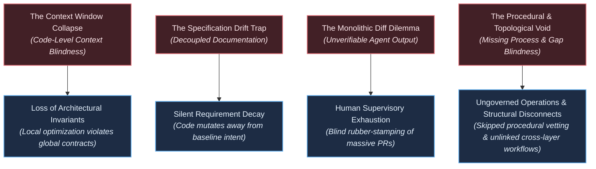
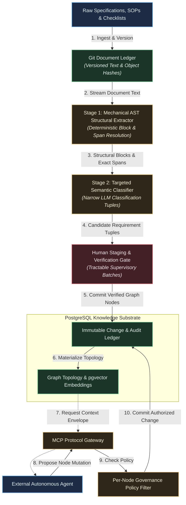
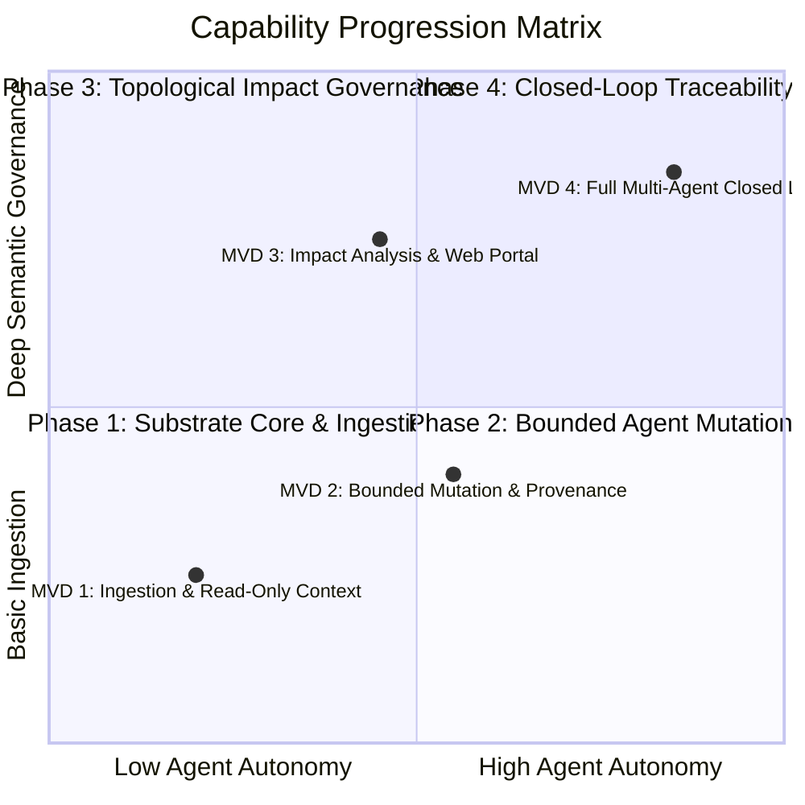

# Technical Vision: The Knowledge Substrate for Agentic Software Engineering

---

## 1. The Problem Space & Current Paradigm Limitations

Autonomous AI agents are increasingly capable of generating functional software modules, yet the medium through which software engineering is organized—unstructured text documents, linear source files, and flat issue trackers—was engineered for human visual scanning, not distributed machine reasoning. Current industry paradigms exhibit four structural failure modes that prevent autonomous agents from operating reliably at enterprise scale:

### The Context Window Collapse (Code-Level Context Blindness)

Contemporary AI-native engineering environments assemble context dynamically via Abstract Syntax Tree (AST) parsing, type-system traversal, symbol grepping, and iterative file exploration. While these techniques significantly surpass naive vector similarity, code-level context assembly remains structurally blind to the intent and requirement layer. Code-level tools can discover what existing code *does*, but they cannot infer what the software is *supposed to do*, why specific architectural invariants exist, or which upstream business requirements govern a component. Lacking a topological requirement substrate, agents assemble context that is locally coherent at the syntax level but blind to systemic architectural contracts, generating code that passes unit tests while violating high-level system invariants.

### The Specification Drift Trap (Decoupled Intent)

In modern delivery lifecycles, project vision documents, product requirements (PRDs), and architectural specifications are write-once artifacts. Once engineering starts, implementation rapidly decouples from documentation. When autonomous agents operate within this disconnected paradigm, every development loop compounds intent decay. Lacking an immutable, queryable link between functional requirements and execution tasks, agents introduce unintended scope, duplicate capabilities, and silently drop edge-case requirements.

### The Monolithic Diff Dilemma (The Human Review Bottleneck)

As agent synthesis speed outpaces human reading capacity, human supervisors face an unscalable verification burden: reviewing massive, multi-file code diffs generated in seconds. Humans cannot verify whether thousands of lines of synthesized code adhere to twenty subtle non-functional constraints, cross-cutting security policies, and accepted product requirements. Software engineering risks shifting from an intentional design discipline into an opaque quality-assurance bottleneck. Crucially, this verification crisis cannot be resolved by simply displacing cognitive fatigue from code diffs to hundreds of isolated, atomized graph candidate nodes; human oversight must be grounded in tractable supervisory granularity.

### The Procedural & Topological Void (Absence of Process and Cross-Layer Gap Blindness)

Software engineering is fundamentally more than a static cascade of functional requirements; it is equally governed by operational procedures, engineering workflows, and cross-layer architectural coherence. When an engineering task requires introducing a new third-party dependency, for example, execution is governed not only by functional utility, but by mandatory institutional procedures: vetting licensing compatibility, evaluating commit frequency and maintenance health, verifying CVE management history, and auditing supply chain blast radius. In flat issue trackers and code-centric agent environments, these operational procedures, checklists, and institutional policies are completely severed from execution context.

Furthermore, existing paradigms lack the topological reachability to detect *architectural gaps*. When traversing a user workflow, engineering teams expect presentation-layer actions to link systematically to corresponding functional specifications, domain logic, and service contracts. Current tooling cannot determine whether those cross-layer links exist, whether critical workflows were ever formally considered, or where systemic omissions lie. Autonomous agents generate code in a procedural and topological vacuum, leaving critical organizational processes unexecuted and architectural discontinuities unflagged until production failure.

### The Specification Void & The Cold-Start Adoption Barrier (The Upstream Intent Prerequisite)

Autonomous agents cannot align with intent if no externalized intent exists. Today, the vast majority of engineering organizations lack structured requirement graphs, relying instead on ephemeral chat threads, fragmented issue tickets, and implicit knowledge in developers' heads. TKS is fundamentally an intent provenance substrate, not an autonomous mind-reader: it solves the structural problem of anchoring agent execution to specifications, but it presupposes that engineering teams possess—or are willing to articulate—text-based specifications. The upfront cognitive and operational investment required to author, decompose, and curate requirement graphs represents an acute adoption cold-start barrier: before the substrate can provide topological guidance, initial intent must be formulated and ingested. TKS directly confronts this barrier via assisted mechanical decomposition, yet the structural boundary remains absolute: without externalized seed specifications, agentic reasoning operates in an intent vacuum.

### The Build-vs-Leverage Imperative (Operational Intent Substrate vs. Code-Level Orchestration & Retrospective ALM)

The contemporary engineering ecosystem presents two divergent paradigms, neither of which addresses the foundational intent-fidelity gap:

1. **AI-Native Development Tools (Thin Code Orchestration):** AI-native IDEs (e.g., Cursor, Windsurf, Devin Desktop) and terminal-first agentic harnesses (e.g., Claude Code, Codex CLI) operate as thin orchestration layers over raw code artifacts. Through Language Server Protocol (LSP) integration, Abstract Syntax Tree (AST) search, and multi-tool agentic retrieval, they excel at discovering and manipulating existing syntax. Even when augmented with automated codebase graph generators (e.g., Graphify, AST knowledge graphs), code-derived graphs merely reflect current syntactic implementation; they remain structurally blind to governing business intent, non-functional requirements, architectural contracts, and organizational procedures. Ad-hoc Model Context Protocol (MCP) bridges to issue trackers or flat documentation stores offer only fragmented, unverified context without topological coherence or mutation governance.
2. **Legacy ALM Platforms (Retrospective Compliance):** Traditional Application Lifecycle Management suites (e.g., IBM DOORS Next, Jama Connect, Siemens Polarion) and issue-tracker traceability matrix plugins treat requirements traceability as a human-facing, retrospective reporting and compliance exercise. They were never designed to serve as an active, sub-second operational substrate for machine agents requiring topological graph traversals, co-located vector search, and transactional mutation governance.

TKS occupies the critical gap between these two extremes: it is neither a code-editing assistant nor a compliance database. It is a purpose-built **knowledge and intent provenance substrate** that anchors external agent reasoning directly to a version-governed property graph of requirements, operational processes, and architectural relationships, supplying the institutional guidance and topological coherence that code-level tooling structurally lacks.

---

## 2. The North Star Vision

### Core Vision Statement

> **Engineer an agent-agnostic knowledge substrate that anchors external AI agents and human teams to a unified, version-governed property graph, establishing end-to-end traceability and bidirectional coherence across institutional knowledge, operational processes, requirements, and executable code.**

### The Core Metaphor: The Substrate as Organization, The Agent as Employee

To crystallize the architectural purpose and operational scope of The Knowledge Substrate, consider an organizational mental model:

* **The Knowledge Substrate is the Organization and its Institutional Memory:** In an engineering enterprise, the organization embodies collective institutional memory, architectural guidelines, standard operating procedures (SOPs), compliance checklists, domain knowledge, regulatory policies, and topological requirement maps. It defines *how* the enterprise builds software, *what* architectural invariants must be preserved, and *which* procedures must be followed. The substrate is durable, authoritative, version-governed, and structured.
* **The LLM Agent is the Employee / Knowledge Worker:** External LLMs play the role of employees operating within the firm. The LLM is not built *into* the substrate's operational engine; rather, it consults the organization. It is guided through the operational landscape by the organization's processes, procedures, checklists, and topological context envelopes, which direct it on how to navigate the engineering terrain and what standards must be satisfied.
* **The Agent as Creative Generator:** Crucially, while the substrate provides the governing scaffolding and institutional guardrails, the LLM remains the *creative generator*—the flexible engine of synthesis, code construction, and novel problem-solving. By decoupling authoritative institutional scaffolding (the substrate) from creative cognitive labor (the external agent), the system empowers autonomous agents to synthesize complex, novel solutions without violating institutional norms, dropping compliance checks, or wandering into architectural drift.

### Key Capabilities

1. **Unified Graph-Relational Substrate:** A PostgreSQL storage layer combining native property graph structures with vector embeddings, modeling vision, requirements, specifications, tasks, and artifacts as a strongly typed, navigable topology.
2. **Document Provenance & Assisted Decomposition Pipeline:** Ingestion of text-based specifications into a Git-backed, content-addressed document store coupled to PostgreSQL, using a two-stage extraction pipeline—mechanical AST structural decomposition followed by targeted cognitive semantic classification—with human review gates to extract structured requirement nodes with verified lineage.
3. **Open Protocol Integration Gateway:** Standardized Model Context Protocol (MCP) and REST interfaces enabling external agent runtimes to retrieve bounded context envelopes and submit proposed graph mutations.
4. **Immutable Audit Ledger & Historical Reversibility:** An append-only audit ledger ensuring every approved requirement, specification, task, and dependency edge is completely reversible, auditable, and point-in-time reconstructible without data loss, while intermediate draft entities undergo lifecycle compaction upon approval to eliminate audit ledger bloat.
5. **Attribute-Based Node Governance:** Granular, per-node governance attributes that dictate whether an entity is open for autonomous agent elaboration or strictly gated by human authorization.
6. **Self-Referential Bootstrapping (Dogfooding Principle):** The capability of the Knowledge Substrate to manage its own development lifecycle via a phased transition: Phase 1 establishes read-only self-hosting for context retrieval, while Phase 2 enables autonomous self-evolution where subsequent roadmap phases, requirements, specifications, and tasks are authored, reviewed, and tracked within the substrate itself.
7. **Tractable Supervisory Granularity:** Structuring human verification gates around cohesive functional modules, document sections, and hierarchical batches rather than isolated relational micro-nodes, presenting candidate entities in the context of their source document spans to ensure supervisory review remains cognitively tractable.
8. **Institutional Process & Procedural Knowledge Modeling:** First-class modeling of engineering processes, Standard Operating Procedures (SOPs), compliance workflows, and verification checklists (e.g., dependency onboarding criteria, licensing audits, CVE management, release checklists) as strongly typed entities linked to requirements, architectural constraints, and execution tasks.
9. **Topological Gap Detection & Coherence Auditing:** Algorithmic and agentic evaluation of graph reachability, layer bindings, and procedural completeness (e.g., discovering presentation-layer user workflows missing functional backend linkages, or tasks lacking mandated verification checklists) through structural graph traversals and external LLM-assisted gap analysis.

### Operational Timescales

| Horizon | Operational Cadence | System Operation |
| --- | --- | --- |
| **Micro-Reflex** | Real-Time / Sub-Second | Graph traversal queries, vector similarity neighbor lookups, and transactional edge validation within PostgreSQL. |
| **Agent Cycle** | Iterative Execution | External agents query context envelopes via MCP, execute local code synthesis, and submit candidate graph mutations. |
| **Supervisory Review** | Deliberative Oversight | Human engineers review extracted requirement drafts, inspect topological impact analyses, and sign off on gated nodes. |
| **Systemic Evolution** | Strategic Progression | Strategic iteration on product roadmaps, high-level vision revisions, and schema attribute extensions across the project lifecycle. |

### Conceptual Grounding

To maintain engineering precision, all structural concepts are anchored in standard software engineering and project management terminology:

| System Concept | Concrete Engineering Specification |
| --- | --- |
| **Knowledge Substrate** | The authoritative living property graph uniting graph topologies, dense vector indices (`pgvector`), and relational audit tables in an ACID-compliant PostgreSQL store. |
| **Document Ledger** | A Git-backed, content-addressed artifact store serving as an immutable historical intake ledger and baseline reference archive for text-based specifications, as well as a projection target for graph-exported artifacts. |
| **Topological Context Envelope** | A directed subgraph query centered on an assigned task node, aggregating ancestor requirements, applicable procedural checklists, and sibling constraints into a bounded prompt context. |
| **Per-Node Governance Policy** | Metadata attributes stored on individual graph nodes designating the operational authorization level (`AUTONOMOUS_ELABORATION`, `HUMAN_REVIEW_REQUIRED`, `LOCKED`). |
| **Self-Referential Engine** | The application of the Knowledge Substrate to its own codebase and lifecycle, establishing a closed feedback loop where the tool governs its own evolution. |
| **Tractable Supervisory Unit** | A cohesive, hierarchical batch of candidate graph nodes presented in source document context for human verification, preventing supervisory review exhaustion. |
| **Procedural Entity & Checklist Node** | Strongly typed graph nodes representing operational workflows, Standard Operating Procedures (SOPs), and compliance checklists (e.g., dependency vetting for licensing, maintenance cadence, and CVEs) required to authorize task completion. |
| **Topological Gap Analysis** | Structural and semantic graph traversal algorithms paired with external LLM auditing to detect architectural discontinuities (e.g., presentation actions lacking functional backend bindings) or omitted procedural steps. |
| **Organizational Knowledge Metaphor** | The foundational design paradigm wherein the substrate acts as the authoritative organization/playbook and external agents act as employees/creative generators navigating its guidance. |

---

## 3. Environmental & Boundary Contracts

The Knowledge Substrate operates strictly within the following architectural boundaries:

```mermaid
%%{init: {
  'theme': 'base',
  'themeVariables': {
    'darkMode': true,
    'background': '#161922',
    'mainBkg': '#1e2230',
    'nodeBorder': '#434c5e',
    'textColor': '#e2e8f0',
    'fontFamily': 'ui-sans-serif, system-ui, -apple-system, BlinkMacSystemFont, "Segoe UI", Roboto, "Helvetica Neue", Arial, sans-serif',
    'fontSize': '14px',
    'lineColor': '#8892b0',
    'primaryColor': '#422026',
    'primaryTextColor': '#fde8ec',
    'primaryBorderColor': '#e06c75',
    'secondaryColor': '#1b3528',
    'secondaryTextColor': '#e6f7ee',
    'secondaryBorderColor': '#73c991',
    'tertiaryColor': '#1d2c44',
    'tertiaryTextColor': '#e4f0fc',
    'tertiaryBorderColor': '#61afef',
    'clusterBkg': '#13161f',
    'clusterBorder': '#373e51',
    'noteBkgColor': '#2e271a',
    'noteTextColor': '#fdf4db',
    'noteBorderColor': '#e5c07b',
    'edgeLabelBackground': '#1a1d27'
  }
}}%%
flowchart LR
    classDef secondary fill:#1b3528,stroke:#73c991,stroke-width:1.5px,color:#e6f7ee;
    classDef tertiary fill:#1d2c44,stroke:#61afef,stroke-width:1.5px,color:#e4f0fc;

    subgraph External["External Runtime Boundary"]
        Agents["External Agent Ecosystem<br/><i>(Claude Code, Custom LLM Runners, Aider)</i>"]:::tertiary
        Users["Human Engineering Teams<br/><i>(Web UI, CLI, IDE Extensions)</i>"]:::tertiary
    end

    subgraph Substrate["The Knowledge Substrate"]
        Gateway["Integration Gateway<br/><i>(MCP Server & REST API)</i>"]:::secondary
        Governance["Governance & Lineage Engine"]:::secondary
        PostgresStorage["PostgreSQL Substrate<br/><i>(Property Graph + pgvector + Audit Ledger)</i>"]:::secondary
        GitStore["Git Document Ledger<br/><i>(Text Specifications & Revision History)</i>"]:::secondary

        Gateway --> Governance --> PostgresStorage
        Gateway --> GitStore
        PostgresStorage -.->|"Relational Refs & Hashes"| GitStore
    end

    Agents <-->|"Model Context Protocol / JSON-RPC"| Gateway
    Users <-->|"REST API / HTTPS"| Gateway
```

* **Resource-Constrained Execution Model:** The project operates under an explicitly constrained resource model. The phased roadmap is engineered so that each progression phase delivers standalone operational value and can be evaluated or falsified independently. Phase 0 and Phase 1 are scoped to be achievable by a small team (or individual developer) utilizing commodity infrastructure. Subsequent milestones (Phases 3 and 4) are aspirational targets whose investment is strictly contingent on the demonstrated viability and dogfooding adoption of earlier phases.
* **Specification Prerequisite & Cold-Start Operational Boundary:** The Knowledge Substrate operates on the foundational premise that human engineering teams provide or curate text-based specifications (PRDs, architecture RFCs, SOPs). TKS is not an autonomous requirements generator or reverse-engineering scanner; it anchors execution to externalized human intent. For teams lacking documented specifications, the initial value curve exhibits an inevitable cold-start barrier: the substrate requires upfront specification intake before downstream agent leverage is realized. Minimizing this cold-start latency through low-friction assisted decomposition is a primary architectural imperative, but the prerequisite of documented intent is an explicit environmental boundary.
* **Single-Engine Operational Footprint:** All topology data, vector embeddings, relational metadata, and audit records reside in a single PostgreSQL instance. Distributed multi-database setups (e.g., maintaining an external vector database or separate graph DBMS alongside PostgreSQL) are prohibited, eliminating distributed transaction failures and synchronization drift. Raw text specifications are version-governed via Git and referenced relationally.
* **Externalized Cognitive Compute:** The core Knowledge Substrate never directly invokes LLM inference for its internal operational loops. External agents supply their own compute and models. LLM interaction with the substrate is restricted to human-directed document ingestion and decomposition pipelines, and externalized analytical agents or supervisory copilots consulted as third-party auditors (e.g., traversing graph subgraphs to discover architectural gaps, missing cross-layer bindings, or unconsidered edge cases). The substrate database engine remains strictly deterministic and inference-free.
* **Stateless Gateway Boundary:** The MCP and REST interfaces maintain no persistent session memory. Each operation is an authenticated, isolated transaction targeting explicit node identifiers and payloads. The gateway must validate caller identity on every request; no mutation may be committed to the audit ledger without a verified external identity reference.
* **Document Immutability & Provenance Guarantee:** Uploaded text specifications (Markdown, plain text) are stored in a Git-backed document repository and content-addressed via cryptographic hashes, serving as an immutable historical intake ledger and baseline reference archive. The PostgreSQL Property Graph is the sole authoritative living substrate for active project intent, requirements, governance states, and execution tasks. Text specifications in Git represent seed artifacts and point-in-time projection targets (i.e., human-readable Markdown can be synthesized and exported *from* the living graph), eliminating the fragility and overhead of bidirectional document-graph synchronization. Requirements derived from ingested documents reference the document commit/blob identity and source character spans. Span stability, deterministic boundary re-anchoring, and revision reconciliation are managed at the strategic implementation level.
* **Schema Flexibility via Progressive Layering:** Core system tables enforce only foundational structural and procedural edges (`DERIVED_FROM`, `CONSTRAINED_BY`, `FULFILLS`, `VERIFIED_BY`, `GOVERNED_BY_PROCEDURE`, `BINDS_LAYER`). Domain-specific attributes, checklists, and evolving project taxonomy are managed via typed JSONB fields to avoid costly schema migrations during early project phases.
* **Bootstrap Boundary Contract:** Initial system design and Phase 0 development occur using conventional developer tooling. The bootstrapping transition proceeds across two distinct gates:
  1. *Phase 1 Dogfooding Gate (Read-Only Self-Hosting):* Upon completing foundational ingestion and context retrieval, the project's own documentation (`vision.md`, backlogs) is ingested into the substrate; human developers and external agents retrieve context envelopes via the read-only MCP gateway to implement Phase 2 tasks.
  2. *Phase 2 Dogfooding Gate (Autonomous Self-Evolution):* Once mutation-enabled tools, draft lifecycle handling, and governance filters are operational, all subsequent feature requirements, architectural adjustments, and tasks must be authored, reviewed, and governed directly within the substrate itself.

---

## 4. System Topology & Information Flow

The architecture is organized around two decoupled operational loops: the **Document Ingestion & Decomposition Pipeline** and the **Agent Execution & Governance Loop**.

### Conceptual Operational Loops

1. **Document & Institutional Knowledge Ingestion Loop:**
   Ingests text specifications, engineering SOPs, and procedural checklists into the Git document ledger as immutable baseline references. Decomposes documents through a two-stage extraction architecture: *Stage 1 (Mechanical AST Structural Extraction)* deterministically segments structural blocks (headings, lists, tables) and resolves exact source character spans at zero token cost; *Stage 2 (Targeted Cognitive Semantic Classification)* invokes narrow LLM inference solely to classify ambiguous candidates into compact relational tuples (requirements, constraints, procedural steps, checklists) without echoing source text. Candidate nodes are staged in hierarchical batches representing cohesive functional sections to maintain tractable supervisory granularity. Verified nodes are committed to PostgreSQL with cryptographic source span links.
2. **Agent Context Retrieval & Governed Mutation Loop:**
   Provides external autonomous agents with bounded topological context envelopes via the Model Context Protocol (MCP). Context envelopes package active requirements, applicable procedural checklists (e.g., dependency onboarding criteria, CVE checks, licensing verification), and sibling architectural constraints. Agents execute tasks within their external runtimes and propose candidate graph mutations back through the gateway, where per-node governance policies either commit mutations to an isolated draft lifecycle (subject to atomic event compaction upon approval) or route them to human staging, preventing unauthorized mutations and audit ledger bloat.
3. **Topological Coherence & Gap Auditing Loop:**
   Traverses the property graph via explicit edge traversals and semantic vector neighborhoods to identify systemic omissions and discontinuities. For example, during workflow evaluations, the system inspects whether presentation-layer UI actions maintain valid topological linkages to corresponding backend functions and contracts. Graph algorithms and external LLM agents (consulted as third-party analytical auditors) evaluate structural completeness, flag missing cross-layer bindings, and verify that all prerequisite procedural checklists were satisfied before execution proceeds.

*(Note: Detailed step-by-step API message protocols and interaction sequences are cataloged in the [Strategic Planning Backlog](docs/vision/strategic-planning-backlog.md).)*

---

## 5. Invariants, Boundary Constraints & Hypotheses

### Architectural Invariants (Engineering Directives)

* **Invariant I-1 (Strict Bidirectional Traceability & Procedural Grounding):** Every functional specification, implementation task, and code artifact reference must maintain a valid, directed edge path terminating at an authorized requirement node. Furthermore, execution tasks involving institutional procedures (e.g., introducing third-party dependencies, altering security boundaries) must maintain explicit dependency edges to applicable procedural policy and checklist nodes. Orphan execution tasks and ungoverned procedural actions are rejected at the database constraint level.
* **Invariant I-2 (Auditability & Reversible Lineage):** Destructive in-place updates (`UPDATE` or `DELETE`) on approved requirements, specifications, and topological edges are strictly prohibited. State transitions across approved entities must be recorded such that every state mutation is fully auditable, reversible, and point-in-time reconstructible without data loss. Draft entities and exploratory agent proposals reside in an isolated draft lifecycle and are subject to lifecycle compaction (squashed into a single canonical audit event upon promotion to active status), preventing audit ledger exhaustion while preserving complete lineage of approved baselines. The specific versioning and compaction mechanisms are resolved at the strategic planning level.
* **Invariant I-3 (Zero In-Database Agent Execution):** The core database engine and gateway services shall never execute autonomous agent cognitive loops internally. The substrate functions strictly as a deterministic state store and protocol gateway.
* **Invariant I-4 (Cryptographic Source Anchoring):** Every requirement derived via the decomposition pipeline must store a persistent cryptographic reference (Git commit/blob hash) and source span coordinates pointing to the original document artifact.
* **Invariant I-5 (Explicit Per-Node Governance Authority):** Permissions to alter or elaborate a node are governed by explicit per-node metadata attributes (`governance_policy`). Node-level policies take absolute precedence over global agent roles.
* **Invariant I-6 (Self-Referential Bootstrapping & Multi-Agent Co-Evolution):** The Knowledge Substrate must be used to manage its own development through a phased bootstrapping transition. Upon completing Phase 1 foundational ingestion and read-only context retrieval, the substrate self-hosts its own documentation for context querying. Upon completing Phase 2 mutation tooling and governance, all subsequent feature requirements, architectural adjustments, and development tasks are authored, reviewed, and tracked directly within the substrate itself. Upon completing Phase 3, the substrate supports concurrent multi-agent co-evolution within branch workspace containers, automated invalidation cascades, and reverification recovery under topological conflict resolution (Gate 3).
* **Invariant I-7 (Agent Identity Attribution & Workspace Draft Isolation):** Every mutation and candidate draft submitted through the Integration Gateway must be attributable to a verified external identity (human user or autonomous agent instance) stamped with `created_by` and recorded in the audit ledger (`actor_id`, `actor_type`, `token_fingerprint`). Candidate entities elaborated within ephemeral branch workspace containers (`attributes->'workspace_id'`) are strictly confidential and isolated from the live substrate and peer workspaces (INV-7, DEC-3.5), visible dynamically only to the authoring agent session until verified and atomically promoted under canonical lock serialization. Identity credentials must be validated on every mutation request; revocation must immediately invalidate local cache entries across running services.

### Strategic Hypotheses (Scientific Bets to De-Risk)

* **Hypothesis H-1 (Governed Requirement Topologies vs. Ad-Hoc Agentic Retrieval):**
  *We hypothesize that* anchoring external agents to a *purpose-built, version-governed, human-curated* requirement graph provides decisive advantage over best-available code-level agentic context assembly—including multi-tool code exploration, AST symbol traversal, and ad-hoc or auto-generated code knowledge graphs lacking requirement provenance—by supplying authoritative intent provenance, operational policies, and audit lineage that code-level syntax exploration structurally lacks, thereby significantly reducing downstream architectural contract violations and intent drift.
* **Hypothesis H-2 (Sublinear Human Oversight Overhead):**
  *We hypothesize that* managing autonomous agents through structured requirement graphs and topological impact analyses significantly reduces human supervisory overhead compared to manual inspection of agent-generated code diffs.
* **Hypothesis H-3 (Single-Engine Relational Scalability):**
  *We hypothesize that* a single PostgreSQL instance combining graph query patterns and `pgvector` scales comfortably to support large-scale enterprise project graphs without requiring dedicated graph or vector database clusters.
* **Hypothesis H-4 (Assisted Ingestion Accuracy):**
  *We hypothesize that* a human-in-the-loop decomposition pipeline powered by commodity LLMs achieves high-fidelity requirement extraction from unstructured technical markdown without requiring proprietary parsing tools.
* **Hypothesis H-5 (Topological Gap Detection & Procedural Scaffolding):**
  *We hypothesize that* structuring institutional procedures (such as dependency onboarding, licensing verification, and CVE audits) and cross-layer architectural contracts as a navigable property graph allows structural traversals combined with external LLM-in-the-loop auditing to detect systemic gaps (such as unlinked UI-to-backend workflows or unvetted third-party libraries) significantly earlier than conventional PR reviews, while reducing agent procedural non-compliance.

*(Note: Quantitative calibration targets and metric benchmarks for each hypothesis are cataloged in the [Strategic Planning Backlog](docs/vision/strategic-planning-backlog.md).)*

### Inside-Out Mechanics to Outside-In Strategic Leverage

| Architectural Mechanism (Inside-Out) | Strategic & Economic Leverage (Outside-In) |
| --- | --- |
| **Agent-Agnostic Protocol Gateway (MCP / REST)** | **Vendor Decoupling & Model Arbitrage:** The enterprise can adopt emerging LLM models and specialized external agent frameworks without modifying the underlying project knowledge base or business logic. |
| **Unified PostgreSQL Engine** | **Operational Economy & Zero Infrastructure Sprawl:** Utilizes proven enterprise database tooling for backup, replication, security, and compliance, avoiding the operational cost of multi-database synchronization. |
| **Git-Backed Document Ledger** | **Proven Versioning & Transparent Text Diffing:** Leverages industry-standard VCS infrastructure for text artifact versioning and delta compression, seamlessly integrating with existing developer workflows. |
| **Per-Node Governance Controls** | **Controlled Scaling of Autonomous Capacity:** Engineering leadership can progressively delegate lower-risk system layers to autonomous agents while enforcing strict human oversight over mission-critical components. |
| **Self-Referential Architecture** | **Accelerated Dogfooding & Grounded Viability:** Forcing the system to manage its own development exposes UX friction and semantic gaps early, ensuring the product solves real engineering problems. |
| **First-Class Procedural & Gap Modeling** | **Institutional Continuity & Proactive Quality Assurance:** Encodes corporate development standards and cross-layer architectural checks into the active operational graph, preventing autonomous agents from cutting procedural corners or generating disconnected software layers. |

---

## 6. Multi-Axis Progression Model

Program advancement is organized across two orthogonal vectors: **Governance & Provenance Maturity** and **Agent Autonomy & Integration Breadth**.

### Capability Progression Dimensions

1. **Governance & Provenance Maturity (Y-Axis):**
   Advances from basic text specification ingestion and cryptographic anchoring, through procedural checklist enforcement and automated invalidation cascading, to end-to-end cross-layer gap auditing and spec-to-commit verification.
2. **Agent Autonomy & Integration Breadth (X-Axis):**
   Advances from read-only topological context retrieval via MCP, to bounded agent elaboration of sub-tasks and procedural verification, and finally to distributed multi-agent collaborative execution and automated PR reconciliation.

### The Bootstrapping Progression Strategy

To honor the principle to "start small" under a constrained resource model, development follows a strict self-referential bootstrapping path where each milestone delivers standalone utility before subsequent phases are attempted:

* **Phase 0 Baseline:** Initial architecture and storage foundations are built externally using standard tools. Phase 0 additionally includes lightweight evaluation spikes to generate early directional signal on the highest-risk strategic hypotheses (H-1, H-4), reducing the probability of significant infrastructure investment on unvalidated premises.
* **Phase 1 Self-Hosting Gate (Read-Only Context Retrieval):** Upon completing the core ingestion and read-only MCP gateway, the project's own documentation (`vision.md`, backlogs) is ingested into the substrate. Developers and external agents query bounded context envelopes via MCP to implement Phase 2 development tasks.
* **Phase 2+ Evolution Gate (Autonomous Self-Evolution):** With mutation tools, draft lifecycle handling, and per-node governance operational, all subsequent requirements, specifications, and tasks are authored, reviewed, and tracked directly within the substrate itself, using autonomous agents operating via MCP to advance the codebase. Phases 3 and 4 remain aspirational targets contingent on the demonstrated operational viability of earlier phases.

*(Note: Specific phase deliverables, engineering schedules, and operational dependencies are detailed in the [Strategic Planning Backlog](docs/vision/strategic-planning-backlog.md).)*

---

## 7. Directional Gating & Governance

### Key Observables

Progression across capability milestones is evaluated using seven directional metrics:

* **Retrieval Boundedness & Relevance:** Ratio of required context tokens delivered to external agents versus irrelevant noise, measuring the efficiency of the topological context envelope.
* **Decomposition Lineage Fidelity:** Percentage of extracted requirement nodes that correctly resolve to exact, verifiable source spans within the signed source documents.
* **Drift & Invalidation Velocity:** Latency from the moment a parent requirement is modified to the complete identification and flagging of all invalidated downstream tasks.
* **Supervisory Decision Latency:** Time required for an engineering lead to evaluate, approve, or reject an agent-proposed requirement mutation via the supervisory interface.
* **Topological Gap Detection Yield & Precision:** Ratio of verified architectural gaps (e.g., missing layer bindings, orphan workflows, unconsidered edge cases) identified by graph traversal and LLM auditing relative to total flagged anomalies.
* **Procedural Compliance Fidelity:** Percentage of agent-elaborated tasks (e.g., dependency additions, architecture extensions) that demonstrably satisfy institutional checklists before promotion to human review.
* **Time-to-First-Value Latency:** Elapsed wall-clock and supervisory time from initial repository deployment to the first verified agent task execution guided by a substrate context envelope, measured starting from unstructured seed text or zero ingested specifications, quantifying and bounding the cold-start adoption barrier.

### Demonstration Milestones (MVD Overview)

The path to the North Star is gated by four Minimum Viable Demonstrations:

* **Milestone 1 (Ingest, Version, and Retrieve):** Ingestion of a Markdown specification into the Git document store, assisted decomposition into graph requirement nodes with cryptographic parent links, and successful retrieval of bounded topological context envelopes by an external agent via MCP.
* **Milestone 2 (Bounded Mutation & Clean Rollback):** An external agent proposes child specifications via MCP, governed by per-node policy attributes, with full capability for a human supervisor to execute a clean graph rollback to a historical snapshot.
* **Milestone 3 (Automated Invalidation Cascading & Gap Auditing):** Modification of an upstream requirement automatically cascades downstream, marking dependent specifications and tasks as requiring reverification, while topological traversal and external LLM auditing identify missing cross-layer links (e.g., presentation-to-backend gaps) and unfulfilled procedural checklists, blocking unauthorized agent execution.
* **Milestone 4 (Closed-Loop Traceability):** Bidirectional synchronization mapping Git commits and automated test results to leaf requirement nodes, providing continuous proof of requirement satisfaction.

*(Note: Detailed execution scripts and verification procedures for each demonstration are documented in the [Strategic Planning Backlog](docs/vision/strategic-planning-backlog.md).)*

### Falsification & Termination Criteria (Kill Conditions)

The program should be halted, redirected, or fundamentally restructured if any of the following failure conditions occur:

1. **The Ingestion Friction & Cold-Start Falsification:**
   If the total lifecycle overhead of formulating, ingesting, decomposing, and verifying specifications in the graph—measured from zero structured intent to the first usable context envelope—consistently exceeds the manual effort required for engineering teams to write tickets, prompt agents ad-hoc, and supervise code, the core economic premise of an automated knowledge substrate is disproven.
2. **The Graph RAG Inefficacy Falsification (Hypothesis H-1 Failure):**
   If controlled benchmarks reveal that external agents operating over governed, graph-structured context envelopes exhibit no statistically significant advantage in preserving architectural contracts and preventing intent drift compared to agents using best-available multi-tool retrieval or auto-generated code graphs lacking requirement provenance, the graph-native intent thesis is falsified.
3. **The Single-Engine Relational Bottleneck (Hypothesis H-3 Failure):**
   If graph traversals over versioned tables in PostgreSQL fail to maintain acceptable interactive latencies at scale, and this bottleneck cannot be resolved through index optimization, the single-engine architectural boundary must be abandoned in favor of a specialized graph database.
4. **The Bootstrapping Failure Falsification:**
   If the development team cannot dogfood the Knowledge Substrate to manage its own post-Phase-1 development tasks and specifications due to operational friction or semantic inadequacy, the core premise of an agentic engineering substrate is falsified.

### Graduated Response to Partial Validation

If empirical results partially validate a strategic hypothesis—delivering measurable but below-target improvements—the appropriate response is scope adjustment rather than program termination. Partial validation may warrant narrowing the target domain (e.g., focusing on projects with specific structural characteristics where graph retrieval demonstrably excels), adjusting calibration targets, or hybridizing approaches. Kill conditions are triggered only when results show no statistically significant improvement over the baseline, or when the overhead of the substrate demonstrably exceeds the value it provides.

### Strategic Planning Handoff

Detailed database table definitions, API route contracts, specific embedding model selections, architectural evaluation spikes, and phased implementation roadmaps are maintained in the [Strategic Planning Backlog](docs/vision/strategic-planning-backlog.md).
